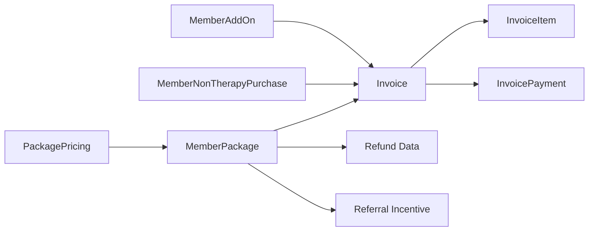
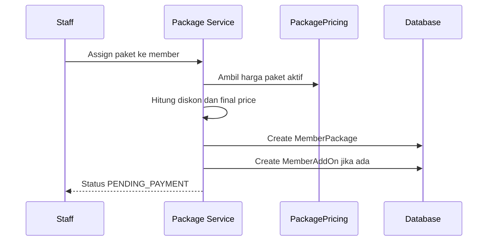
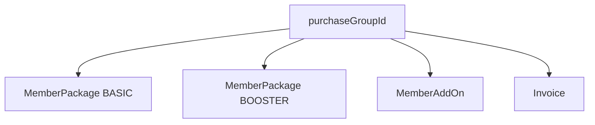
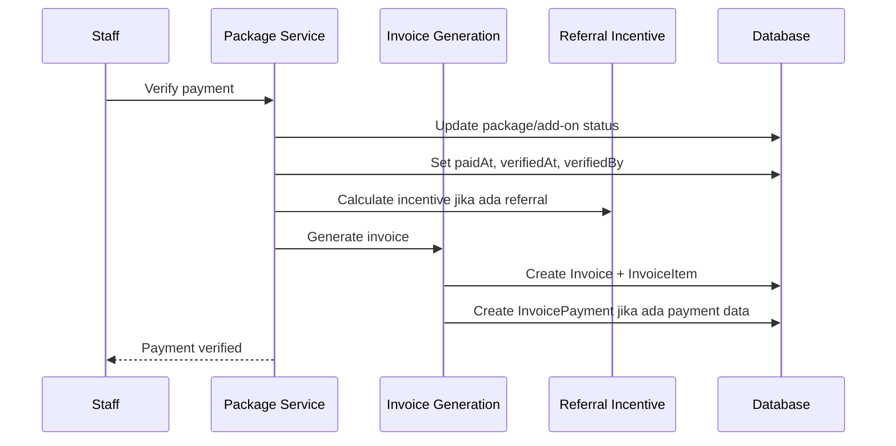
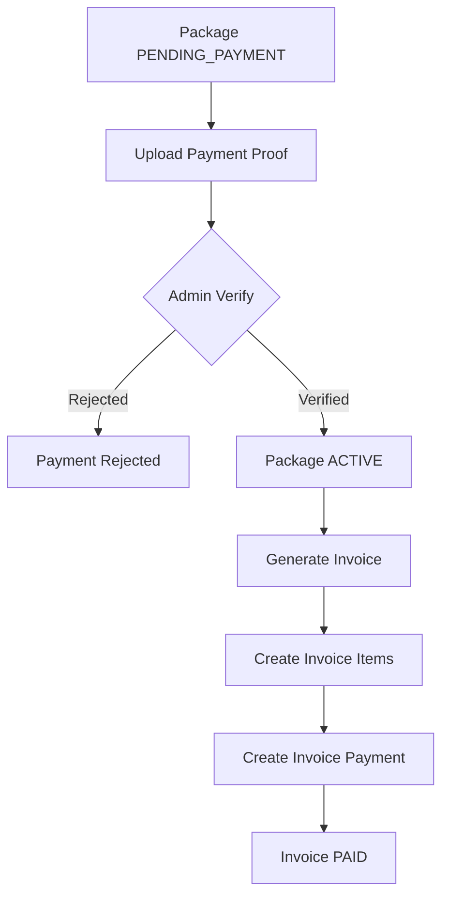
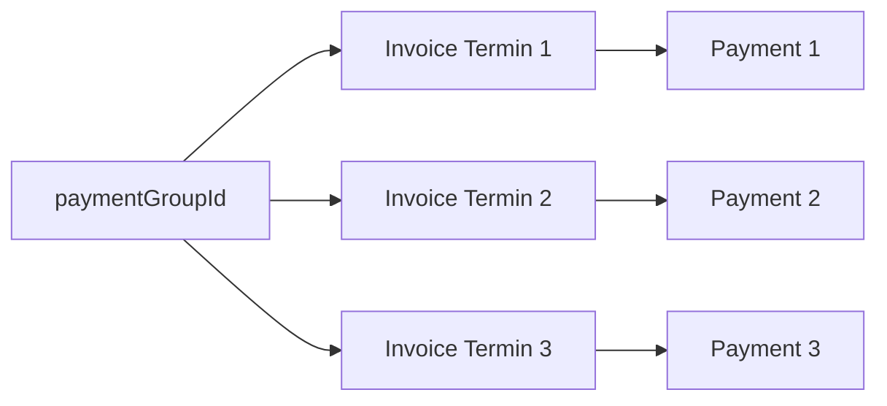

# 03 - Commercial and Billing

Dokumen ini menjelaskan domain **Commercial and Billing** pada sistem RAHO. Domain ini mencakup harga paket, pembelian paket terapi, add-on, produk non-terapi, bukti pembayaran, verifikasi pembayaran, invoice, installment, refund, dan pencatatan pembayaran.

## Ringkasan

Commercial and Billing adalah domain yang mengubah layanan klinik menjadi transaksi keuangan yang dapat dilacak. Alur dimulai dari master harga (`PackagePricing`), lalu paket atau produk di-assign ke member, pembayaran diverifikasi, invoice dibuat, dan payment record disimpan.

Secara sederhana:



## Tujuan Domain

Domain ini memiliki beberapa tujuan utama:

- Menyimpan master harga per cabang atau harga global.
- Mencatat pembelian paket terapi oleh member.
- Mendukung bundling `BASIC` dan `BOOSTER`.
- Mendukung add-on dan produk non-terapi.
- Mengelola diskon persen dan diskon nominal.
- Mengelola full payment dan installment.
- Mencatat bukti pembayaran.
- Mengaktifkan paket setelah pembayaran diverifikasi.
- Membuat invoice dan invoice item.
- Mencatat pembayaran invoice.
- Mendukung cancel dan refund dengan audit trail.

## Entitas Utama

| Entitas | Fungsi |
|---|---|
| `PackagePricing` | Master harga paket, bisa global atau khusus cabang. |
| `MemberPackage` | Paket terapi yang sudah dibeli atau di-assign ke member. |
| `MemberAddOn` | Add-on tambahan yang dibeli member. |
| `NonTherapyProduct` | Master produk non-terapi. |
| `MemberNonTherapyPurchase` | Pembelian produk non-terapi oleh member. |
| `Invoice` | Dokumen tagihan/transaksi pembayaran. |
| `InvoiceItem` | Rincian item dalam invoice. |
| `InvoicePayment` | Catatan pembayaran invoice. |
| `ReferralIncentiveRecord` | Insentif referral yang dapat terbentuk saat paket diverifikasi. |

## Commercial Flow

Commercial flow adalah alur dari pemilihan produk sampai transaksi siap ditagihkan.



Tahapan umumnya:

1. Staff memilih member.
2. Staff memilih paket, add-on, atau produk.
3. Sistem mengambil harga dari master pricing atau menerima custom price jika didukung flow.
4. Sistem menghitung diskon.
5. Sistem membuat transaksi dengan status awal `PENDING_PAYMENT`.
6. Member atau staff mengunggah bukti pembayaran.
7. Admin melakukan verifikasi pembayaran.
8. Sistem mengaktifkan paket dan membuat invoice.

## Package Pricing

`PackagePricing` adalah master harga paket.

Field penting:

| Field | Penjelasan |
|---|---|
| `branchId` | Jika `null`, harga bersifat global. Jika terisi, harga khusus cabang. |
| `packageType` | `BASIC` atau `BOOSTER`. |
| `boosterType` | Kode booster seperti `NO`, `GT`, `MB`, `KCL`, `H2S`, `HK`, `O3`, atau custom. |
| `serviceType` | Kode service type, misalnya `HC`, `PS`, `PHC`, `PTY`, `PDA`. |
| `productCode` | Kode produk/paket, misalnya `TNB-P7-HC` atau `BST-NO-P1-HC`. |
| `name` | Nama paket. |
| `totalSessions` | Jumlah sesi dalam paket. |
| `price` | Harga master. |
| `isActive` | Menentukan apakah harga dapat dipilih saat assign paket. |

Aturan penting:

- Harga bisa global atau branch-specific.
- Kombinasi identitas pricing harus unik.
- Pricing nonaktif tidak seharusnya muncul di dropdown assign.
- Harga cabang lebih spesifik daripada harga global.

## Package Type

| Package Type | Penjelasan |
|---|---|
| `BASIC` | Paket terapi utama dengan jumlah sesi tertentu. |
| `BOOSTER` | Paket booster tambahan, biasanya terkait substansi atau service tertentu. |

Contoh `BASIC`:

- TNB-P7
- TNB-P10
- TNB-P15
- TNB-P20

Contoh `BOOSTER`:

- `NO` - Nitric Oxide
- `GT` - Gasotransmitter
- `MB` - Methylene Blue
- `KCL` - Potassium Chloride
- `H2S` - Hydrogen Sulfide
- `HK` - H2O Konsentrat
- `O3` - Ozone

## Member Package

`MemberPackage` adalah paket yang sudah dibeli atau di-assign ke member.

Field penting:

| Field | Penjelasan |
|---|---|
| `packageCode` | Kode paket member yang unik. |
| `memberId` | Member pemilik paket. |
| `branchId` | Cabang tempat paket dibeli. |
| `packagePricingId` | Referensi ke master pricing, opsional. |
| `packageType` | `BASIC` atau `BOOSTER`. |
| `productCode` | Kode produk/paket. |
| `totalSessions` | Total sesi paket. |
| `usedSessions` | Jumlah sesi yang sudah digunakan. |
| `finalPrice` | Harga final setelah diskon. |
| `discountPercent` | Diskon dalam persen. |
| `discountAmount` | Diskon nominal. |
| `discountNote` | Catatan diskon. |
| `status` | Status paket. |
| `paymentPlanType` | `FULL_PAYMENT` atau `INSTALLMENT`. |
| `totalVerifiedPaid` | Total pembayaran yang sudah diverifikasi. |
| `purchaseGroupId` | Group untuk bundling BASIC + BOOSTER. |
| `paymentProofUrl` | File bukti pembayaran. |
| `refundAmount` | Nominal refund. |
| `refundReason` | Alasan refund. |

## Status Paket

| Status | Makna |
|---|---|
| `PENDING_PAYMENT` | Paket sudah dibuat, belum dibayar atau belum diverifikasi. |
| `WAITING_VERIFICATION` | Bukti pembayaran sudah masuk dan menunggu verifikasi. |
| `ACTIVE` | Pembayaran valid, paket dapat digunakan untuk sesi. |
| `EXPIRED` | Paket sudah melewati masa berlaku atau tidak dapat digunakan lagi. |
| `CANCELLED` | Paket dibatalkan. |

Aturan umum:

- Paket baru dibuat sebagai `PENDING_PAYMENT`.
- Paket `PENDING_PAYMENT` dapat diedit atau dibatalkan.
- Paket menjadi `ACTIVE` setelah pembayaran diverifikasi.
- Paket `ACTIVE` tidak seharusnya diedit sebagai transaksi biasa.
- Paket `ACTIVE` dapat direfund dengan flow khusus.

## Bundling

Bundling dipakai ketika member membeli beberapa item dalam satu transaksi, misalnya paket `BASIC` dan `BOOSTER` bersamaan.

Konsep utamanya:

- Semua item dalam bundle memakai `purchaseGroupId` yang sama.
- Diskon bisa diterapkan pada total bundle.
- Invoice dapat mengambil semua item dalam group yang sama.
- Referral incentive untuk bundle dibuat satu kali agar tidak terjadi duplikasi.



## Add-On

`MemberAddOn` mencatat layanan atau produk tambahan yang dibeli member.

Field penting:

| Field | Penjelasan |
|---|---|
| `addOnCode` | Kode add-on unik. |
| `memberId` | Member pembeli. |
| `branchId` | Cabang transaksi. |
| `packageId` | Paket terkait jika add-on dibeli bersama paket. |
| `addOnType` | Jenis add-on. |
| `quantity` | Jumlah. |
| `pricePerUnit` | Harga per unit. |
| `totalPrice` | Total harga. |
| `status` | Status pembayaran add-on. |
| `paymentPlanType` | Full payment atau installment. |

Contoh add-on:

- `AIR_NANO`
- `KONSULTASI_GIZI`
- `KONSULTASI_PSIKOLOG`
- `ROKOK_KENKOU`
- `LAINNYA`

## Non-Therapy Purchase

Produk non-terapi dipisahkan dari paket terapi.

Entitas yang terlibat:

- `NonTherapyProduct` sebagai master produk.
- `MemberNonTherapyPurchase` sebagai transaksi pembelian member.

Contoh field transaksi:

| Field | Penjelasan |
|---|---|
| `purchaseCode` | Kode pembelian unik. |
| `memberId` | Member pembeli. |
| `branchId` | Cabang transaksi. |
| `productId` | Produk non-terapi yang dibeli. |
| `quantity` | Jumlah. |
| `pricePerUnit` | Harga per unit. |
| `totalPrice` | Total harga. |
| `status` | Status pembayaran. |
| `paymentProofUrl` | Bukti pembayaran. |

## Diskon dan Final Price

Diskon dapat berupa persen, nominal, atau gabungan keduanya.

Rumus umum:

```text
percentDiscount = basePrice * discountPercent / 100
totalDiscount = percentDiscount + discountAmount
finalPrice = basePrice - totalDiscount
```

Aturan desain:

- `discountPercent` menyimpan diskon persentase.
- `discountAmount` menyimpan diskon nominal akhir atau komponen nominal.
- `discountNote` menyimpan alasan atau konteks diskon.
- `finalPrice` menjadi nilai transaksi yang ditagihkan.

## Payment Plan

Sistem mendukung dua tipe payment plan:

| Payment Plan | Makna |
|---|---|
| `FULL_PAYMENT` | Pembayaran penuh dalam satu invoice/payment. |
| `INSTALLMENT` | Pembayaran bertahap dalam beberapa termin. |

Field installment yang penting:

| Field | Penjelasan |
|---|---|
| `installmentTotal` | Total jumlah termin. |
| `installmentSchedule` | Jadwal dan nominal termin dalam bentuk JSON. |
| `paymentPlanStatus` | Status internal payment plan. |
| `totalVerifiedPaid` | Total pembayaran yang sudah diverifikasi. |
| `paymentGroupId` | Group invoice untuk cicilan yang sama. |
| `installmentNumber` | Nomor termin invoice. |
| `installmentAmount` | Nominal termin invoice. |

## Payment Proof

Bukti pembayaran dapat disimpan pada paket, add-on, produk non-terapi, dan invoice payment.

Field umum:

- `paymentProofUrl`
- `paymentProofFileName`
- `paymentProofFileSize`
- `paymentProofMimeType`

Pada `InvoicePayment`, field bukti pembayaran memakai prefix `proofFile`.

Tujuannya:

- Menyimpan bukti transfer atau pembayaran.
- Memudahkan admin melakukan verifikasi manual.
- Menjadi audit trail pembayaran.

## Payment Verification

Verifikasi pembayaran adalah proses yang mengubah transaksi dari pending menjadi aktif/paid.



Efek utama verifikasi:

- Status paket berubah menjadi `ACTIVE`.
- `paidAt`, `verifiedAt`, dan `verifiedBy` diisi.
- Invoice dibuat atau diperbarui.
- Payment record dibuat.
- Referral incentive dihitung jika member memiliki referral.
- Audit log dibuat.

Jika pembayaran ditolak:

- Status dapat tetap pending atau masuk state rejection sesuai service.
- `rejectedBy`, `rejectedAt`, dan `rejectionReason` dicatat.
- Admin/member dapat memperbaiki bukti pembayaran.

## Invoice

`Invoice` adalah dokumen billing utama.

Field penting:

| Field | Penjelasan |
|---|---|
| `invoiceNumber` | Nomor invoice unik. |
| `memberId` | Member yang ditagih. |
| `branchId` | Cabang transaksi. |
| `subtotal` | Total sebelum diskon dan pajak. |
| `discountPercent` | Diskon persen. |
| `discountAmount` | Diskon nominal. |
| `taxPercent` | Persentase pajak, default 0. |
| `taxAmount` | Nominal pajak. |
| `totalAmount` | Total akhir invoice. |
| `status` | Status invoice. |
| `paymentPlanType` | Full payment atau installment. |
| `paymentGroupId` | Group pembayaran untuk installment. |
| `paymentVerificationStatus` | Status verifikasi pembayaran. |
| `actualPaidAmount` | Nominal aktual yang dibayar. |
| `paymentMethod` | Metode pembayaran. |
| `paymentReference` | Referensi transaksi. |
| `createdBy` | User pembuat invoice. |
| `verifiedBy` | User yang memverifikasi. |

## Status Invoice

| Status | Makna |
|---|---|
| `DRAFT` | Invoice masih draft. |
| `PENDING_PAYMENT` | Invoice menunggu pembayaran. |
| `PAID` | Invoice sudah dibayar. |
| `DEBT` | Invoice tercatat sebagai piutang/debt. |
| `CANCELLED` | Invoice dibatalkan. |
| `OVERDUE` | Invoice melewati due date. |

Status verifikasi pembayaran:

| Status | Makna |
|---|---|
| `PENDING` | Belum diverifikasi. |
| `VERIFIED` | Pembayaran valid. |
| `REJECTED` | Pembayaran ditolak. |

## Invoice Item

`InvoiceItem` adalah snapshot rincian item dalam invoice.

Field penting:

| Field | Penjelasan |
|---|---|
| `itemType` | Jenis item, misalnya `PACKAGE`, `ADDON`, `NON_THERAPY`. |
| `itemId` | ID sumber item. |
| `code` | Kode produk/paket. |
| `description` | Deskripsi item. |
| `quantity` | Jumlah. |
| `pricePerUnit` | Harga per unit. |
| `subtotal` | Subtotal sebelum diskon. |
| `discountAmount` | Diskon item. |
| `totalAmount` | Total item setelah diskon. |

Invoice item menyimpan snapshot agar dokumen invoice tetap stabil walaupun data paket atau produk berubah setelah transaksi.

## Invoice Payment

`InvoicePayment` menyimpan pembayaran yang diterima untuk invoice.

Field penting:

| Field | Penjelasan |
|---|---|
| `invoiceId` | Invoice yang dibayar. |
| `amount` | Nominal pembayaran. |
| `paymentMethod` | Metode pembayaran. |
| `paymentReference` | Nomor referensi pembayaran. |
| `notes` | Catatan pembayaran. |
| `proofFileUrl` | Bukti pembayaran. |
| `receivedBy` | User penerima pembayaran. |
| `receivedAt` | Waktu pembayaran diterima. |

Metode pembayaran:

- `CASH`
- `TRANSFER`
- `DEBIT`
- `CREDIT`
- `QRIS`
- `OTHER`

## Billing Flow



Rumus total invoice:

```text
subtotal = sum(invoiceItem.subtotal)
discount = discountPercentAmount + discountAmount
tax = subtotal * taxPercent / 100
totalAmount = subtotal - discount + tax
```

## Installment Flow

Installment memakai invoice per termin dengan `paymentGroupId` yang sama.



Karakteristik:

- Termin pertama dibuat saat transaksi installment dibuat.
- Termin berikutnya dibuat berdasarkan schedule.
- Sistem melacak total pembayaran yang sudah diverifikasi.
- Termin terakhir dapat menyesuaikan sisa outstanding agar total pembayaran sesuai total pembelian.

## Cancel dan Refund

Commercial domain membedakan cancel dan refund.

| Aksi | Umumnya Untuk | Efek |
|---|---|---|
| Cancel | Paket `PENDING_PAYMENT` | Membatalkan transaksi sebelum aktif. |
| Refund | Paket `ACTIVE` | Mencatat pengembalian dana dan membatalkan/menandai paket sesuai flow. |

Field refund pada `MemberPackage`:

- `refundAmount`
- `refundReason`
- `refundProofUrl`
- `refundProofFileName`
- `refundProofFileSize`
- `refundProofMimeType`
- `refundedBy`
- `refundedAt`

Aturan umum:

- Refund amount tidak boleh melebihi harga final paket.
- Refund harus memiliki alasan.
- Bukti refund dapat disimpan.
- Refund harus tercatat di audit log.

## Branch Boundary

Transaksi commercial selalu punya konteks cabang.

| Entitas | Field Cabang |
|---|---|
| `PackagePricing` | `branchId`, opsional untuk global pricing. |
| `MemberPackage` | `branchId`. |
| `MemberAddOn` | `branchId`. |
| `MemberNonTherapyPurchase` | `branchId`. |
| `Invoice` | `branchId`. |

Konsekuensi:

- Paket hanya boleh dipakai di cabang tempat paket dibeli.
- Dashboard cabang dapat menghitung pending payment, paket aktif, revenue, dan invoice per cabang.
- Admin cabang hanya bekerja dalam boundary cabangnya.
- Super admin atau manager dapat melihat lintas cabang sesuai role dan assignment.

## Endpoint Utama

### Package dan Pricing

| Method | Endpoint | Fungsi |
|---|---|---|
| `POST` | `/packages/payment-proof/upload` | Upload bukti pembayaran. |
| `PATCH` | `/packages/:packageId/verify` | Verifikasi pembayaran paket. |
| `PATCH` | `/packages/:packageId/reject` | Tolak pembayaran paket. |
| `POST` | `/packages/:packageId/cancel` | Batalkan paket pending. |
| `POST` | `/packages/:packageId/refund` | Refund paket aktif. |
| `PUT` | `/packages/:packageId` | Edit paket. |
| `GET` | `/package-pricings` | List harga paket. |
| `POST` | `/package-pricings` | Buat harga paket. |
| `PATCH` | `/package-pricings/:pricingId` | Update harga paket. |
| `DELETE` | `/package-pricings/:pricingId` | Nonaktifkan/hapus harga paket. |

### Invoice

| Method | Endpoint | Fungsi |
|---|---|---|
| `GET` | `/invoices` | List invoice. |
| `POST` | `/invoices` | Buat invoice manual. |
| `GET` | `/invoices/payment-proof/:paymentId` | Ambil bukti pembayaran invoice. |
| `GET` | `/invoices/package/:packageId` | Ambil invoice berdasarkan package. |
| `GET` | `/invoices/member/:memberId` | Ambil invoice member. |
| `GET` | `/invoices/:invoiceId` | Detail invoice. |
| `PATCH` | `/invoices/:invoiceId` | Update invoice. |
| `POST` | `/invoices/:invoiceId/finalize` | Finalisasi invoice. |
| `POST` | `/invoices/:invoiceId/payment` | Catat pembayaran invoice. |
| `POST` | `/invoices/:invoiceId/cancel` | Batalkan invoice. |

## Role dan Akses

Role yang umumnya mengelola paket dan pembayaran:

- `ADMIN_LAYANAN`
- `ADMIN_CABANG`
- `ADMIN_MANAGER`
- `SUPER_ADMIN`

Catatan implementasi:

- Upload payment proof, verify, reject, cancel, dan refund paket tersedia untuk role operasional tertentu.
- Package pricing create/update/delete dibatasi untuk `ADMIN_MANAGER` dan `SUPER_ADMIN`.
- Invoice list/create/update/finalize/payment/cancel tersedia untuk admin/staff yang diotorisasi.
- Member dapat melihat invoice miliknya melalui portal member atau endpoint/member flow yang relevan.

## Dampak ke Modul Lain

| Modul | Dampak |
|---|---|
| Member | Member memiliki paket, invoice, add-on, dan pembelian produk. |
| Therapy | Paket `ACTIVE` menjadi syarat sesi terapi. |
| Referral | Verifikasi pembayaran dapat memicu kalkulasi insentif referral. |
| Inventory | Produk non-terapi dan beberapa flow stock request memiliki billing sendiri. |
| Dashboard | Pending payment, revenue, paket aktif, dan invoice menjadi metrik cabang. |
| Audit Log | Verify, reject, cancel, refund, dan payment perlu tercatat. |
| Notification | Aktivasi paket dapat memicu notifikasi ke member. |

## Contoh Skenario

### Full Payment Paket Basic

1. Staff assign paket `BASIC` ke member.
2. Sistem mengambil harga dari `PackagePricing`.
3. Staff mengisi diskon jika ada.
4. Sistem membuat `MemberPackage` status `PENDING_PAYMENT`.
5. Bukti pembayaran diunggah.
6. Admin melakukan verify.
7. Paket menjadi `ACTIVE`.
8. Invoice dibuat dengan status `PAID`.
9. Payment record disimpan.

### Bundling Basic dan Booster

1. Staff memilih paket `BASIC` dan `BOOSTER` dalam satu transaksi.
2. Sistem memberi `purchaseGroupId` yang sama.
3. Diskon diterapkan pada bundle.
4. Invoice memuat semua item bundle.
5. Jika member punya referral, incentive dihitung satu kali untuk bundle.

### Installment

1. Staff memilih payment plan `INSTALLMENT`.
2. Sistem menyimpan `installmentTotal` dan `installmentSchedule`.
3. Invoice termin pertama dibuat.
4. Setiap pembayaran termin dicatat sebagai invoice/payment.
5. Termin berikutnya dibuat dengan `paymentGroupId` yang sama.
6. Termin terakhir menyesuaikan sisa tagihan jika diperlukan.

### Refund Paket Aktif

1. Paket sudah `ACTIVE`.
2. Admin memilih refund.
3. Admin mengisi nominal, alasan, dan bukti refund jika ada.
4. Sistem memvalidasi nominal tidak melebihi `finalPrice`.
5. Data refund disimpan pada `MemberPackage`.
6. Audit log mencatat tindakan refund.

## Prinsip Desain

- **Pricing terpisah dari transaksi**: `PackagePricing` adalah master, `MemberPackage` adalah transaksi aktual.
- **Invoice item adalah snapshot**: invoice tetap valid meskipun master harga berubah.
- **Branch-aware billing**: semua transaksi penting punya `branchId`.
- **Manual verification**: pembayaran tidak otomatis valid hanya karena bukti diunggah.
- **Payment proof sebagai audit evidence**: file bukti pembayaran disimpan dan bisa ditinjau.
- **Installment memakai grouping**: termin invoice dihubungkan oleh `paymentGroupId`.
- **Refund eksplisit**: refund disimpan dengan nominal, alasan, bukti, user, dan waktu.

## Kesimpulan

Commercial and Billing adalah domain yang menghubungkan layanan klinik dengan transaksi keuangan. `PackagePricing` menentukan harga, `MemberPackage`, `MemberAddOn`, dan `MemberNonTherapyPurchase` mencatat pembelian, sementara `Invoice`, `InvoiceItem`, dan `InvoicePayment` membentuk bukti billing yang bisa diaudit.

Dengan model ini, RAHO dapat menangani full payment, installment, bundling, diskon, verifikasi manual, invoice, refund, dan pelaporan revenue per cabang secara lebih terstruktur.

## Referensi Implementasi

- `apps/api/prisma/schema.prisma`
- `apps/api/src/modules/packages/services/package-pricing.service.ts`
- `apps/api/src/modules/packages/services/package-assignment.service.ts`
- `apps/api/src/modules/packages/services/payment-verification.service.ts`
- `apps/api/src/modules/packages/services/invoice-generation.service.ts`
- `apps/api/src/modules/packages/services/package-cancel.service.ts`
- `apps/api/src/modules/packages/services/package-refund.service.ts`
- `apps/api/src/modules/invoices/services/invoice-creation.service.ts`
- `apps/api/src/modules/invoices/services/invoice-payment.service.ts`
- `apps/api/src/modules/invoices/services/invoice-cancellation.service.ts`
- `docs/BUSINESS-FLOW.md`
- `docs/BRANCH-SPECIFIC-PRICING-GUIDE.md`
