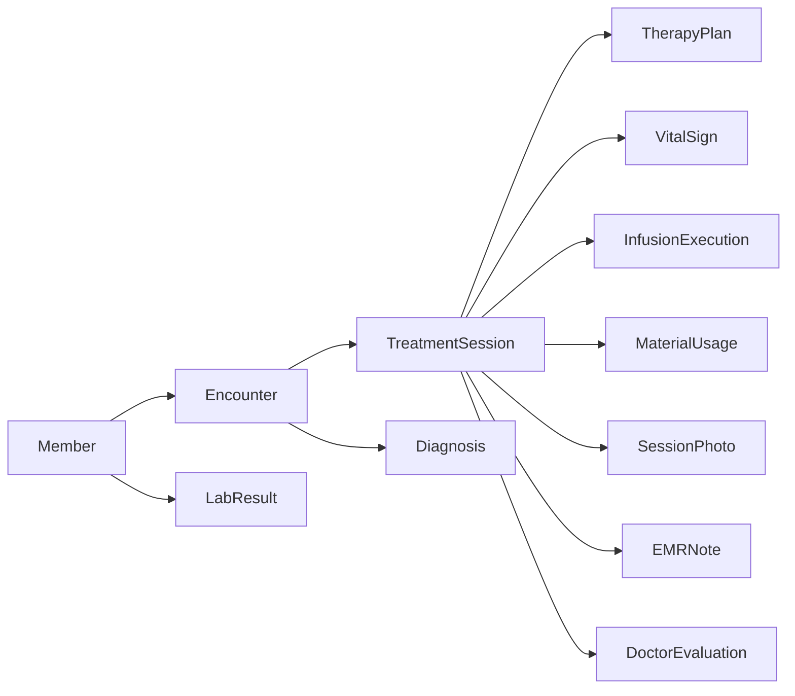
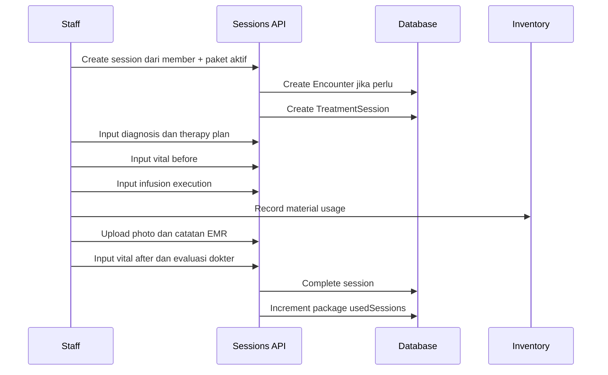
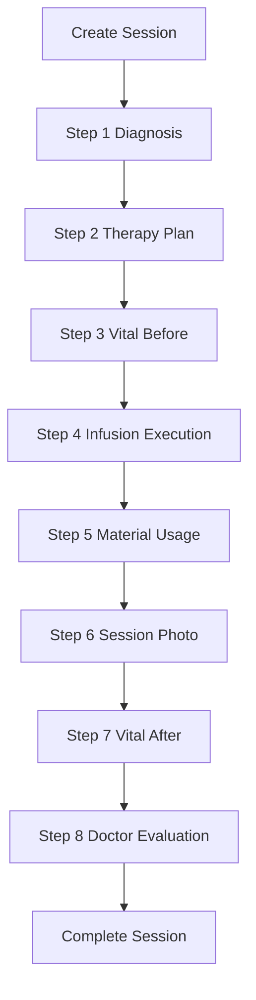
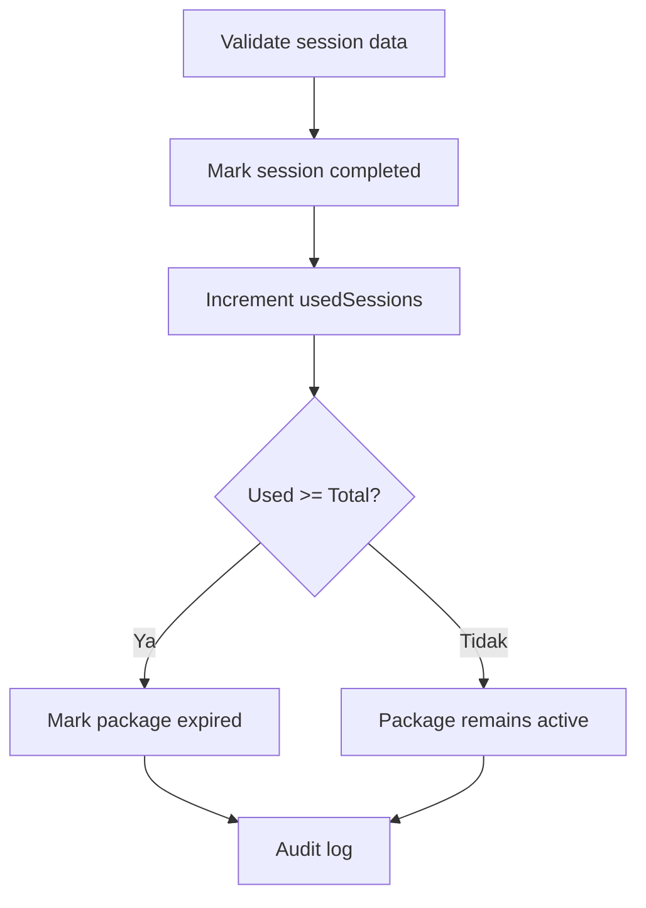

# 04 - Clinical and EMR

Dokumen ini menjelaskan domain **Clinical and EMR** pada sistem RAHO. Domain ini mencakup episode terapi, sesi treatment, diagnosis, therapy plan, vital signs, eksekusi infus, pemakaian material, foto sesi, catatan EMR, evaluasi dokter, hasil lab, serta penyelesaian sesi.

## Ringkasan

Clinical and EMR adalah domain yang menyimpan jejak klinis member dari awal sesi sampai selesai. Struktur utamanya dimulai dari `Encounter` sebagai episode terapi, lalu `TreatmentSession` sebagai satu kali sesi treatment/infus, kemudian data klinis per sesi dicatat melalui diagnosis, therapy plan, vital signs, infusion execution, material usage, photo, EMR note, dan doctor evaluation.

## Tujuan Domain

Domain ini memiliki beberapa tujuan utama:

- Membuat dan melacak episode terapi member.
- Membuat sesi terapi berdasarkan paket aktif.
- Mencatat diagnosis dan ICD.
- Menyimpan rencana terapi dan dosis.
- Mencatat tanda vital sebelum dan sesudah treatment.
- Mencatat eksekusi infus aktual.
- Mencatat pemakaian material dan integrasi inventory.
- Menyimpan dokumentasi foto sesi.
- Menyimpan catatan EMR.
- Menyimpan evaluasi dokter dalam format SOAP.
- Menyimpan hasil lab member.
- Menandai sesi selesai dan memperbarui pemakaian paket.

## Entitas Utama

| Entitas | Fungsi |
|---|---|
| `Encounter` | Episode terapi member yang menghubungkan member, paket basic, dokter, perawat, dan sesi. |
| `TreatmentSession` | Satu sesi treatment/infus dalam sebuah encounter. |
| `SessionDoctor` | Assignment banyak dokter dalam satu sesi. |
| `SessionNurse` | Assignment banyak perawat/nakes dalam satu sesi. |
| `Diagnosis` | Diagnosis member, bisa terkait encounter atau diagnosis langsung member. |
| `TherapyPlanSet` | Kumpulan therapy plan dengan versioning. |
| `TherapyPlan` | Rencana terapi, dosis, zat, dan instruksi klinis. |
| `VitalSign` | Tanda vital sebelum atau sesudah sesi. |
| `InfusionExecution` | Eksekusi aktual infus berdasarkan therapy plan. |
| `MaterialUsage` | Pemakaian material/inventory dalam sesi. |
| `SessionPhoto` | Foto utama sesi. |
| `SessionSupportingPhoto` | Foto pendukung sesi. |
| `EMRNote` | Catatan EMR per sesi. |
| `DoctorEvaluation` | Evaluasi dokter dan SOAP. |
| `DoctorEvaluationHistory` | Riwayat perubahan evaluasi dokter. |
| `LabResult` | File hasil lab member. |

## Clinical Flow

## Encounter

`Encounter` adalah episode terapi. Satu encounter menghubungkan member, cabang, paket basic, admin layanan, dokter, perawat, diagnosis, dan satu atau lebih sesi treatment.

Field penting:

| Field | Penjelasan |
|---|---|
| `encounterCode` | Kode encounter unik. |
| `memberId` | Member yang menjalani terapi. |
| `branchId` | Cabang tempat encounter berjalan. |
| `memberPackageId` | Paket basic yang digunakan. |
| `adminLayananId` | Admin layanan penanggung jawab. |
| `doctorId` | Dokter utama. |
| `nurseId` | Perawat/nakes utama. |
| `status` | `ONGOING` atau `CLOSED`. |

Status encounter:

| Status | Makna |
|---|---|
| `ONGOING` | Episode masih berjalan. |
| `CLOSED` | Episode sudah ditutup. |

## Treatment Session

`TreatmentSession` adalah satu kali sesi treatment. Sesi terikat pada encounter, cabang, tanggal treatment, paket basic, dan optional booster package.

Field penting:

| Field | Penjelasan |
|---|---|
| `sessionCode` | Kode sesi unik. |
| `encounterId` | Encounter induk. |
| `branchId` | Cabang sesi. |
| `infusKe` | Nomor infus global member. |
| `branchInfusKe` | Nomor infus member pada cabang tersebut. |
| `pelaksanaan` | `ON_SITE` atau `HOME_CARE`. |
| `treatmentDate` | Tanggal treatment. |
| `isCompleted` | Status selesai sesi. |
| `adminLayananId` | Admin layanan sesi. |
| `doctorId` | Dokter utama. |
| `nurseId` | Perawat/nakes utama. |
| `boosterPackageId` | Paket booster yang digunakan, opsional. |
| `boosterType` | Jenis booster. |

Jenis pelaksanaan:

| Session Type | Makna |
|---|---|
| `ON_SITE` | Treatment dilakukan di klinik/cabang. |
| `HOME_CARE` | Treatment dilakukan sebagai home care. |

## Multi-Staff Session

Sesi mendukung banyak dokter dan banyak perawat melalui `SessionDoctor` dan `SessionNurse`.

Aturannya:

- Satu sesi dapat memiliki beberapa dokter.
- Satu sesi dapat memiliki beberapa nurse/perawat.
- Satu staff dapat ditandai sebagai primary.
- Kombinasi `sessionId` dan staff ID harus unik.
- Field `doctorId` dan `nurseId` tetap ada untuk backward compatibility sebagai primary doctor/nurse.

## Workflow Sesi Terapi

Implementasi klinis mengikuti workflow inti berikut:

Catatan:

- `EMRNote` dapat dicatat sebagai catatan tambahan per sesi.
- Beberapa service mengizinkan save progress tanpa semua step selesai.
- Complete session melakukan validasi dan memperbarui pemakaian paket.

## Diagnosis

`Diagnosis` menyimpan diagnosis dokter. Diagnosis dapat dibuat langsung untuk member atau dikaitkan dengan encounter.

Field penting:

| Field | Penjelasan |
|---|---|
| `diagnosisCode` | Kode diagnosis unik. |
| `memberId` | Member pemilik diagnosis. |
| `encounterId` | Encounter terkait, opsional dan unik. |
| `sourceDiagnosisId` | Sumber diagnosis jika diagnosis dibuat sebagai copy. |
| `doktorPemeriksa` | Dokter pemeriksa. |
| `diagnosa` | Isi diagnosis. |
| `kategoriDiagnosa` | Kategori diagnosis utama. |
| `kategoriDiagnosaList` | Kategori diagnosis lebih dari satu dalam JSON. |
| `icdPrimer` | ICD primer. |
| `icdSekunder` | ICD sekunder. |
| `icdTersier` | ICD tersier. |
| `keluhanRiwayatSekarang` | Keluhan/riwayat sekarang. |
| `riwayatPenyakitTerdahulu` | Riwayat penyakit terdahulu. |
| `riwayatSosialKebiasaan` | Riwayat sosial/kebiasaan. |
| `riwayatPengobatan` | Riwayat pengobatan. |
| `pemeriksaanFisik` | Pemeriksaan fisik. |
| `pemeriksaanTambahan` | Pemeriksaan tambahan dalam JSON. |

Kategori diagnosis:

- `HIPERTENSI`
- `NEUROLOGI`
- `DIABETES`
- `KARDIOVASKULAR`
- `ORTOPEDI`
- `IMUNOLOGI`
- `HEMATOLOGI`
- `STROKE`
- `JANTUNG_KARDIOVASKULAR`
- `SINDROM_METABOLIK`
- `KANKER`
- `DEGENERATIF`
- `AUTO_IMUN`
- `ONKOLOGI`
- `LAINNYA`

## Therapy Plan Set

`TherapyPlanSet` adalah kumpulan therapy plan milik member. Set ini mendukung versioning agar perubahan rencana terapi tidak menghapus riwayat lama.

Field penting:

| Field | Penjelasan |
|---|---|
| `memberId` | Member pemilik set. |
| `setCode` | Kode internal set. |
| `name` | Nama set. |
| `version` | Nomor versi set. |
| `status` | Misalnya `ACTIVE` atau `SUPERSEDED`. |
| `supersededById` | Set baru yang menggantikan set lama. |
| `createdBy` | User pembuat set. |

Aturan utama:

- Set aktif adalah rencana terapi yang dapat digunakan untuk sesi.
- Set lama dapat menjadi `SUPERSEDED`.
- Versioning menjaga riwayat terapi tetap dapat diaudit.

## Therapy Plan

`TherapyPlan` menyimpan rencana dosis dan komposisi terapi. Therapy plan bisa dibuat untuk persiapan member sebelum sesi atau dihubungkan ke `TreatmentSession`.

Field penting:

| Field | Penjelasan |
|---|---|
| `planCode` | Kode therapy plan unik. |
| `memberId` | Member terkait, opsional. |
| `therapyPlanSetId` | Set therapy plan. |
| `planNumber` | Nomor rencana dalam set. |
| `treatmentSessionId` | Sesi yang memakai plan, opsional dan unik. |
| `keterangan` | Catatan/instruksi tambahan. |
| `ifa250`, `ifa500` | Dosis IFA A + MG. |
| `hho`, `hhoKonsentrat` | Dosis HHO. |
| `h2`, `no`, `gaso`, `o2`, `o3` | Dosis zat gas/terapi terkait. |
| `edta`, `mb`, `h2s`, `kcl` | Dosis zat tambahan. |
| `jmlNb` | Jumlah nebulizer/volume terkait. |
| `noInIfa` | Nilai NO dalam IFA, default 2.5. |
| `ifaSubstances` | Zat yang terkandung di IFA dalam JSON. |
| `ifaSubstanceTotalMl` | Total ml zat IFA. |
| `version` | Versi plan. |
| `supersededById` | Plan baru yang menggantikan plan lama. |
| `supersededAt` | Waktu plan digantikan. |

## Vital Sign

`VitalSign` menyimpan tanda vital sebelum atau sesudah treatment.

Jenis vital:

| Vital Type | Makna |
|---|---|
| `SISTOL` | Tekanan darah sistolik. |
| `DIASTOL` | Tekanan darah diastolik. |
| `HR` | Heart rate/nadi. |
| `SATURASI` | Saturasi oksigen. |
| `PI` | Perfusion index. |

Timing:

| Timing | Makna |
|---|---|
| `SEBELUM` | Dicatat sebelum treatment. |
| `SESUDAH` | Dicatat setelah treatment. |

Aturan penting:

- Kombinasi `treatmentSessionId`, `pencatatan`, dan `waktuCatat` harus unik.
- Data dapat di-upsert, sehingga input vital yang sama dapat diperbarui.
- Vital before dan after dapat dibandingkan untuk evaluasi perubahan kondisi.

## Infusion Execution

`InfusionExecution` menyimpan eksekusi aktual infus. Data ini dapat mengikuti therapy plan, tetapi tetap mencatat realisasi di lapangan.

Field penting:

| Field | Penjelasan |
|---|---|
| `treatmentSessionId` | Sesi terkait, unik. |
| `therapyPlanId` | Therapy plan yang menjadi acuan. |
| `ifa250`, `ifa500` | Realisasi IFA. |
| `hho`, `hhoKonsentrat`, `h2`, `no`, `gaso`, `o2`, `o3` | Realisasi zat terapi. |
| `edta`, `mb`, `h2s`, `kcl` | Realisasi zat tambahan. |
| `jmlNb` | Jumlah nebulizer/volume terkait. |
| `deviationNotes` | Catatan jika realisasi berbeda dari plan. |
| `bottleType` | `IFA` atau `EDTA`. |
| `jenisCairan` | Jenis cairan. |
| `volumeCarrier` | Volume carrier. |
| `jumlahJarum` | Jumlah jarum. |
| `tanggalProduksi` | Tanggal produksi. |

Aturan penting:

- Satu sesi hanya memiliki satu `InfusionExecution`.
- Eksekusi dapat dikaitkan ke therapy plan.
- Perbedaan plan dan realisasi dicatat di `deviationNotes`.

## Material Usage

`MaterialUsage` mencatat material yang dipakai dalam sesi dan menghubungkannya ke inventory.

Field penting:

| Field | Penjelasan |
|---|---|
| `treatmentSessionId` | Sesi terkait. |
| `inventoryItemId` | Item inventory yang digunakan. |
| `quantity` | Jumlah pemakaian. |
| `unit` | Satuan. |
| `recordedBy` | User pencatat. |

Dampak:

- Menjadi dasar pengurangan stok.
- Mendukung audit penggunaan material.
- Menghubungkan rekam medis dengan inventory cabang.

## Session Photo

Dokumentasi foto terdiri dari dua model:

| Entitas | Fungsi |
|---|---|
| `SessionPhoto` | Foto utama sesi, satu per sesi. |
| `SessionSupportingPhoto` | Foto pendukung, bisa banyak per sesi. |

Field umum:

- `fileUrl`
- `fileName`
- `fileSize`
- `mimeType`
- `uploadedBy`
- `createdAt`

`SessionSupportingPhoto` juga memiliki `description` untuk keterangan foto.

## EMR Note

`EMRNote` menyimpan catatan tambahan per sesi.

Tipe catatan:

| EMR Note Type | Makna |
|---|---|
| `CLINICAL_NOTE` | Catatan klinis umum. |
| `OPERATIONAL_NOTE` | Catatan operasional sesi. |
| `ASSESSMENT` | Catatan penilaian. |
| `OUTCOME_MONITORING` | Catatan monitoring hasil. |

Field penting:

| Field | Penjelasan |
|---|---|
| `treatmentSessionId` | Sesi terkait. |
| `noteType` | Tipe catatan. |
| `content` | Isi catatan. |
| `writtenBy` | User penulis. |

## Doctor Evaluation

`DoctorEvaluation` menyimpan evaluasi dokter, termasuk format SOAP.

Field penting:

| Field | Penjelasan |
|---|---|
| `evaluationCode` | Kode evaluasi unik. |
| `treatmentSessionId` | Sesi terkait, unik. |
| `keluhan` | Keluhan. |
| `rekomendasi` | Rekomendasi. |
| `subjective` | SOAP Subjective. |
| `objective` | SOAP Objective. |
| `assessment` | SOAP Assessment. |
| `plan` | SOAP Plan. |
| `generalNotes` | Catatan umum. |
| `writtenBy` | User penulis. |

`DoctorEvaluationHistory` mencatat perubahan evaluasi:

- field yang berubah;
- nilai lama;
- nilai baru;
- user pengubah;
- waktu perubahan.

## Lab Result

`LabResult` menyimpan file hasil lab member.

Field penting:

| Field | Penjelasan |
|---|---|
| `memberId` | Member pemilik hasil lab. |
| `fileName` | Nama file asli. |
| `fileUrl` | Lokasi file. |
| `fileType` | MIME type. |
| `fileSize` | Ukuran file. |
| `description` | Keterangan hasil lab. |
| `labDate` | Tanggal hasil lab. |
| `uploadedBy` | User pengunggah. |

Hasil lab berada di level member, bukan hanya satu sesi, sehingga bisa dipakai sebagai referensi lintas encounter/sesi.

## Complete Session

Complete session adalah proses penutupan sesi.

Efek utama:

- `TreatmentSession.isCompleted` menjadi `true`.
- `MemberPackage.usedSessions` bertambah.
- Jika `usedSessions >= totalSessions`, paket dapat menjadi expired.
- Progress sesi tersimpan.
- Audit log dibuat.

## Branch dan Package Boundary

Clinical domain tetap mengikuti boundary cabang dan paket.

Aturan penting:

- Sesi dibuat dalam `branchId` tertentu.
- Paket basic harus aktif dan tersedia di cabang sesi.
- Booster package, jika dipakai, harus valid dan memiliki sisa sesi.
- Member harus dapat diakses oleh cabang terkait.
- Data session, diagnosis, therapy plan, vital, infusion, dan evaluation mengikuti konteks cabang sesi.

## Role dan Akses

Role yang dapat mengakses sesi:

- `SUPER_ADMIN`
- `ADMIN_MANAGER`
- `ADMIN_CABANG`
- `ADMIN_LAYANAN`
- `DOCTOR`
- `NURSE`

Catatan akses:

- Create session tidak diberikan ke `DOCTOR` pada route saat ini.
- Diagnosis update dibatasi ke medical staff pada route encounter diagnosis.
- Delete diagnosis dibatasi ke `SUPER_ADMIN` dan `ADMIN_MANAGER`.
- Delete session dan update detail session dibatasi ke `SUPER_ADMIN` atau `ADMIN_MANAGER`.
- Mayoritas pencatatan klinis sesi dapat diakses oleh all staff sesuai route dan branch access.

## Endpoint Utama

### Session

| Method | Endpoint | Fungsi |
|---|---|---|
| `GET` | `/sessions` | List sesi. |
| `POST` | `/sessions` | Buat sesi. |
| `GET` | `/sessions/:sessionId` | Detail sesi. |
| `DELETE` | `/sessions/:sessionId` | Hapus sesi. |
| `PATCH` | `/sessions/:sessionId/details` | Update detail sesi. |
| `GET` | `/sessions/:sessionId/progress` | Ambil progress sesi. |
| `PATCH` | `/sessions/:sessionId/save-progress` | Simpan progress tanpa validasi lengkap. |
| `PATCH` | `/sessions/:sessionId/complete` | Selesaikan sesi. |

### Clinical Steps

| Method | Endpoint | Fungsi |
|---|---|---|
| `POST` | `/sessions/encounters/:encounterId/diagnoses` | Buat diagnosis encounter. |
| `GET` | `/sessions/encounters/:encounterId/diagnoses` | Ambil diagnosis encounter. |
| `PATCH` | `/sessions/encounters/:encounterId/diagnoses` | Update diagnosis encounter. |
| `POST` | `/sessions/:sessionId/therapy-plan` | Buat therapy plan sesi. |
| `GET` | `/sessions/:sessionId/therapy-plan` | Ambil therapy plan sesi. |
| `GET` | `/sessions/:sessionId/therapy-plan-set` | Ambil therapy plan set sesi. |
| `PUT` | `/sessions/:sessionId/therapy-plan-set` | Update therapy plan set sesi. |
| `POST` | `/sessions/:sessionId/vital-signs` | Upsert vital sign. |
| `GET` | `/sessions/:sessionId/vital-signs` | Ambil vital sign. |
| `POST` | `/sessions/:sessionId/infusion` | Buat infusion execution. |
| `GET` | `/sessions/:sessionId/infusion` | Ambil infusion execution. |
| `POST` | `/sessions/:sessionId/materials` | Catat material usage. |
| `GET` | `/sessions/:sessionId/materials` | Ambil material usage. |
| `POST` | `/sessions/:sessionId/evaluation` | Buat evaluasi dokter. |
| `PATCH` | `/sessions/:sessionId/evaluation` | Update evaluasi dokter. |
| `GET` | `/sessions/:sessionId/evaluation` | Ambil evaluasi dokter. |
| `POST` | `/sessions/:sessionId/photo` | Upload foto utama sesi. |
| `GET` | `/sessions/:sessionId/photo` | Ambil foto utama sesi. |
| `POST` | `/sessions/:sessionId/supporting-photos` | Upload foto pendukung. |
| `GET` | `/sessions/:sessionId/supporting-photos` | Ambil foto pendukung. |

### Member Clinical Data

| Method | Endpoint | Fungsi |
|---|---|---|
| `GET` | `/members/:memberId/diagnoses` | List diagnosis member. |
| `POST` | `/members/:memberId/diagnoses` | Buat diagnosis langsung member. |
| `PUT` | `/members/:memberId/diagnoses/:diagnosisId` | Update diagnosis member. |
| `DELETE` | `/members/:memberId/diagnoses/:diagnosisId` | Hapus diagnosis member. |

## Dampak ke Modul Lain

| Modul | Dampak |
|---|---|
| Member | Semua data klinis terhubung ke member. |
| Package | Sesi menggunakan paket aktif dan mengurangi `usedSessions`. |
| Branch | Sesi, inventory, staff, dan access control mengikuti cabang. |
| Inventory | Infusion/material usage mengurangi stok cabang. |
| Commercial | Paket aktif dari billing menjadi syarat sesi. |
| Audit Log | Diagnosis, infusion, evaluation, dan completion perlu terlacak. |
| Member Portal | Member dapat melihat riwayat sesi, invoice, voucher, dan data klinis tertentu. |

## Contoh Skenario

### Sesi Treatment Normal

1. Member memiliki paket `ACTIVE`.
2. Admin layanan membuat sesi pada cabang yang sama.
3. Dokter mengisi diagnosis dan therapy plan.
4. Perawat mencatat vital before.
5. Perawat menjalankan infus dan mencatat material usage.
6. Foto sesi diunggah.
7. Perawat mencatat vital after.
8. Dokter mengisi evaluasi SOAP.
9. Sesi diselesaikan.
10. `usedSessions` paket bertambah.

### Therapy Plan Versioning

1. Dokter membuat therapy plan set untuk member.
2. Beberapa plan dibuat dalam satu set.
3. Jika ada revisi, set atau plan lama menjadi superseded.
4. Sesi hanya menggunakan versi terbaru yang masih aktif.
5. Riwayat lama tetap tersimpan untuk audit.

### Infusion Berbeda dari Plan

1. Therapy plan berisi dosis rencana.
2. Saat sesi berjalan, realisasi infus berbeda.
3. Perawat mengisi `InfusionExecution` sesuai realisasi.
4. Selisih atau alasan dicatat di `deviationNotes`.
5. Data aktual tetap terhubung ke therapy plan.

### Hasil Lab Member

1. Staff mengunggah file hasil lab member.
2. File disimpan dengan metadata.
3. Dokter melihat hasil lab sebagai referensi untuk diagnosis atau therapy plan.
4. Hasil lab tetap berada pada level member, bukan satu sesi saja.

## Prinsip Desain

- **Encounter sebagai episode**: episode terapi menjadi wadah diagnosis dan sesi.
- **Session sebagai unit klinis**: satu sesi menyimpan tindakan dan data EMR aktual.
- **Plan dan execution dipisah**: therapy plan adalah rencana, infusion execution adalah realisasi.
- **Vital before/after unik**: setiap tipe vital hanya satu per timing dalam sesi.
- **Evaluation versioned by history**: perubahan evaluasi tersimpan di history.
- **Photo dan lab berbasis file metadata**: file klinis dapat dilacak pengunggah, ukuran, dan tipe file.
- **Branch-aware clinical data**: sesi dan stok mengikuti cabang.
- **Package-aware treatment**: sesi hanya berjalan dari paket yang valid dan aktif.

## Kesimpulan

Clinical and EMR adalah domain yang menyatukan operasional treatment dengan rekam medis elektronik. `Encounter` mengelompokkan episode terapi, `TreatmentSession` menyimpan tindakan per sesi, dan entitas seperti `Diagnosis`, `TherapyPlan`, `VitalSign`, `InfusionExecution`, `MaterialUsage`, `EMRNote`, `DoctorEvaluation`, serta `LabResult` membentuk catatan klinis yang dapat ditinjau dan diaudit.

Dengan model ini, RAHO dapat melacak perjalanan klinis member dari diagnosis awal, rencana terapi, pelaksanaan infus, monitoring vital, dokumentasi foto, evaluasi SOAP, sampai histori hasil lab.

## Referensi Implementasi

- `apps/api/prisma/schema.prisma`
- `apps/api/src/modules/sessions/sessions.routes.ts`
- `apps/api/src/modules/sessions/services/session-creation.service.ts`
- `apps/api/src/modules/sessions/services/session-completion.service.ts`
- `apps/api/src/modules/sessions/services/diagnosis.service.ts`
- `apps/api/src/modules/sessions/services/therapy-plan.service.ts`
- `apps/api/src/modules/sessions/services/vital-signs.service.ts`
- `apps/api/src/modules/sessions/services/infusion.service.ts`
- `apps/api/src/modules/sessions/services/material-usage.service.ts`
- `apps/api/src/modules/sessions/services/photo.service.ts`
- `apps/api/src/modules/sessions/services/supporting-photos.service.ts`
- `apps/api/src/modules/sessions/services/emr-notes.service.ts`
- `apps/api/src/modules/sessions/services/evaluation.service.ts`
- `apps/api/src/modules/members/services/member-lab-results.service.ts`
- `docs/BUSINESS-FLOW.md`
- `docs/USER-GUIDE-COMPLETE.md`
