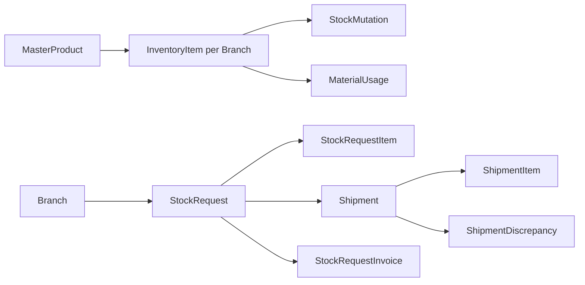
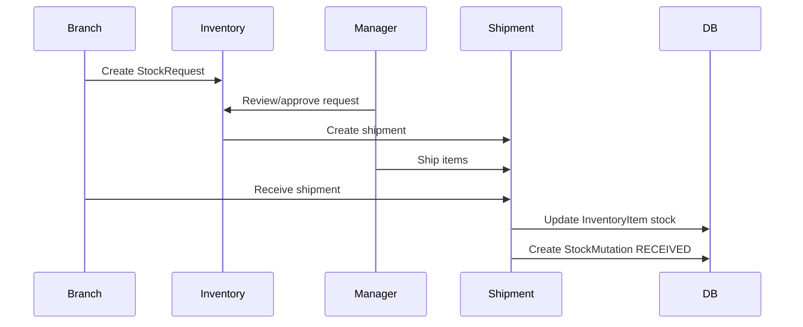
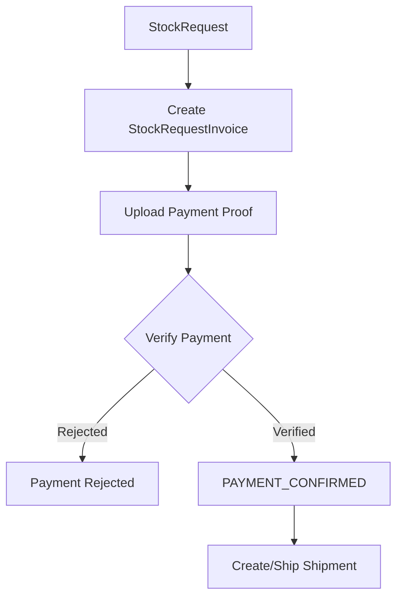

# 05 - Inventory and Logistics

Dokumen ini menjelaskan domain **Inventory and Logistics** pada sistem RAHO. Domain ini mencakup master produk, stok per cabang, mutasi stok, pemakaian material sesi, stock request, shipment, discrepancy, overstock, dan invoice stock request untuk cabang partnership.

## Ringkasan

Inventory and Logistics mengatur pergerakan barang dari katalog produk pusat sampai stok tersedia di cabang dan digunakan dalam sesi terapi. Stok selalu dilacak per cabang melalui `InventoryItem`, sedangkan setiap perubahan stok dicatat sebagai `StockMutation`.

## Tujuan Domain

- Menyimpan katalog produk pusat.
- Menyimpan stok produk per cabang.
- Mendeteksi low stock berdasarkan `minThreshold`.
- Mencatat semua perubahan stok.
- Mengurangi stok saat material digunakan dalam sesi terapi.
- Memfasilitasi permintaan stok dari cabang ke pusat.
- Mengelola shipment dari pusat/cabang asal ke cabang tujuan.
- Mencatat selisih barang saat penerimaan.
- Mendukung invoice dan pembayaran untuk stock request cabang partnership.
- Menyediakan riwayat auditable untuk seluruh pergerakan barang.

## Entitas Utama

| Entitas | Fungsi |
|---|---|
| `MasterProduct` | Katalog produk pusat. |
| `InventoryItem` | Stok produk per cabang. |
| `StockMutation` | Riwayat perubahan stok. |
| `MaterialUsage` | Pemakaian material dalam sesi terapi. |
| `StockRequest` | Permintaan stok dari cabang. |
| `StockRequestItem` | Item yang diminta dalam stock request. |
| `Shipment` | Pengiriman stok. |
| `ShipmentItem` | Item yang dikirim. |
| `ShipmentDiscrepancy` | Selisih barang saat penerimaan. |
| `StockRequestInvoice` | Invoice untuk stock request partnership. |
| `StockRequestInvoicePayment` | Pembayaran invoice stock request. |
| `StockRequestInvoiceItem` | Snapshot item invoice stock request. |

## Inventory Flow

## Master Product

`MasterProduct` adalah katalog produk yang tidak langsung terikat ke cabang.

Field penting:

| Field | Penjelasan |
|---|---|
| `sku` | Kode SKU produk. |
| `name` | Nama produk unik. |
| `category` | `MEDICINE`, `DEVICE`, atau `CONSUMABLE`. |
| `unit` | Field legacy satuan. |
| `baseUnit` | Satuan penyimpanan, misalnya botol, box, pack. |
| `usageUnit` | Satuan pemakaian, misalnya ml, tablet, gram. |
| `conversionFactor` | Konversi base unit ke usage unit. |
| `isAutoUsedPerSession` | Produk otomatis dipakai per sesi. |
| `isAutoAddedToBranch` | Produk otomatis dibuatkan inventory saat cabang baru dibuat. |
| `defaultInitialStock` | Stok awal default untuk auto-add. |
| `isActive` | Status produk. |

## Inventory Item

`InventoryItem` adalah stok satu produk di satu cabang.

Field penting:

| Field | Penjelasan |
|---|---|
| `masterProductId` | Produk master. |
| `branchId` | Cabang pemilik stok. |
| `stock` | Jumlah stok saat ini. |
| `minThreshold` | Batas minimum untuk low stock alert. |
| `storageLocation` | Lokasi penyimpanan di cabang. |

Aturan:

- Satu produk hanya boleh punya satu `InventoryItem` per cabang.
- Stok cabang tidak dicampur dengan stok cabang lain.
- Low stock terdeteksi saat `stock < minThreshold`.

## Stock Mutation

`StockMutation` adalah log perubahan stok.

Jenis mutasi:

| Type | Makna |
|---|---|
| `USED` | Stok dipakai, biasanya dari sesi terapi/material usage. |
| `RECEIVED` | Stok bertambah karena shipment diterima. |
| `ADJUSTMENT` | Koreksi manual stok. |

Field penting:

| Field | Penjelasan |
|---|---|
| `inventoryItemId` | Item stok yang berubah. |
| `type` | Jenis mutasi. |
| `quantity` | Jumlah perubahan. |
| `stockBefore` | Stok sebelum perubahan. |
| `stockAfter` | Stok setelah perubahan. |
| `referenceType` | Sumber mutasi, misalnya session, shipment, manual. |
| `referenceId` | ID sumber mutasi. |
| `createdBy` | User yang menyebabkan mutasi. |

Prinsip penting: update stok dan pembuatan `StockMutation` harus terjadi dalam satu transaksi agar stok dan histori selalu konsisten.

## Material Usage

Saat sesi terapi mencatat material usage, stok inventory cabang berkurang.

Alurnya:

1. Staff memilih inventory item.
2. Staff mengisi quantity dan unit.
3. Sistem mengurangi `InventoryItem.stock`.
4. Sistem membuat `StockMutation` tipe `USED`.
5. Riwayat material usage tetap terhubung ke sesi.

## Stock Request

`StockRequest` adalah permintaan stok dari cabang ke pusat/manajemen.

Field penting:

| Field | Penjelasan |
|---|---|
| `requestCode` | Kode request unik. |
| `branchId` | Cabang peminta. |
| `requestedBy` | User pembuat request. |
| `status` | Status request. |
| `notes` | Catatan request. |
| `reviewedBy`, `reviewedAt` | Data reviewer. |
| `paymentProofUrl` | Bukti pembayaran untuk partnership. |
| `paymentVerifiedBy`, `paymentVerifiedAt` | Verifikasi pembayaran. |
| `shippedBy`, `shippedAt` | Data pengiriman. |
| `receivedBy`, `receivedAt` | Data penerimaan. |

Status stock request:

| Status | Makna |
|---|---|
| `PENDING` | Menunggu review. |
| `APPROVED` | Disetujui. |
| `WAITING_PAYMENT` | Menunggu pembayaran cabang partnership. |
| `PAYMENT_UPLOADED` | Bukti bayar sudah diupload. |
| `PAYMENT_CONFIRMED` | Pembayaran dikonfirmasi. |
| `REJECTED` | Ditolak. |
| `SHIPPED` | Barang dikirim. |
| `COMPLETED` | Selesai tanpa isu. |
| `COMPLETED_WITH_ISSUE` | Selesai dengan ketidaksesuaian. |

## Stock Request Item

`StockRequestItem` adalah detail produk yang diminta.

Field penting:

| Field | Penjelasan |
|---|---|
| `stockRequestId` | Request induk. |
| `inventoryItemId` | Inventory item existing, opsional. |
| `masterProductId` | Produk yang diminta. |
| `requestedQty` | Jumlah yang diminta. |
| `approvedQty` | Jumlah yang disetujui. |
| `overstockDeducted` | Jumlah yang dipenuhi dari overstock. |
| `finalQty` | Jumlah final yang perlu diproses. |

## Shipment

`Shipment` adalah pengiriman stok dari cabang asal ke cabang tujuan.

Field penting:

| Field | Penjelasan |
|---|---|
| `shipmentCode` | Kode shipment unik. |
| `stockRequestId` | Request sumber shipment. |
| `fromBranchId` | Cabang asal. |
| `toBranchId` | Cabang tujuan. |
| `status` | Status shipment. |
| `shipmentPhotoUrl` | Foto paket pengiriman. |
| `receiptFileUrl` | File tanda terima. |
| `approvedBy`, `approvedAt` | Approval penerimaan jika diperlukan. |

Status shipment:

| Status | Makna |
|---|---|
| `PREPARING` | Shipment sedang disiapkan. |
| `SHIPPED` | Barang sudah dikirim. |
| `RECEIVED` | Barang diterima. |
| `RECEIVED_WITH_ISSUE` | Diterima dengan selisih/masalah. |
| `APPROVED` | Penerimaan disetujui dan stok final diakui. |

## Shipment Item dan Discrepancy

`ShipmentItem` menyimpan item yang dikirim:

- `masterProductId`
- `sentQty`
- `receivedQty`
- `requestedQty`
- `overstockQty`
- `overstockReason`

`ShipmentDiscrepancy` mencatat selisih:

- expected quantity;
- received quantity;
- tipe discrepancy: `SHORTAGE`, `DAMAGE`, `WRONG_ITEM`, `OTHER`;
- catatan;
- foto bukti;
- user pelapor.

## Partnership Stock Request Invoice

Untuk cabang partnership, stock request dapat memiliki invoice.

Entitas:

| Entitas | Fungsi |
|---|---|
| `StockRequestInvoice` | Invoice utama request stok. |
| `StockRequestInvoiceItem` | Snapshot item dan harga. |
| `StockRequestInvoicePayment` | Bukti dan riwayat pembayaran. |

Status pembayaran memakai:

- `InvoiceStatus`
- `PaymentVerificationStatus`

Flow partnership:

## Overstock

Overstock adalah stok lebih yang dapat digunakan untuk memenuhi sebagian request.

Prinsipnya:

- request dapat mengurangi kebutuhan final melalui `overstockDeducted`;
- shipment item dapat mencatat `overstockQty`;
- overstock perlu alasan jika jumlah dikirim melebihi request normal;
- overstock membantu mencegah pemborosan stok antar cabang.

## Endpoint Utama

| Method | Endpoint | Fungsi |
|---|---|---|
| `GET` | `/inventory/master-products` | List master products. |
| `GET` | `/inventory/items` | List inventory items. |
| `POST` | `/inventory/items` | Buat inventory item. |
| `PATCH` | `/inventory/items/:itemId` | Update inventory item. |
| `PATCH` | `/inventory/items/:itemId/adjust-stock` | Adjust stok manual. |
| `GET` | `/inventory/low-stock/:branchId` | List low stock. |
| `GET` | `/inventory/stock-mutations` | Riwayat mutasi stok. |
| `GET` | `/inventory/material-usage-history` | Riwayat pemakaian material. |
| `POST` | `/inventory/stock-requests` | Buat stock request. |
| `GET` | `/inventory/stock-requests` | List stock request. |
| `POST` | `/inventory/stock-requests/:requestId/approve` | Approve request. |
| `POST` | `/inventory/stock-requests/:requestId/reject` | Reject request. |
| `POST` | `/inventory/stock-requests/:requestId/create-invoice` | Buat invoice partnership. |
| `POST` | `/inventory/stock-requests/:requestId/confirm-payment` | Konfirmasi pembayaran. |
| `GET` | `/inventory/shipments` | List shipment. |
| `POST` | `/inventory/shipments/:shipmentId/ship` | Kirim shipment. |
| `POST` | `/inventory/shipments/:shipmentId/receive` | Terima shipment. |
| `POST` | `/inventory/shipments/:shipmentId/review-issue` | Review issue shipment. |

## Role dan Akses

| Role | Akses Umum |
|---|---|
| `SUPER_ADMIN` | Mengelola master, inventory, request, shipment, audit. |
| `ADMIN_MANAGER` | Mengelola request, shipment, stock, dan review sesuai scope. |
| `ADMIN_LOGISTIK` | Mengelola logistik dan stok. |
| `ADMIN_CABANG` | Membuat request dan menerima shipment. |
| `ADMIN_LAYANAN`, `DOCTOR`, `NURSE` | Melihat stok tertentu dan memakai material dalam sesi sesuai kebutuhan. |

## Prinsip Desain

- **Master product global, stock per cabang**.
- **Semua perubahan stok harus punya mutation log**.
- **Stock request memisahkan permintaan, approval, pembayaran, dan shipment**.
- **Shipment menyimpan jumlah dikirim dan jumlah diterima**.
- **Discrepancy tidak menghapus data shipment, tetapi mencatat selisih secara eksplisit**.
- **Inventory adalah branch-boundary domain**: stok cabang tidak dicampur.

## Referensi Implementasi

- `apps/api/prisma/schema.prisma`
- `apps/api/src/modules/inventory/inventory.routes.ts`
- `apps/api/src/modules/inventory/services/inventory-items.service.ts`
- `apps/api/src/modules/inventory/services/stock-request-creation.service.ts`
- `apps/api/src/modules/inventory/services/stock-request-approval.service.ts`
- `apps/api/src/modules/inventory/services/shipment-processing.service.ts`
- `apps/api/src/modules/inventory/services/material-usage-history.service.ts`
- `docs/BUSINESS-FLOW.md`
- `docs/USER-GUIDE-COMPLETE.md`
