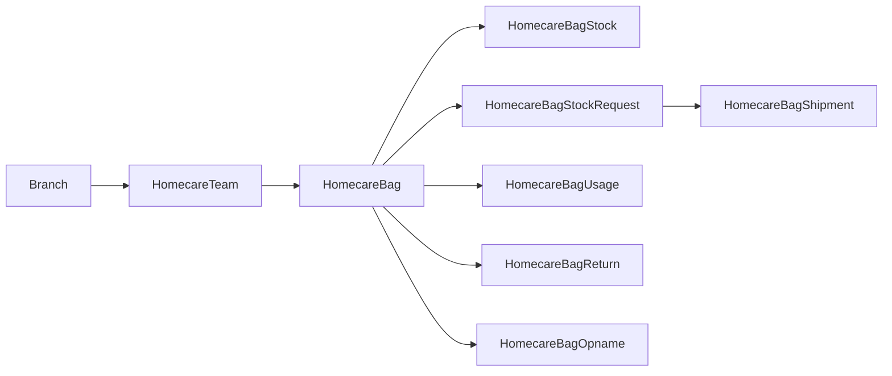
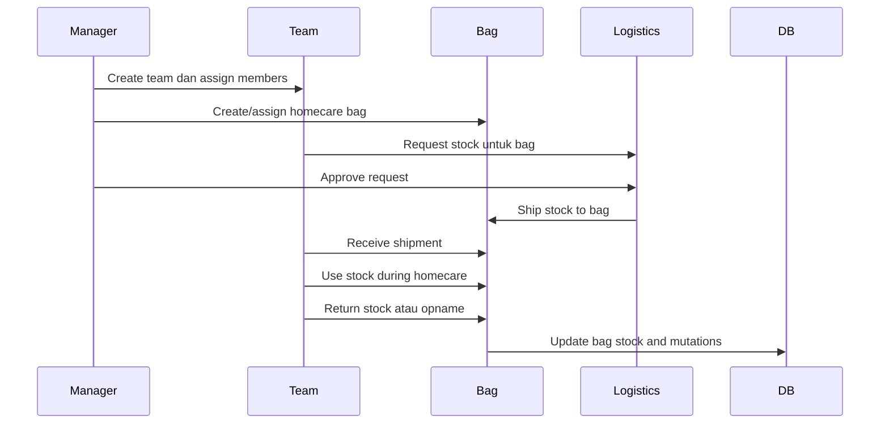

# 06 - Homecare Logistics

Dokumen ini menjelaskan domain **Homecare Logistics** pada sistem RAHO. Domain ini mengatur tim homecare, tas homecare, stok dalam tas, permintaan restock tas, shipment ke tas, pemakaian barang, retur barang, stock opname, dan mutasi stok logistik.

## Ringkasan

Homecare Logistics adalah perluasan inventory untuk layanan luar cabang. Jika inventory biasa berpusat pada stok cabang, homecare logistics menambahkan satu lokasi stok baru: **tas homecare**. Tas ini dibawa oleh tim homecare dan memiliki stok sendiri.

## Tujuan Domain

- Membentuk tim homecare per cabang.
- Menugaskan staff ke tim homecare.
- Membuat dan mengelola tas homecare.
- Melacak stok produk di dalam tas.
- Meminta restock tas dari central/branch stock.
- Mengirim dan menerima stok ke tas.
- Mencatat pemakaian stok saat homecare.
- Mencatat retur barang dari tas.
- Melakukan stock opname tas.
- Menjaga audit trail pergerakan stok luar cabang.

## Entitas Utama

| Entitas | Fungsi |
|---|---|
| `HomecareTeam` | Tim homecare pada cabang. |
| `HomecareTeamMember` | Anggota tim dan rolenya. |
| `HomecareBag` | Tas homecare yang membawa stok. |
| `HomecareBagStock` | Stok produk dalam tas. |
| `HomecareBagStockRequest` | Permintaan restock tas. |
| `HomecareBagStockRequestItem` | Item yang diminta. |
| `HomecareBagShipment` | Shipment dari cabang/central ke tas. |
| `HomecareBagShipmentItem` | Item yang dikirim ke tas. |
| `HomecareBagUsage` | Pemakaian stok tas. |
| `HomecareBagUsageItem` | Item yang dipakai. |
| `HomecareBagReturn` | Retur dari tas ke cabang. |
| `HomecareBagReturnItem` | Item yang diretur. |
| `HomecareBagOpname` | Stock opname tas. |
| `HomecareBagOpnameItem` | Detail hasil opname. |

## Homecare Flow

## Homecare Team

`HomecareTeam` adalah unit kerja homecare.

Field penting:

| Field | Penjelasan |
|---|---|
| `teamCode` | Kode tim unik. |
| `name` | Nama tim. |
| `branchId` | Cabang asal tim. |
| `description` | Deskripsi tim. |
| `isActive` | Status aktif. |
| `createdBy` | User pembuat. |

## Homecare Team Member

`HomecareTeamMember` menyimpan anggota tim.

Role anggota:

| Role | Makna |
|---|---|
| `ADMIN_LAYANAN` | Koordinator layanan. |
| `DOCTOR` | Dokter homecare. |
| `NURSE` | Perawat/nakes homecare. |
| `DRIVER` | Driver/logistik lapangan. |
| `OTHER` | Role lain. |

Aturan:

- Satu user hanya boleh satu kali dalam tim yang sama.
- Anggota dapat dinonaktifkan tanpa menghapus histori.
- `joinedAt`, `leftAt`, dan `notes` membantu audit keanggotaan.

## Homecare Bag

`HomecareBag` adalah tas stok operasional untuk tim homecare.

Status tas:

| Status | Makna |
|---|---|
| `ACTIVE` | Tas aktif digunakan. |
| `INACTIVE` | Tas tidak aktif. |
| `IN_CHECKING` | Tas sedang diperiksa/opname. |
| `DAMAGED` | Tas rusak. |
| `LOST` | Tas hilang. |

Field penting:

| Field | Penjelasan |
|---|---|
| `bagCode` | Kode tas unik. |
| `name` | Nama tas. |
| `teamId` | Tim pemilik/pengguna tas. |
| `branchId` | Cabang asal. |
| `status` | Status tas. |
| `isActive` | Status aktif record. |

## Homecare Bag Stock

`HomecareBagStock` adalah stok produk dalam tas.

Field penting:

| Field | Penjelasan |
|---|---|
| `bagId` | Tas pemilik stok. |
| `masterProductId` | Produk master. |
| `stock` | Jumlah stok di tas. |
| `minThreshold` | Batas minimum stok tas. |

Aturan:

- Satu produk hanya boleh satu record stok per tas.
- Stok tas terpisah dari stok cabang.
- Low stock tas dapat digunakan untuk menentukan restock.

## Bag Stock Request

`HomecareBagStockRequest` adalah permintaan restock tas.

Status request:

| Status | Makna |
|---|---|
| `DRAFT` | Draft. |
| `PENDING` | Menunggu review. |
| `APPROVED` | Disetujui. |
| `PARTIALLY_APPROVED` | Disetujui sebagian. |
| `REJECTED` | Ditolak. |
| `PREPARING` | Disiapkan. |
| `SHIPPED` | Dikirim ke tas. |
| `RECEIVED` | Diterima. |
| `RECEIVED_WITH_ISSUE` | Diterima dengan isu. |
| `COMPLETED` | Selesai. |
| `CANCELLED` | Dibatalkan. |

Field penting:

- `requestCode`
- `teamId`
- `bagId`
- `branchId`
- `requestedBy`
- `priority`
- `requestNotes`
- review, shipment, dan receiving metadata
- support file

## Bag Shipment

`HomecareBagShipment` mencatat pengiriman stok ke tas.

Field penting:

| Field | Penjelasan |
|---|---|
| `shipmentCode` | Kode shipment unik. |
| `requestId` | Request sumber shipment. |
| `fromBranchId` | Cabang/stok asal. |
| `toBagId` | Tas tujuan. |
| `status` | Status shipment. |
| `shipmentPhotoUrl` | Foto paket. |
| `receiptFileUrl` | Bukti penerimaan. |

Item shipment mencatat:

- `sentQty`
- `receivedQty`
- `discrepancyType`
- `discrepancyNotes`
- bukti foto discrepancy

## Bag Usage

`HomecareBagUsage` mencatat pemakaian stok tas saat operasional homecare.

Field penting:

| Field | Penjelasan |
|---|---|
| `usageCode` | Kode usage unik. |
| `bagId` | Tas yang dipakai. |
| `teamId` | Tim pengguna. |
| `treatmentSessionId` | Sesi terkait, opsional. |
| `usedBy` | User pemakai. |
| `status` | `DRAFT`, `COMPLETED`, atau `CANCELLED`. |
| `usageDate` | Tanggal pemakaian. |
| `notes` | Catatan. |

Pemakaian akan mengurangi `HomecareBagStock` dan idealnya membuat riwayat/mutasi logistik.

## Bag Return

`HomecareBagReturn` mencatat pengembalian barang dari tas ke cabang.

Field penting:

| Field | Penjelasan |
|---|---|
| `returnCode` | Kode retur unik. |
| `bagId` | Tas asal. |
| `teamId` | Tim terkait. |
| `toBranchId` | Cabang tujuan retur. |
| `returnedBy` | User yang mengembalikan. |
| `receivedBy` | User penerima. |
| `returnedAt`, `receivedAt` | Waktu retur dan penerimaan. |

Item retur menyimpan:

- quantity;
- apakah reusable;
- condition;
- notes.

## Bag Opname

`HomecareBagOpname` adalah stock opname tas.

Status:

| Status | Makna |
|---|---|
| `DRAFT` | Draft opname. |
| `IN_PROGRESS` | Sedang berlangsung. |
| `COMPLETED` | Selesai. |
| `CANCELLED` | Dibatalkan. |

Item opname menyimpan:

- `systemQty`;
- `physicalQty`;
- `difference`;
- apakah adjustment sudah dibuat;
- notes.

## Endpoint Utama

| Method | Endpoint | Fungsi |
|---|---|---|
| `GET` | `/inventory/logistics/central-stock` | Lihat central stock. |
| `GET` | `/inventory/logistics/homecare-branches` | List cabang homecare. |
| `GET` | `/inventory/logistics/homecare-staff` | List staff homecare. |
| `GET` | `/inventory/logistics/homecare-teams` | List tim homecare. |
| `POST` | `/inventory/logistics/homecare-teams` | Buat tim homecare. |
| `POST` | `/inventory/logistics/homecare-teams/:teamId/members` | Tambah anggota tim. |
| `DELETE` | `/inventory/logistics/homecare-teams/:teamId/members/:userId` | Nonaktifkan/hapus anggota tim. |
| `GET` | `/inventory/logistics/homecare-bags` | List tas homecare. |
| `POST` | `/inventory/logistics/homecare-bags` | Buat tas homecare. |
| `PATCH` | `/inventory/logistics/homecare-bags/:bagId/assign` | Assign tas ke tim. |
| `GET` | `/inventory/logistics/homecare-bags/:bagId/stock` | Lihat stok tas. |
| `POST` | `/inventory/logistics/homecare-bag-requests` | Buat request stok tas. |
| `POST` | `/inventory/logistics/homecare-bag-requests/:requestId/approve` | Approve request tas. |
| `POST` | `/inventory/logistics/homecare-bag-requests/:requestId/reject` | Reject request tas. |
| `GET` | `/inventory/logistics/homecare-bag-shipments` | List shipment tas. |
| `POST` | `/inventory/logistics/homecare-bag-shipments/:shipmentId/ship` | Kirim stok ke tas. |
| `POST` | `/inventory/logistics/homecare-bag-shipments/:shipmentId/receive` | Terima stok di tas. |
| `POST` | `/inventory/logistics/homecare-bag-usages` | Catat pemakaian stok tas. |
| `GET` | `/inventory/logistics/homecare-bag-usages` | List pemakaian stok tas. |
| `POST` | `/inventory/logistics/homecare-bag-returns` | Catat retur tas. |
| `GET` | `/inventory/logistics/homecare-bag-returns` | List retur tas. |
| `POST` | `/inventory/logistics/homecare-bag-opnames` | Buat opname tas. |
| `GET` | `/inventory/logistics/homecare-bag-opnames` | List opname tas. |

## Role dan Akses

Secara umum:

- central stock dan manajemen tim/tas dikelola role logistik/manajerial;
- request stok tas dapat dibuat oleh staff yang punya akses ke tas/tim;
- ship dilakukan oleh role yang boleh mengirim stok;
- receive, usage, return, dan opname dilakukan oleh staff logistik/homecare sesuai akses;
- pembuatan tas homecare dibatasi lebih ketat, termasuk super admin pada route saat ini.

## Prinsip Desain

- **Tas homecare adalah lokasi stok tersendiri**.
- **Team membership menentukan akses operasional tas**.
- **Request, shipment, receive, usage, return, opname dipisah agar audit jelas**.
- **Stok tas tidak boleh dicampur dengan stok cabang**.
- **Discrepancy dicatat, bukan ditimpa diam-diam**.
- **Support file membantu bukti lapangan**.

## Referensi Implementasi

- `apps/api/prisma/schema.prisma`
- `apps/api/src/modules/inventory/inventory.routes.ts`
- `apps/api/src/modules/inventory/logistics.service.ts`
- `apps/api/src/modules/inventory/logistics.controller.ts`
- `apps/api/src/modules/inventory/logistics.schema.ts`
- `apps/api/src/modules/inventory/logistics.access.ts`
