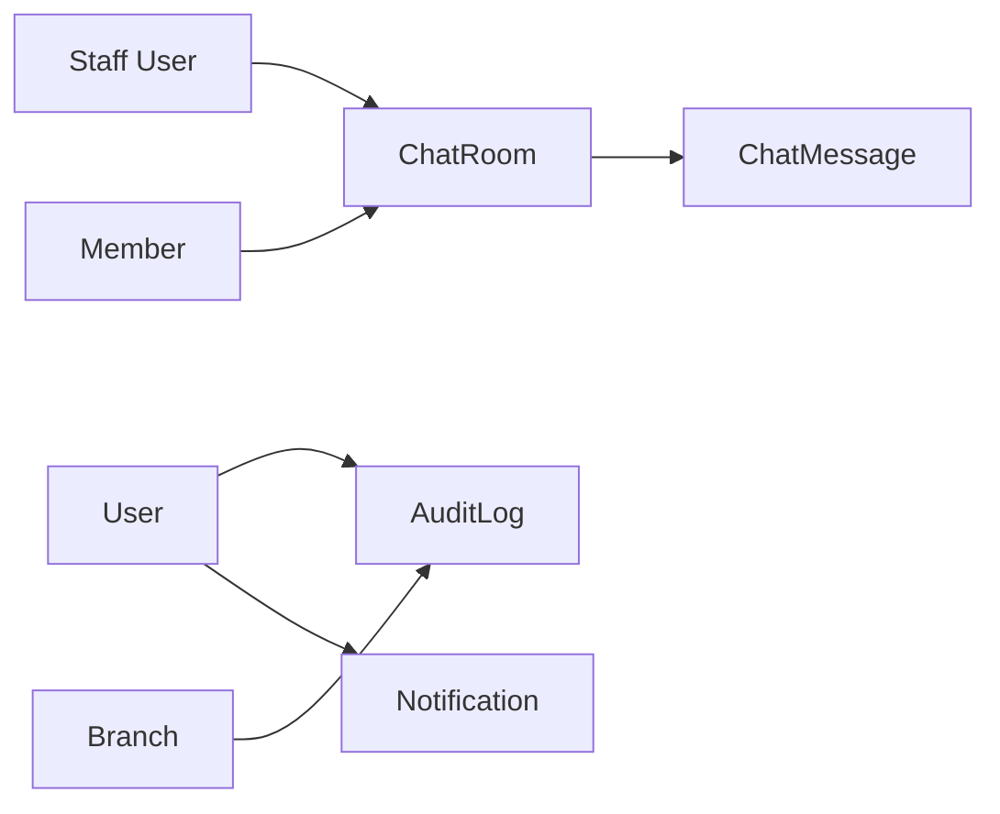
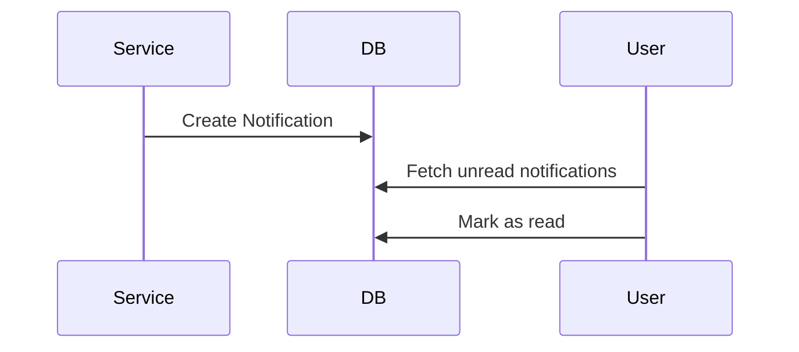
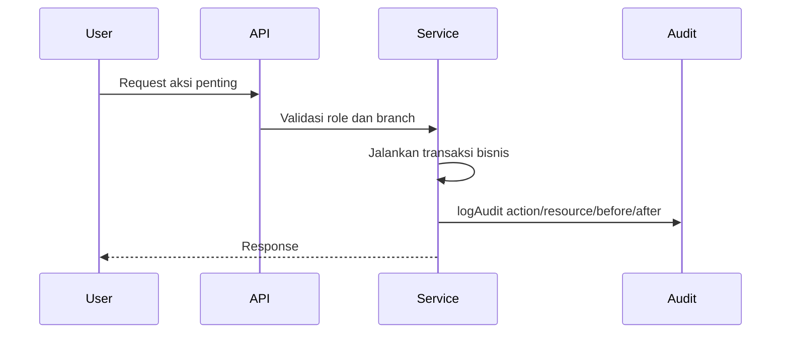

# 07 - Communication and Governance

Dokumen ini menjelaskan domain **Communication and Governance** pada sistem RAHO. Domain ini mencakup notification, chat, audit log, aktivitas keamanan, perubahan data penting, serta prinsip governance untuk memastikan sistem dapat ditelusuri dan dikontrol.

## Ringkasan

Communication menyediakan kanal informasi di dalam sistem melalui notification dan chat. Governance menyediakan kontrol dan audit trail melalui `AuditLog`, role-based access, branch context, metadata perubahan, IP address, dan user agent.

## Tujuan Domain

- Mengirim notifikasi kepada user.
- Menyimpan status notifikasi terbaca/belum terbaca.
- Menyediakan ruang chat member dan staff.
- Menyimpan pesan chat dan file lampiran.
- Mencatat aktivitas penting ke audit log.
- Mencatat login, logout, failed login, password change, dan aksi bisnis sensitif.
- Menyimpan before/after data untuk perubahan.
- Mendukung investigasi operasional dan keamanan.

## Entitas Utama

| Entitas | Fungsi |
|---|---|
| `Notification` | Pesan sistem kepada user. |
| `ChatRoom` | Ruang chat antara member dan staff. |
| `ChatMessage` | Pesan dalam chat room. |
| `AuditLog` | Catatan aktivitas dan perubahan sistem. |
| `User` | Aktor komunikasi dan audit. |
| `Branch` | Konteks cabang dalam audit. |

## Notification

`Notification` menyimpan pesan sistem untuk user.

Field penting:

| Field | Penjelasan |
|---|---|
| `userId` | Penerima notifikasi. |
| `type` | Jenis notifikasi. |
| `title` | Judul. |
| `body` | Isi notifikasi. |
| `deepLink` | Link tujuan di aplikasi. |
| `status` | `UNREAD` atau `READ`. |
| `readAt` | Waktu dibaca. |

Jenis notifikasi:

| Type | Makna |
|---|---|
| `INVOICE` | Notifikasi terkait invoice/pembayaran. |
| `REMINDER` | Pengingat jadwal atau aksi. |
| `INFO` | Informasi umum sistem. |

Status:

| Status | Makna |
|---|---|
| `UNREAD` | Belum dibaca. |
| `READ` | Sudah dibaca. |

## Notification Flow

Contoh pemicu notifikasi:

- akun member berhasil dibuat;
- paket member aktif;
- shipment dikirim;
- payment/invoice membutuhkan perhatian;
- reminder jadwal sesi.

## Chat Room

`ChatRoom` adalah ruang komunikasi antara member dan staff.

Field penting:

| Field | Penjelasan |
|---|---|
| `memberId` | Member pemilik ruang chat. |
| `staffId` | Staff yang menangani chat, opsional. |
| `isActive` | Status ruang chat. |

Aturan:

- Satu member memiliki satu chat room unik.
- Staff dapat diassign ke room.
- Room dapat dinonaktifkan tanpa menghapus histori pesan.

## Chat Message

`ChatMessage` menyimpan pesan dalam chat room.

Field penting:

| Field | Penjelasan |
|---|---|
| `chatRoomId` | Room pesan. |
| `senderId` | User pengirim. |
| `content` | Isi pesan. |
| `fileUrl` | Lampiran file, opsional. |
| `fileName` | Nama file lampiran. |
| `createdAt` | Waktu kirim. |

Index `chatRoomId, createdAt` mendukung scroll riwayat chat secara kronologis.

## Audit Log

`AuditLog` adalah fondasi governance. Semua aksi penting seharusnya tercatat di sini.

Field penting:

| Field | Penjelasan |
|---|---|
| `userId` | User pelaku, bisa null untuk aksi sistem. |
| `userName` | Nama pelaku saat aksi terjadi. |
| `userRole` | Role pelaku saat aksi terjadi. |
| `branchId` | Cabang konteks aksi. |
| `branchName` | Nama cabang saat aksi terjadi. |
| `action` | Jenis aksi. |
| `module` | Modul aplikasi. |
| `resource` | Resource yang terdampak. |
| `resourceId` | ID resource. |
| `entityType`, `entityId`, `entityCode` | Identitas entitas bisnis. |
| `description` | Deskripsi aktivitas. |
| `meta` / `metadata` | Metadata tambahan. |
| `beforeData` | Data sebelum perubahan. |
| `afterData` | Data setelah perubahan. |
| `changedFields` | Field yang berubah. |
| `ipAddress` | IP pelaku. |
| `userAgent` | Browser/client pelaku. |

## Audit Action

Action yang tersedia:

| Action | Contoh Penggunaan |
|---|---|
| `CREATE` | Membuat member, paket, session, request. |
| `UPDATE` | Mengubah data. |
| `DELETE` | Menghapus data. |
| `VERIFY` | Verifikasi umum. |
| `LOGIN`, `LOGOUT` | Aktivitas login/logout. |
| `FAILED_LOGIN`, `LOGIN_FAILED` | Login gagal. |
| `PASSWORD_CHANGE`, `PASSWORD_RESET` | Perubahan password. |
| `VERIFY_PAYMENT`, `REJECT_PAYMENT` | Verifikasi/tolak pembayaran. |
| `UPLOAD_FILE` | Upload file penting. |
| `STATUS_CHANGE` | Perubahan status. |
| `ASSIGN` | Assignment staff/branch/package. |
| `CANCEL` | Pembatalan. |
| `COMPLETE` | Penyelesaian proses. |
| `STOCK_REQUEST` | Permintaan stok. |
| `SHIPMENT`, `RECEIVE_SHIPMENT` | Pengiriman/penerimaan stok. |
| `STOCK_ADJUSTMENT` | Koreksi stok. |

## Governance Flow

## Aktivitas yang Wajib Diaudit

Contoh aktivitas sensitif:

- login, logout, failed login;
- create/update/delete user;
- create/update member;
- grant/revoke branch access;
- assign package;
- verify/reject payment;
- refund/cancel package;
- create/complete treatment session;
- input/update diagnosis atau evaluation;
- upload dokumen penting;
- stock adjustment;
- stock request approval/rejection;
- shipment shipped/received;
- homecare bag usage/return/opname.

## Before/After Data

Untuk update data penting, audit sebaiknya menyimpan:

- `beforeData`: kondisi sebelum perubahan;
- `afterData`: kondisi setelah perubahan;
- `changedFields`: daftar field yang berubah.

Tujuannya:

- membantu debugging;
- mendukung investigasi;
- mempermudah review perubahan;
- menjaga accountability.

## Branch Context

Audit log dapat memiliki `branchId` dan `branchName`.

Manfaat:

- filter aktivitas per cabang;
- investigasi kasus cabang tertentu;
- dashboard operasional;
- pemisahan aktivitas global dan branch-specific.

Jika aksi global, `branchId` dapat null.

## Security Governance

Audit log mendukung monitoring keamanan:

- failed login berdasarkan email/IP;
- brute force detection;
- password reset/change;
- impersonation atau aksi admin;
- perubahan role dan akses;
- aktivitas user per timeline.

Data `ipAddress` dan `userAgent` penting untuk investigasi.

## Communication vs Governance

| Area | Fokus |
|---|---|
| Notification | Memberi tahu user bahwa ada aksi/status penting. |
| Chat | Komunikasi langsung member dan staff. |
| Audit Log | Mencatat siapa melakukan apa, kapan, di mana, dan pada data apa. |

Ketiganya saling melengkapi:

- notification membuat user sadar;
- chat membantu koordinasi;
- audit log memastikan tindakan dapat ditelusuri.

## Endpoint dan UI Referensi

UI audit log tersedia di:

- `/admin/audit-logs`

Chat umumnya tersedia di:

- `/chat`
- portal member chat jika diaktifkan.

Notifikasi digunakan oleh berbagai modul dan biasanya diakses dari header, dashboard, atau endpoint notification terkait.

## Prinsip Desain

- **Audit by default untuk aksi sensitif**.
- **Jangan hanya simpan hasil akhir, simpan konteks perubahan**.
- **Resource dan resourceId harus jelas**.
- **Branch context harus diisi jika aksi terjadi di cabang**.
- **Notification bukan audit log**: notifikasi boleh dibaca/dihapus secara UX, audit harus tetap historis.
- **Chat adalah komunikasi, bukan sumber kebenaran transaksi**.
- **Security event harus mudah difilter**.

## Referensi Implementasi

- `apps/api/prisma/schema.prisma`
- `apps/api/src/utils/auditLog.ts`
- `apps/api/src/modules/admin/services/audit-logs.service.ts`
- `docs/AUDIT-LOG-COVERAGE.md`
- `docs/AUDIT-LOG-QUICK-REFERENCE.md`
- `docs/WHATSAPP-NOTIFICATION-IMPLEMENTATION.md`
- `docs/BUSINESS-FLOW.md`
