# Blueprint Integrasi RAHO dengan Zoho Finance

Status: rancangan sebelum implementasi  
Tanggal rancangan: 27 Juli 2026  
Target pengguna: Finance, Logistik, Admin Layanan, dan Manajemen

Rencana teknis khusus skenario Zoho Books tanpa Zoho Inventory tersedia pada
[Step-by-Step Implementasi Zoho Books Only](./IMPLEMENTATION_PLAN_ZOHO_BOOKS_ONLY.md).

## 1. Tujuan

Integrasi ini bertujuan agar transaksi hanya dimasukkan satu kali pada proses kerja
yang paling dekat dengan kejadian sebenarnya.

- Admin Layanan dan tenaga klinis menyelesaikan sesi terapi di RAHO.
- Pemakaian bahan dicatat pada sesi terapi, bukan dimasukkan ulang oleh Logistik.
- RAHO mengurangi stok dengan FIFO dan membentuk posting akuntansi.
- Invoice, pembayaran, expense, pembelian, dan data akuntansi yang relevan
  dikirim otomatis ke Zoho.
- Finance hanya menangani pengecualian, rekonsiliasi, dan transaksi yang memang
  memerlukan keputusan Finance.

Target akhirnya adalah menghilangkan input ulang satu per satu tanpa menghilangkan
audit trail dan kontrol akuntansi.

## 2. Keputusan arsitektur

### 2.1 Pembagian sistem sumber

RAHO dan Zoho tidak boleh sama-sama bebas mengubah transaksi yang sama. Setiap
jenis data harus memiliki satu sumber utama.

| Data | Sumber utama | Salinan/tujuan | Alasan |
|---|---|---|---|
| Rekam medis dan detail klinis sesi | RAHO | Tidak dikirim ke Zoho | Zoho Finance tidak memerlukan data medis |
| Status penyelesaian sesi | RAHO | Ringkasan referensi ke Zoho | Sesi adalah kejadian operasional klinik |
| Pemakaian material aktual | RAHO | Zoho Inventory | Dicatat oleh petugas saat terapi |
| FIFO per batch | RAHO | Ringkasan nilai ke Zoho | RAHO sudah memiliki alokasi batch/FIFO |
| Member/customer finance | RAHO | Zoho Books Contacts | Menghindari input customer ulang |
| Invoice layanan/paket | RAHO | Zoho Books Invoices | Dibuat dari transaksi paket RAHO |
| Pembayaran member | RAHO | Zoho Books Customer Payments | Finance memverifikasi satu kali di RAHO |
| Supplier/vendor | RAHO selama fase awal | Zoho Books Contacts | Mapping vendor konsisten |
| Purchase order | RAHO | Zoho Inventory/Books Purchase Orders | Logistik bekerja dari permintaan RAHO |
| Goods receipt | RAHO | Zoho Inventory Purchase Receives | Penerimaan fisik terjadi di RAHO |
| Supplier invoice/bill | RAHO | Zoho Books Bills | AP tidak dimasukkan ulang |
| Pembayaran supplier | RAHO | Zoho Books Vendor Payments | Satu sumber pembayaran |
| Expense | RAHO | Zoho Books Expenses | Bukti dan transaksi dikirim otomatis |
| Chart of Accounts | Zoho setelah go-live | Cache mapping di RAHO | Mencegah dua master akun berbeda |
| Jurnal integrasi | RAHO membentuk intent | Zoho Books Journals | Zoho menjadi ledger finansial tujuan |
| Laporan resmi | Zoho Books | Ringkasan/status di RAHO | Menggunakan ledger Zoho yang sudah direkonsiliasi |

### 2.2 Data yang tidak dikirim

Jangan mengirim diagnosis, catatan dokter, tanda vital, foto medis, keluhan,
rekomendasi klinis, atau informasi kesehatan lain ke Zoho. Payload Zoho hanya
berisi data minimum untuk Finance:

- kode sesi;
- tanggal layanan;
- cabang/lokasi;
- customer ID;
- item atau jasa;
- kuantitas material;
- nilai transaksi;
- nomor dokumen RAHO.

### 2.3 Zoho Books dan Zoho Inventory

- **Zoho Books** dipakai untuk contact, invoice, customer payment, expense,
  bill, vendor payment, chart of accounts, opening balance, jurnal, dan laporan.
- **Zoho Inventory** dipakai untuk item, lokasi/gudang, purchase order,
  purchase receive, dan inventory adjustment.
- Keduanya harus menggunakan organisasi Zoho dan konfigurasi lokasi yang
  konsisten.
- Jangan membuat jurnal HPP dua kali. Jika inventory adjustment Zoho sudah
  membentuk dampak nilai persediaan, worker tidak boleh mengirim jurnal HPP
  kedua untuk kejadian yang sama.

## 3. Kondisi RAHO saat ini

Saat sesi terapi diselesaikan, backend RAHO saat ini sudah:

1. memeriksa kelengkapan therapy plan, vital, infus, material, dan evaluasi;
2. mengunci sesi agar tidak diproses bersamaan;
3. mengonsumsi material dan menghitung actual cost dengan FIFO;
4. mengakui deferred revenue sesuai sesi;
5. membentuk jurnal pendapatan dan HPP;
6. menyimpan gross profit;
7. membuat event `TREATMENT_COMPLETED` berstatus `PENDING`;
8. melindungi retry dengan idempotency;
9. menyediakan reversal ketika completion dibatalkan.

Model `IntegrationEvent` juga sudah memiliki:

- `eventType`;
- `aggregateId`;
- `payload`;
- `status`;
- `attempts`;
- `availableAt`;
- `processedAt`;
- `lastError`.

Artinya, pekerjaan utama bukan mengubah cara petugas menyelesaikan terapi.
Pekerjaan utama adalah membangun Zoho connector, mapping, worker, rekonsiliasi,
dan UI monitoring di atas event yang sudah ada.

## 4. Peta fitur RAHO ke API Zoho

| Fitur RAHO | Tujuan Zoho | Operasi utama | Dipicu saat |
|---|---|---|---|
| Member finance profile | Books Contacts | create/update customer | member siap ditagihkan |
| Supplier | Books Contacts | create/update vendor | supplier aktif |
| Master item | Inventory Items | create/update item | item aktif atau berubah |
| Cabang/gudang | Books/Inventory Locations | mapping lokasi | konfigurasi awal |
| Chart of Accounts | Books Chart of Accounts | pull dan mapping | setup serta refresh |
| Invoice paket/layanan | Books Invoices | create/update/void | invoice final |
| Pembayaran member | Books Customer Payments | create/refund | payment verified |
| Kas/bank | Books Banking/account mapping | reference/reconcile | payment/expense posted |
| Expense | Books Expenses | create + receipt | expense posted |
| Purchase Order | Inventory Purchase Orders | create/update/status | PO issued |
| Goods Receipt | Inventory Purchase Receives | create | barang diterima |
| Supplier Invoice | Books Bills | create | bill posted |
| Pembayaran AP | Books Vendor Payments | create | pembayaran posted |
| Pemakaian bahan terapi | Inventory Item Adjustments | quantity adjustment | sesi completed |
| Stock opname/adjustment | Inventory Item Adjustments | quantity/value adjustment | adjustment posted |
| Opening balance | Books Opening Balance | create satu kali | cutover disetujui |
| Jurnal manual | Books Journals | create | jurnal posted |
| Deferred revenue release | Books Journals | create | sesi completed |
| Reversal | void/refund/reverse sesuai entity | compensating action | transaksi RAHO dibatalkan |
| Laporan | Books reports/ledger read | pull summary | rekonsiliasi terjadwal |

Referensi endpoint resmi:

- [OAuth Zoho Books](https://www.zoho.com/books/api/v3/oauth/)
- [Invoices](https://www.zoho.com/books/api/v3/invoices/)
- [Customer Payments](https://www.zoho.com/books/api/v3/customer-payments/)
- [Expenses](https://www.zoho.com/books/api/v3/expenses/)
- [Bank Transactions](https://www.zoho.com/books/api/v3/bank-transactions/)
- [Chart of Accounts](https://www.zoho.com/books/api/v3/chart-of-accounts/)
- [Opening Balance](https://www.zoho.com/books/api/v3/opening-balance/)
- [Journals](https://www.zoho.com/books/api/v3/journals/)
- [Bills](https://www.zoho.com/books/api/v3/bills/)
- [Vendor Payments](https://www.zoho.com/books/api/v3/vendor-payments/)
- [Zoho Inventory Items](https://www.zoho.com/inventory/api/v1/items/)
- [Zoho Inventory Purchase Orders](https://www.zoho.com/inventory/api/v1/purchaseorders/)
- [Zoho Inventory Item Adjustments](https://www.zoho.com/inventory/api/v1/itemadjustments/)

## 5. Flow utama end-to-end

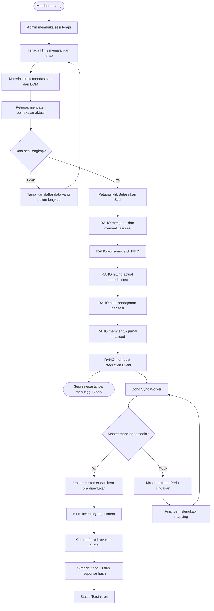

## 6. Flow sesi terapi dan pemakaian barang

### 6.1 Pengalaman petugas klinik

Petugas tidak melihat form Zoho. Pada langkah **Material**, sistem menampilkan:

- rekomendasi BOM;
- stok tersedia;
- satuan pemakaian;
- jumlah aktual;
- indikator sesuai/melebihi rekomendasi;
- alasan deviasi hanya jika diperlukan.

Saat klik **Selesaikan Sesi**, UI menampilkan ringkasan:

- material yang dikonsumsi;
- cabang dan lokasi stok;
- status kelengkapan;
- konfirmasi bahwa stok akan dikurangi.

Status sinkronisasi Zoho tidak boleh menghambat pelayanan. Setelah transaksi lokal
berhasil, UI cukup menampilkan:

> Sesi berhasil diselesaikan. Data Finance sedang disinkronkan otomatis.

### 6.2 Flow detail material

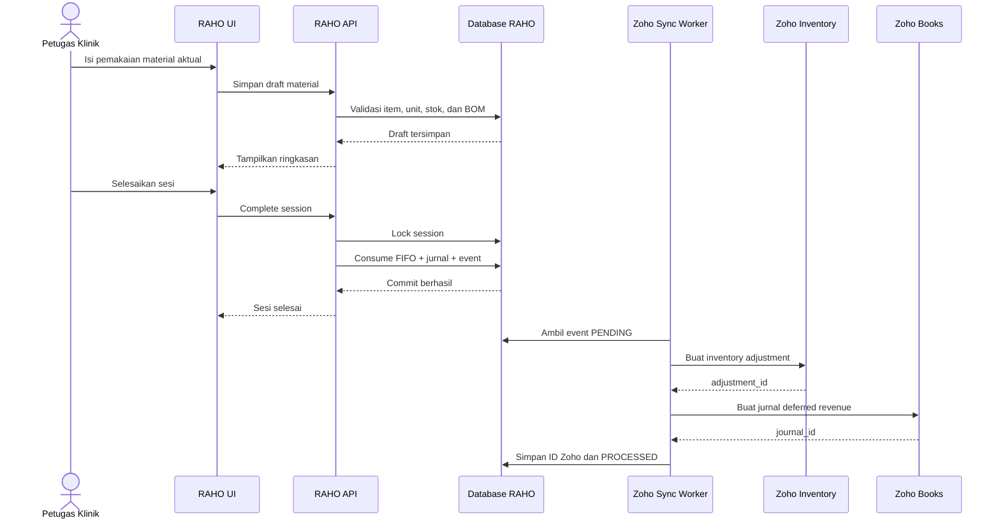

### 6.3 Pembatalan sesi

Pembatalan tidak boleh menghapus adjustment atau jurnal Zoho.

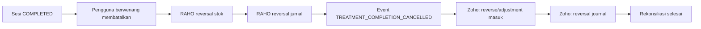

## 7. Flow invoice dan pembayaran

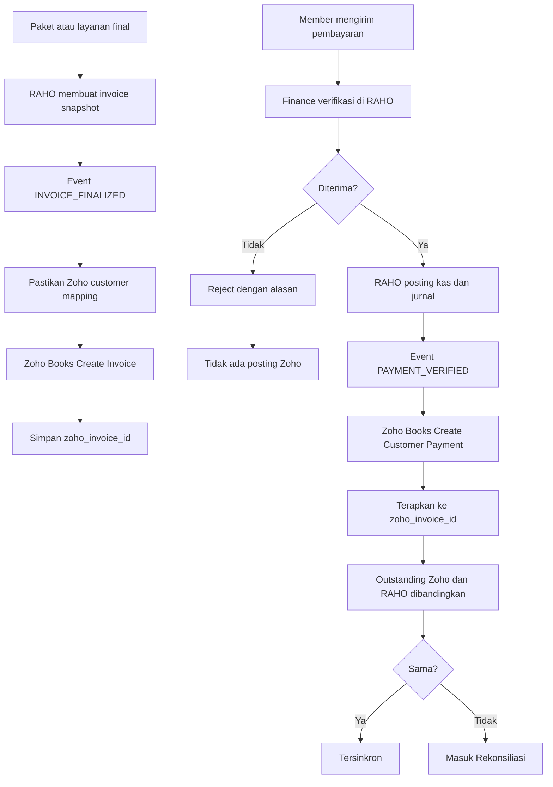

Aturan penting:

- Payment Zoho hanya dibuat setelah payment RAHO `VERIFIED`.
- Payment rejected tidak dikirim.
- Pembayaran parsial menggunakan `amount_applied`.
- Jangan membuat customer payment dan bank transaction kedua untuk pembayaran
  yang sama.
- Refund atau pembatalan menggunakan aksi refund/void yang sesuai, bukan delete.

## 8. Flow purchasing dan AP

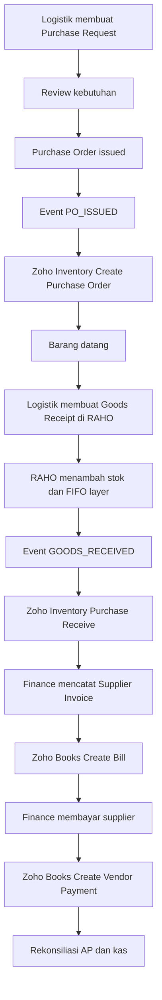

Purchase Request internal tidak harus dikirim ke Zoho karena bukan dokumen
akuntansi eksternal. Sinkronisasi dimulai ketika PO sudah resmi diterbitkan.

## 9. Flow expense

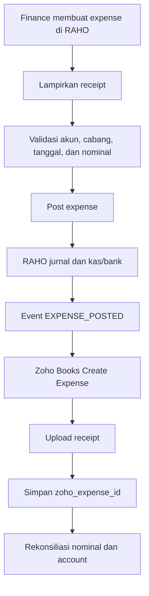

## 10. Flow opening balance

Opening balance hanya digunakan saat cutover, bukan sebagai mekanisme
sinkronisasi harian.

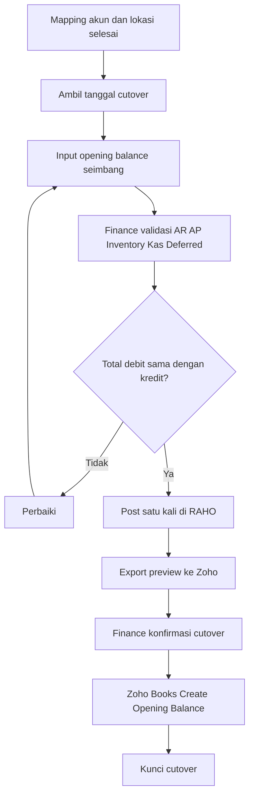

Untuk opening balance, meskipun Finance bersifat autonomous, tetap disarankan
ada langkah konfirmasi eksplisit karena operasi ini berdampak ke seluruh saldo
awal organisasi dan tidak boleh terkirim dua kali.

## 11. Mekanisme sinkronisasi yang aman

### 11.1 Transactional outbox

RAHO tidak memanggil Zoho di dalam transaksi bisnis utama.

1. Transaksi RAHO dan `IntegrationEvent` disimpan dalam commit database yang sama.
2. Worker mengambil event `PENDING`.
3. Worker mengubah status menjadi `PROCESSING`.
4. Worker memanggil Zoho.
5. Response dan external ID disimpan.
6. Event menjadi `PROCESSED`.
7. Error sementara dijadwalkan ulang.
8. Error mapping/validasi menjadi `FAILED` dan tampil di UI.

### 11.2 Idempotency dan duplicate protection

Setiap objek Zoho harus memiliki referensi unik RAHO:

- `RAHO_MEMBER_ID`;
- `RAHO_INVOICE_ID`;
- `RAHO_PAYMENT_ID`;
- `RAHO_SESSION_ID`;
- `RAHO_INVENTORY_POSTING_ID`;
- `RAHO_EXPENSE_ID`;
- `RAHO_PO_ID`;
- `RAHO_BILL_ID`;
- `RAHO_JOURNAL_ID`.

Gunakan custom field Zoho yang ditandai unik jika modul mendukungnya. Sebelum
create ulang:

1. cek tabel mapping lokal;
2. cari custom field/reference RAHO di Zoho;
3. jika ditemukan, simpan external ID dan anggap sebagai replay;
4. hanya create ketika keduanya tidak ditemukan.

### 11.3 Retry

| Jenis kegagalan | Tindakan |
|---|---|
| Timeout, 429, atau 5xx | retry otomatis dengan exponential backoff |
| Access token kedaluwarsa | refresh token lalu retry |
| Mapping customer/item/account belum ada | hentikan dan minta tindakan Finance |
| Payload tidak valid | FAILED, tampilkan field yang harus diperbaiki |
| Dokumen sudah ada di Zoho | link ke external ID, jangan create ulang |
| Periode Zoho tertutup | FAILED, jangan mengubah tanggal otomatis |
| Konflik nominal | masuk rekonsiliasi, jangan overwrite otomatis |

Contoh jadwal retry: 1 menit, 5 menit, 15 menit, 1 jam, 6 jam. Setelah batas
percobaan, event tetap tersimpan dan dapat di-retry manual.

### 11.4 Urutan dependency

Worker harus menjamin urutan:

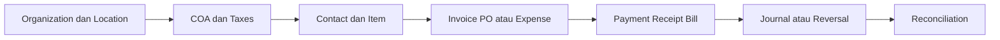

Customer payment tidak boleh dikirim sebelum invoice dan customer memiliki ID
Zoho. Purchase receive tidak boleh dikirim sebelum item, vendor, location, dan
purchase order terpetakan.

## 12. Model data baru yang diperlukan

### 12.1 `ZohoConnection`

- organization ID;
- Books API base URL;
- Inventory API base URL;
- data center;
- encrypted refresh token;
- token expiry;
- status koneksi;
- last health check;
- connected by/at.

Access token dan refresh token tidak boleh dikirim ke browser atau disimpan
sebagai plain text.

### 12.2 `ZohoEntityMapping`

- entity type;
- RAHO entity ID;
- Zoho entity ID;
- organization ID;
- branch/location ID;
- external reference;
- last synced version/hash;
- last synced at;
- unique constraint per entity.

### 12.3 `ZohoSyncJob`

- integration event ID;
- operation;
- dependency key;
- status;
- attempts;
- next attempt;
- request hash;
- response code;
- safe error message;
- external ID;
- started/finished at.

Payload sensitif dan OAuth token tidak boleh ditulis ke log.

### 12.4 `ZohoReconciliationResult`

- reconciliation date;
- entity type;
- local count/total;
- Zoho count/total;
- difference count/amount;
- status;
- details;
- resolved by/at;
- resolution note.

## 13. Event baru yang diperlukan

| Event | Aggregate | Target |
|---|---|---|
| `CUSTOMER_READY` | Member | Zoho Contact |
| `VENDOR_ACTIVATED` | Supplier | Zoho Contact |
| `ITEM_ACTIVATED` | MasterProduct | Zoho Inventory Item |
| `INVOICE_FINALIZED` | Invoice | Zoho Books Invoice |
| `INVOICE_VOIDED` | Invoice | Void Zoho Invoice |
| `PAYMENT_VERIFIED` | Payment | Customer Payment |
| `PAYMENT_REFUNDED` | Payment | Payment Refund |
| `EXPENSE_POSTED` | Expense | Zoho Expense |
| `EXPENSE_REVERSED` | Expense | Void/reversal |
| `PO_ISSUED` | PurchaseOrder | Zoho Purchase Order |
| `GOODS_RECEIVED` | GoodsReceipt | Zoho Purchase Receive |
| `SUPPLIER_INVOICE_POSTED` | SupplierInvoice | Zoho Bill |
| `AP_PAYMENT_POSTED` | SupplierPayment | Zoho Vendor Payment |
| `INVENTORY_ADJUSTMENT_POSTED` | InventoryAdjustment | Zoho Item Adjustment |
| `TREATMENT_COMPLETED` | TreatmentSession | Item Adjustment + journal |
| `TREATMENT_COMPLETION_CANCELLED` | TreatmentSession | Reversal adjustment + journal |
| `MANUAL_JOURNAL_POSTED` | JournalEntry | Zoho Journal |
| `OPENING_BALANCE_POSTED` | OpeningBalance | Zoho Opening Balance |

## 14. Perubahan backend per modul

### 14.1 Modul integration/zoho baru

Tambahkan komponen:

- OAuth connect dan callback;
- encrypted token store;
- Books HTTP client;
- Inventory HTTP client;
- token refresh single-flight;
- rate-limit handler;
- entity mapper;
- event dispatcher;
- sync worker;
- reconciliation service;
- webhook receiver;
- health endpoint;
- permission dan audit logging.

### 14.2 Sesi terapi

- Pertahankan `TREATMENT_COMPLETED` yang sudah ada.
- Tambahkan versi payload jika field Zoho diperlukan.
- Tambahkan correlation ID untuk adjustment dan journal.
- Pastikan cancellation event mengacu pada ID Zoho transaksi asli.
- Jangan memasukkan data medis ke payload.

### 14.3 Invoice dan payment

- Buat event hanya setelah invoice final.
- Buat payment event hanya setelah verified.
- Simpan Zoho customer, invoice, dan payment ID.
- Tambahkan status sync tanpa mengubah status bisnis invoice/payment.
- Dukungan partial payment, refund, void, dan replay.

### 14.4 Inventory dan purchasing

- Sinkronkan master item dan lokasi lebih dahulu.
- Buat event ketika PO issued dan goods receipt posted.
- Treatment usage dikirim sebagai adjustment dari actual quantity.
- FIFO detail tetap disimpan di RAHO.
- Tambahkan rekonsiliasi quantity per item dan location.

### 14.5 Accounting

- Cache mapping COA Zoho.
- Blok sinkronisasi jika akun belum terpetakan.
- Tambahkan policy untuk menentukan jurnal mana yang dikirim.
- Tandai jurnal yang dampaknya sudah dibentuk oleh entity Zoho agar tidak
  terkirim dua kali.
- Semua reversal harus menunjuk dokumen Zoho asli.

### 14.6 Laporan

- Tambahkan laporan status sync.
- Tambahkan rekonsiliasi RAHO versus Zoho.
- Bedakan `status bisnis`, `status posting`, dan `status sinkronisasi`.
- Laporan resmi tidak dianggap selesai sebelum selisih ditangani.

## 15. Rancangan UI profesional dan responsif

### 15.1 Menu baru

Tambahkan menu **Integrasi Zoho** di area Finance dengan empat tab:

1. **Ringkasan**
2. **Antrean Sinkronisasi**
3. **Mapping**
4. **Rekonsiliasi**

Konfigurasi OAuth ditempatkan pada **Pengaturan Integrasi**, bukan di halaman
transaksi harian.

### 15.2 Ringkasan

Desktop:

```text
┌──────────────────────────────────────────────────────────────────┐
│ Integrasi Zoho                     [Terhubung] [Sinkronkan ulang] │
├───────────────┬───────────────┬───────────────┬──────────────────┤
│ Tersinkron    │ Dalam antrean │ Perlu tindakan│ Terakhir sukses  │
│ 1.284         │ 12            │ 3             │ 10:42 WIB        │
├──────────────────────────────────────────────────────────────────┤
│ Kesehatan koneksi                                               │
│ Books ✓   Inventory ✓   OAuth ✓   Webhook ✓                     │
├──────────────────────────────────────────────────────────────────┤
│ Aktivitas terbaru                                               │
└──────────────────────────────────────────────────────────────────┘
```

Mobile:

- kartu satu kolom;
- tombol utama selebar layar;
- tidak ada tabel horizontal untuk ringkasan;
- angka dan status tetap terlihat tanpa scroll horizontal.

### 15.3 Antrean sinkronisasi

Filter:

- status;
- modul;
- cabang;
- rentang tanggal;
- nomor referensi;
- hanya yang perlu tindakan.

Kolom desktop:

| Status | Modul | Dokumen RAHO | Tujuan Zoho | Waktu | Percobaan | Aksi |
|---|---|---|---|---|---:|---|

Pada mobile, setiap baris berubah menjadi kartu:

```text
Payment • PAY-2026-0012
Perlu tindakan
Invoice Zoho belum terhubung

27 Jul 2026 10:35 • Percobaan 2
[Lihat detail] [Perbaiki mapping]
```

Jangan tampilkan raw JSON kepada Finance. Detail error harus diterjemahkan,
misalnya:

- “Akun Bank BCA belum dipetakan ke Zoho.”
- “Item Infus NaCl belum mempunyai Zoho Item ID.”
- “Periode Juli 2026 sudah ditutup di Zoho.”

Raw request/response hanya tersedia untuk technical support dengan permission
khusus dan data sensitif sudah disamarkan.

### 15.4 Mapping

Mapping dibuat sebagai wizard:

1. organisasi;
2. cabang ke Zoho location;
3. akun;
4. pajak;
5. metode pembayaran;
6. item;
7. customer/vendor yang belum cocok;
8. preview dan aktivasi.

Setiap langkah menampilkan:

- jumlah sudah cocok;
- jumlah belum cocok;
- saran auto-match;
- pencarian dropdown dengan kontras tinggi;
- validasi sebelum lanjut.

Tidak menggunakan input JSON.

### 15.5 Status di layar yang sudah ada

Tambahkan badge kecil dan konsisten:

- `Belum dikirim`;
- `Dalam antrean`;
- `Tersinkron`;
- `Perlu tindakan`;
- `Dibatalkan di Zoho`.

Badge muncul pada detail invoice, payment, expense, PO, goods receipt, journal,
dan sesi completed. Badge tidak boleh mengambil alih status bisnis utama.

Contoh:

```text
Status pembayaran: Terverifikasi
Sinkronisasi Zoho: Tersinkron • ZP-4600000053219
```

### 15.6 Prinsip visual

- Gunakan design token yang sudah dipakai RAHO.
- Kontras teks minimum tetap terbaca pada dark mode.
- Dropdown native harus menetapkan warna option agar tidak putih di atas putih.
- Fokus keyboard terlihat jelas.
- Tombol retry bukan satu-satunya pembeda status; gunakan ikon dan teks.
- Target sentuh minimum 44 × 44 px.
- Form menggunakan label tetap, bukan hanya placeholder.
- Tabel berubah menjadi card list pada layar kecil.
- Error ditampilkan dekat field atau mapping yang bermasalah.

## 16. Hak akses

| Aksi | Finance | Logistik | Admin Layanan | Super Admin |
|---|---:|---:|---:|---:|
| Melihat status sync transaksi sendiri | Ya | Ya | Ya | Ya |
| Retry transaksi finance | Ya | Tidak | Tidak | Ya |
| Retry inventory/purchasing | Ya | Ya | Tidak | Ya |
| Mengubah mapping akun | Ya | Tidak | Tidak | Ya |
| Mengubah mapping item/lokasi | Ya | Ya | Tidak | Ya |
| Connect/disconnect organisasi | Terbatas | Tidak | Tidak | Ya |
| Melihat token OAuth | Tidak | Tidak | Tidak | Tidak |
| Menjalankan cutover opening | Ya | Tidak | Tidak | Ya |

Finance tidak memerlukan approval Super Admin untuk transaksi harian. Namun,
disconnect organisasi, mengganti organization ID, dan mengulang opening balance
adalah tindakan konfigurasi berisiko tinggi dan harus dibatasi.

## 17. Rekonsiliasi

Rekonsiliasi dilakukan harian dan bulanan.

### Harian

- invoice count dan total;
- customer payment count dan total;
- expense count dan total;
- item adjustment quantity;
- failed sync;
- dokumen tanpa Zoho ID.

### Bulanan

- AR outstanding;
- AP outstanding;
- kas/bank;
- pendapatan;
- deferred revenue;
- persediaan;
- HPP;
- trial balance.

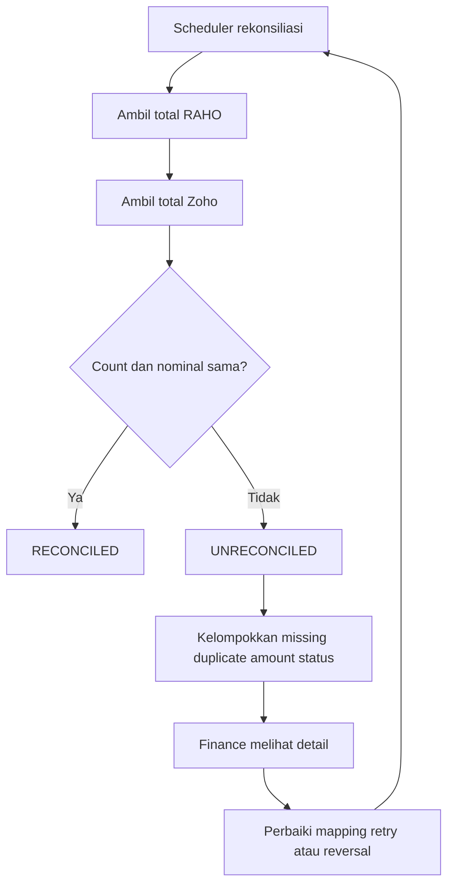

## 18. Tahapan implementasi

### Fase 0 — keputusan bisnis

- Tentukan organisasi dan data center Zoho.
- Tentukan paket Zoho Books/Inventory yang digunakan.
- Tentukan tanggal cutover.
- Setujui COA, pajak, lokasi, dan metode pembayaran.
- Putuskan secara tertulis sumber utama setiap entity.

### Fase 1 — fondasi

- OAuth dan penyimpanan token terenkripsi.
- Zoho connection health.
- mapping table;
- sync job;
- worker;
- retry;
- audit;
- dashboard read-only.

### Fase 2 — master data

- location;
- COA;
- tax;
- payment method;
- customer/vendor;
- item.

### Fase 3 — invoice dan payment

- invoice final;
- partial/full customer payment;
- void/refund;
- AR reconciliation.

Fase ini memberi pengurangan input Finance paling cepat.

### Fase 4 — sesi terapi dan inventory

- treatment completed;
- material adjustment;
- completion cancellation;
- deferred revenue;
- inventory/HPP reconciliation.

### Fase 5 — purchasing, AP, dan expense

- PO;
- purchase receive;
- bill;
- vendor payment;
- expense dan attachment.

### Fase 6 — cutover dan laporan

- opening balance satu kali;
- historical link bila dibutuhkan;
- dashboard reconciliation;
- month-end checklist.

## 19. Acceptance criteria

Integrasi belum boleh disebut berjalan baik sebelum kriteria berikut lulus:

1. Menyelesaikan satu sesi hanya menghasilkan satu inventory adjustment Zoho.
2. Retry completion tidak menghasilkan adjustment atau jurnal ganda.
3. Pemakaian material RAHO sama dengan quantity yang dikirim ke Zoho.
4. Detail medis tidak muncul pada payload/log Zoho.
5. Sesi tetap dapat diselesaikan ketika Zoho sedang tidak tersedia.
6. Event gagal terlihat oleh Finance dengan pesan yang dapat dipahami.
7. Retry manual memproses event yang sama, bukan membuat event baru.
8. Pembayaran parsial menurunkan outstanding invoice dengan benar di dua sistem.
9. Payment rejected tidak membentuk transaksi Zoho.
10. Payment verified hanya membuat satu customer payment.
11. Goods receipt tidak dapat terkirim sebelum PO, vendor, item, dan location mapped.
12. Reversal menunjuk transaksi asli dan tidak menghapus audit history.
13. Total invoice, payment, expense, inventory, dan ledger dapat direkonsiliasi.
14. Token OAuth tidak pernah muncul di browser, audit log, atau error UI.
15. UI dapat digunakan pada desktop, tablet, dan mobile tanpa input JSON.
16. Dropdown tetap terbaca pada light mode dan dark mode.
17. User tanpa permission tidak dapat retry atau mengubah mapping.
18. Opening balance tidak dapat dikirim dua kali.

## 20. UAT minimum

| ID | Skenario | Hasil yang diharapkan |
|---|---|---|
| ZOHO-01 | Connect OAuth | Organization tampil dan token tersimpan aman |
| ZOHO-02 | Complete sesi normal | Stok FIFO lokal, adjustment Zoho, dan jurnal sesuai |
| ZOHO-03 | Retry complete sesi | Tidak ada duplicate |
| ZOHO-04 | Zoho down saat completion | Sesi sukses lokal, event tetap PENDING |
| ZOHO-05 | Item belum mapped | Event perlu tindakan, tidak ada posting parsial |
| ZOHO-06 | Perbaiki mapping lalu retry | Event menjadi PROCESSED |
| ZOHO-07 | Cancel completion | Adjustment dan jurnal reversal terbentuk |
| ZOHO-08 | Final invoice | Satu Zoho invoice dengan snapshot yang sama |
| ZOHO-09 | Partial payment | Outstanding sama di RAHO dan Zoho |
| ZOHO-10 | Reject payment | Tidak ada customer payment Zoho |
| ZOHO-11 | Dua request payment bersamaan | Hanya satu Zoho payment |
| ZOHO-12 | PO sampai vendor payment | PO, receive, bill, dan payment saling terhubung |
| ZOHO-13 | Expense dengan receipt | Expense dan lampiran tersedia di Zoho |
| ZOHO-14 | Rekonsiliasi harian | Selisih nol atau exception teridentifikasi |
| ZOHO-15 | Mobile UI | Semua tindakan utama dapat dilakukan tanpa horizontal scroll |

## 21. Hal yang harus dikonfirmasi sebelum coding

Keputusan berikut tidak boleh diasumsikan oleh developer:

1. Zoho Books saja atau Zoho Books bersama Zoho Inventory.
2. Organization ID dan data center Zoho.
3. Apakah Zoho menjadi ledger resmi atau hanya salinan integrasi.
4. Apakah invoice dibuat saat paket dibeli atau saat layanan diberikan.
5. Kebijakan deferred revenue per paket dan per sesi.
6. Apakah inventory adjustment Zoho membentuk nilai/HPP yang akan dipakai sebagai
   ledger resmi.
7. Mapping cabang ke location dan gudang Zoho.
8. Mapping COA, pajak, metode pembayaran, serta rounding.
9. Tanggal cutover dan data historis yang ikut dipindahkan.
10. Batas waktu retry dan pihak yang menerima notifikasi exception.

Setelah sepuluh keputusan tersebut disetujui, implementasi dapat dimulai dari
Fase 1 tanpa mengubah user flow klinik yang sudah berjalan.

## 22. OAuth scope Zoho

Gunakan OAuth 2.0 **server-based application**, `access_type=offline`, dan
Authorization Code Flow. Refresh token harus disimpan terenkripsi di backend.
Jangan menggunakan `ZohoInventory.FullAccess.all` atau memberikan operasi
`DELETE` untuk integrasi harian.

### 22.1 Scope Zoho Books yang direkomendasikan

```text
ZohoBooks.contacts.CREATE
ZohoBooks.contacts.READ
ZohoBooks.contacts.UPDATE

ZohoBooks.settings.CREATE
ZohoBooks.settings.READ
ZohoBooks.settings.UPDATE

ZohoBooks.invoices.CREATE
ZohoBooks.invoices.READ
ZohoBooks.invoices.UPDATE

ZohoBooks.customerpayments.CREATE
ZohoBooks.customerpayments.READ
ZohoBooks.customerpayments.UPDATE

ZohoBooks.expenses.CREATE
ZohoBooks.expenses.READ
ZohoBooks.expenses.UPDATE

ZohoBooks.bills.CREATE
ZohoBooks.bills.READ
ZohoBooks.bills.UPDATE

ZohoBooks.vendorpayments.CREATE
ZohoBooks.vendorpayments.READ
ZohoBooks.vendorpayments.UPDATE

ZohoBooks.banking.READ

ZohoBooks.accountants.CREATE
ZohoBooks.accountants.READ
ZohoBooks.accountants.UPDATE
```

Kegunaannya:

| Scope | Penggunaan RAHO |
|---|---|
| `contacts` | Customer/member dan vendor/supplier |
| `settings` | Tax, currency, item preference, opening balance, location, dan webhook |
| `invoices` | Membuat, membaca, dan melakukan perubahan status invoice |
| `customerpayments` | Pembayaran parsial/penuh serta refund yang didukung |
| `expenses` | Expense dan receipt |
| `bills` | Supplier invoice/AP |
| `vendorpayments` | Pembayaran supplier |
| `banking.READ` | Membaca data untuk rekonsiliasi tanpa membuat transaksi bank ganda |
| `accountants` | Chart of Accounts, jurnal, dan pemeriksaan ledger terkait |

Jika Purchase Order akan dikirim ke **Zoho Books**, tambahkan:

```text
ZohoBooks.purchaseorders.CREATE
ZohoBooks.purchaseorders.READ
ZohoBooks.purchaseorders.UPDATE
```

Jangan menambahkan scope tersebut jika Purchase Order dipusatkan di Zoho
Inventory.

### 22.2 Scope Zoho Inventory yang direkomendasikan

```text
ZohoInventory.items.CREATE
ZohoInventory.items.READ
ZohoInventory.items.UPDATE

ZohoInventory.inventoryadjustments.CREATE
ZohoInventory.inventoryadjustments.READ
ZohoInventory.inventoryadjustments.UPDATE

ZohoInventory.purchaseorders.CREATE
ZohoInventory.purchaseorders.READ
ZohoInventory.purchaseorders.UPDATE

ZohoInventory.purchasereceives.CREATE
ZohoInventory.purchasereceives.READ
ZohoInventory.purchasereceives.UPDATE

ZohoInventory.settings.READ
```

Kegunaannya:

| Scope | Penggunaan RAHO |
|---|---|
| `items` | Master barang dan pencocokan Zoho item ID |
| `inventoryadjustments` | Pemakaian bahan terapi, stock opname, dan reversal quantity |
| `purchaseorders` | Purchase Order resmi |
| `purchasereceives` | Penerimaan barang berdasarkan PO |
| `settings.READ` | Membaca organisasi, tax, currency, dan konfigurasi lokasi |

Jika contact pada Zoho Inventory tidak otomatis tersedia dari integrasi native
Zoho Books, tambahkan:

```text
ZohoInventory.contacts.CREATE
ZohoInventory.contacts.READ
ZohoInventory.contacts.UPDATE
```

Jika Bill dipusatkan di Zoho Inventory, tambahkan scope berikut dan hapus
duplikasi pembuatan Bill melalui Zoho Books:

```text
ZohoInventory.bills.CREATE
ZohoInventory.bills.READ
ZohoInventory.bills.UPDATE
```

### 22.3 Scope untuk fase awal

Implementasi sebaiknya meminta scope bertahap.

| Fase | Scope |
|---|---|
| Koneksi dan mapping | Books `contacts.READ`, `settings.READ`, `accountants.READ`; Inventory `items.READ`, `settings.READ` |
| Invoice dan payment | Books `contacts.CREATE/READ/UPDATE`, `invoices.CREATE/READ/UPDATE`, `customerpayments.CREATE/READ/UPDATE`, `banking.READ` |
| Terapi dan inventory | Inventory `items.CREATE/READ/UPDATE`, `inventoryadjustments.CREATE/READ/UPDATE` dan Books `accountants.CREATE/READ/UPDATE` |
| Purchasing/AP | Inventory `purchaseorders` dan `purchasereceives`; Books `bills` dan `vendorpayments` |
| Expense | Books `expenses.CREATE/READ/UPDATE` |
| Cutover | Books `settings.CREATE/READ/UPDATE` untuk opening balance |

### 22.4 Scope yang tidak diberikan secara default

```text
ZohoBooks.*.DELETE
ZohoInventory.*.DELETE
ZohoInventory.FullAccess.all
```

Alasannya:

- transaksi posted tidak boleh dihapus untuk memperbaiki kesalahan;
- RAHO menggunakan void, refund, reversal, atau adjustment kompensasi;
- scope yang terlalu luas memperbesar risiko ketika token bocor;
- akses dapat ditambah melalui consent ulang jika kebutuhan baru benar-benar
  muncul.

### 22.5 Contoh parameter authorization

Scope dikirim sebagai daftar yang dipisahkan koma:

```text
https://accounts.zoho.com/oauth/v2/auth
  ?client_id={CLIENT_ID}
  &response_type=code
  &redirect_uri={RAHO_ZOHO_CALLBACK_URL}
  &access_type=offline
  &prompt=consent
  &state={CSRF_STATE}
  &scope=ZohoBooks.contacts.CREATE,ZohoBooks.contacts.READ,ZohoBooks.contacts.UPDATE,...
```

Domain accounts harus menyesuaikan data center organisasi Zoho. Nilai `state`
wajib divalidasi pada callback untuk melindungi proses OAuth dari CSRF.

### 22.6 Opsi akses seluruh fitur Zoho Books

Jika keputusan organisasi adalah memberikan akses API ke seluruh fitur Zoho
Books, gunakan scope tunggal:

```text
ZohoBooks.fullaccess.all
```

Contoh authorization URL:

```text
https://accounts.zoho.com/oauth/v2/auth
  ?scope=ZohoBooks.fullaccess.all
  &client_id={CLIENT_ID}
  &response_type=code
  &redirect_uri={RAHO_ZOHO_CALLBACK_URL}
  &access_type=offline
  &prompt=consent
  &state={CSRF_STATE}
```

Scope penuh hanya memperluas izin OAuth. Akses aktual tetap bergantung pada:

- role dan permission user Zoho yang memberikan consent;
- organization yang dipilih;
- paket/edition Zoho Books;
- fitur yang diaktifkan pada organization;
- endpoint yang memang tersedia pada Zoho Books API.

Walaupun token menggunakan full access, backend RAHO tetap harus membatasi
operasi melalui permission internal. Endpoint generic proxy yang menerima URL,
method, atau payload Zoho bebas tidak boleh dibuat.

RAHO hanya boleh memanggil operasi yang sudah mempunyai:

- use case bisnis;
- schema request;
- permission;
- audit log;
- idempotency;
- duplicate protection;
- reversal/void policy;
- integration test.

Karena full access juga berpotensi mengizinkan operasi penghapusan, kode
integrasi RAHO tidak boleh menyediakan fungsi generic delete. Transaksi posted
tetap dikoreksi dengan void, refund, reversal, atau compensating entry.

Untuk production, user Zoho yang memberikan consent sebaiknya merupakan
dedicated integration user, bukan akun pribadi Finance atau Super Admin.
Perubahan role user tersebut harus masuk change management karena dapat
mengurangi atau menambah kemampuan token tanpa perubahan scope.

## 23. Alternatif hanya menggunakan Zoho Books

### 23.1 Keputusan yang direkomendasikan

RAHO dapat diintegrasikan hanya dengan Zoho Books tanpa Zoho Inventory dengan
pembagian berikut:

- RAHO menjadi **subledger inventory resmi** untuk quantity, batch, lokasi
  internal, reservation, mutasi, dan FIFO.
- Zoho Books menjadi **general ledger resmi** untuk nilai persediaan, HPP,
  pendapatan, kas/bank, AR, AP, dan laporan keuangan.
- Master item tetap dibuat atau dipetakan ke Zoho Books Items.
- Pembelian dikirim sebagai Purchase Order dan Bill.
- Pemakaian bahan terapi dikirim sebagai jurnal nilai, bukan sebagai transaksi
  penjualan palsu.

Zoho Books mendukung inventory item, location, inventory valuation, dan FIFO
dari sisi produk. Namun, dokumentasi API publik Zoho Books yang digunakan dalam
blueprint ini tidak menyediakan endpoint Books khusus untuk membuat quantity
inventory adjustment seperti endpoint pada Zoho Inventory. Karena itu, quantity
stok sesi terapi tidak boleh dianggap otomatis sama di kedua sistem.

### 23.2 Sumber data pada mode Books-only

| Data | Sumber utama |
|---|---|
| Quantity tersedia | RAHO |
| Quantity per lokasi | RAHO |
| Batch dan expiry | RAHO |
| Reservation | RAHO |
| FIFO allocation aktual | RAHO |
| Actual material cost | RAHO |
| Nilai akun persediaan | Zoho Books setelah jurnal |
| HPP | Zoho Books setelah jurnal |
| Invoice, AR, payment | Zoho Books |
| AP, expense, cash/bank | Zoho Books |

Label pada UI harus menyebutkan:

> Quantity operasional bersumber dari RAHO. Nilai keuangan bersumber dari Zoho
> Books setelah rekonsiliasi.

### 23.3 Flow sesi terapi Books-only

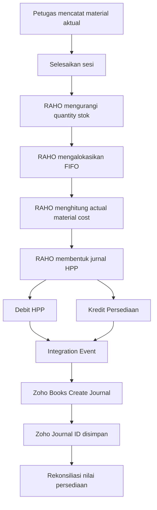

Contoh jurnal pemakaian material:

```text
Debit  HPP/Pemakaian Bahan Terapi       Rp 150.000
Kredit Persediaan Bahan Medis           Rp 150.000
```

Deferred revenue tetap dibuat sebagai jurnal terpisah atau satu compound journal
yang dapat ditelusuri:

```text
Debit  Pendapatan Diterima Dimuka        Rp 500.000
Kredit Pendapatan Terapi                 Rp 500.000
```

Worker harus menjamin jurnal HPP hanya dikirim satu kali menggunakan
`RAHO_SESSION_ID` atau `RAHO_JOURNAL_ID` sebagai unique reference.

### 23.4 Flow purchasing Books-only

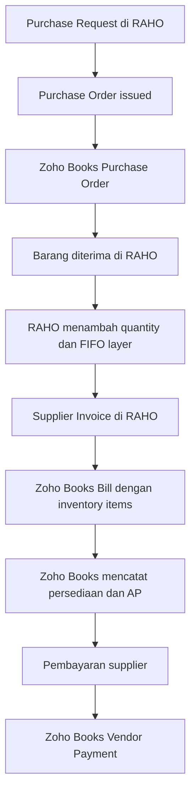

Goods receipt tetap menjadi dokumen operasional RAHO. Bill Zoho baru dibuat
setelah supplier invoice diterima agar persediaan dan AP tidak dicatat dua kali.

### 23.5 Pemetaan fitur Books-only

| Fitur RAHO | Zoho Books |
|---|---|
| Member | Contact customer |
| Supplier | Contact vendor |
| Master barang | Item dengan `item_type=inventory` |
| Cabang | Location |
| Purchase Order | Purchase Order |
| Goods receipt | Disimpan di RAHO; referensinya dibawa ke Bill |
| Supplier invoice | Bill |
| Pembayaran supplier | Vendor Payment |
| Invoice member | Invoice |
| Pembayaran member | Customer Payment |
| Expense | Expense |
| Pemakaian material terapi | Journal HPP dan persediaan |
| Deferred revenue release | Journal |
| Stock opname | Journal selisih nilai setelah adjustment RAHO |
| Opening inventory | Opening balance/account dan item setup saat cutover |

### 23.6 Scope Books-only

Tidak ada scope `ZohoInventory.*`. Scope yang diperlukan:

```text
ZohoBooks.contacts.CREATE
ZohoBooks.contacts.READ
ZohoBooks.contacts.UPDATE

ZohoBooks.settings.CREATE
ZohoBooks.settings.READ
ZohoBooks.settings.UPDATE

ZohoBooks.invoices.CREATE
ZohoBooks.invoices.READ
ZohoBooks.invoices.UPDATE

ZohoBooks.customerpayments.CREATE
ZohoBooks.customerpayments.READ
ZohoBooks.customerpayments.UPDATE

ZohoBooks.expenses.CREATE
ZohoBooks.expenses.READ
ZohoBooks.expenses.UPDATE

ZohoBooks.purchaseorders.CREATE
ZohoBooks.purchaseorders.READ
ZohoBooks.purchaseorders.UPDATE

ZohoBooks.bills.CREATE
ZohoBooks.bills.READ
ZohoBooks.bills.UPDATE

ZohoBooks.vendorpayments.CREATE
ZohoBooks.vendorpayments.READ
ZohoBooks.vendorpayments.UPDATE

ZohoBooks.banking.READ

ZohoBooks.accountants.CREATE
ZohoBooks.accountants.READ
ZohoBooks.accountants.UPDATE
```

`ZohoBooks.settings` digunakan untuk item inventory, tax, currency, location,
opening balance, dan konfigurasi terkait. `ZohoBooks.accountants` digunakan
untuk COA dan jurnal.

### 23.7 Kontrol rekonsiliasi Books-only

Karena quantity detail tetap berada di RAHO, rekonsiliasi bulanan harus
membandingkan:

```text
RAHO inventory valuation
vs
saldo akun Persediaan di Zoho Books
```

Status:

- `RECONCILED`: nilainya sama;
- `TIMING_DIFFERENCE`: ada event valid yang belum tersinkron;
- `MAPPING_ERROR`: akun/item/location belum terpetakan;
- `UNEXPLAINED_DIFFERENCE`: perlu investigasi Finance.

Selisih tidak boleh otomatis dipaksa menjadi nol. Finance harus dapat membuka
detail item, sesi, inventory posting, journal RAHO, dan Zoho journal yang
menyebabkan selisih.

### 23.8 Batasan

Mode Books-only cocok jika kebutuhan utama adalah:

- menghilangkan input Finance berulang;
- mempunyai GL, AR, AP, kas/bank, invoice, expense, dan laporan di Zoho Books;
- menjaga inventory operasional lengkap di RAHO.

Mode ini tidak cocok jika manajemen mewajibkan Zoho Books menjadi sumber quantity
stok real-time per sesi, batch, dan lokasi. Untuk kebutuhan tersebut diperlukan
endpoint inventory adjustment yang didukung resmi, Zoho Inventory, atau keputusan
proses lain yang dikonfirmasi langsung dengan Zoho.

Jangan menggunakan solusi berikut:

- membuat invoice nol/palsu untuk mengurangi stok terapi;
- membuat sales order fiktif;
- mengubah opening stock setiap hari;
- mengirim jurnal HPP dan adjustment bernilai sama secara bersamaan;
- mengubah saldo tanpa source document RAHO.
