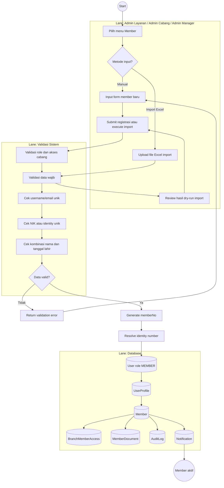
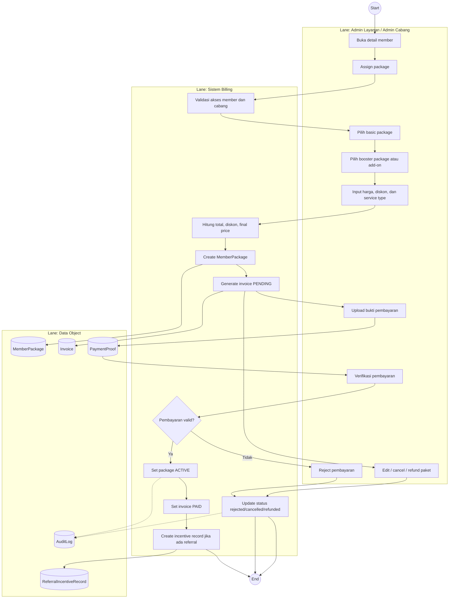
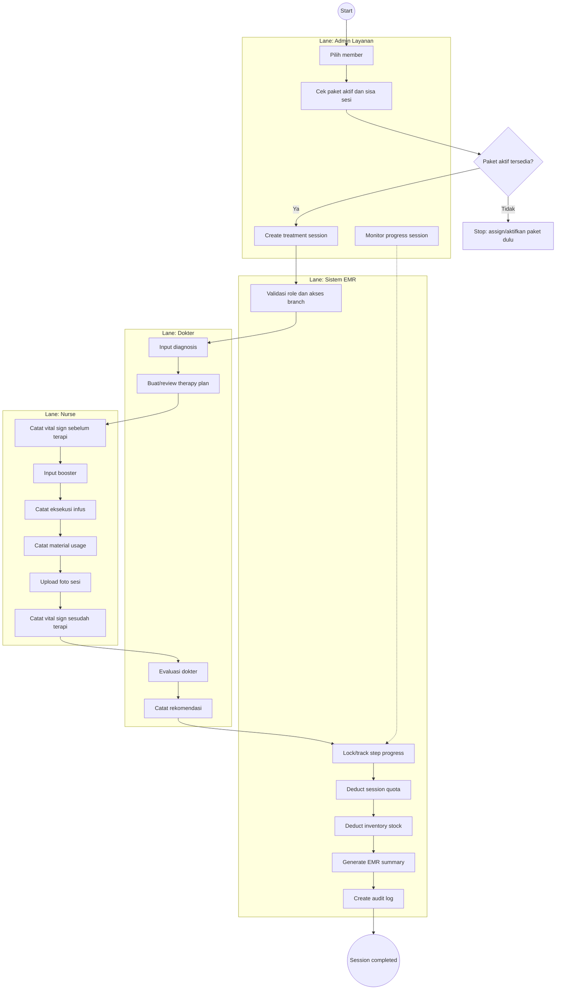
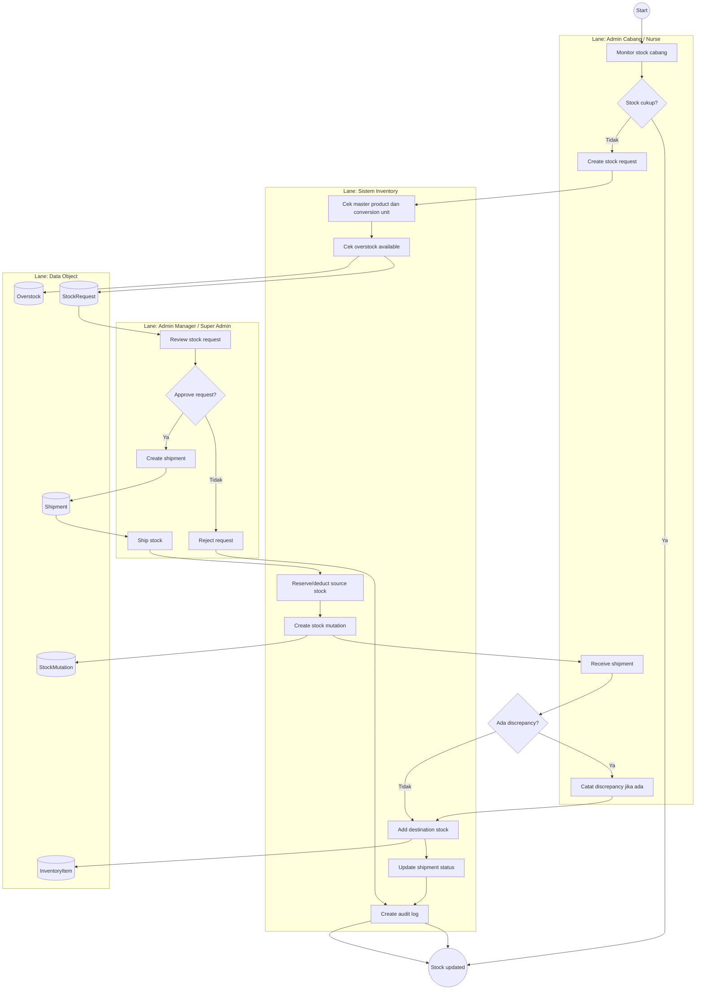
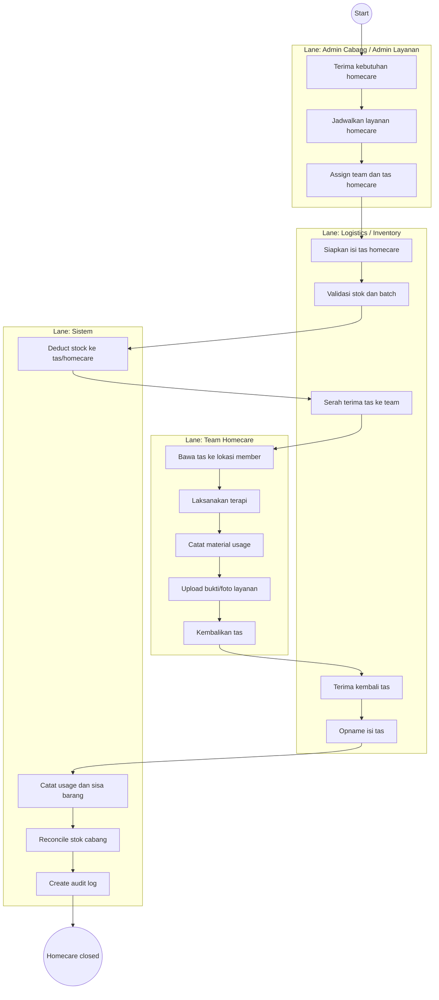
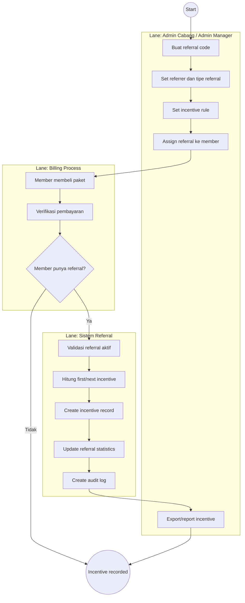
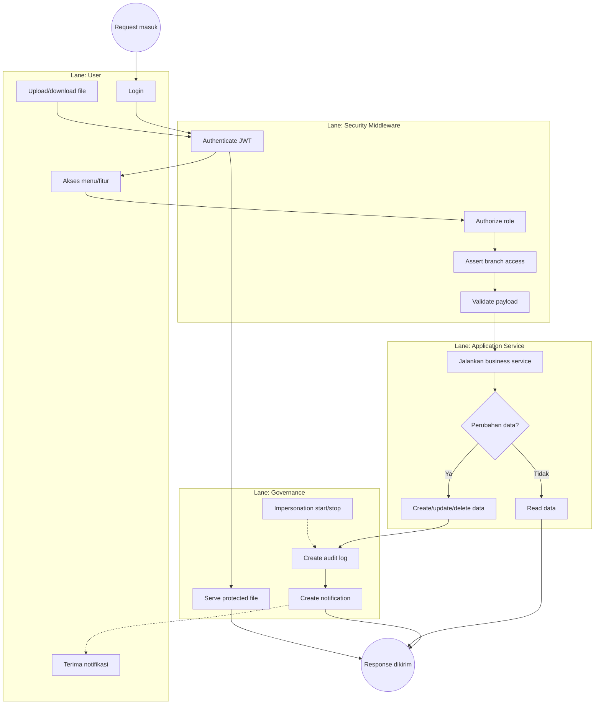

# BPMN Aplikasi RAHO ERP Management System

Dokumen ini berisi pemodelan proses bisnis utama RAHO ERP dalam format Markdown dengan diagram Mermaid. Notasi dibuat bergaya BPMN dengan pool/lane, event, activity, gateway, dan data object agar mudah dibaca di GitHub, GitLab, atau VS Code extension yang mendukung Mermaid.

Tanggal penyusunan: 17 Juli 2026.

## Daftar Isi

1. [Legenda Notasi](#1-legenda-notasi)
2. [BPMN Level 0 - End-to-End Operasional Klinik](#2-bpmn-level-0---end-to-end-operasional-klinik)
3. [BPMN Member Registration dan Import](#3-bpmn-member-registration-dan-import)
4. [BPMN Paket, Invoice, dan Pembayaran](#4-bpmn-paket-invoice-dan-pembayaran)
5. [BPMN Sesi Terapi dan EMR](#5-bpmn-sesi-terapi-dan-emr)
6. [BPMN Inventory, Stock Request, dan Shipment](#6-bpmn-inventory-stock-request-dan-shipment)
7. [BPMN Homecare Logistics](#7-bpmn-homecare-logistics)
8. [BPMN Referral dan Insentif](#8-bpmn-referral-dan-insentif)
9. [BPMN Communication, Audit, dan Governance](#9-bpmn-communication-audit-dan-governance)
10. [Catatan Implementasi](#10-catatan-implementasi)

## 1. Legenda Notasi

| Simbol | Arti |
| --- | --- |
| `((Start))` | Start event |
| `((End))` | End event |
| `[Activity]` | Task/activity |
| `{Gateway?}` | Decision/exclusive gateway |
| `[(Data)]` | Data object atau database record |
| `subgraph Lane` | Pool/lane aktor atau sistem |
| Garis solid | Sequence flow |
| Garis putus-putus | Data/audit/notification side effect |

Catatan: Mermaid tidak menyediakan notasi BPMN native lengkap. Karena itu, diagram di dokumen ini memakai `flowchart` sebagai representasi BPMN yang praktis untuk dokumentasi teknis.

## 2. BPMN Level 0 - End-to-End Operasional Klinik

Diagram ini menggambarkan proses besar dari setup sistem, registrasi member, pembelian paket, terapi, konsumsi stok, pembayaran, hingga audit.

```mermaid
flowchart LR
    START((Mulai))
    END((Selesai))

    subgraph ADMIN["Lane: Super Admin / Admin Manager"]
        A1[Setup cabang]
        A2[Setup role, staff, manager]
        A3[Setup harga paket dan master produk]
        A4[Monitor dashboard, audit log, performa cabang]
    end

    subgraph FRONT["Lane: Admin Cabang / Admin Layanan"]
        F1[Registrasi atau import member]
        F2[Kelola data member dan dokumen]
        F3[Assign paket dan add-on]
        F4[Create sesi terapi]
        F5[Kelola invoice dan pembayaran]
    end

    subgraph CLINIC["Lane: Dokter / Nurse"]
        C1[Input diagnosis]
        C2[Buat atau review therapy plan]
        C3[Catat vital sign awal]
        C4[Eksekusi terapi dan booster]
        C5[Catat material usage]
        C6[Upload foto dan evaluasi]
        C7[Complete session]
    end

    subgraph LOGISTIC["Lane: Inventory / Logistics"]
        L1[Monitor stok cabang]
        L2[Request stok]
        L3[Approve dan proses shipment]
        L4[Receive stok]
        L5[Stock mutation dan overstock]
    end

    subgraph SYSTEM["Lane: Sistem RAHO ERP"]
        S1[(Database RAHO)]
        S2[Generate nomor dokumen]
        S3[Create audit log]
        S4[Kirim notifikasi]
        S5[Hitung referral incentive]
    end

    START --> A1 --> A2 --> A3 --> F1 --> F2 --> F3 --> F5
    F3 --> F4 --> C1 --> C2 --> C3 --> C4 --> C5 --> C6 --> C7 --> END
    C5 --> L1
    L1 --> L2 --> L3 --> L4 --> L5
    F5 --> S5
    A1 -.-> S1
    F1 -.-> S1
    F3 -.-> S2
    C7 -.-> S3
    L5 -.-> S3
    S3 -.-> A4
    S4 -.-> F2
```

## 3. BPMN Member Registration dan Import

Proses ini mencakup registrasi manual member dan import Excel. Output utamanya adalah user `MEMBER`, profile, data member, nomor member, akses cabang, dokumen, dan audit log.

### Business Rules

| Rule | Penjelasan |
| --- | --- |
| Member number | Digenerate otomatis dengan pola `MBR-{BRANCH}-{YYMM}-{SEQ}`. |
| NIK/identity | Jika tersedia, harus unik pada tabel member. |
| Duplicate person guard | Nama dan tanggal lahir yang sama dianggap potensi member duplicate. |
| Import valid rows | Baris valid diproses; baris invalid masuk daftar skipped. |
| Branch access | Member dibuat dengan `registrationBranchId` dan `BranchMemberAccess` untuk cabang terkait. |

## 4. BPMN Paket, Invoice, dan Pembayaran

Proses ini mencakup assign paket, generate invoice, upload bukti bayar, verifikasi, aktivasi paket, refund, dan cancel.

### Status Utama

| Entity | Status | Makna |
| --- | --- | --- |
| Package | `PENDING_PAYMENT` | Paket sudah dibuat, belum aktif. |
| Package | `ACTIVE` | Paket dapat dipakai sesi terapi. |
| Package | `CANCELLED` | Paket dibatalkan. |
| Package | `REFUNDED` | Paket dikembalikan sesuai proses refund. |
| Invoice | `PENDING` | Tagihan belum lunas. |
| Invoice | `PAID` | Pembayaran sudah diverifikasi. |

## 5. BPMN Sesi Terapi dan EMR

Proses terapi mengikuti workflow klinis multi-step: create session, diagnosis, therapy plan, vital sign, booster, infusion, material usage, foto, evaluasi, completion.

### Step Operasional Sesi

| Step | Aktor utama | Output |
| --- | --- | --- |
| Diagnosis | Dokter/Admin layanan sesuai izin | Member/session diagnosis |
| Therapy plan | Dokter/Admin layanan sesuai izin | Therapy plan set dan detail dosis |
| Vital before | Nurse | Vital signs awal |
| Booster | Nurse/Admin layanan | Booster package usage |
| Infusion | Nurse | Infusion execution data |
| Material usage | Nurse | Penggunaan barang dan mutasi stok |
| Photo | Nurse/Admin layanan | Session photo/supporting document |
| Vital after | Nurse | Vital signs akhir |
| Evaluation | Dokter | Evaluasi dan rekomendasi |

## 6. BPMN Inventory, Stock Request, dan Shipment

Proses ini mencakup stok cabang, request stok, approval, shipment, receive, discrepancy, dan overstock.

### Business Rules

| Rule | Penjelasan |
| --- | --- |
| Stock mutation | Semua adjustment, shipment, receive, dan material usage menghasilkan mutasi stok. |
| Unit conversion | Stok dapat dibaca dalam base unit dan usage unit. |
| Overstock | Overstock dapat dipakai sebagai sumber pemenuhan request sesuai perhitungan sistem. |
| Receive discrepancy | Perbedaan jumlah diterima harus dicatat saat receive. |

## 7. BPMN Homecare Logistics

Proses homecare berhubungan dengan tas homecare, penyiapan barang, serah terima, penggunaan, dan rekonsiliasi stok.

## 8. BPMN Referral dan Insentif

Referral dipakai untuk mencatat sumber akuisisi member dan menghitung insentif saat pembayaran paket diverifikasi.

## 9. BPMN Communication, Audit, dan Governance

Proses governance berjalan sebagai side process di banyak workflow: autentikasi, otorisasi, audit, notifikasi, file access, dan impersonation.

### Governance Rules

| Area | Rule |
| --- | --- |
| Authentication | Semua endpoint staff/member dilindungi JWT kecuali endpoint publik tertentu. |
| Authorization | Akses fitur dibatasi role: Super Admin, Admin Manager, Admin Cabang, Admin Layanan, Dokter, Nurse, Member. |
| Branch scope | Data operasional cabang mengikuti `branchId`, managed branches, atau branch access. |
| Audit | Perubahan penting seperti create/update/delete, payment verification, stock mutation, dan impersonation dicatat. |
| File access | Dokumen dan foto disajikan lewat endpoint file yang tetap memeriksa user/session. |

## 10. Catatan Implementasi

| Domain | Modul utama |
| --- | --- |
| Identity dan role | `auth`, `users`, `admin`, middleware auth/authorize |
| Cabang | `branches`, `admin-manager` |
| Member dan referral | `members`, `referrals` |
| Paket, invoice, billing | `packages`, `invoices`, `non-therapy` |
| Clinical dan EMR | `treatment-sessions`, `diagnosis`, therapy plan services |
| Inventory dan logistics | `inventory`, stock request, shipment, overstock |
| Member portal | `me` |
| Governance | `audit-logs`, notifications, file serving, impersonation |

Dokumen pendukung:

- `docs/BUSINESS-FLOW.md`
- `docs/UML-APLIKASI.md`
- `docs/MODULES-BY-ROLE.md`
- `docs/CORE-IDENTITY-AND-BRANCH.md`
- `docs/MEMBER-AND-REFERRAL.md`
- `docs/03-COMMERCIAL-AND-BILLING.md`
- `docs/04-CLINICAL-AND-EMR.md`
- `docs/05-INVENTORY-AND-LOGISTICS.md`
- `docs/06-HOMECARE-LOGISTICS.md`
- `docs/07-COMMUNICATION-AND-GOVERNANCE.md`
