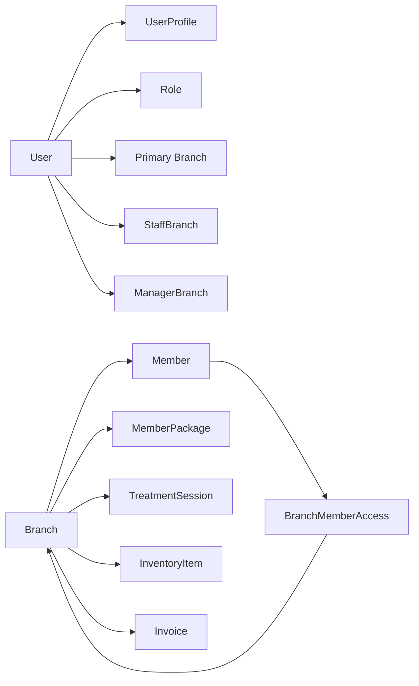
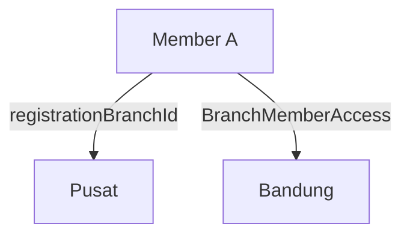
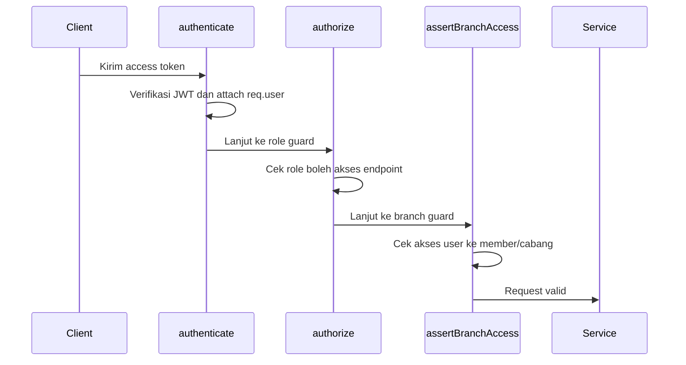

# Core Identity and Branch

Dokumen ini menjelaskan konsep **Core Identity** dan **Branch** pada sistem RAHO. Keduanya menjadi fondasi untuk menentukan siapa pengguna yang sedang aktif, role apa yang dimiliki, cabang mana yang menjadi konteks kerja, dan data apa saja yang boleh diakses.

## Ringkasan

**Core Identity** adalah lapisan identitas utama sistem. Di dalamnya terdapat akun pengguna, profil pengguna, role, status aktif, cabang utama, serta daftar cabang tambahan yang bisa diakses.

**Branch** adalah unit operasional klinik. Hampir semua data bisnis penting seperti member, paket, sesi terapi, invoice, inventory, stock request, shipment, audit log, dan performa operasional terikat ke cabang.

Secara sederhana:

## Core Identity

Core Identity terdiri dari beberapa entitas utama:

| Entitas | Fungsi |
|---|---|
| `User` | Akun login dan sumber utama role pengguna. |
| `UserProfile` | Data profil seperti nama lengkap, telepon, dan avatar. |
| `Role` | Hak akses dasar pengguna di sistem. |
| `Branch` | Cabang utama atau konteks operasional pengguna. |
| `StaffBranch` | Assignment tambahan untuk staff medis yang bisa bekerja di beberapa cabang. |
| `ManagerBranch` | Assignment cabang untuk `ADMIN_MANAGER`, termasuk scope akses. |
| `BranchMemberAccess` | Grant akses member ke cabang lain selain cabang registrasi. |

### Role

Role yang digunakan sistem:

| Role | Makna Umum |
|---|---|
| `SUPER_ADMIN` | Akses global lintas sistem dan lintas cabang. |
| `ADMIN_MANAGER` | Mengelola beberapa cabang sesuai assignment pada `ManagerBranch`. |
| `ADMIN_CABANG` | Admin yang beroperasi pada cabang tertentu. |
| `ADMIN_LAYANAN` | Staff layanan operasional cabang. |
| `ADMIN_LOGISTIK` | Staff logistik dan inventory. |
| `DOCTOR` | Dokter yang dapat ditugaskan ke satu atau lebih cabang. |
| `NURSE` | Nakes/perawat yang dapat ditugaskan ke satu atau lebih cabang. |
| `MEMBER` | Pengguna member/pasien pada portal member. |

### User

`User` menyimpan identitas login dan otorisasi dasar:

- `email` sebagai identitas login unik.
- `password` untuk autentikasi.
- `role` sebagai dasar izin akses.
- `branchId` sebagai cabang utama pengguna.
- `adminManagerAccessScope` untuk scope akses `ADMIN_MANAGER`.
- `staffCode` untuk kode staff.
- `isActive` untuk menonaktifkan akun tanpa menghapus data historis.

`branchId` tidak selalu berarti satu-satunya cabang yang boleh diakses. Untuk role tertentu, akses cabang dapat diperluas melalui `StaffBranch` atau `ManagerBranch`.

### UserProfile

`UserProfile` memisahkan data profil dari data autentikasi. Ini menjaga agar akun login (`User`) tetap fokus pada keamanan dan otorisasi, sementara data presentasi pengguna berada di profil.

Contoh data:

- `fullName`
- `phone`
- `avatarUrl`

## Branch

`Branch` adalah master data cabang klinik. Setiap cabang memiliki:

- `branchCode` unik, misalnya kode cabang untuk nomor member, sesi, invoice, dan therapy plan.
- `name`, `address`, `city`, dan `phone`.
- `type`, yaitu `PUSAT`, `PREMIER`, atau `PARTNERSHIP`.
- `isActive` untuk menentukan apakah cabang masih dapat dipilih dan digunakan.

Branch menjadi batas utama data operasional. Data berikut terhubung ke cabang:

- member yang registrasi di cabang tersebut;
- paket dan add-on yang dibeli di cabang tersebut;
- encounter dan sesi terapi;
- invoice dan pembayaran;
- inventory cabang;
- stock request dan shipment;
- referral code;
- audit log.

## Jenis Cabang

| Branch Type | Penjelasan |
|---|---|
| `PUSAT` | Cabang pusat atau pusat operasional utama. |
| `PREMIER` | Cabang klinik premier. |
| `PARTNERSHIP` | Cabang kerja sama/partnership, termasuk kebutuhan alur stok dan pembayaran tertentu. |

## Relasi User dan Branch

Ada tiga pola hubungan user dengan branch.

### 1. Cabang Utama

`User.branchId` menyimpan cabang utama pengguna. Ini dipakai sebagai default context setelah login dan menjadi fallback untuk pengguna single-branch.

Contoh:

- `ADMIN_LAYANAN` cabang Bandung memiliki `branchId = Bandung`.
- Dokter yang pertama kali dibuat di cabang Pusat memiliki `branchId = Pusat`.

### 2. Staff Multi-Branch

`StaffBranch` memungkinkan `DOCTOR` dan `NURSE` bekerja di lebih dari satu cabang.

Aturannya:

- satu user bisa punya banyak branch assignment;
- kombinasi `userId` dan `branchId` harus unik;
- cabang utama tetap ikut dianggap sebagai cabang yang dapat diakses;
- frontend menyimpan `activeBranchId` untuk menentukan cabang yang sedang dipakai.

### 3. Manager Multi-Branch

`ManagerBranch` dipakai untuk `ADMIN_MANAGER`. Relasi ini menentukan cabang mana saja yang dapat dikelola manager.

Setiap assignment memiliki `accessScope`:

| Scope | Makna |
|---|---|
| `FULL` | Manager dapat menjalankan akses penuh sesuai fitur role manager. |
| `MEMBER_VIEW_ONLY` | Manager hanya memiliki akses terbatas untuk melihat data member. |

## Relasi Member dan Branch

Member memiliki dua konsep akses cabang:

### 1. Registration Branch

`Member.registrationBranchId` adalah cabang tempat member pertama kali didaftarkan.

Ini menjadi cabang asal member dan digunakan untuk:

- daftar member per cabang;
- pelacakan asal registrasi;
- validasi akses staff cabang;
- konteks historis data member.

### 2. Branch Member Access

`BranchMemberAccess` adalah grant akses agar cabang lain dapat melihat atau melayani member yang bukan berasal dari cabang tersebut.

Aturannya:

- satu kombinasi `memberId` dan `branchId` hanya boleh ada satu kali;
- tanpa record ini, staff cabang lain tidak otomatis dapat mengakses member;
- akses tetap dapat diberikan tanpa mengubah `registrationBranchId`.

Contoh:

Artinya, Member A terdaftar di Pusat, tetapi cabang Bandung juga diberi akses untuk melihat atau melayani member tersebut.

## Branch Access pada Request

Alur request backend memakai beberapa lapisan validasi:

`authenticate` membaca token dan mengisi `req.user` dengan:

- `userId`
- `email`
- `role`
- `branchId`
- `branchCode`
- `adminManagerAccessScope`
- `branches`

Untuk user multi-branch, sistem mengambil daftar cabang dari `StaffBranch` atau `ManagerBranch`. Untuk impersonation, user aktif adalah user terdalam yang sedang di-impersonate, sehingga guard tetap mengevaluasi konteks pengguna yang sedang dipakai.

## Aturan Akses Member

`assertBranchAccess` memberikan akses ke member jika salah satu kondisi terpenuhi:

1. user adalah `SUPER_ADMIN`;
2. cabang registrasi member termasuk cabang yang dapat diakses user;
3. ada `BranchMemberAccess` yang memberikan akses ke salah satu cabang user;
4. user adalah `ADMIN_MANAGER` dan memiliki assignment cabang melalui `ManagerBranch`;
5. user adalah `DOCTOR` atau `NURSE` dan memiliki assignment cabang melalui `StaffBranch`.

Jika tidak terpenuhi, backend mengembalikan `403 BRANCH_ACCESS_DENIED`.

## Active Branch di Frontend

Frontend menyimpan konsep `activeBranchId` di auth store. Nilai ini menentukan cabang aktif yang sedang dipakai user, terutama untuk `DOCTOR` dan `NURSE` multi-branch.

Alurnya:

1. Setelah login, `activeBranchId` diisi dari `user.branchId`.
2. Jika user punya lebih dari satu cabang, UI dapat menampilkan branch switcher.
3. Saat user memilih cabang lain, `activeBranchId` diperbarui dan disimpan.
4. Query dashboard, member, session, dan data operasional memakai cabang aktif tersebut.

Dengan pola ini, user yang sama dapat berpindah konteks cabang tanpa mengganti akun.

## Dampak ke Modul Bisnis

Branch bukan hanya data referensi, tetapi menjadi filter dan boundary utama pada modul bisnis.

| Modul | Dampak Branch |
|---|---|
| Member | Member terikat ke `registrationBranchId` dan bisa di-grant ke cabang lain. |
| Package | Paket member terkunci pada cabang pembelian. |
| Session | Sesi terapi dibuat dalam konteks cabang tertentu. |
| Therapy Plan | Kode therapy plan memakai kode cabang dari sesi. |
| Inventory | Stok dihitung per cabang melalui `InventoryItem`. |
| Stock Request | Request stok terjadi dalam konteks cabang. |
| Shipment | Pengiriman memiliki cabang asal dan cabang tujuan. |
| Invoice | Invoice dibuat dalam cabang transaksi. |
| Audit Log | Aktivitas dapat dilacak dengan konteks cabang. |

## Prinsip Desain

Sistem menggunakan beberapa prinsip penting:

- **Identity terpisah dari profile**: `User` untuk login dan role, `UserProfile` untuk data personal.
- **Branch sebagai data boundary**: data operasional selalu dipersempit berdasarkan cabang.
- **Akses eksplisit untuk lintas cabang**: akses lintas cabang tidak diasumsikan, tetapi dicatat melalui `StaffBranch`, `ManagerBranch`, atau `BranchMemberAccess`.
- **SUPER_ADMIN global**: role ini menjadi pengecualian untuk akses lintas cabang.
- **Active branch sebagai konteks kerja**: user multi-branch bekerja pada satu cabang aktif dalam satu waktu.
- **Audit-friendly**: relasi branch membantu melacak siapa melakukan apa, di cabang mana, dan pada data apa.

## Contoh Skenario

### Dokter Bekerja di Dua Cabang

1. Dokter memiliki `branchId = Pusat`.
2. Dokter diberi assignment tambahan ke Bandung melalui `StaffBranch`.
3. Saat login, cabang default adalah Pusat.
4. Dokter memilih Bandung melalui branch switcher.
5. Dashboard dan sesi terapi menggunakan Bandung sebagai `activeBranchId`.

### Member Terdaftar di Pusat tetapi Dilayani di Bandung

1. Member dibuat dengan `registrationBranchId = Pusat`.
2. Admin memberikan akses Bandung melalui `BranchMemberAccess`.
3. Staff Bandung dapat membuka data member.
4. Cabang asal member tetap Pusat.

### Admin Manager Mengelola Beberapa Cabang

1. User `ADMIN_MANAGER` memiliki beberapa record di `ManagerBranch`.
2. Setiap record menentukan cabang yang dapat dikelola.
3. Scope dapat berupa `FULL` atau `MEMBER_VIEW_ONLY`.
4. Backend memvalidasi akses berdasarkan assignment tersebut.

## Kesimpulan

Core Identity dan Branch adalah fondasi authorization RAHO. `User`, `Role`, dan `UserProfile` menjelaskan siapa pengguna sistem, sedangkan `Branch`, `StaffBranch`, `ManagerBranch`, dan `BranchMemberAccess` menentukan ruang gerak data yang boleh diakses.

Dengan model ini, RAHO dapat mendukung operasi multi-cabang tanpa mencampur data antar cabang secara bebas. Akses lintas cabang tetap mungkin, tetapi harus diberikan secara eksplisit dan dapat diaudit.

## Referensi Implementasi

- `apps/api/prisma/schema.prisma`
- `apps/api/src/middleware/authenticate.ts`
- `apps/api/src/middleware/assertBranchAccess.ts`
- `apps/web/src/stores/authStore.ts`
- Dokumen arsitektur di folder `Requirements` tentang Architecture Modeling RAHO
