# Current Finance and Logistics Flowcharts

Dokumen ini berisi kode Mermaid untuk proses finance dan logistik yang berjalan pada RAHO saat ini. Diagram bersifat **as-is** berdasarkan model database, service, endpoint, dan dokumentasi proyek yang tersedia.

Catatan batasan kondisi saat ini:

- Belum ada integrasi Zoho pada alur aktif.
- Finance operasional memakai `Invoice`, `InvoiceItem`, `InvoicePayment`, serta invoice khusus stock request.
- Homecare sudah mendukung banyak tas per tim, tetapi satu request, shipment, usage, return, dan opname masih mengacu pada satu tas per record.
- Diagram dipecah per proses agar mudah dipelihara dan dirender.

## 1. Peta Besar Finance dan Logistik Saat Ini

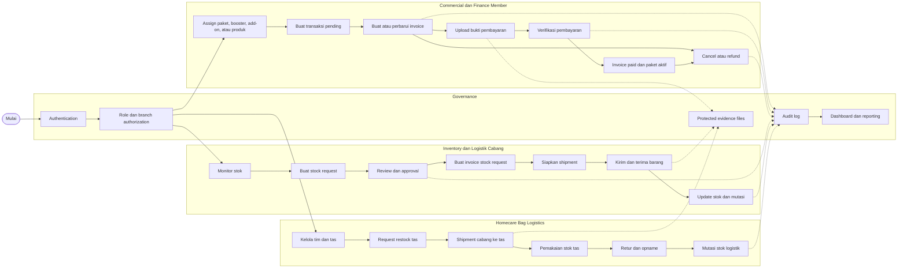

## 2. Finance — Penjualan Paket sampai Pembayaran

```mermaid
flowchart TD
    START([Mulai]) --> AUTH[Validasi user, role, dan branch]
    AUTH --> MEMBER[Pilih member]
    MEMBER --> PRODUCT[Pilih basic package, booster, add-on, atau produk]
    PRODUCT --> PRICE[Ambil master pricing atau harga yang diizinkan]
    PRICE --> INPUT[Input quantity, diskon, service type, dan payment plan]
    INPUT --> VALIDATE{Data dan harga valid?}

    VALIDATE -->|Tidak| ERROR[Return validation error]
    ERROR --> INPUT

    VALIDATE -->|Ya| CALCULATE[Hitung subtotal, diskon, pajak, dan final price]
    CALCULATE --> GROUP{Transaksi bundling?}
    GROUP -->|Ya| PURCHASE_GROUP[Generate purchaseGroupId]
    GROUP -->|Tidak| CREATE_PURCHASE[Buat record pembelian]
    PURCHASE_GROUP --> CREATE_PURCHASE

    CREATE_PURCHASE --> PURCHASE_TYPE{Jenis pembelian}
    PURCHASE_TYPE -->|Package| MEMBER_PACKAGE[Buat MemberPackage]
    PURCHASE_TYPE -->|Add-on| MEMBER_ADDON[Buat MemberAddOn]
    PURCHASE_TYPE -->|Non-therapy| NON_THERAPY[Buat MemberNonTherapyPurchase]

    MEMBER_PACKAGE --> PENDING[Set status PENDING_PAYMENT]
    MEMBER_ADDON --> PENDING
    NON_THERAPY --> PENDING

    PENDING --> PLAN{Payment plan}
    PLAN -->|Full payment| INVOICE_FULL[Buat invoice penuh]
    PLAN -->|Installment| INSTALLMENT[Generate jadwal dan paymentGroupId]
    INSTALLMENT --> INVOICE_TERM[Buat invoice termin aktif]

    INVOICE_FULL --> INVOICE_DATA[Buat Invoice dan InvoiceItem snapshot]
    INVOICE_TERM --> INVOICE_DATA
    INVOICE_DATA --> INVOICE_PENDING[Invoice PENDING_PAYMENT]

    INVOICE_PENDING --> PROOF_SOURCE{Bukti dibayar oleh siapa?}
    PROOF_SOURCE -->|Member| MEMBER_UPLOAD[Member upload bukti]
    PROOF_SOURCE -->|Staff| STAFF_UPLOAD[Staff upload atau record payment]
    MEMBER_UPLOAD --> STORE_PROOF[Simpan protected payment proof]
    STAFF_UPLOAD --> STORE_PROOF

    STORE_PROOF --> WAITING[Set WAITING_VERIFICATION atau verification PENDING]
    WAITING --> REVIEW[Admin review bukti, nominal, metode, dan referensi]
    REVIEW --> VERIFY{Pembayaran valid?}

    VERIFY -->|Tidak| REJECT[Catat rejectedBy, rejectedAt, dan reason]
    REJECT --> FIX_PROOF[Menunggu bukti atau data pembayaran diperbaiki]
    FIX_PROOF --> PROOF_SOURCE

    VERIFY -->|Ya| PAYMENT[Buat InvoicePayment]
    PAYMENT --> INVOICE_PAID[Update invoice PAID dan verification VERIFIED]
    INVOICE_PAID --> UPDATE_PAID[Update actualPaidAmount dan totalVerifiedPaid]
    UPDATE_PAID --> PURCHASE_STATUS{Seluruh kewajiban terpenuhi?}

    PURCHASE_STATUS -->|Ya| ACTIVATE[Set package atau purchase ACTIVE atau PAID]
    PURCHASE_STATUS -->|Belum, installment| NEXT_TERM[Update payment plan dan siapkan termin berikutnya]
    NEXT_TERM --> INVOICE_TERM

    ACTIVATE --> REFERRAL{Member memiliki referral eligible?}
    REFERRAL -->|Ya| INCENTIVE[Hitung dan buat ReferralIncentiveRecord]
    REFERRAL -->|Tidak| AUDIT[Create audit log]
    INCENTIVE --> AUDIT
    AUDIT --> NOTIFY[Create notification bila diperlukan]
    NOTIFY --> END([Selesai])
```

## 3. Finance — Lifecycle Invoice Manual dan Operasional

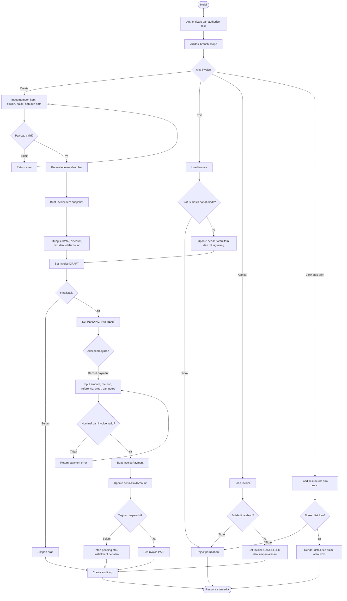

## 4. Finance — Installment Flow

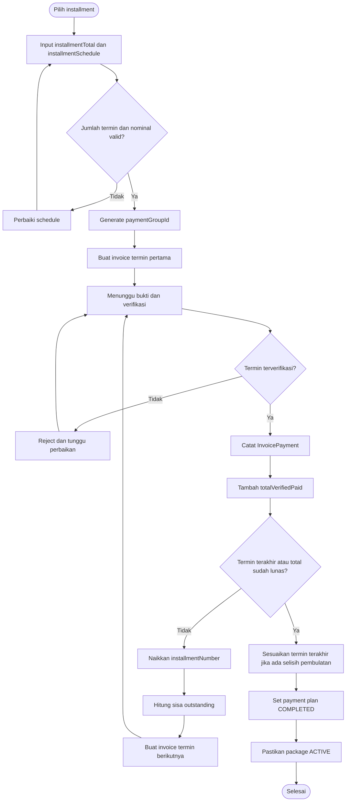

## 5. Finance — Cancel dan Refund Paket

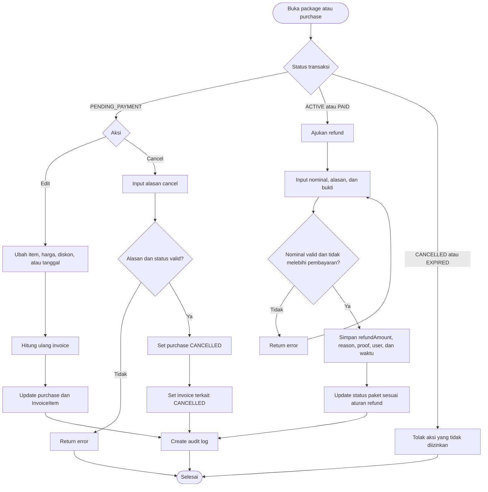

## 6. Logistik Cabang — Stock Request sampai Shipment

```mermaid
flowchart TD
    START([Mulai]) --> AUTH[Authenticate dan authorize]
    AUTH --> SCOPE[Validasi branch scope]
    SCOPE --> STOCK[Admin cabang memeriksa inventory]
    STOCK --> ENOUGH{Stok mencukupi?}
    ENOUGH -->|Ya| MONITOR[Monitoring selesai]
    ENOUGH -->|Tidak| REQUEST[Create StockRequest]

    REQUEST --> REQUEST_ITEMS[Input produk, requestedQty, priority, dan notes]
    REQUEST_ITEMS --> VALIDATE{Produk dan quantity valid?}
    VALIDATE -->|Tidak| ERROR[Return validation error]
    ERROR --> REQUEST_ITEMS
    VALIDATE -->|Ya| PENDING[Set request PENDING]

    PENDING --> REVIEW[Admin Manager atau Super Admin review]
    REVIEW --> DECISION{Approve request?}

    DECISION -->|Tidak| REJECT_REASON[Input rejection reason]
    REJECT_REASON --> REJECTED[Set request REJECTED]
    REJECTED --> AUDIT[Create audit log]

    DECISION -->|Ya| APPROVE_QTY[Set approvedQty per item]
    APPROVE_QTY --> PARTIAL{Semua quantity disetujui?}
    PARTIAL -->|Tidak| PARTIAL_APPROVED[Simpan approvedQty sebagian dan set APPROVED]
    PARTIAL -->|Ya| APPROVED[Set request APPROVED]

    PARTIAL_APPROVED --> BILLING{Request memerlukan invoice?}
    APPROVED --> BILLING
    BILLING -->|Ya| STOCK_INVOICE[Buat StockRequestInvoice]
    BILLING -->|Tidak atau gratis| PREPARE[Buat Shipment PREPARING]
    STOCK_INVOICE --> PAYMENT_TYPE{Normal, debt, atau gratis?}

    PAYMENT_TYPE -->|Normal| WAIT_PAYMENT[Request WAITING_PAYMENT dan invoice PENDING_PAYMENT]
    PAYMENT_TYPE -->|Debt| DEBT[Invoice DEBT sesuai approval plan]
    PAYMENT_TYPE -->|Gratis| FREE[Invoice PAID tanpa bukti pembayaran]

    WAIT_PAYMENT --> UPLOAD[Upload bukti pembayaran stock request]
    UPLOAD --> VERIFY{Bukti pembayaran valid?}
    VERIFY -->|Tidak| PAYMENT_REJECT[Set verification REJECTED dan minta perbaikan]
    PAYMENT_REJECT --> UPLOAD
    VERIFY -->|Ya| PAYMENT_PAID[Set invoice PAID dan verification VERIFIED]

    PAYMENT_PAID --> PREPARE
    DEBT --> PREPARE
    FREE --> PREPARE

    PREPARE --> SOURCE[Validasi source branch dan source inventory]
    SOURCE --> STOCK_AVAILABLE{Stok sumber tersedia?}
    STOCK_AVAILABLE -->|Tidak| SHORTAGE[Perbaiki approved quantity atau tunggu stok]
    SHORTAGE --> REVIEW
    STOCK_AVAILABLE -->|Ya| SHIPMENT_ITEMS[Buat ShipmentItem dari quantity final]
    SHIPMENT_ITEMS --> READY[Shipment status PREPARING]
    READY --> SHIP_ACTION[Admin sumber melakukan ship]
    SHIP_ACTION --> SHIP_VALID{Shipment masih PREPARING?}
    SHIP_VALID -->|Tidak| SHIP_ERROR[Tolak aksi ship]
    SHIP_VALID -->|Ya| DEDUCT[Kurangi atau reserve stok sumber]
    DEDUCT --> MUTATION_OUT[Buat stock mutation keluar]
    MUTATION_OUT --> SHIPPED[Set shipment dan request SHIPPED]
    SHIPPED --> RECEIVE[Cabang tujuan menerima barang]
    RECEIVE --> RECEIVE_INPUT[Input receivedQty per item dan bukti]
    RECEIVE_INPUT --> DISCREPANCY{Ada quantity kurang, lebih, rusak, atau salah item?}

    DISCREPANCY -->|Tidak| ADD_STOCK[Tambah stok cabang tujuan]
    DISCREPANCY -->|Ya| REPORT[Catat ShipmentDiscrepancy dan bukti foto]
    REPORT --> OVERSTOCK{Ada quantity lebih?}
    OVERSTOCK -->|Ya| CREATE_OVERSTOCK[Buat overstock AVAILABLE]
    OVERSTOCK -->|Tidak| ADD_STOCK
    CREATE_OVERSTOCK --> ADD_STOCK

    ADD_STOCK --> MUTATION_IN[Buat stock mutation masuk]
    MUTATION_IN --> RESULT{Penerimaan bermasalah?}
    RESULT -->|Tidak| RECEIVED[Set shipment RECEIVED dan request COMPLETED]
    RESULT -->|Ya| RECEIVED_ISSUE[Set shipment RECEIVED_WITH_ISSUE dan request COMPLETED_WITH_ISSUE]

    RECEIVED --> AUDIT
    RECEIVED_ISSUE --> AUDIT
    MONITOR --> END([Selesai])
    SHIP_ERROR --> END
    AUDIT --> NOTIFY[Update dashboard atau notification]
    NOTIFY --> END
```

## 7. Logistik — Invoice Stock Request

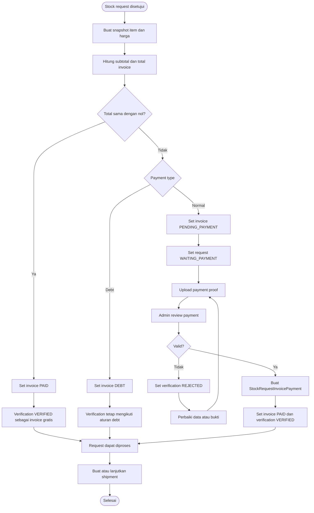

## 8. Logistik — Material Usage dari Treatment Session

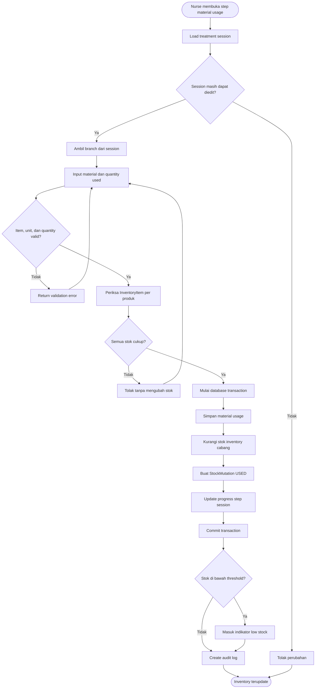

## 9. Homecare Logistics — Tim dan Tas Saat Ini

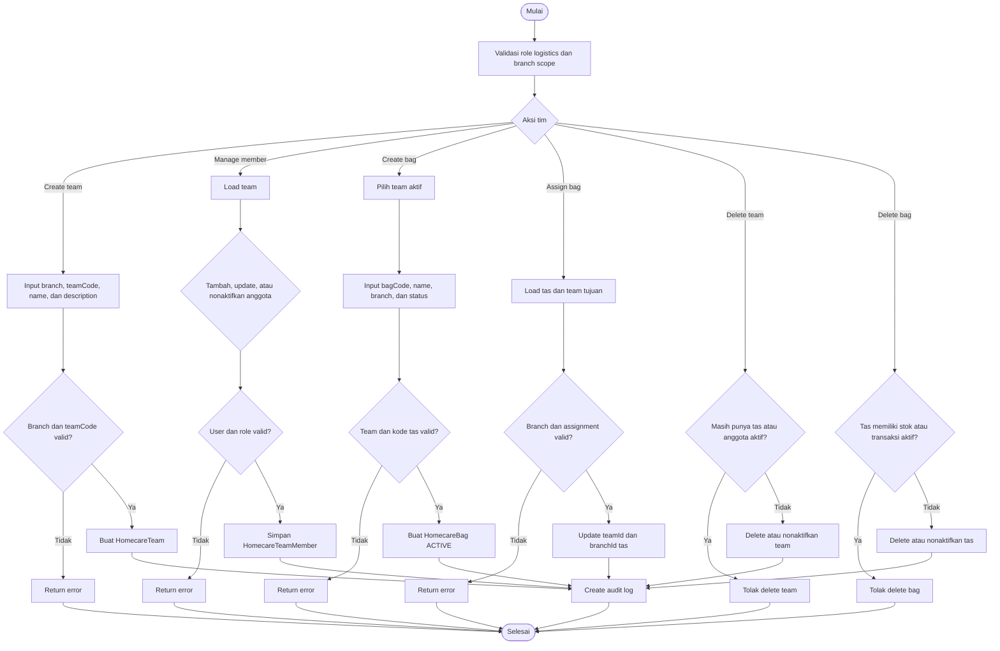

## 10. Homecare Logistics — Request dan Shipment ke Satu Tas

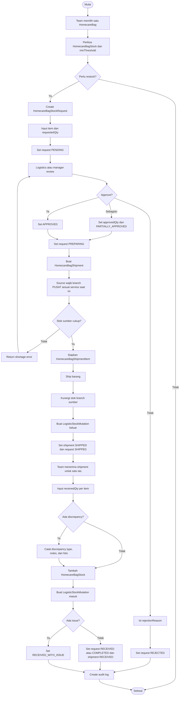

## 11. Homecare Logistics — Pemakaian, Retur, dan Opname Satu Tas

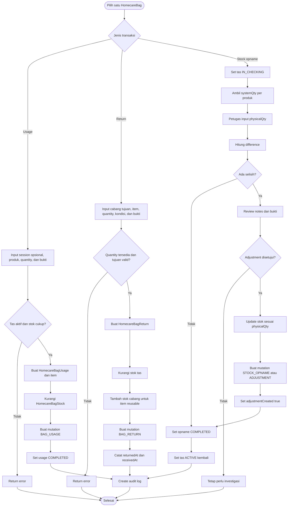

## 12. Logistik — Transfer Stok Universal

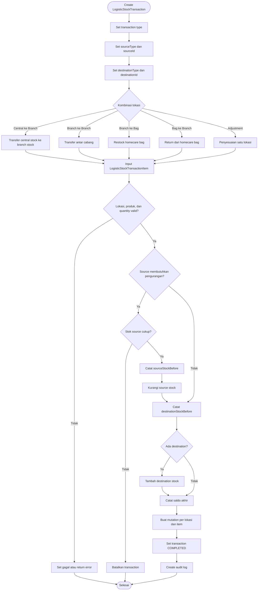

## 13. Status Finance Saat Ini

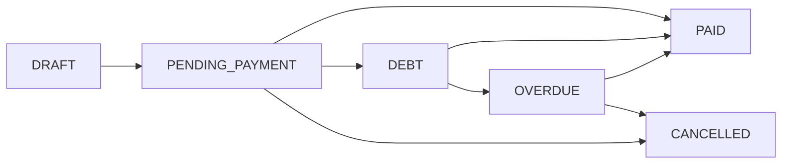

Status verifikasi pembayaran:

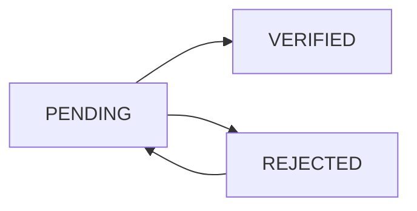

## 14. Status Stock Request dan Shipment Saat Ini

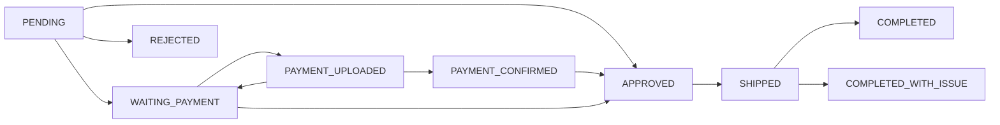

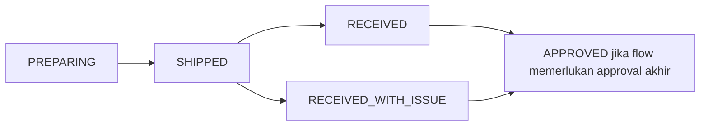

## 15. Status Homecare Bag Saat Ini

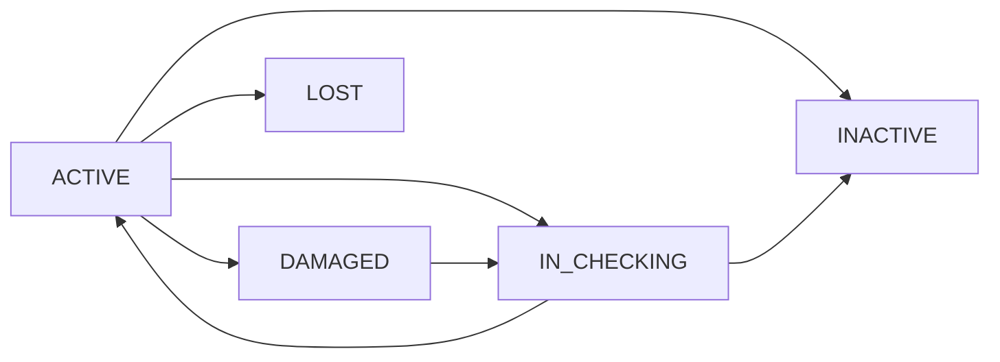

## 16. Hubungan Data Finance dan Logistik

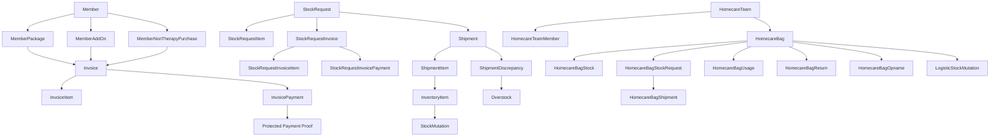

## 17. Referensi Implementasi

- `apps/api/prisma/schema.prisma`
- `apps/api/src/modules/invoices/`
- `apps/api/src/modules/packages/services/`
- `apps/api/src/modules/inventory/stock-request.service.ts`
- `apps/api/src/modules/inventory/shipment.service.ts`
- `apps/api/src/modules/inventory/logistics.service.ts`
- `apps/api/src/modules/inventory/services/`
- `docs/03-COMMERCIAL-AND-BILLING.md`
- `docs/05-INVENTORY-AND-LOGISTICS.md`
- `docs/06-HOMECARE-LOGISTICS.md`
