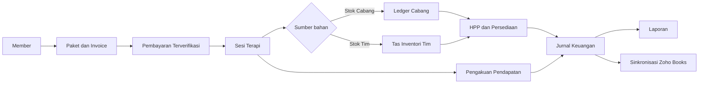
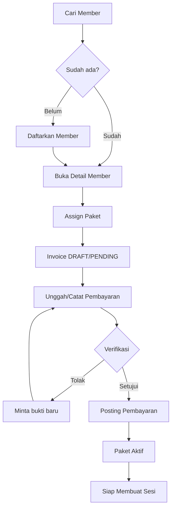
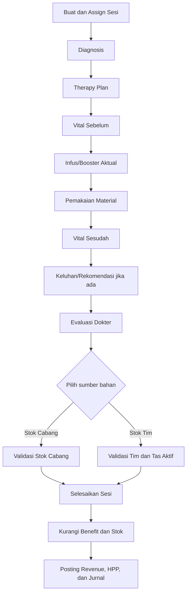
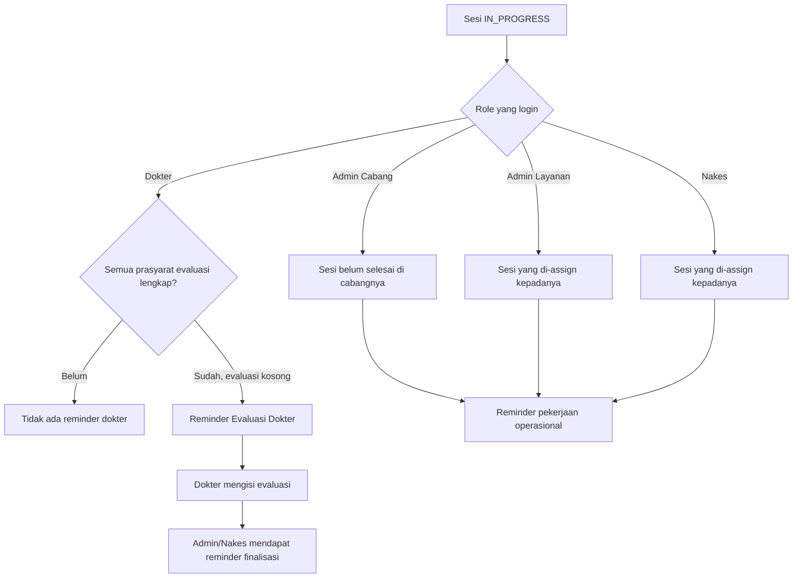
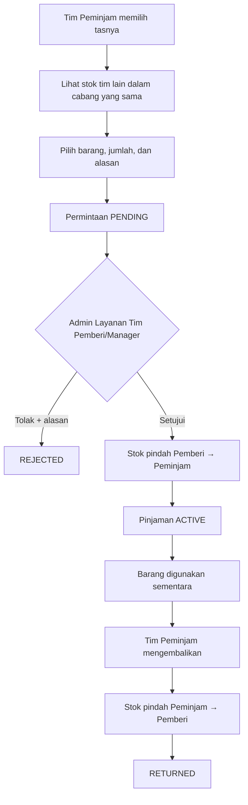
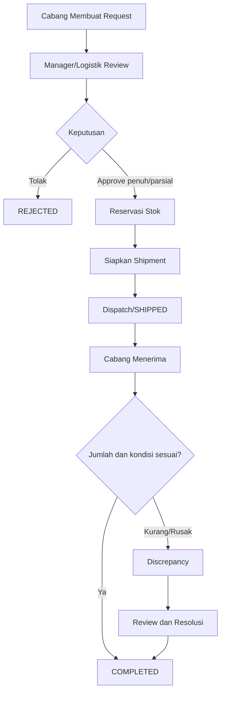
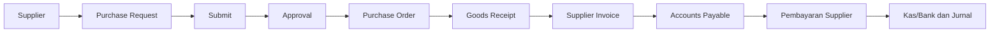
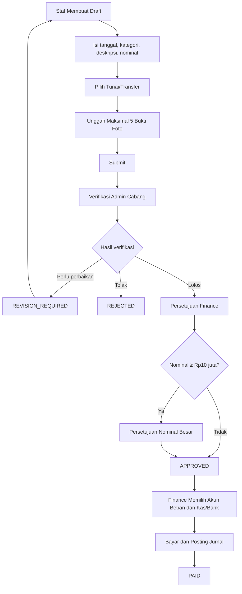
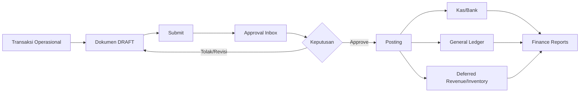
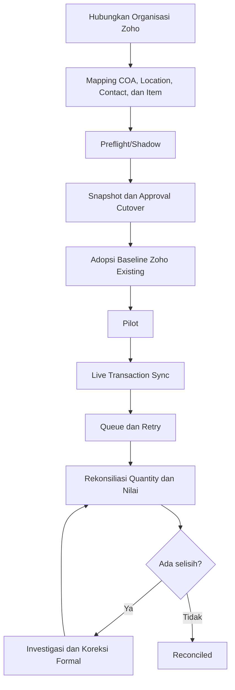

# Daftar Fitur RAHO per Role dan Flow Penggunaan

Status: ringkasan fitur yang sudah memiliki UI/API di repository  
Pembaruan: 24 Agustus 2026  
Target pembaca: owner, operasional, Finance, Logistik, tenaga medis, dan tim teknis

> Dokumen ini dibuat sebagai **cheat sheet**. Jika tidak ingin membaca panjang,
> cukup baca bagian **Ringkasan 30 Detik**, **Siapa Mengerjakan Apa**, dan diagram
> pada bagian **Flow Utama**.

Langsung lompat ke bagian yang dibutuhkan:

- [Register Fitur Lengkap + Tanggal Pembuatan](./REGISTER_FITUR_ERP_LENGKAP_DAN_TIMELINE.md)
- [Ringkasan 30 Detik](#1-ringkasan-30-detik)
- [Siapa Mengerjakan Apa?](#2-siapa-mengerjakan-apa)
- [Peta Akses Cepat](#3-peta-akses-cepat)
- [Fitur per Role](#5-fitur-per-role)
- [Flow Sesi dan Reminder](#7-flow-sesi-terapi-dan-reminder)
- [Flow Inventori Tim dan Pinjaman](#8-flow-inventori-tim-dan-pinjaman-barang)
- [Flow Reimburse](#11-flow-reimburse)
- [Flow Zoho Books](#13-flow-zoho-books)

Pusat UAT dan dokumen per role:

- [Pusat Dokumen UAT](./UAT/README.md)
- [UAT Admin Layanan / MSO](./UAT/UAT_ADMIN_LAYANAN_MSO.md)
- [UAT Nakes / Perawat](./UAT/UAT_NAKES.md)
- [UAT Dokter](./UAT/UAT_DOKTER.md)
- [UAT Admin Manager](./UAT/UAT_ADMIN_MANAGER.md)
- [UAT Finance](./UAT/UAT_FINANCE.md)

Tiga UAT terapi memakai Shared ID `TTR-01` sampai `TTR-10` agar satu sesi yang sama
dapat diuji berurutan oleh MSO, Nakes, dan Dokter.

---

## 1. Ringkasan 30 Detik

RAHO mengelola satu alur utuh:

```text
Member
  → Paket dan Invoice
  → Pembayaran
  → Sesi Terapi
  → Pemakaian Barang
  → Stok dan HPP
  → Jurnal Keuangan
  → Laporan dan Zoho Books
```

Pembagian pekerjaan paling sederhananya:

| Role | Fokus utama |
|---|---|
| **Super Admin** | Mengatur dan mengawasi seluruh sistem |
| **Admin Manager** | Mengelola beberapa cabang dan approval |
| **Admin Cabang** | Menjalankan serta mengawasi satu cabang |
| **Admin Layanan / MSO** | Mengurus member, pembayaran, dan administrasi sesi |
| **Admin Logistik** | Mengurus stok, pengiriman, purchasing, dan inventori |
| **Finance & Logistics Controller** | Mengontrol keuangan, approval, rekonsiliasi, dan Zoho |
| **Dokter** | Diagnosis, therapy plan, dan evaluasi dokter |
| **Nakes** | Melaksanakan tindakan serta mencatat kondisi dan bahan aktual |
| **Member** | Melihat paket, sesi, invoice, dan profil pribadi |

Empat fitur terbaru yang perlu diketahui:

1. Sesi dapat diselesaikan memakai **Stok Cabang** atau **Stok Tim**.
2. Tim dapat **meminjam barang dari tim lain** dalam cabang yang sama.
3. Staf dapat mengajukan **reimburse dengan bukti foto**.
4. Admin Cabang, Admin Layanan, Nakes, dan Dokter menerima **reminder sesi belum selesai** sesuai tanggung jawabnya.

---

## 2. Siapa Mengerjakan Apa?

| Pekerjaan | Pelaksana utama | Pemeriksa/approver |
|---|---|---|
| Menyiapkan cabang dan user | Super Admin, Admin Manager | Super Admin |
| Mengatur role dan permission | Super Admin | Super Admin |
| Mendaftarkan member | Admin Cabang, Admin Layanan | Sesuai branch scope |
| Menjual/assign paket | Admin Cabang, Admin Layanan | Sesuai aturan harga dan pembayaran |
| Memproses pembayaran member | Admin Layanan, Admin Cabang | Admin Cabang/role berizin |
| Membuat sesi terapi | Admin Layanan, Admin Cabang, Nakes, Manager | Sesuai branch scope |
| Diagnosis dan rencana terapi | Dokter/role medis berizin | Dokter |
| Pelaksanaan tindakan | Nakes | Dokter/Admin operasional |
| Evaluasi dokter | Dokter yang di-assign | Dokter |
| Finalisasi sesi | Staf sesi yang berwenang | Validasi otomatis sistem |
| Memilih Stok Cabang/Tim | Staf yang menyelesaikan sesi | Validasi stok otomatis |
| Request stok cabang | Admin Cabang | Manager/Logistik |
| Pengiriman stok | Admin Logistik/Manager | Penerima cabang |
| Inventori tim dan tas | Manager/Logistik; anggota tim sesuai scope | Manager/Admin Layanan tim |
| Pinjaman barang antartim | Tim peminjam | Admin Layanan tim pemberi/Manager |
| Purchase Request dan PO | Logistik/Finance/role berizin | Approver purchasing |
| Goods Receipt | Logistik/Admin Cabang | Validasi PO dan quantity |
| Expense | Cabang/Finance/role berizin | Approval workflow |
| Reimburse | Staf operasional | Admin Cabang → Finance → approver besar bila perlu |
| Pembayaran reimburse | Finance/role berizin | Hanya setelah seluruh approval selesai |
| Jurnal dan periode | Finance/Super Admin/Manager | Permission accounting |
| Rekonsiliasi dan Zoho | Controller/Super Admin | Finance dan owner proses |

---

## 3. Peta Akses Cepat

Keterangan:

- **Kelola**: dapat melakukan pekerjaan utama sesuai permission.
- **Lihat**: fokus monitoring atau membaca data.
- **Terbatas**: hanya cabang, assignment, atau tindakan tertentu.
- **—**: tidak tersedia sebagai menu utama role tersebut.

| Modul | Super | Manager | Cabang | Layanan | Logistik | Controller | Dokter | Nakes | Member |
|---|---|---|---|---|---|---|---|---|---|
| Dashboard | Kelola | Kelola | Kelola | Kelola | Kelola | Lihat | Kelola | Kelola | Pribadi |
| Member & Paket | Kelola | Kelola | Kelola | Kelola | Lihat | — | Medis | Medis | Pribadi |
| Sesi Terapi | Kelola | Kelola | Kelola | Kelola | Lihat | — | Medis | Tindakan | Lihat |
| Pembayaran Member | Kelola | Kelola | Kelola | Kelola | — | Sesuai izin | — | — | Lihat |
| Inventori Cabang | Kelola | Kelola | Kelola | — | Kelola | Lihat | — | — | — |
| Inventori Tim | Kelola | Kelola | Kelola | Terbatas | Kelola | API/scope | — | Terbatas | — |
| Pengiriman & GR | Kelola | Kelola | Kelola | Terbatas | Kelola | Kontrol | — | Terbatas | — |
| Purchasing & AP | Kelola | Kelola | Terbatas | — | Kelola | Kontrol | — | — | — |
| Accounting | Kelola | Kelola | Terbatas | — | — | Kelola | — | — | — |
| Expense | Kelola | Kelola | Kelola | Tidak di menu fokus | — | Kelola | — | — | — |
| Reimburse | Kelola | Kelola | Verifikasi | Ajukan | — | Approve/Bayar | Ajukan | Ajukan | — |
| Approval Inbox | Kelola | Kelola | Terbatas | — | Terbatas | Kelola | — | — | — |
| Laporan | Semua | Multi-cabang | Cabang | Dashboard | Logistik | Finance/Logistik | Kinerja | Operasional | Pribadi |
| Audit & Permission | Kelola | Audit | — | — | Audit | Audit | — | — | — |
| Integrasi Zoho | Kelola | — | — | — | — | Kelola | — | — | — |

> **Penting:** tampilan menu bukan satu-satunya pengaman. Server tetap memeriksa
> permission, branch scope, assignment, nominal, status dokumen, dan larangan
> self-approval.

---

## 4. Flow Utama Sistem



Versi satu kalimat:

> Member membeli paket, pembayaran diverifikasi, terapi dilaksanakan, bahan
> diambil dari stok yang dipilih, lalu sistem memperbarui benefit, stok, HPP,
> revenue, jurnal, laporan, dan antrean integrasi.

---

## 5. Fitur per Role

### 5.1 Super Admin

**Intinya:** dapat melihat dan mengelola seluruh sistem.

Fitur utama:

- Dashboard seluruh cabang.
- Cabang, staff, Admin Manager, dan assignment cabang.
- Master produk, kategori, UOM, harga, dan status produk.
- Harga paket dan import member.
- Member, paket, invoice, pembayaran, refund, dan bukti pembayaran.
- Seluruh tahapan sesi terapi, completion, pembatalan, dan reversal.
- Master inventori, ledger, mutasi, adjustment, opname, request, reservasi,
  pengiriman, Goods Receipt, Treatment BOM, Tas Homecare, dan Inventori Tim.
- Accounting, COA, jurnal, periode, kas/bank, opening balance, expense,
  purchasing, AP, deferred revenue, dan laporan keuangan.
- Seluruh tahapan reimburse, termasuk pembayaran.
- Approval Inbox, Audit Log, Permission & Role, dan Integrasi Zoho.
- Impersonasi user untuk memeriksa akses.

### 5.2 Admin Manager

**Intinya:** mengelola beberapa cabang yang menjadi tanggung jawabnya.

Fitur utama:

- Dashboard dan laporan multi-cabang.
- Member, paket, pembayaran, sesi, dan kinerja staf.
- Pengaturan cabang, referral, harga paket, dan import data.
- Master/ledger inventori, request, reservasi, shipment, Goods Receipt,
  Treatment BOM, opname, dan adjustment.
- Inventori Tim, Tas Homecare, serta pinjaman antartim.
- Accounting, Finance Reports, kas/bank, opening balance, expense, purchasing,
  AP, dan deferred revenue.
- Approval Inbox dan Audit Log.
- Seluruh permission reimburse sesuai branch scope.

Varian **Admin Manager – Member View Only** hanya dapat membuka daftar/detail
member dan profil dalam mode lihat.

### 5.3 Admin Cabang

**Intinya:** memastikan operasional satu cabang berjalan sampai selesai.

Fitur utama:

- Dashboard cabang.
- Member, paket, invoice, dan pembayaran.
- Pembuatan dan penyelesaian sesi terapi.
- Kelola staf cabang, kinerja, laporan, referral, serta harga paket.
- Stok cabang, ledger, mutasi, adjustment, opname, request, shipment,
  Goods Receipt, dan Treatment BOM.
- Inventori Tim dan Tas Homecare.
- Kas/bank, expense, purchasing, dan Approval Inbox sesuai permission.
- Mengajukan serta memverifikasi reimburse cabang.
- Notifikasi dan chat.

Reminder sesi Admin Cabang mencakup sesi `IN_PROGRESS` di cabangnya, tetapi
Evaluasi Dokter tetap tidak menjadi tugas Admin Cabang.

### 5.4 Admin Layanan / MSO

**Intinya:** menu dibuat ringkas untuk pelayanan member sehari-hari.

Menu fokus:

- Dashboard.
- Member.
- Sesi Terapi.
- Pembayaran.
- Inventori Tim.
- Reimburse.
- Notifikasi dan Chat.

Kemampuan khusus:

- Melihat reminder sesi yang di-assign kepadanya.
- Melengkapi pekerjaan operasional sesi selain Evaluasi Dokter.
- Memilih Stok Cabang atau Stok Tim ketika finalisasi sesi.
- Melihat inventori tim yang diikuti.
- Mengajukan pinjaman barang dari tim lain.
- Menyetujui/menolak pinjaman ketika menjadi Admin Layanan tim pemberi.
- Mencatat pengembalian ketika menjadi Admin Layanan tim peminjam.
- Mengajukan reimburse beserta bukti foto.

### 5.5 Admin Logistik

**Intinya:** menjaga ketersediaan, perpindahan, dan nilai persediaan.

Fitur utama:

- Dashboard Logistik dan Master Inventori.
- Ledger serta mutasi stok.
- Adjustment dan Stock Opname.
- Request, reservasi, pengiriman, penerimaan, dan resolusi discrepancy.
- Purchasing, PO, Goods Receipt, dan AP sesuai permission.
- Treatment BOM dan riwayat penggunaan material.
- Pembuatan tim, anggota, tas, stok tas, dan pengiriman tas.
- Monitoring pinjaman barang antartim.
- Laporan pengiriman, stok rendah, expiry, dan valuation.
- Approval Inbox logistik dan Audit Log.

Saat ini menu Reimburse tidak diberikan kepada Admin Logistik.

### 5.6 Finance & Logistics Controller

**Intinya:** controller dan reviewer, bukan otomatis maker semua transaksi.

Fitur utama:

- Dashboard, ledger, valuation, opname, dan adjustment inventori.
- Monitoring request, reservasi, pengiriman, dan rekonsiliasi stok.
- Accounting, COA, journal, General Ledger, dan periode.
- Kas/bank, expense, purchasing, AP, dan deferred revenue.
- Profit & Loss, Trial Balance, General Ledger, dan laporan Finance lainnya.
- Approval Inbox dan Audit Log.
- Persetujuan Finance serta pembayaran reimburse.
- Koneksi, mapping, antrean, cutover, rekonsiliasi, dan go-live Zoho Books.

### 5.7 Dokter

**Intinya:** fokus pada keputusan dan catatan klinis.

Menu fokus:

- Dashboard Dokter.
- Member.
- Sesi Terapi.
- Kinerja Staff.
- Reimburse.
- Notifikasi dan Chat.

Tanggung jawab:

- Diagnosis.
- Therapy plan sesuai kewenangan medis.
- Evaluasi Dokter.
- Memantau sesi yang di-assign.
- Mengajukan reimburse pribadi.

Dokter **tidak menerima reminder** ketika pekerjaan sebelum Evaluasi Dokter
belum lengkap.

### 5.8 Nakes / Perawat

**Intinya:** melaksanakan dan mencatat tindakan aktual.

Menu fokus:

- Dashboard Nakes.
- Member.
- Sesi Terapi.
- Inventori Tim.
- Riwayat Penggunaan Barang.
- Tas Homecare.
- Reimburse.
- Notifikasi dan Chat.

Tanggung jawab:

- Vital sebelum dan sesudah terapi.
- Infus, booster, material, foto, keluhan, dan rekomendasi sesuai permission.
- Reminder sesi hanya untuk sesi yang di-assign.
- Memilih Stok Cabang atau Stok Tim saat completion.
- Melihat/menggunakan stok tim atau tas yang diikuti.
- Mengikuti flow pinjaman barang antartim.
- Mengajukan reimburse pribadi.

### 5.9 Member

**Intinya:** portal pribadi bersifat self-service dan read-only untuk transaksi.

Fitur:

- Dashboard pribadi.
- Paket aktif dan sisa voucher/sesi.
- Riwayat serta detail sesi terapi.
- Invoice dan riwayat pembayaran.
- Profil dan avatar.
- Mode terang/gelap.

Member tidak dapat mengubah catatan medis, membuat paket, atau memverifikasi
pembayaran.

---

## 6. Flow Member, Paket, dan Pembayaran



Yang perlu diingat:

- Bukti pembayaran non-tunai wajib dapat diperiksa.
- Pembayaran parsial menyisakan outstanding.
- Paket aktif yang sudah digunakan tidak dikoreksi dengan menghapus histori.
- Refund dilakukan melalui flow resmi agar jurnal dan audit tetap utuh.

---

## 7. Flow Sesi Terapi dan Reminder

### 7.1 Flow pengisian sesi



Jika **Stok Tim** dipilih tetapi sesi tidak terhubung ke tim/tas aktif, sistem
menolak completion dan tidak diam-diam mengambil Stok Cabang.

### 7.2 Flow reminder



Aturan singkat:

- Dokter hanya diingatkan untuk **Evaluasi Dokter**.
- Admin Cabang, Admin Layanan, dan Nakes tidak diberi tugas Evaluasi Dokter.
- Setelah evaluasi terisi, role operasional dapat diingatkan untuk finalisasi.

---

## 8. Flow Inventori Tim dan Pinjaman Barang

### 8.1 Memilih stok untuk sesi

```text
Selesaikan Sesi
  ├─ Pilih Stok Cabang
  │    └─ Barang dikurangi dari ledger cabang
  └─ Pilih Stok Tim
       └─ Barang dialokasikan dari tas aktif milik tim yang terhubung
```

### 8.2 Pinjaman antartim



Proteksi otomatis:

- hanya antartim yang berbeda;
- hanya dalam cabang yang sama;
- tim dan tas harus aktif;
- jumlah tidak boleh melebihi stok pemberi;
- approve/reject hanya oleh pihak pemberi yang berwenang atau manager;
- return hanya dilakukan atas pinjaman aktif;
- perpindahan stok dan audit dibuat otomatis.

---

## 9. Flow Request Stok dan Pengiriman



Tidak boleh menyelesaikan selisih dengan mengubah ledger secara manual.

---

## 10. Flow Purchasing dan Accounts Payable



Saat Goods Receipt, periksa produk, quantity, UOM, batch, expiry, kondisi, dan
lokasi sebelum posting.

---

## 11. Flow Reimburse



Aturan penting:

- Pengaju hanya dapat mengubah draft atau dokumen yang dikembalikan.
- Pengaju dapat membatalkan sebelum diproses final sesuai status.
- Bukti disimpan sebagai lampiran privat dan diakses melalui endpoint berizin.
- Penolakan atau permintaan revisi wajib memiliki alasan.
- Reimburse tidak dapat dibayar sebelum seluruh approval selesai.
- Pembayaran membuat transaksi kas/bank dan jurnal secara atomik.

---

## 12. Flow Finance dan Approval Inbox



Dokumen `POSTED` tidak diedit atau dihapus langsung. Koreksi dilakukan dengan
reversal atau dokumen koreksi.

---

## 13. Flow Zoho Books



Jika Zoho tidak tersedia, transaksi RAHO tetap berjalan dan job dikirim ulang
melalui antrean. Kesiapan live tetap bergantung pada credential, organisasi
Zoho, mapping, dan hasil contract test.

---

## 14. Checklist Harian Super Singkat

### Awal hari

- [ ] Pilih cabang yang benar.
- [ ] Buka Notifikasi dan Approval Inbox.
- [ ] Periksa sesi, pembayaran, request stok, dan shipment tertunda.
- [ ] Pastikan periode akuntansi masih terbuka.

### Saat melayani member

- [ ] Cari member sebelum membuat data baru.
- [ ] Periksa paket, invoice, pembayaran, dan sesi pending.
- [ ] Isi data terapi sesuai kondisi aktual.
- [ ] Pilih sumber stok yang benar sebelum completion.

### Akhir hari

- [ ] Tidak ada sesi tertinggal tanpa alasan.
- [ ] Pembayaran dan reimburse pending sudah ditindaklanjuti.
- [ ] Pemakaian barang sesuai mutasi stok.
- [ ] Shipment/discrepancy sudah diperiksa.
- [ ] Jurnal gagal dan approval tertunda sudah ditangani.

---

## 15. Status Implementasi dan Batasan

Yang disebut **sudah dibuat** dalam dokumen ini berarti sudah ditemukan sebagai
halaman, komponen, endpoint API, service, schema database, migration, atau test
di repository.

Hal yang tetap perlu dibuktikan sebelum produksi:

- UAT dengan akun masing-masing role;
- kecocokan permission dan branch scope dengan keputusan bisnis;
- data master serta opening balance;
- credential dan organisasi Zoho;
- contract test API eksternal;
- sign-off Finance, Logistik, Operasional, dan Product Owner.

---

## 16. Referensi Internal

- [Register Fitur ERP Lengkap dan Timeline](./REGISTER_FITUR_ERP_LENGKAP_DAN_TIMELINE.md)
- [Flow Penggunaan Aplikasi](./FLOW_PENGGUNAAN_APLIKASI.md)
- [Guideline Admin Finance dan Logistik](./GUIDELINE_ADMIN_FINANCE_DAN_LOGISTIK.md)
- [Flow Finance dan Logistik Terbaru](./FLOW_FINANCE_DAN_LOGISTIK_TERBARU.md)
- [Implementation Plan Zoho Books Only](./IMPLEMENTATION_PLAN_ZOHO_BOOKS_ONLY.md)
- Menu role: `apps/web/src/components/layout/Sidebar.tsx`
- Definisi role: `apps/web/src/types/auth.ts`
- Reminder sesi: `apps/api/src/modules/sessions/services/unfinished-session-reminder.service.ts`
- Reimburse: `apps/api/src/modules/reimbursements/`
- Inventori tim: `apps/api/src/modules/inventory/logistics.service.ts`
