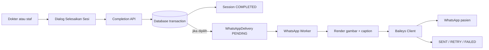
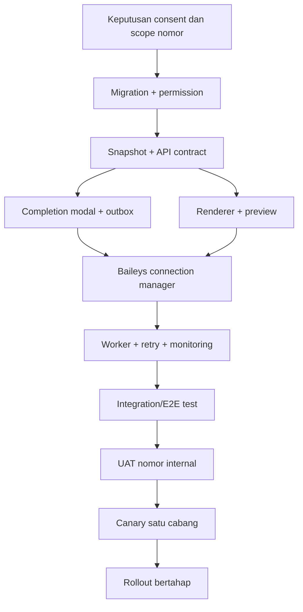

# Development Flow Integrasi WhatsApp Baileys untuk Penyelesaian Sesi Terapi

Status: rencana pengembangan  
Tanggal: 10 Agustus 2026  
Target: laporan sesi terapi dapat dikirim secara opsional melalui WhatsApp setelah sesi berhasil diselesaikan  
Integrasi awal: Baileys (WhatsApp Web)  
Alternatif produksi: WhatsApp Business Platform/Cloud API

## 1. Tujuan

Menyediakan pengiriman laporan sesi terapi melalui WhatsApp dengan ketentuan:

- staf atau dokter memilih apakah laporan perlu dikirim saat menekan
  **Selesaikan Sesi**;
- penyelesaian sesi tidak menunggu koneksi atau respons WhatsApp;
- kegagalan WhatsApp tidak membatalkan sesi yang sudah berhasil diselesaikan;
- laporan dapat dikirim manual setelah sesi selesai;
- pengiriman ulang tidak membuat pesan ganda akibat klik ganda atau retry worker;
- isi pesan berasal dari data sesi yang sudah tersimpan;
- persetujuan pasien, akses pengguna, dan audit data medis tetap terjaga.

## 2. Kondisi proyek saat ini

Fondasi yang sudah tersedia:

- endpoint penyelesaian sesi:
  `PATCH /treatment-sessions/:sessionId/complete`;
- penyelesaian sesi, konsumsi material, pencatatan finansial, dan event integrasi
  sudah diproses secara atomik di database;
- nomor telepon member tersedia pada `UserProfile.phone`;
- foto utama sesi tersedia melalui `SessionPhoto`;
- data dosis aktual tersedia pada `InfusionExecution`;
- vital sebelum dan sesudah tersedia pada `VitalSign`;
- rekomendasi dan catatan dokter tersedia pada `DoctorEvaluation`;
- `IntegrationEvent` dan pola worker berkala sudah tersedia sebagai referensi;
- belum ada dependency, koneksi, worker, tabel delivery, atau halaman pengaturan
  Baileys.

Gap yang perlu ditutup:

- belum ada persetujuan khusus pengiriman laporan medis melalui WhatsApp;
- belum ada normalisasi dan validasi nomor WhatsApp;
- belum ada template gambar/caption laporan sesi;
- belum ada penyimpanan kredensial Baileys yang aman;
- belum ada antrean, retry, idempotency, dan audit pengiriman;
- panel penyelesaian sesi langsung memanggil API tanpa dialog opsi pengiriman;
- belum ada tombol pengiriman manual dan status delivery pada detail sesi.

## 3. Keputusan arsitektur

### 3.1 Prinsip utama

```text
Penyelesaian sesi = transaksi bisnis utama
Pengiriman WhatsApp = efek samping asynchronous setelah commit
```

Aturan wajib:

1. Server menyelesaikan sesi dan menyimpan permintaan pengiriman dalam satu
   transaksi database.
2. Server tidak memanggil Baileys dari dalam transaksi penyelesaian sesi.
3. Worker hanya mengambil permintaan yang sudah berstatus `PENDING` dan sudah
   commit.
4. Kegagalan koneksi WhatsApp mengubah status delivery menjadi retry/failed,
   bukan mengubah sesi kembali menjadi belum selesai.
5. Setiap permintaan mempunyai `idempotencyKey` unik.
6. Pesan hanya boleh dikirim jika nomor valid, persetujuan tersedia, dan aktor
   mempunyai permission.
7. Error dan log tidak boleh berisi kredensial, isi lengkap data medis, atau
   nomor telepon tanpa masking.

### 3.2 Flow tingkat tinggi



### 3.3 Mengapa memakai antrean/outbox

Baileys bergantung pada koneksi WhatsApp Web yang dapat terputus, meminta
pairing ulang, atau gagal mengunggah media. Jika pengiriman dilakukan langsung
di endpoint completion, sesi dapat tampak gagal walaupun seluruh transaksi
klinis dan inventori sudah benar.

Outbox memastikan:

- sesi selesai dengan cepat;
- retry dapat dilakukan tanpa menyelesaikan ulang sesi;
- status pesan dapat dipantau;
- dua worker tidak mengirim delivery yang sama;
- tindakan manual dan otomatis memiliki audit yang sama.

## 4. User experience

### 4.1 Dialog saat menyelesaikan sesi

Klik tombol **Selesaikan Sesi** tidak langsung mengirim request. UI membuka
dialog konfirmasi:

```text
+-------------------------------------------------------+
| Selesaikan sesi terapi?                               |
|                                                       |
| [x] Kirim laporan sesi melalui WhatsApp               |
|     Tujuan: 62812*****890                              |
|     Persetujuan pasien: Tersedia                       |
|                                                       |
| [Pratinjau laporan]  [Batal]  [Selesaikan sesi]        |
+-------------------------------------------------------+
```

Perilaku opsi:

| Kondisi | Perilaku UI |
|---|---|
| Nomor valid dan consent tersedia | Checkbox dapat dipilih |
| Consent tersedia dan preferensi kirim otomatis aktif | Checkbox terpilih secara default |
| Nomor kosong/tidak valid | Checkbox disabled dan tampilkan alasan |
| Consent belum tersedia | Checkbox disabled; arahkan ke pencatatan consent |
| Baileys belum terhubung | Checkbox tetap dapat dipilih bila antrean diizinkan, dengan informasi akan dikirim setelah koneksi pulih |
| Sesi belum lengkap | Tombol completion tetap mengikuti validasi sesi yang sudah ada |

Checkbox tidak boleh otomatis aktif hanya karena pasien memiliki nomor telepon.
Default aktif hanya jika consent WhatsApp sudah tercatat.

### 4.2 Respons setelah completion

Contoh respons ketika pengiriman dipilih:

```json
{
  "sessionId": "session-id",
  "isCompleted": true,
  "message": "Sesi terapi berhasil diselesaikan.",
  "whatsapp": {
    "requested": true,
    "deliveryId": "delivery-id",
    "status": "PENDING",
    "message": "Laporan WhatsApp masuk antrean pengiriman."
  }
}
```

Toast frontend:

```text
Sesi berhasil diselesaikan. Laporan WhatsApp masuk antrean.
```

Jika WhatsApp tidak dipilih:

```text
Sesi berhasil diselesaikan tanpa mengirim laporan WhatsApp.
```

### 4.3 Pengiriman manual setelah sesi selesai

Tambahkan kartu **Laporan WhatsApp** pada detail sesi:

- nomor tujuan yang sudah dimasking;
- waktu permintaan dan waktu terkirim;
- peminta pengiriman;
- status terakhir;
- jumlah percobaan;
- pesan error yang sudah disanitasi;
- tombol **Kirim laporan** jika belum pernah diminta;
- tombol **Coba lagi** untuk delivery `FAILED` atau `DEAD_LETTER`;
- tombol **Kirim ulang sebagai pesan baru** dengan konfirmasi eksplisit.

Pengiriman manual memakai endpoint terpisah agar tidak menjalankan completion
lagi.

## 5. Model data

### 5.1 Consent WhatsApp member

Tambahkan field berikut pada `Member` atau model consent khusus bila riwayat
legal harus dipertahankan:

```prisma
model MemberCommunicationConsent {
  id                       String   @id @default(cuid())
  memberId                 String   @unique
  whatsappTreatmentReport Boolean  @default(false)
  consentedAt              DateTime?
  consentedBy              String?
  revokedAt                DateTime?
  revokedBy                String?
  consentSource            String?
  createdAt                DateTime @default(now())
  updatedAt                DateTime @updatedAt

  member Member @relation(fields: [memberId], references: [id], onDelete: Cascade)
}
```

Model terpisah lebih direkomendasikan daripada menambah boolean sederhana,
karena dapat menyimpan waktu, pemberi consent, sumber, dan pencabutan consent.

### 5.2 Koneksi WhatsApp

```prisma
enum WhatsAppConnectionStatus {
  DISCONNECTED
  PAIRING
  CONNECTED
  RECONNECTING
  LOGGED_OUT
  ERROR
}

model WhatsAppConnection {
  id                    String                      @id @default(cuid())
  branchId              String?                     @unique
  status                WhatsAppConnectionStatus    @default(DISCONNECTED)
  displayPhoneMasked    String?
  authStateEncrypted    String?                     @db.Text
  authKeyVersion        Int                         @default(1)
  lastConnectedAt       DateTime?
  lastDisconnectedAt    DateTime?
  lastErrorSanitized    String?                     @db.Text
  createdBy             String
  updatedBy             String
  createdAt             DateTime                    @default(now())
  updatedAt             DateTime                    @updatedAt
}
```

Keputusan scope koneksi harus ditetapkan sebelum implementasi:

- satu nomor WhatsApp pusat untuk seluruh cabang; atau
- satu nomor per cabang melalui `branchId`.

Rekomendasi awal: satu nomor per cabang jika operasional dan consent dikelola
oleh cabang. Jika hanya ada satu nomor resmi, gunakan satu koneksi global.

### 5.3 Outbox delivery

```prisma
enum WhatsAppDeliveryStatus {
  PENDING
  PROCESSING
  RETRY
  SENT
  FAILED
  DEAD_LETTER
  CANCELLED
}

enum WhatsAppDeliveryTrigger {
  SESSION_COMPLETION
  MANUAL
  MANUAL_RESEND
}

model WhatsAppDelivery {
  id                    String                    @id @default(cuid())
  idempotencyKey        String                    @unique
  treatmentSessionId    String
  memberId              String
  branchId              String
  connectionId          String?
  trigger               WhatsAppDeliveryTrigger
  status                WhatsAppDeliveryStatus    @default(PENDING)
  templateKey           String                    @default("SESSION_COMPLETED_V1")
  templateVersion       Int                       @default(1)
  recipientEncrypted    String                    @db.Text
  recipientMasked       String
  payloadEncrypted      String                    @db.Text
  attempts              Int                       @default(0)
  maxAttempts           Int                       @default(6)
  availableAt           DateTime                  @default(now())
  lockedBy              String?
  leaseUntil            DateTime?
  providerMessageId     String?
  requestedBy           String
  requestedAt           DateTime                  @default(now())
  sentAt                DateTime?
  failedAt              DateTime?
  lastErrorCode         String?
  lastErrorSanitized    String?                   @db.Text
  createdAt             DateTime                  @default(now())
  updatedAt             DateTime                  @updatedAt

  @@index([status, availableAt, createdAt])
  @@index([treatmentSessionId, createdAt])
  @@index([branchId, status])
}
```

Catatan:

- `payloadEncrypted` adalah snapshot immutable agar retry mengirim isi yang
  sama;
- isi payload dibuat saat completion/manual request, bukan dibaca ulang dari
  data klinis yang mungkin sudah berubah;
- `recipientEncrypted` menyimpan tujuan final yang telah dikonfirmasi;
- UI dan log hanya memakai `recipientMasked`;
- delivery dari completion memakai idempotency key tetap:
  `SESSION_REPORT:COMPLETION:<sessionId>`;
- kirim manual memakai UUID dari client sebagai idempotency key;
- tombol **Coba lagi** mengaktifkan delivery yang sama;
- tombol **Kirim ulang sebagai pesan baru** membuat UUID baru.

## 6. Kontrak API

### 6.1 Completion dengan opsi WhatsApp

Endpoint:

```http
PATCH /treatment-sessions/:sessionId/complete
```

Request:

```json
{
  "sendWhatsAppReport": true
}
```

Backend tidak menerima isi laporan dari frontend. Backend membangun payload
dari data sesi yang dipercaya.

Validasi ketika `sendWhatsAppReport=true`:

- sesi dapat diakses aktor;
- aktor memiliki permission penyelesaian sesi dan permintaan laporan;
- member memiliki nomor yang dapat dinormalisasi;
- consent WhatsApp aktif;
- template aktif;
- koneksi untuk cabang tersedia atau sistem mengizinkan queue while offline.

### 6.2 Pratinjau

```http
GET /treatment-sessions/:sessionId/whatsapp-report/preview
```

Respons memuat:

- nomor termasking;
- caption yang akan dikirim;
- URL pratinjau gambar berumur pendek atau data preview yang tidak persisten;
- status consent;
- kesiapan koneksi.

Preview tidak membuat delivery dan tidak mengirim pesan.

### 6.3 Pengiriman manual

```http
POST /treatment-sessions/:sessionId/whatsapp-report
Idempotency-Key: <uuid>
```

Request:

```json
{
  "consentConfirmed": true
}
```

### 6.4 Retry delivery

```http
POST /whatsapp/deliveries/:deliveryId/retry
```

Retry hanya berlaku untuk `FAILED` atau `DEAD_LETTER`, menggunakan record dan
payload yang sama.

### 6.5 Status delivery

```http
GET /treatment-sessions/:sessionId/whatsapp-deliveries
```

Endpoint tidak pernah mengembalikan auth state, nomor lengkap, atau payload
medis terenkripsi.

### 6.6 Pengaturan koneksi

```http
GET    /whatsapp/connections
POST   /whatsapp/connections/pair
GET    /whatsapp/connections/:id/status
POST   /whatsapp/connections/:id/reconnect
POST   /whatsapp/connections/:id/logout
```

Pairing code/QR hanya dapat dilihat oleh role yang memiliki permission koneksi.

## 7. Snapshot dan template laporan

### 7.1 Sumber data

| Isi laporan | Sumber |
|---|---|
| Nama member | `Encounter -> Member -> UserProfile.fullName` |
| Nomor tujuan | `Member -> User -> UserProfile.phone` |
| Infus ke | `TreatmentSession.branchInfusKe` atau aturan bisnis yang dipilih |
| Tanggal | `TreatmentSession.treatmentDate` |
| Foto | `SessionPhoto.fileUrl` jika consent foto aktif |
| Dosis aktual | `InfusionExecution` |
| Vital sebelum/sesudah | `VitalSign` berdasarkan `waktuCatat` |
| Rekomendasi | `DoctorEvaluation.rekomendasi` atau `plan` |
| Catatan | `DoctorEvaluation.generalNotes` |
| Dokter | dokter utama pada sesi |
| Cabang | `TreatmentSession.branch` |

Gunakan satu definisi `infusKe` secara konsisten. Untuk komunikasi pasien,
rekomendasi awal adalah `branchInfusKe` bila histori pasien memang dihitung per
cabang; keputusan ini harus dikunci pada UAT.

### 7.2 Contoh snapshot internal

```json
{
  "templateVersion": 1,
  "sessionId": "session-id",
  "sessionCode": "SES-2026-0001",
  "member": {
    "displayName": "Tn. Jovan Kuncoro"
  },
  "session": {
    "infusionNumber": 1,
    "date": "2026-07-30",
    "branchName": "RAHO Cabang ..."
  },
  "infusion": {
    "hho": "5 ml",
    "no": "2.5 ml"
  },
  "vitals": {
    "before": {},
    "after": {}
  },
  "recommendation": "...",
  "notes": "...",
  "photo": {
    "allowed": true,
    "sourcePhotoId": "photo-id"
  }
}
```

Jangan memasukkan NIK, alamat, diagnosis lengkap, saldo paket, atau data lain
yang tidak diperlukan untuk laporan sesi.

### 7.3 Caption

Contoh format:

```text
Selamat {pagi/siang/sore/malam} {sapaan} {nama},

Salam Sehat,

Berikut laporan sesi terapi hari ini:
{ringkasan dosis aktual}

Tanda vital sebelum -> sesudah:
{ringkasan vital}

Rekomendasi:
{rekomendasi dokter}

Catatan:
{catatan jika ada}

Jadwal kunjungan berikutnya: {jadwal atau "akan diinformasikan"}
```

Aturan konten:

- data kosong tidak ditampilkan sebagai nilai palsu;
- satuan selalu ditampilkan;
- teks rekomendasi berasal dari evaluasi dokter yang sudah disahkan;
- jangan menambahkan klaim penyembuhan penyakit yang tidak tervalidasi;
- link promosi tidak menjadi bagian template klinis default;
- disclaimer dan identitas cabang dapat dikonfigurasi oleh administrator;
- template diberi versi agar pesan lama dapat diaudit.

### 7.4 Gambar laporan

Komponen renderer yang direkomendasikan:

```text
SessionReportSnapshot
-> SessionReportTemplate (SVG/HTML)
-> PNG buffer
-> Baileys sendMessage(image + caption)
```

Rekomendasi implementasi awal adalah template SVG yang dikonversi ke PNG pada
backend. Template lebih ringan dan deterministik daripada menjalankan browser
headless untuk setiap pesan.

Jika foto tidak ada atau consent foto tidak aktif:

- gunakan layout tanpa foto; atau
- kirim caption teks saja;
- kondisi tersebut tidak boleh menggagalkan completion sesi.

## 8. Baileys connection manager

Tambahkan modul backend:

```text
apps/api/src/modules/whatsapp/
|-- whatsapp.routes.ts
|-- whatsapp.controller.ts
|-- whatsapp.schema.ts
|-- whatsapp.service.ts
|-- whatsapp-permission.ts
|-- whatsapp-connection.manager.ts
|-- whatsapp-auth.repository.ts
|-- whatsapp-delivery.repository.ts
|-- whatsapp.worker.ts
|-- whatsapp-template.service.ts
|-- whatsapp-report.renderer.ts
|-- whatsapp-phone.util.ts
`-- __tests__/
```

Tanggung jawab `WhatsAppConnectionManager`:

- memuat auth state terenkripsi;
- membuat satu socket aktif per connection scope;
- menyimpan perubahan credential/key setiap ada `creds.update`;
- menangani `connection.update` dan reconnect dengan backoff;
- membedakan disconnect sementara dengan logged out;
- mengekspos status tanpa membocorkan auth state;
- memastikan satu instance aktif memiliki lease untuk satu koneksi;
- menutup socket dengan benar saat aplikasi shutdown.

Baileys menyediakan `useMultiFileAuthState` sebagai contoh, tetapi dokumentasi
proyek menyarankan implementasi SQL/NoSQL untuk sistem production-grade.
Auth state harus diperlakukan seperti private key jangka panjang.

## 9. Worker dan retry

### 9.1 Claim delivery

Gunakan lease/locking yang setara dengan worker Zoho:

```text
PENDING/RETRY
-> SELECT eligible rows
-> lock row / leaseUntil
-> PROCESSING
-> send
-> SENT atau RETRY/FAILED/DEAD_LETTER
```

Jika PostgreSQL digunakan, terapkan `FOR UPDATE SKIP LOCKED` atau claim atomik
setara agar dua instance tidak mengambil delivery yang sama.

### 9.2 Backoff

Rekomendasi awal:

```text
1 menit -> 5 menit -> 15 menit -> 1 jam -> 6 jam -> DEAD_LETTER
```

Kategori error:

| Kategori | Tindakan |
|---|---|
| Koneksi sementara putus | Retry |
| Upload media timeout | Retry |
| Rate limit/throttling | Retry mengikuti backoff |
| Auth logged out | Tahan delivery, status koneksi `LOGGED_OUT`, perlu pairing ulang |
| Nomor tidak valid/tidak terdaftar | `FAILED`, perlu tindakan manual |
| Consent dicabut sebelum send | `CANCELLED`, jangan kirim |
| Payload/renderer invalid | `DEAD_LETTER` setelah batas retry |

Consent diperiksa kembali tepat sebelum pengiriman. Pencabutan consent harus
mengalahkan permintaan yang sebelumnya masuk antrean.

### 9.3 Idempotency

Aturan:

- completion request yang diulang mengembalikan delivery yang sama;
- worker yang crash setelah provider menerima pesan tetapi sebelum database
  berstatus `SENT` adalah kasus ambigu;
- simpan `providerMessageId` segera setelah `sendMessage` berhasil;
- gunakan lease dan marker attempt untuk memperkecil pengiriman ganda;
- retry manual delivery lama tidak membuat record baru;
- resend yang memang disengaja harus melalui tombol dan konfirmasi berbeda.

Baileys tidak memberikan transaksi exactly-once lintas database dan WhatsApp.
Target realistis adalah at-least-once dengan idempotency internal dan kontrol
kasus ambigu.

## 10. Permission dan audit

Permission yang direkomendasikan:

```text
WHATSAPP.CONNECTION.READ
WHATSAPP.CONNECTION.MANAGE
WHATSAPP.DELIVERY.READ
WHATSAPP.DELIVERY.REQUEST
WHATSAPP.DELIVERY.RETRY
WHATSAPP.TEMPLATE.READ
WHATSAPP.TEMPLATE.MANAGE
MEMBER.COMMUNICATION_CONSENT.MANAGE
```

Scope:

- dokter/staf yang dapat menyelesaikan sesi dapat meminta pengiriman laporan
  untuk sesi dan cabang yang dapat diaksesnya;
- pengelola koneksi dibatasi ke Super Admin atau role teknis yang ditunjuk;
- retry/resend harus mengikuti branch scope;
- isi laporan tidak boleh terlihat pada daftar antrean lintas cabang.

Audit minimum:

- consent diberikan atau dicabut;
- pairing, reconnect, dan logout koneksi;
- delivery diminta otomatis/manual;
- delivery dikirim, gagal, dibatalkan, atau di-retry;
- siapa yang menekan resend;
- template key/version;
- recipient masked, bukan nomor plaintext;
- hash payload, bukan payload medis lengkap di audit log umum.

## 11. Keamanan dan privasi

Wajib diterapkan:

1. Enkripsi auth state Baileys menggunakan key dari secret manager/environment,
   bukan hard-coded.
2. Enkripsi nomor snapshot dan payload delivery.
3. Jangan commit folder auth Baileys ke Git atau memasukkannya ke image Docker.
4. Logger Baileys dibuat silent atau difilter ketat pada production.
5. Jangan log JID, isi pesan, QR, pairing code, token, atau media URL permanen.
6. QR/pairing code memiliki masa berlaku dan hanya tampil pada halaman terbatas.
7. Media preview memakai signed URL berumur pendek.
8. Tetapkan retention delivery dan media hasil render.
9. Backup terenkripsi dan proses rotasi key harus terdokumentasi.
10. Consent foto yang sudah ada tidak otomatis berarti consent pengiriman data
    medis melalui WhatsApp.

Baileys adalah library berbasis WhatsApp Web dan bukan API resmi Meta. Sebelum
go-live, pemilik produk harus menerima risiko pemutusan sesi, perubahan
protokol, dan kebijakan WhatsApp. Untuk pengiriman medis berskala besar atau SLA
tinggi, siapkan adapter agar Baileys dapat diganti WhatsApp Cloud API tanpa
mengubah flow bisnis.

Gunakan interface provider:

```ts
interface WhatsAppProvider {
  getConnectionStatus(connectionId: string): Promise<ConnectionStatus>;
  sendImage(input: SendImageInput): Promise<{ messageId: string }>;
  sendText(input: SendTextInput): Promise<{ messageId: string }>;
}
```

Implementasi awal:

```text
BaileysWhatsAppProvider
```

Implementasi masa depan:

```text
MetaCloudWhatsAppProvider
```

## 12. Perubahan frontend

Area utama:

```text
apps/web/src/app/(staff)/sessions/[sessionId]/page.tsx
```

Pecah komponen agar halaman tidak semakin besar:

```text
apps/web/src/components/sessions/CompleteSessionModal.tsx
apps/web/src/components/sessions/WhatsAppReportPreview.tsx
apps/web/src/components/sessions/WhatsAppDeliveryCard.tsx
apps/web/src/lib/whatsappApi.ts
```

Halaman pengaturan:

```text
apps/web/src/app/(staff)/settings/whatsapp/page.tsx
```

Isi halaman pengaturan:

- status koneksi;
- nomor termasking;
- QR/pairing code;
- connect/reconnect/logout;
- waktu koneksi terakhir;
- antrean pending/failed;
- health indicator;
- template aktif dan pratinjau.

## 13. Environment configuration

Tambahkan konfigurasi dan validasi environment:

```text
WHATSAPP_PROVIDER=BAILEYS
WHATSAPP_WORKER_ENABLED=false
WHATSAPP_WORKER_INTERVAL_MS=5000
WHATSAPP_WORKER_BATCH_SIZE=5
WHATSAPP_MAX_ATTEMPTS=6
WHATSAPP_QUEUE_WHILE_OFFLINE=true
WHATSAPP_AUTH_ENCRYPTION_KEY=<secret>
WHATSAPP_PAYLOAD_ENCRYPTION_KEY=<secret>
WHATSAPP_REPORT_MEDIA_RETENTION_DAYS=30
WHATSAPP_LOG_LEVEL=silent
```

Feature flag default harus `false` sampai migration, consent, koneksi, template,
dan UAT selesai.

## 14. Tahapan pengembangan

## Fase 0 - Keputusan produk dan compliance

Pekerjaan:

1. Tentukan satu koneksi global atau per cabang.
2. Tetapkan format consent dan siapa yang boleh mencatatnya.
3. Tetapkan apakah checkbox default aktif untuk member yang consent.
4. Tetapkan definisi nomor infus yang ditampilkan.
5. Finalisasi isi template dan larangan konten promosi/klaim medis.
6. Tetapkan retention log, snapshot, dan gambar render.
7. Terima risiko Baileys atau putuskan memakai Cloud API resmi.

Exit criteria:

- keputusan ditandatangani Product Owner dan penanggung jawab medis;
- template teks dan visual disetujui;
- consent dan kebijakan privasi disetujui.

## Fase 1 - Database, permission, dan API contract

Backend:

- tambah model consent, connection, dan delivery;
- buat migration dan backfill aman;
- tambah permission pada catalog/seed;
- tambah schema request dan response;
- implementasi normalisasi nomor Indonesia (`08...` menjadi `628...`);
- implementasi masking, encryption helper, dan payload snapshot builder.

Testing:

- migration test;
- nomor valid/tidak valid;
- encryption round-trip;
- branch scope dan permission;
- consent aktif/dicabut.

Exit criteria:

- migration dapat dijalankan dan rollback secara terkontrol;
- plaintext sensitif tidak muncul di response/log;
- contract API tervalidasi.

## Fase 2 - Completion modal dan outbox

Backend:

- ubah completion schema agar menerima `sendWhatsAppReport`;
- buat delivery `PENDING` dalam transaksi completion jika dipilih;
- pertahankan idempotency completion yang sudah ada;
- implementasi endpoint preview, manual request, daftar delivery, dan retry.

Frontend:

- buat `CompleteSessionModal`;
- tampilkan consent, nomor masked, dan readiness;
- tambah preview;
- tampilkan hasil completion dan status antrean;
- tambah kartu delivery dan tombol manual.

Exit criteria:

- completion tanpa WhatsApp tetap bekerja seperti sebelumnya;
- completion dengan WhatsApp membuat satu delivery;
- replay completion tidak membuat delivery kedua;
- manual request tidak menjalankan posting completion lagi.

## Fase 3 - Renderer laporan

Pekerjaan:

- buat snapshot builder;
- buat template caption versi 1;
- buat template gambar versi 1;
- implementasi fallback tanpa foto;
- implementasi preview;
- validasi panjang teks dan wrapping;
- sanitasi data dan unit.

Visual QA minimum:

- nama pendek/panjang;
- foto portrait/landscape/tidak ada;
- dosis sedikit/banyak;
- rekomendasi multiline;
- vital lengkap/sebagian;
- tampilan terang dan dapat dibaca di ponsel.

Exit criteria:

- hasil gambar konsisten;
- tidak ada teks terpotong;
- isi sama dengan snapshot;
- tidak ada klaim medis tambahan dari sistem.

## Fase 4 - Baileys provider dan connection manager

Pekerjaan:

- tambahkan dependency Baileys dengan versi release yang dipin;
- implementasi auth repository terenkripsi;
- implementasi pairing dan status connection;
- implementasi reconnect/backoff;
- implementasi `sendText` dan `sendImage`;
- sanitasi logger;
- handle graceful shutdown;
- buat halaman pengaturan koneksi.

Exit criteria:

- restart API tidak meminta pairing ulang selama auth masih valid;
- logout terdeteksi dan tidak melakukan retry agresif;
- auth state tidak ada di file repo/log;
- hanya satu socket aktif per connection scope.

## Fase 5 - Worker, retry, dan monitoring

Pekerjaan:

- implementasi atomic claim/lease;
- proses delivery secara berurutan per koneksi;
- implementasi retry dan dead-letter;
- simpan provider message ID;
- implementasi retry manual;
- tambah metric, health, dan alert.

Metric minimum:

```text
whatsapp_connection_status
whatsapp_delivery_pending_total
whatsapp_delivery_sent_total
whatsapp_delivery_failed_total
whatsapp_delivery_dead_letter_total
whatsapp_delivery_latency_seconds
whatsapp_reconnect_total
```

Exit criteria:

- dua worker tidak mengklaim row yang sama;
- WhatsApp offline tidak menggagalkan completion;
- delivery kembali berjalan setelah koneksi pulih;
- dead-letter dapat diretry oleh pengguna berwenang.

## Fase 6 - UAT, canary, dan go-live

Urutan:

1. Aktifkan pada environment test.
2. Pair dengan nomor WhatsApp khusus test.
3. Kirim hanya ke nomor internal yang consent.
4. Jalankan UAT seluruh skenario.
5. Aktifkan canary pada satu cabang.
6. Monitor minimal lima hari kerja.
7. Rollout per cabang.
8. Siapkan tombol kill switch `WHATSAPP_WORKER_ENABLED=false`.

## 15. Test plan minimum

| ID | Skenario | Hasil yang diharapkan |
|---|---|---|
| WA-001 | Completion tanpa pilih WhatsApp | Sesi selesai, tidak ada delivery |
| WA-002 | Completion dengan WhatsApp | Sesi selesai, satu delivery `PENDING` |
| WA-003 | Klik completion dua kali | Satu posting sesi dan satu delivery |
| WA-004 | WhatsApp offline | Sesi selesai, delivery menunggu retry |
| WA-005 | Worker pulih setelah reconnect | Delivery terkirim tanpa completion ulang |
| WA-006 | Nomor kosong | Opsi kirim disabled dan API menolak request kirim |
| WA-007 | Nomor `0812...` | Dinormalisasi menjadi `62812...` |
| WA-008 | Consent belum ada | Pesan tidak dikirim |
| WA-009 | Consent dicabut saat pending | Delivery menjadi `CANCELLED` |
| WA-010 | Foto tidak ada | Laporan teks/layout tanpa foto tetap terkirim |
| WA-011 | Renderer gagal | Delivery retry/failed; sesi tetap selesai |
| WA-012 | Dua worker aktif | Satu delivery diklaim satu worker |
| WA-013 | Auth logged out | Delivery ditahan, admin diminta pairing ulang |
| WA-014 | Retry manual | Delivery yang sama diproses ulang |
| WA-015 | Resend eksplisit | Delivery baru dibuat dengan konfirmasi |
| WA-016 | Aktor di luar cabang | API menolak akses |
| WA-017 | User tanpa permission | API menolak pairing/retry/request |
| WA-018 | Preview | Tidak membuat delivery dan tidak mengirim pesan |
| WA-019 | Log production | Tidak memuat QR, auth, nomor lengkap, atau isi medis |
| WA-020 | Session completion legacy | Tidak merusak perilaku completion lama |

## 16. Definition of Done

Fitur dianggap selesai jika:

- completion sesi tetap atomik dan idempotent;
- opsi WhatsApp tersedia pada dialog completion;
- pengiriman manual tersedia setelah completion;
- consent, nomor, dan permission divalidasi backend;
- provider dipisahkan melalui interface;
- auth state dan snapshot sensitif terenkripsi;
- worker memiliki locking, retry, dead-letter, dan monitoring;
- status delivery terlihat oleh pengguna berwenang;
- template gambar/caption lulus visual QA dan review medis;
- unit, integration, API, dan E2E test lulus;
- runbook pairing, reconnect, logout, retry, dan incident tersedia;
- feature flag dan kill switch teruji;
- canary berhasil tanpa pesan ganda atau kebocoran data.

## 17. Urutan implementasi yang direkomendasikan



Jangan memulai rollout sebelum consent, template, dan penyimpanan auth state
sudah selesai. Integrasi yang hanya berhasil mengirim pesan tetapi belum
memiliki outbox, audit, retry, dan kontrol akses belum siap untuk production.

## 18. Referensi teknis

- [Baileys repository](https://github.com/WhiskeySockets/Baileys)
- [Baileys README - authentication, events, and sending messages](https://github.com/WhiskeySockets/Baileys/blob/master/README.md)
- [Baileys security guidance](https://github.com/WhiskeySockets/Baileys/security)
- [WhatsApp Business Platform](https://developers.facebook.com/docs/whatsapp/)

