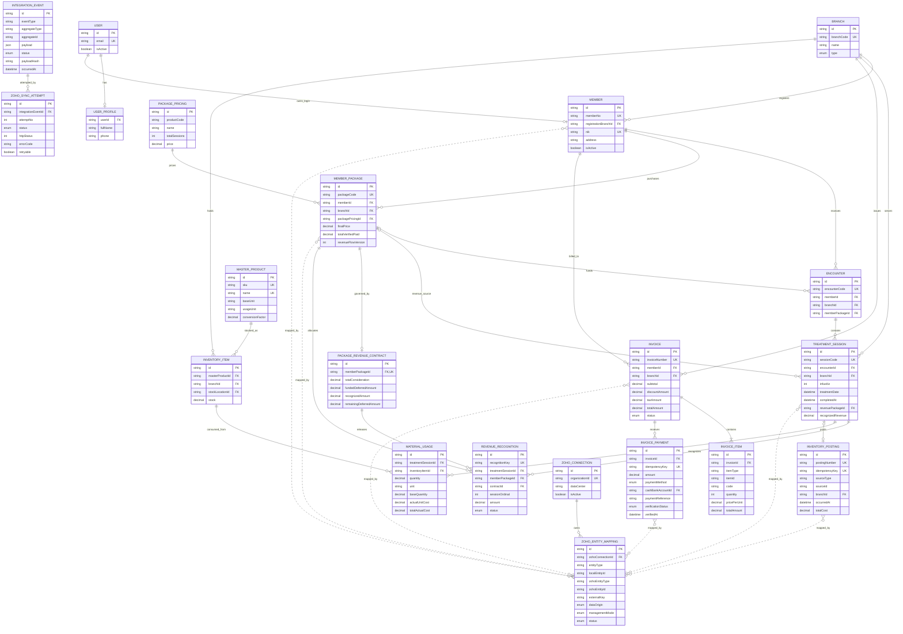
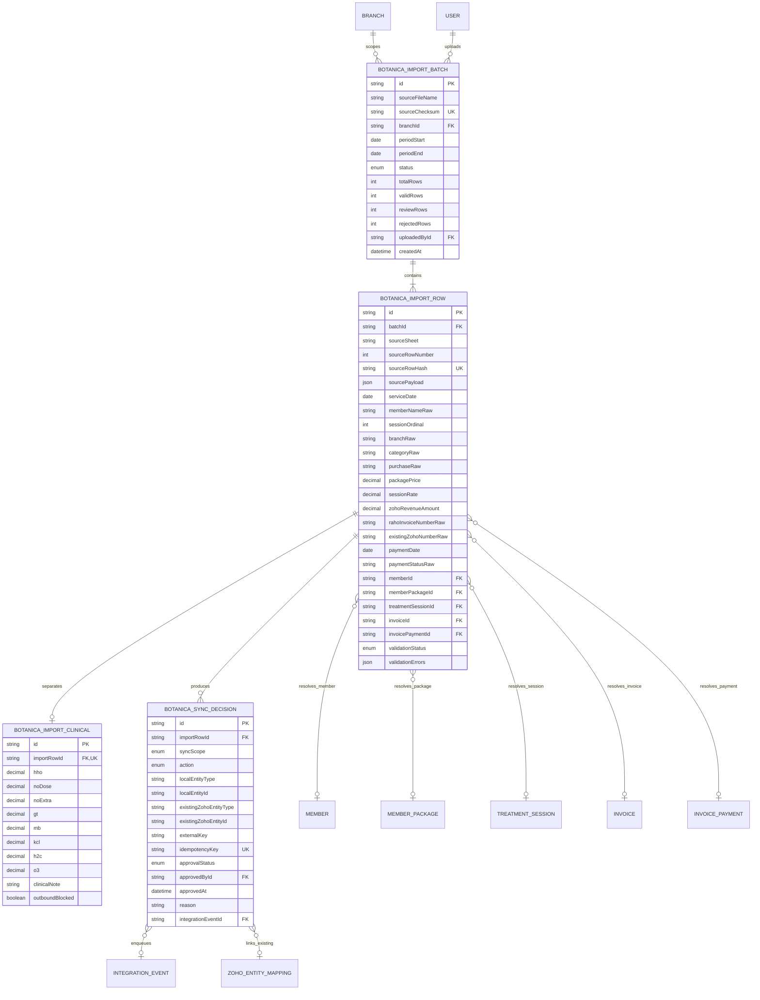
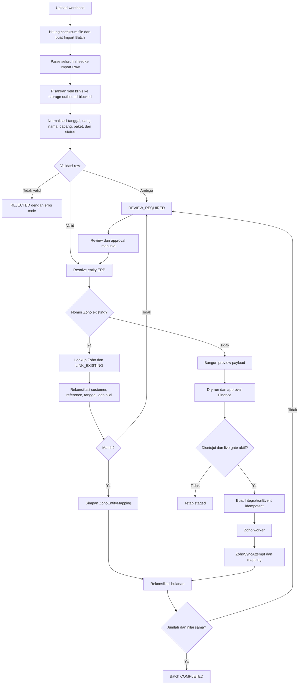

# ERD dan Data Requirement Migrasi Botanica ke Zoho

Tanggal dokumen: 8 September 2026

Status: Draft requirement untuk review Product Owner, Finance, Operasional, dan Engineering

Sumber awal: `2026 BOTANICA.xlsx` dan `2026 BOTANICA - SEPTEMBER.csv`

## 1. Tujuan

Dokumen ini mendefinisikan struktur data dan aturan migrasi data Botanica ke ERP
RAHO, kemudian ke Zoho Books melalui integrasi yang sudah tersedia.

Tujuan utama:

1. mengubah spreadsheet historis menjadi data ERP yang terstruktur;
2. menghubungkan transaksi yang sudah ada di Zoho tanpa membuat duplikasi;
3. membuat transaksi Zoho hanya untuk data yang memang belum pernah dikirim;
4. menjaga data klinis tetap berada di ERP RAHO;
5. menyediakan audit trail, idempotency, dry run, approval, dan rekonsiliasi.

Spreadsheet tidak diperlakukan sebagai payload Zoho. Spreadsheet adalah sumber
staging yang harus dinormalisasi dan divalidasi sebelum menghasilkan entity ERP
atau event integrasi.

## 2. Ruang lingkup

Termasuk dalam ruang lingkup:

- identitas finansial member;
- pembelian paket dan uang muka/deferred revenue;
- sesi terapi dan pengakuan omzet per sesi;
- invoice dan pembayaran member;
- pemakaian material sebagai transaksi inventory terpisah;
- mapping entity ERP ke entity Zoho;
- migrasi transaksi historis Maret sampai September 2026;
- rekonsiliasi jumlah, nilai, dan status.

Tidak termasuk dalam payload Zoho Finance:

- diagnosis, keluhan, catatan dokter, tanda vital, foto, dan hasil pemeriksaan;
- formula atau detail terapi HHO, NO, NO Extra, GT, MB, KCL, H2C, dan O3;
- NIK dan informasi kesehatan pribadi lain;
- nama tenaga kesehatan, kecuali kelak ada kebutuhan akuntansi yang disetujui;
- catatan bebas yang mengandung informasi klinis;
- batch, expiry, FIFO layer, dan lokasi rak internal.

## 3. Prinsip sumber data

| Data | Sumber utama | Tujuan | Aturan |
|---|---|---|---|
| Member dan identitas finansial | ERP RAHO | Zoho Contact | Gunakan `memberId`/`memberNo`, bukan nama sebagai kunci |
| Detail klinis sesi | ERP RAHO | Tidak dikirim | Tetap berada pada domain klinis |
| Paket dan kontrak deferred revenue | ERP RAHO | Zoho Retainer Invoice | Satu kontrak untuk satu `MemberPackage` |
| Pengakuan omzet sesi | ERP RAHO | Zoho Invoice atau Journal | Mengikuti `ZOHO_TREATMENT_REVENUE_MODE` |
| Pembayaran terverifikasi | ERP RAHO | Zoho Payment | Hanya status `VERIFIED` yang boleh dikirim |
| Pemakaian material | ERP RAHO | Controlled export/inventory flow | Tidak membawa identitas member atau detail klinis |
| ID transaksi Zoho historis | Zoho | Mapping ERP | Dipakai untuk link/reconcile, bukan otomatis dibuat ulang |
| Status sinkronisasi | ERP RAHO | Monitoring ERP | Zoho tidak menjadi sumber status antrean ERP |

## 4. ERD produksi

ERD berikut merepresentasikan entity utama yang sudah tersedia pada schema ERP.
Field klinis sengaja tidak dihubungkan ke entity integrasi Zoho.



Catatan: relasi `ZohoEntityMapping.localEntityId` bersifat polymorphic berdasarkan
`entityType`, sehingga garis putus-putus pada ERD adalah relasi logis dan bukan
foreign key database langsung.

## 5. ERD staging migrasi yang diusulkan

Entity staging diperlukan agar file dapat diimpor, diperbaiki, direview, dan
diulang tanpa langsung menyentuh transaksi produksi atau Zoho.



### 5.1 Enum staging

| Enum | Nilai |
|---|---|
| `ImportBatchStatus` | `UPLOADED`, `PARSING`, `VALIDATING`, `REVIEW_REQUIRED`, `APPROVED`, `PROCESSING`, `COMPLETED`, `FAILED`, `CANCELLED` |
| `ImportRowValidationStatus` | `VALID`, `REVIEW_REQUIRED`, `REJECTED`, `PROCESSED` |
| `BotanicaSyncScope` | `CONTACT`, `RETAINER`, `TREATMENT_REVENUE`, `PAYMENT`, `INVENTORY`, `NONE` |
| `BotanicaSyncAction` | `LINK_EXISTING`, `CREATE_LOCAL_ONLY`, `CREATE_AND_SYNC`, `UPDATE_MAPPING`, `SKIP`, `REJECT` |
| `ApprovalStatus` | `PENDING`, `APPROVED`, `REJECTED` |

## 6. Mapping kolom spreadsheet

| Kolom sumber | Normalisasi/tujuan | Kirim ke Zoho | Requirement |
|---|---|---:|---|
| `NO` | Nomor urut sumber | Tidak | Hanya untuk trace ke file asal |
| `ZOHO` | Kandidat nomor/ID Zoho existing | Bersyarat | Harus dicocokkan; jangan dianggap kunci sesi dan jangan create ulang |
| `TGL` | `TreatmentSession.treatmentDate` | Ya, sebagai tanggal layanan | Wajib ISO `YYYY-MM-DD`; tanggal di luar periode sheet diblokir |
| `NAMA MEMBER` | Resolve ke `Member.id` | Nama contact saja | Nama bukan unique key; wajib review jika lebih dari satu kandidat |
| `INFUS KE` | `TreatmentSession.infusKe` dan `RevenueRecognition.sessionOrdinal` | Ya, ordinal saja | Integer positif dan tidak boleh duplikat untuk paket yang sama |
| `HHO` | Data klinis/material lokal | Tidak ke Finance | Disimpan terpisah dan outbound diblokir |
| `NO` dosis | Data klinis/material lokal | Tidak ke Finance | Header duplikat wajib diubah menjadi `NO_DOSIS` |
| `NO EXTRA` | Data klinis/material lokal | Tidak ke Finance | Tidak boleh masuk notes/description Zoho |
| `GT`, `MB`, `KCL`, `H2C`, `O3` | Data klinis/material lokal | Tidak ke Finance | Inventory hanya memakai SKU dan kuantitas hasil material posting |
| `NAKES` | Audit operasional lokal | Tidak | Jika diperlukan, resolve ke user; jangan kirim ke Zoho |
| `LOGISTIK` | Kandidat cabang/lokasi | ID location saja | Normalisasi `BOTANICA`/`BDG BOTANICA` ke satu `Branch.id` |
| `KATEGORI` | Klasifikasi paket/member | Tidak langsung | Normalisasi ke enum/kebijakan harga ERP |
| `PEMBELIAN` | Kandidat paket dan jumlah sesi | Item hasil mapping | Wajib resolve ke `PackagePricing.id`/Zoho Item ID |
| `HARGA TOTAL` | Nilai kontrak/pembelian | Ya, pada retainer/invoice | Decimal IDR non-negatif; bukan string berformat rupiah |
| `DISKON` pembelian | Diskon pembelian | Ya | Harus konsisten dengan subtotal dan total |
| `HARGA SATUAN` | Nilai alokasi sesi sebelum diskon | Tidak langsung | Dipakai untuk validasi pengakuan omzet |
| `DISKON` sesi | Diskon/alokasi per sesi | Bersyarat | Harus dapat direkonsiliasi ke kontrak |
| `HARGA ZOHO` | Kandidat omzet yang diakui per sesi | Ya | Wajib untuk treatment revenue, kecuali transaksi gratis bernilai nol |
| `INV` | Nomor invoice RAHO historis | Ya, sebagai reference | Wajib unik per invoice; boleh berulang pada beberapa sesi satu paket |
| `TGL BAYAR` | Tanggal pembayaran | Ya | Wajib untuk payment; tidak boleh hanya nama bulan tanpa tahun |
| `STATUS` | Status pembayaran sumber | Tidak langsung | `Lunas` tidak otomatis sama dengan `VERIFIED`; perlu bukti/approval |
| `KETERANGAN` | Catatan internal | Tidak secara default | Harus disanitasi jika dipakai pada payload Finance |
| Kolom bantuan `TGL`, `IFA+INFUS SET`, dll. | Perhitungan/operasional lokal | Tidak | Tidak menjadi sumber utama jika tidak memiliki definisi formal |

## 7. Data requirement per domain

### 7.1 Member/Zoho Contact

| Field | Format | Wajib | Sumber | Aturan validasi |
|---|---|---:|---|---|
| `memberId` | CUID/ID ERP | Ya | Hasil resolve | Kunci internal; tidak boleh berasal dari nama |
| `memberNo` | String unik | Ya | ERP/migrasi | Wajib unik lintas cabang |
| `displayName` | String 1-200 | Ya | Nama member | Trim, normalisasi spasi, tidak boleh mengandung catatan terapi |
| `email` | Email valid | Tidak | Master member | Email invalid tidak dikirim |
| `phone` | E.164/nomor normal | Tidak | Master member | Normalisasi `08...` menjadi format Indonesia yang konsisten |
| `address` | String | Tidak | Master member | Hanya alamat penagihan |
| `paymentTermsDays` | Integer >= 0 | Ya | Kebijakan Finance | Default harus disetujui Finance |
| `externalKey` | `RAHO:MEMBER:<id>` | Ya | Sistem | Unik dan immutable |

NIK boleh dipakai untuk review internal pencocokan jika disetujui, tetapi tidak
menjadi field outbound Contact pada requirement ini.

### 7.2 Paket dan retainer/deferred revenue

| Field | Format | Wajib | Aturan validasi |
|---|---|---:|---|
| `memberPackageId` | ID ERP | Ya | Harus dimiliki member yang benar |
| `packageCode` | String unik | Ya | Tidak boleh dibuat dari deskripsi bebas saja |
| `packagePricingId` | ID ERP | Ya | Harus memiliki mapping Zoho Item aktif |
| `totalSessions` | Integer positif | Ya | Sesuai paket BASIC/BOOSTER |
| `totalConsideration` | Decimal(18,2) | Ya | Sama dengan nilai kontrak setelah diskon |
| `fundedDeferredAmount` | Decimal(18,2) | Ya | Tidak melebihi pembayaran terverifikasi |
| `referenceNumber` | `RAHO-RET:<contractId>` | Ya | Unik dan idempotent |
| `branchId` | ID ERP | Ya | Harus memiliki mapping Zoho Location |

Pembelian paket tidak dikirim sebagai Sales Invoice biasa. Paket diperlakukan
sebagai uang muka/deferred revenue dan diproses melalui retainer flow.

### 7.3 Sesi dan pengakuan omzet

| Field | Format | Wajib | Aturan validasi |
|---|---|---:|---|
| `sessionId` | ID ERP | Ya | Satu row spreadsheet harus resolve ke satu sesi |
| `sessionCode` | String unik | Ya | Immutable dan tidak boleh memakai nomor Zoho sebagai pengganti |
| `treatmentDate` | ISO date | Ya | Harus berada dalam periode sheet/import batch |
| `completedAt` | ISO datetime | Ya | Tidak lebih awal dari `treatmentDate` |
| `memberId` | ID ERP | Ya | Diturunkan dari Encounter/member hasil resolve |
| `branchId` | ID ERP | Ya | Harus sesuai batch dan mapping location |
| `memberPackageId` | ID ERP | Ya | Paket aktif atau paket legacy yang disetujui |
| `sessionOrdinal` | Integer positif | Ya | Tidak melebihi entitlement paket |
| `sourceType` | `BASIC`/`BOOSTER` | Ya | Satu sesi dapat menghasilkan lebih dari satu recognition |
| `recognitionAmount` | Decimal(18,2) | Ya | Jumlah recognition sama dengan `recognizedRevenue` sesi |
| `externalKey` | `RAHO-SESSION:<sessionId>` | Ya | Unik untuk create/recover di Zoho |

### 7.4 Invoice

| Field | Format | Wajib | Aturan validasi |
|---|---|---:|---|
| `invoiceNumber` | String unik | Ya | Referensi RAHO, bukan ID baris spreadsheet |
| `memberId` | ID ERP | Ya | Harus memiliki mapping customer |
| `branchId` | ID ERP | Ya | Harus memiliki mapping location |
| `date` | ISO date | Ya | Tanggal finalisasi |
| `currency` | `IDR` | Ya | Migrasi ini hanya mendukung IDR |
| `subtotal` | Decimal(12,2) | Ya | Sama dengan total subtotal line |
| `discountAmount` | Decimal(12,2) | Ya | Tidak negatif dan tidak melebihi subtotal |
| `taxPercent`, `taxAmount` | Decimal | Ya | Tax ID wajib jika pajak lebih dari nol |
| `totalAmount` | Decimal(12,2) | Ya | Subtotal - diskon + pajak |
| `line.itemId` | ID ERP | Ya | Resolve ke package pricing/master product |
| `line.quantity` | Integer positif | Ya | Tidak boleh nol/pecahan |
| `line.rate` | Decimal(12,2) | Ya | Nilai sebelum diskon line |

### 7.5 Pembayaran

| Field | Format | Wajib | Aturan validasi |
|---|---|---:|---|
| `paymentId` | ID ERP | Ya | Satu pembayaran mempunyai satu idempotency key |
| `invoiceId`/`retainerInvoiceId` | ID/mapping | Ya | Target pembayaran harus sudah terhubung ke Zoho |
| `amount` | Decimal(12,2) > 0 | Ya | Tidak melebihi outstanding sebelum pembayaran |
| `paymentDate` | ISO date | Ya | Tidak boleh diambil dari tanggal layanan |
| `paymentMethod` | Enum ERP | Ya | Harus memiliki mapping payment mode Zoho |
| `cashBankAccountId` | ID ERP | Ya | Harus memiliki mapping account Zoho |
| `paymentReference` | String | Bersyarat | Wajib untuk transfer/debit/kredit/QRIS |
| `verificationStatus` | `VERIFIED` | Ya untuk sync | `Lunas` pada spreadsheet tetap masuk review |
| `verifiedAt`, `verifiedBy` | Datetime/User ID | Ya | Menjadi audit approval pembayaran |

### 7.6 Inventory

| Field | Format | Wajib | Aturan validasi |
|---|---|---:|---|
| `inventoryItemId` | ID ERP | Ya | Harus resolve dari SKU dan cabang |
| `sku` | String unik | Ya | Tidak boleh memakai label dosis sebagai satu-satunya identitas |
| `stockLocationId` | ID ERP | Ya | Harus memiliki mapping lokasi |
| `quantityAdjusted` | Decimal(18,4) | Ya | Konsumsi bernilai negatif |
| `unitRate` | Decimal(18,4) | Bersyarat | Diperlukan untuk rekonsiliasi nilai |
| `value` | Decimal(18,4) | Bersyarat | Konsumsi bernilai negatif |
| `occurredAt` | ISO datetime | Ya | Mengikuti waktu posting material |
| `postingReference` | String unik | Ya | Mengacu pada inventory posting ERP |
| `reason` | Kode/alasan non-klinis | Ya | Contoh: `Treatment material consumption` |

Payload inventory tidak boleh memuat `memberId`, nama member, diagnosis,
catatan klinis, atau detail terapi. Pada implementasi Books-only saat ini,
inventory adjustment belum diposting otomatis dan memakai controlled export.

### 7.7 Integrasi dan mapping Zoho

| Field | Wajib | Requirement |
|---|---:|---|
| `zohoConnectionId` | Ya | Satu organization aktif untuk batch migrasi |
| `entityType` | Ya | Contoh: `MEMBER`, `RETAINER_INVOICE`, `TREATMENT_REVENUE_INVOICE`, `INVOICE`, `PAYMENT` |
| `localEntityId` | Ya | ID ERP immutable |
| `zohoEntityType` | Ya | Tipe entity tujuan Zoho |
| `zohoEntityId` | Ya untuk mapping | ID yang diperoleh dari Zoho atau hasil review historis |
| `externalKey` | Ya | Unik per connection dan entity type |
| `dataOrigin` | Ya | Historis manual memakai `MANUAL_ZOHO`; transaksi baru memakai `ERP` |
| `managementMode` | Ya | Existing manual default `MANUAL_ONLY`/`REVIEW_REQUIRED`; baru `ERP_MANAGED` |
| `payloadHash` | Ya | Mencegah perubahan payload diam-diam pada retry |
| `idempotencyKey` | Ya | Stabil untuk logical action yang sama |

## 8. Baseline kualitas workbook

Hasil audit read-only terhadap tujuh sheet bulanan:

| Pemeriksaan | Hasil |
|---|---:|
| Total baris transaksi Maret-September | 1.168 |
| Baris tanpa nomor Zoho | 322 |
| Nomor Zoho unik yang ditemukan | 663 |
| Nomor Zoho yang dipakai pada lebih dari satu baris | 42 |
| Baris tanpa `HARGA ZOHO` | 179 |
| Baris dengan `HARGA ZOHO` nol | 66 |
| Baris tanpa referensi invoice RAHO | 83 |
| Baris tanpa tanggal pembayaran | 217 |
| Baris tanpa status pembayaran | 234 |
| Tanggal September tersimpan sebagai Februari-Juli | 34 dari 38 baris |

Interpretasi:

- nomor pada kolom `ZOHO` tidak konsisten sebagai ID sesi; beberapa nomor
  berulang untuk banyak sesi member yang sama;
- transaksi historis dengan nomor Zoho harus menggunakan `LINK_EXISTING` dan
  melewati rekonsiliasi, bukan langsung `CREATE_AND_SYNC`;
- tanggal September harus diperbaiki berdasarkan periode sheet dan bukti sumber;
- baris tanpa nilai pengakuan omzet, member stabil, paket, atau referensi invoice
  tidak boleh masuk antrean live;
- `DATA MEMBER BOTANICA` tidak memiliki header terstruktur dan sebagian besar
  baris tidak mempunyai data identitas yang cukup untuk auto-match.

## 9. Aturan matching dan deduplikasi

### 9.1 Member

Urutan pencocokan:

1. external RAHO member ID yang sudah ada di Zoho;
2. `memberNo` ERP;
3. email exact match;
4. nomor telepon ternormalisasi;
5. NIK untuk review internal jika diizinkan;
6. nama exact/fuzzy match hanya menghasilkan `REVIEW_REQUIRED`.

Auto-create dilarang jika terdapat satu atau lebih kandidat contact yang mirip
tanpa external RAHO ID.

### 9.2 Invoice dan sesi

- `existingZohoNumberRaw` bukan idempotency key.
- Sesi baru memakai `RAHO-SESSION:<sessionId>`.
- Retainer memakai `RAHO-RET:<contractId>`.
- Invoice umum memakai nomor invoice ERP sebagai `reference_number`.
- Satu `zohoEntityType + zohoEntityId` hanya boleh terhubung ke satu mapping.
- Nomor Zoho yang muncul pada beberapa row harus direview sebagai kemungkinan
  invoice paket yang sama, bukan dianggap duplicate session invoice.

### 9.3 Pembayaran

- pembayaran hanya dibuat setelah status ERP `VERIFIED`;
- nominal, customer, rekening, dan target invoice harus cocok;
- satu pembayaran tidak boleh diterapkan ke invoice lain;
- pembayaran historis yang sudah ada di Zoho hanya dibuatkan mapping dan hasil
  rekonsiliasi.

## 10. Flow migrasi



## 11. Validasi dan error code minimum

| Error code | Kondisi |
|---|---|
| `IMPORT_DATE_OUTSIDE_PERIOD` | Tanggal transaksi tidak berada pada periode sheet/batch |
| `IMPORT_DATE_AMBIGUOUS` | Format tanggal dapat berarti dua tanggal berbeda |
| `IMPORT_MEMBER_NOT_FOUND` | Tidak ada kandidat member |
| `IMPORT_MEMBER_AMBIGUOUS` | Terdapat lebih dari satu kandidat member |
| `IMPORT_PACKAGE_NOT_MAPPED` | Deskripsi pembelian tidak resolve ke PackagePricing |
| `IMPORT_SESSION_ORDINAL_DUPLICATE` | Nomor sesi sama pada paket yang sama |
| `IMPORT_REVENUE_AMOUNT_MISSING` | Nilai pengakuan omzet kosong |
| `IMPORT_REVENUE_RECONCILIATION_FAILED` | Total recognition tidak cocok dengan kontrak |
| `IMPORT_INVOICE_REFERENCE_MISSING` | Invoice membutuhkan referensi tetapi kolom kosong |
| `IMPORT_PAYMENT_DETAILS_INCOMPLETE` | Tanggal, nominal, metode, atau rekening tidak lengkap |
| `IMPORT_PAYMENT_NOT_VERIFIED` | Status sumber belum mendapat approval ERP |
| `IMPORT_ZOHO_REFERENCE_DUPLICATE` | Satu nomor Zoho mempunyai relasi yang ambigu |
| `IMPORT_ZOHO_EXISTING_MISMATCH` | Customer/reference/total existing Zoho tidak cocok |
| `IMPORT_CLINICAL_OUTBOUND_BLOCKED` | Payload mengandung field klinis terlarang |
| `IMPORT_BRANCH_MAPPING_MISSING` | Cabang belum memiliki Zoho Location mapping |
| `IMPORT_ITEM_MAPPING_MISSING` | Paket/material belum memiliki Zoho Item mapping |

## 12. Approval dan keamanan

1. Upload dan parsing boleh dilakukan oleh user dengan izin import Finance.
2. Resolve member ambigu wajib direview oleh operator yang berwenang.
3. Perubahan tanggal, nilai, invoice, atau mapping Zoho wajib mencatat nilai lama,
   nilai baru, alasan, actor, dan timestamp.
4. Approval live sync hanya dapat dilakukan Finance Manager atau Super Admin.
5. User yang mengoreksi data tidak boleh menjadi satu-satunya approver batch.
6. Preview payload harus menyamarkan data yang tidak diperlukan.
7. Token Zoho tidak pernah disimpan pada tabel import atau log request.
8. Data klinis tidak boleh muncul pada `IntegrationEvent.payload`,
   `ZohoSyncAttempt.requestSummary`, maupun error message.

## 13. Rekonsiliasi

Rekonsiliasi minimum dilakukan pada tiga level:

| Level | Pembanding |
|---|---|
| Row | Member, tanggal, reference, action, status mapping |
| Dokumen | Customer, invoice/retainer number, subtotal, diskon, pajak, total, payment applied |
| Batch/bulan | Jumlah sesi, jumlah invoice, total omzet, total pembayaran, jumlah linked/created/skipped/failed |

Batch hanya boleh `COMPLETED` jika:

- tidak ada row `PROCESSING`;
- seluruh row valid telah menjadi `PROCESSED` atau mempunyai alasan `SKIP`;
- seluruh mismatch telah ditutup atau diberi exception yang disetujui;
- total recognition ERP sama dengan total treatment revenue yang terhubung di Zoho;
- total pembayaran terverifikasi ERP sama dengan total payment applied di Zoho;
- tidak ada duplicate create akibat retry;
- tidak ada field klinis pada payload outbound.

## 14. Acceptance criteria

1. File yang sama tidak dapat menghasilkan batch kedua tanpa explicit re-import.
2. Row yang sama mempunyai `sourceRowHash` yang stabil.
3. Import dapat diulang tanpa membuat member, invoice, retainer, payment, atau
   integration event ganda.
4. Seluruh tanggal September yang ambigu diblokir sampai dikoreksi.
5. Nama member saja tidak pernah menghasilkan auto-match final.
6. Kolom `ZOHO` yang berulang tidak menghasilkan invoice Zoho baru.
7. Transaksi gratis boleh memiliki recognition nol hanya jika kategori dan
   kebijakan Finance menyatakan gratis.
8. `Lunas` dari spreadsheet tetap memerlukan data pembayaran dan approval ERP.
9. Hanya payment `VERIFIED` yang menghasilkan event pembayaran.
10. Payload Contact tidak membawa NIK atau data klinis.
11. Payload treatment revenue hanya membawa customer, location, reference,
    tanggal, mapped item, ordinal sesi, dan nilai recognition.
12. Payload inventory hanya membawa SKU/item, location, quantity, rate/value,
    tanggal, reason, dan posting reference.
13. Dry run menghasilkan ringkasan create/link/skip/error sebelum live sync.
14. Aktivasi live sync memerlukan go-live gate dan `ZOHO_SYNC_DRY_RUN=false`.
15. Rekonsiliasi setelah migrasi dapat ditelusuri kembali ke file, sheet, dan
    nomor row asal.

## 15. Keputusan bisnis yang masih diperlukan

1. Tanggal cutover historis: transaksi mana yang hanya di-link dan mana yang
   boleh dibuat baru di Zoho.
2. Definisi pasti kolom `ZOHO` per bulan, karena perilakunya tidak konsisten.
3. Apakah `HARGA ZOHO` selalu merupakan recognized revenue per sesi.
4. Cara membagi nilai BASIC dan BOOSTER ketika spreadsheet hanya menyimpan satu
   nilai sesi.
5. Kebijakan transaksi `FREE`, `KARYAWAN`, dan `PROGRAM SOSIAL`.
6. Bukti apa yang diperlukan untuk mengubah status historis `Lunas` menjadi
   payment ERP `VERIFIED`.
7. Mapping `BOTANICA` dan `BDG BOTANICA` ke branch/location resmi.
8. Apakah nomor invoice Zoho lama akan disimpan sebagai `zohoEntityId`,
   `reference_number`, atau hanya metadata kandidat setelah lookup API.
9. Apakah inventory historis ikut dimigrasikan atau hanya dimulai pada cutover.
10. Mode pengakuan omzet target: `DOCUMENT` atau `JOURNAL`.

## 16. Pemilihan database dan organisasi Zoho saat runtime

Database dan organisasi Zoho **bukan pasangan tetap**. `SUPER_ADMIN` memilih
keduanya secara terpisah pada halaman Integrasi Zoho:

1. `Database aktif` memilih salah satu alias koneksi yang berasal dari
   `DATABASE_PROFILES_JSON` atau ditambahkan SUPER_ADMIN melalui UI.
2. `API Zoho aktif` memilih OAuth client yang akan digunakan ketika memulai
   proses `Hubungkan Zoho`. Client ID, client secret, dan URL callback dapat
   ditambahkan melalui UI.
3. `Organisasi Zoho aktif` memilih salah satu organisasi yang telah melalui
   OAuth dan tersimpan pada database yang sedang aktif.
4. Mengubah database tidak menentukan organisasi Zoho berdasarkan tabel
   pasangan atau aturan otomatis apa pun.
5. Setiap database boleh mempunyai satu atau lebih koneksi organisasi Zoho.
   Organisasi yang sama dapat diotorisasi pada beberapa database bila memang
   dibutuhkan.
6. Pergantian database berlaku global untuk satu proses API dan meningkatkan
   revisi runtime. Seluruh access token dan refresh token lama ditolak sehingga
   pengguna wajib login ulang.
7. Request yang telah dimulai tetap terikat pada database asal sampai selesai;
   request baru menggunakan database yang baru dipilih.
8. Worker dan rekonsiliasi Zoho mengambil database aktif pada awal setiap siklus.
9. URL database, Client ID, dan Client Secret hanya dikirim satu arah saat form
   disimpan. API mengenkripsinya dengan AES-256-GCM; endpoint daftar hanya
   mengembalikan ID, label, URL non-rahasia, sumber konfigurasi, dan status aktif.
10. Registry terenkripsi disimpan pada control-plane `DATABASE_URL`, sehingga
    tetap dapat dibaca ketika database operasional aktif diganti.
11. Sebelum profile database disimpan, API wajib menguji koneksi dan keberadaan schema aplikasi
   pada database target. Kegagalan tidak boleh mengubah database aktif.
12. OAuth state menyimpan ID profile database dan ID profile API Zoho supaya
    callback serta refresh token selalu memakai konfigurasi asal, walaupun
    pilihan runtime sempat berubah.

Konfigurasi contoh (nilai credential hanya berada pada `.env` API):

```env
DATABASE_PROFILES_JSON='[{"id":"dummy","label":"Database Dummy","url":"postgresql://..."},{"id":"production","label":"Database Production","url":"postgresql://..."}]'
DATABASE_DEFAULT_PROFILE_ID=dummy
```

Tidak adanya `DATABASE_PROFILES_JSON` mempertahankan kompatibilitas lama: aplikasi
hanya menampilkan satu pilihan bernama `Database Utama` yang memakai
`DATABASE_URL`. Profile tambahan yang dibuat melalui UI tetap persisten pada
tabel `runtime_database_profiles`. OAuth client tambahan berada pada
`runtime_zoho_api_profiles`, sedangkan hubungan organisasi ke OAuth client asal
berada pada `runtime_zoho_organization_bindings`.

## 17. Referensi implementasi

- `apps/api/prisma/schema.prisma`
- `apps/api/src/modules/zoho/zoho.contact.policy.ts`
- `apps/api/src/modules/zoho/zoho.invoice.policy.ts`
- `apps/api/src/modules/zoho/zoho.payment.policy.ts`
- `apps/api/src/modules/zoho/zoho.retainer.policy.ts`
- `apps/api/src/modules/zoho/zoho.inventory-adjustment.policy.ts`
- `apps/api/src/modules/zoho/zoho.inventory-adjustment.service.ts`
- `apps/api/src/modules/sessions/events/treatment-completed.event.ts`
- `docs/BLUEPRINT_INTEGRASI_ZOHO_FINANCE.md`
