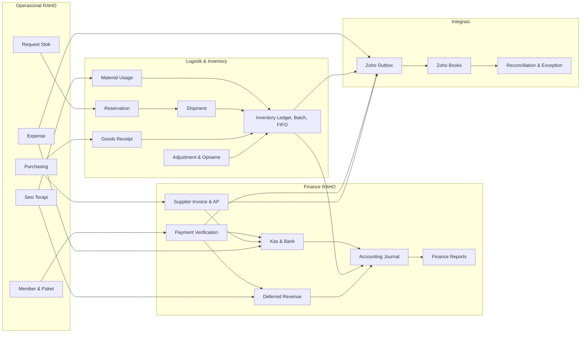
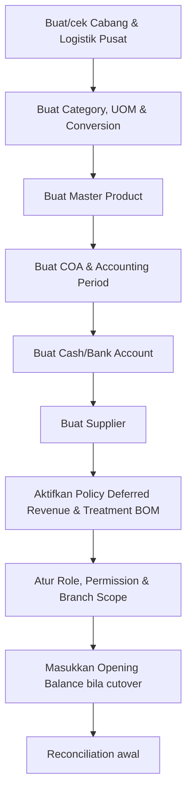
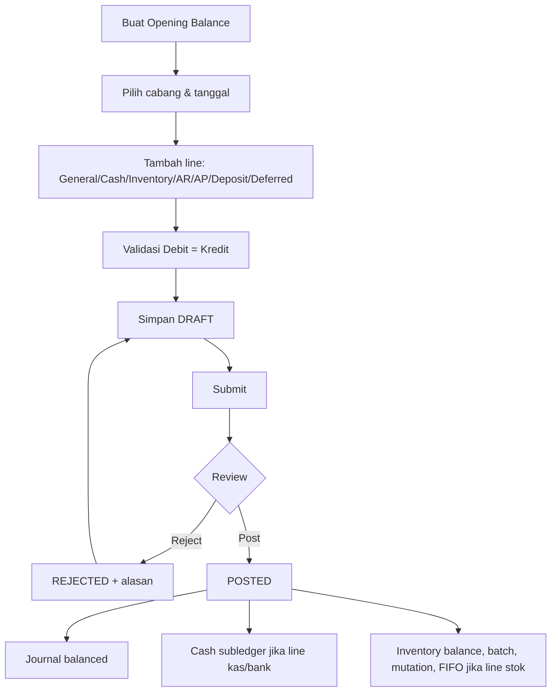
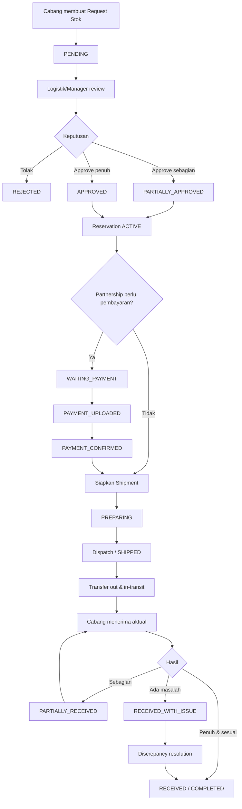
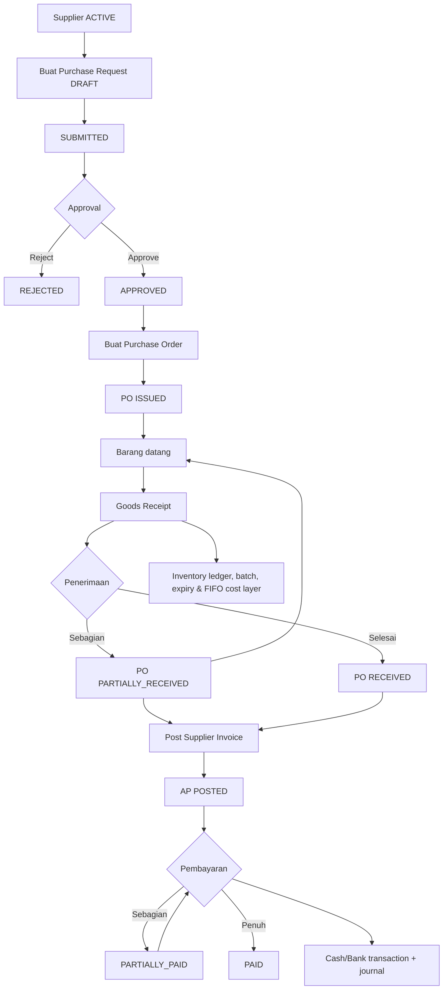
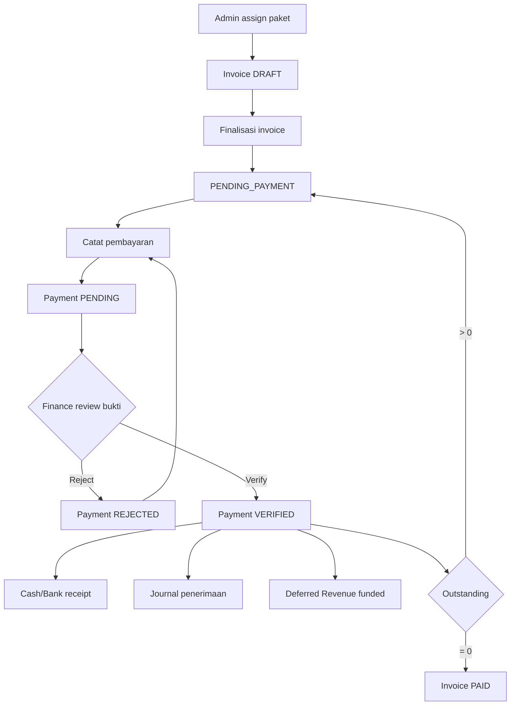
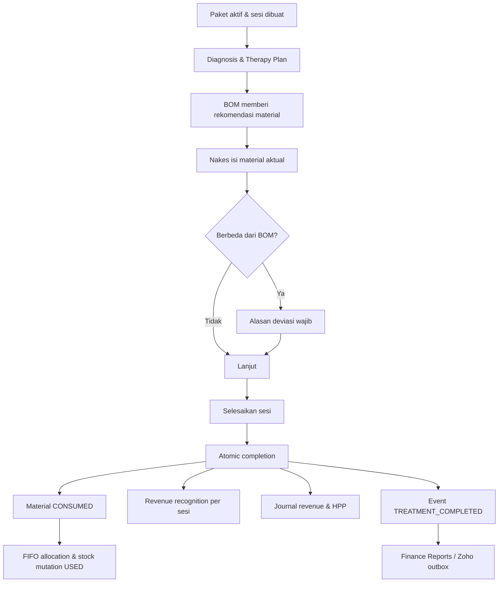
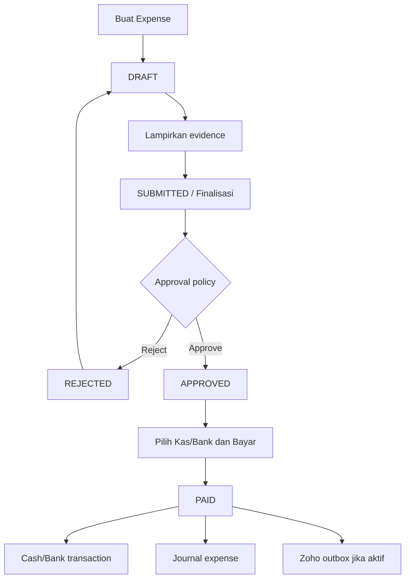
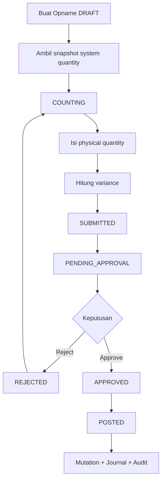
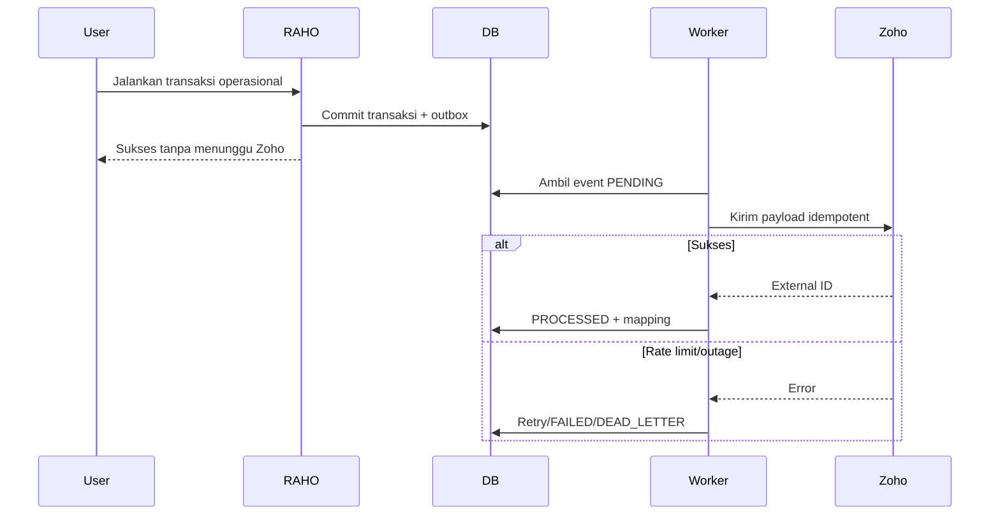

# Flow Finance dan Logistik RAHO Terbaru

**Versi:** 1.1

**Tanggal:** 12 Agustus 2026

**Baseline source:** `588193a`  
**Audiens:** Finance, Admin Logistik, Finance & Logistics Controller, Admin
Manager, Admin Cabang, Super Admin, IT, dan auditor

---

## 1. Tujuan

Dokumen ini menjelaskan flow terbaru Finance dan Logistik RAHO dari awal sampai
akhir, meliputi:

- persiapan master data;
- saldo awal;
- kebutuhan dan distribusi stok internal;
- pembelian ke supplier dan Accounts Payable;
- penerimaan dan valuasi barang;
- penggunaan material pada sesi terapi;
- pembayaran member, deferred revenue, dan pengakuan omzet;
- expense;
- adjustment dan stock opname;
- approval, audit, jurnal, laporan, dan reconciliation;
- sinkronisasi asynchronous ke Zoho Books.

Dokumen ini menjadi panduan operasional dan acuan IT. Detail field atau API
tetap mengikuti source code dan permission yang berlaku.

Untuk ringkasan operasional, status penerapan, dan hasil audit kompatibilitas
data lama, baca [Flow Simple Finance dan Logistik serta Audit Data Lama](./FLOW_SIMPLE_FINANCE_LOGISTIK_DAN_AUDIT_DATA_LAMA.md).

---

## 2. Prinsip Utama

### 2.1 RAHO adalah sumber transaksi operasional

Aktivitas berikut harus dibuat dan diselesaikan terlebih dahulu di RAHO:

- pembelian paket member;
- pembayaran dan verifikasi;
- sesi terapi;
- pemakaian material;
- expense;
- purchase request dan purchase order;
- goods receipt;
- supplier invoice dan pembayaran AP;
- stock request, reservation, shipment, dan penerimaan;
- adjustment dan stock opname.

Zoho Books bukan halaman operasional klinik. Zoho dipakai untuk kebutuhan
Finance/Logistik, pencatatan eksternal, dan reconciliation.

### 2.2 Transaksi posted tidak diedit langsung

Dokumen yang sudah `POSTED`, `VERIFIED`, `PAID`, `RECEIVED`, atau `COMPLETED`
tidak diperbaiki dengan menghapus record atau mengubah ledger langsung.

Koreksi dilakukan melalui:

- reject sebelum posting;
- submit ulang;
- reversal;
- refund;
- discrepancy resolution;
- adjustment/opname resmi;
- cancellation dengan alasan dan permission;
- exception resolution.

### 2.3 Satu kejadian hanya boleh diposting satu kali

Setiap proses penting memakai ID sumber, guard status, idempotency, atau
transaction boundary. Retry tidak boleh membuat:

- jurnal ganda;
- cash/bank transaction ganda;
- mutasi stok ganda;
- cost layer ganda;
- revenue recognition ganda;
- event Zoho ganda.

### 2.4 Finance dan stok harus dapat ditelusuri

Setiap angka harus dapat ditelusuri:

```text
Dokumen sumber
  -> approval/verifikasi
  -> stock atau cash subledger
  -> journal
  -> General Ledger/laporan
  -> event sinkronisasi Zoho jika diaktifkan
```

### 2.5 Scope stok ditentukan otomatis

RAHO tidak memakai pilihan titik penyimpanan tambahan. Scope stok hanya terdiri
dari:

- **Cabang**: stok operasional milik cabang terkait;
- **Logistik Pusat**: stok yang dikelola oleh tim logistik pusat.

Sistem menentukan scope secara otomatis dari cabang pengguna dan dokumen
transaksi. Request stok cabang selalu berasal dari Logistik Pusat dan menuju
cabang peminta. Goods receipt pembelian pusat masuk ke Logistik Pusat,
sedangkan penerimaan yang memang dibuat untuk cabang masuk ke cabang tersebut.

Pengguna tidak boleh memindahkan transaksi ke scope lain secara manual.

---

## 3. Gambaran Besar



---

## 4. Peran dan Tanggung Jawab

| Peran | Tanggung jawab utama |
|---|---|
| Admin Layanan | Member, paket, pembayaran operasional, kebutuhan layanan, dan expense sesuai permission |
| Tenaga Kesehatan | Memastikan serta mencatat material aktual pada sesi terapi |
| Dokter | Diagnosis, therapy plan, pelaksanaan, dan penyelesaian klinis |
| Admin Cabang | Request stok, penerimaan cabang, kas/bank cabang, expense, dan aktivitas purchasing sesuai permission |
| Admin Logistik | Master stok, review request, reservation, shipment, goods receipt, adjustment, dan opname |
| Finance & Logistics Controller | Kontrol lintas Finance/Logistik, reconciliation, approval, audit, dan integrasi Zoho |
| Admin Manager | Approval, Finance, laporan, dan scope cabang sesuai permission |
| Super Admin | Konfigurasi sistem, permission, opening balance, koreksi berwenang, dan oversight |

Permission efektif berasal dari role template, kemudian dapat dipengaruhi oleh
override `ALLOW` atau `DENY` per user dan scope cabang.

---

## 5. Peta Menu dan Page

### 5.1 Finance

| Menu | Page | Fungsi |
|---|---|---|
| Pembayaran | `/payments` | Invoice member, pembayaran, bukti, verifikasi, reject, dan refund |
| Accounting | `/accounting` | COA, periode, jurnal, dan reversal |
| Finance Reports | `/finance-reports` | P&L, Trial Balance, GL, kas/bank, deferred, dan reconciliation |
| Kas & Bank | `/cash-bank` | Master rekening dan cash/bank subledger |
| Opening Balance | `/opening-balances` | Saldo awal Finance dan Inventory |
| Expense | `/expenses` | Pengeluaran, evidence, approval, payment, dan posting |
| Purchasing & AP | `/purchasing` | Supplier, PR, PO, invoice supplier, AP, payment, dan refund |
| Deferred Revenue | `/revenue-recognition` | Kontrak paket, recognition event, HPP, dan gross profit |
| Approval Inbox | `/approvals` | Approval lintas modul |

### 5.2 Inventory dan Logistik

| Menu | Page | Fungsi |
|---|---|---|
| Dashboard Logistik | `/inventory/dashboard` | KPI dan monitoring stok/logistik |
| Master Inventori | `/inventory/master-data` | Produk, kategori, UOM, conversion, dan batch |
| Stok | `/inventory` | Ketersediaan stok cabang |
| Ledger Stok | `/inventory/ledger` | Balance, mutation, valuation, dan trace source |
| Mutasi Stok | `/inventory/stock-mutations` | Riwayat pergerakan stok |
| Request Stok | `/inventory/stock-requests` | Permintaan stok cabang |
| Reservasi Stok | `/inventory/stock-reservations` | Alokasi stok untuk request |
| Pengiriman | `/inventory/shipments` | Persiapan, dispatch, dan penerimaan shipment |
| Goods Receipt | `/inventory/goods-receipts` | Penerimaan barang dari PO |
| Adjustment & Opname | `/inventory/controls` | Koreksi stok dengan approval |
| Stock Opname | `/inventory/stock-opnames` | Snapshot, hitung fisik, resolusi, dan posting |
| Treatment BOM | `/inventory/treatment-boms` | Rekomendasi material per treatment |
| Riwayat Penggunaan Barang | `/inventory/material-usage-history` | Material aktual per sesi |
| Laporan Pengiriman | `/inventory/shipment-report` | Monitoring dan analisis shipment |
| Tas Homecare | `/inventory/homecare-bags` | Request, isi, penggunaan, return, dan opname tas |
| Inventori Tim | `/inventory/team` | **Coming Soon**; petunjuk dan shortcut ke flow lama |

### 5.3 Sistem dan integrasi

| Menu | Page | Fungsi |
|---|---|---|
| Permission & Role | `/admin/permissions` | Role template, permission, user override, branch scope |
| Audit Log | `/admin/audit-logs` | Riwayat aktivitas dan akses ditolak |
| Integrasi Zoho | `/admin/integrations/zoho` | Connection, mapping, queue, reconciliation, dan go-live |

---

## 6. Persiapan Master Sebelum Transaksi

Urutan yang direkomendasikan:



Validasi wajib:

- SKU unik dan tidak kosong untuk item sinkronisasi;
- UOM penyimpanan dan penggunaan mempunyai conversion yang benar;
- scope Cabang dan Logistik Pusat tersedia serta aktif;
- item dengan batch/expiry memiliki konfigurasi tracking;
- COA aktif dan `allowPosting = true`;
- accounting period berstatus `OPEN`;
- cash/bank account terhubung ke COA;
- supplier aktif;
- package pricing memiliki policy deferred dan revenue;
- treatment yang memakai material memiliki BOM aktif;
- pembuat dan approver mempunyai permission yang sesuai.

---

## 7. Flow Saldo Awal

Opening Balance dipakai saat cutover, bukan untuk transaksi harian.



Status:

```text
DRAFT -> SUBMITTED -> POSTED
                   \-> REJECTED -> koreksi -> SUBMITTED
```

Kontrol:

- tanggal dan cabang tidak boleh berubah setelah posted;
- inventory opening wajib mempunyai item, scope Cabang/Logistik Pusat,
  quantity, dan unit cost;
- retry posting tidak membuat jurnal atau stock layer kedua;
- angka cutover harus direkonsiliasi dengan data sumber;
- hasil restore dan migration harus diuji sebelum posting production.

---

## 8. Flow Request-to-Receive: Distribusi Stok Internal

Flow ini dipakai ketika cabang meminta barang dari Logistik Pusat. Flow ini
bukan pembelian ke supplier.



### 8.1 Saat approval

- Approver boleh mengurangi quantity, tetapi tidak menambah melebihi request.
- Stok yang disetujui membuat reservation.
- Reservation mencegah stok dialokasikan ke transaksi lain.
- Approval penuh/sebagian harus tercatat di audit.

### 8.2 Saat dispatch

Periksa:

- source dan destination;
- item dan quantity;
- batch/expiry;
- condition;
- scope asal **Logistik Pusat** dan scope tujuan **Cabang** yang ditentukan
  otomatis;
- nomor shipment;
- dokumen/penanggung jawab pengiriman.

Efek:

- stok keluar dari available source;
- nilai transfer masuk akun/ledger in-transit sesuai policy;
- status reservation menjadi `CONSUMED` ketika digunakan shipment.

### 8.3 Saat penerimaan

Penerima mencatat quantity aktual, bukan hanya menekan selesai.

Jika ada selisih:

- `SHORTAGE`;
- `DAMAGE`;
- `WRONG_ITEM`;
- `OTHER`.

Resolusi dapat berupa:

- release ke stock;
- return to sender;
- write-off;
- no stock action.

Jangan menyelesaikan selisih dengan mengubah quantity ledger manual.

---

## 9. Flow Procure-to-Pay: Pembelian Supplier

Flow ini dipakai untuk mendapatkan barang/jasa dari supplier eksternal.



### 9.1 Purchase Request

Isi minimum:

- cabang;
- tanggal request dan tanggal dibutuhkan;
- item;
- quantity;
- estimasi unit cost;
- keterangan.

Status:

```text
DRAFT -> SUBMITTED -> APPROVED -> CONVERTED
                  \-> REJECTED
```

### 9.2 Purchase Order

- PO hanya dibuat dari PR yang disetujui.
- Supplier harus aktif.
- Quantity dan harga membentuk komitmen pembelian.
- PO dapat diterima sebagian.

Status:

```text
ISSUED -> PARTIALLY_RECEIVED -> RECEIVED -> CLOSED
     \-> CANCELLED sebelum proses yang tidak dapat dibatalkan
```

### 9.3 Goods Receipt

Penerimaan wajib memeriksa:

- PO dan supplier;
- item;
- quantity diterima;
- UOM;
- batch;
- expiry;
- condition `GOOD`, `DAMAGED`, `EXPIRED`, atau `OTHER`;
- scope penerimaan **Cabang** atau **Logistik Pusat** yang ditentukan otomatis
  dari PO/dokumen penerimaan;
- unit cost.

Goods Receipt yang diposting membentuk:

- inventory balance;
- mutation `RECEIVED`;
- batch/expiry;
- FIFO cost layer;
- source link;
- jurnal penerimaan sesuai accounting policy.

### 9.4 Supplier Invoice dan AP

Supplier invoice diposting setelah dokumen supplier dan penerimaan diverifikasi.

Status:

```text
POSTED -> PARTIALLY_PAID -> PAID
```

Pembayaran AP:

```text
Debit  Accounts Payable
Kredit Kas/Bank
```

Nominal pembayaran tidak boleh melebihi saldo AP. Refund/reversal memakai flow
khusus dan tidak menghapus histori pembayaran.

---

## 10. Flow Member-to-Cash dan Deferred Revenue

Flow ini menghubungkan paket member, pembayaran, dan pengakuan omzet.



Status invoice:

```text
DRAFT -> PENDING_PAYMENT -> PAID
                         \-> DEBT/OVERDUE/CANCELLED sesuai kondisi
```

Status payment:

```text
PENDING -> VERIFIED
        \-> REJECTED -> submit ulang sebagai payment baru
```

Prinsip:

- pembayaran parsial diperbolehkan;
- bukti non-cash diperiksa Finance;
- payment rejected tidak membuat jurnal atau cash transaction;
- penerimaan paket tidak langsung menjadi omzet;
- dana paket masuk deferred revenue;
- edit paket lama tetap mempertahankan ID historis dan source reference.

---

## 11. Flow Sesi Terapi, Material, HPP, dan Revenue



Efek Finance umum:

```text
Debit  Deferred Revenue
Kredit Revenue

Debit  HPP
Kredit Inventory
```

Ketentuan:

- material aktual adalah sumber konsumsi stok;
- BOM hanya rekomendasi;
- deviasi wajib mempunyai alasan;
- stock allocation memakai FIFO;
- completion, stok, revenue, dan HPP diproses atomic;
- retry completion tidak membuat posting kedua;
- pembatalan completion membuat reversal berizin, bukan delete;
- flow version membedakan transaksi historis dan transaksi terbaru.

---

## 12. Flow Expense



Posting umum:

```text
Debit  Expense
Kredit Kas/Bank
```

Evidence harus dibuka melalui akses terautentikasi. Expense posted tidak diedit
langsung; gunakan reversal/koreksi sesuai permission.

---

## 13. Flow Adjustment dan Stock Opname

### 13.1 Adjustment

```text
DRAFT
  -> PENDING_APPROVAL
  -> APPROVED
  -> POSTED

PENDING_APPROVAL -> REJECTED
DRAFT/APPROVED sesuai guard -> CANCELLED
```

Alasan yang tersedia:

- expired;
- damaged;
- lost;
- stock opname;
- other.

Posting adjustment membuat:

- mutation `ADJUSTMENT`;
- balance update;
- cost allocation/valuation sesuai arah;
- jurnal inventory adjustment;
- audit trail.

### 13.2 Stock Opname



Selisih tidak boleh diperbaiki melalui SQL atau edit balance langsung.

---

## 14. Approval dan Maker-Checker

Approval dipakai untuk memisahkan pembuat dan pemeriksa pada transaksi sensitif.

| Dokumen | Maker | Checker/Approver |
|---|---|---|
| Stock request | Admin Cabang/Logistik sesuai scope | Manager/Logistik berwenang |
| Shipment | Logistik | Penerima dan/atau approver sesuai policy |
| Adjustment | Logistik/Cabang berwenang | Manager/Logistik berwenang |
| Stock opname | Counter/Logistik | Approver berbeda sesuai rule |
| Opening balance | Super Admin/Finance berwenang | Finance/Manager sesuai policy |
| Expense | Pengaju | Finance/Manager atau autonomous Finance sesuai policy |
| Purchase request | Cabang/Logistik/Finance | Approver purchasing |
| Payment member | Admin pencatat | Finance/verifikator |
| Go-live Zoho | Controller/Super Admin | Approval Finance dan Logistik |

Aturan:

- pembuat tidak boleh menyetujui dokumennya sendiri jika policy
  maker-checker aktif;
- rejection membutuhkan alasan;
- approval lama tidak dihapus saat dokumen dikoreksi;
- permission dan branch scope diperiksa di backend;
- keputusan dan akses ditolak masuk audit log.

---

## 15. Matriks Dampak Posting

| Source | Inventory | Cash/Bank | Journal | AP/AR | Deferred/Revenue | Zoho outbox |
|---|---:|---:|---:|---:|---:|---:|
| Opening General | Tidak | Sesuai line | Ya | Sesuai line | Sesuai line | Sesuai policy |
| Opening Inventory | Ya | Tidak | Ya | Tidak | Tidak | Sesuai policy |
| Payment member verified | Tidak | Ya | Ya | AR/outstanding turun | Deferred funded untuk paket | Ya |
| Payment member rejected | Tidak | Tidak | Tidak | Tidak | Tidak | Tidak |
| Expense paid | Tidak | Ya | Ya | Tidak | Tidak | Ya |
| Internal shipment dispatch | Transfer out/in-transit | Tidak | Sesuai policy | Tidak | Tidak | Ya sesuai capability |
| Internal shipment receipt | Transfer in/FIFO carryover | Tidak | Sesuai policy | Tidak | Tidak | Ya sesuai capability |
| Goods receipt supplier | Balance/batch/FIFO | Tidak | Ya sesuai policy | GRNI/AP sesuai tahap | Tidak | Ya |
| Supplier invoice | Tidak | Tidak | Ya | AP naik | Tidak | Ya |
| Supplier payment | Tidak | Ya | Ya | AP turun | Tidak | Ya |
| Treatment completed | FIFO consumption | Tidak | Revenue dan HPP | Tidak | Recognition | Ya |
| Adjustment/opname posted | Ya | Tidak | Ya | Tidak | Tidak | Ya sesuai capability |
| Reversal | Membalik jika relevan | Membalik jika relevan | Jurnal reversal | Membalik sesuai source | Membalik movement | Event koreksi |

---

## 16. Flow Zoho Books yang Aman

### 16.1 Boundary



Transaksi RAHO tidak di-rollback hanya karena Zoho gagal.

### 16.2 Urutan konfigurasi

1. Hubungkan Zoho dari `/admin/integrations/zoho`.
2. Pilih organization yang benar.
3. Jalankan discovery.
4. Mapping account, tax, payment method, bank, UOM, item, scope
   Cabang/Logistik Pusat, customer, dan vendor.
5. Review data yang berstatus `NEEDS_REVIEW`.
6. Jalankan reconciliation penuh.
7. Selesaikan exception `HIGH/CRITICAL`.
8. Pastikan dead-letter kosong.
9. Simpan approval Finance dan Logistik.
10. Jalankan `DRY_RUN`.
11. Aktifkan `CANARY` untuk cabang terbatas.
12. Catat hari observasi tanpa mismatch.
13. Aktifkan `LIVE` setelah gate lulus.

Mode:

```text
OFF -> DRY_RUN -> CANARY -> LIVE
 ^                          |
 +------ Rollback OFF <-----+
```

Default aman:

```env
ZOHO_SYNC_WORKER_ENABLED=false
ZOHO_SYNC_DRY_RUN=true
ZOHO_RECONCILIATION_ENABLED=false
```

### 16.3 Status event

```text
PENDING -> PROCESSING -> PROCESSED
                    \-> FAILED -> retry
                    \-> DEAD_LETTER
DRY_RUN
IGNORED
```

Mapping:

```text
NEEDS_REVIEW -> ACTIVE
            \-> INACTIVE/ditolak sesuai proses review
```

### 16.4 Jika Zoho bermasalah

- biarkan atau kembalikan mode ke `OFF`;
- transaksi RAHO tetap berjalan;
- jangan mengulang transaksi lokal;
- periksa sync attempt dan dead-letter;
- perbaiki mapping/capability;
- jalankan reconciliation;
- retry event yang sama;
- jangan membuat invoice/payment/adjustment duplikat langsung di Zoho.

### 16.5 Jika Zoho sudah berisi data

Gunakan aturan berikut sebelum mengaktifkan write:

| Kondisi | Tindakan |
|---|---|
| Master ada di Zoho dan RAHO | Link/mapping, jangan create ulang |
| Master hanya ada di Zoho | Tarik read-only, review, lalu link/adopsi |
| Master hanya ada di RAHO | Push setelah tanggal cut-off |
| Transaksi historis ada di Zoho | Jangan push ulang; gunakan opening/reconciliation |
| Transaksi baru setelah cut-off | Push RAHO ke Zoho melalui outbox |

Panduan konfigurasi server, OAuth, data yang ditarik, data yang dipush, dan
checklist go-live tersedia di
[Cara Koneksi Zoho Books dengan Data Existing](./CARA_KONEKSI_ZOHO_BOOKS_DENGAN_DATA_EXISTING.md).

---

## 17. Reconciliation

### 17.1 Inventory

Bandingkan:

- quantity per item dan scope Cabang/Logistik Pusat;
- batch dan expiry;
- total inventory value;
- in-transit;
- mutation RAHO dengan adjustment/transaction Zoho.

### 17.2 Finance

Bandingkan:

- cash/bank ledger dengan COA;
- invoice outstanding;
- payment;
- deferred revenue;
- supplier AP;
- expense;
- revenue/HPP;
- Trial Balance.

### 17.3 Cara menangani selisih

```text
Temukan source document
  -> cek status dan timestamp
  -> cek subledger
  -> cek journal
  -> cek Zoho mapping/event/attempt
  -> tentukan sumber kebenaran
  -> lakukan koreksi resmi
  -> isi resolution note
  -> rerun reconciliation
```

Laporan bukan tempat mengedit angka sumber.

---

## 18. Checklist Operasional

### 18.1 Harian Logistik

- [ ] Periksa request stok yang menunggu review.
- [ ] Periksa reservation aktif yang terlalu lama.
- [ ] Siapkan shipment berdasarkan reservation.
- [ ] Periksa shipment yang belum diterima.
- [ ] Selesaikan discrepancy terbuka.
- [ ] Periksa goods receipt dan kondisi barang.
- [ ] Pantau stok minimum, batch, dan expiry.
- [ ] Periksa material usage yang masih draft.
- [ ] Periksa adjustment/opname yang menunggu approval.

### 18.2 Harian Finance

- [ ] Periksa payment member `PENDING`.
- [ ] Verifikasi/reject bukti dengan alasan.
- [ ] Periksa expense dan AP yang jatuh tempo.
- [ ] Pastikan cash/bank transaction mempunyai journal.
- [ ] Periksa accounting period tetap sesuai status.
- [ ] Periksa deferred funding dan treatment recognition.
- [ ] Periksa Approval Inbox.
- [ ] Jalankan reconciliation penting.

### 18.3 Harian Integrasi Zoho

- [ ] Periksa connection dan organization.
- [ ] Periksa jumlah event `PENDING`, `FAILED`, dan `DEAD_LETTER`.
- [ ] Periksa mapping `NEEDS_REVIEW`.
- [ ] Periksa webhook inbox.
- [ ] Periksa reconciliation mismatch.
- [ ] Pastikan mode sesuai tahap rollout.
- [ ] Jangan mengubah mode ke `LIVE` tanpa gate dan approval.

### 18.4 Akhir bulan

- [ ] Pastikan semua posting periode selesai.
- [ ] Rekonsiliasi kas/bank.
- [ ] Rekonsiliasi inventory quantity dan value.
- [ ] Rekonsiliasi AR, AP, expense, dan deferred revenue.
- [ ] Review P&L, Trial Balance, dan General Ledger.
- [ ] Selesaikan exception atau dokumentasikan carry-forward.
- [ ] Backup database dan object storage.
- [ ] Tutup/kunci periode sesuai kebijakan.
- [ ] Simpan evidence dan approval month-end.

---

## 19. Flow Presentasi yang Disarankan

Urutan demo agar hubungan Finance dan Logistik mudah dipahami:

1. `/inventory/master-data` — produk, UOM, conversion, dan batch.
2. `/inventory/stock-requests` — kebutuhan cabang.
3. `/inventory/stock-reservations` — stok yang dialokasikan.
4. `/inventory/shipments` — dispatch dan penerimaan.
5. `/purchasing` — PR, PO, supplier invoice, dan AP.
6. `/inventory/goods-receipts` — barang masuk dan FIFO.
7. `/payments` — pembayaran member dan verifikasi.
8. `/sessions/{sessionId}` — material usage dan completion.
9. `/revenue-recognition` — deferred revenue menjadi omzet per sesi.
10. `/accounting` dan `/cash-bank` — jurnal serta subledger.
11. `/finance-reports` — P&L, Trial Balance, GL, dan reconciliation.
12. `/admin/integrations/zoho` — outbox, mapping, exception, dan rollout aman.

Untuk presentasi, gunakan database demo dan Zoho test organization. Jangan
menampilkan credential, webhook secret, data pasien, bukti pembayaran asli,
atau mengaktifkan `LIVE` pada tenant production.

---

## 20. Acceptance Criteria

Flow dianggap berjalan baik apabila:

- [ ] transaksi inti RAHO tetap sukses saat Zoho `OFF`;
- [ ] approval dan branch scope mencegah akses tidak sah;
- [ ] retry tidak membuat posting ganda;
- [ ] stok tidak negatif tanpa flow yang diizinkan;
- [ ] shipment partial dan discrepancy dapat diselesaikan;
- [ ] goods receipt menghasilkan batch/FIFO dan source trace;
- [ ] supplier invoice dan payment memperbarui AP secara benar;
- [ ] payment member verified memperbarui cash, journal, outstanding, dan
      deferred;
- [ ] treatment completion mengonsumsi stok serta mem-posting revenue/HPP
      sekali;
- [ ] reversal mempertahankan histori asli;
- [ ] Trial Balance seimbang;
- [ ] cash/bank, inventory, deferred, AR, dan AP dapat direkonsiliasi;
- [ ] event Zoho mempunyai idempotency, attempt history, dan exception flow;
- [ ] rollback Zoho ke `OFF` tidak menghapus transaksi lokal.

---

## 21. Referensi

- [Flow Penggunaan Aplikasi](./FLOW_PENGGUNAAN_APLIKASI.md)
- [Panduan Fitur Finance dan Flow](./PANDUAN_FITUR_FINANCE_DAN_FLOW.md)
- [Panduan Singkat Zoho Books](./PANDUAN_SINGKAT_FLOW_ZOHO_BOOKS.md)
- [Panduan Sinkronisasi Data Existing Zoho](./PANDUAN_SINKRONISASI_DATA_EXISTING_ZOHO_BOOKS.md)
- [Cara Koneksi Zoho Books dengan Data Existing](./CARA_KONEKSI_ZOHO_BOOKS_DENGAN_DATA_EXISTING.md)
- [Development Flow Integrasi Finance, Logistik, dan Zoho](./updatelogisticnFinnance/DEVELOPMENT_FLOW_INTEGRASI_FINANCE_LOGISTIK_ZOHO.md)
- [Runbook Zoho Go-live](./updatelogisticnFinnance/RUNBOOK_SPRINT14_ZOHO_GO_LIVE.md)
- [Checklist E2E Finance, Logistik, dan Zoho](./updatelogisticnFinnance/TEST_CHECKLIST_END_TO_END_FINANCE_LOGISTIK_ZOHO.md)

---

## 22. Ringkasan Satu Paragraf

Finance dan Logistik terbaru bekerja sebagai satu rantai yang dapat ditelusuri:
kebutuhan menghasilkan request atau pembelian, approval mengontrol keputusan,
reservation/shipment/goods receipt mengontrol barang, inventory ledger dan FIFO
mengontrol quantity serta nilai, payment/AP/expense/deferred mengontrol uang,
journal menjadi sumber laporan, dan Zoho menerima hasil secara asynchronous.
Jika Zoho gagal, RAHO tetap melayani transaksi; jika terjadi kesalahan,
koreksi dilakukan melalui reversal atau flow resmi tanpa menghapus histori.
