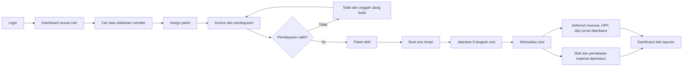
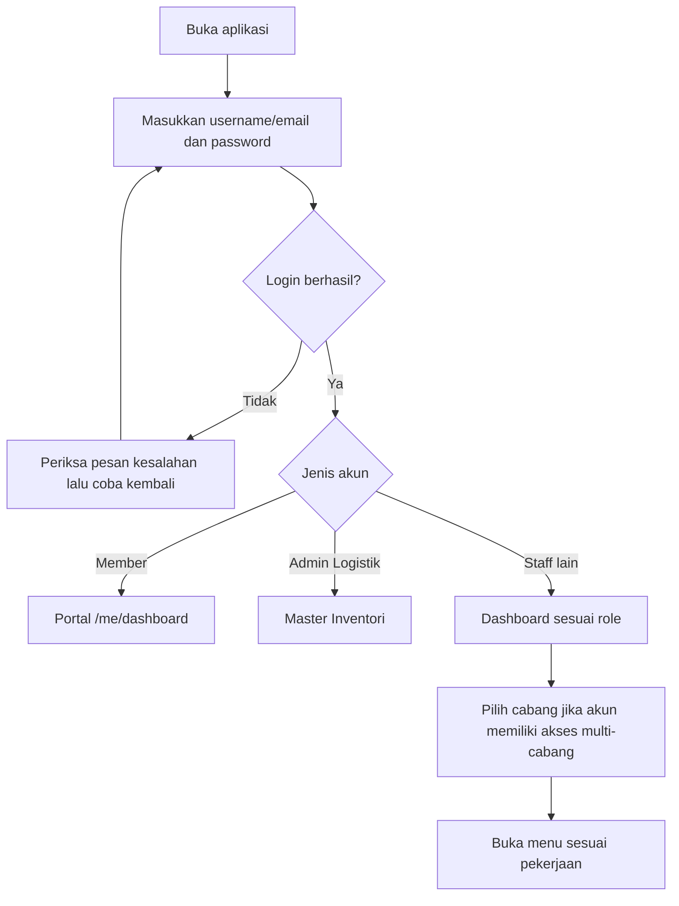
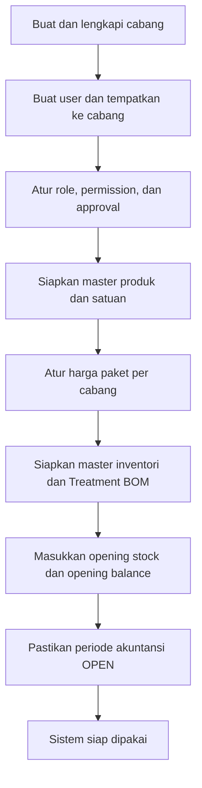
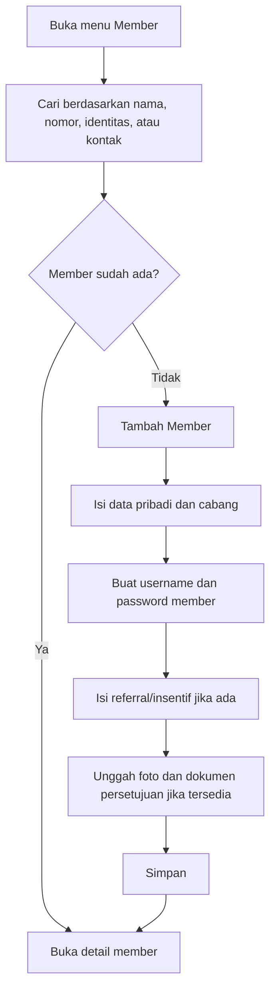
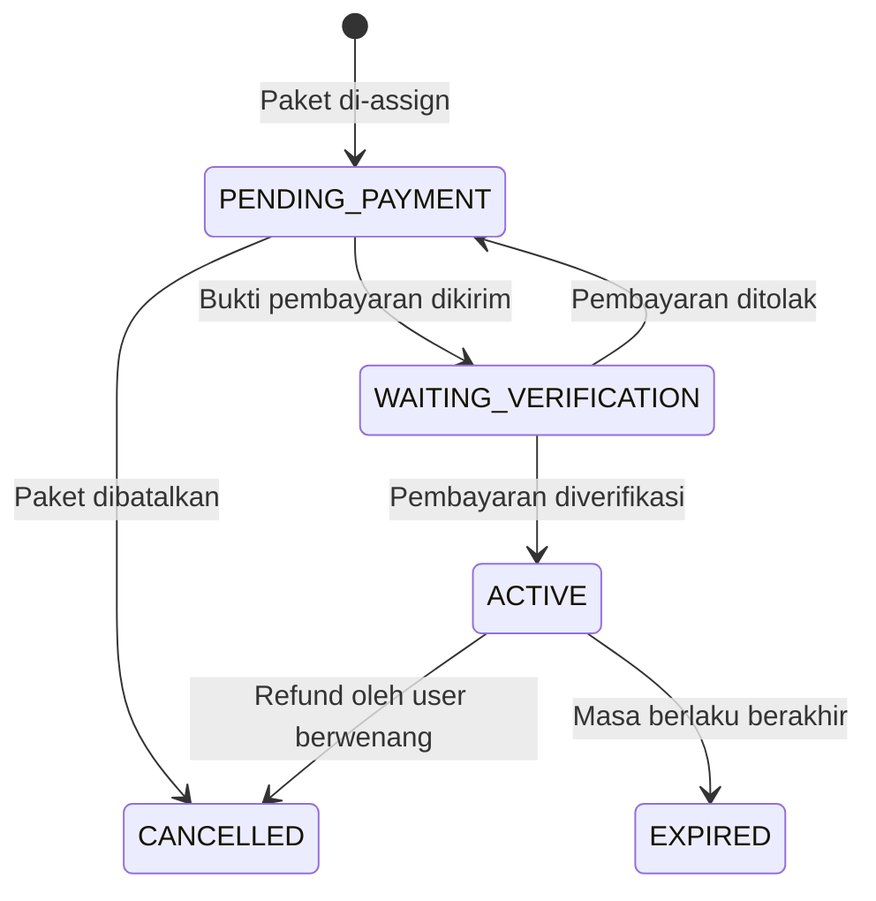
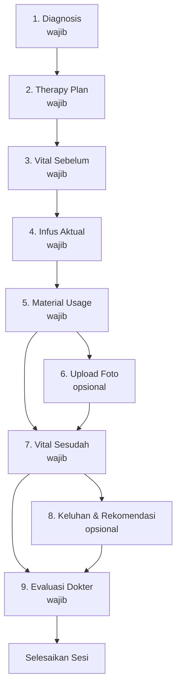
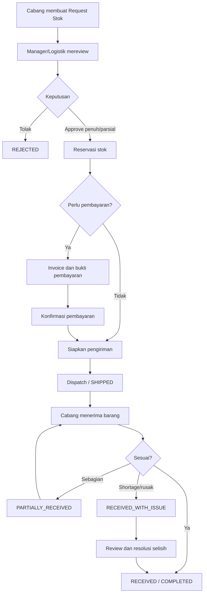
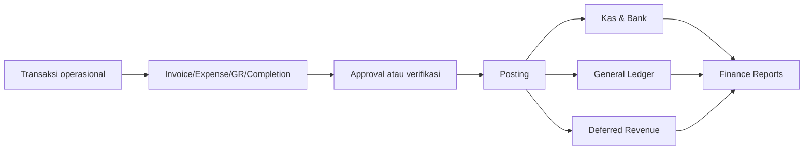
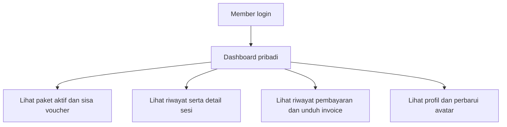

# Flow Penggunaan Aplikasi RAHO

## 1. Tujuan

Dokumen ini menjelaskan alur penggunaan RAHO dari pengguna masuk ke aplikasi,
member didaftarkan, paket dibeli dan dibayar, sesi terapi dijalankan, sampai
stok, keuangan, dan laporan diperbarui.

Panduan ini mengikuti menu dan alur yang tersedia pada aplikasi saat ini.
Tampilan menu dapat berbeda sesuai role, permission, dan cabang pengguna.

## 2. Ringkasan Flow Utama



Urutan operasional yang disarankan:

1. Siapkan organisasi, cabang, user, produk, harga paket, stok, dan konfigurasi
   finance.
2. Login memakai akun sesuai tanggung jawab.
3. Cari member terlebih dahulu untuk mencegah data ganda.
4. Daftarkan member apabila belum tersedia.
5. Assign paket dan selesaikan proses pembayaran.
6. Buat sesi menggunakan paket yang memenuhi syarat.
7. Lengkapi langkah terapi secara berurutan.
8. Klik **Selesaikan Sesi** setelah seluruh langkah wajib lengkap.
9. Periksa mutasi stok, jurnal, dashboard, dan laporan.

## 3. Peran Pengguna

| Peran | Fokus penggunaan |
|---|---|
| Super Admin | Menyiapkan cabang, user, role/permission, master produk, harga paket, konfigurasi sistem, audit, dan integrasi |
| Admin Manager | Memantau beberapa cabang, menyetujui proses terkait, melihat laporan, finance, dan logistik sesuai scope |
| Admin Cabang | Menjalankan operasional cabang, member, paket, pembayaran, staf, stok cabang, dan laporan cabang |
| Admin Layanan | Melayani pendaftaran member, paket, pembayaran, dokumen, dan administrasi sesi |
| Admin Logistik | Mengelola master inventori, ledger, request, reservasi, pengiriman, penerimaan, opname, dan purchasing |
| Dokter | Mengisi diagnosis, therapy plan, dan evaluasi dokter serta melihat riwayat medis member |
| Perawat | Menjalankan sesi, mencatat tanda vital, infus aktual, penggunaan material, dan dokumentasi |
| Member | Melihat dashboard pribadi, paket/voucher, riwayat sesi, invoice, dan profil |

Catatan:

- Pengguna hanya dapat mengakses data sesuai cabang dan permission yang
  diberikan.
- `ADMIN_MANAGER` dengan scope `MEMBER_VIEW_ONLY` hanya dapat membuka data
  member dan profilnya dalam mode lihat.
- Tombol aksi dapat tidak tampil walaupun halaman dapat dibuka apabila pengguna
  tidak memiliki permission untuk mengubah data.

## 4. Kredensial Akun Seed untuk Tutorial

Kredensial berikut hanya digunakan untuk development, UAT, demo, dan pembuatan
tata cara. Jangan gunakan password seed pada production.

Hal penting:

- password bersifat case-sensitive;
- staff login menggunakan email;
- member hasil seed menggunakan email sebagai identifier login;
- menjalankan ulang seed tidak selalu mereset password akun yang sudah ada.

### 4.1 Akun Perwakilan Setiap Peran

Gunakan akun berikut untuk membuat tutorial penggunaan berdasarkan role:

| Peran | Identifier login | Password | Lingkup utama |
|---|---|---|---|
| Super Admin | `superadmin@raho.id` | `SuP3r4Dm1n` | Seluruh sistem |
| Admin Manager | `manager1@raho.id` | `Manager@123` | Jakarta dan Bandung |
| Admin Cabang | `admincabang.pst@raho.id` | `AdminCabang@123` | RAHO Premier Jakarta |
| Admin Layanan | `adminlayanan.pst@raho.id` | `AdminLayanan@123` | RAHO Premier Jakarta |
| Admin Logistik | `adminlogistik@raho.id` | `AdminLogistik@123` | Logistik lintas cabang |
| Finance | `finance@raho.id` | `Finance@123` | Template permission Finance |
| Dokter | `dokter@raho.id` | `Dokter@123` | Cabang utama Jakarta |
| Perawat | `nakes@raho.id` | `Nakes@123` | Cabang utama Jakarta |
| Member | `budi.pst@example.com` | `member123` | Member Jakarta |

Password Super Admin di atas berlaku untuk complete seed pada database bersih.
Essential seed menggunakan `Sup3r4dM1n`, dengan kapitalisasi berbeda.

### 4.2 Seluruh Akun Staff Complete/Testing Seed

#### Sistem, Manager, Logistik, dan Finance

| Nama | Role dasar/template | Identifier login | Password | Cabang/scope |
|---|---|---|---|---|
| Super Admin RAHO | `SUPER_ADMIN` | `superadmin@raho.id` | `SuP3r4Dm1n` | Seluruh sistem |
| Admin Manager Regional 1 | `ADMIN_MANAGER` | `manager1@raho.id` | `Manager@123` | Jakarta dan Bandung |
| Admin Manager Regional 2 | `ADMIN_MANAGER` | `manager2@raho.id` | `Manager@123` | Surabaya dan Jakarta |
| Admin Logistik RAHO | `ADMIN_LOGISTIK` | `adminlogistik@raho.id` | `AdminLogistik@123` | Cabang utama Jakarta; akses lintas cabang |
| Finance RAHO | `ADMIN_MANAGER` + `FINANCE_DUMMY` | `finance@raho.id` | `Finance@123` | Tiga cabang |

Finance menggunakan role dasar `ADMIN_MANAGER` karena enum database belum
memiliki role `FINANCE`. Hak aksesnya dibatasi melalui template
`FINANCE_DUMMY`.

#### Admin Cabang dan Admin Layanan

| Cabang | Role | Identifier login | Password |
|---|---|---|---|
| RAHO Premier Jakarta (`PST`) | `ADMIN_CABANG` | `admincabang.pst@raho.id` | `AdminCabang@123` |
| RAHO Premier Jakarta (`PST`) | `ADMIN_LAYANAN` | `adminlayanan.pst@raho.id` | `AdminLayanan@123` |
| RAHO Partnership Bandung (`BDG`) | `ADMIN_CABANG` | `admincabang.bdg@raho.id` | `AdminCabang@123` |
| RAHO Partnership Bandung (`BDG`) | `ADMIN_LAYANAN` | `adminlayanan.bdg@raho.id` | `AdminLayanan@123` |
| RAHO Premier Surabaya (`SBY`) | `ADMIN_CABANG` | `admincabang.sby@raho.id` | `AdminCabang@123` |
| RAHO Premier Surabaya (`SBY`) | `ADMIN_LAYANAN` | `adminlayanan.sby@raho.id` | `AdminLayanan@123` |

#### Dokter dan Perawat

| Nama | Role | Identifier login | Password | Cabang utama |
|---|---|---|---|---|
| dr. Ahmad Fauzi, SpPD | `DOCTOR` | `dokter@raho.id` | `Dokter@123` | Jakarta |
| dr. Budi Santoso, SpPD | `DOCTOR` | `dokter2@raho.id` | `Dokter@123` | Bandung |
| dr. Citra Wijaya, SpPD | `DOCTOR` | `dokter3@raho.id` | `Dokter@123` | Surabaya |
| Siti Rahayu, Amd.Kep | `NURSE` | `nakes@raho.id` | `Nakes@123` | Jakarta |
| Dewi Lestari, Amd.Kep | `NURSE` | `nakes2@raho.id` | `Nakes@123` | Bandung |
| Eko Prasetyo, Amd.Kep | `NURSE` | `nakes3@raho.id` | `Nakes@123` | Surabaya |

### 4.3 Seluruh Akun Member Complete/Testing Seed

Semua akun member menggunakan password `member123`.

#### RAHO Premier Jakarta

| Nomor member | Nama | Identifier login |
|---|---|---|
| `MBR-PST-0001` | Budi Santoso | `budi.pst@example.com` |
| `MBR-PST-0002` | Siti Nurhaliza | `siti.pst@example.com` |
| `MBR-PST-0003` | Agus Wijaya | `agus.pst@example.com` |
| `MBR-PST-0004` | Rudi Hartono | `rudi.pst@example.com` |
| `MBR-PST-0005` | Maya Sari | `maya.pst@example.com` |
| `MBR-PST-0006` | Rina Kusuma | `rina.pst@example.com` |
| `MBR-PST-0007` | Hendra Gunawan | `hendra.pst@example.com` |
| `MBR-PST-0008` | Fitri Handayani | `fitri.pst@example.com` |

#### RAHO Partnership Bandung

| Nomor member | Nama | Identifier login |
|---|---|---|
| `MBR-BDG-0001` | Bambang Sutrisno | `bambang.bdg@example.com` |
| `MBR-BDG-0002` | Sinta Wijaya | `sinta.bdg@example.com` |
| `MBR-BDG-0003` | Ahmad Hidayat | `ahmad.bdg@example.com` |
| `MBR-BDG-0004` | Dina Kusuma | `dina.bdg@example.com` |
| `MBR-BDG-0005` | Rizki Pratama | `rizki.bdg@example.com` |
| `MBR-BDG-0006` | Nita Sari | `nita.bdg@example.com` |
| `MBR-BDG-0007` | Budi Santoso | `budi2.bdg@example.com` |
| `MBR-BDG-0008` | Ratna Kusuma | `ratna.bdg@example.com` |
| `MBR-BDG-0009` | Hendra Wijaya | `hendra.bdg@example.com` |
| `MBR-BDG-0010` | Fiona Handayani | `fiona.bdg@example.com` |

#### RAHO Premier Surabaya

| Nomor member | Nama | Identifier login |
|---|---|---|
| `MBR-SBY-0001` | Bambang Setiawan | `bambang.sby@example.com` |
| `MBR-SBY-0002` | Sinta Rahayu | `sinta.sby@example.com` |
| `MBR-SBY-0003` | Ahmad Suryanto | `ahmad.sby@example.com` |
| `MBR-SBY-0004` | Dina Wijaya | `dina.sby@example.com` |
| `MBR-SBY-0005` | Rizki Hermawan | `rizki.sby@example.com` |
| `MBR-SBY-0006` | Nita Kusuma | `nita.sby@example.com` |
| `MBR-SBY-0007` | Budi Hartono | `budi2.sby@example.com` |
| `MBR-SBY-0008` | Ratna Wijaya | `ratna.sby@example.com` |
| `MBR-SBY-0009` | Hendra Santoso | `hendra.sby@example.com` |
| `MBR-SBY-0010` | Fiona Rahayu | `fiona.sby@example.com` |

Data aktual membuat 28 member: 8 Jakarta, 10 Bandung, dan 10 Surabaya. Pesan
ringkasan seed lama yang menyebut 30 member tidak sesuai dengan array yang
sekarang dijalankan. Identifier lama `budi.santoso@example.com` juga tidak
dibuat; gunakan `budi.pst@example.com`.

### 4.4 Perbedaan Varian Seed

Script tersedia di `apps/api/package.json`. Dari root repository gunakan format
`npm --prefix apps/api run <nama-script>`.

| Perintah | Akun yang dibuat | Kredensial Super Admin |
|---|---|---|
| `npm run db:seed` | Complete seed: 17 staff dan 28 member aktual | `superadmin@raho.id` / `SuP3r4Dm1n` |
| `npm run db:seed:essential` | Satu Super Admin dan master data | `superadmin@raho.id` / `Sup3r4dM1n` |
| `npm run db:seed:testing` | Staff, cabang, dan member dummy | Mempertahankan password Super Admin dari essential seed |
| `npm run db:seed:minimal` | Dua Super Admin alternatif dan cabang `HQ` | Lihat tabel berikut |

Seed minimal membuat:

| Nama | Identifier login | Password |
|---|---|---|
| Super Administrator | `admin@rahopremier.id` | `SuP3r4Dm1n` |
| Jovan Prabowo Kuncoro | `jovanku1@gmail.com` | `Kuncoro@1` |

File `prisma/seeds/dashboard-test.seed.ts` bukan bagian dari seed standar. Jika
dijalankan manual, file tersebut menambahkan tiga member berikut dengan
password `member123`:

| Nama | Identifier login |
|---|---|
| Ahmad Rizki Pratama | `ahmad.rizki.dash@example.com` |
| Siti Nurhaliza Putri | `siti.nurhaliza.dash@example.com` |
| Budi Santoso Wijaya | `budi.santoso.dash@example.com` |

## 5. Login dan Navigasi



Hal yang perlu dilakukan setelah login:

- pastikan nama dan role akun benar;
- pastikan cabang aktif sudah sesuai sebelum membuat transaksi;
- periksa **Notifikasi** dan **Approval Inbox**;
- gunakan menu **Profil** untuk informasi akun;
- gunakan **Logout** setelah selesai, terutama pada perangkat bersama.

## 6. Persiapan Awal

Flow ini dilakukan sebelum transaksi operasional harian.



Checklist minimum:

- cabang dan tipe cabang sudah benar;
- user memiliki role, permission, dan scope cabang yang sesuai;
- master produk, kategori, UOM, batch, dan expiry sudah dikonfigurasi;
- harga paket dan benefit sesi sudah aktif;
- Treatment BOM yang berlaku sudah `ACTIVE`;
- stok awal dan saldo awal sudah dimasukkan;
- akun kas/bank serta chart of accounts sudah siap;
- periode transaksi berstatus `OPEN`.

## 7. Flow Member, Paket, dan Pembayaran

### 7.1 Pendaftaran Member

Menu: **Member** → **Tambah Member**



Detail member berisi tab **Profil**, **Paket**, **Sesi Terapi**, **Diagnosa**,
**Therapy Plan**, dan **Hasil Lab**. Lengkapi data penting sebelum transaksi
paket atau sesi dibuat.

### 7.2 Assign Paket

Menu: **Member** → pilih member → tab **Paket** → **Assign Paket**

1. Pilih paket basic, booster, add-on, atau produk lain yang dibeli.
2. Periksa cabang, jumlah sesi, harga, diskon, dan catatan.
3. Pilih skema pembayaran yang tersedia.
4. Periksa preview total.
5. Simpan assign paket.
6. Sistem membuat paket dengan status `PENDING_PAYMENT` beserta invoice terkait.

Paket `PENDING_PAYMENT` dapat diedit atau dibatalkan oleh pengguna yang
berwenang. Paket yang sudah digunakan tidak boleh dikoreksi dengan mengubah
riwayat transaksi secara langsung.

### 7.3 Pembayaran dan Aktivasi Paket

Menu: **Pembayaran**, atau dari tab **Paket** pada detail member.



Flow pembayaran:

1. Buka invoice dan periksa item, diskon, total, serta outstanding.
2. Finalisasi invoice apabila masih `DRAFT`.
3. Klik aksi pembayaran.
4. Pilih metode dan akun kas/bank.
5. Isi nominal pembayaran.
6. Unggah bukti untuk transaksi non-tunai.
7. Pemeriksa membuka bukti pembayaran.
8. Pilih **Verifikasi & Posting** atau **Tolak** disertai alasan.
9. Pembayaran terverifikasi memperbarui invoice dan mengaktifkan paket sesuai
   aturan pembayaran.

Pembayaran parsial tetap menyisakan outstanding. Pembayaran yang ditolak tidak
membentuk jurnal atau transaksi kas/bank; bukti harus dikirim ulang sebagai
riwayat pembayaran baru.

## 8. Flow Sesi Terapi

### 8.1 Membuat Sesi

Menu: **Member** → pilih member → tab **Sesi Terapi** → **Buat Sesi Baru**

1. Pilih cabang pelaksanaan.
2. Pilih jenis pelaksanaan: `ON_SITE` atau `HOME_CARE`.
3. Pilih paket basic yang aktif atau memenuhi aturan kelayakan.
4. Pilih paket booster bila digunakan.
5. Tentukan dokter, perawat, admin layanan, tanggal, dan waktu.
6. Simpan sesi.
7. Sistem membuka detail sesi untuk dilengkapi.

Jika ada sesi yang belum lengkap, gunakan **Lanjutkan Sesi Pending** sebelum
membuat sesi lain apabila pekerjaan tersebut memang merupakan kelanjutan
kunjungan yang sama.

### 8.2 Urutan 9 Langkah



Panduan pengisian:

1. **Diagnosis**  
   Dokter atau petugas berwenang mencatat diagnosis dan kode ICD bila
   diperlukan.

2. **Therapy Plan**  
   Pilih rencana terapi yang berlaku dan pastikan dosis/substansi sudah benar.

3. **Vital Sebelum**  
   Catat tanda vital sebelum tindakan.

4. **Infus Aktual**  
   Catat pelaksanaan aktual, cairan, booster, dan penyimpangan dari rencana bila
   ada.

5. **Material Usage**  
   Periksa rekomendasi dari Treatment BOM, lalu simpan pemakaian aktual.
   Perbedaan dari rekomendasi harus disertai alasan.

6. **Upload Foto — opsional**  
   Unggah dokumentasi sesi sesuai persetujuan member.

7. **Vital Sesudah**  
   Catat tanda vital setelah tindakan.

8. **Keluhan & Rekomendasi — opsional**  
   Catat keluhan setelah tindakan dan rekomendasi lanjutan.

9. **Evaluasi Dokter**  
   Dokter mengisi evaluasi klinis dan menyelesaikan catatan medis.

Langkah berikutnya akan terkunci sampai prasyarat langkah sebelumnya selesai.
Foto tidak menghalangi pengisian vital sesudah, dan langkah keluhan tidak
menghalangi evaluasi dokter.

### 8.3 Menyelesaikan Sesi

Tombol **Selesaikan Sesi** muncul setelah tujuh langkah wajib lengkap:
Diagnosis, Therapy Plan, Vital Sebelum, Infus Aktual, Material Usage, Vital
Sesudah, dan Evaluasi Dokter.

Ketika sesi berhasil diselesaikan, sistem menjalankan satu transaksi terpadu:

- menandai sesi selesai;
- mencatat material sebagai `CONSUMED`;
- mengurangi stok berdasarkan layer valid/FIFO;
- membentuk mutasi inventori;
- mengurangi benefit atau sisa sesi paket;
- mengakui pendapatan dari deferred revenue sesuai nilai benefit;
- membentuk jurnal revenue, HPP, dan persediaan;
- memperbarui dashboard serta laporan.

Jika stok tidak cukup atau periode akuntansi tertutup, seluruh penyelesaian sesi
dibatalkan tanpa posting sebagian. Perbaiki penyebabnya lalu ulangi proses.

Pembatalan completion hanya dilakukan oleh pengguna berwenang dengan alasan.
Sistem membuat reversal untuk stok, material, revenue, dan jurnal; riwayat asli
tidak dihapus.

## 9. Flow Inventori dan Logistik

### 9.1 Request dan Pengiriman Stok



Aturan operasional:

- cabang memeriksa kebutuhan sebelum membuat request;
- approver dapat menyetujui jumlah penuh atau sebagian;
- barang yang disetujui direservasi agar tidak dipakai transaksi lain;
- pengirim memeriksa item, batch, quantity, dan tujuan sebelum dispatch;
- penerima mencatat jumlah aktual, kekurangan, atau kerusakan;
- selisih tidak diselesaikan dengan mengubah ledger secara manual;
- seluruh perubahan dapat ditelusuri melalui **Ledger Stok** dan **Mutasi Stok**.

### 9.2 Purchasing dan Goods Receipt

Menu: **Purchasing & AP** dan **Goods Receipt**

```text
Supplier
  → Purchase Request
  → Submit
  → Approval
  → Purchase Order
  → Goods Receipt parsial/final
  → Supplier Invoice
  → Accounts Payable
  → Pembayaran supplier
```

Saat Goods Receipt, periksa produk, quantity, unit, batch, expiry, kondisi, dan
lokasi penyimpanan. Posting penerimaan memperbarui stok, cost layer, utang, dan
jurnal sesuai konfigurasi.

### 9.3 Kontrol Stok

- **Super Admin** dapat mengubah stok langsung dari menu **Stok** atau
  **Master Produk**. Isi stok/penyesuaian, harga pokok per satuan, dan alasan;
  sistem langsung membuat, menyetujui, serta mem-posting dokumen adjustment
  beserta mutasi ledger, valuasi, jurnal, dan audit trail.
- Gunakan **Adjustment & Opname** untuk koreksi dengan alasan dan evidence.
- Gunakan **Stock Opname** untuk snapshot, hitung fisik, resolusi selisih,
  approval, dan posting.
- Gunakan **Riwayat Penggunaan Barang** untuk menelusuri material per sesi,
  staf, cabang, barang, dan tanggal.
- Gunakan **Tas Homecare** untuk request, pengiriman, penggunaan, return, dan
  opname stok tas.

## 10. Flow Finance



Penggunaan utama:

- **Pembayaran**: finalisasi invoice, pembayaran parsial/penuh, verifikasi,
  reject, refund, dan bukti transaksi;
- **Accounting**: chart of accounts, periode, jurnal manual, serta reversal;
- **Kas & Bank**: master rekening dan ledger penerimaan/pengeluaran;
- **Opening Balance**: saldo awal saat cutover;
- **Expense**: pencatatan, approval, posting, dan pembayaran beban;
- **Purchasing & AP**: supplier sampai pembayaran utang;
- **Deferred Revenue**: pemantauan dana paket yang belum diakui sebagai omzet;
- **Finance Reports**: P&L, Trial Balance, General Ledger, Kas/Bank, dan
  rekonsiliasi;
- **Approval Inbox**: keputusan transaksi yang menunggu persetujuan.

Transaksi `POSTED` tidak diedit atau dihapus langsung. Koreksi dilakukan melalui
reversal atau dokumen koreksi agar audit trail tetap utuh.

## 11. Flow Portal Member

Setelah menerima username dan password, member dapat login ke portal pribadi.



Portal member bersifat self-service untuk melihat informasi. Pembuatan paket,
verifikasi pembayaran, dan pelaksanaan sesi tetap dilakukan oleh staf yang
berwenang.

## 12. Checklist Operasional Harian

### Awal Hari

- login dengan akun sendiri;
- pastikan cabang aktif sudah benar;
- periksa notifikasi dan approval;
- periksa stok rendah, request, pengiriman, dan transaksi pending;
- pastikan periode akuntansi transaksi masih `OPEN`.

### Saat Melayani Member

- cari member sebelum membuat data baru;
- periksa profil, dokumen, paket aktif, sisa sesi, dan sesi pending;
- pastikan harga, diskon, metode pembayaran, serta bukti sudah benar;
- isi data terapi sesuai kondisi aktual, bukan menyalin sesi sebelumnya tanpa
  pemeriksaan;
- selesaikan sesi hanya setelah tujuh langkah wajib valid.

### Akhir Hari

- pastikan tidak ada sesi yang tertinggal tanpa alasan;
- periksa pembayaran pending/rejected dan outstanding;
- cocokkan penggunaan material dengan mutasi stok;
- periksa pengiriman atau penerimaan yang belum selesai;
- periksa jurnal gagal, approval tertunda, dan notifikasi sistem;
- tinjau dashboard dan laporan cabang.

## 13. Penanganan Kondisi Khusus

| Kondisi | Tindakan |
|---|---|
| Salah cabang | Hentikan input, pilih cabang yang benar, lalu ulangi transaksi |
| Member diduga duplikat | Jangan membuat member baru; lakukan pencarian lintas data dan hubungi admin |
| Bukti pembayaran salah | Tolak dengan alasan jelas, lalu minta bukti baru |
| Paket belum aktif | Selesaikan pembayaran/verifikasi atau periksa kelayakan skema cicilan |
| Sesi tidak dapat dibuat | Periksa paket, sisa sesi, cabang, tanggal, dan sesi pending |
| Langkah sesi terkunci | Selesaikan prasyarat pada langkah sebelumnya |
| Material berbeda dari BOM | Isi pemakaian aktual dan alasan penyimpangan |
| Stok tidak cukup saat completion | Tambah/transfer stok yang valid, lalu ulangi completion |
| Periode akuntansi tertutup | Minta Finance membuka periode sesuai kewenangan |
| Barang diterima kurang/rusak | Catat discrepancy dan selesaikan melalui flow resolusi |
| Transaksi posted salah | Gunakan reversal/koreksi; jangan mengubah atau menghapus ledger langsung |

## 14. Hasil Akhir yang Diharapkan

Satu siklus layanan dianggap selesai ketika:

- data member dan paket benar;
- pembayaran memiliki status dan bukti yang dapat ditelusuri;
- sesi berstatus selesai dengan catatan medis wajib lengkap;
- sisa sesi paket sudah berkurang dengan benar;
- penggunaan material dan stok sesuai;
- revenue, HPP, kas/bank, dan jurnal tercatat seimbang;
- data muncul konsisten pada dashboard, audit log, dan laporan.

## 15. Dokumen Terkait

- [Panduan Fitur Finance dan Alur Kerja](PANDUAN_FITUR_FINANCE_DAN_FLOW.md)
- [Panduan Singkat Flow RAHO dan Zoho Books](PANDUAN_SINGKAT_FLOW_ZOHO_BOOKS.md)
- [UAT User Test Scenarios Sprint 1–11](UAT_USER_TEST_SCENARIOS_SPRINT_1_11.md)
