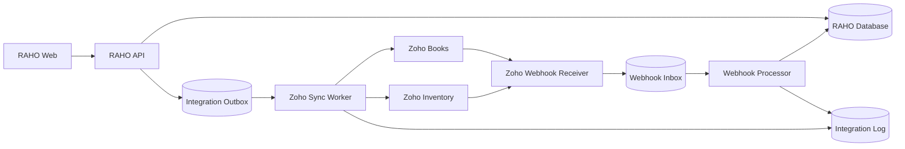
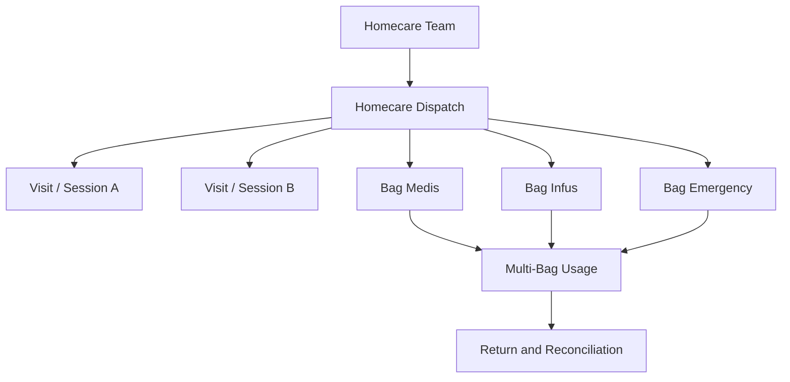
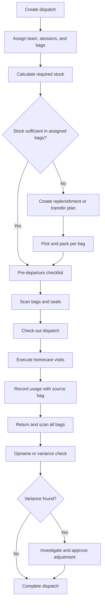

# Future Plan: Integrasi Zoho Finance dan Logistik Multi-Tas

Dokumen ini menjadi rencana pengembangan lanjutan RAHO ERP dengan dua prioritas utama:

1. Integrasi Zoho untuk proses finance dan rekonsiliasi akuntansi.
2. Pengembangan logistik homecare agar satu tim, perjalanan, dan sesi dapat menggunakan beberapa tas secara aman dan terlacak.

Rencana ini bersifat target architecture dan product backlog. Detail endpoint Zoho, field pajak, chart of accounts, serta fitur yang tersedia tetap harus dikonfirmasi terhadap paket Zoho dan organisasi RAHO sebelum implementasi produksi.

## 1. Sasaran Bisnis

### Integrasi Zoho Finance

- Mengurangi input ulang invoice dan pembayaran dari RAHO ke Zoho.
- Menjaga nomor referensi transaksi yang dapat ditelusuri di kedua sistem.
- Mendukung rekonsiliasi pembayaran, refund, piutang, pajak, dan pendapatan per cabang.
- Menyediakan status sinkronisasi yang terlihat dan dapat diperbaiki tanpa mengubah data klinis.
- Memisahkan transaksi operasional dari pencatatan akuntansi secara jelas.

### Logistik Multi-Tas

- Mengizinkan satu tim memiliki dan membawa lebih dari satu tas.
- Mengizinkan satu kunjungan atau sesi homecare memakai stok dari beberapa tas.
- Mengetahui tas, produk, batch, dan petugas yang terlibat dalam setiap perpindahan stok.
- Mencegah stok negatif, penggunaan ganda, dan pemindahan tas yang masih terkunci.
- Mempercepat persiapan, serah terima, opname, retur, dan investigasi selisih.

## 2. Prinsip Arsitektur

| Prinsip | Keputusan |
| --- | --- |
| Source of truth | RAHO menjadi sumber data member, layanan, invoice operasional, dan stok tas. Zoho menjadi sumber pencatatan akuntansi yang telah diposting. |
| Loose coupling | Transaksi RAHO tetap berhasil walaupun Zoho sedang tidak tersedia; sinkronisasi dijalankan asynchronous. |
| Idempotency | Satu transaksi RAHO tidak boleh membuat lebih dari satu record Zoho untuk event yang sama. |
| Immutable reference | ID dan nomor dokumen RAHO dikirim sebagai external reference/custom field Zoho. |
| No silent failure | Semua kegagalan sinkronisasi masuk antrean retry dan dashboard exception. |
| Least privilege | OAuth scope hanya diberikan untuk modul yang benar-benar digunakan. |
| Auditability | Payload penting, hasil, actor, waktu, correlation ID, dan alasan retry dicatat. Token dan data sensitif tidak dicatat. |
| Incremental rollout | Mulai dari export satu arah sebelum mengaktifkan sinkronisasi dua arah. |

## 3. Target Architecture



Alur utama menggunakan transactional outbox:

1. Proses bisnis menyimpan transaksi RAHO dan event integrasi dalam satu database transaction.
2. Worker mengambil event yang belum diproses.
3. Worker mengirim data ke Zoho menggunakan OAuth 2.0.
4. ID record Zoho dan status sinkronisasi disimpan pada mapping table.
5. Webhook atau scheduled reconciliation memperbarui status balik tanpa mengubah transaksi klinis secara langsung.

## 4. Prioritas 1 — Integrasi Zoho Finance

### 4.1 Ruang Lingkup MVP

MVP disarankan menggunakan Zoho Books untuk:

- Sinkronisasi member/customer.
- Pembuatan invoice setelah invoice RAHO difinalisasi.
- Pencatatan customer payment setelah pembayaran diverifikasi.
- Void/cancel invoice yang belum memiliki posting pembayaran final.
- Credit note atau mekanisme refund yang disepakati finance.
- Rekonsiliasi status dan outstanding invoice.
- Mapping cabang RAHO ke location, tag, atau custom field Zoho.

Zoho Books mendukung OAuth 2.0 serta resource invoice, customer payment, credit note, expense, sales order, purchase order, bill, dan banking. Implementasi awal cukup meminta scope contacts, invoices, customer payments, credit notes, dan settings yang diperlukan.

### 4.2 Batas Tanggung Jawab Sistem

| Area | RAHO | Zoho |
| --- | --- | --- |
| Member dan layanan | Master operasional | Contact hasil sinkronisasi |
| Harga paket dan diskon | Perhitungan transaksi | Snapshot line item/posting |
| Bukti pembayaran | Penyimpanan dan verifikasi operasional | Referensi atau attachment bila disetujui |
| Invoice | Nomor dan lifecycle operasional | Dokumen finance/accounting |
| Jurnal dan chart of accounts | Tidak menjadi ledger utama | Dikelola finance |
| Pajak | Nilai transaksi dari konfigurasi RAHO | Mapping tax code yang disetujui finance |
| Refund | Workflow dan approval operasional | Credit note/refund accounting |
| Closing period | Mengikuti validasi integrasi | Otoritas finance/accounting |

### 4.3 Mapping Entitas

| RAHO | Zoho | External key yang disarankan |
| --- | --- | --- |
| `Member` | Contact/Customer | `raho_member_id`, `memberNo` |
| `Branch` | Location/Tag/Custom Field | `raho_branch_id`, `branchCode` |
| `Invoice` | Invoice | `raho_invoice_id`, `invoiceNumber` |
| `InvoiceItem` | Invoice Line Item | `code`, `itemType`, source item ID |
| `InvoicePayment` | Customer Payment | `raho_payment_id`, `paymentReference` |
| Package refund | Credit Note/Refund | `raho_refund_id`, package code |
| Stock-request invoice | Bill, invoice, atau intercompany flow | Ditentukan melalui workshop finance |
| Referral incentive | Expense/Bill/Journal kandidat | Ditentukan berdasarkan pihak penerima dan kebijakan pajak |

Keputusan penting: jangan memakai nama atau nomor telepon sebagai kunci sinkronisasi. Gunakan mapping ID permanen dan custom field unik bila paket Zoho mendukungnya.

### 4.4 Event Integrasi Finance

| Event RAHO | Aksi Zoho | Trigger |
| --- | --- | --- |
| `MEMBER_CREATED` | Create contact | Setelah member valid |
| `MEMBER_UPDATED` | Update contact | Hanya field yang diizinkan |
| `INVOICE_FINALIZED` | Upsert invoice | Invoice tidak lagi draft |
| `PAYMENT_VERIFIED` | Create customer payment | Setelah verifikasi admin |
| `INVOICE_CANCELLED` | Void invoice | Jika memenuhi aturan finance |
| `PACKAGE_REFUNDED` | Create credit note/refund | Setelah approval refund |
| `INVOICE_OVERDUE` | Pull/update status | Scheduled reconciliation |
| `REFERRAL_INCENTIVE_APPROVED` | Create expense/bill kandidat | Fase lanjutan |

### 4.5 Status Sinkronisasi

```text
NOT_REQUIRED -> PENDING -> PROCESSING -> SYNCED
                              |            |
                              v            v
                           FAILED      OUT_OF_SYNC
                              |
                              v
                         RETRY_PENDING
```

Status bisnis dan status integrasi harus dipisah. Invoice dapat berstatus `PAID` di RAHO walaupun `zohoSyncStatus` masih `PENDING`.

### 4.6 Model Data Kandidat

```prisma
enum IntegrationProvider {
  ZOHO_BOOKS
  ZOHO_INVENTORY
}

enum IntegrationSyncStatus {
  PENDING
  PROCESSING
  SYNCED
  FAILED
  RETRY_PENDING
  OUT_OF_SYNC
  IGNORED
}

model ExternalIntegrationConnection {
  id                String @id @default(cuid())
  provider          IntegrationProvider
  organizationId    String
  dataCenter        String
  encryptedTokenRef String
  isActive          Boolean @default(true)
  lastHealthyAt     DateTime?
  createdAt         DateTime @default(now())
  updatedAt         DateTime @updatedAt
}

model ExternalEntityMapping {
  id               String @id @default(cuid())
  provider         IntegrationProvider
  entityType       String
  internalId       String
  externalId       String
  externalVersion  String?
  lastSyncedAt     DateTime?

  @@unique([provider, entityType, internalId])
  @@unique([provider, entityType, externalId])
}

model IntegrationOutbox {
  id              String @id @default(cuid())
  provider        IntegrationProvider
  eventType       String
  aggregateType   String
  aggregateId     String
  idempotencyKey  String @unique
  payload         Json
  status          IntegrationSyncStatus @default(PENDING)
  attemptCount    Int @default(0)
  nextAttemptAt   DateTime?
  lastErrorCode   String?
  lastErrorSafe   String?
  createdAt       DateTime @default(now())
  processedAt     DateTime?

  @@index([status, nextAttemptAt])
  @@index([aggregateType, aggregateId])
}

model IntegrationWebhookInbox {
  id             String @id @default(cuid())
  provider       IntegrationProvider
  externalEventId String?
  payloadHash    String
  payload        Json
  receivedAt     DateTime @default(now())
  processedAt    DateTime?
  status         IntegrationSyncStatus @default(PENDING)

  @@unique([provider, payloadHash])
}
```

Token OAuth tidak boleh disimpan sebagai teks biasa. `encryptedTokenRef` sebaiknya menunjuk ke secret manager atau ciphertext dengan key di luar database.

### 4.7 Endpoint Internal Kandidat

| Method | Endpoint | Fungsi |
| --- | --- | --- |
| `GET` | `/admin/integrations/zoho/status` | Kesehatan koneksi dan backlog sync |
| `POST` | `/admin/integrations/zoho/connect` | Memulai OAuth consent |
| `GET` | `/admin/integrations/zoho/callback` | Menyelesaikan OAuth flow |
| `POST` | `/admin/integrations/zoho/disconnect` | Menonaktifkan koneksi secara terkontrol |
| `GET` | `/admin/integrations/zoho/mappings` | Melihat mapping entity |
| `POST` | `/admin/integrations/zoho/sync/:entityType/:id` | Retry/sync manual satu entity |
| `POST` | `/admin/integrations/zoho/reconcile` | Menjalankan rekonsiliasi periode |
| `POST` | `/webhooks/zoho/books` | Menerima webhook Books |
| `POST` | `/webhooks/zoho/inventory` | Menerima webhook Inventory |

### 4.8 Rekonsiliasi dan Exception Handling

Dashboard integrasi minimal menampilkan:

- Jumlah `PENDING`, `FAILED`, `OUT_OF_SYNC`, dan event tertua.
- Invoice RAHO tanpa mapping Zoho.
- Perbedaan total, balance, currency, status, atau payment.
- Mapping customer ganda atau hilang.
- Error autentikasi, rate limit, validasi, dan closed accounting period.
- Tombol retry satu record dan bulk retry yang dibatasi role.
- Detail correlation ID tanpa memperlihatkan token atau data sensitif.

Strategi retry:

- Retry otomatis dengan exponential backoff dan jitter.
- Hormati respons rate limit Zoho.
- Error validasi bisnis tidak di-retry tanpa koreksi data.
- Setelah batas percobaan, pindahkan ke dead-letter/exception queue.
- Scheduled reconciliation tetap diperlukan walaupun webhook aktif.

### 4.9 Kontrol Finance

- Mapping chart of accounts per jenis pendapatan: paket, booster, add-on, produk non-terapi, dan ongkos lain.
- Mapping tax code dan pembulatan harus disetujui finance.
- Invoice yang telah masuk periode tutup buku tidak boleh diubah otomatis.
- Refund memerlukan approval matrix berdasarkan nominal.
- Semua perubahan mapping wajib diaudit.
- Sediakan dry-run berisi payload dan dampak sebelum bulk backfill.
- Backfill historis dibatasi periode dan dijalankan per batch.

### 4.10 Acceptance Criteria MVP Finance

- Satu invoice finalized menghasilkan maksimal satu invoice Zoho.
- Retry event yang sama tidak membuat duplikasi.
- Pembayaran hanya dikirim setelah status verifikasi RAHO valid.
- Total dan line item Zoho sama dengan snapshot invoice RAHO.
- Cabang dan nomor invoice dapat dicari dari kedua sistem.
- Gangguan Zoho tidak menggagalkan transaksi pembayaran RAHO.
- Admin dapat melihat alasan kegagalan dan melakukan retry.
- Rekonsiliasi mendeteksi perubahan manual di Zoho.
- Token tidak muncul di log, response API, atau audit payload.

## 5. Prioritas 2 — Logistik Multiple Tas

### 5.1 Kondisi Model Saat Ini

Model saat ini sudah mendukung:

- Satu `HomecareTeam` memiliki banyak `HomecareBag` melalui relasi `bags`.
- Stok, request, shipment, usage, return, opname, dan mutation per tas.
- Tas sebagai lokasi stok terpisah dari central dan branch.

Keterbatasan utamanya:

- `HomecareBagUsage` hanya memiliki satu `bagId`.
- `HomecareBagStockRequest` dan `HomecareBagShipment` hanya memiliki satu tas tujuan.
- Belum ada konsep perjalanan/dispatch yang mengelompokkan tim, kendaraan, sesi, dan beberapa tas.
- Belum ada reservation/locking stok sebelum tim berangkat.
- Belum ada transfer langsung antar tas sebagai workflow khusus.
- Batch, expiry, serial, segel, QR, dan chain of custody belum menjadi bagian eksplisit dari model tas.

### 5.2 Konsep Target

Tambahkan entitas `HomecareDispatch` sebagai header perjalanan. Satu dispatch memiliki:

- Satu tim dan cabang asal.
- Satu atau beberapa treatment session/kunjungan.
- Satu atau beberapa tas.
- PIC penyerahan, PIC penerimaan, driver, kendaraan, jadwal, dan status.
- Checklist keberangkatan dan kepulangan.
- Rekonsiliasi stok seluruh tas setelah dispatch selesai.



### 5.3 Model Data Kandidat

```prisma
enum HomecareDispatchStatus {
  DRAFT
  PREPARING
  READY
  CHECKED_OUT
  IN_SERVICE
  RETURNED
  RECONCILING
  COMPLETED
  CANCELLED
}

model HomecareDispatch {
  id          String @id @default(cuid())
  dispatchCode String @unique
  teamId      String
  branchId    String
  status      HomecareDispatchStatus @default(DRAFT)
  scheduledStart DateTime
  scheduledEnd   DateTime?
  checkedOutAt   DateTime?
  returnedAt     DateTime?
  completedAt    DateTime?
  vehicleInfo    String?
  notes          String? @db.Text
  createdBy      String
  createdAt      DateTime @default(now())
  updatedAt      DateTime @updatedAt

  bags      HomecareDispatchBag[]
  sessions  HomecareDispatchSession[]
}

model HomecareDispatchBag {
  id          String @id @default(cuid())
  dispatchId  String
  bagId       String
  sealOutNo   String?
  sealInNo    String?
  checkedOutBy String?
  checkedInBy  String?
  checkedOutAt DateTime?
  checkedInAt  DateTime?

  @@unique([dispatchId, bagId])
  @@index([bagId, checkedInAt])
}

model HomecareDispatchSession {
  id                 String @id @default(cuid())
  dispatchId         String
  treatmentSessionId String

  @@unique([dispatchId, treatmentSessionId])
}

model HomecareMultiBagUsage {
  id                 String @id @default(cuid())
  usageCode          String @unique
  dispatchId         String?
  treatmentSessionId String?
  teamId             String
  usedBy             String
  usedAt             DateTime @default(now())
  notes              String? @db.Text

  items HomecareMultiBagUsageItem[]
}

model HomecareMultiBagUsageItem {
  id              String @id @default(cuid())
  usageId         String
  bagId           String
  masterProductId String
  batchId         String?
  quantity        Decimal @db.Decimal(10, 4)
  unit            String?

  @@index([usageId, bagId])
  @@index([bagId, masterProductId])
}
```

Model final dapat mempertahankan `HomecareBagUsage` sebagai header lalu memindahkan `bagId` ke item. Migrasi perlu menjaga histori dan kompatibilitas API lama.

### 5.4 Business Rules Multi-Tas

1. Tas hanya boleh berada pada satu dispatch aktif pada waktu yang sama.
2. Tas berstatus `DAMAGED`, `LOST`, `INACTIVE`, atau `IN_CHECKING` tidak dapat check-out.
3. Semua tas wajib dipindai saat check-out dan check-in.
4. Penggunaan harus menunjuk tas sumber pada setiap item.
5. Pengurangan stok seluruh item harus atomic; kegagalan satu item membatalkan seluruh usage.
6. Stok tidak boleh negatif kecuali ada emergency override dengan role dan alasan khusus.
7. Batch dengan expiry terdekat diprioritaskan menggunakan FEFO.
8. Item kedaluwarsa, rusak, atau karantina tidak dapat digunakan.
9. Transfer antar tas harus membuat mutation keluar dan masuk dengan correlation ID yang sama.
10. Dispatch tidak dapat selesai sebelum semua tas kembali atau exception kehilangan disetujui.
11. Perbedaan opname menghasilkan adjustment hanya setelah approval.
12. Satu treatment session dapat memakai beberapa tas, tetapi tidak boleh mencatat item yang sama dua kali tanpa sumber tas yang jelas.

### 5.5 Workflow Multi-Tas



### 5.6 Endpoint Kandidat

| Method | Endpoint | Fungsi |
| --- | --- | --- |
| `POST` | `/homecare/dispatches` | Membuat dispatch |
| `GET` | `/homecare/dispatches/:id` | Detail tim, sesi, tas, dan checklist |
| `POST` | `/homecare/dispatches/:id/bags` | Assign beberapa tas |
| `DELETE` | `/homecare/dispatches/:id/bags/:bagId` | Melepas tas sebelum check-out |
| `POST` | `/homecare/dispatches/:id/prepare` | Menghitung kebutuhan dan shortage |
| `POST` | `/homecare/dispatches/:id/check-out` | Scan dan serah terima tas |
| `POST` | `/homecare/dispatches/:id/usages` | Pemakaian dari beberapa tas |
| `POST` | `/homecare/dispatches/:id/check-in` | Penerimaan kembali beberapa tas |
| `POST` | `/homecare/dispatches/:id/reconcile` | Rekonsiliasi stok dan selisih |
| `POST` | `/homecare/bags/transfers` | Transfer stok antar tas |
| `GET` | `/homecare/bags/availability` | Mencari tas tersedia pada rentang waktu |

### 5.7 UX yang Dibutuhkan

- Dispatch board berdasarkan tanggal, tim, cabang, dan status.
- Multi-select tas dengan indikator tersedia, konflik jadwal, status, dan kelengkapan stok.
- QR/barcode scanning untuk tas, segel, dan produk.
- Pick list terpisah per tas agar packing tidak tercampur.
- Tampilan kebutuhan versus stok tersedia seluruh tas.
- Form usage yang otomatis memilih tas berdasarkan FEFO tetapi masih dapat dikoreksi sesuai izin.
- Offline draft untuk lokasi dengan koneksi buruk, dengan conflict check saat sinkronisasi.
- Checklist pulang yang menunjukkan tas belum kembali dan item dengan selisih.
- Dashboard low stock, near expiry, tas rusak/hilang, dan dispatch terlambat.

### 5.8 Integrasi Zoho Inventory untuk Logistik

Zoho Inventory dapat digunakan pada fase lanjutan untuk master item dan ringkasan stok antar lokasi. API Transfer Orders menyediakan alur create, approval, in-transit, dan received antara warehouse/location.

Rekomendasi boundary:

- Central stock dan branch stock dapat dipetakan sebagai Zoho warehouse/location.
- Jangan langsung membuat setiap tas sebagai warehouse sebelum menguji batas jumlah location, biaya paket, volume API, dan usability Zoho.
- Tas tetap menjadi sub-location operasional di RAHO pada MVP.
- Transfer branch-to-bag dicatat detail di RAHO dan dapat diagregasi ke Zoho sebagai transaksi lokasi jika finance/logistik memerlukannya.
- Sinkronisasi stok dua arah tidak diaktifkan sebelum ownership adjustment dan conflict resolution disepakati.

Opsi desain:

| Opsi | Kelebihan | Risiko | Rekomendasi |
| --- | --- | --- | --- |
| Setiap tas menjadi Zoho location | Visibilitas langsung per tas | Banyak location dan API call; maintenance tinggi | Hanya jika jumlah tas kecil dan paket mendukung |
| Tas tetap internal RAHO | Model operasional fleksibel | Zoho tidak melihat stok per tas | Rekomendasi MVP |
| Agregasi tas per cabang/team | Seimbang untuk reporting | Tidak real-time per tas di Zoho | Kandidat fase kedua |

### 5.9 Acceptance Criteria MVP Multi-Tas

- Satu dispatch dapat memiliki minimal dua tas.
- Satu sesi dapat mengurangi stok dari lebih dari satu tas dalam satu transaction.
- Tas tidak dapat masuk dua dispatch aktif yang waktunya bertabrakan.
- Check-out dan check-in mencatat user, waktu, serta hasil scan.
- Mutasi stok menunjukkan bag source, session/dispatch reference, dan saldo sebelum/sesudah.
- Selisih fisik tidak langsung mengubah stok tanpa approval.
- Dispatch tidak dapat complete jika ada tas yang belum kembali tanpa approved exception.
- Riwayat model lama tetap dapat dibaca setelah migrasi.

## 6. Roadmap Implementasi

### Phase 0 — Discovery dan Keputusan Bisnis

- Workshop finance: chart of accounts, pajak, refund, piutang, installment, referral incentive, dan closing period.
- Tentukan produk Zoho, paket langganan, organization ID, data center, dan sandbox/test organization.
- Tentukan volume invoice, pembayaran, item, transfer, dan jumlah tas harian.
- Petakan status RAHO ke status Zoho.
- Audit kualitas member, invoice, SKU, branch code, dan nomor referensi.
- Definisikan RACI dan data owner.

Exit criteria: mapping dan ownership ditandatangani finance, logistics, product, dan engineering.

### Phase 1 — Integration Foundation

- OAuth connection dan secret handling.
- Outbox, inbox, mapping, integration log, idempotency, retry, dan monitoring.
- Admin health page dan manual retry.
- Contract test dengan Zoho test organization.

Exit criteria: event dummy dapat dikirim, di-retry, dan direkonsiliasi tanpa duplikasi.

### Phase 2 — Zoho Finance MVP

- Contact/customer sync.
- Invoice finalized sync.
- Verified payment sync.
- Cancel/void dan refund terbatas.
- Daily reconciliation dan exception dashboard.
- Pilot satu cabang sebelum rollout bertahap.

Exit criteria: satu periode pilot dapat direkonsiliasi dengan selisih yang dijelaskan dan disetujui finance.

### Phase 3 — Multi-Bag Foundation

- Dispatch, multi-bag assignment, availability lock, dan checklist.
- Multi-bag usage atomic.
- Bag-to-bag transfer dan correlation mutation.
- Migrasi histori usage lama.
- QR scan dan operational dashboard.

Exit criteria: satu tim menyelesaikan perjalanan dengan beberapa tas tanpa adjustment manual di database.

### Phase 4 — Advanced Inventory Integration

- Mapping item/SKU dan branch location ke Zoho Inventory.
- Transfer order untuk central-to-branch.
- Agregasi stock movement tas bila diperlukan.
- Batch/expiry/serial, FEFO, quarantine, and recall.
- Reconciliation stock snapshot.

Exit criteria: ownership stok dan prosedur koreksi konflik disetujui logistics dan finance.

### Phase 5 — Optimization

- Forecast kebutuhan stok berdasarkan jadwal terapi.
- Auto-replenishment tas berdasarkan par level.
- Suggested bag composition berdasarkan tipe layanan.
- Cost per session, wastage analysis, expiry risk, dan route utilization.
- Anomaly detection untuk selisih, pemakaian tidak wajar, dan pembayaran duplikat.

## 7. Test Strategy

### Zoho Finance

- Unit test mapper, amount rounding, tax, status, dan idempotency key.
- Contract test terhadap test organization Zoho.
- Integration test token expiry, refresh, rate limit, timeout, dan malformed response.
- Replay test untuk event yang sama.
- Reconciliation test ketika record diubah manual di Zoho.
- Backfill dry-run dan rollback procedure.
- Security test untuk OAuth callback, webhook, secret leakage, dan role access.

### Multi-Tas

- Concurrent assignment tas ke dua dispatch.
- Concurrent usage produk yang sama dari tas yang sama.
- Atomic rollback jika salah satu tas tidak cukup stok.
- Partial check-in, tas hilang, tas rusak, dan segel berbeda.
- Transfer antar tas dan reversal.
- Offline draft dengan konflik stok saat reconnect.
- Migration test untuk seluruh usage lama.
- Permission test per admin layanan, nurse, logistics, manager, dan super admin.

## 8. Observability dan KPI

### KPI Integrasi Zoho

- Sync success rate.
- Median dan p95 sync latency.
- Jumlah event gagal dan umur event tertua.
- Persentase invoice/payment yang berhasil direkonsiliasi.
- Jumlah duplikasi yang dicegah idempotency.
- Jumlah perubahan manual Zoho yang menyebabkan `OUT_OF_SYNC`.

### KPI Multi-Tas

- Akurasi stok per tas.
- Persentase dispatch selesai tanpa discrepancy.
- Waktu persiapan dan rekonsiliasi tas.
- Jumlah konflik penjadwalan tas.
- Nilai stok expired, damaged, lost, dan wasted.
- Frekuensi emergency override.
- Fill rate kebutuhan sesi dari stok tas yang tersedia.

## 9. Risiko Utama dan Mitigasi

| Risiko | Mitigasi |
| --- | --- |
| Duplikasi invoice/payment | Idempotency key, unique mapping, dan reconciliation. |
| Dua sistem mengubah status yang sama | Tetapkan source of truth dan field ownership. |
| Zoho tidak tersedia/rate limited | Outbox, retry backoff, queue, dan circuit breaker. |
| Token bocor | Secret manager, encryption, redaction, dan rotation. |
| Perbedaan pajak/pembulatan | Satu rounding policy dan golden test cases dari finance. |
| Terlalu banyak Zoho location untuk tas | Tas tetap internal dan sync agregat. |
| Tas dipakai dua tim bersamaan | Availability lock dan database constraint/transaction. |
| Stok negatif karena concurrency | Row lock/optimistic version dan atomic transaction. |
| Migrasi mengubah histori | Backfill mapping, compatibility view, snapshot, dan verification report. |
| Offline usage menyebabkan konflik | Reservation, local draft, server-side conflict resolution. |

## 10. Ide Pelengkap Tiap Fitur

Prioritas tetap pada Zoho Finance dan multi-tas. Ide berikut dapat dijadikan backlog setelah fondasi stabil.

### Finance dan Billing

- Approval matrix diskon, refund, write-off, dan invoice correction.
- Aging receivable dan reminder jatuh tempo.
- Settlement QRIS/bank reconciliation.
- Revenue recognition untuk paket multi-sesi.
- Cost center dan profit/loss per cabang atau layanan.
- Cashier closing harian dan discrepancy report.
- E-invoice/pajak sesuai kebutuhan legal yang berlaku.
- Budget versus actual dan expense request.

### Inventory dan Logistics

- Batch, lot, serial, expiry, quarantine, dan product recall.
- FEFO picking dan peringatan near-expiry.
- Cycle count terjadwal berbasis risiko.
- Purchase request, purchase order, goods receipt, dan supplier performance.
- Par level per cabang/tas serta auto-replenishment.
- Barcode/QR label untuk produk, rak, tas, segel, dan shipment.
- Cold-chain temperature log untuk produk tertentu.
- Route planning dan proof of delivery.

### Homecare

- Calendar dispatch dan conflict detection tim/kendaraan/tas.
- Geotag check-in/out dengan kebijakan privasi.
- Digital chain of custody dan tanda tangan penerima.
- Emergency kit checklist dan expiry alert.
- Offline-first mobile workflow.
- Template komposisi tas berdasarkan jenis terapi.
- SLA keberangkatan, kedatangan, dan penutupan dispatch.

### Clinical dan EMR

- Clinical validation rules berdasarkan diagnosis dan therapy plan.
- Medication/material interaction warning.
- Mandatory field dan e-signature untuk completion.
- Revision/versioning EMR tanpa menimpa histori.
- Clinical outcome dashboard dan follow-up reminder.
- Integrasi lab dengan structured result jika dibutuhkan.

### Member dan CRM

- Deduplication workflow dengan merge yang diaudit.
- Consent versioning dan masa berlaku dokumen.
- Communication preference dan opt-in per kanal.
- Member lifecycle, churn risk, dan follow-up task.
- Self-service reschedule, invoice, payment proof, dan document upload.

### Referral dan Incentive

- Approval dan payout batch.
- Reversal incentive saat refund/cancel.
- Tax/document requirement untuk penerima incentive.
- Fraud rule untuk self-referral, duplicate identity, dan pola tidak wajar.
- Rekonsiliasi payout ke Zoho setelah disetujui.

### Security dan Governance

- Fine-grained permission untuk finance, logistics, integration admin, dan auditor.
- Maker-checker untuk transaksi berisiko tinggi.
- Audit export dengan tamper-evident hash.
- Data retention dan deletion policy.
- Secret rotation, webhook verification, dan incident runbook.
- Masking PII pada log integrasi dan lingkungan non-produksi.

### Reporting dan Data

- Data warehouse/reporting replica agar dashboard tidak membebani transaksi.
- Semantic metric definition untuk revenue, payment, stock, usage, dan wastage.
- Scheduled report dan alert berbasis threshold.
- Data quality dashboard untuk missing mapping, duplicate, dan invalid master.
- Forecast demand per cabang, terapi, dan produk.

## 11. Definition of Ready

Sebuah story siap dikerjakan jika:

- Owner bisnis dan acceptance criteria jelas.
- Field mapping dan source of truth telah disepakati.
- Dampak role, audit, branch scope, dan data migration telah dinilai.
- API contract dan error states terdokumentasi.
- Test data serta environment tersedia.
- Monitoring dan rollback plan ditentukan.

## 12. Definition of Done

- Unit, integration, contract, dan permission test lulus.
- Migration dan rollback telah diuji pada salinan data.
- Audit log, metrics, alert, dan runbook tersedia.
- Tidak ada token atau data sensitif di log.
- Dokumentasi user/admin diperbarui.
- UAT ditandatangani oleh finance atau logistics sesuai domain.
- Pilot berhasil sebelum rollout seluruh cabang.

## 13. Keputusan yang Masih Dibutuhkan

1. Zoho Books saja atau Zoho Books bersama Zoho Inventory?
2. Organization terpisah per badan usaha atau satu organization dengan location/tag cabang?
3. Apakah nomor invoice RAHO dipertahankan di Zoho atau Zoho menggunakan nomor sendiri dengan reference RAHO?
4. Apakah payment dan refund dikirim otomatis atau memerlukan approval finance?
5. Bagaimana perlakuan akuntansi stock-request antar cabang/partnership?
6. Apakah stok per tas perlu terlihat di Zoho atau cukup agregat per cabang/team?
7. Apakah satu dispatch dapat melayani beberapa cabang?
8. Apakah tas boleh berpindah kepemilikan tim atau hanya dipinjam per dispatch?
9. Apakah batch/expiry wajib pada MVP atau fase berikutnya?
10. Peran mana yang boleh emergency override dan menyetujui discrepancy?

## 14. Referensi

- [Zoho Books OAuth](https://www.zoho.com/books/api/v3/oauth/)
- [Zoho Books Invoices API](https://www.zoho.com/books/api/v3/invoices/)
- [Zoho Books Webhooks API](https://www.zoho.com/books/api/v3/webhooks/)
- [Zoho Inventory Items API](https://www.zoho.com/inventory/api/v1/items/)
- [Zoho Inventory Transfer Orders API](https://www.zoho.com/inventory/api/v1/transferorders/)
- `apps/api/prisma/schema.prisma`
- `docs/03-COMMERCIAL-AND-BILLING.md`
- `docs/05-INVENTORY-AND-LOGISTICS.md`
- `docs/06-HOMECARE-LOGISTICS.md`
- `docs/07-COMMUNICATION-AND-GOVERNANCE.md`

