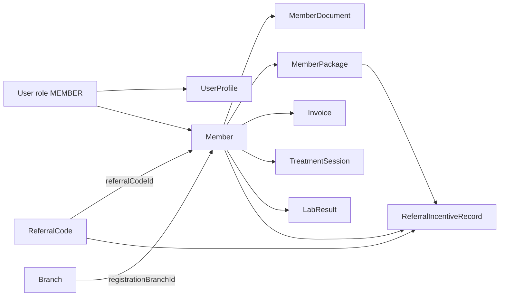
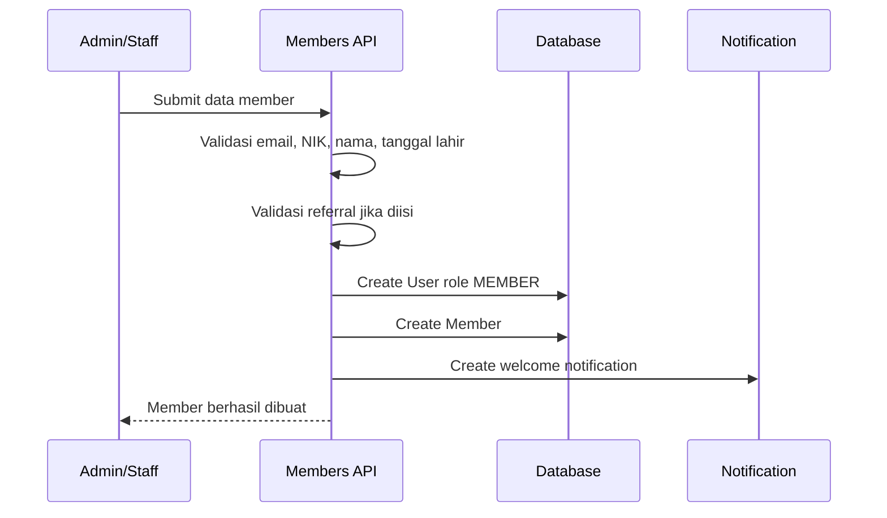
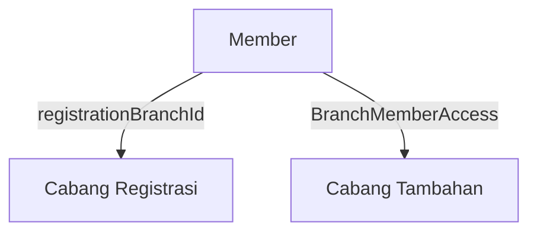
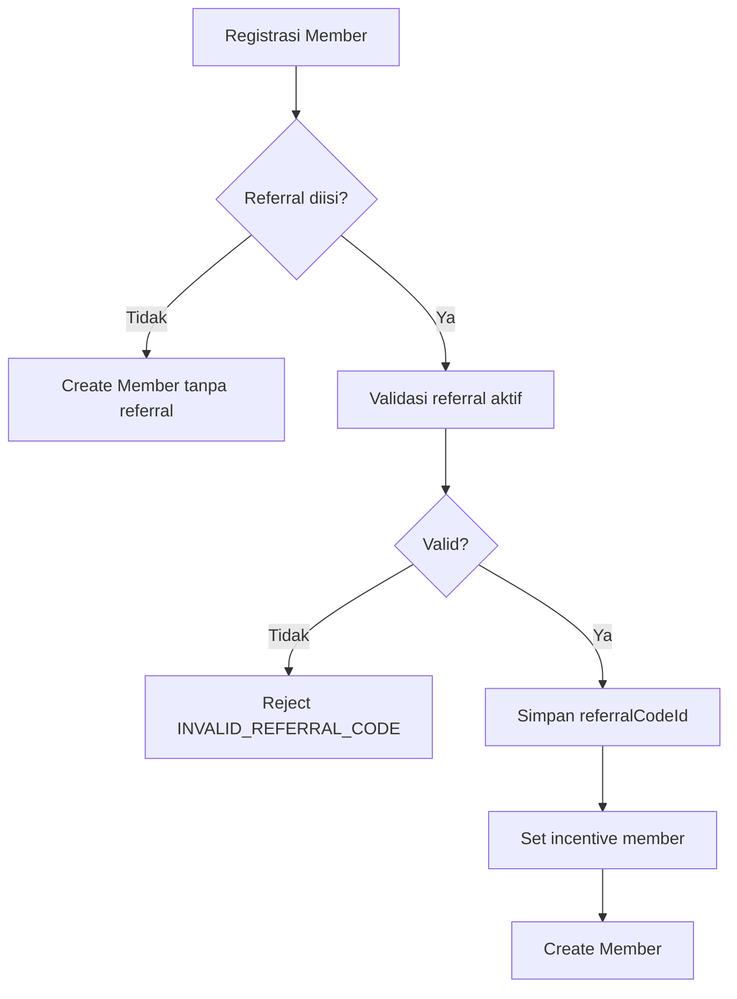
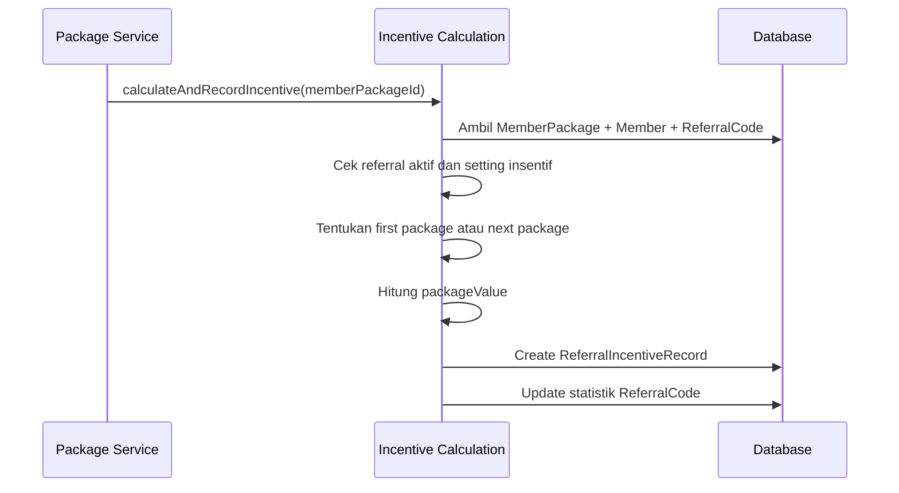

# Member and Referral

Dokumen ini menjelaskan hubungan antara **Member** dan **Referral** pada sistem RAHO. Domain ini mengatur data pasien/member, akun portal member, cabang registrasi, dokumen, akses lintas cabang, kode referral, serta pencatatan insentif referral.

## Ringkasan

**Member** adalah pasien atau klien yang terdaftar di RAHO. Setiap member memiliki akun login sendiri dengan role `MEMBER`, profil personal, nomor member unik, cabang registrasi, dan riwayat bisnis seperti paket, sesi terapi, invoice, dokumen, lab result, dan referral.

**Referral** adalah sistem tracking sumber rekomendasi member. Referral tidak berfungsi sebagai diskon, tetapi sebagai mekanisme pencatatan siapa yang merekomendasikan member dan berapa insentif yang muncul ketika member membeli paket.

## Entitas Utama

| Entitas | Fungsi |
|---|---|
| `User` | Akun login member dengan role `MEMBER`. |
| `UserProfile` | Profil personal seperti nama lengkap, nomor telepon, dan avatar. |
| `Member` | Data pasien/member dan pusat relasi ke paket, sesi, invoice, referral, dan dokumen. |
| `MemberDocument` | Dokumen member seperti consent dan foto profil. |
| `BranchMemberAccess` | Akses member ke cabang lain selain cabang registrasi. |
| `ReferralCode` | Master kode referral/referrer. |
| `ReferralIncentiveRecord` | Catatan immutable hasil kalkulasi insentif referral. |
| `MemberPackage` | Paket yang dibeli member dan menjadi dasar perhitungan insentif. |

## Member

`Member` menyimpan data klinis-administratif member dan menghubungkannya ke akun `User`.

Field penting:

| Field | Penjelasan |
|---|---|
| `userId` | Relasi satu-ke-satu ke akun `User`. |
| `memberNo` | Nomor member unik yang dihasilkan sistem. |
| `registrationBranchId` | Cabang tempat member pertama kali didaftarkan. |
| `referralCodeId` | Kode referral yang digunakan saat registrasi, opsional. |
| `voucherCount` | Jumlah voucher/sesi aktif tersisa. |
| `isConsentToPhoto` | Persetujuan penggunaan foto. |
| `nik` | Nomor identitas, unik jika diisi. |
| `dateOfBirth` | Tanggal lahir, dipakai juga untuk validasi duplikasi. |
| `jenisKelamin` | Jenis kelamin member. |
| `agama` | Agama member. |
| `address` | Alamat member. |
| `pekerjaan` | Pekerjaan member. |
| `statusNikah` | Status pernikahan. |
| `emergencyContact` | Kontak darurat. |
| `sumberInfoRaho` | Sumber informasi member mengenal RAHO. |
| `isDeceased` | Status meninggal. |
| `isActive` | Status aktif member. |

## Relasi Member

Member menjadi pusat banyak relasi operasional:

| Relasi | Makna |
|---|---|
| `user` | Akun login portal member. |
| `registrationBranch` | Cabang asal registrasi member. |
| `referralCode` | Kode referral yang merekomendasikan member. |
| `documents` | Dokumen consent, foto profil, atau file pendukung. |
| `branchAccesses` | Cabang tambahan yang boleh mengakses member. |
| `memberPackages` | Paket terapi yang dibeli member. |
| `memberAddOns` | Add-on yang dibeli member. |
| `nonTherapyPurchases` | Pembelian produk non-terapi. |
| `invoices` | Tagihan dan pembayaran member. |
| `encounters` | Episode/pertemuan terapi. |
| `diagnoses` | Diagnosis langsung member. |
| `therapyPlans` | Rencana terapi member. |
| `therapyPlanSets` | Set rencana terapi. |
| `labResults` | Hasil lab member. |
| `incentiveRecords` | Riwayat insentif referral yang terkait member. |

## Registrasi Member

Registrasi member membuat dua data utama dalam satu alur:

1. `User` dengan role `MEMBER`.
2. `Member` yang terhubung ke user tersebut.

Data wajib umum:

- email atau username member;
- password;
- nama lengkap;
- nomor telepon;
- tanggal lahir;
- jenis kelamin;
- cabang registrasi.

Data opsional:

- NIK;
- tempat lahir;
- agama;
- alamat;
- pekerjaan;
- status nikah;
- kontak darurat;
- sumber informasi RAHO;
- kode referral;
- consent foto.

## Validasi Registrasi

Beberapa aturan validasi penting:

- Email atau username harus unik.
- NIK harus unik jika diisi.
- Kombinasi nama dan tanggal lahir digunakan untuk mencegah duplikasi member.
- Referral boleh kosong.
- Jika referral diisi, referral harus aktif.
- `referralCodeId` lebih diprioritaskan daripada input teks `referralCode`.
- Member baru langsung dibuat sebagai akun `User` dengan role `MEMBER`.
- `registrationBranchId` menjadi cabang asal member.

## Member Document

`MemberDocument` menyimpan file yang berhubungan dengan member.

Field penting:

| Field | Penjelasan |
|---|---|
| `memberId` | Member pemilik dokumen. |
| `documentType` | Jenis dokumen. |
| `fileUrl` | Lokasi file. |
| `fileName` | Nama file asli atau nama file sistem. |
| `fileSize` | Ukuran file. |
| `mimeType` | Tipe file. |
| `uploadedBy` | User yang mengunggah. |

Jenis dokumen yang tersedia:

| Document Type | Makna |
|---|---|
| `PERSETUJUAN_SETELAH_PENJELASAN` | Dokumen consent/persetujuan. |
| `FOTO_PROFIL` | Foto profil member. |

## Branch Access Member

Setiap member memiliki `registrationBranchId`, tetapi member juga dapat dilayani di cabang lain melalui `BranchMemberAccess`.

Aturan penting:

- `registrationBranchId` tidak berubah hanya karena member diberi akses cabang lain.
- Satu kombinasi `memberId` dan `branchId` hanya boleh ada satu kali.
- Staff cabang lain tidak otomatis bisa melihat member tanpa grant akses.
- Access control member dicek oleh middleware branch access.

## Referral

Referral digunakan untuk mencatat sumber rekomendasi member. Saat member didaftarkan dengan referral, field `Member.referralCodeId` akan menunjuk ke `ReferralCode`.

Referral memiliki tiga tipe referrer:

| Referrer Type | Makna |
|---|---|
| `SALES` | Referral berasal dari sales. |
| `DOKTER` | Referral berasal dari dokter. |
| `MEMBER` | Referral berasal dari member lain. |

## Referral Code

`ReferralCode` adalah master data referrer.

Field penting:

| Field | Penjelasan |
|---|---|
| `code` | Kode referral unik. |
| `referrerName` | Nama pemberi referral. |
| `referrerType` | Tipe referrer: `SALES`, `DOKTER`, atau `MEMBER`. |
| `branchId` | Cabang asal atau cabang pengelola referral. |
| `phone` | Nomor telepon referrer. |
| `email` | Email referrer. |
| `totalReferrals` | Jumlah referral yang sudah menghasilkan paket pertama. |
| `totalIncentiveEarned` | Total insentif yang sudah tercatat. |
| `isActive` | Status aktif kode referral. |

`ReferralCode` dapat dinonaktifkan dengan soft delete. Kode yang tidak aktif tidak boleh dipakai untuk registrasi member baru atau kalkulasi insentif baru.

## Referral Saat Registrasi Member

Referral pada registrasi bersifat opsional.

Alurnya:

1. Staff mengisi atau memilih referral saat membuat member.
2. Backend mengecek apakah referral aktif.
3. Jika valid, `Member.referralCodeId` disimpan.
4. Jika nilai insentif tidak diisi, sistem dapat memakai default:
   - paket pertama: `PERCENTAGE` 10;
   - paket berikutnya: `PERCENTAGE` 5.
5. Jika referral tidak diisi, member tetap dapat dibuat tanpa referral.

## Incentive Setting pada Member

Insentif disimpan pada member, bukan pada referral code. Ini membuat nilai insentif bisa fleksibel per member.

Field insentif pada `Member`:

| Field | Penjelasan |
|---|---|
| `firstIncentiveType` | Tipe insentif untuk pembelian paket pertama. |
| `firstIncentiveValue` | Nilai insentif paket pertama. |
| `nextIncentiveType` | Tipe insentif untuk pembelian paket berikutnya. |
| `nextIncentiveValue` | Nilai insentif paket berikutnya. |

Tipe insentif:

| Incentive Type | Rumus |
|---|---|
| `PERCENTAGE` | `packageValue * incentiveValue / 100` |
| `FIXED_AMOUNT` | `incentiveValue` |

Contoh:

- `PERCENTAGE` 10 untuk paket Rp 5.000.000 menghasilkan insentif Rp 500.000.
- `FIXED_AMOUNT` 100000 menghasilkan insentif Rp 100.000.

## Referral Incentive Record

`ReferralIncentiveRecord` adalah catatan hasil kalkulasi insentif. Record ini menyimpan snapshot paket dan nilai kalkulasi saat insentif dibuat.

Field penting:

| Field | Penjelasan |
|---|---|
| `referralCodeId` | Referral yang menerima insentif. |
| `memberId` | Member yang membeli paket. |
| `memberPackageId` | Paket yang memicu insentif. |
| `packageType` | Tipe paket saat transaksi. |
| `packageName` | Nama paket atau bundle. |
| `packageValue` | Nilai paket yang menjadi dasar perhitungan. |
| `isFirstPackage` | Apakah paket ini dihitung sebagai paket pertama. |
| `incentiveType` | `PERCENTAGE` atau `FIXED_AMOUNT`. |
| `incentiveValue` | Nilai persentase atau nominal. |
| `incentiveAmount` | Hasil akhir insentif. |
| `notes` | Catatan otomatis/manual. |

Record ini bersifat audit trail: data paket dan nilai insentif disimpan sebagai snapshot agar laporan historis tidak berubah ketika data master berubah.

## Kapan Insentif Dihitung

Insentif dihitung saat member membeli atau mengaktifkan paket melalui alur package assignment/payment verification.

Sistem hanya membuat insentif jika:

1. member memiliki `referralCodeId`;
2. referral code masih aktif;
3. member memiliki setting insentif;
4. belum ada insentif untuk purchase group yang sama;
5. paket memiliki nilai final yang bisa dihitung.

## First Package vs Next Package

Sistem membedakan pembelian pertama dan pembelian berikutnya.

- Jika pembelian adalah paket pertama, sistem memakai `firstIncentiveType` dan `firstIncentiveValue`.
- Jika bukan paket pertama, sistem memakai `nextIncentiveType` dan `nextIncentiveValue`.
- Untuk paket bundling, sistem menghitung total nilai paket dalam satu `purchaseGroupId`.
- Jika insentif untuk bundle yang sama sudah ada, sistem tidak membuat duplikasi.

## Statistik Referral

Setelah insentif dibuat, `ReferralCode` diperbarui:

| Statistik | Kapan Bertambah |
|---|---|
| `totalReferrals` | Bertambah saat paket pertama atau bundle pertama menghasilkan insentif. |
| `totalIncentiveEarned` | Bertambah sebesar `incentiveAmount` setiap record insentif dibuat. |

Catatan: `totalReferrals` tidak selalu sama dengan jumlah member yang mengisi referral saat registrasi. Nilai ini merepresentasikan referral yang sudah menghasilkan transaksi paket pertama.

## Endpoint Referral

Endpoint referral berada di `/api/v1/referrals`.

| Method | Endpoint | Fungsi |
|---|---|---|
| `GET` | `/referrals` | List referral. |
| `GET` | `/referrals/active` | List referral aktif untuk dropdown. |
| `POST` | `/referrals` | Membuat referral. |
| `GET` | `/referrals/:referralId` | Detail referral. |
| `GET` | `/referrals/:referralId/incentives` | List insentif referral. |
| `PATCH` | `/referrals/:referralId` | Update referral. |
| `DELETE` | `/referrals/:referralId` | Soft delete/nonaktifkan referral. |
| `GET` | `/referrals/export/excel` | Export insentif ke Excel. |
| `GET` | `/referrals/export/pdf` | Export insentif ke PDF. |
| `GET` | `/referrals/export/summary` | Export ringkasan referral. |

Role yang dapat mengelola referral:

- `ADMIN_LAYANAN`
- `ADMIN_CABANG`
- `ADMIN_MANAGER`
- `SUPER_ADMIN`

Role staff seperti `DOCTOR` dan `NURSE` dapat mengakses daftar referral aktif untuk kebutuhan dropdown, tetapi bukan untuk CRUD referral.

## Dampak ke Modul Bisnis

| Modul | Dampak Member dan Referral |
|---|---|
| Member Management | Registrasi, update profil, dokumen, status aktif, dan akses cabang. |
| Package | Pembelian paket menjadi trigger kalkulasi insentif referral. |
| Invoice | Pembayaran paket berhubungan dengan aktivasi paket dan insentif. |
| Session | `voucherCount` dan paket aktif menjadi dasar sesi terapi. |
| Branch | Member punya cabang registrasi dan bisa diberi akses cabang tambahan. |
| Report | Referral menyediakan statistik jumlah referral dan total insentif. |
| Audit Log | Perubahan member, dokumen, branch access, dan referral perlu terlacak. |

## Contoh Skenario

### Member Baru Tanpa Referral

1. Staff membuat member baru.
2. Referral tidak diisi.
3. Sistem membuat `User` dan `Member`.
4. `referralCodeId` bernilai `null`.
5. Saat member membeli paket, tidak ada insentif referral yang dibuat.

### Member Baru Dengan Referral Sales

1. Admin membuat `ReferralCode` untuk sales.
2. Staff memilih referral tersebut saat registrasi member.
3. Sistem menyimpan `Member.referralCodeId`.
4. Member membeli paket pertama senilai Rp 5.000.000.
5. Dengan `firstIncentiveType = PERCENTAGE` dan `firstIncentiveValue = 10`, sistem membuat insentif Rp 500.000.
6. `totalReferrals` bertambah 1 dan `totalIncentiveEarned` bertambah Rp 500.000.

### Member Membeli Paket Berikutnya

1. Member yang sama membeli paket kedua senilai Rp 3.000.000.
2. Sistem memakai `nextIncentiveType` dan `nextIncentiveValue`.
3. Jika `nextIncentiveValue = 5`, insentif menjadi Rp 150.000.
4. `totalIncentiveEarned` bertambah, tetapi `totalReferrals` tidak bertambah lagi.

### Paket Bundling

1. Member membeli beberapa paket dalam satu `purchaseGroupId`.
2. Sistem menjumlahkan `finalPrice` semua paket dalam bundle.
3. Insentif dibuat satu kali untuk bundle tersebut.
4. Jika proses mencoba membuat record kedua untuk bundle yang sama, sistem melewatinya agar tidak terjadi duplikasi.

## Prinsip Desain

- **Member memiliki akun sendiri**: setiap member terhubung ke `User` role `MEMBER`.
- **Referral opsional**: member tetap valid tanpa referral.
- **Referral harus aktif**: referral nonaktif tidak boleh dipakai untuk registrasi atau insentif baru.
- **Insentif fleksibel per member**: nilai insentif disimpan di `Member`, bukan di `ReferralCode`.
- **Record insentif adalah snapshot**: histori insentif tetap stabil walau data paket berubah.
- **Branch tetap menjadi boundary**: member punya cabang registrasi dan akses lintas cabang harus eksplisit.
- **Statistik referral berbasis transaksi**: referral dianggap menghasilkan ketika ada paket yang memicu insentif.

## Kesimpulan

Domain Member dan Referral menghubungkan proses onboarding pasien dengan tracking sumber rekomendasi dan insentif. `Member` menjadi pusat data pasien dan riwayat operasional, sedangkan `ReferralCode` dan `ReferralIncentiveRecord` mencatat siapa yang merekomendasikan member serta nilai insentif yang muncul dari transaksi paket.

Model ini membuat RAHO dapat mengelola member lintas cabang, menjaga data referral tetap valid, dan menghasilkan laporan insentif yang dapat diaudit.

## Referensi Implementasi

- `apps/api/prisma/schema.prisma`
- `apps/api/src/modules/members/services/member-registration.service.ts`
- `apps/api/src/modules/members/services/member-retrieval.service.ts`
- `apps/api/src/modules/referrals/referrals.routes.ts`
- `apps/api/src/modules/referrals/referrals.schema.ts`
- `apps/api/src/modules/referrals/incentive-calculation.service.ts`
- `apps/api/src/modules/referrals/referral-export.service.ts`
- `docs/BUSINESS-FLOW.md`
- `docs/USER-STORIES.md`
