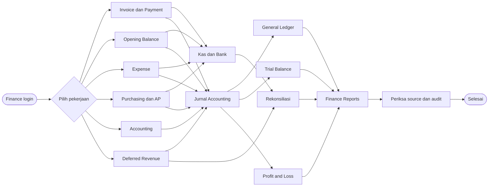
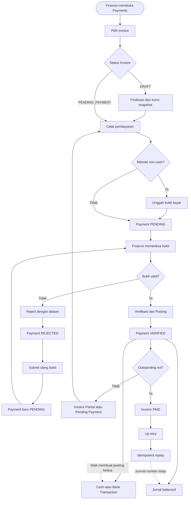
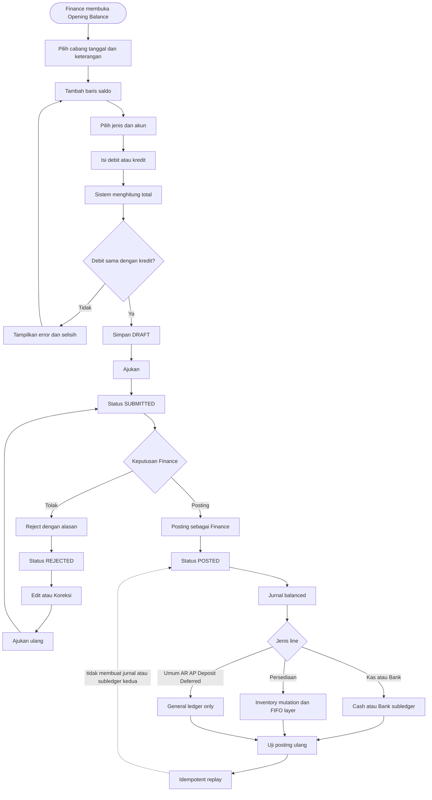
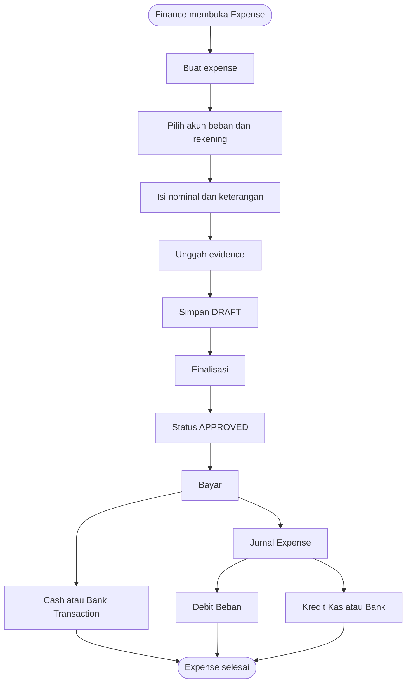
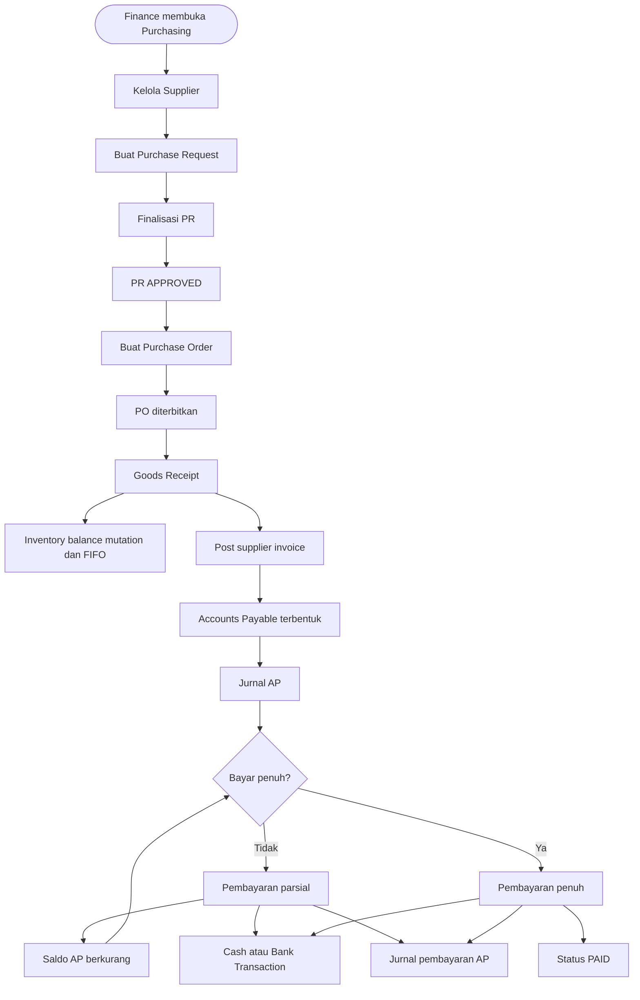
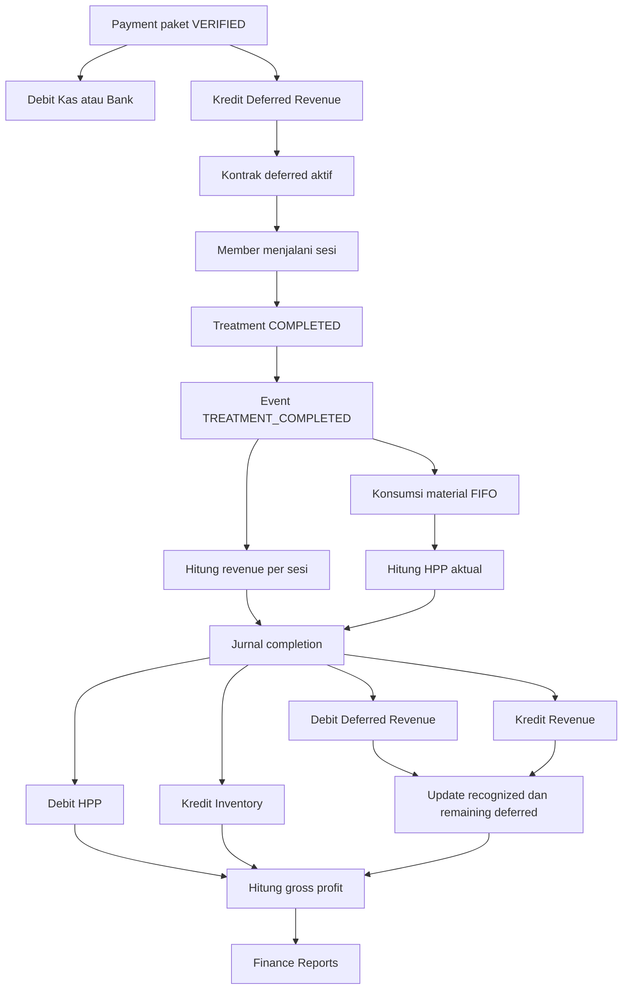
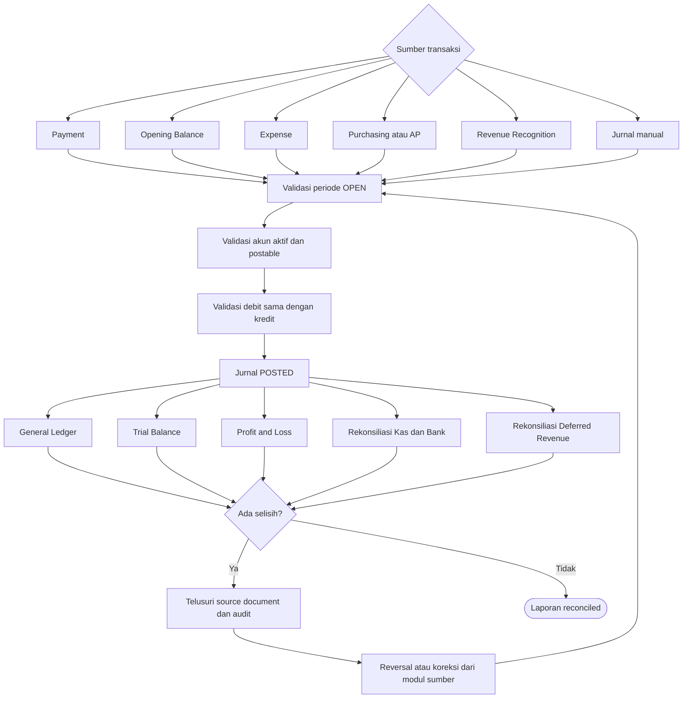

# Panduan Fitur Finance dan Alur Kerja

## 1. Tujuan dokumen

Dokumen ini menjelaskan fungsi setiap menu Finance di RAHO, alur status
dokumen, hasil posting, serta hubungan antarmodul. Panduan ditujukan untuk staf
Finance operasional dan tidak membutuhkan pengetahuan teknis.

## 2. Akun dan kebijakan Autonomous Finance

Contoh akun Finance UAT:

- Email: `finance@raho.id`
- Password: `Finance@123`
- Role template: `FINANCE` atau `FINANCE_DUMMY`

RAHO menerapkan **Autonomous Finance**. Pengguna dengan role template Finance
aktif dapat membuat, memeriksa, menolak, memfinalisasi, dan mem-posting dokumen
finance miliknya sendiri selama memiliki permission dan akses cabang yang
sesuai.

Kontrol yang tetap berlaku:

- permission diperiksa untuk setiap tindakan;
- pengguna hanya dapat bekerja dalam scope cabangnya;
- periode transaksi harus `OPEN`;
- debit dan kredit harus seimbang;
- akun harus aktif dan diizinkan untuk posting;
- bukti pembayaran atau expense tetap dilindungi;
- retry tidak boleh membuat jurnal atau transaksi kas/bank duplikat;
- tindakan penting dicatat dalam audit log;
- dokumen yang sudah `POSTED` tidak dapat diedit atau dihapus langsung;
- koreksi dokumen posted dilakukan melalui reversal atau transaksi koreksi.

Pengguna non-Finance tetap mengikuti maker-checker apabila modul terkait
mensyaratkannya.

## 3. Peta menu Finance

| Fitur | Halaman | Fungsi utama |
|---|---|---|
| Invoice & Payment | `/payments` | Finalisasi invoice, catat pembayaran, verifikasi/reject, dan bukti bayar |
| Accounting | `/accounting` | Chart of accounts, periode, jurnal manual, dan traceability jurnal |
| Kas & Bank | `/cash-bank` | Master rekening dan ledger penerimaan/pengeluaran |
| Opening Balance | `/opening-balances` | Memasukkan saldo awal saat cutover/go-live |
| Expense | `/expenses` | Mencatat, memfinalisasi, dan membayar beban |
| Purchasing & AP | `/purchasing` | Supplier, PR, PO, penerimaan, invoice supplier, dan pembayaran utang |
| Deferred Revenue | `/revenue-recognition` | Kontrak pendapatan diterima di muka dan pengakuan per sesi |
| Finance Reports | `/finance-reports` | P&L, Trial Balance, General Ledger, Kas/Bank, dan rekonsiliasi |
| Approval Inbox | `/approvals` | Melihat approval lintas modul yang masih menggunakan workflow approval |

---

## 4. Invoice dan Payment

### Tujuan

Fitur ini digunakan untuk melihat invoice member, mencatat pembayaran parsial
atau penuh, memeriksa bukti pembayaran, serta membentuk kas/bank dan jurnal.

### Status invoice

```text
DRAFT
  → PENDING_PAYMENT
  → PAID
```

Invoice dapat tetap `PENDING_PAYMENT` ketika baru dibayar sebagian.

### Status payment

```text
PENDING
  ├─→ VERIFIED
  └─→ REJECTED
```

### Flow finalisasi invoice

```text
Invoice DRAFT
  → Finance membuka /payments
  → Finalisasi
  → item, harga, diskon, dan total menjadi snapshot
  → status PENDING_PAYMENT
```

Invoice finalized tidak boleh diubah langsung.

### Flow pembayaran

```text
Pilih invoice
  → Bayar
  → pilih metode dan akun kas/bank
  → isi nominal
  → unggah bukti jika non-cash
  → payment PENDING
  → Finance buka bukti
  → Verifikasi & Posting
  → payment VERIFIED
  → cash/bank transaction terbentuk
  → journal terbentuk
  → outstanding diperbarui
```

Pembayaran parsial:

```text
Invoice 1.000
  → payment verified 600
  → outstanding 400
  → status invoice masih PENDING_PAYMENT/Partial
```

Pembayaran penuh:

```text
Outstanding 400
  → payment verified 400
  → outstanding 0
  → status invoice PAID
```

### Flow reject dan submit ulang

```text
Payment PENDING
  → Finance Tolak
  → alasan wajib
  → status REJECTED
  → tidak ada jurnal
  → tidak ada cash/bank transaction
  → Submit ulang bukti
  → Payment ID baru berstatus PENDING
  → histori payment lama tetap ada
```

### Posting akuntansi pembayaran

Secara umum:

```text
Debit  Kas/Bank
Kredit Akun penyelesaian invoice
```

Default akun penyelesaian paket adalah pendapatan diterima di muka. Penerimaan
uang tidak otomatis dianggap sebagai omzet.

### Evidence yang perlu diperiksa

- invoice number;
- payment ID;
- status dan alasan rejection;
- protected payment proof;
- cash transaction ID dan number;
- journal number;
- outstanding;
- hasil idempotent retry.

---

## 5. Accounting

### Tujuan

Accounting adalah fondasi ledger Finance. Semua laporan mengambil angka dari
jurnal berstatus `POSTED`.

### 5.1 Chart of Accounts

Digunakan untuk:

- melihat kode dan nama akun;
- membedakan tipe `ASSET`, `LIABILITY`, `EQUITY`, `REVENUE`, dan `EXPENSE`;
- menentukan normal balance;
- mengaktifkan/nonaktifkan akun;
- menentukan akun header atau akun yang boleh posting.

Akun hanya dapat digunakan dalam jurnal apabila:

```text
isActive = true
allowPosting = true
```

### 5.2 Periode akuntansi

Status periode:

```text
OPEN → CLOSED → LOCKED
```

- `OPEN`: transaksi dapat diposting.
- `CLOSED`: posting ditolak, tetapi periode dapat dibuka kembali oleh pengguna
  berwenang.
- `LOCKED`: periode dikunci untuk kontrol akhir.

### 5.3 Jurnal manual

Flow:

```text
Pilih tanggal dan cabang
  → pilih akun debit
  → pilih akun kredit
  → isi nominal
  → Post journal
  → validasi periode dan account
  → validasi total debit = kredit
  → journal POSTED
```

Jurnal manual memperoleh nomor dan source `MANUAL_JOURNAL` otomatis.

### 5.4 Reversal

Jurnal posted tidak diedit. Koreksi dilakukan dengan:

```text
Jurnal POSTED
  → Koreksi / Reversal
  → isi alasan
  → jurnal reversal baru
  → original tetap tersimpan
```

---

## 6. Kas & Bank

### Tujuan

Kas & Bank menyimpan master rekening dan ledger transaksi yang dapat ditelusuri
ke source document dan jurnal.

### Master rekening

Data utama:

- kode dan nama rekening;
- tipe `CASH` atau `BANK`;
- cabang;
- akun COA;
- nama bank dan nomor rekening;
- kebutuhan referensi transaksi.

### Ledger kas/bank

Transaksi dapat berasal dari:

- pembayaran invoice member;
- pembayaran expense;
- pembayaran supplier/AP;
- opening balance;
- transaksi finance lain yang menggunakan posting kas/bank.

Traceability:

```text
Source document
  → cash transaction ID/number
  → rekening kas/bank
  → journal number
```

Ledger Kas & Bank bukan tempat mengedit transaksi sumber. Koreksi dilakukan pada
modul asal atau melalui reversal.

---

## 7. Opening Balance

### Tujuan

Opening Balance digunakan saat migrasi/cutover untuk memasukkan saldo awal:

- kas dan bank;
- persediaan;
- piutang;
- utang;
- deposit;
- pendapatan diterima di muka;
- saldo akun umum lainnya.

### Flow status

```text
DRAFT
  → SUBMITTED
  ├─→ REJECTED → Edit/Koreksi → SUBMITTED
  └─→ POSTED
```

### Flow operasional

```text
Buat opening
  → pilih cabang dan tanggal
  → tambah baris saldo
  → pilih jenis dan akun
  → isi debit atau kredit
  → sistem menghitung total real-time
  → simpan DRAFT
  → Ajukan
  → Finance Tolak atau Posting
```

Jika ditolak:

```text
REJECTED
  → alasan tetap terlihat
  → Edit/Koreksi
  → Ajukan ulang
  → Posting sebagai Finance
```

### Jenis line

- **Umum**: saldo akun biasa.
- **Kas/Bank**: memilih rekening; COA terhubung otomatis.
- **Persediaan**: memilih item, lokasi, quantity, unit cost, dan batch.
- **Piutang/Utang/Deposit/Deferred Revenue**: dapat menyimpan referensi
  pihak/dokumen.

### Hasil posting

```text
Opening POSTED
  → satu journal balanced
  → line kas/bank membuat cash subledger
  → line inventory membuat balance, mutation, batch, dan FIFO cost layer
  → source link OPENING_BALANCE
```

Retry posting mengembalikan hasil lama dan tidak membuat jurnal/subledger kedua.

---

## 8. Expense

### Tujuan

Expense digunakan untuk mencatat pengeluaran operasional dengan evidence,
rekening pembayaran, dan jurnal otomatis.

### Data utama

- cabang dan tanggal;
- kategori;
- akun beban;
- rekening kas/bank;
- nominal;
- keterangan;
- file evidence.

### Flow Autonomous Finance

```text
Buat expense
  → DRAFT
  → Finalisasi
  → APPROVED
  → Bayar
  → PAID/POSTED
  → cash/bank transaction
  → journal
```

Pada role non-Finance, tahap finalisasi dapat tampil sebagai
`Ajukan → Setujui/Tolak`.

### Posting umum

```text
Debit  Beban
Kredit Kas/Bank
```

Evidence hanya dibuka melalui akses terautentikasi.

---

## 9. Purchasing dan Accounts Payable

### Tujuan

Modul ini mengelola pembelian dari kebutuhan sampai pembayaran supplier.

### Flow utama

```text
Supplier
  → Purchase Request
  → Purchase Order
  → Goods Receipt
  → Supplier Invoice / AP
  → Pembayaran AP
```

### 9.1 Supplier

Menyimpan kode, nama, termin pembayaran, dan status supplier.

### 9.2 Purchase Request

```text
Buat PR
  → DRAFT
  → Finalisasi PR oleh Finance
  → APPROVED
```

PR berisi item, quantity, estimasi unit cost, cabang, dan kebutuhan tanggal.

### 9.3 Purchase Order

```text
PR APPROVED
  → pilih supplier
  → Buat PO Otomatis
  → PO diterbitkan
```

### 9.4 Goods Receipt

Penerimaan barang dilakukan berdasarkan PO dan membentuk inventory ledger/FIFO
serta kewajiban penerimaan sesuai konfigurasi purchasing.

### 9.5 Supplier Invoice dan AP

```text
PO PARTIALLY_RECEIVED/RECEIVED
  → Post invoice supplier
  → AP terbentuk
  → journal number tersedia
  → balance AP dapat dibayar parsial/penuh
```

### 9.6 Pembayaran AP

```text
Pilih supplier invoice
  → Bayar
  → pilih rekening kas/bank
  → isi nominal dan referensi
  → AP berkurang
  → cash/bank transaction
  → journal pembayaran
  → status PAID jika saldo nol
```

---

## 10. Deferred Revenue

### Tujuan

Pembayaran paket tidak langsung menjadi revenue. Dana disimpan sebagai
liabilitas dan diakui ketika sesi treatment selesai.

### Flow

```text
Payment paket VERIFIED
  → deferred revenue funded
  → kontrak revenue aktif
  → sesi treatment selesai
  → event TREATMENT_COMPLETED
  → revenue per sesi diakui
  → deferred revenue berkurang
  → journal revenue/HPP
```

### Tab

- **Kontrak**: consideration, funded deferred, recognized, sisa, dan nilai per
  sesi.
- **Event**: event completion dan status recognition.
- **Gross Profit**: recognized revenue, HPP aktual, gross profit, dan margin.
- **Policy**: pemetaan akun deferred revenue dan revenue per package pricing.

### Prinsip

- uang diterima belum tentu omzet;
- revenue mengikuti layanan yang sudah diberikan;
- sesi terakhir dapat menyerap sisa pembulatan;
- completion menyimpan trace ke journal dan material posting.

---

## 11. Finance Reports

### Tujuan

Menyediakan laporan dan rekonsiliasi dari satu sumber utama: posted journal
lines.

### Filter

- cabang;
- tanggal mulai;
- tanggal akhir;
- account code untuk General Ledger.

### Jenis laporan

#### Profit & Loss

Menampilkan pendapatan, beban, dan laba/rugi pada periode terpilih.

#### Trial Balance

Memastikan total debit dan kredit seluruh akun seimbang.

#### General Ledger

Menampilkan mutasi per akun, source document, dan running balance.

#### Kas & Bank

Membandingkan saldo ledger akun COA dengan cash/bank subledger.

```text
Saldo ledger = Saldo subledger → Cocok
Saldo ledger ≠ Saldo subledger → Selisih
```

#### Deferred Revenue

Membandingkan saldo akun deferred dengan movement/contract subledger.

### Rekonsiliasi

Klik **Rekonsiliasi** untuk menghitung ulang laporan dan status kecocokan.
Selisih harus ditelusuri melalui source document dan journal, bukan diperbaiki
langsung pada laporan.

---

## 12. Approval Inbox

Approval Inbox menampilkan workflow yang masih membutuhkan approval lintas
modul. Untuk dokumen Finance yang sudah memakai Autonomous Finance, Finance
dapat memfinalisasi sendiri dan tidak perlu berpindah ke akun Super Admin.

Approval Inbox tetap relevan untuk:

- role non-Finance;
- workflow multi-step;
- modul operasional/logistik;
- keputusan yang secara kebijakan tetap membutuhkan checker berbeda.

---

## 13. Hubungan antarmodul

```text
Invoice/Payment ──────┐
Expense ──────────────┤
Purchasing/AP ────────┤
Opening Balance ──────┼─→ Kas & Bank
                      └─→ Accounting Journal
                              │
                              ├─→ General Ledger
                              ├─→ Trial Balance
                              ├─→ P&L
                              └─→ Finance Reports

Payment Paket
  → Deferred Revenue
  → Treatment Completed
  → Revenue Recognition + HPP
  → Finance Reports
```

## 14. Matriks hasil posting

| Source | Cash/Bank | Journal | Inventory/FIFO | Deferred Revenue |
|---|---:|---:|---:|---:|
| Payment verified | Ya | Ya | Tidak | Ya untuk paket |
| Payment rejected | Tidak | Tidak | Tidak | Tidak |
| Expense paid | Ya | Ya | Tidak | Tidak |
| AP paid | Ya | Ya | Tidak | Tidak |
| Opening umum | Sesuai line | Ya | Tidak | Sesuai line |
| Opening kas/bank | Ya | Ya | Tidak | Tidak |
| Opening inventory | Tidak | Ya | Ya | Tidak |
| Goods receipt | Tidak langsung | Ya sesuai policy | Ya | Tidak |
| Treatment completed | Tidak | Ya | Konsumsi FIFO | Recognition |

## 15. Checklist harian Finance

1. Pastikan periode transaksi `OPEN`.
2. Periksa payment pending dan bukti bayar.
3. Verifikasi atau reject dengan alasan yang jelas.
4. Periksa expense yang belum dibayar.
5. Pantau invoice supplier dan jatuh tempo AP.
6. Periksa transaksi Kas & Bank dan source-nya.
7. Jalankan Trial Balance.
8. Jalankan rekonsiliasi Kas & Bank dan Deferred Revenue.
9. Telusuri setiap status `Selisih`.
10. Pastikan koreksi dilakukan melalui reversal atau dokumen sumber.

## 16. Checklist evidence UAT

Untuk setiap transaksi Finance, simpan sesuai kebutuhan:

- document number;
- status sebelum dan sesudah;
- maker/reviewer ID;
- alasan rejection;
- payment atau transaction ID;
- journal number;
- source link;
- total debit dan kredit;
- cash/bank reference;
- inventory posting/cost layer reference;
- response retry/idempotent replay;
- audit history.

---

## 17. Diagram Mermaid User Flow

### 17.1 User flow Finance secara keseluruhan



### 17.2 Invoice dan payment



### 17.3 Opening Balance Autonomous Finance



### 17.4 Expense Autonomous Finance



### 17.5 Purchasing dan Accounts Payable



### 17.6 Deferred Revenue dan treatment completion



### 17.7 Accounting dan reporting



## 18. Rencana integrasi Zoho

Rancangan integrasi Finance, Logistik, sesi terapi, dan pemakaian barang ke
Zoho Books serta Zoho Inventory dijelaskan pada
[Blueprint Integrasi RAHO dengan Zoho Finance](./BLUEPRINT_INTEGRASI_ZOHO_FINANCE.md).

Blueprint tersebut harus disetujui sebelum implementasi karena menetapkan:

- sumber utama setiap jenis data;
- batas data klinis yang tidak boleh dikirim ke Zoho;
- mapping fitur RAHO ke API Zoho;
- transactional outbox, retry, dan duplicate protection;
- flow sesi terapi sampai inventory dan jurnal;
- rancangan UI monitoring, mapping, dan rekonsiliasi;
- tahapan implementasi dan acceptance criteria.
