# Panduan Singkat Flow RAHO dan Zoho Books

Dokumen ini menjelaskan integrasi dengan bahasa sederhana.

## 1. Gambaran paling sederhana

Kita mempunyai dua aplikasi:

```text
RAHO = tempat kerja operasional
Zoho = tempat catatan stok, tagihan, uang muka, dan omzet
```

RAHO dipakai petugas untuk:

- membuat dan mengelola member;
- menjalankan infus;
- mengelola paket dan add-on;
- meminta serta mengirim barang;
- mencatat stok, batch, dan expiry;
- membuat invoice dan memverifikasi pembayaran.

Zoho Books dipakai Finance untuk:

- daftar item;
- jumlah dan nilai persediaan;
- daftar pelanggan;
- faktur uang muka;
- invoice penjualan;
- pembayaran;
- omzet dan laporan keuangan.

## 2. Mana yang sudah ada dan belum ada?

### Sudah ada di RAHO

- Master produk.
- Persediaan dan lokasi stok.
- Mutasi stok dan FIFO.
- Member dengan nama dan tanggal lahir.
- Paket member.
- Add-on member.
- Invoice member.
- Pembayaran dan verifikasi pembayaran.
- Termin/cicilan invoice.
- Sesi dan pelaksanaan infus.
- Pemakaian bahan infus.
- Stock request partnership.
- Shipment/pengiriman barang.
- Invoice stock request partnership.

### Belum ada

- Tombol Hubungkan Zoho.
- OAuth/token Zoho.
- Penarikan data existing Zoho.
- Mapping item Zoho dengan produk RAHO.
- Mapping customer Zoho dengan member RAHO.
- Worker sinkronisasi.
- Faktur uang muka Zoho otomatis.
- Invoice satuan Zoho otomatis.
- Rekonsiliasi otomatis RAHO dengan Zoho.

Jadi dokumen ini adalah gambar tentang fitur integrasi yang harus dibuat di
atas fitur RAHO yang sudah ada.

## 3. Flow besar

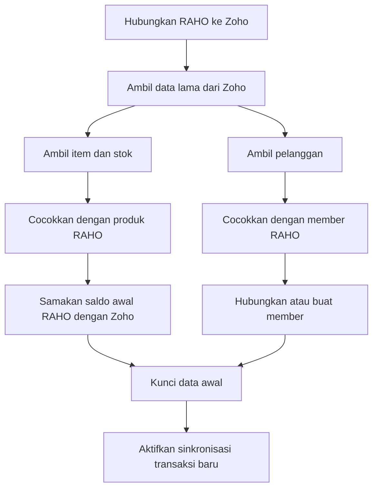

Bahasa sederhananya:

1. RAHO melihat isi Zoho.
2. RAHO mencari pasangan datanya.
3. Data yang cocok disambungkan.
4. Data yang belum ada dibuat.
5. Data yang membingungkan diperiksa manusia.
6. Setelah data awal rapi, transaksi baru mulai disinkronkan.

---

## 4. Flow item dan stok yang sudah ada di Zoho

Contoh:

```text
Zoho:
SKU INF-001
Nama Infus Set
Stok 70

RAHO lama:
SKU INF-001
Stok 100
```

Karena Zoho dijadikan saldo awal:

```text
Saldo pembukaan RAHO = 70
Zoho tetap           = 70
Selisih lama         = 30
```

Zoho tidak ditambah 30 atau 100. Selisih 30 hanya masuk laporan pemeriksaan.

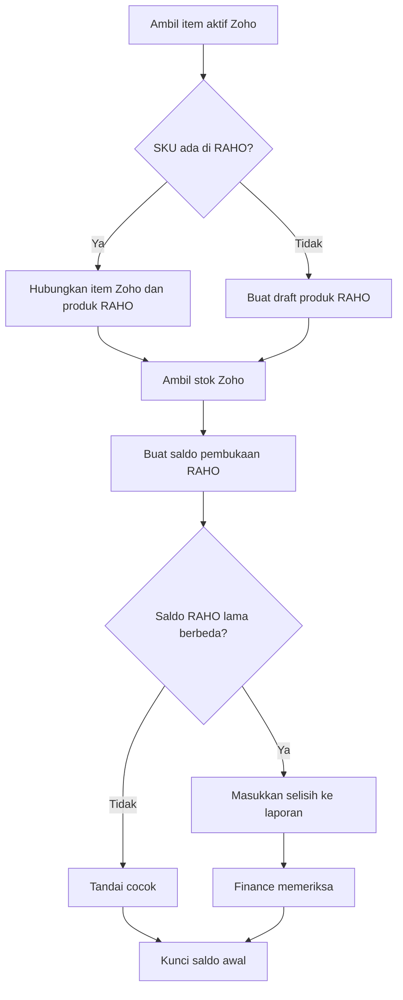

### Aturan mudah

- SKU sama: boleh disambungkan.
- Nama sama tetapi SKU berbeda: jangan langsung disambungkan.
- Satuan berbeda: periksa manusia.
- Dua produk mempunyai SKU sama: jangan lanjut.
- Item Zoho tidak ada di RAHO: buat draft produk RAHO.
- Item RAHO tidak ada di Zoho: buat di Zoho setelah saldo awal selesai.

---

## 5. Flow perubahan persediaan setelah saldo awal

Setelah saldo awal dikunci, RAHO menjadi sumber kegiatan baru.

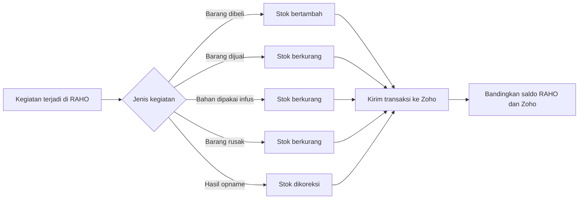

Aturan paling penting:

> Satu kegiatan hanya boleh mengubah stok Zoho satu kali.

Contoh salah:

```text
Bill menambah stok 10
+ Adjustment menambah stok 10
= Zoho bertambah 20
```

Contoh benar:

```text
Satu penerimaan 10
→ pilih satu transaksi Zoho yang menambah stok 10
```

---

## 6. Flow pelanggan Zoho menjadi member RAHO

Aturan utama:

```text
Nama sama
DAN
Tanggal lahir sama
DAN
Hanya ditemukan satu orang
= member yang sama
```

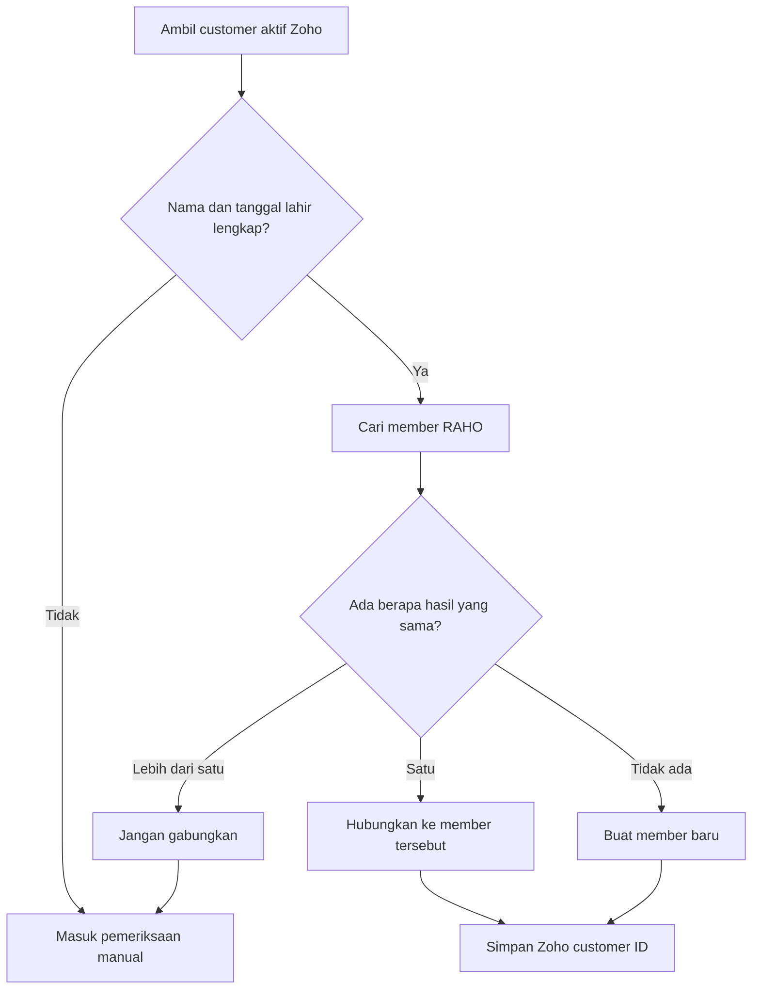

### Contoh cocok

```text
Zoho:
Nama          Siti Aminah
Tanggal lahir 1990-01-15

RAHO:
Nama          SITI AMINAH
Tanggal lahir 1990-01-15

Hasil:
Hubungkan ke member RAHO yang sudah ada.
```

Huruf besar/kecil dan spasi boleh dinormalisasi.

### Contoh tidak cocok

```text
Zoho:
Nama          Siti Aminah
Tanggal lahir 1990-01-15

RAHO:
Nama          Siti Aminah
Tanggal lahir 1991-01-15

Hasil:
Jangan hubungkan otomatis.
```

### Contoh member baru

```text
Nama dan tanggal lahir tersedia di Zoho
Tidak ada pasangan di RAHO
→ buat member baru di RAHO
→ simpan hubungan dengan Zoho customer
```

---

## 7. Apa itu faktur uang muka?

Contoh:

```text
Member membeli paket 7 infus = Rp12.000.000
Member membayar sekarang
Infus belum dilakukan
```

Uang sudah diterima, tetapi layanan belum diberikan.

Jadi:

```text
Rp12.000.000 = uang muka
Rp0          = omzet yang sudah terjadi
```

Di Zoho, uang tersebut masuk **Retainer Invoice**, bukan langsung Invoice omzet.

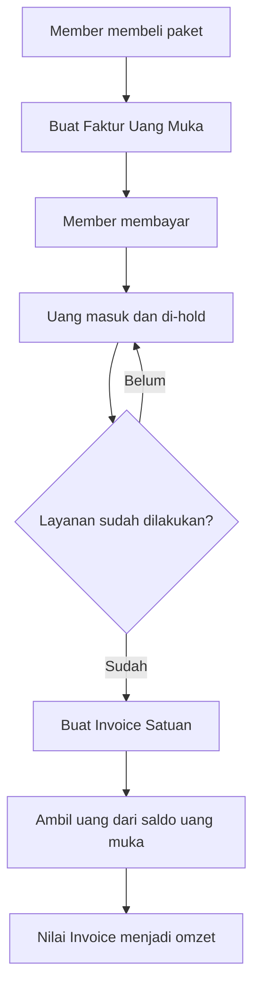

### Catatan akuntansi sederhana

Saat uang diterima:

```text
Kas bertambah
Uang muka pelanggan bertambah
Omzet belum bertambah
```

Saat infus/barang/add-on sudah diberikan:

```text
Invoice dibuat
Uang muka berkurang
Omzet bertambah
```

---

## 8. Flow pembayaran termin

Contoh paket Rp12.000.000:

```text
Termin 1 = Rp6.000.000
Termin 2 = Rp3.000.000
Termin 3 = Rp3.000.000
```

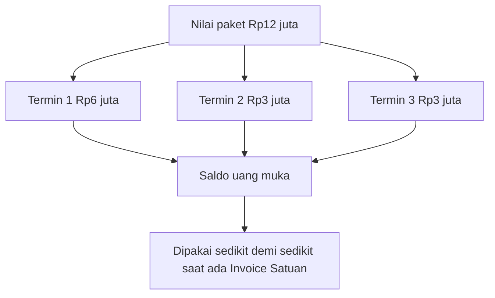

Termin yang dibayar belum menjadi omzet. Semuanya tetap di-hold sampai ada
infus, penyerahan barang, atau add-on yang benar-benar diberikan.

Jika Invoice satuan lebih besar daripada saldo uang muka:

```text
Invoice              Rp2.000.000
Uang muka tersedia   Rp1.500.000
Dipakai dari muka    Rp1.500.000
Sisa tagihan           Rp500.000
```

Jika uang muka lebih besar:

```text
Uang muka tersedia   Rp3.000.000
Invoice              Rp2.000.000
Dipakai              Rp2.000.000
Sisa uang muka       Rp1.000.000
```

---

## 9. Flow invoice satuan untuk infus

Misalnya paket 6 kali infus bernilai Rp12.000.000:

```text
Nilai satu infus = Rp2.000.000
```

Saat pembayaran paket:

```text
Uang muka  = Rp12.000.000
Omzet      = Rp0
```

Setelah infus pertama selesai:

```text
Invoice satuan   = Rp2.000.000
Uang muka tersisa= Rp10.000.000
Omzet            = Rp2.000.000
```

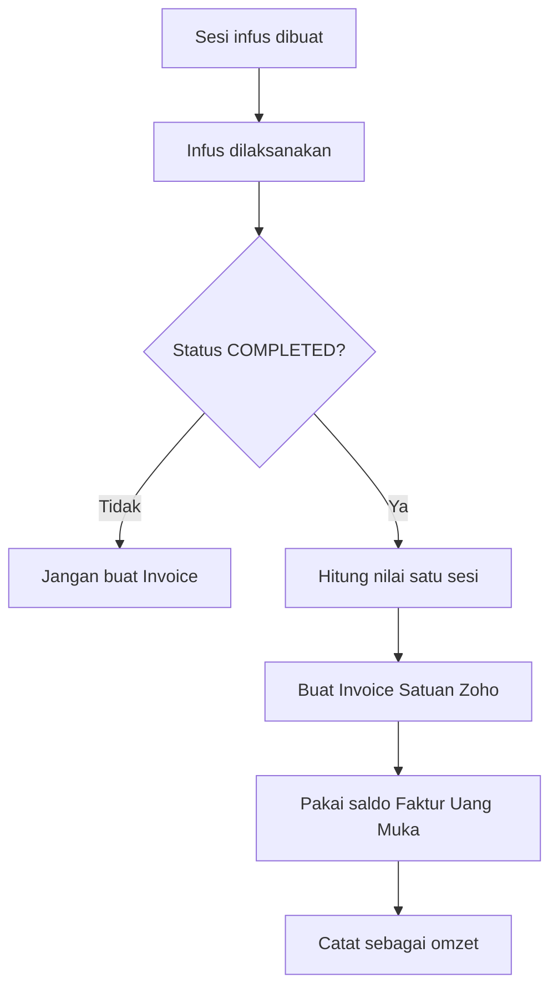

Invoice tidak dibuat saat jadwal dibuat. Invoice dibuat setelah sesi benar-benar
selesai.

---

## 10. Flow partnership

Contoh:

```text
Partnership meminta 10 barang
RAHO mengirim 8 barang
```

Invoice hanya dibuat untuk jumlah yang benar-benar memenuhi titik pengakuan.

Rekomendasi:

```text
Omzet diakui saat barang diterima partnership.
```

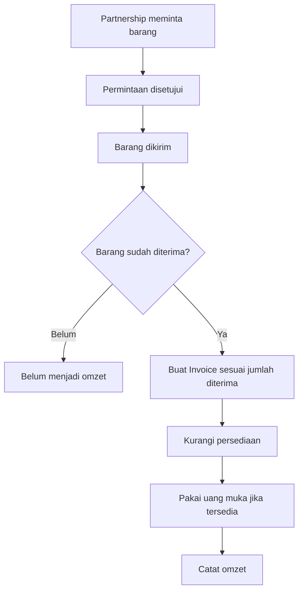

Jika dikirim 8 dari 10:

```text
Invoice pertama = 8 barang
Sisa 2 barang   = Invoice berikutnya setelah diterima
```

---

## 11. Flow add-on Premier

Add-on belum menjadi omzet hanya karena sudah dipesan atau dibayar.

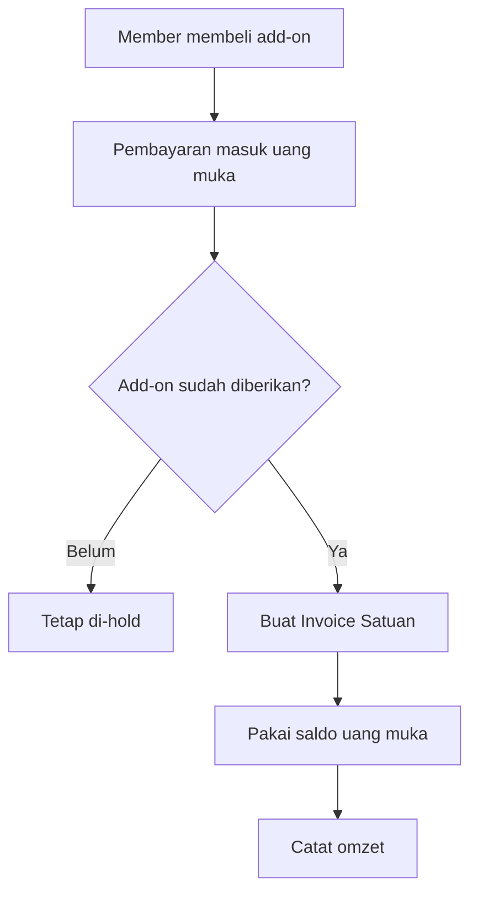

Titik pengakuan:

| Jenis add-on | Dianggap diberikan ketika |
|---|---|
| Barang fisik | Barang diserahkan |
| Booster/material | Sesi terkait selesai |
| Layanan tambahan | Layanan selesai |
| Hak/aktivasi | Aktivasi tervalidasi |

---

## 12. Flow lengkap uang muka sampai omzet

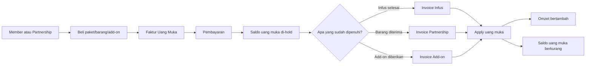

## 13. Hal yang tidak boleh dilakukan

- Jangan menimpa data existing Zoho tanpa preview.
- Jangan membuat member berdasarkan nama saja.
- Jangan menggabungkan dua kandidat member secara otomatis.
- Jangan menganggap uang muka sebagai omzet.
- Jangan membuat Invoice infus sebelum sesi completed.
- Jangan membuat Invoice seluruh barang jika baru sebagian diterima.
- Jangan mencatat perubahan stok yang sama dua kali.
- Jangan mengirim data medis ke Zoho.
- Jangan retry dengan membuat dokumen baru tanpa mencari reference lama.

## 14. Urutan pembangunan fitur Zoho

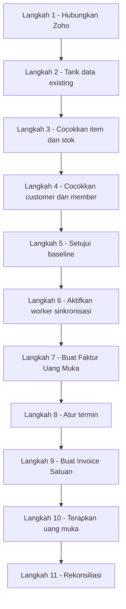

Jangan mulai dari Invoice otomatis sebelum connection, mapping, dan baseline
selesai.

## 15. Checklist agar mudah mengecek

### Sebelum go-live

- [ ] Zoho berhasil terhubung.
- [ ] Semua halaman item Zoho sudah ditarik.
- [ ] SKU duplikat sudah diselesaikan.
- [ ] Location Zoho sudah dipetakan.
- [ ] Saldo pembukaan RAHO sama dengan Zoho.
- [ ] Customer aktif Zoho sudah diperiksa.
- [ ] Customer exact match sudah terhubung.
- [ ] Customer baru sudah menjadi member.
- [ ] Data ambigu sudah diperiksa manusia.
- [ ] Faktur uang muka berhasil dibuat.
- [ ] Termin berhasil dihitung.
- [ ] Invoice infus hanya dibuat setelah completed.
- [ ] Invoice partnership mengikuti jumlah barang diterima.
- [ ] Invoice add-on mengikuti fulfillment.
- [ ] Uang muka dapat diterapkan sebagian dan penuh.
- [ ] Retry tidak membuat dokumen ganda.
- [ ] Laporan stock, uang muka, dan omzet sudah cocok.

## 16. Kesimpulan satu paragraf

Saat pertama dihubungkan, RAHO membaca item, stok, dan customer yang sudah ada
di Zoho. Item disambungkan lewat SKU, sedangkan customer disambungkan ke member
hanya jika nama dan tanggal lahir sama. Saldo Zoho dijadikan saldo pembukaan
RAHO. Setelah itu, pembayaran paket atau barang yang diterima di awal dimasukkan
ke Faktur Uang Muka dan belum menjadi omzet. Omzet baru muncul ketika infus
selesai, barang partnership diterima, atau add-on Premier diberikan. Pada saat
itu RAHO membuat Invoice satuan dan memakai sebagian saldo uang muka untuk
melunasinya.
