# BPMN Aplikasi RAHO ERP

Dokumen ini menjelaskan BPMN untuk alur utama aplikasi RAHO ERP dalam format Markdown. Diagram dibuat dengan Mermaid agar mudah dibaca di GitHub, VS Code, atau Markdown viewer lain yang mendukung Mermaid.

> Catatan: istilah yang benar adalah **BPMN**, bukan BPN. BPN kemungkinan hanya salah ketik.

## Apa Itu BPMN?

**BPMN** adalah singkatan dari **Business Process Model and Notation**. BPMN dipakai untuk menggambarkan proses bisnis dari awal sampai akhir dengan notasi yang standar dan mudah dipahami oleh tim bisnis, analis, developer, QA, dan stakeholder.

Secara sederhana, BPMN menjawab pertanyaan:

| Pertanyaan | Contoh di RAHO |
|---|---|
| Siapa yang melakukan proses? | Super Admin, Admin Manager, Admin Layanan, Doctor, Nurse, Member, System |
| Apa aktivitasnya? | Register member, assign paket, verify payment, isi diagnosis, catat material usage |
| Kapan proses bercabang? | Data valid atau tidak, pembayaran diterima atau ditolak, stok cukup atau tidak |
| Data apa yang dibuat/diubah? | User, Member, Package, Invoice, TreatmentSession, StockMutation |
| Bagaimana proses selesai? | Member terdaftar, paket aktif, sesi selesai, stok diterima, invoice paid |

## Notasi Yang Dipakai Di Dokumen Ini

Karena dokumen ini memakai Markdown, notasi BPMN dibuat sebagai **BPMN-style flow** dengan Mermaid.

| Notasi | Arti |
|---|---|
| `Start` | Awal proses |
| `End` | Akhir proses |
| Kotak aktivitas | Task atau aktivitas yang dikerjakan user/system |
| Diamond `{...}` | Gateway atau titik keputusan |
| `subgraph` | Swimlane/pelaku proses |
| Panah `-->` | Urutan proses |
| Label panah | Kondisi cabang proses, misalnya `Valid`, `Tidak valid`, `Approved` |

## Aktor Utama

| Aktor | Peran |
|---|---|
| `SUPER_ADMIN` | Akses penuh, master data, semua cabang, audit, konfigurasi |
| `ADMIN_MANAGER` | Kelola multi-cabang, staff, branch performance, stock request, shipment |
| `ADMIN_LAYANAN` | Operasional cabang, registrasi member, paket, payment, session |
| `DOCTOR` | Diagnosis, therapy plan, evaluasi medis |
| `NURSE` | Vital sign, infus, material usage, foto sesi |
| `MEMBER` | Portal member, lihat paket/sesi/invoice, upload bukti bayar |
| `SYSTEM` | Validasi, generate nomor, update status, audit log, hitung incentive |

## Peta Proses End-to-End

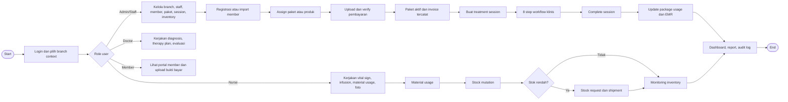
```mermaid
flowchart LR
  A([Start]) --> B[Login dan pilih branch context]
  B --> C{Role user}
  C -->|Admin/Staff| D[Kelola branch, staff, member, paket, session, inventory]
  C -->|Doctor| E[Kerjakan diagnosis, therapy plan, evaluasi]
  C -->|Nurse| F[Kerjakan vital sign, infusion, material usage, foto]
  C -->|Member| G[Lihat portal member dan upload bukti bayar]

  D --> H[Registrasi atau import member]
  H --> I[Assign paket atau produk]
  I --> J[Upload dan verify pembayaran]
  J --> K[Paket aktif dan invoice tercatat]
  K --> L[Buat treatment session]
  L --> M[8 step workflow klinis]
  M --> N[Complete session]
  N --> O[Update package usage dan EMR]

  F --> P[Material usage]
  P --> Q[Stock mutation]
  Q --> R{Stok rendah?}
  R -->|Ya| S[Stock request dan shipment]
  R -->|Tidak| T[Monitoring inventory]
  S --> T

  O --> U[Dashboard, report, audit log]
  T --> U
  U --> V([End])
```

## 1. Authentication, Session, Dan Authorization

Tujuan: memastikan user masuk dengan credential valid, mendapat session, lalu hanya mengakses data sesuai role dan branch.

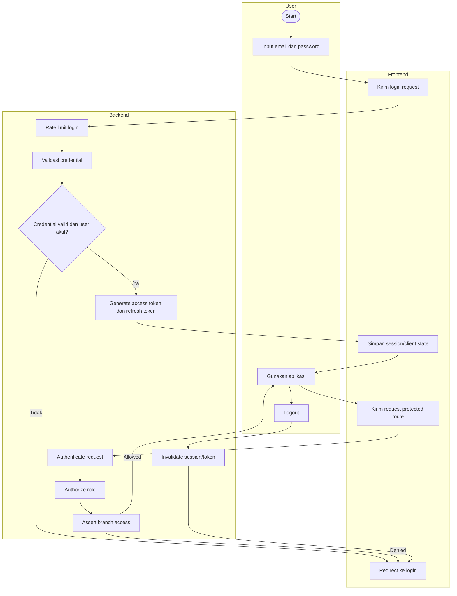
```mermaid
flowchart TD
  subgraph User
    A([Start]) --> B[Input email dan password]
    H[Gunakan aplikasi]
    N[Logout]
  end

  subgraph Frontend
    C[Kirim login request]
    I[Simpan session/client state]
    M[Kirim request protected route]
    O[Redirect ke login]
  end

  subgraph Backend
    D[Rate limit login]
    E[Validasi credential]
    F{Credential valid dan user aktif?}
    G[Generate access token dan refresh token]
    J[Authenticate request]
    K[Authorize role]
    L[Assert branch access]
    P[Invalidate session/token]
  end

  B --> C --> D --> E --> F
  F -->|Tidak| O
  F -->|Ya| G --> I --> H --> M
  M --> J --> K --> L
  L -->|Allowed| H
  L -->|Denied| O
  H --> N --> P --> O
```

Output utama:

| Output | Keterangan |
|---|---|
| Session aktif | User dapat mengakses dashboard sesuai role |
| Branch context | Data yang tampil mengikuti cabang aktif |
| Audit log | Aktivitas penting dicatat |

## 2. Admin, Branch, Dan Staff Management

Tujuan: membuat cabang, mengatur staff, dan memberi akses cabang sesuai struktur operasional RAHO.

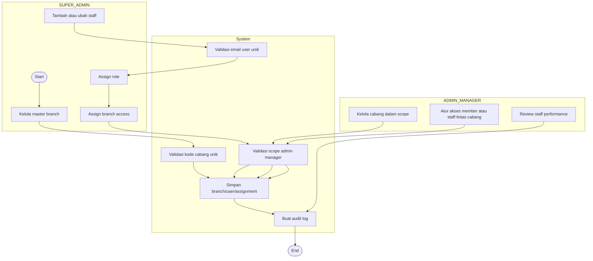
```mermaid
flowchart TD
  subgraph SuperAdmin["SUPER_ADMIN"]
    A([Start]) --> B[Kelola master branch]
    C[Tambah atau ubah staff]
    D[Assign role]
    E[Assign branch access]
  end

  subgraph AdminManager["ADMIN_MANAGER"]
    F[Kelola cabang dalam scope]
    G[Review staff performance]
    H[Atur akses member atau staff lintas cabang]
  end

  subgraph System
    I[Validasi kode cabang unik]
    J[Validasi email user unik]
    K[Validasi scope admin manager]
    L[Simpan branch/user/assignment]
    M[Buat audit log]
  end

  B --> I --> L
  C --> J --> D --> E --> K --> L --> M
  F --> K --> L
  H --> K --> L
  G --> M
  M --> N([End])
```

Business rule:

| Rule | Dampak |
|---|---|
| Kode cabang harus unik | Cabang duplikat ditolak |
| Email staff harus unik | User duplikat ditolak |
| Admin Manager hanya boleh mengelola cabang dalam scope | Aksi lintas scope ditolak |
| Semua mutation dicatat audit | Perubahan dapat ditelusuri |

## 3. Registrasi Member Baru

Tujuan: membuat akun member, profil member, nomor member, dan akses cabang awal.

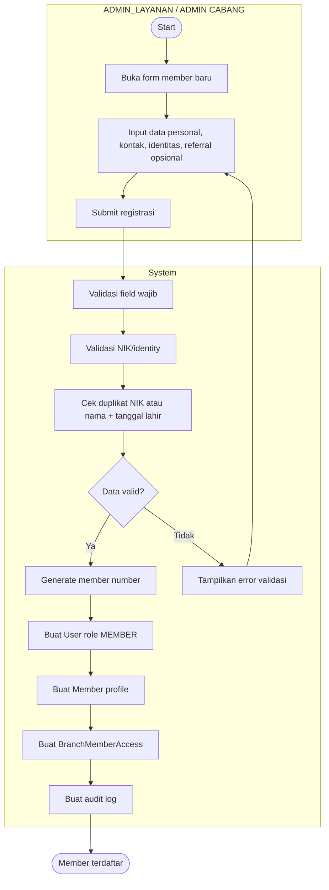
```mermaid
flowchart TD
  subgraph Staff["ADMIN_LAYANAN / ADMIN CABANG"]
    A([Start]) --> B[Buka form member baru]
    C[Input data personal, kontak, identitas, referral opsional]
    D[Submit registrasi]
  end

  subgraph System
    E[Validasi field wajib]
    F[Validasi NIK/identity]
    G[Cek duplikat NIK atau nama + tanggal lahir]
    H{Data valid?}
    I[Generate member number]
    J[Buat User role MEMBER]
    K[Buat Member profile]
    L[Buat BranchMemberAccess]
    M[Buat audit log]
    N[Tampilkan error validasi]
  end

  B --> C --> D --> E --> F --> G --> H
  H -->|Tidak| N --> C
  H -->|Ya| I --> J --> K --> L --> M --> O([Member terdaftar])
```

Data yang dibuat:

| Data | Keterangan |
|---|---|
| `User` | Akun login member |
| `UserProfile` | Profil personal |
| `Member` | Data member RAHO |
| `BranchMemberAccess` | Akses member ke cabang |
| `AuditLog` | Catatan registrasi |

## 4. Import Akun Member Dari Excel

Tujuan: import banyak member dari file Excel, memisahkan row valid dan invalid, lalu menyediakan export data tidak lengkap untuk diperbaiki.

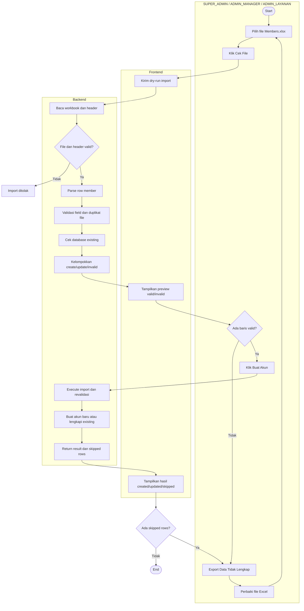
```mermaid
flowchart TD
  subgraph Admin["SUPER_ADMIN / ADMIN_MANAGER / ADMIN_LAYANAN"]
    A([Start]) --> B[Pilih file Members.xlsx]
    C[Klik Cek File]
    L{Ada baris valid?}
    M[Klik Buat Akun]
    R[Export Data Tidak Lengkap]
    S[Perbaiki file Excel]
  end

  subgraph Frontend
    D[Kirim dry-run import]
    K[Tampilkan preview valid/invalid]
    Q[Tampilkan hasil created/updated/skipped]
  end

  subgraph Backend
    E[Baca workbook dan header]
    F{File dan header valid?}
    G[Parse row member]
    H[Validasi field dan duplikat file]
    I[Cek database existing]
    J[Kelompokkan create/update/invalid]
    N[Execute import dan revalidasi]
    O[Buat akun baru atau lengkapi existing]
    P[Return result dan skipped rows]
  end

  B --> C --> D --> E --> F
  F -->|Tidak| T[Import ditolak]
  F -->|Ya| G --> H --> I --> J --> K --> L
  L -->|Tidak| R --> S --> B
  L -->|Ya| M --> N --> O --> P --> Q
  Q --> U{Ada skipped rows?}
  U -->|Ya| R
  U -->|Tidak| V([End])
```

Validasi penting:

| Validasi | Jika gagal |
|---|---|
| File harus `.xlsx` valid | Import ditolak |
| Header wajib ditemukan | Import ditolak |
| `nama_lengkap`, `tanggal_lahir`, `no_hp` wajib valid | Row invalid |
| NIK harus 16 digit jika diisi | Row invalid |
| Username/NIK duplikat di file atau database | Row invalid |
| Nama + tanggal lahir duplikat | Row invalid atau update existing bila cocok tunggal |

## 5. Package Sales, Payment, Dan Invoice

Tujuan: staff menjual paket/add-on/non-therapy, pembayaran diverifikasi, paket aktif, dan invoice tercatat.

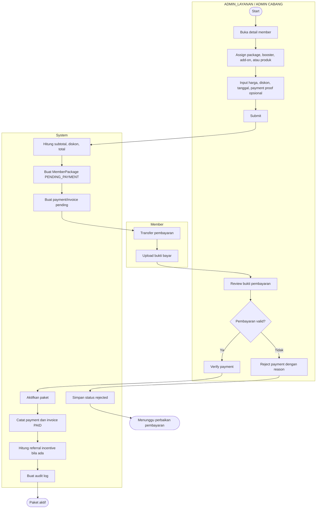
```mermaid
flowchart TD
  subgraph Staff["ADMIN_LAYANAN / ADMIN CABANG"]
    A([Start]) --> B[Buka detail member]
    C[Assign package, booster, add-on, atau produk]
    D[Input harga, diskon, tanggal, payment proof opsional]
    E[Submit]
    K[Review bukti pembayaran]
    L{Pembayaran valid?}
    M[Verify payment]
    N[Reject payment dengan reason]
  end

  subgraph Member
    I[Transfer pembayaran]
    J[Upload bukti bayar]
  end

  subgraph System
    F[Hitung subtotal, diskon, total]
    G[Buat MemberPackage PENDING_PAYMENT]
    H[Buat payment/invoice pending]
    O[Aktifkan paket]
    P[Catat payment dan invoice PAID]
    Q[Hitung referral incentive bila ada]
    R[Buat audit log]
    S[Simpan status rejected]
  end

  B --> C --> D --> E --> F --> G --> H
  H --> I --> J --> K --> L
  L -->|Ya| M --> O --> P --> Q --> R --> T([Paket aktif])
  L -->|Tidak| N --> S --> U([Menunggu perbaikan pembayaran])
```

Status utama:

| Status | Arti |
|---|---|
| `PENDING_PAYMENT` | Paket dibuat, belum aktif |
| `ACTIVE` | Pembayaran verified, paket bisa dipakai treatment |
| `CANCELLED` | Paket pending dibatalkan |
| `REFUNDED` | Paket aktif dikembalikan dana sesuai aturan |
| `EXPIRED` | Kuota/masa berlaku habis |

## 6. Edit, Cancel, Dan Refund Paket

Tujuan: menangani perubahan transaksi paket setelah dibuat.

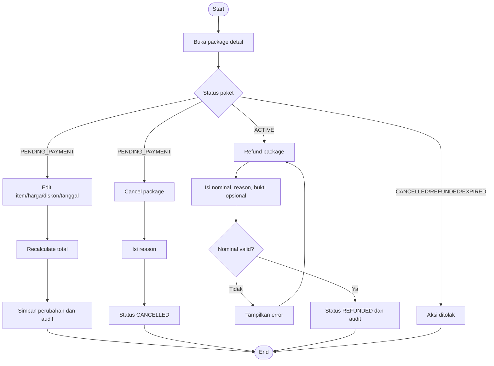
```mermaid
flowchart TD
  A([Start]) --> B[Buka package detail]
  B --> C{Status paket}
  C -->|PENDING_PAYMENT| D[Edit item/harga/diskon/tanggal]
  D --> E[Recalculate total]
  E --> F[Simpan perubahan dan audit]
  C -->|PENDING_PAYMENT| G[Cancel package]
  G --> H[Isi reason]
  H --> I[Status CANCELLED]
  C -->|ACTIVE| J[Refund package]
  J --> K[Isi nominal, reason, bukti opsional]
  K --> L{Nominal valid?}
  L -->|Tidak| M[Tampilkan error]
  L -->|Ya| N[Status REFUNDED dan audit]
  C -->|CANCELLED/REFUNDED/EXPIRED| O[Aksi ditolak]
  F --> P([End])
  I --> P
  N --> P
  M --> J
  O --> P
```

Business rule:

| Kondisi | Aksi yang diizinkan |
|---|---|
| `PENDING_PAYMENT` | Edit, cancel, upload bukti bayar |
| `ACTIVE` | Dipakai treatment, refund bila berwenang |
| `CANCELLED` | Tidak bisa digunakan |
| `REFUNDED` | Tidak bisa digunakan |

## 7. Treatment Session Dan EMR 8 Step

Tujuan: menjalankan sesi terapi lengkap dari encounter sampai session completed.

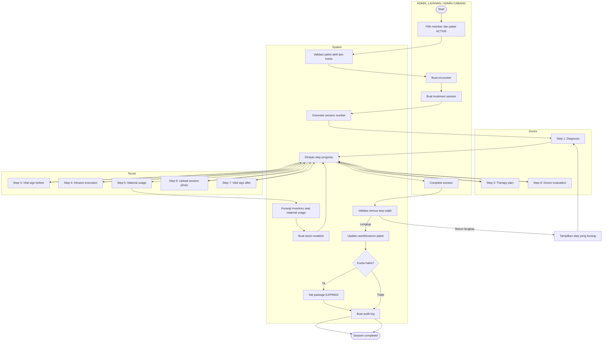
```mermaid
flowchart TD
  subgraph Admin["ADMIN_LAYANAN / ADMIN CABANG"]
    A([Start]) --> B[Pilih member dan paket ACTIVE]
    C[Buat encounter]
    D[Buat treatment session]
    Z[Complete session]
  end

  subgraph Doctor
    E[Step 1: Diagnosis]
    F[Step 2: Therapy plan]
    Y[Step 8: Doctor evaluation]
  end

  subgraph Nurse
    G[Step 3: Vital sign before]
    H[Step 4: Infusion execution]
    I[Step 5: Material usage]
    J[Step 6: Upload session photo]
    K[Step 7: Vital sign after]
  end

  subgraph System
    L[Validasi paket aktif dan kuota]
    M[Generate session number]
    N[Simpan step progress]
    O[Kurangi inventory saat material usage]
    P[Buat stock mutation]
    Q[Validasi semua step wajib]
    R[Update usedSessions paket]
    S{Kuota habis?}
    T[Set package EXPIRED]
    U[Buat audit log]
  end

  B --> L --> C --> D --> M
  M --> E --> N --> F --> N --> G --> N --> H --> N --> I --> O --> P --> N
  N --> J --> N --> K --> N --> Y --> N --> Z --> Q
  Q -->|Belum lengkap| V[Tampilkan step yang kurang] --> E
  Q -->|Lengkap| R --> S
  S -->|Ya| T --> U --> W([Session completed])
  S -->|Tidak| U --> W
```

Step klinis:

| Step | Aktor utama | Output |
|---|---|---|
| 1. Diagnosis | Doctor | Diagnosis, ICD, keluhan, pemeriksaan |
| 2. Therapy Plan | Doctor | Rencana dosis/material |
| 3. Vital Before | Nurse | Vital sign sebelum terapi |
| 4. Infusion | Nurse | Pelaksanaan infus aktual |
| 5. Material Usage | Nurse | Pemakaian material dan stock mutation |
| 6. Photo | Nurse | Dokumentasi foto sesi |
| 7. Vital After | Nurse | Vital sign sesudah terapi |
| 8. Evaluation | Doctor | Evaluasi/SOAP/catatan |

## 8. Therapy Plan Set Dan Bulk Plan

Tujuan: dokter/staff dapat membuat rencana terapi beberapa sesi sekaligus dan menjaga riwayat revisi.

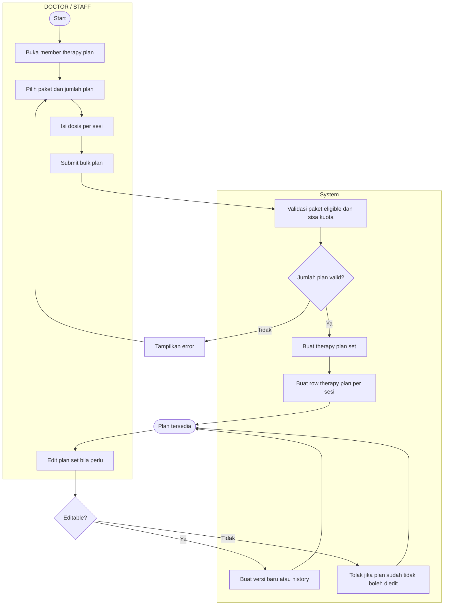
```mermaid
flowchart TD
  subgraph DoctorOrStaff["DOCTOR / STAFF"]
    A([Start]) --> B[Buka member therapy plan]
    C[Pilih paket dan jumlah plan]
    D[Isi dosis per sesi]
    E[Submit bulk plan]
    J[Edit plan set bila perlu]
  end

  subgraph System
    F[Validasi paket eligible dan sisa kuota]
    G{Jumlah plan valid?}
    H[Buat therapy plan set]
    I[Buat row therapy plan per sesi]
    K[Buat versi baru atau history]
    L[Tolak jika plan sudah tidak boleh diedit]
  end

  B --> C --> D --> E --> F --> G
  G -->|Tidak| M[Tampilkan error] --> C
  G -->|Ya| H --> I --> N([Plan tersedia])
  N --> J --> O{Editable?}
  O -->|Ya| K --> N
  O -->|Tidak| L --> N
```

## 9. Inventory, Stock Request, Dan Shipment

Tujuan: menjaga stok per cabang, mengurangi stok dari treatment, dan mengirim stok dari pusat/cabang sumber ke cabang tujuan.

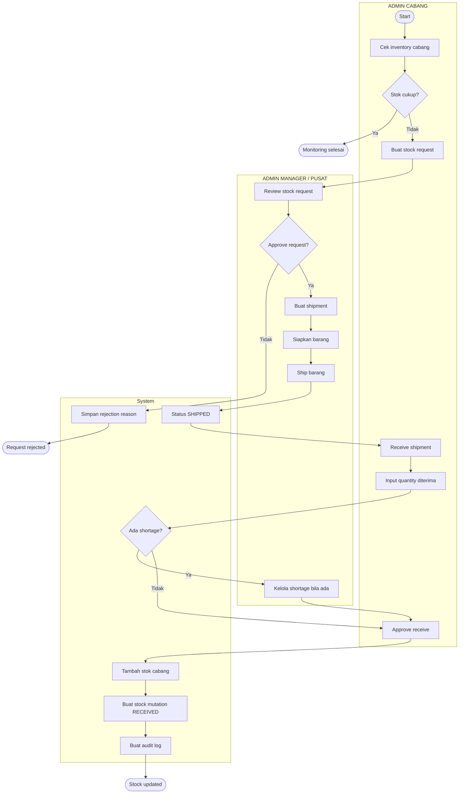
```mermaid
flowchart TD
  subgraph AdminCabang["ADMIN CABANG"]
    A([Start]) --> B[Cek inventory cabang]
    C{Stok cukup?}
    D[Buat stock request]
    K[Receive shipment]
    L[Input quantity diterima]
    O[Approve receive]
  end

  subgraph AdminManager["ADMIN MANAGER / PUSAT"]
    E[Review stock request]
    F{Approve request?}
    G[Buat shipment]
    H[Siapkan barang]
    I[Ship barang]
    Q[Kelola shortage bila ada]
  end

  subgraph System
    J[Status SHIPPED]
    M{Ada shortage?}
    N[Tambah stok cabang]
    P[Buat stock mutation RECEIVED]
    R[Buat audit log]
    S[Simpan rejection reason]
  end

  B --> C
  C -->|Ya| T([Monitoring selesai])
  C -->|Tidak| D --> E --> F
  F -->|Tidak| S --> U([Request rejected])
  F -->|Ya| G --> H --> I --> J --> K --> L --> M
  M -->|Ya| Q --> O
  M -->|Tidak| O
  O --> N --> P --> R --> V([Stock updated])
```

Status shipment:

| Status | Arti |
|---|---|
| `PREPARING` | Barang sedang disiapkan |
| `SHIPPED` | Barang dikirim |
| `RECEIVED` | Cabang menerima barang |
| `APPROVED` | Penerimaan disetujui dan stok final |

## 10. Material Usage Dari Sesi Ke Inventory

Tujuan: pemakaian material saat treatment langsung mengurangi stok cabang.

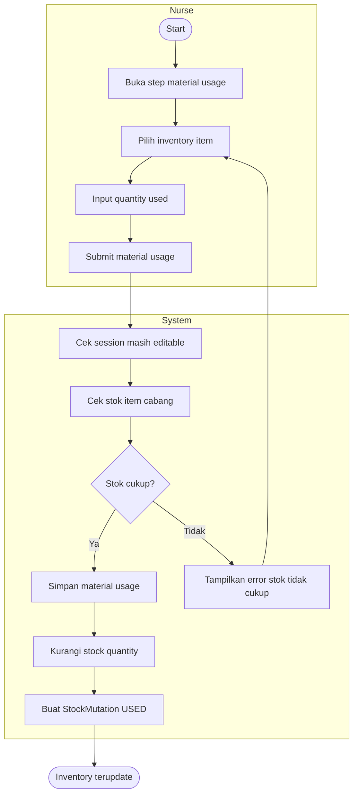
```mermaid
flowchart TD
  subgraph Nurse
    A([Start]) --> B[Buka step material usage]
    C[Pilih inventory item]
    D[Input quantity used]
    E[Submit material usage]
  end

  subgraph System
    F[Cek session masih editable]
    G[Cek stok item cabang]
    H{Stok cukup?}
    I[Simpan material usage]
    J[Kurangi stock quantity]
    K[Buat StockMutation USED]
    L[Tampilkan error stok tidak cukup]
  end

  B --> C --> D --> E --> F --> G --> H
  H -->|Tidak| L --> C
  H -->|Ya| I --> J --> K --> M([Inventory terupdate])
```

## 11. Non-Therapy Product Purchase

Tujuan: menjual produk non-terapi kepada member dan mencatat transaksi/invoice.

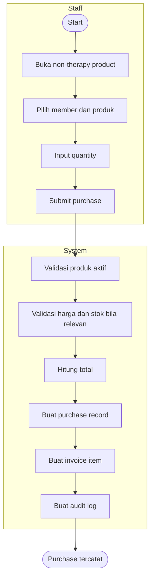
```mermaid
flowchart TD
  subgraph Staff
    A([Start]) --> B[Buka non-therapy product]
    C[Pilih member dan produk]
    D[Input quantity]
    E[Submit purchase]
  end

  subgraph System
    F[Validasi produk aktif]
    G[Validasi harga dan stok bila relevan]
    H[Hitung total]
    I[Buat purchase record]
    J[Buat invoice item]
    K[Buat audit log]
  end

  B --> C --> D --> E --> F --> G --> H --> I --> J --> K --> L([Purchase tercatat])
```

## 12. Invoice Dan Payment Operasional

Tujuan: membuat invoice manual/otomatis, mencatat pembayaran, dan mengontrol status invoice.

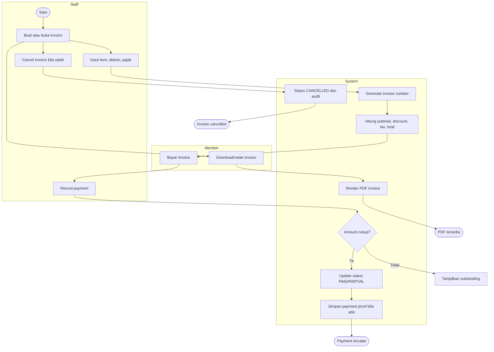
```mermaid
flowchart TD
  subgraph Staff
    A([Start]) --> B[Buat atau buka invoice]
    C[Input item, diskon, pajak]
    D[Record payment]
    J[Cancel invoice bila salah]
  end

  subgraph Member
    G[Bayar invoice]
    H[Download/cetak invoice]
  end

  subgraph System
    E[Generate invoice number]
    F[Hitung subtotal, discount, tax, total]
    I{Amount cukup?}
    K[Update status PAID/PARTIAL]
    L[Simpan payment proof bila ada]
    M[Status CANCELLED dan audit]
    N[Render PDF invoice]
  end

  B --> C --> E --> F --> G --> D --> I
  I -->|Tidak| O[Tampilkan outstanding]
  I -->|Ya| K --> L --> P([Payment tercatat])
  B --> J --> M --> Q([Invoice cancelled])
  B --> H --> N --> R([PDF tersedia])
```

## 13. Referral Dan Incentive

Tujuan: mencatat referral, menghubungkan member dengan referral code, dan menghitung incentive saat payment verified.

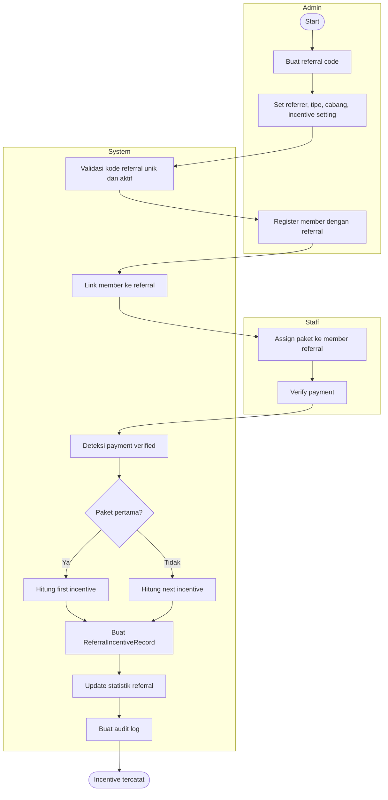
```mermaid
flowchart TD
  subgraph Admin
    A([Start]) --> B[Buat referral code]
    C[Set referrer, tipe, cabang, incentive setting]
    D[Register member dengan referral]
  end

  subgraph Staff
    E[Assign paket ke member referral]
    F[Verify payment]
  end

  subgraph System
    G[Validasi kode referral unik dan aktif]
    H[Link member ke referral]
    I[Deteksi payment verified]
    J{Paket pertama?}
    K[Hitung first incentive]
    L[Hitung next incentive]
    M[Buat ReferralIncentiveRecord]
    N[Update statistik referral]
    O[Buat audit log]
  end

  B --> C --> G --> D --> H --> E --> F --> I --> J
  J -->|Ya| K --> M
  J -->|Tidak| L --> M
  M --> N --> O --> P([Incentive tercatat])
```

## 14. Member Portal

Tujuan: member dapat melihat data miliknya sendiri dan mengirim bukti bayar.

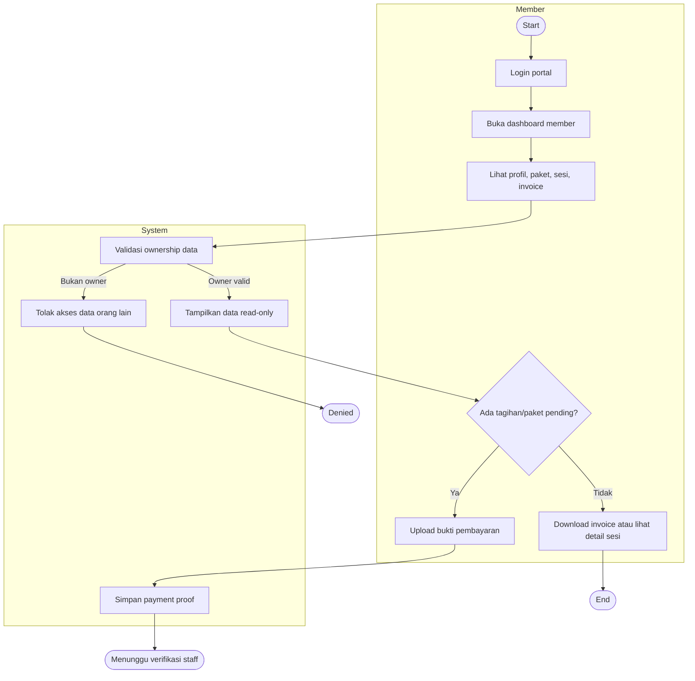
```mermaid
flowchart TD
  subgraph Member
    A([Start]) --> B[Login portal]
    C[Buka dashboard member]
    D[Lihat profil, paket, sesi, invoice]
    E{Ada tagihan/paket pending?}
    F[Upload bukti pembayaran]
    I[Download invoice atau lihat detail sesi]
  end

  subgraph System
    G[Validasi ownership data]
    H[Simpan payment proof]
    J[Tampilkan data read-only]
    K[Tolak akses data orang lain]
  end

  B --> C --> D --> G
  G -->|Owner valid| J --> E
  G -->|Bukan owner| K --> L([Denied])
  E -->|Ya| F --> H --> M([Menunggu verifikasi staff])
  E -->|Tidak| I --> N([End])
```

## 15. File, Dokumen, Lab Result, Dan Protected Asset

Tujuan: semua file sensitif hanya bisa diakses oleh user yang berhak.

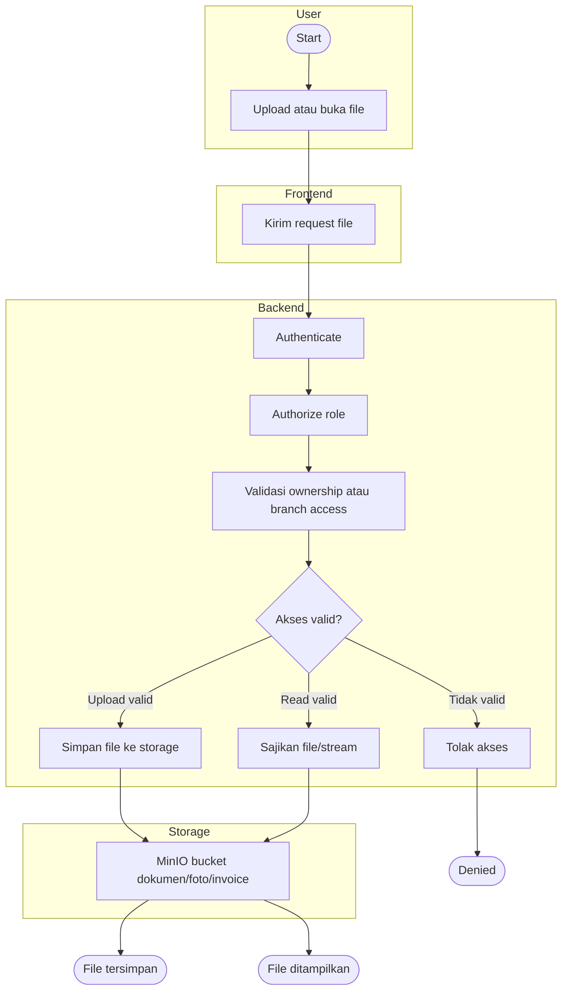
```mermaid
flowchart TD
  subgraph User
    A([Start]) --> B[Upload atau buka file]
  end

  subgraph Frontend
    C[Kirim request file]
  end

  subgraph Backend
    D[Authenticate]
    E[Authorize role]
    F[Validasi ownership atau branch access]
    G{Akses valid?}
    H[Simpan file ke storage]
    I[Sajikan file/stream]
    J[Tolak akses]
  end

  subgraph Storage
    K[MinIO bucket dokumen/foto/invoice]
  end

  B --> C --> D --> E --> F --> G
  G -->|Upload valid| H --> K --> L([File tersimpan])
  G -->|Read valid| I --> K --> M([File ditampilkan])
  G -->|Tidak valid| J --> N([Denied])
```

## 16. Dashboard, Reporting, Dan Audit

Tujuan: memberi ringkasan operasional sesuai role dan menyediakan jejak audit.

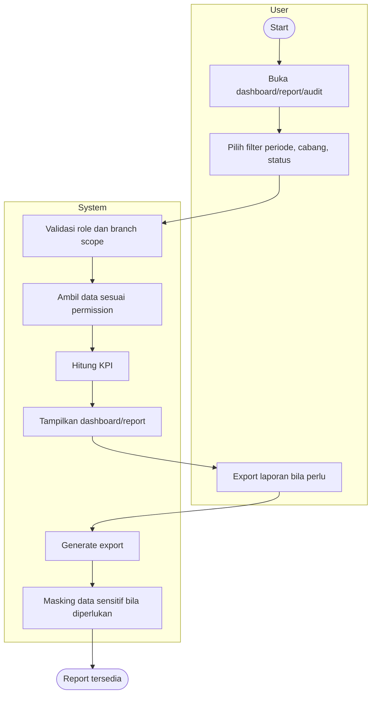
```mermaid
flowchart TD
  subgraph User
    A([Start]) --> B[Buka dashboard/report/audit]
    C[Pilih filter periode, cabang, status]
    H[Export laporan bila perlu]
  end

  subgraph System
    D[Validasi role dan branch scope]
    E[Ambil data sesuai permission]
    F[Hitung KPI]
    G[Tampilkan dashboard/report]
    I[Generate export]
    J[Masking data sensitif bila diperlukan]
  end

  B --> C --> D --> E --> F --> G
  G --> H --> I --> J --> K([Report tersedia])
```

Contoh KPI:

| Area | KPI |
|---|---|
| Member | Total member, member aktif, member baru per cabang |
| Package | Paket sold, active package, outstanding payment |
| Treatment | Session completed, session ongoing, completion rate |
| Finance | Revenue, paid invoice, pending payment |
| Inventory | Low stock, stock request pending, shipment status |
| Referral | Total referral, incentive earned, conversion |

## 17. Notification Dan Chat Internal

Tujuan: user menerima informasi penting, dan staff dapat berkomunikasi terkait layanan/member.

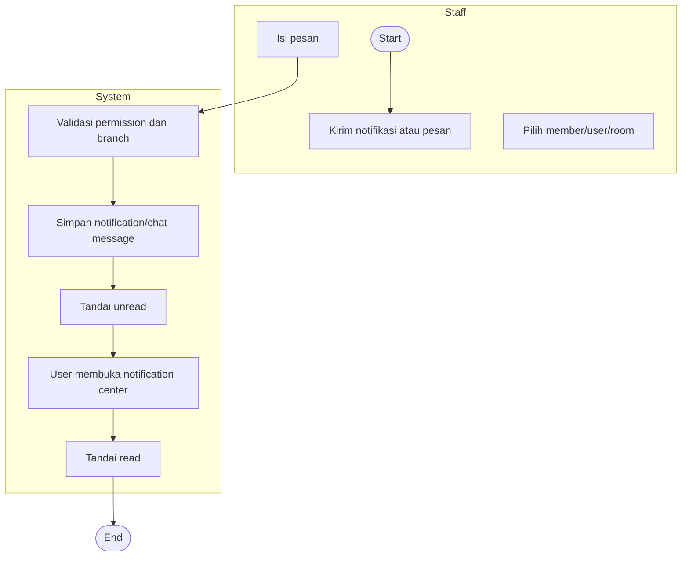
```mermaid
flowchart TD
  subgraph Staff
    A([Start]) --> B[Kirim notifikasi atau pesan]
    C[Pilih member/user/room]
    D[Isi pesan]
  end

  subgraph System
    E[Validasi permission dan branch]
    F[Simpan notification/chat message]
    G[Tandai unread]
    H[User membuka notification center]
    I[Tandai read]
  end

  D --> E --> F --> G --> H --> I --> J([End])
```

## 18. DevOps, Release, Backup, Dan Restore

Tujuan: memastikan aplikasi bisa dirilis, dipantau, dibackup, dan direstore dengan aman.

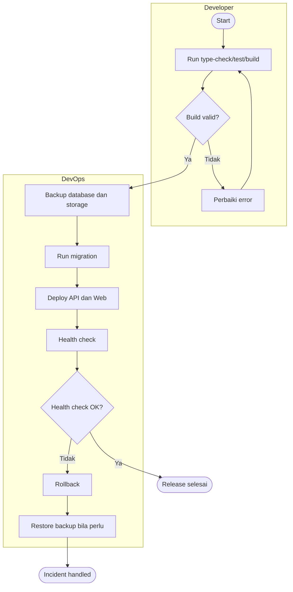
```mermaid
flowchart TD
  subgraph Developer
    A([Start]) --> B[Run type-check/test/build]
    C{Build valid?}
    D[Perbaiki error]
  end

  subgraph DevOps
    E[Backup database dan storage]
    F[Run migration]
    G[Deploy API dan Web]
    H[Health check]
    I{Health check OK?}
    J[Rollback]
    K[Restore backup bila perlu]
  end

  B --> C
  C -->|Tidak| D --> B
  C -->|Ya| E --> F --> G --> H --> I
  I -->|Ya| L([Release selesai])
  I -->|Tidak| J --> K --> M([Incident handled])
```

## Ringkasan Modul Dan Proses

| Modul | Proses BPMN terkait |
|---|---|
| `auth` | Login, refresh session, logout, me |
| `admin` | System stats, user management, manager branch scope, package pricing, master data, impersonation |
| `branches` | Branch detail, branch members, branch sessions, branch stock |
| `members` | Registrasi, update, import akun, dokumen, lab result, credentials, branch access |
| `packages` | Assign paket, payment proof, verify/reject, edit, cancel, refund |
| `sessions` | Create session, 8-step clinical workflow, complete session, EMR |
| `inventory` | Inventory item, mutation, stock request, shipment, logistics |
| `invoices` | Create invoice, payment, cancel, PDF/download |
| `referrals` | Referral code, incentive, export |
| `non-therapy` | Product non-terapi dan purchase |
| `dashboard` | Dashboard role-based dan KPI |
| `audit` | Audit log, export, activity tracking |
| `files` | Protected file serving |
| `me` | Portal member, package/session/invoice milik sendiri |

## Prioritas Diagram Untuk Presentasi

Jika dokumen ini dipakai untuk presentasi atau skripsi/laporan, pakai urutan berikut:

1. Apa itu BPMN
2. Aktor utama
3. Peta proses end-to-end
4. Registrasi/import member
5. Package sales dan payment
6. Treatment session 8 step
7. Inventory dan shipment
8. Invoice/referral/reporting

## Sumber Acuan

Dokumen ini disusun dari struktur aplikasi dan dokumentasi lokal berikut:

| File | Fungsi |
|---|---|
| `README.md` | Ringkasan fitur dan modul aplikasi |
| `USE_CASES.md` | Use case lengkap UC-001 sampai UC-100 |
| `docs/BUSINESS-FLOW.md` | Alur bisnis utama RAHO |
| `docs/MEMBER-ACCOUNT-IMPORT-FILES-AND-COLUMNS.md` | Detail import akun member |
| `apps/api/src/modules/*` | Modul backend aktual |

