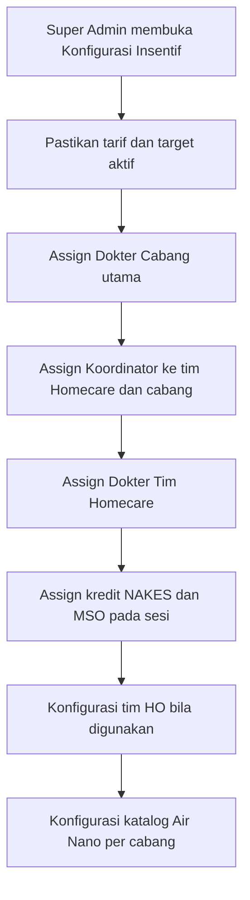
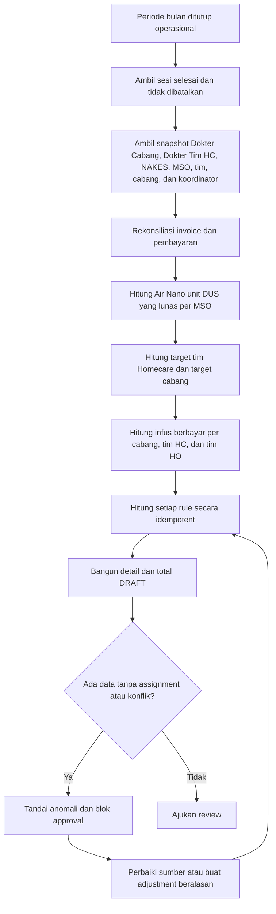
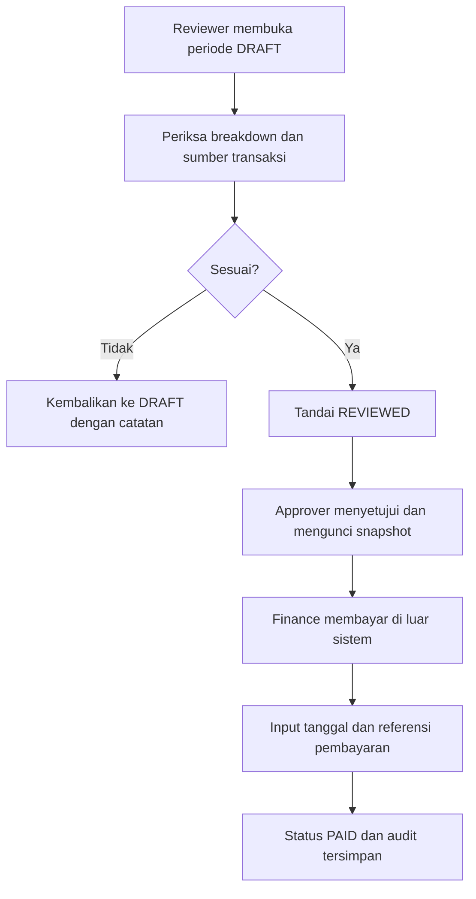
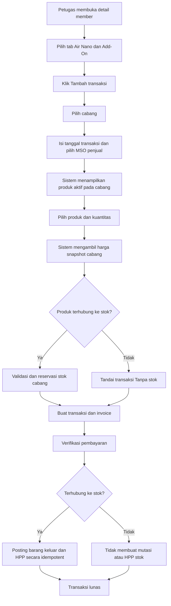

# Requirement dan Flow Insentif CHS, Air Nano, dan Add-On

Tanggal dokumen: 3 September 2026  
Pembaruan aturan NAKES dan MSO: 9 September 2026

Status: Draft requirement untuk review Product Owner, Operasional, HR/Payroll, Finance, Logistik, dan Engineering

## 1. Tujuan

Menyediakan fitur yang dapat:

- menetapkan Koordinator CHS yang membawahi satu atau beberapa tim Homecare dan cabang;
- menghitung insentif bulanan Dokter Cabang, Koordinator CHS, NAKES, dan MSO dari data operasional yang sah;
- mencegah satu aktivitas terhitung ganda pada komponen insentif yang sama;
- memproses perhitungan melalui tahap draft, review, approval, dan pembayaran;
- menambahkan tab **Air Nano & Add-On** pada detail member;
- mengelola katalog Air Nano/Add-On yang dapat dibedakan per cabang;
- menyediakan pilihan produk terhubung atau tidak terhubung ke stok;
- menjaga agar perubahan tidak mengubah transaksi, sesi terapi, invoice, atau stok lama.

## 2. Prinsip fase awal

1. Periode insentif menggunakan bulan kalender zona waktu Asia/Jakarta.
2. Sumber utama hitungan infus adalah sesi terapi yang selesai dan tidak dibatalkan.
3. Setiap sesi memiliki satu penerima kredit Dokter Cabang, satu penerima kredit NAKES, satu penerima kredit MSO, satu tim, dan satu cabang untuk kepentingan insentif. Nilai tersebut disimpan sebagai snapshot agar histori tidak berubah saat assignment staf berubah.
4. Perhitungan bersifat otomatis, tetapi pembayaran tetap memerlukan approval.
5. Nominal insentif disimpan sebagai snapshot ketika periode dikunci.
6. Koreksi setelah periode dikunci tidak mengubah hasil lama secara diam-diam. Koreksi dibuat sebagai adjustment yang memiliki alasan dan audit.
7. Fitur dibuat secara additive. Data sesi, invoice, member, produk, dan stok lama tidak dimigrasikan atau dihitung ulang otomatis.

## 3. Definisi

| Istilah | Definisi fase awal |
|---|---|
| Sesi/infus valid | `TreatmentSession` telah selesai, tidak dibatalkan, dan memiliki tanggal pelaksanaan pada periode yang dihitung |
| Infus berbayar | Sesi valid yang sumber paket/invoice-nya sudah lunas dan terverifikasi; sesi gratis atau sosial tidak termasuk |
| Tusukan pribadi | Sesi valid yang kredit pelaksana tindakannya diberikan kepada Koordinator CHS yang bersangkutan |
| Visit MSO | Satu sesi valid yang kredit MSO-nya diberikan kepada MSO tersebut; satu sesi hanya dihitung satu visit |
| Dokter Cabang | Dokter utama yang ditugaskan secara efektif pada satu cabang untuk menerima insentif kinerja cabang |
| Dokter Tim Homecare | Dokter yang ditugaskan pada satu tim Homecare; dapat merupakan orang yang sama dengan Koordinator CHS |
| Tim Homecare | Tim aktif yang menggunakan master `HomecareTeam` dan memiliki assignment efektif pada tanggal sesi |
| Tim HO | Tim Head Office yang dikonfigurasi sebagai tipe `HO`; definisi ini masih harus dikonfirmasi pada bagian keputusan bisnis |
| Cabang memiliki Homecare | Cabang memiliki sedikitnya satu tim Homecare aktif pada salah satu hari dalam periode tersebut |
| Penjualan Air Nano lunas | Transaksi Air Nano berstatus lunas/terverifikasi dan tidak dibatalkan atau direfund |
| Satu dus | Kuantitas pada SKU dengan unit `DUS`; penjualan botol tidak dikonversi menjadi dus pada fase awal |
| Tidak berlaku kelipatan | Bonus target dibayar satu kali dalam satu bulan walaupun realisasi mencapai dua atau lebih kelipatan target |

### 3.1 Interpretasi batas target

Untuk menghindari perbedaan implementasi:

- `>= 100` atau “100 ke atas” berarti minimal **100**;
- `> 100` berarti minimal **101**;
- `>= 200` berarti minimal **200**;
- `>= 300` berarti minimal **300**.

Keputusan bisnis final per 9 September 2026 menetapkan target NAKES dan MSO tercapai mulai **100** (`>= 100`). Bonus target dibayarkan satu kali dan tidak berlaku kelipatan.

## 4. Role dan hak akses

### 4.1 Assignment penerima insentif

#### 4.1.1 Koordinator CHS

Assignment Koordinator CHS dibuat sebagai data baru yang terpisah dari role login existing. Satu assignment memiliki:

- pengguna koordinator;
- tim Homecare yang dibawahi;
- cabang yang dibawahi;
- tim HO yang dibawahi bila berlaku;
- tanggal mulai dan selesai assignment;
- status aktif;
- pembuat/perubah dan alasan perubahan.

Perubahan assignment hanya berlaku mulai tanggal efektif dan tidak mengubah snapshot periode yang sudah dikunci.

#### 4.1.2 Dokter Cabang dan Dokter Tim Homecare

- Setiap cabang memiliki maksimal satu Dokter Cabang utama pada rentang tanggal yang sama.
- Setiap tim Homecare memiliki maksimal satu Dokter Tim Homecare utama pada rentang tanggal yang sama.
- Assignment memiliki `effectiveFrom`, `effectiveUntil`, status aktif, pembuat/perubah, dan alasan perubahan.
- Koordinator CHS boleh merangkap sebagai Dokter Tim Homecare.
- Perubahan assignment tidak mengubah hasil periode yang sudah dikunci.

### 4.2 Permission yang disarankan

| Permission | Super Admin | Koordinator CHS | HR/Finance | Dokter Cabang/NAKES/MSO |
|---|:---:|:---:|:---:|:---:|
| `INCENTIVE.CONFIG_MANAGE` | Ya | Tidak | Tidak | Tidak |
| `INCENTIVE.ASSIGNMENT_MANAGE` | Ya | Tidak | Tidak | Tidak |
| `INCENTIVE.CALCULATE` | Ya | Tidak | Opsional | Tidak |
| `INCENTIVE.REVIEW` | Ya | Tidak | Ya | Tidak |
| `INCENTIVE.APPROVE` | Ya | Tidak | Sesuai otorisasi | Tidak |
| `INCENTIVE.MARK_PAID` | Ya | Tidak | Finance | Tidak |
| `INCENTIVE.VIEW_ALL` | Ya | Tidak | Ya | Tidak |
| `INCENTIVE.VIEW_SELF` | Ya | Ya | Ya | Ya |
| `ADDON.CATALOG_MANAGE` | Ya | Tidak | Tidak | Tidak |
| `ADDON.BRANCH_CONFIG_MANAGE` | Ya | Tidak | Tidak | Tidak |
| `ADDON.SELL` | Ya | Sesuai scope | Sesuai role existing | Sesuai role existing |

Super Admin tetap dapat melihat dan mengelola seluruh scope.

## 5. Aturan insentif

### 5.1 Ringkasan aturan

| Penerima | Komponen | Syarat | Nominal |
|---|---|---|---:|
| Dokter Cabang | Infus berbayar setelah target cabang | Cabang tanpa Homecare mencapai minimal 200 sesi, atau cabang dengan Homecare mencapai minimal 300 sesi | Rp2.500/infus berbayar |
| NAKES | Insentif per infus | Setiap sesi valid yang dikreditkan kepada NAKES | Rp10.000/infus |
| NAKES | Bonus bulanan | Jumlah sesi valid minimal 100 | Rp2.000.000 satu kali |
| MSO | Bonus visit bulanan | Visit valid minimal 100, dan penjualan Air Nano lunas minimal 5 dus | Rp2.000.000 satu kali |
| MSO | Penjualan Air Nano | Setiap dus Air Nano yang lunas dan terverifikasi | Rp90.000/dus |
| Koordinator CHS | Target tim Homecare | Setiap tim bawahannya mencapai minimal 100 sesi valid | Rp500.000/tim yang lolos |
| Koordinator CHS | Target cabang | Cabang tanpa tim Homecare mencapai 200 sesi, atau cabang dengan tim Homecare mencapai 300 sesi | Rp250.000/cabang yang lolos |
| Koordinator CHS | Infus berbayar dari Homecare/cabang | Sesi valid dan telah lunas/terverifikasi | Rp1.000/infus berbayar |
| Koordinator CHS | Tusukan pribadi | Sesi valid yang dilakukan sendiri; boleh berbayar, gratis, atau sosial | Rp10.000/infus |
| Koordinator CHS | Bonus tusukan pribadi | Tusukan pribadi minimal 100 dalam satu bulan | Rp2.000.000 satu kali |
| Koordinator CHS | Infus tim HO | Infus berbayar yang dikreditkan ke tim HO dalam scope | Rp10.000/infus berbayar |
| Koordinator merangkap Dokter Tim Homecare | Omzet tim Homecare | Tim mencapai minimal 100 sesi dan infus sudah lunas/terverifikasi | Rp5.000/infus berbayar |

### 5.2 Aturan Dokter Cabang

1. Cabang tanpa tim Homecare aktif menggunakan target minimal 200 sesi valid dalam satu bulan.
2. Cabang dengan tim Homecare aktif menggunakan target minimal 300 sesi valid dalam satu bulan.
3. Jika target cabang tidak tercapai, Dokter Cabang tidak memperoleh komponen ini.
4. Jika target tercapai, Dokter Cabang memperoleh Rp2.500 untuk setiap infus berbayar di cabang tersebut pada bulan yang sama.
5. Jumlah Rp2.500 dihitung dari seluruh `sessionId` unik yang lunas/terverifikasi di cabang, bukan hanya sesi yang ditangani langsung oleh Dokter Cabang.
6. Sesi gratis, sosial, belum lunas, dibatalkan, atau direfund tidak dihitung sebagai dasar nominal.
7. Hanya Dokter Cabang utama dengan assignment efektif yang menerima insentif. Jika tidak ada assignment yang sah, hasil ditandai anomali dan approval periode diblokir.
8. Target hanya berfungsi sebagai gerbang. Setelah lolos, tarif Rp2.500 berlaku untuk seluruh infus berbayar pada periode tersebut dan tidak hanya untuk infus ke-200/300 dan seterusnya.

```text
target_dokter_cabang = memiliki_tim_homecare ? 300 : 200
eligible_dokter_cabang = jumlah_infus_valid_cabang >= target_dokter_cabang
insentif_dokter_cabang = eligible_dokter_cabang
  ? jumlah_infus_berbayar_cabang × Rp2.500
  : Rp0
```

### 5.3 Aturan NAKES

1. NAKES memperoleh Rp10.000 untuk setiap sesi valid yang dikreditkan kepadanya.
2. Jika terdapat beberapa NAKES pada satu sesi, hanya NAKES utama atau `incentiveNakesId` yang menerima kredit.
3. Sesi gratis dan sosial tetap dihitung untuk komponen NAKES selama sesi valid.
4. Jika jumlah sesi NAKES minimal 100 dalam satu bulan, sistem menambahkan Rp2.000.000 satu kali.
5. Bonus Rp2.000.000 tidak berlaku kelipatan. Pada 200 infus, bonus tetap Rp2.000.000.
6. Sesi yang dibatalkan sebelum periode dikunci tidak dihitung.
7. Pembatalan setelah periode dikunci menghasilkan adjustment minus pada periode berikutnya.

Rumus:

```text
insentif_nakes = jumlah_infus_valid × Rp10.000
bonus_nakes = jumlah_infus_valid >= 100 ? Rp2.000.000 : Rp0
total_nakes = insentif_nakes + bonus_nakes
```

### 5.4 Aturan MSO

1. MSO memperoleh bonus visit Rp2.000.000 satu kali apabila dalam satu bulan:
   - memiliki minimal 100 visit valid; dan
   - menjual minimal 5 dus Air Nano yang sudah lunas dan terverifikasi.
2. Kedua syarat harus terpenuhi pada MSO dan periode yang sama.
3. Kuantitas seluruh varian Air Nano berunit `DUS` boleh dijumlahkan.
4. SKU berunit `BOTOL` tidak ikut memenuhi syarat dus pada fase awal.
5. Transaksi pending, belum lunas, ditolak, dibatalkan, atau direfund tidak dihitung.
6. Bonus visit tidak berlaku kelipatan.
7. Di luar bonus visit, setiap dus Air Nano yang lunas memberi insentif Rp90.000 kepada MSO penjual, tanpa batas jumlah dus.
8. Insentif Rp90.000/dus tetap dibayarkan walaupun target visit atau syarat minimal 5 dus untuk bonus visit belum tercapai.

Rumus:

```text
bonus_mso = visit_valid >= 100 AND dus_air_nano_lunas >= 5
  ? Rp2.000.000
  : Rp0
insentif_air_nano_mso = dus_air_nano_lunas × Rp90.000
total_mso = bonus_mso + insentif_air_nano_mso
```

### 5.5 Aturan Koordinator CHS dari tim Homecare

1. Sistem menghitung sesi valid per tim Homecare per bulan.
2. Tim harus berada dalam assignment koordinator pada tanggal sesi.
3. Setiap tim yang mencapai minimal 100 sesi menghasilkan Rp500.000 untuk koordinator.
4. Bonus diberikan per tim yang lolos, bukan per kelipatan 100.
5. Satu tim hanya boleh memiliki satu Koordinator CHS utama pada rentang waktu yang sama.
6. Jika koordinator berubah di tengah bulan, sesi dibagi sesuai tanggal efektif assignment; aturan pembagian bonus target harus mengikuti keputusan bagian 17.

Rumus dasar:

```text
bonus_tim_hc = count(tim_hc dengan jumlah_infus_valid >= 100) × Rp500.000
```

### 5.6 Aturan Koordinator CHS dari target cabang

1. Cabang tanpa tim Homecare aktif menggunakan target minimal 200 sesi valid per bulan.
2. Cabang yang memiliki tim Homecare aktif menggunakan target minimal 300 sesi valid per bulan.
3. Setiap cabang yang memenuhi target menghasilkan Rp250.000 untuk koordinator.
4. Bonus dibayar per cabang yang lolos, tidak berlaku kelipatan.
5. Cabang dan koordinator harus memiliki assignment efektif.

```text
target_cabang = memiliki_tim_homecare ? 300 : 200
bonus_cabang = count(cabang dengan realisasi >= target_cabang) × Rp250.000
```

### 5.7 Aturan Koordinator CHS dari infus berbayar

1. Koordinator memperoleh Rp1.000 untuk setiap sesi berbayar dari cabang dan tim Homecare dalam scope-nya.
2. Satu sesi yang sekaligus milik cabang dan tim Homecare hanya dihitung satu kali pada komponen ini.
3. Status lunas wajib berasal dari pembayaran yang sudah diverifikasi.
4. Sesi gratis, sosial, pembayaran pending, piutang belum lunas, pembayaran dibatalkan, dan refund penuh tidak dihitung.
5. Refund sebagian memerlukan keputusan bisnis; default fase awal adalah sesi tidak dihitung sampai invoice kembali berstatus lunas.

```text
insentif_infus_berbayar_koordinator = jumlah_session_id_unik_yang_lunas × Rp1.000
```

### 5.8 Aturan tusukan pribadi Koordinator CHS

1. Koordinator memperoleh Rp10.000 untuk setiap tusukan pribadi.
2. Sesi berbayar, gratis, atau sosial tetap dihitung.
3. Jika tusukan pribadi mencapai minimal 100 dalam satu bulan, koordinator mendapat tambahan Rp2.000.000 satu kali.
4. Jika pengguna juga berstatus NAKES, komponen Rp10.000 per sesi hanya dibayar sekali menggunakan aturan Koordinator CHS. Bonus NAKES Rp2.000.000 tidak ditumpuk dengan bonus tusukan Koordinator Rp2.000.000 pada fase awal.

```text
insentif_pribadi = jumlah_tusukan_pribadi × Rp10.000
bonus_pribadi = jumlah_tusukan_pribadi >= 100 ? Rp2.000.000 : Rp0
```

### 5.9 Aturan tim HO

1. Koordinator memperoleh Rp10.000 untuk setiap infus berbayar dari tim HO yang berada dalam scope-nya.
2. Satu sesi hanya boleh dikreditkan ke satu tim HO.
3. Hanya sesi dengan pembayaran lunas dan terverifikasi yang dihitung karena dasar komponen adalah omzet tim HO.
4. Sesi gratis, sosial, belum lunas, dibatalkan, atau direfund tidak dihitung.
5. Sesi tim HO tidak dimasukkan lagi ke komponen Rp1.000 Homecare/cabang, kecuali Product Owner menyetujui penumpukan insentif.

```text
insentif_tim_ho = jumlah_infus_berbayar_tim_ho × Rp10.000
```

### 5.10 Koordinator merangkap Dokter Tim Homecare

1. Aturan ini hanya berlaku jika Koordinator CHS juga memiliki assignment efektif sebagai Dokter Tim Homecare pada tim yang sama.
2. Tim Homecare harus mencapai minimal 100 sesi valid dalam bulan tersebut.
3. Jika target tim tidak tercapai, komponen Rp5.000 tidak dibayarkan.
4. Jika target tercapai, koordinator memperoleh Rp5.000 untuk setiap infus berbayar dari tim Homecare tersebut pada bulan yang sama.
5. Dasar nominal adalah seluruh infus berbayar tim, bukan hanya sesi yang ditangani secara pribadi oleh koordinator.
6. Sesi gratis, sosial, belum lunas, dibatalkan, atau direfund tidak dihitung.
7. Target hanya menjadi gerbang; ketika lolos, seluruh infus berbayar dalam periode dihitung.
8. Komponen Rp5.000 ini dapat terakumulasi dengan bonus target tim Rp500.000 dan komponen Rp1.000 per infus berbayar karena ketiganya merupakan hak yang berbeda.

```text
eligible_dokter_tim_hc = coordinator_is_team_doctor AND jumlah_infus_valid_tim >= 100
insentif_dokter_tim_hc = eligible_dokter_tim_hc
  ? jumlah_infus_berbayar_tim × Rp5.000
  : Rp0
```

### 5.11 Pencegahan hitung ganda

- Gunakan `sessionId` sebagai identitas unik per komponen insentif.
- Target tim Homecare dan target cabang boleh sama-sama tercapai karena merupakan dua komponen berbeda.
- Dokter Cabang dan Koordinator CHS dapat menerima insentif dari sesi yang sama karena penerima dan komponennya berbeda.
- Insentif personal Koordinator dan target tim/cabang boleh terakumulasi.
- Untuk koordinator yang merangkap Dokter Tim Homecare, tarif Rp5.000, tarif Rp1.000, dan bonus tim Rp500.000 boleh terakumulasi sesuai aturan yang dinyatakan eksplisit.
- Rp10.000 NAKES dan Rp10.000 tusukan pribadi Koordinator tidak boleh dibayar dua kali kepada orang yang sama untuk sesi yang sama.
- Setiap dus Air Nano lunas menghasilkan insentif MSO Rp90.000/dus dan juga dapat memenuhi syarat minimal 5 dus untuk pencairan bonus visit.
- Setiap baris hasil menyimpan `ruleCode`, sumber data, kuantitas, tarif, dan nominal agar dapat direkonsiliasi.

## 6. Contoh perhitungan

### 6.1 NAKES

NAKES A melakukan 100 infus valid:

```text
100 × Rp10.000 = Rp1.000.000
bonus >=100     = Rp2.000.000
total           = Rp3.000.000
```

Jika NAKES melakukan 200 infus, komponen per infus menjadi Rp2.000.000 dan bonus tetap Rp2.000.000, sehingga total Rp4.000.000.

### 6.2 MSO

- 100 visit dan 8 dus Air Nano lunas: bonus visit Rp2.000.000 + insentif Air Nano Rp720.000 = **Rp2.720.000**.
- 100 visit dan 4 dus lunas: bonus visit Rp0 + insentif Air Nano Rp360.000 = **Rp360.000**.
- 99 visit dan 5 dus lunas: bonus visit Rp0 + insentif Air Nano Rp450.000 = **Rp450.000**.

### 6.3 Dokter Cabang

Cabang memiliki tim Homecare, mencapai 320 sesi valid, dan 280 di antaranya merupakan infus berbayar:

```text
target cabang dengan Homecare = 300
realisasi sesi valid          = 320, sehingga target tercapai
280 × Rp2.500                 = Rp700.000
```

### 6.4 Koordinator CHS

Contoh tanpa sesi yang terhitung ganda dalam komponen yang sama:

| Komponen | Realisasi | Hasil |
|---|---:|---:|
| Tim Homecare lolos target | 1 tim | Rp500.000 |
| Cabang lolos target | 1 cabang | Rp250.000 |
| Infus berbayar Homecare/cabang | 180 sesi | Rp180.000 |
| Tusukan pribadi | 100 sesi | Rp1.000.000 |
| Bonus tusukan pribadi | Target tercapai | Rp2.000.000 |
| Infus tim HO | 20 infus berbayar | Rp200.000 |
| Merangkap Dokter Tim Homecare | 90 infus berbayar dari tim yang mencapai 100 sesi | Rp450.000 |
| **Total** |  | **Rp4.580.000** |

## 7. Status periode dan pembayaran insentif

```text
OPEN
  │ generate/recalculate
  ▼
DRAFT ──► REVIEWED ──► APPROVED ──► PAID
  │            │             │
  └────────────┴─────────────┴──► VOID/ADJUSTED dengan alasan
```

- `OPEN`: transaksi sumber masih dapat berubah.
- `DRAFT`: hasil dapat dihitung ulang.
- `REVIEWED`: reviewer menyatakan sumber dan anomali sudah diperiksa.
- `APPROVED`: nominal dikunci; perubahan sumber tidak mengubah snapshot.
- `PAID`: Finance mencatat tanggal, metode, dan referensi pembayaran.
- `VOID/ADJUSTED`: pembatalan atau koreksi wajib memiliki alasan dan audit.

Fase awal tidak melakukan transfer uang otomatis. Sistem menghitung, meminta approval, lalu mencatat bukti/status pembayaran.

## 8. Flow insentif end-to-end

### 8.1 Setup



### 8.2 Perhitungan bulanan



### 8.3 Approval dan pembayaran



## 9. Halaman dan laporan insentif

Menu yang disarankan:

```text
Finance / HR
└── Insentif
    ├── Periode Bulanan
    ├── Hasil Dokter Cabang
    ├── Hasil Koordinator CHS
    ├── Hasil NAKES
    ├── Hasil MSO
    ├── Assignment Koordinator
    └── Konfigurasi Aturan
```

Dashboard periode menampilkan:

- total insentif per tipe penerima;
- realisasi dan insentif Dokter Cabang per cabang;
- realisasi terhadap target per tim dan cabang;
- breakdown per sesi/transaksi tanpa menampilkan data sensitif member secara berlebihan;
- jumlah visit MSO dan jumlah dus Air Nano lunas;
- sesi tanpa kredit staf/tim/cabang;
- transaksi yang dibatalkan atau direfund;
- status review, approval, dan pembayaran;
- export khusus Super Admin/HR/Finance dengan audit download.

## 10. Model data konseptual insentif

### `ChsCoordinatorAssignment`

- `id`, `coordinatorUserId`;
- `scopeType`: `HOMECARE_TEAM`, `BRANCH`, atau `HO_TEAM`;
- `scopeId`, `effectiveFrom`, `effectiveUntil`, `isActive`;
- `createdBy`, `updatedBy`, `changeReason`, timestamps;
- unique assignment aktif yang tumpang tindih untuk scope yang sama.

### `DoctorIncentiveAssignment`

- `id`, `doctorUserId`;
- `assignmentType`: `BRANCH_DOCTOR` atau `HOMECARE_TEAM_DOCTOR`;
- `branchId` nullable, `homecareTeamId` nullable;
- `effectiveFrom`, `effectiveUntil`, `isActive`;
- `createdBy`, `updatedBy`, `changeReason`, timestamps;
- maksimal satu assignment utama aktif yang tumpang tindih untuk cabang atau tim yang sama.

### `IncentiveRuleVersion`

- `id`, `ruleCode`, `recipientType`, `version`;
- `rateAmount`, `threshold`, `conditionJson`;
- `effectiveFrom`, `effectiveUntil`, `isActive`;
- `createdBy`, `approvedBy`, timestamps.

Rule awal:

- `BRANCH_DOCTOR_TARGET_PAID_INFUS_2500`;
- `NAKES_PER_INFUS_10K`;
- `NAKES_MONTHLY_GT100_1M`;
- `MSO_VISIT_GT100_AND_NANO_5BOX_2M`;
- `CHS_HC_TEAM_GTE100_500K`;
- `CHS_BRANCH_GTE200_OR_300_250K`;
- `CHS_PAID_INFUS_1K`;
- `CHS_PERSONAL_INFUS_10K`;
- `CHS_PERSONAL_GTE100_2M`;
- `CHS_HO_PAID_INFUS_10K`;
- `CHS_HC_DOCTOR_GTE100_PAID_INFUS_5K`.

### `IncentiveCreditSnapshot`

- `id`, `treatmentSessionId`;
- `treatmentDate`, `branchId`, `homecareTeamId`, `hoTeamId`;
- `branchDoctorUserId`, `homecareDoctorUserId`;
- `nakesUserId`, `msoUserId`, `coordinatorUserId`;
- `isPaidInfusion`, `isFree`, `isSocial`, `isPersonalNeedle`;
- `sourcePaymentId`, `sourceInvoiceId`;
- `capturedAt`, `sourceVersion`;
- unique `treatmentSessionId` per snapshot version.

### `IncentivePeriod`

- `id`, `periodMonth`, `timezone`, `status`;
- `calculationVersion`, `calculatedAt`, `reviewedAt`, `approvedAt`, `paidAt`;
- `calculatedBy`, `reviewedBy`, `approvedBy`, `paidBy`;
- `paymentReference`, `notes`, timestamps;
- unique bulan untuk versi perhitungan aktif.

### `IncentiveResult`

- `id`, `periodId`, `recipientUserId`, `recipientType`;
- `grossAmount`, `adjustmentAmount`, `netAmount`;
- `status`, `ruleVersionSnapshot`, timestamps;
- unique `(periodId, recipientUserId, recipientType)`.

### `IncentiveResultLine`

- `id`, `resultId`, `ruleCode`;
- `sourceType`, `sourceId`, `sourceScopeId`;
- `quantity`, `rateAmount`, `amount`;
- `calculationKey` unique untuk idempotensi;
- `descriptionSnapshot`, `metadataSafe`, timestamps.

## 11. Tab Air Nano & Add-On pada detail member

Tambahkan tab baru **Air Nano & Add-On** pada halaman detail member. Tab ini berdiri sendiri dari paket dan sesi terapi.

Tab menampilkan:

- tombol **Tambah transaksi**;
- filter kategori `Air Nano` dan `Add-On Lainnya`;
- produk, SKU, cabang transaksi, kuantitas, harga satuan, total;
- status pembayaran dan verifikasi;
- status stok: `Direservasi`, `Sudah keluar`, `Dilepas`, atau `Tanpa stok`;
- MSO penjual;
- tanggal transaksi, invoice, dan tindakan yang diizinkan;
- riwayat perubahan dan pembatalan.

### 11.1 Flow transaksi member



### 11.2 Pembatalan

- Pembatalan sebelum pembayaran melepaskan reservasi stok.
- Pembatalan setelah barang keluar wajib membuat reversal stok dan reversal jurnal; histori tidak dihapus.
- Transaksi tanpa stok tidak membuat reversal stok, tetapi tetap mengikuti pembatalan invoice/pembayaran.
- Refund mengurangi kuantitas Air Nano lunas untuk syarat bonus MSO pada periode yang sesuai dengan kebijakan adjustment.

## 12. Master katalog dan scope cabang

Katalog menggunakan dua tingkat:

1. **Master produk global** menyimpan identitas produk, SKU, kategori, warna, ukuran, dan unit.
2. **Konfigurasi produk cabang** menyimpan harga, status aktif, dan kebijakan stok pada setiap cabang.

Dengan struktur ini, SKU tetap konsisten tetapi harga dan ketersediaan dapat berbeda per cabang.

### 12.1 Field master produk

| Field | Aturan |
|---|---|
| SKU | Wajib, unik, uppercase, tidak dapat diubah setelah memiliki transaksi |
| Nama barang | Wajib, 2–150 karakter |
| Kategori | `AIR_NANO` atau kategori Add-On lain |
| Warna | Opsional; untuk Air Nano: Kuning, Biru, Hijau |
| Volume | Opsional; untuk Air Nano: 600 ml atau 1500 ml |
| Unit jual | `BOTOL`, `DUS`, atau unit tambahan yang disetujui |
| Status global | Aktif/nonaktif; produk historis tidak boleh dihapus |

### 12.2 Field konfigurasi per cabang

| Field | Aturan |
|---|---|
| Cabang | Wajib |
| Produk | Wajib |
| Harga jual | Wajib, minimal Rp0 |
| Aktif di cabang | Menentukan apakah tampil saat transaksi |
| Terhubung ke stok | Ya/Tidak |
| SKU inventory | Wajib bila terhubung ke stok |
| Kuantitas stok per unit jual | Wajib dan >0 bila terhubung ke stok |
| Lokasi stok default | Wajib bila cabang mempunyai lebih dari satu lokasi stok |
| Tanggal efektif | Wajib untuk perubahan harga/kebijakan |

Aturan scope:

- pengguna hanya dapat menjual produk aktif pada cabang yang berada dalam scope-nya;
- tanggal transaksi dan MSO penjual wajib diisi; MSO harus aktif dan bertugas pada cabang transaksi;
- Super Admin dapat melihat dan mengatur semua cabang;
- harga transaksi selalu mengambil konfigurasi cabang transaksi, bukan cabang asal member;
- perubahan harga hanya berlaku pada transaksi baru;
- perubahan `terhubungKeStok` tidak mengubah transaksi lama;
- produk yang pernah dipakai hanya dapat dinonaktifkan, bukan dihapus;
- konfigurasi cabang dapat dinonaktifkan tanpa menonaktifkan produk di cabang lain.

### 12.3 Mode stok

#### Terhubung ke stok

- produk harus terhubung dengan `MasterProduct`/SKU inventory aktif;
- stok tersedia divalidasi pada cabang transaksi;
- stok direservasi ketika transaksi dibuat;
- stok dikonsumsi setelah pembayaran lunas dan terverifikasi;
- HPP diambil dari cost layer inventory;
- pembatalan/reversal mengikuti ledger stok existing.

#### Tanpa stok

- transaksi, invoice, pembayaran, revenue, dan histori tetap dibuat;
- tidak melakukan validasi stok, reservasi, mutasi, atau pencatatan HPP inventory;
- UI wajib menampilkan label **Tanpa stok**;
- pemilihan mode dilakukan pada konfigurasi produk per cabang, bukan bebas oleh operator saat menjual;
- hanya Super Admin yang boleh override satu transaksi, dengan alasan wajib dan audit.

## 13. Seed awal Air Nano

| SKU | Nama barang | Harga awal |
|---|---|---:|
| `PRD-ANN-KNG-001` | Air Nano Kuning 600ml 1 Botol | Rp15.000 |
| `PRD-ANN-KNG-002` | Air Nano Kuning 1500ml 1 Botol | Rp35.000 |
| `PRD-ANN-KNG-003` | Air Nano Kuning 600ml 1 Dus | Rp360.000 |
| `PRD-ANN-KNG-004` | Air Nano Kuning 1500ml 1 Dus | Rp420.000 |
| `PRD-ANN-BRU-001` | Air Nano Biru 600ml 1 Botol | Rp15.000 |
| `PRD-ANN-BRU-002` | Air Nano Biru 1500ml 1 Botol | Rp35.000 |
| `PRD-ANN-BRU-003` | Air Nano Biru 600ml 1 Dus | Rp360.000 |
| `PRD-ANN-BRU-004` | Air Nano Biru 1500ml 1 Dus | Rp420.000 |
| `PRD-ANN-H2S-001` | Air Nano Hijau H2S 600ml 1 Botol | Rp15.000 |
| `PRD-ANN-H2S-002` | Air Nano Hijau H2S 1500ml 1 Botol | Rp35.000 |
| `PRD-ANN-H2S-003` | Air Nano Hijau H2S 600ml 1 Dus | Rp360.000 |
| `PRD-ANN-H2S-004` | Air Nano Hijau H2S 1500ml 1 Dus | Rp420.000 |

Harga di atas menjadi harga awal dan disalin ke konfigurasi cabang yang dipilih saat setup. Perubahan berikutnya dilakukan per cabang dengan tanggal efektif dan audit.

Pada fase awal, SKU botol dan SKU dus diperlakukan sebagai produk stok berbeda. Konversi isi satu dus ke botol belum dilakukan sampai jumlah botol per dus disahkan.

## 14. Model data konseptual Air Nano/Add-On

### `AddOnProduct`

- `id`, `sku`, `name`, `category`;
- `color`, `volume`, `salesUnit`;
- `isActive`, `createdBy`, `updatedBy`, timestamps.

Implementasi boleh memperluas `NonTherapyProduct` existing daripada membuat tabel duplikat.

### `AddOnBranchConfiguration`

- `id`, `productId`, `branchId`;
- `sellingPrice`, `trackInventory`;
- `inventoryMasterProductId`, `inventorySku`, `stockQuantityPerSale`;
- `defaultStockLocationId`, `effectiveFrom`, `effectiveUntil`, `isActive`;
- `createdBy`, `updatedBy`, timestamps;
- unique konfigurasi aktif `(productId, branchId, effective period)`.

### `MemberAddOnTransaction`

- `id`, `transactionCode`, `memberId`, `branchId`, `productId`;
- `transactionDate`, `sellerMsoId`, `quantity`;
- `productNameSnapshot`, `skuSnapshot`, `unitSnapshot`;
- `pricePerUnitSnapshot`, `totalPrice`;
- `trackInventorySnapshot`, `inventorySkuSnapshot`, `stockQuantitySnapshot`;
- `status`, `invoiceId`, `paymentStatus`, `paidAt`, `verifiedAt`;
- `inventoryReservationId`, `inventoryPostingId`;
- `cancelledAt`, `cancelledBy`, `cancelReason`;
- `createdBy`, `updatedBy`, timestamps.

Implementasi dapat memakai `MemberNonTherapyPurchase` atau `MemberAddOn` existing dengan schema additive dan adapter kompatibilitas.

## 15. Audit dan keamanan

- Catat pembuatan/perubahan assignment, rule, harga cabang, mode stok, transaksi, approval, pembayaran, pembatalan, dan adjustment.
- Jangan menghapus hasil insentif atau transaksi yang sudah menjadi histori.
- Simpan actor, waktu Asia/Jakarta, branch/scope, object ID, before/after yang aman, dan alasan untuk aksi sensitif.
- Approval tidak boleh dilakukan oleh pengguna yang sama dengan pembuat adjustment bila kebijakan segregation of duties diaktifkan.
- Endpoint wajib memvalidasi role dan scope di server, bukan hanya menyembunyikan tombol di UI.
- Perhitungan dan posting stok harus idempotent.
- Export tidak boleh menampilkan data klinis member yang tidak diperlukan untuk rekonsiliasi.

## 16. Acceptance criteria/UAT minimum

### 16.1 Insentif

1. Sesi selesai dan tidak dibatalkan dihitung tepat satu kali.
2. Sesi belum selesai atau dibatalkan tidak dihitung.
3. NAKES dengan 99 sesi menerima Rp990.000 tanpa bonus bulanan.
4. NAKES dengan 100 sesi menerima Rp1.000.000 + Rp2.000.000 bonus, total Rp3.000.000; pada 200 sesi totalnya Rp4.000.000 karena bonus tetap satu kali.
5. MSO dengan 100 visit dan 5 dus lunas menerima Rp2.000.000 + Rp450.000, total Rp2.450.000.
6. MSO dengan 100 visit tetapi hanya 4 dus lunas tidak menerima bonus visit, tetapi tetap menerima Rp360.000 dari penjualan Air Nano.
7. MSO dengan 99 visit dan 5 dus lunas tidak menerima bonus visit, tetapi tetap menerima Rp450.000 dari penjualan Air Nano.
8. Botol Air Nano tidak dihitung sebagai dus pada fase awal.
9. Tim Homecare dengan 100 sesi menghasilkan Rp500.000 untuk koordinator yang valid.
10. Dua tim yang masing-masing mencapai target menghasilkan Rp1.000.000, bukan berdasarkan kelipatan jumlah sesi.
11. Cabang tanpa tim Homecare memperoleh status lolos pada 200 sesi.
12. Cabang dengan tim Homecare baru memperoleh status lolos pada 300 sesi.
13. Satu sesi Homecare yang juga memiliki branch tidak dihitung dua kali pada komponen Rp1.000.
14. Sesi gratis/sosial tidak masuk komponen Rp1.000 infus berbayar.
15. Tusukan pribadi gratis/sosial tetap masuk komponen Rp10.000.
16. Koordinator dengan 100 tusukan pribadi mendapat Rp1.000.000 + bonus Rp2.000.000.
17. Sesi yang sama tidak membayar tarif NAKES dan tarif personal Koordinator dua kali kepada orang yang sama.
18. Perhitungan ulang DRAFT menghasilkan hasil yang sama dan tidak membuat baris ganda.
19. Periode APPROVED tidak berubah ketika sumber data diedit; koreksi masuk adjustment.
20. Periode tidak dapat di-approve jika ada sesi tanpa assignment wajib atau konflik kredit.
21. Dokter Cabang pada cabang tanpa Homecare dengan 199 sesi valid tidak memperoleh komponen Rp2.500.
22. Dokter Cabang pada cabang tanpa Homecare dengan 200 sesi valid dan 160 infus berbayar memperoleh Rp400.000.
23. Dokter Cabang pada cabang dengan Homecare dan 299 sesi valid tidak memperoleh komponen Rp2.500.
24. Dokter Cabang pada cabang dengan Homecare, 300 sesi valid, dan 250 infus berbayar memperoleh Rp625.000 dari seluruh infus berbayar bulan tersebut.
25. Cabang yang mencapai target tetapi tidak memiliki assignment Dokter Cabang utama ditandai sebagai anomali dan tidak dapat di-approve.
26. Koordinator yang merangkap Dokter Tim Homecare dengan 99 sesi tim tidak memperoleh komponen Rp5.000.
27. Koordinator yang merangkap Dokter Tim Homecare dengan 100 sesi valid dan 80 infus berbayar memperoleh Rp400.000 untuk komponen Dokter Tim Homecare; komponen tersebut dapat terakumulasi dengan Rp80.000 dari tarif Rp1.000 dan bonus tim Rp500.000.
28. Komponen tim HO hanya menghitung sesi lunas/terverifikasi dan menolak sesi gratis, sosial, belum lunas, batal, atau refund.

### 16.2 Air Nano dan Add-On

29. Detail member menampilkan tab Air Nano & Add-On.
30. Daftar transaksi hanya menampilkan data member terkait dan mengikuti scope cabang pengguna.
31. Dua belas SKU awal dapat diaktifkan dan diberi harga berbeda per cabang.
32. Produk nonaktif pada cabang tidak tampil pada form transaksi baru di cabang tersebut.
33. Perubahan harga tidak mengubah harga snapshot transaksi lama.
34. Produk terhubung stok menolak transaksi jika SKU atau stok cabang tidak tersedia.
35. Produk terhubung stok membuat reservasi tepat satu kali dan mengonsumsi stok setelah pembayaran terverifikasi.
36. Pembatalan sebelum pembayaran melepaskan reservasi.
37. Pembatalan setelah posting membuat reversal, bukan menghapus ledger.
38. Produk tanpa stok dapat ditransaksikan tanpa inventory balance dan tidak membuat mutasi/HPP stok.
39. Mode tanpa stok terlihat jelas pada detail transaksi dan audit.
40. Perubahan mode stok hanya berlaku untuk transaksi baru.
41. Produk yang telah memiliki histori tidak dapat dihapus; hanya dapat dinonaktifkan.
42. Penjualan SKU `DUS` wajib memiliki tanggal transaksi dan MSO penjual; setelah lunas, penjualan dikreditkan ke MSO tersebut pada periode tanggal transaksi yang benar.
43. Dua request paralel tidak membuat invoice, reservasi, posting stok, atau kredit penjualan ganda.
44. Fitur baru tidak mengubah sesi terapi, paket, invoice, atau stok historis yang sudah ada.

## 17. Keputusan bisnis

1. **Sudah diputuskan:** bonus NAKES dan target visit MSO dimulai pada 100 (`>= 100`).
2. Apa definisi resmi “tim HO”: Head Office, Homecare, atau kategori tim lain?
3. Jika koordinator berubah di tengah bulan, bonus target tim/cabang diberikan kepada koordinator akhir bulan, dibagi proporsional, atau mengikuti jumlah sesi pada masa assignment?
4. Apakah target cabang menghitung sesi Homecare di cabang tersebut atau hanya sesi on-site?
5. Apakah cabang disebut “memiliki tim Homecare” berdasarkan keberadaan tim aktif, atau harus ada realisasi Homecare pada bulan tersebut?
6. Jika terdapat lebih dari satu Dokter Cabang, apakah seluruh insentif diberikan kepada dokter utama atau dibagi? Draft ini menggunakan satu Dokter Cabang utama.
7. Apakah Rp2.500 Dokter Cabang dihitung dari seluruh infus berbayar cabang atau hanya yang ditangani dokter tersebut? Draft ini menghitung seluruh infus berbayar cabang setelah target tercapai.
8. Apakah Rp5.000 untuk Koordinator yang merangkap Dokter Tim Homecare dihitung dari seluruh infus berbayar tim atau hanya sesi yang ditangani pribadi? Draft ini menghitung seluruh infus berbayar tim.
9. Apakah komponen Rp5.000 Dokter Tim Homecare boleh ditumpuk dengan Rp1.000 per infus dan bonus tim Rp500.000? Draft ini memperbolehkan ketiganya terakumulasi.
10. Apakah target 100 tim Homecare menghitung sesi gratis dan sosial? Draft ini menghitung semua sesi valid, sedangkan tarif Rp5.000 hanya memakai sesi berbayar.
11. Apakah komponen Rp1.000 infus berbayar mencakup cicilan yang sudah dibayar sebagian, atau hanya invoice lunas penuh? Draft ini hanya menghitung lunas penuh.
12. Apakah bonus NAKES boleh ditumpuk dengan bonus tusukan pribadi Koordinator jika orang yang sama memiliki dua fungsi? Draft ini tidak menumpuk.
13. Apakah satu sesi dengan lebih dari satu NAKES dibagi, diberikan ke NAKES utama, atau masing-masing mendapat penuh? Draft ini memberikan ke satu penerima kredit.
14. Siapa yang berwenang review, approve, dan menandai pembayaran insentif?
15. Apakah pembayaran insentif perlu membuat jurnal payroll/expense otomatis pada fase awal?
16. Berapa isi botol per dus untuk setiap ukuran jika konversi stok dus-botol diperlukan kemudian?
17. Apakah harga Air Nano yang diberikan berlaku untuk semua cabang pada setup awal?
18. Apakah operator cabang boleh memilih mode tanpa stok per transaksi? Draft ini hanya mengizinkan konfigurasi cabang, dengan override Super Admin beralasan.
19. Kategori Add-On lain apa saja yang boleh dikelola selain Air Nano?

## 18. Out of scope fase awal

- transfer bank atau payroll insentif otomatis;
- perhitungan pajak penghasilan penerima insentif;
- perubahan retroaktif terhadap periode insentif yang sudah dikunci;
- pembagian satu sesi kepada beberapa NAKES;
- konversi otomatis stok dus menjadi botol atau sebaliknya;
- marketplace atau penjualan Air Nano tanpa member;
- penghapusan fisik produk, transaksi, ledger stok, atau hasil insentif historis.

## 19. Urutan implementasi yang disarankan

1. Tutup keputusan bisnis pada bagian 17.
2. Tambahkan schema additive untuk assignment, rule version, periode, hasil, dan snapshot kredit.
3. Lengkapi snapshot Dokter Cabang, Dokter Tim Homecare, NAKES, MSO, tim, dan cabang tanpa mengubah sesi lama.
4. Implementasikan kalkulator insentif idempotent dan laporan rekonsiliasi.
5. Tambahkan workflow review, approval, adjustment, dan pencatatan pembayaran.
6. Perluas master produk non-terapi dengan konfigurasi per cabang dan mode stok.
7. Seed 12 produk Air Nano dan tambahkan tab Air Nano & Add-On pada detail member.
8. Integrasikan transaksi ke invoice dan stok secara opsional berdasarkan snapshot konfigurasi.
9. Jalankan unit, integration, concurrency, authorization, migration-safety, dan UAT minimal 44 acceptance criteria.
10. Deploy dengan backup terverifikasi dan migration additive; jangan menghitung ulang atau mengubah data lama tanpa perintah khusus.
