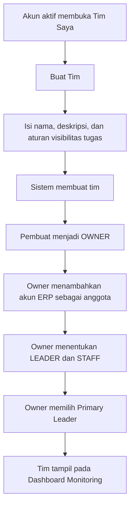
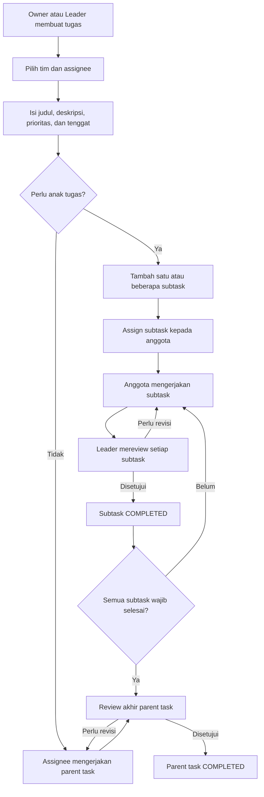

# Requirement Flow Modul Tim, Tugas, dan Monitoring

Tanggal dokumen: 7 September 2026  
Status: Draft requirement untuk review Product Owner, Operasional, dan Engineering

## 1. Tujuan

Menyediakan modul kolaborasi internal yang memungkinkan setiap akun ERP:

- membuat satu atau beberapa tim;
- menjadi pemilik tim yang dibuatnya;
- menambahkan akun ERP lain sebagai anggota;
- menentukan Leader dan Staff pada masing-masing tim;
- membuat, membagikan, dan memantau tugas beserta subtask/anak tugas;
- berinteraksi melalui komentar, mention, lampiran, dan notifikasi;
- melihat dashboard monitoring berdasarkan tim, Leader, anggota, status, dan tenggat.

Modul ini berdiri sendiri dan tidak terhubung dengan Voucher Partnership, sesi terapi, member, paket, stok, maupun finance pada fase awal.

## 2. Prinsip desain utama

1. Role dalam modul ini adalah **role per tim**, bukan role login/global ERP.
2. Satu akun dapat menjadi `OWNER` pada Tim A, `LEADER` pada Tim B, dan `STAFF` pada Tim C.
3. Setiap akun aktif dapat membuat tim. Pembuat otomatis menjadi `OWNER`.
4. Penentuan Leader dilakukan oleh Owner melalui halaman pengaturan tim atau dashboard monitoring.
5. Akses data selalu dibatasi berdasarkan keanggotaan tim.
6. Perubahan Leader, anggota, tugas, dan status harus mempunyai riwayat aktivitas.
7. Integrasi dengan modul ERP lain hanya boleh ditambahkan sebagai fase terpisah.
8. Subtask berada dalam tim yang sama dengan parent task dan dibatasi satu tingkat pada fase awal.

## 3. Pemisahan role sistem dan role tim

### 3.1 Role sistem ERP

Role seperti `SUPER_ADMIN`, `ADMIN_MANAGER`, `ADMIN_CABANG`, `DOCTOR`, atau `NURSE` tetap digunakan untuk menentukan akses terhadap modul ERP utama.

Role sistem tidak otomatis menjadikan seseorang Leader atau Owner di modul tim.

### 3.2 Role dalam tim

| Role tim | Hak akses |
|---|---|
| `OWNER` | Mengubah profil tim, mengelola anggota, menentukan Leader, membuat dan melihat seluruh tugas, melihat seluruh laporan, serta memindahkan kepemilikan tim. |
| `LEADER` | Membuat dan membagikan tugas, menentukan assignee, memantau anggota, memberi komentar, serta memeriksa dan menyetujui hasil tugas. |
| `STAFF` | Melihat tugas yang menjadi tanggung jawabnya atau dibagikan kepada tim, memperbarui progres, mengirim hasil, serta berinteraksi pada tugas yang dapat diakses. |

Ketentuan:

- satu tim mempunyai tepat satu `OWNER` aktif;
- satu tim mempunyai satu **Primary Leader** pada fase awal;
- Owner dapat merangkap sebagai Primary Leader;
- Leader tidak dapat mengubah Owner;
- Staff tidak dapat menaikkan role dirinya sendiri;
- penggantian Owner atau Leader wajib dicatat dalam audit;
- akun yang dinonaktifkan tidak dapat mengakses tim, tetapi histori aktivitasnya tidak dihapus.

## 4. Struktur menu dan halaman

Tambahkan grup sidebar **Kolaborasi** untuk seluruh akun ERP aktif.

```text
Kolaborasi
├── Dashboard Monitoring
├── Tugas Saya
├── Semua Tugas
├── Tim Saya
│   └── Detail Tim
├── Notifikasi
└── Aktivitas
```

Rute yang disarankan:

- `/collaboration` — dashboard monitoring sesuai scope akun;
- `/collaboration/tasks` — daftar tugas yang dapat diakses;
- `/collaboration/tasks/:taskId` — detail dan interaksi tugas;
- `/collaboration/teams` — daftar tim yang dimiliki atau diikuti;
- `/collaboration/teams/new` — membuat tim;
- `/collaboration/teams/:teamId` — detail tim dan monitoring;
- `/collaboration/teams/:teamId/settings` — anggota, role, dan Primary Leader;
- `/collaboration/notifications` — notifikasi kolaborasi;
- `/collaboration/activity` — histori aktivitas sesuai scope.

## 5. Flow pembuatan dan pengaturan tim



### 5.1 Form tim

| Field | Aturan |
|---|---|
| Nama tim | Wajib, 3–100 karakter, unik untuk Owner yang sama |
| Deskripsi | Opsional, maksimal 500 karakter |
| Primary Leader | Dapat dipilih saat membuat tim atau setelah anggota ditambahkan |
| Visibilitas tugas | `ASSIGNEE_ONLY` atau `ALL_TEAM_MEMBERS` |
| Status | `ACTIVE` atau `ARCHIVED` |

### 5.2 Pengelolaan anggota

- Anggota dipilih dari akun ERP aktif.
- Akun yang sama tidak boleh memiliki dua membership aktif dalam satu tim.
- Owner dapat mengubah anggota antara `LEADER` dan `STAFF`.
- Owner tidak dapat keluar sebelum memindahkan kepemilikan atau mengarsipkan tim.
- Primary Leader harus merupakan anggota aktif dengan role `LEADER` atau `OWNER`.
- Menghapus anggota tidak menghapus tugas, komentar, atau histori yang pernah dibuatnya.
- Tugas aktif milik anggota yang dihapus harus dipindahkan terlebih dahulu atau masuk antrean `UNASSIGNED`.

## 6. Flow tugas



### 6.1 Field tugas

| Field | Aturan |
|---|---|
| Judul | Wajib, 3–200 karakter |
| Deskripsi | Opsional, mendukung teks terformat sederhana |
| Jenis | `PARENT_TASK` atau `SUBTASK`; tugas tanpa anak tetap diperlakukan sebagai task utama |
| Parent task | Wajib untuk `SUBTASK`; harus berasal dari tim yang sama |
| Tim | Wajib dan harus dapat diakses pembuat |
| Assignee | Satu atau beberapa anggota aktif dalam tim |
| Dibuat oleh | Otomatis dari akun login |
| Priority | `LOW`, `MEDIUM`, `HIGH`, atau `URGENT` |
| Due date | Opsional; tidak boleh sebelum waktu pembuatan |
| Checklist | Opsional, dapat mempunyai beberapa item |
| Lampiran | Opsional, mengikuti batas ukuran dan tipe file sistem |
| Tags | Opsional dan dibatasi pada tag milik tim |

### 6.2 Status tugas

```text
TODO → IN_PROGRESS → SUBMITTED → COMPLETED
                    ↘ NEEDS_REVISION → IN_PROGRESS

TODO/IN_PROGRESS/NEEDS_REVISION → CANCELLED
```

Aturan status:

- assignee dapat mengubah `TODO` menjadi `IN_PROGRESS` dan mengirim `SUBMITTED`;
- Owner/Leader dapat mengubah tugas ke status apa pun sesuai flow;
- `COMPLETED` hanya dapat diberikan oleh Owner/Leader;
- pembatalan tugas memerlukan alasan;
- perubahan status menggunakan optimistic concurrency agar perubahan bersamaan tidak saling menimpa;
- setiap perubahan status disimpan sebagai histori.

### 6.3 Subtask/anak tugas

Subtask digunakan untuk memecah satu pekerjaan besar menjadi pekerjaan yang lebih kecil dan dapat dibagikan kepada anggota berbeda.

Ketentuan fase awal:

- satu parent task dapat mempunyai beberapa subtask;
- struktur dibatasi satu tingkat: subtask tidak dapat mempunyai anak lagi;
- parent task dan seluruh subtask wajib berada dalam tim yang sama;
- setiap subtask mempunyai judul, assignee, priority, due date, status, checklist, komentar, dan lampiran sendiri;
- assignee subtask boleh berbeda dari assignee parent task;
- Owner/Leader dapat membuat, mengubah urutan, memindahkan assignee, dan membatalkan subtask;
- Staff dapat memperbarui subtask yang ditugaskan kepadanya, tetapi tidak dapat memindahkannya ke parent lain;
- secara default due date subtask tidak boleh melewati due date parent;
- jika parent belum memiliki due date, setiap subtask boleh mempunyai due date sendiri;
- subtask dapat ditandai `REQUIRED` atau `OPTIONAL`; nilai default adalah `REQUIRED`;
- parent task tidak dapat berstatus `COMPLETED` selama masih ada subtask wajib yang belum `COMPLETED` atau `CANCELLED`;
- subtask `CANCELLED` dianggap selesai untuk perhitungan blocker, tetapi alasan pembatalan wajib diisi;
- maksimal awal adalah 50 subtask aktif per parent task dan dapat dikonfigurasi kemudian;
- sistem menolak relasi melingkar, parent lintas tim, dan parent yang juga merupakan subtask.

Tampilan parent task menampilkan:

- daftar anak tugas dalam bentuk tree/list yang dapat dibuka dan ditutup;
- progres `jumlah subtask selesai / total subtask`;
- persentase progres berdasarkan subtask wajib;
- jumlah subtask terlambat;
- avatar atau nama assignee setiap subtask;
- indikator bahwa parent masih diblokir oleh subtask yang belum selesai.

Aturan perubahan parent:

- saat subtask pertama berubah menjadi `IN_PROGRESS`, sistem dapat menyarankan parent ikut menjadi `IN_PROGRESS`, tetapi tidak mengubahnya diam-diam;
- penyelesaian seluruh subtask tidak otomatis menyelesaikan parent karena Owner/Leader tetap harus melakukan review akhir;
- pembatalan parent meminta konfirmasi dan membatalkan seluruh subtask yang belum selesai dalam satu transaksi;
- penghapusan fisik parent maupun subtask tidak diperbolehkan setelah memiliki aktivitas;
- urutan subtask disimpan eksplisit agar tampilan konsisten untuk semua anggota.

## 7. Interaksi dalam tugas

Anggota yang dapat melihat tugas dapat:

- menulis komentar;
- mention anggota tim menggunakan `@nama`;
- membalas komentar;
- mengunggah lampiran;
- melihat timeline perubahan;
- menerima notifikasi untuk assignment, mention, perubahan tenggat, revisi, dan penyelesaian.

Aturan:

- komentar hanya dapat diedit oleh pembuatnya dalam batas waktu yang dikonfigurasi;
- penghapusan komentar menggunakan soft delete dan meninggalkan penanda;
- lampiran mengikuti scope tugas dan tidak menggunakan URL publik permanen;
- notifikasi tidak boleh menampilkan isi sensitif di luar aplikasi;
- Owner dapat menutup interaksi pada tugas yang sudah `COMPLETED` atau `CANCELLED`.

## 8. Dashboard monitoring

Dashboard tidak menentukan role global ERP. Dashboard hanya membaca konfigurasi membership dan Primary Leader dari tim yang dipilih.

### 8.1 Konfigurasi Leader

Pada kartu atau halaman detail tim, Owner dapat:

1. membuka menu **Atur Tim**;
2. memilih anggota aktif;
3. mengubah role menjadi `LEADER`;
4. menetapkannya sebagai **Primary Leader**;
5. menyimpan perubahan dengan konfirmasi;
6. melihat perubahan Leader pada timeline audit.

### 8.2 Scope dashboard

- Owner melihat seluruh tugas dan anggota dari tim yang dimilikinya.
- Leader melihat seluruh tugas dan anggota pada tim yang dipimpinnya.
- Staff melihat ringkasan pribadinya dan data tim yang diizinkan kebijakan visibilitas.
- Akun yang mengikuti beberapa tim memilih tim melalui dropdown.
- Tidak ada data dari tim lain yang boleh muncul tanpa membership aktif.

### 8.3 KPI minimum

- total tugas;
- `TODO`, `IN_PROGRESS`, `SUBMITTED`, `NEEDS_REVISION`, dan `COMPLETED`;
- tugas terlambat;
- tugas jatuh tempo hari ini dan tujuh hari ke depan;
- completion rate per periode;
- beban tugas per anggota;
- rata-rata waktu penyelesaian;
- tugas yang menunggu review Leader;
- parent task yang terhambat subtask;
- progres dan subtask terlambat per parent task;
- aktivitas terakhir tim.

### 8.4 Filter

- tim;
- Primary Leader;
- assignee;
- status;
- priority;
- rentang tanggal;
- overdue/tidak overdue;
- tag.

Semua filter, pagination, dan agregasi dijalankan di server.

## 9. Matriks permission dalam tim

| Aksi | Owner | Leader | Staff |
|---|:---:|:---:|:---:|
| Membuat tim | Ya | Ya, menjadi Owner tim baru | Ya, menjadi Owner tim baru |
| Mengubah profil tim | Ya | Tidak | Tidak |
| Mengelola anggota | Ya | Tidak secara default | Tidak |
| Menentukan Primary Leader | Ya | Tidak | Tidak |
| Membuat tugas | Ya | Ya | Tidak secara default |
| Membuat dan mengatur subtask | Ya | Ya | Tidak |
| Assign/reassign tugas | Ya | Ya | Tidak |
| Melihat seluruh tugas tim | Ya | Ya | Sesuai kebijakan visibilitas |
| Memperbarui tugas sendiri | Ya | Ya | Ya |
| Mengirim hasil tugas | Ya | Ya | Ya, untuk tugasnya |
| Review dan menyelesaikan tugas | Ya | Ya | Tidak |
| Berkomentar | Ya | Ya | Ya, jika dapat melihat tugas |
| Melihat dashboard tim | Ya | Ya | Ringkasan terbatas |
| Mengarsipkan tim | Ya | Tidak | Tidak |

## 10. Model data konseptual

### `CollaborationTeam`

- `id`, `name`, `description`;
- `ownerId`, `primaryLeaderMembershipId`;
- `taskVisibilityPolicy`;
- `status`, `createdAt`, `updatedAt`, `archivedAt`.

### `TeamMembership`

- `id`, `teamId`, `userId`;
- `role`: `OWNER`, `LEADER`, atau `STAFF`;
- `status`: `ACTIVE`, `REMOVED`, atau `LEFT`;
- `assignedBy`, `joinedAt`, `removedAt`;
- unique membership aktif `(teamId, userId)`.

### `TeamTask`

- `id`, `teamId`, `taskNo`, `title`, `description`;
- `parentTaskId` nullable, `taskLevel`, `sortOrder`, `isRequired`;
- `status`, `priority`, `dueAt`;
- `createdBy`, `reviewedBy`, `completedAt`, `cancelledAt`, `cancelReason`;
- `version`, timestamps, soft-delete metadata.

Constraint minimum:

- foreign key `parentTaskId` mengarah ke `TeamTask.id`;
- index `(teamId, parentTaskId, sortOrder)`;
- service memvalidasi parent dan subtask berada dalam `teamId` yang sama;
- service menolak kedalaman lebih dari satu tingkat dan relasi siklik;
- `taskNo` unik di dalam satu tim.

### `TaskAssignment`

- `taskId`, `userId`, `assignedBy`, `assignedAt`, `unassignedAt`;
- unique assignment aktif `(taskId, userId)`.

### `TaskComment`

- `id`, `taskId`, `authorId`, `parentCommentId`;
- `content`, `editedAt`, `deletedAt`, timestamps.

### `TaskAttachment`

- `id`, `taskId`, `commentId` nullable;
- `fileName`, `storageKey`, `mimeType`, `size`;
- `uploadedBy`, timestamps.

### `TaskActivity`

- `id`, `teamId`, `taskId` nullable;
- `actorId`, `action`, `safeMetadata`, `createdAt`.

## 11. API konseptual

```text
POST   /collaboration/teams
GET    /collaboration/teams
GET    /collaboration/teams/:teamId
PATCH  /collaboration/teams/:teamId
POST   /collaboration/teams/:teamId/members
PATCH  /collaboration/teams/:teamId/members/:membershipId
DELETE /collaboration/teams/:teamId/members/:membershipId
PATCH  /collaboration/teams/:teamId/primary-leader

POST   /collaboration/teams/:teamId/tasks
GET    /collaboration/tasks
GET    /collaboration/tasks/:taskId
PATCH  /collaboration/tasks/:taskId
PATCH  /collaboration/tasks/:taskId/status
POST   /collaboration/tasks/:taskId/subtasks
GET    /collaboration/tasks/:taskId/subtasks
PATCH  /collaboration/tasks/:taskId/subtasks/reorder
POST   /collaboration/tasks/:taskId/comments
POST   /collaboration/tasks/:taskId/attachments

GET    /collaboration/dashboard
GET    /collaboration/activity
GET    /collaboration/notifications
PATCH  /collaboration/notifications/:notificationId/read
```

Setiap endpoint harus memvalidasi membership dan role tim di server. Pemeriksaan frontend hanya untuk pengalaman pengguna, bukan kontrol keamanan utama.

## 12. Audit, keamanan, dan integritas

- Semua perubahan Owner, Leader, membership, assignment, tenggat, priority, dan status dicatat.
- Akses objek menggunakan `teamId` dari membership tervalidasi, bukan dari input frontend saja.
- ID tugas tidak boleh cukup untuk membuka tugas dari tim lain.
- Parent dan subtask harus melalui validasi scope tim yang sama pada setiap perubahan relasi.
- Perubahan tugas menggunakan field `version` atau `updatedAt` sebagai concurrency guard.
- File divalidasi berdasarkan ukuran, MIME type, dan isi dasar sebelum disimpan.
- Penghapusan tim, tugas, komentar, dan membership menggunakan soft delete.
- Audit menyimpan actor dan perubahan aman tanpa menyalin isi lampiran atau komentar secara berlebihan.
- Rate limit diterapkan pada komentar, upload, dan mention.

## 13. Notifikasi minimum

Notifikasi dibuat ketika:

- akun ditambahkan ke tim;
- role anggota atau Primary Leader berubah;
- tugas diberikan atau dipindahkan;
- subtask dibuat, diberikan, dipindahkan, atau menjadi terlambat;
- akun di-mention;
- due date berubah;
- tugas mendekati tenggat atau terlambat;
- tugas dikirim untuk review;
- Leader meminta revisi;
- tugas diselesaikan atau dibatalkan.

Notifikasi fase awal tersedia di dalam aplikasi. Email, WhatsApp, dan push notification berada di fase lanjutan.

## 14. Di luar scope fase awal

- sinkronisasi tugas dengan Voucher Partnership;
- pembuatan sesi terapi, paket, invoice, jurnal, atau transaksi stok;
- struktur organisasi HR permanen;
- chat real-time di luar komentar tugas;
- kalender eksternal;
- penilaian kinerja atau payroll otomatis;
- tamu dari luar akun ERP;
- aplikasi mobile terpisah.

## 15. Acceptance criteria/UAT minimum

1. Setiap akun ERP aktif dapat membuat tim dan otomatis menjadi Owner.
2. Satu akun dapat mempunyai role berbeda pada tim yang berbeda.
3. Owner dapat menambahkan akun aktif dan menentukan Leader atau Staff.
4. Owner dapat mengganti Primary Leader melalui dashboard atau pengaturan tim.
5. Staff tidak dapat menaikkan role sendiri atau mengubah Leader.
6. Owner dan Leader dapat membuat serta membagikan tugas kepada anggota tim.
7. Staff dapat memperbarui progres dan mengirim hasil tugasnya.
8. Leader dapat meminta revisi atau menyelesaikan tugas yang sudah dikirim.
9. Anggota dapat berkomentar dan mention pada tugas yang dapat diakses.
10. Akun tanpa membership tidak dapat membuka tim atau tugas meskipun mengetahui ID-nya.
11. Dashboard Owner/Leader menampilkan KPI sesuai tim yang dipilih.
12. Dashboard Staff tidak menampilkan data privat anggota lain jika kebijakan `ASSIGNEE_ONLY` aktif.
13. Tugas terlambat dan tugas yang menunggu review tampil pada monitoring.
14. Perubahan Leader, anggota, assignee, dan status muncul pada activity timeline.
15. Modul dapat digunakan tanpa membuat atau mengubah voucher, member, paket, sesi terapi, stok, atau data finance.
16. Owner/Leader dapat menambahkan beberapa subtask pada satu parent task.
17. Setiap subtask dapat diberikan kepada anggota yang berbeda dan mempunyai status sendiri.
18. Staff hanya dapat memperbarui subtask yang ditugaskan kepadanya atau yang dapat diakses berdasarkan kebijakan tim.
19. Sistem menolak subtask yang menggunakan parent dari tim lain atau parent yang sudah merupakan subtask.
20. Parent task tidak dapat diselesaikan sebelum seluruh subtask wajib selesai atau dibatalkan dengan alasan.
21. Pembatalan parent membatalkan subtask yang belum selesai secara atomik dan tercatat di audit.
22. Dashboard menampilkan progres parent, jumlah subtask selesai, dan subtask terlambat.

## 16. Keputusan produk yang perlu dikunci sebelum implementasi

1. Apakah satu tim hanya memiliki satu Leader atau satu Primary Leader dengan beberapa co-Leader?
2. Apakah Staff boleh membuat tugas untuk dirinya sendiri?
3. Apakah default visibilitas tugas `ASSIGNEE_ONLY` atau `ALL_TEAM_MEMBERS`?
4. Berapa ukuran dan tipe lampiran yang diizinkan?
5. Apakah Owner dapat menghapus tugas atau hanya membatalkannya?
6. Apakah tim boleh berisi akun dari cabang ERP yang berbeda?
7. Berapa lama histori tugas dan audit harus disimpan?
8. Apakah Staff boleh membuat subtask pada parent yang ditugaskan kepadanya?
9. Apakah batas 50 subtask per parent sudah sesuai kebutuhan operasional?
