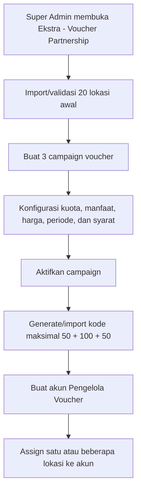
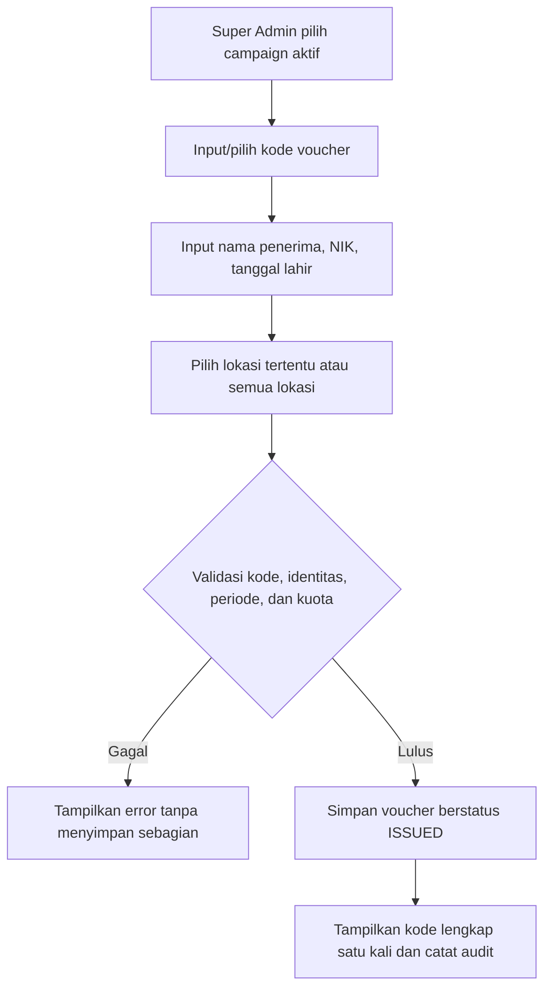
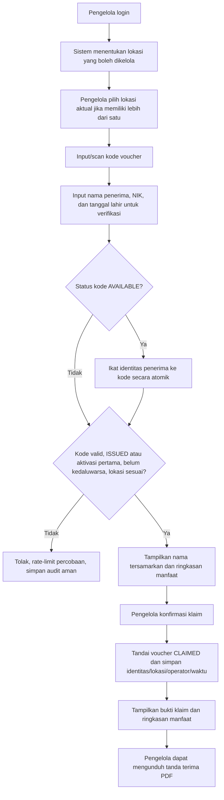

# Requirement Flow Fitur Voucher Partnership

Tanggal dokumen: 1 September 2026  
Status: Draft requirement untuk review Product Owner, Operasional, Finance, dan Engineering

## 1. Tujuan

Menyediakan fitur voucher terpusat untuk Program Sosial dan Special Gift Voucher yang dapat:

- menerbitkan maksimal 200 kode voucher dalam tiga campaign;
- mengikat voucher kepada nama penerima, NIK, dan tanggal lahir;
- membatasi atau mencatat tempat klaim dari master cabang/partner;
- diklaim satu kali oleh petugas yang berwenang;
- mencatat klaim manfaat BASIC dan/atau BOOSTER secara mandiri tanpa membuat member, paket, atau sesi terapi;
- dikelola oleh Super Admin dan akun pengelola khusus;
- diaudit dari penerbitan sampai klaim selesai.

## 2. Definisi dan asumsi dasar

1. Satu **kode voucher campaign** adalah satu hak klaim, bukan satu sesi terapi.
2. Setelah kode berhasil diklaim, sistem hanya mencatat identitas penerima, lokasi, operator, waktu, dan ringkasan manfaat pada voucher.
3. Voucher Partnership fase ini tidak membuat `MemberPackage`, saldo sesi, invoice, atau `TreatmentSession`.
4. **Klaim** berarti aktivasi pertama kode voucher untuk penerima. Klaim berbeda dari pemakaian sesi terapi.
5. Kuota 50/100/50 adalah batas kode yang dapat diterbitkan pada masing-masing campaign, sehingga total awal adalah 200 kode.
6. Data NIK dan tanggal lahir adalah data sensitif. Nilai lengkap tidak boleh tampil pada tabel, log aplikasi, audit description, atau export operator.
7. Lokasi partner tidak selalu merupakan `Branch` ERP. Karena itu master lokasi klaim dibuat terpisah dan dapat memiliki relasi opsional ke `Branch`.

## 3. Campaign voucher awal

| Kode campaign usulan | Kuota | Judul | Manfaat | Nilai komersial |
|---|---:|---|---|---:|
| `SOCIAL-15B-10BST` | 50 | Voucher Program Sosial Raho Club – 15× Infus + 10× Booster | 15 sesi BASIC/Infus Nano Bubble HHO dan 10 sesi BOOSTER | Rp22.500.000 total |
| `GIFT-10B` | 100 | Special Gift Voucher – 10× Nano Bubble HHO Basic | 10 sesi BASIC tanpa BOOSTER | Belum ditetapkan; perlu keputusan apakah Rp0/gratis |
| `SOCIAL-15B` | 50 | Voucher Program Sosial Raho Club – 15× Nano Bubble HHO Basic | 15 sesi BASIC tanpa BOOSTER | Rp500.000 per sesi; Rp7.500.000 total |

### 3.1 Deskripsi resmi

**Campaign `SOCIAL-15B-10BST`**

> Voucher khusus Program Sosial Raho Club untuk 15× sesi Infus Nano Bubble HHO dan 10× Booster dengan harga spesial Rp22.500.000. Berlaku sesuai syarat dan ketentuan program.

**Campaign `GIFT-10B`**

> Voucher untuk 10× sesi terapi Nano Bubble HHO Basic tanpa Booster di Raho Club Premier. Berlaku sesuai syarat dan ketentuan voucher.

**Campaign `SOCIAL-15B`**

> Voucher untuk 15× sesi terapi Nano Bubble HHO Basic tanpa Booster di Raho Club Premier dengan harga Rp500.000 per 1× Infus. Berlaku sesuai syarat dan ketentuan voucher.

### 3.2 Konfigurasi campaign oleh Super Admin

Setiap campaign mempunyai:

- kode dan judul unik;
- deskripsi dan syarat/ketentuan versi terkunci;
- kuota penerbitan;
- jumlah sesi BASIC;
- jumlah sesi BOOSTER;
- jenis BOOSTER bila diwajibkan;
- harga per sesi dan/atau harga total;
- tanggal mulai dan berakhir penerbitan;
- tanggal mulai dan berakhir klaim;
- masa berlaku manfaat setelah klaim;
- kebijakan lokasi: semua lokasi aktif atau lokasi tertentu;
- mode kode: dibuat otomatis atau kode eksternal yang diinput/import Super Admin;
- status `DRAFT`, `ACTIVE`, `PAUSED`, atau `CLOSED`.

Campaign yang sudah mempunyai voucher `ISSUED` atau `CLAIMED` tidak boleh mengubah kuota ke bawah, manfaat, harga, atau versi syarat secara langsung. Perubahan material harus membuat versi campaign baru.

## 4. Role, akun, dan permission

### 4.1 Role baru

Tambahkan role dasar `VOUCHER_OPERATOR` dengan nama tampilan **Pengelola Voucher**.

Super Admin dapat membuat akun pengelola dengan:

- nama lengkap;
- username unik, case-insensitive;
- password awal yang ditentukan Super Admin;
- satu atau beberapa lokasi klaim yang diizinkan;
- status aktif/nonaktif;
- tanggal berakhir akses opsional.

Password disimpan dalam bentuk hash, tidak pernah dapat dibaca kembali, dan harus diganti oleh pengelola pada login pertama. Super Admin hanya dapat melakukan reset ke password sementara baru.

### 4.2 Permission yang disarankan

| Permission | Super Admin | Admin Manager | Pengelola Voucher |
|---|:---:|:---:|:---:|
| `VOUCHER.VIEW` | Ya | Ya, seluruh lokasi aktif | Ya, lokasi sendiri |
| `VOUCHER.CLAIM` | Ya | Ya, seluruh lokasi aktif | Ya, lokasi sendiri |
| `VOUCHER.CLAIM_HISTORY` | Ya | Ya, seluruh lokasi aktif | Ya, lokasi sendiri |
| `VOUCHER.CLAIM_RECEIPT_DOWNLOAD` | Ya | Ya, seluruh lokasi aktif | Ya, lokasi sendiri |
| `VOUCHER.ISSUE` | Ya | Ya, wajib memilih satu lokasi aktif | Tidak |
| `VOUCHER.CORRECT_RECIPIENT` | Ya | Tidak | Tidak |
| `VOUCHER.CANCEL` | Ya | Tidak | Tidak |
| `VOUCHER.CAMPAIGN_MANAGE` | Ya | Tidak | Tidak |
| `VOUCHER.LOCATION_MANAGE` | Ya | Tidak | Tidak |
| `VOUCHER.OPERATOR_MANAGE` | Ya | Tidak | Tidak |
| `VOUCHER.REPORT_EXPORT` | Ya | Tidak | Tidak secara default |

Akun pengelola tidak memperoleh akses ke member umum, finance, stok, data klinis, pengaturan sistem, atau menu Super Admin lainnya.

## 5. Struktur menu dan halaman

Tambahkan grup sidebar **Ekstra**.

```text
Ekstra
└── Voucher Partnership              SUPER_ADMIN, ADMIN_MANAGER, VOUCHER_OPERATOR
    ├── Klaim Voucher                SUPER_ADMIN, ADMIN_MANAGER, VOUCHER_OPERATOR
    ├── Riwayat Klaim                SUPER_ADMIN, ADMIN_MANAGER, VOUCHER_OPERATOR
    ├── Daftar & Terbitkan           SUPER_ADMIN, ADMIN_MANAGER
    ├── Campaign                     SUPER_ADMIN
    ├── Lokasi Klaim                 SUPER_ADMIN
    └── Akun Pengelola               SUPER_ADMIN
```

Rute yang disarankan:

- `/extra/vouchers` — dashboard dan klaim;
- `/extra/vouchers/history` — riwayat sesuai scope;
- `/extra/vouchers/registry` — daftar voucher;
- `/extra/vouchers/campaigns` — setup campaign;
- `/extra/vouchers/locations` — setup lokasi;
- `/extra/vouchers/operators` — setup akun pengelola.

Setelah login, `VOUCHER_OPERATOR` langsung diarahkan ke `/extra/vouchers`.

## 6. Form registrasi/penerbitan voucher

Super Admin dan Admin Manager dapat menerbitkan dan mengikat voucher ke penerima sebelum klaim. Admin Manager wajib memilih satu lokasi klaim aktif, sedangkan Super Admin dapat memilih semua lokasi aktif. Kode cetak berstatus `AVAILABLE` juga dapat langsung diikat ke identitas penerima pada klaim pertama. Penerima tidak harus terdaftar sebagai member ERP.

### 6.1 Field wajib

| Field | Aturan |
|---|---|
| Campaign voucher | Pilihan dari campaign `ACTIVE` yang masih memiliki kuota |
| Kode voucher | Unik; otomatis secara default atau input manual jika campaign mengizinkan |
| Nama penerima | Wajib, 2–150 karakter, dinormalisasi tanpa mengubah nama asli |
| NIK | Wajib, tepat 16 digit, simpan secara terlindungi dan sediakan hash untuk pencarian exact-match |
| Tanggal lahir | Wajib, tanggal valid, tidak boleh di masa depan |
| Lokasi klaim | Satu lokasi tertentu atau “Semua lokasi aktif” sesuai kebijakan campaign |
| Batas klaim | Mengikuti campaign; dapat dipersempit per voucher oleh Super Admin |
| Catatan internal | Opsional; tidak tampil kepada operator kecuali diizinkan |

### 6.2 Aturan penerbitan

- Kode dinormalisasi menjadi uppercase dan spasi di awal/akhir dihapus.
- Kode otomatis memakai karakter yang tidak ambigu dan tidak boleh berupa nomor berurutan yang mudah ditebak.
- Sistem menolak kode duplikat secara case-insensitive.
- Penerbitan harus memakai transaksi dan lock kuota agar dua request bersamaan tidak melewati batas 50/100/50.
- NIK yang sama tidak boleh menerima dua voucher aktif dalam campaign yang sama, kecuali override Super Admin dengan alasan audit.
- Daftar hanya menampilkan kode tersamarkan, misalnya `RAHO-****-8K2P`, dan NIK `3173********1234`.
- Kode lengkap hanya ditampilkan saat berhasil dibuat atau tersedia pada dokumen distribusi yang aksesnya dibatasi.
- Penerbitan menghasilkan status `ISSUED` dan audit event `VOUCHER_ISSUED`.

### 6.3 Pembuatan campaign baru

- Super Admin dapat membuat campaign voucher baru tanpa dibatasi pada tiga campaign seed awal.
- Form menyediakan kode, judul, deskripsi, kuota, manfaat BASIC/BOOSTER, jenis booster, harga, periode penerbitan dan klaim, masa berlaku manfaat, kebijakan lokasi, mode kode, syarat, dan status awal.
- Kode dan judul campaign wajib unik; kode dinormalisasi menjadi uppercase.
- Minimal salah satu manfaat BASIC atau BOOSTER harus lebih dari nol.
- Campaign baru tidak mengubah campaign maupun voucher historis yang sudah ada.
- Pembuatan campaign dicatat pada audit dan hanya tersedia untuk Super Admin.

## 7. Status voucher

```text
DRAFT/AVAILABLE
      │ diterbitkan dan diikat ke penerima
      ▼
    ISSUED ───────────────► CANCELLED
      │ klaim sukses           ▲
      ▼                        │ hanya sebelum klaim
    CLAIMED
```

Aturan:

- `AVAILABLE`: kode sudah dialokasikan ke campaign tetapi belum diikat ke penerima.
- `ISSUED`: kode sudah memiliki penerima dan dapat diklaim.
- `CLAIMED`: kode sudah diaktivasi tepat satu kali dan tidak dapat diklaim ulang.
- `EXPIRED`: masa klaim berakhir sebelum voucher diklaim.
- `CANCELLED`: dibatalkan Super Admin sebelum klaim dengan alasan wajib.
- Status historis tidak boleh dihapus secara fisik.

## 8. Flow end-to-end

### 8.1 Setup awal oleh Super Admin



### 8.2 Penerbitan kepada penerima



### 8.3 Klaim oleh pengelola



### 8.4 Riwayat klaim dan tanda terima

- Pengelola dapat melihat daftar voucher berstatus `CLAIMED` hanya pada lokasi assignment aktifnya.
- Daftar dapat dicari berdasarkan nama penerima, empat digit terakhir NIK atau kode, campaign, nama lokasi, dan kota.
- Filter campaign dan lokasi serta pagination diproses di server agar tetap cepat untuk histori besar.
- Setiap klaim menyediakan tanda terima PDF berisi nomor bukti, identitas tersamarkan, campaign, manfaat, waktu Asia/Jakarta, lokasi, dan petugas pemroses.
- Download PDF memvalidasi ulang scope lokasi di server dan dicatat sebagai audit `EXPORT`.
- Tanda terima tidak menampilkan NIK atau kode voucher lengkap.

### 8.5 Pemenuhan manfaat

1. Sistem Voucher Partnership hanya mencatat bahwa voucher sudah diklaim.
2. Nilai BASIC/BOOSTER ditampilkan sebagai ringkasan campaign, bukan saldo sesi ERP.
3. Tidak dibuat `MemberPackage`, invoice, pembayaran, atau sesi terapi pada saat klaim.
4. Pelaksanaan manfaat setelah klaim berada di luar integrasi fase ini dan tidak mengubah status berdasarkan pemakaian sesi.

## 9. Master lokasi klaim awal

Sumber: `List Cabang dan Partner Raho Non Format - NEW PARTNERSHIP.csv` dari pengguna. File diperlakukan sebagai sumber data awal, bukan konfigurasi permanen.

| ID seed | Tempat layanan | Kota | Partner/keterangan dari sumber |
|---|---|---|---|
| `VCL-001` | Raho Club Premier Jakarta | Jakarta | — |
| `VCL-002` | Raho Club Premier Menara Batavia | Jakarta | — |
| `VCL-003` | Raho Club Premier D'Botanica | Bandung | — |
| `VCL-004` | Klinik Griya Sehat HWA | Makassar | Konstan (Makassar & Kendari) |
| `VCL-005` | Griya Sehat HWA | Kendari | — |
| `VCL-006` | Klinik Utama O2 | Jakarta | Rio (Klinik O2) |
| `VCL-007` | Attiya Reverse Aging | Jakarta | Klinik ATTIYA |
| `VCL-008` | Attiya Reverse Aging | Semarang | — |
| `VCL-009` | Raho Club Premier Bandung | Bandung | Indra (Bandung) |
| `VCL-010` | Klinik Kecantikan Edmee Clinic | Jakarta | Ministry |
| `VCL-011` | Timeless Aesthetic Clinic Medan | Medan | — |
| `VCL-012` | Klinik Kecantikan Ministry Treatment - Hair, Beauty & Wellness | Jakarta | — |
| `VCL-013` | Raho Club Premier Grand Orchard Kelapa Gading | Jakarta | Eddy Santoso (Seli) |
| `VCL-014` | Raho Club Premier Batam | Batam | Sendjaja Tjandra (Ciska) |
| `VCL-015` | Raho Club Premier Pekanbaru | Pekanbaru | Sunarto Kwok |
| `VCL-016` | Quantum Wellness Center | Serpong | Bambang Santoso |
| `VCL-017` | Glowing Anti Aging & Wellness | Jakarta | Magdalena Vandry |
| `VCL-018` | Raho Premier Bali (Apotek Hannah) | Bali | Janti (Bali) |
| `VCL-019` | Raho Club Premier Jambi | Jambi | Mario Liberty (Inge) |
| `VCL-020` | Inti Sehat Medika (Ibu Lena) | Jambi | — |

### 9.1 Aturan import dan setup lokasi

- Gunakan ID internal; kolom `NO` sumber tidak boleh menjadi primary key karena nilai `16` duplikat.
- Identitas lokasi minimal terdiri dari nama tempat + kota; nama tempat saja tidak unik.
- Simpan `partnerName`, alamat, nomor HP, tautan Maps, dan referensi foto sebagai metadata opsional.
- Bersihkan newline, whitespace berulang, non-breaking space, dan karakter encoding tanpa membuang nilai asli sumber.
- Nomor HP tetap disimpan sebagai string agar angka `0` di depan tidak hilang.
- Lokasi dengan nomor HP kosong tetap boleh diimport tetapi diberi status kelengkapan `INCOMPLETE`.
- Tautan foto pada CSV hanya nama file, bukan file fisik; foto tidak dianggap tersedia sampai diunggah dan diverifikasi.
- Dropdown lokasi dikelompokkan menjadi `RAHO_REGULER`, `RAHO_PREMIER`, dan `PARTNER`.
- Super Admin dapat menambahkan dan menonaktifkan lokasi. Aksi hapus menggunakan soft delete agar histori klaim tetap utuh.
- Lokasi yang masih menjadi batas lokasi voucher `AVAILABLE` atau `ISSUED` tidak dapat dinonaktifkan.
- Setiap akun pengelola harus memiliki sedikitnya satu lokasi aktif.

### 9.2 Lokasi awal RAHO Reguler

| ID seed | Tempat layanan | Kota |
|---|---|---|
| `VCL-REG-001` | RAHO Citraland | Surabaya |
| `VCL-REG-002` | RAHO Metropolis | Surabaya |
| `VCL-REG-003` | RAHO Armada | Surabaya |
| `VCL-REG-004` | RAHO Premier Darmo Hill | Surabaya |
| `VCL-REG-005` | RAHO Premier Jaksa Agung | Surabaya |
| `VCL-REG-006` | RAHO Banjarmasin | Banjarmasin |
| `VCL-REG-007` | RAHO Bogor | Bogor |
| `VCL-REG-008` | RAHO Malang | Malang |
| `VCL-REG-009` | RAHO Tulungagung | Tulungagung |
| `VCL-REG-010` | RAHO Solo | Solo |
| `VCL-REG-011` | RAHO Kelapa Gading | Jakarta |
| `VCL-REG-012` | RAHO BSD/Tangerang | Tangerang Selatan |
| `VCL-REG-013` | RAHO PIK2 | Tangerang |
| `VCL-REG-014` | RAHO Lippo Mall Nusantara | Jakarta |

## 10. Model data konseptual

### `VoucherCampaign`

- `id`, `code`, `version`, `title`, `description`;
- `quota`, `issuedCount`, `claimedCount`;
- `basicSessions`, `boosterSessions`, `boosterType`;
- `unitPrice`, `totalPrice`, `currency`;
- `issueStartAt`, `issueEndAt`, `claimStartAt`, `claimEndAt`, `benefitExpiresAt`;
- `termsSnapshot`, `locationPolicy`, `codeMode`, `status`;
- `createdBy`, `updatedBy`, timestamps.

### `CampaignVoucher`

- `id`, `campaignId`;
- `codeHash`, `codeLast4`, dan nilai kode terenkripsi bila harus dicetak ulang;
- `recipientName`, `nikEncrypted`, `nikHash`, `nikLast4`, `dateOfBirth`;
- `allowedLocationId` nullable untuk semua lokasi;
- `status`, `issuedAt`, `claimDeadline`, `cancelledAt`, `cancelReason`;
- `claimedAt`, `claimedLocationId`, `claimedBy`;
- `createdBy`, `updatedBy`, timestamps.

### `VoucherClaimLocation`

- `id`, `code`, `displayName`, `locationGroup`, `partnerName`, `city`, `address`;
- `phone`, `mapsUrl`, `frontPhotoUrl`;
- `branchId` nullable, `sourceReference`, `dataCompletenessStatus`, `isActive`;
- `createdBy`, `updatedBy`, timestamps.

### `VoucherOperatorLocation`

- `userId`, `locationId`, `assignedBy`, `assignedAt`, `validUntil`;
- unique `(userId, locationId)`.

### `VoucherClaimAttempt`

- `voucherId` nullable, `operatorId`, `locationId`, `result`, `failureCode`;
- `requestId/idempotencyKey`, `attemptedAt`;
- tidak menyimpan kode voucher, NIK, atau tanggal lahir mentah.

## 11. Pemisahan dari member, paket, sesi, dan finance

1. Nama, NIK, dan tanggal lahir disimpan sebagai identitas voucher, bukan sebagai profil member ERP.
2. NIK disimpan sebagai keyed hash untuk pencocokan exact-match dan empat digit terakhir untuk masking.
3. Klaim tidak membuat atau mengubah `User`, `Member`, `MemberPackage`, invoice, payment, maupun `TreatmentSession`.
4. Nilai BASIC/BOOSTER pada campaign merupakan informasi hak voucher dan tidak menjadi saldo sesi ERP.
5. Retry dengan `idempotencyKey` yang sama mengembalikan hasil klaim lama tanpa membuat klaim kedua.
6. Pencatatan finance dan pelaksanaan terapi, bila diperlukan kemudian, merupakan integrasi fase lanjutan.

## 12. Validasi dan pesan kegagalan

| Kode error | Kondisi |
|---|---|
| `VOUCHER_NOT_FOUND` | Kode tidak ada; response publik tetap generik agar tidak dapat menebak kode |
| `VOUCHER_NOT_ISSUED` | Kode belum diikat ke penerima |
| `VOUCHER_ALREADY_CLAIMED` | Kode telah diklaim |
| `VOUCHER_EXPIRED` | Periode klaim berakhir |
| `VOUCHER_CANCELLED` | Voucher dibatalkan |
| `VOUCHER_LOCATION_NOT_ALLOWED` | Lokasi aktual tidak sesuai kebijakan voucher/operator |
| `VOUCHER_IDENTITY_MISMATCH` | Nama penerima, NIK, atau tanggal lahir tidak cocok |
| `VOUCHER_CAMPAIGN_QUOTA_EXCEEDED` | Kuota campaign habis |
| `VOUCHER_CLAIM_FAILED` | Transaksi pencatatan klaim gagal; voucher tetap dapat dicoba ulang |

Setelah lima percobaan gagal dalam 15 menit oleh akun/IP yang sama, klaim diblokir sementara dan dicatat sebagai security event. Batas dapat dikonfigurasi oleh Super Admin tetapi tidak boleh dimatikan di production.

## 13. Audit, keamanan, dan privasi

- Semua aksi `CREATE_CAMPAIGN`, `ISSUE`, `CLAIM`, `CANCEL`, `CORRECT_RECIPIENT`, `RESET_OPERATOR_PASSWORD`, dan perubahan lokasi dicatat.
- Audit menyimpan actor, waktu Asia/Jakarta, lokasi, object ID, before/after yang aman, serta alasan untuk aksi sensitif.
- Jangan mencatat kode lengkap, NIK lengkap, tanggal lahir lengkap, password, atau payload identitas di application log.
- API list hanya mengirim nilai tersamarkan. Detail lengkap hanya digunakan server untuk verifikasi.
- Endpoint dilindungi autentikasi, permission, scope lokasi, rate limit, dan CSRF policy yang berlaku.
- Klaim memakai transaksi database dan constraint unik pada voucher agar dua operator tidak dapat mengklaim kode yang sama.
- Akun nonaktif atau lokasi nonaktif langsung kehilangan hak klaim.
- Export Super Admin harus terenkripsi saat disimpan dan memiliki audit download; operator tidak memiliki export data identitas.
- Retensi data penerima dan prosedur koreksi/penghapusan harus disetujui pemilik kebijakan privasi sebelum go-live.

## 14. Dashboard dan laporan

Super Admin melihat:

- kuota, terbit, belum diklaim, diklaim, kedaluwarsa, dan dibatalkan per campaign;
- klaim per lokasi dan periode;
- ringkasan manfaat BASIC/BOOSTER dari campaign yang diklaim;
- anomali percobaan gagal tinggi dan konflik identitas;
- rekonsiliasi jumlah kode `AVAILABLE`, `ISSUED`, dan `CLAIMED`.

Pengelola hanya melihat:

- klaim hari ini pada lokasi yang ditugaskan;
- status klaim tanpa NIK lengkap;
- riwayat klaim yang dapat dicari pada lokasi scope-nya;
- tombol download tanda terima PDF untuk klaim dalam scope-nya.

## 15. Acceptance criteria/UAT minimum

1. Super Admin dapat membuat, mengubah draft, mengaktifkan, pause, dan menutup campaign.
2. Campaign awal tidak dapat menerbitkan voucher ke-51, ke-101, dan ke-51 secara berurutan.
3. Total kapasitas awal terbaca 200 tanpa menghitung kode yang gagal dibuat.
4. Form menolak NIK bukan 16 digit dan tanggal lahir masa depan.
5. Kode duplikat ditolak secara case-insensitive.
6. Super Admin dapat memilih salah satu dari 20 lokasi awal atau semua lokasi aktif.
7. Akun pengelola dapat login menggunakan username/password yang ditetapkan Super Admin.
8. Pengelola hanya melihat grup **Ekstra** dan fitur voucher yang diizinkan.
9. Pengelola tidak dapat mengklaim pada lokasi di luar assignment.
10. Claim dengan kode + nama penerima + NIK + DOB benar berhasil tepat satu kali.
11. Dua request paralel terhadap kode yang sama menghasilkan tepat satu klaim.
12. Refresh/retry setelah sukses tidak membuat klaim ganda.
13. Klaim menampilkan ringkasan 15 BASIC dan 10 BOOSTER tanpa membuat paket atau sesi.
14. Klaim `GIFT-10B` menampilkan 10 BASIC dan 0 BOOSTER tanpa membuat paket atau sesi.
15. Klaim `SOCIAL-15B` menampilkan 15 BASIC dan 0 BOOSTER tanpa membuat paket atau sesi.
16. Kegagalan transaksi klaim tidak mengubah voucher menjadi `CLAIMED`.
17. Penerima tidak harus menjadi member ERP.
18. Klaim voucher tidak membuat atau mengubah data member.
19. Daftar, audit, error, dan log tidak menampilkan NIK/kode lengkap.
20. Lokasi atau operator yang telah memiliki histori tidak dapat dihapus; hanya dapat dinonaktifkan.
21. Kode cetak `AVAILABLE` dapat langsung diklaim menggunakan nama, NIK, dan DOB penerima; transaksi menaikkan `issuedCount` dan `claimedCount` masing-masing tepat satu kali.
22. Tanggal lahir masa depan ditolak sebelum percobaan klaim dicatat dan tidak ikut memicu rate limit.
23. Pengelola dapat mencari klaim berdasarkan nama, empat digit terakhir NIK/kode, campaign, atau lokasi tanpa melihat data lengkap.
24. Pengelola hanya dapat membuka dan mengunduh tanda terima PDF untuk klaim dalam scope lokasi aktifnya.
25. Tanda terima PDF memuat nomor bukti, identitas tersamarkan, manfaat, lokasi, waktu klaim, serta petugas dan download tercatat di audit.
26. Admin Manager dengan akses penuh dapat menerbitkan voucher dengan memilih satu lokasi klaim aktif.
27. Admin Manager dengan scope `MEMBER_VIEW_ONLY` tidak dapat menerbitkan voucher.

## 16. Keputusan bisnis yang wajib ditutup sebelum development

1. Apakah `GIFT-10B` benar-benar gratis (`Rp0`) atau mempunyai harga/nilai invoice tertentu?
2. Untuk campaign Rp22.500.000 dan Rp7.500.000, apakah pembayaran dicatat di luar sistem sebelum penerbitan atau saat klaim?
3. Sepuluh BOOSTER pada campaign pertama menggunakan jenis BOOSTER tetap, dipilih penerima, atau saldo generik?
4. Berapa tanggal mulai, batas klaim, dan masa berlaku manfaat setiap campaign?
5. Apakah satu NIK boleh menerima voucher dari lebih dari satu campaign secara bersamaan?
6. Apakah voucher hanya berlaku pada satu lokasi yang dipilih saat penerbitan atau semua lokasi aktif?
7. Diputuskan untuk fase ini: penerima tidak harus menjadi member dan klaim tidak membuat member minimum.
8. Apakah kode harus dibuat sistem, diinput manual, atau diimport dari daftar kode eksternal?
9. Apakah voucher dapat dialihkan ke penerima lain sebelum klaim? Default requirement: tidak dapat dialihkan tanpa koreksi Super Admin dan audit.
10. Apakah foto tampak depan lokasi akan diunggah pada fase ini? CSV hanya berisi nama file foto.

## 17. Out of scope fase awal

- desain grafis/printing voucher fisik;
- pengiriman kode otomatis melalui WhatsApp/email;
- marketplace atau penjualan publik voucher;
- transfer voucher mandiri antar penerima;
- refund setelah voucher diklaim;
- pembuatan paket, saldo sesi, sesi terapi, invoice, dan integrasi finance dari klaim voucher;
- perubahan flow klinis atau inventori existing.

## 18. Urutan implementasi yang disarankan

1. Finalisasi keputusan bisnis bagian 16.
2. Tambahkan schema additive, permission, role, dan seed 20 lokasi.
3. Implementasi campaign, kuota, kode, dan registrasi penerima.
4. Implementasi akun pengelola dan scope lokasi.
5. Implementasi claim standalone yang atomik dan idempotent tanpa paket atau sesi existing.
6. Tambahkan menu grup **Ekstra**, dashboard, halaman klaim, dan setup Super Admin.
7. Tambahkan audit, masking, rate limit, rekonsiliasi, dan laporan.
8. Jalankan unit, integration, concurrency, authorization, migration-safety, dan UAT 20 acceptance criteria.
9. Deploy dengan backup terverifikasi dan migration additive; jangan mengubah paket/member lama.
