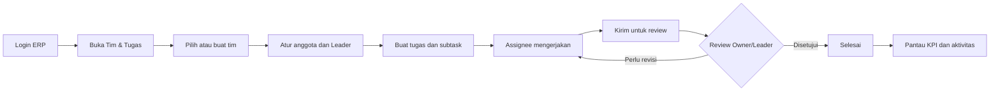

# Tutorial Penggunaan Dashboard Monitoring Tim & Tugas

Dokumen ini menjelaskan penggunaan fitur **Dashboard Monitoring** pada modul
**Tim & Tugas**, mulai dari login hingga pemantauan dan penyelesaian tugas.
Panduan mengikuti tampilan dan fungsi aplikasi yang tersedia saat ini.

## 1. Siapa yang dapat menggunakan fitur ini?

Fitur tersedia untuk seluruh akun internal ERP yang aktif, antara lain Super
Admin, Admin Manager, Admin Cabang, Admin Layanan, Admin Logistik, Finance &
Logistics Controller, Dokter, Perawat, dan Voucher Operator.

Akun Member tidak menggunakan modul ini karena memiliki portal tersendiri.

Hak akses pada modul ditentukan oleh role di dalam masing-masing tim:

| Role tim | Kemampuan utama |
|---|---|
| `OWNER` | Membuat dan mengarsipkan tim, menambah anggota, mengubah role anggota, menentukan Primary Leader, membuat tugas, membuat subtask, memantau seluruh tugas, dan melakukan review. |
| `LEADER` | Membuat tugas dan subtask, menentukan assignee, memantau pekerjaan, meminta revisi, menyetujui tugas, dan membatalkan tugas. |
| `STAFF` | Melihat pekerjaan sesuai akses, memulai tugas yang diberikan, mengirim hasil untuk review, dan menulis komentar. |

Role tim berbeda dari role akun ERP. Contohnya, seorang Dokter dapat menjadi
`STAFF` di Tim Operasional dan menjadi `OWNER` pada tim lain yang dibuatnya.

## 2. Ringkasan alur



## 3. Login ke ERP

1. Buka alamat aplikasi ERP yang diberikan administrator.
2. Pada kolom **Username atau Email**, masukkan username atau email akun.
3. Masukkan password pada kolom **Password**.
4. Gunakan ikon mata jika perlu melihat atau menyembunyikan password.
5. Klik **Masuk**.
6. Tunggu sampai aplikasi membuka dashboard sesuai role akun.

Catatan keamanan:

- Password bersifat case-sensitive.
- Jangan membagikan password kepada pengguna lain.
- Jika akun tidak dapat login atau tidak aktif, hubungi administrator.
- Percobaan login yang gagal berulang kali dapat terkena pembatasan sementara.

## 4. Membuka Dashboard Monitoring

1. Pada sidebar kiri, cari bagian **Ekstra**.
2. Buka menu **Tim & Tugas**.
3. Pilih **Dashboard Monitoring**.

Alamat halaman secara langsung adalah:

```text
/extra/collaboration
```

Di dalam menu **Tim & Tugas** tersedia tiga halaman:

| Menu | Fungsi |
|---|---|
| **Dashboard Monitoring** | Melihat KPI, fokus pekerjaan terbaru, aktivitas tim, jumlah anggota, dan Primary Leader. |
| **Tugas & Subtask** | Mencari, memfilter, membuka, dan mengelola tugas beserta subtask. |
| **Tim Saya** | Melihat anggota, role dalam tim, aturan visibilitas, dan mengatur Primary Leader. |

## 5. Memilih tim yang dipantau

Jika akun tergabung dalam lebih dari satu tim:

1. Cari dropdown **Tim aktif** di bagian atas halaman.
2. Pilih tim yang ingin dipantau.
3. Perhatikan role yang tertulis setelah nama tim, misalnya `OWNER`, `LEADER`,
   atau `STAFF`.
4. Dashboard dan daftar tugas akan otomatis menampilkan data tim yang dipilih.

Data tim lain tidak digabungkan ke dashboard. Pastikan pilihan **Tim aktif**
sudah benar sebelum membuat tugas atau membaca KPI.

## 6. Membuat tim baru

Setiap akun internal aktif dapat membuat tim. Pembuat tim otomatis menjadi
`OWNER` sekaligus Primary Leader awal.

1. Klik **Buat Tim** pada bagian kanan atas.
2. Isi **Nama tim** minimal 3 karakter.
3. Isi **Deskripsi** untuk menjelaskan tujuan atau ruang lingkup tim.
4. Pilih **Visibilitas tugas**:

   - **Semua anggota tim**: seluruh anggota aktif dapat melihat tugas tim.
   - **Hanya assignee dan leader**: Staff hanya melihat tugas yang dibuatnya,
     ditugaskan kepadanya, atau memiliki subtask yang ditugaskan kepadanya.

5. Klik **Buat Tim**.
6. Pastikan tim baru muncul pada dropdown **Tim aktif**.

## 7. Menambah anggota dan menentukan Leader

Pengaturan anggota hanya tersedia untuk `OWNER`.

### 7.1 Menambah anggota

1. Buka **Tim & Tugas > Tim Saya**.
2. Pilih tim melalui dropdown **Tim aktif**.
3. Klik **Tambah Anggota**.
4. Pilih akun ERP yang aktif.
5. Tentukan role awal **Staff** atau **Leader**.
6. Klik **Tambahkan**.

Akun Member dan akun yang tidak aktif tidak dapat ditambahkan. Satu akun hanya
memiliki satu membership aktif dalam tim yang sama.

### 7.2 Mengubah role anggota

1. Pada daftar anggota, cari anggota yang ingin diubah.
2. Gunakan dropdown role untuk memilih `STAFF` atau `LEADER`.
3. Tunggu sampai data tim dimuat ulang.

Role `OWNER` tidak dapat diubah dari menu anggota.

### 7.3 Menentukan Primary Leader

1. Pastikan calon Primary Leader memiliki role `LEADER` atau `OWNER`.
2. Klik **Jadikan Leader** pada anggota yang dipilih.
3. Pastikan label **Primary Leader** berpindah ke anggota tersebut.
4. Periksa perubahan pada bagian **Aktivitas tim** di Dashboard Monitoring.

Primary Leader lama tidak dapat diturunkan menjadi Staff sebelum Primary
Leader baru ditentukan.

Owner juga dapat merangkap sebagai Primary Leader. Jika Primary Leader sedang
dipegang anggota lain, Owner dapat membukanya langsung melalui **Dashboard
Monitoring**, lalu menekan **Jadikan Saya Primary Leader** pada ringkasan tim.
Saat Owner menjadi Primary Leader, dashboard menampilkan keterangan **Anda
sebagai OWNER sekaligus Primary Leader**.

## 8. Membuat tugas

Tugas hanya dapat dibuat oleh `OWNER` atau `LEADER` pada tim yang sedang aktif.

1. Pastikan tim yang benar sudah dipilih pada dropdown **Tim aktif**.
2. Klik **Tugas Baru**.
3. Lengkapi form:

   - **Judul**: wajib, minimal 3 karakter.
   - **Deskripsi**: konteks pekerjaan dan hasil yang diharapkan.
   - **Prioritas**: Rendah, Sedang, Tinggi, atau Mendesak.
   - **Tenggat**: tanggal dan jam batas penyelesaian.
   - **Assignee**: satu atau beberapa anggota aktif dalam tim.

4. Klik **Buat Tugas**.
5. Buka **Tugas & Subtask** untuk memastikan tugas sudah tercatat.

Tugas baru memiliki nomor otomatis, misalnya `#1`, dan status awal **Belum
dimulai**.

## 9. Membuat subtask

Subtask digunakan untuk membagi satu tugas besar menjadi pekerjaan yang lebih
kecil.

1. Buka menu **Tugas & Subtask**.
2. Cari parent task yang akan diberi subtask.
3. Klik tombol **+** di sisi kanan kartu tugas.
4. Isi judul, deskripsi, prioritas, tenggat, dan assignee subtask.
5. Aktifkan **Subtask wajib diselesaikan sebelum parent task** jika subtask
   tersebut menjadi syarat penyelesaian parent.
6. Klik **Tambah Subtask**.
7. Gunakan ikon panah pada sisi kiri parent task untuk membuka atau menutup
   daftar subtask.

Ketentuan penting:

- Subtask harus berada di tim yang sama dengan parent task.
- Tenggat subtask tidak boleh melewati tenggat parent jika parent memiliki
  tenggat.
- Satu parent task dapat memiliki maksimal 50 subtask aktif.
- Parent task tidak dapat disetujui selesai selama subtask wajib masih terbuka.
- Progress pada kartu parent dihitung dari subtask wajib yang selesai atau
  dibatalkan.

## 10. Mengerjakan tugas sebagai assignee

### 10.1 Memulai tugas

1. Buka **Tim & Tugas > Tugas & Subtask**.
2. Pilih tim yang sesuai.
3. Klik kartu tugas atau subtask yang diberikan kepada Anda.
4. Periksa deskripsi, prioritas, tenggat, assignee, dan pembuat tugas.
5. Klik **Mulai kerjakan**.

Status berubah dari **Belum dimulai** menjadi **Dikerjakan**.

### 10.2 Memberikan update

1. Buka detail tugas.
2. Pada bagian **Diskusi**, tulis perkembangan, pertanyaan, kendala, atau hasil
   pekerjaan.
3. Klik tombol kirim.

Komentar akan tercatat bersama nama penulis dan waktu aktivitas.

### 10.3 Mengirim pekerjaan untuk review

1. Pastikan pekerjaan dan informasi pendukung sudah lengkap.
2. Buka detail tugas.
3. Klik **Kirim untuk review**.

Status berubah menjadi **Menunggu review**. Setelah ini Owner atau Leader akan
menyetujui hasil atau meminta revisi.

## 11. Melakukan review sebagai Owner atau Leader

1. Buka Dashboard Monitoring.
2. Periksa kartu KPI **Menunggu review**.
3. Pada bagian **Fokus terbaru**, pilih tugas yang ingin diperiksa. Tugas juga
   dapat dibuka melalui menu **Tugas & Subtask**.
4. Baca deskripsi, assignee, tenggat, subtask, dan Diskusi.
5. Pilih salah satu tindakan:

   - **Minta revisi**: masukkan catatan revisi. Status menjadi **Perlu revisi**.
   - **Setujui & selesai**: status menjadi **Selesai**.
   - **Batalkan**: masukkan alasan pembatalan. Status menjadi **Dibatalkan**.

Jika revisi diminta, assignee memperbaiki pekerjaan lalu menekan **Kirim untuk
review** kembali.

Jika parent task mempunyai subtask wajib yang belum selesai atau dibatalkan,
sistem akan menolak penyelesaian parent. Selesaikan dahulu semua subtask wajib.

## 12. Menggunakan halaman Tugas & Subtask

### 12.1 Mencari tugas

Masukkan kata pada kolom **Cari tugas**. Pencarian mencakup judul dan deskripsi.
Daftar akan diperbarui setelah pengguna berhenti mengetik sejenak.

### 12.2 Memfilter status

Gunakan dropdown status untuk menampilkan:

- Semua status;
- Belum dimulai;
- Dikerjakan;
- Menunggu review;
- Perlu revisi;
- Selesai; atau
- Dibatalkan.

Filter dan pencarian berlaku pada tim yang sedang dipilih.

### 12.3 Membaca kartu tugas

Kartu tugas menampilkan:

- nomor dan judul tugas;
- prioritas;
- status;
- tenggat dan tanda terlambat;
- jumlah komentar;
- avatar assignee; dan
- progress subtask wajib.

Klik kartu untuk membuka detail. Klik panah di sisi kiri untuk melihat subtask.

## 13. Membaca Dashboard Monitoring

Dashboard menampilkan KPI berdasarkan tim aktif dan data yang boleh dilihat
oleh akun.

| KPI | Arti |
|---|---|
| **Total pekerjaan** | Jumlah parent task dan subtask yang terlihat oleh pengguna. |
| **Sedang dikerjakan** | Tugas berstatus `IN_PROGRESS`. |
| **Menunggu review** | Tugas yang sudah dikirim assignee dan menunggu Owner/Leader. |
| **Selesai** | Tugas berstatus `COMPLETED`. |
| **Terlambat** | Tugas melewati tenggat dan belum selesai atau dibatalkan. |

Bagian lain pada dashboard:

- **Fokus terbaru** menampilkan maksimal enam pekerjaan teratas yang perlu
  diperhatikan. Klik baris untuk membuka detail.
- **Aktivitas tim** menampilkan maksimal delapan aktivitas terbaru pada layar,
  seperti pembuatan tim, penambahan anggota, pembuatan tugas, komentar, dan
  perubahan status.
- Ringkasan tim menampilkan nama tim, jumlah anggota, role Anda, dan Primary
  Leader.

Pada tim dengan visibilitas **Hanya assignee dan leader**, KPI Staff hanya
menghitung pekerjaan yang boleh dilihat oleh Staff tersebut. Karena itu angka
Staff dapat berbeda dari angka Owner atau Leader.

## 14. Status dan alur yang direkomendasikan

```text
Belum dimulai
    -> Dikerjakan
    -> Menunggu review
        -> Selesai
        -> Perlu revisi -> Menunggu review

Tugas aktif dapat dibatalkan oleh Owner/Leader dengan alasan.
```

Gunakan status secara konsisten:

- Jangan biarkan tugas berstatus **Belum dimulai** jika pekerjaan sudah berjalan.
- Kirim pekerjaan ke **Menunggu review** hanya setelah hasil siap diperiksa.
- Tulis alasan yang jelas ketika meminta revisi atau membatalkan tugas.
- Gunakan komentar untuk menyimpan konteks agar aktivitas tidak hanya dibahas di
  luar aplikasi.

## 15. Mengarsipkan tim

Tindakan ini hanya tersedia untuk `OWNER`.

1. Buka **Tim Saya**.
2. Pilih tim yang akan diarsipkan.
3. Klik **Hapus Tim**.
4. Baca pesan konfirmasi, lalu setujui jika tim memang tidak lagi aktif.

Tombol **Hapus Tim** tidak menghapus data secara permanen. Tim diarsipkan dan
hilang dari daftar aktif, sedangkan tugas serta histori tetap tersimpan.

## 16. Troubleshooting

### Menu Tim & Tugas tidak terlihat

- Pastikan login menggunakan akun internal ERP, bukan akun Member.
- Muat ulang halaman setelah hak akses akun diubah.
- Hubungi administrator jika akun seharusnya merupakan akun internal aktif.

### Tombol Tugas Baru tidak terlihat

- Periksa role pada dropdown **Tim aktif**.
- Tombol hanya tersedia bagi `OWNER` atau `LEADER`.
- Jika Anda `STAFF`, minta Owner mengubah role atau membuat tugas untuk Anda.

### Tugas tertentu tidak terlihat

- Pastikan tim yang dipilih sudah benar.
- Hapus kata pencarian dan pilih filter **Semua status**.
- Pada kebijakan **Hanya assignee dan leader**, Staff hanya melihat tugas sesuai
  assignment atau kepemilikannya.

### Tugas tidak dapat diselesaikan

- Pastikan seluruh subtask wajib sudah **Selesai** atau **Dibatalkan**.
- Muat ulang detail jika muncul pesan bahwa tugas telah berubah. Pesan ini
  mencegah perubahan dari dua pengguna saling menimpa.
- Pastikan aksi dilakukan oleh Owner atau Leader.

### Anggota tidak muncul saat akan ditambahkan

- Pastikan akun anggota aktif dan bukan akun Member.
- Periksa apakah akun tersebut sudah menjadi anggota tim.

### Tenggat subtask ditolak

Atur tenggat subtask agar tidak melewati tenggat parent task.

## 17. Checklist penggunaan cepat

Untuk Owner:

- [ ] Login dan buka **Tim & Tugas**.
- [ ] Buat atau pilih tim.
- [ ] Tambahkan anggota.
- [ ] Tentukan Leader dan Primary Leader.
- [ ] Buat tugas, tenggat, prioritas, dan assignee.
- [ ] Buat subtask jika diperlukan.
- [ ] Pantau KPI dan aktivitas.
- [ ] Review pekerjaan yang dikirim.

Untuk Leader:

- [ ] Pilih tim yang dipimpin.
- [ ] Periksa tugas terlambat dan menunggu review.
- [ ] Buat dan bagikan tugas.
- [ ] Pantau komentar dan progress subtask.
- [ ] Minta revisi atau setujui pekerjaan.

Untuk Staff:

- [ ] Pilih tim yang sesuai.
- [ ] Buka tugas yang diberikan.
- [ ] Klik **Mulai kerjakan**.
- [ ] Berikan update melalui Diskusi.
- [ ] Klik **Kirim untuk review** setelah selesai.
- [ ] Perbaiki dan kirim ulang jika mendapat revisi.

## 18. Keluar dari aplikasi

Setelah selesai menggunakan ERP:

1. Klik **Keluar** pada bagian bawah sidebar.
2. Pastikan halaman kembali ke layar login.
3. Jangan meninggalkan akun dalam keadaan login pada perangkat bersama.
