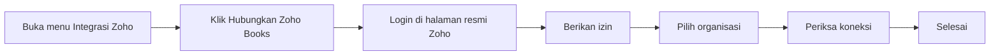
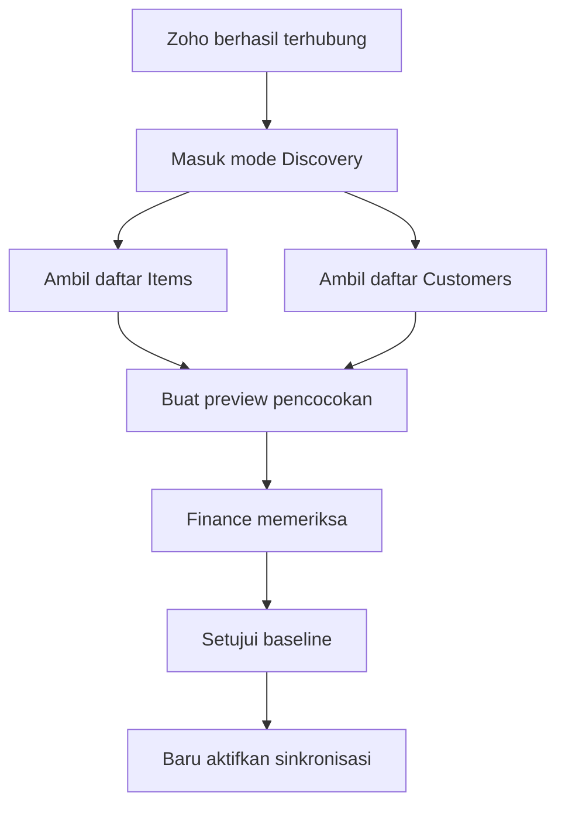
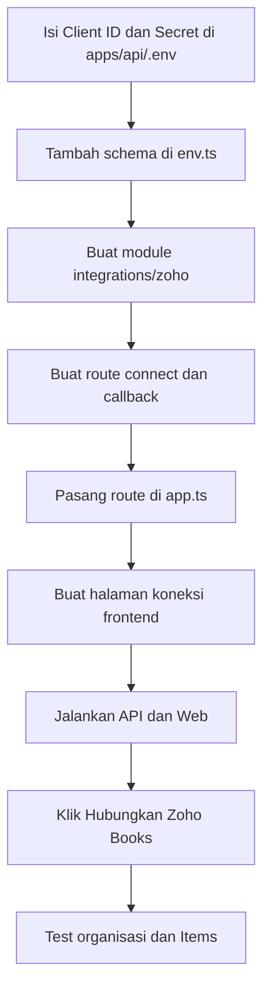

# Tutorial Menghubungkan RAHO ke Zoho Books untuk Pengguna Non-IT

Panduan ini ditujukan untuk Admin, Finance, atau pemilik akun yang tidak
memiliki latar belakang IT.

## 1. Tujuan

Setelah proses ini selesai:

- RAHO terhubung ke organisasi Zoho Books yang benar.
- RAHO dapat membaca data Zoho dengan izin resmi.
- RAHO dapat membaca Items dan Customers.
- Data existing Zoho belum diubah.
- Sistem siap masuk ke tahap pencocokan data.

## 2. Penjelasan singkat

Proses menghubungkan Zoho mirip dengan memilih tombol:

```text
Masuk dengan Google
```

Bedanya, kita menggunakan:

```text
Hubungkan Zoho Books
```

RAHO tidak meminta atau menyimpan password Zoho. Anda login langsung di halaman
resmi Zoho, kemudian memberikan izin kepada RAHO.



## 3. Hal penting sebelum mulai

Saat ini modul koneksi Zoho belum tersedia pada aplikasi RAHO. Developer perlu
membangun tombol dan halaman koneksinya terlebih dahulu.

Panduan ini digunakan setelah halaman berikut tersedia:

```text
Pengaturan
→ Integrasi
→ Zoho Books
```

Jika menu tersebut belum ada, jangan mencoba memindahkan data secara manual.
Hubungi developer dan berikan bagian **Persiapan untuk Developer** pada dokumen
ini.

---

## 4. Siapa yang mengerjakan?

| Pekerjaan | Penanggung jawab |
|---|---|
| Memeriksa organisasi Zoho | Admin Zoho/Finance |
| Memastikan menu Items tersedia | Admin Zoho |
| Memastikan Retainer Invoice tersedia | Admin Zoho/Finance |
| Membuat aplikasi di Zoho API Console | Developer dengan pendampingan Admin |
| Menyimpan Client ID dan Client Secret | Developer |
| Menekan Hubungkan Zoho Books | Admin RAHO |
| Login dan memberikan izin | Admin Zoho |
| Memilih organisasi | Admin Zoho/Finance |
| Memeriksa hasil koneksi | Admin RAHO dan Developer |

Pengguna non-IT tidak perlu mengubah source code atau menjalankan perintah
terminal.

---

## 5. Persiapan akun Zoho

Sebelum menghubungkan, siapkan:

- Email akun Zoho administrator.
- Password akun Zoho.
- Akses OTP atau authenticator jika digunakan.
- Nama organisasi Zoho Books.
- Persetujuan Finance untuk menghubungkan organisasi tersebut.
- Domain aplikasi RAHO yang akan digunakan.

Jangan memberikan password atau kode OTP kepada developer.

## 6. Pastikan membuka organisasi yang benar

1. Masuk ke Zoho Books.
2. Perhatikan nama organisasi di bagian atas layar.
3. Jika ada beberapa organisasi, buka daftar organisasi.
4. Pilih organisasi yang digunakan oleh RAHO.
5. Catat nama organisasinya.

Contoh:

```text
Nama organisasi: RAHO Indonesia
Mata uang: IDR
Zona waktu: Asia/Jakarta
```

Jangan memilih organisasi test untuk koneksi production.

## 7. Periksa fitur Items

1. Buka menu **Items**.
2. Pastikan daftar item dapat dibuka.
3. Periksa apakah data item existing terlihat.
4. Jangan menghapus atau mengedit item pada tahap ini.

Catat:

```text
Jumlah item aktif: __________
Apakah stok terlihat: Ya / Tidak
Apakah ada SKU kosong: Ya / Tidak
Apakah ada SKU ganda: Ya / Tidak / Belum tahu
```

## 8. Periksa inventory tracking

1. Klik ikon **Settings** atau roda gigi.
2. Buka **Preferences**.
3. Cari bagian **Items**.
4. Pastikan pelacakan persediaan/inventory tracking tersedia.
5. Jangan mengaktifkan add-on Zoho Inventory.

Target integrasi ini adalah Zoho Books saja.

Jika pilihan inventory tracking tidak tersedia, catat nama paket/edition Zoho
dan konsultasikan dengan Finance atau support Zoho.

## 9. Periksa Customers

1. Buka **Sales**.
2. Pilih **Customers**.
3. Pastikan customer existing dapat dibuka.
4. Periksa apakah tanggal lahir tersedia sebagai custom field.

Field tanggal lahir yang disarankan:

```text
Nama field: RAHO Date of Birth
Format: YYYY-MM-DD
Contoh: 1990-01-15
```

Tanggal lahir diperlukan untuk mencocokkan customer Zoho dengan member RAHO.

## 10. Periksa Faktur Uang Muka

1. Buka menu **Sales**.
2. Cari **Retainer Invoices**.
3. Pastikan halaman tersebut dapat dibuka.

Retainer Invoice adalah nama Zoho untuk Faktur Uang Muka.

Jika menu belum terlihat:

1. Buka **Settings**.
2. Buka **Preferences**.
3. Cari **Retainer Invoices**.
4. Aktifkan jika tersedia.

Jangan membuat Retainer Invoice percobaan di organisasi production tanpa
persetujuan Finance.

---

## 11. Persiapan untuk Developer

Bagian ini dikerjakan developer. Pengguna non-IT cukup mendampingi untuk
memastikan akun dan organisasi yang digunakan sudah benar.

Developer perlu membuat **Server-based Application** di Zoho API Console.

Informasi yang dibutuhkan:

```text
Nama aplikasi: RAHO ERP
Homepage URL: alamat aplikasi RAHO
Redirect URL: alamat callback backend RAHO
```

Contoh development:

```text
Homepage:
http://localhost:3000

Redirect:
http://localhost:4000/api/v1/integrations/zoho/callback
```

Contoh production:

```text
Homepage:
https://erp.domain-raho.id

Redirect:
https://erp.domain-raho.id/api/v1/integrations/zoho/callback
```

Zoho akan memberikan:

```text
Client ID
Client Secret
```

Keduanya bersifat rahasia:

- jangan dimasukkan ke dokumen ini;
- jangan dikirim melalui grup chat;
- jangan dimasukkan ke screenshot;
- jangan disimpan di source code;
- simpan sebagai secret pada server.

Redirect URL harus sama persis antara Zoho API Console dan konfigurasi RAHO.

## 12. Izin yang digunakan

Pada saat koneksi, Zoho akan menampilkan daftar izin.

Izin awal digunakan untuk:

- membaca pengaturan organisasi;
- membaca Items;
- membaca Customers;
- membaca Invoice dan Faktur Uang Muka.

Pada tahap awal, gunakan mode baca terlebih dahulu. Izin membuat atau mengubah
data diaktifkan setelah proses discovery dan pengujian selesai.

Pengguna harus memastikan aplikasi yang meminta izin bernama:

```text
RAHO ERP
```

Jika nama aplikasi berbeda atau mencurigakan, pilih **Cancel** dan hubungi
developer.

---

## 13. Cara menghubungkan dari RAHO

Bagian ini dilakukan setelah developer menyelesaikan halaman integrasi.

### Buka halaman koneksi

1. Login ke RAHO sebagai Admin.
2. Buka **Pengaturan**.
3. Pilih **Integrasi**.
4. Pilih **Zoho Books**.

Layar awal seharusnya menampilkan:

```text
Status: Belum Terhubung

[Hubungkan Zoho Books]
```

### Tekan tombol koneksi

1. Klik **Hubungkan Zoho Books**.
2. Browser akan membuka halaman resmi Zoho.
3. Pastikan alamat website merupakan domain resmi Zoho.
4. Jangan melanjutkan jika halaman terlihat mencurigakan.

### Login ke Zoho

1. Masukkan email akun Zoho administrator.
2. Masukkan password langsung di halaman Zoho.
3. Selesaikan OTP jika diminta.
4. Jangan memasukkan password Zoho di halaman RAHO.

### Berikan izin

Zoho akan menampilkan:

```text
RAHO ERP meminta izin mengakses Zoho Books
```

Periksa:

- Nama aplikasi benar.
- Akun Zoho benar.
- Organisasi yang akan digunakan benar.
- Izin berkaitan dengan Zoho Books.

Jika semuanya benar, klik **Accept/Allow**.

Jika tidak benar, klik **Cancel/Deny**.

### Kembali ke RAHO

Setelah izin diberikan, Zoho akan mengembalikan browser ke RAHO.

Pesan yang diharapkan:

```text
Zoho Books berhasil dihubungkan.
Silakan pilih organisasi.
```

Jika browser berhenti pada halaman error, jangan mengulang berkali-kali. Catat
pesan error dan berikan kepada developer.

---

## 14. Pilih organisasi Zoho

Jika akun mempunyai satu organisasi:

1. Periksa nama organisasi.
2. Klik **Gunakan Organisasi Ini**.

Jika akun mempunyai beberapa organisasi:

1. Baca seluruh nama organisasi.
2. Pilih organisasi yang telah disepakati Finance.
3. Periksa mata uang dan zona waktunya.
4. Klik **Pilih dan Lanjutkan**.

Contoh:

```text
Organisasi: RAHO Indonesia
Mata uang: IDR
Zona waktu: Asia/Jakarta
```

Jangan memilih hanya berdasarkan urutan paling atas.

## 15. Periksa hasil koneksi

Halaman RAHO seharusnya menampilkan:

```text
Status              Terhubung
Organisasi          RAHO Indonesia
Mata uang           IDR
Zoho Books API      Berhasil
Items               Dapat dibaca
Customers           Dapat dibaca
Mode                 Discovery
```

Mode `Discovery` berarti RAHO baru membaca data. RAHO belum mengubah data Zoho.

## 16. Jalankan Periksa Koneksi

1. Klik **Periksa Koneksi**.
2. Tunggu hasil pemeriksaan.

Hasil yang benar:

```text
OAuth          Berhasil
Organization   Berhasil
Items          Berhasil
Customers      Berhasil
```

Jika semuanya berhasil, tahap menghubungkan Zoho selesai.

---

## 17. Setelah terhubung, jangan langsung sinkronkan

Setelah status menjadi **Terhubung**, jangan langsung menekan tombol yang
mengubah data.

Urutan yang aman:



Yang dilakukan pada tahap Discovery:

- Membaca item existing.
- Membaca stok existing.
- Membaca customer aktif.
- Menghitung kemungkinan pasangan data.
- Menampilkan konflik.

Yang belum dilakukan:

- Mengubah item Zoho.
- Mengubah stok Zoho.
- Membuat member otomatis tanpa preview.
- Membuat Invoice.
- Membuat Faktur Uang Muka.

---

## 18. Cara mengetahui koneksi berhasil

Koneksi dinyatakan berhasil jika:

- Status RAHO menunjukkan **Terhubung**.
- Nama organisasi sesuai.
- Items dapat dibaca.
- Customers dapat dibaca.
- Tidak ada pesan token atau izin gagal.
- Mode masih `Discovery`.
- Tidak ada data existing yang berubah.

Checklist:

- [ ] Akun yang digunakan adalah Admin Zoho.
- [ ] Organisasi yang dipilih sudah benar.
- [ ] Mata uang organisasi sudah benar.
- [ ] Items dapat dibuka.
- [ ] Customers dapat dibuka.
- [ ] Retainer Invoices tersedia.
- [ ] Status koneksi Terhubung.
- [ ] Periksa Koneksi berhasil.
- [ ] Mode Discovery aktif.
- [ ] Finance menyimpan bukti/screenshot hasil koneksi.

---

## 19. Error yang sering muncul

### Redirect URL tidak cocok

Pesan dapat berbunyi:

```text
Redirect URI mismatch
Invalid redirect URI
```

Artinya alamat kembali yang didaftarkan di Zoho berbeda dengan alamat RAHO.

Tindakan:

1. Jangan mengulang login.
2. Screenshot pesan error.
3. Berikan kepada developer.
4. Developer memperbaiki Redirect URL.

### Tidak mempunyai izin

Pesan:

```text
Unauthorized
Permission denied
Insufficient privilege
```

Kemungkinan:

- Akun bukan administrator.
- Hak akses akun terlalu terbatas.
- Izin aplikasi belum lengkap.

Tindakan: gunakan akun admin atau perbaiki hak akses.

### Organisasi tidak muncul

Kemungkinan:

- Login menggunakan akun Zoho yang salah.
- Akun tidak mempunyai akses ke organisasi.
- Organisasi berada di data center berbeda.

Jangan memilih organisasi lain sebagai pengganti.

### Halaman kembali ke RAHO tetapi status gagal

Kemungkinan:

- Proses terlalu lama.
- Kode izin sudah kedaluwarsa.
- Halaman koneksi dibuka di beberapa tab.
- Koneksi server bermasalah.

Tindakan:

1. Tutup tab koneksi tambahan.
2. Kembali ke halaman Integrasi Zoho.
3. Tekan Hubungkan sekali lagi.
4. Jika tetap gagal, hubungi developer.

### Items berhasil tetapi Customers gagal

Kemungkinan izin Contacts belum diberikan.

Catat hasil pemeriksaan dan minta developer memeriksa scope/izin.

### Salah memilih organisasi

Jangan mulai discovery atau sinkronisasi.

Tindakan:

1. Klik **Putuskan Koneksi**.
2. Hubungkan kembali.
3. Pilih organisasi yang benar.

---

## 20. Cara memutus koneksi

Gunakan hanya jika:

- organisasi yang dipilih salah;
- akses dicabut oleh Finance;
- terjadi pergantian akun resmi;
- ada instruksi dari administrator.

Langkah:

1. Buka **Pengaturan → Integrasi → Zoho Books**.
2. Klik **Putuskan Koneksi**.
3. Baca peringatan.
4. Ketik alasan pemutusan.
5. Konfirmasi.

Memutus koneksi:

- menghentikan sinkronisasi baru;
- tidak menghapus data existing;
- tidak menghapus mapping dan audit;
- tidak menghapus Invoice atau item Zoho.

Setelah itu, administrator dapat mencabut izin aplikasi dari pengaturan akun
Zoho bila diperlukan.

---

## 21. Informasi yang dikirim kepada developer jika ada masalah

Kirim:

- Waktu kejadian.
- Nama organisasi, tanpa password.
- Tahap ketika error muncul.
- Screenshot error.
- Nama browser.
- Apakah Items dapat dibaca.
- Apakah Customers dapat dibaca.
- Correlation/reference ID jika ditampilkan.

Jangan kirim:

- Password.
- OTP.
- Client Secret.
- Access token.
- Refresh token.
- Isi data medis member.

Contoh laporan:

```text
Waktu: 27 Juli 2026, 14:30 WIB
Organisasi: RAHO Indonesia
Tahap: Setelah menekan Allow di Zoho
Pesan: Redirect URI mismatch
Browser: Chrome
Screenshot: terlampir
```

---

## 22. Serah terima setelah koneksi

Admin dan developer mencatat:

```text
Tanggal koneksi:
Nama organisasi:
Organization ID:
Data center:
Admin yang menghubungkan:
Status health check:
Mode:
Catatan:
```

Finance menandatangani bahwa organisasi yang dipilih sudah benar sebelum proses
discovery data dimulai.

---

## 23. Ringkasan sangat singkat

```text
Siapkan akun Admin Zoho
→ pastikan organisasi benar
→ pastikan Items, Customers, dan Retainer Invoice tersedia
→ developer menyiapkan aplikasi RAHO di Zoho API Console
→ Admin klik Hubungkan Zoho Books
→ login di halaman resmi Zoho
→ berikan izin
→ pilih organisasi
→ klik Periksa Koneksi
→ pastikan mode Discovery
→ selesai
```

Tahap selanjutnya adalah membaca dan mencocokkan item, stok, serta customer.
Jangan mengaktifkan sinkronisasi penuh sebelum preview dan baseline disetujui.

## 24. Referensi

- [OAuth Zoho Books](https://www.zoho.com/books/api/v3/oauth/)
- [Organizations API](https://www.zoho.com/books/api/v3/organizations/)
- [Items API](https://www.zoho.com/books/api/v3/items/)
- [Contacts API](https://www.zoho.com/books/api/v3/contacts/)
- [Retainer Invoices API](https://www.zoho.com/books/api/v3/retainer-invoices/)

---

## 25. Di mana mengambil Client ID dan Client Secret?

Zoho Books tidak memberikan satu “API key”. Yang digunakan adalah:

```text
Client ID
Client Secret
```

Cara mengambilnya:

1. Buka [Zoho API Console](https://api-console.zoho.com/).
2. Login menggunakan akun administrator Zoho.
3. Pilih **Add Client**.
4. Pilih **Server-based Applications**.
5. Isi nama aplikasi:

```text
RAHO ERP
```

6. Isi Homepage URL.
7. Isi Authorized Redirect URI.
8. Klik **Create**.
9. Buka tab **Client Secret**.
10. Salin Client ID dan Client Secret ke tempat rahasia.

Untuk project lokal:

```text
Homepage URL:
http://localhost:3000

Authorized Redirect URI:
http://localhost:4000/api/v1/integrations/zoho/callback
```

Untuk production:

```text
Homepage URL:
https://erp.domain-raho.id

Authorized Redirect URI:
https://erp.domain-raho.id/api/v1/integrations/zoho/callback
```

Gunakan alamat production yang sebenarnya. Jangan menyalin
`erp.domain-raho.id` jika domain tersebut bukan domain aplikasi Anda.

## 26. Di mana Client ID dan Client Secret dimasukkan?

Nilai rahasia dimasukkan ke file:

```text
apps/api/.env
```

File tersebut adalah konfigurasi backend dan tidak boleh dikirim ke Git.

Tambahkan:

```env
ZOHO_ENABLED=true
ZOHO_CLIENT_ID=masukkan_client_id_di_sini
ZOHO_CLIENT_SECRET=masukkan_client_secret_di_sini
ZOHO_REDIRECT_URI=http://localhost:4000/api/v1/integrations/zoho/callback
ZOHO_ACCOUNTS_URL=https://accounts.zoho.com
ZOHO_TOKEN_ENCRYPTION_KEY=masukkan_kunci_enkripsi_yang_kuat
ZOHO_SYNC_MODE=DISCOVERY
ZOHO_WORKER_ENABLED=false
```

Contoh bentuknya:

```env
ZOHO_CLIENT_ID=1000.ABCDEFG
ZOHO_CLIENT_SECRET=xxxxxxxxxxxxxxxx
```

Contoh di atas hanya bentuk. Jangan memakai nilai contoh.

Jangan memasukkan rahasia ke:

- `apps/web`;
- source code `.ts` atau `.tsx`;
- browser/local storage;
- dokumen Markdown;
- screenshot;
- repository Git.

## 27. File project yang harus diubah developer

Struktur yang disarankan:

```text
apps/api/
├── .env
├── .env.example
└── src/
    ├── app.ts
    ├── config/
    │   └── env.ts
    └── modules/
        └── integrations/
            └── zoho/
                ├── zoho.routes.ts
                ├── zoho.controller.ts
                ├── zoho-oauth.service.ts
                ├── zoho-token.service.ts
                └── zoho-books.client.ts
```

Fungsi file:

| File | Fungsi |
|---|---|
| `.env` | Menyimpan nilai rahasia asli |
| `.env.example` | Menyimpan nama variabel tanpa rahasia |
| `env.ts` | Memeriksa konfigurasi saat API dijalankan |
| `zoho.routes.ts` | Menentukan URL connect dan callback |
| `zoho.controller.ts` | Menerima request dari browser |
| `zoho-oauth.service.ts` | Membuat URL Zoho dan menukar code menjadi token |
| `zoho-token.service.ts` | Mengenkripsi dan memperbarui token |
| `zoho-books.client.ts` | Memanggil Items, Contacts, dan API Books lain |
| `app.ts` | Memasang route Zoho ke aplikasi |

## 28. Tambahkan contoh konfigurasi

Tambahkan nama variabel ke:

```text
apps/api/.env.example
```

Isinya tanpa nilai rahasia:

```env
# Zoho Books
ZOHO_ENABLED=false
ZOHO_CLIENT_ID=
ZOHO_CLIENT_SECRET=
ZOHO_REDIRECT_URI=http://localhost:4000/api/v1/integrations/zoho/callback
ZOHO_ACCOUNTS_URL=https://accounts.zoho.com
ZOHO_TOKEN_ENCRYPTION_KEY=
ZOHO_SYNC_MODE=DISCOVERY
ZOHO_WORKER_ENABLED=false
```

`.env.example` boleh masuk Git karena tidak berisi secret.

## 29. Daftarkan environment variable pada backend

Project ini memvalidasi environment melalui:

```text
apps/api/src/config/env.ts
```

Developer perlu menambahkan field Zoho ke `envSchema`:

```ts
ZOHO_ENABLED: z.enum(['true', 'false'])
  .default('false')
  .transform((value) => value === 'true'),
ZOHO_CLIENT_ID: z.string().optional(),
ZOHO_CLIENT_SECRET: z.string().optional(),
ZOHO_REDIRECT_URI: z.string().url().optional(),
ZOHO_ACCOUNTS_URL: z.string().url().default('https://accounts.zoho.com'),
ZOHO_TOKEN_ENCRYPTION_KEY: z.string().min(32).optional(),
ZOHO_SYNC_MODE: z.enum(['OFF', 'DISCOVERY', 'SHADOW', 'PILOT', 'LIVE'])
  .default('DISCOVERY'),
ZOHO_WORKER_ENABLED: z.enum(['true', 'false'])
  .default('false')
  .transform((value) => value === 'true'),
```

Tambahkan validasi lanjutan:

```text
Jika ZOHO_ENABLED=true:
Client ID wajib ada
Client Secret wajib ada
Redirect URI wajib ada
Encryption key wajib ada
```

## 30. Buat route koneksi Zoho

Buat:

```text
apps/api/src/modules/integrations/zoho/zoho.routes.ts
```

Contoh dasar:

```ts
import { Router } from 'express';
import {
  connectZoho,
  handleZohoCallback,
  getZohoStatus,
} from './zoho.controller';

const router = Router();

router.get('/connect', connectZoho);
router.get('/callback', handleZohoCallback);
router.get('/status', getZohoStatus);

export default router;
```

Endpoint akhirnya:

```text
GET /api/v1/integrations/zoho/connect
GET /api/v1/integrations/zoho/callback
GET /api/v1/integrations/zoho/status
```

Endpoint `connect` dan `status` harus dilindungi login serta permission Admin.
Callback memakai validasi OAuth state, bukan login browser biasa.

## 31. Pasang route di aplikasi

Buka:

```text
apps/api/src/app.ts
```

Tambahkan import:

```ts
import zohoRouter from './modules/integrations/zoho/zoho.routes';
```

Di bagian pemasangan API routes, tambahkan:

```ts
app.use(`${prefix}/integrations/zoho`, zohoRouter);
```

Karena `API_PREFIX` project adalah `/api/v1`, callback menjadi:

```text
http://localhost:4000/api/v1/integrations/zoho/callback
```

Alamat ini wajib sama persis dengan Authorized Redirect URI di Zoho API
Console.

## 32. Contoh pembuatan URL login Zoho

Buat:

```text
apps/api/src/modules/integrations/zoho/zoho-oauth.service.ts
```

Contoh konseptual:

```ts
import crypto from 'crypto';
import { env } from '../../../config/env';

const scopes = [
  'ZohoBooks.settings.READ',
  'ZohoBooks.contacts.READ',
  'ZohoBooks.invoices.READ',
];

export function buildZohoAuthorizationUrl() {
  const state = crypto.randomBytes(32).toString('hex');

  const query = new URLSearchParams({
    response_type: 'code',
    client_id: env.ZOHO_CLIENT_ID!,
    redirect_uri: env.ZOHO_REDIRECT_URI!,
    scope: scopes.join(','),
    access_type: 'offline',
    prompt: 'consent',
    state,
  });

  return {
    state,
    url: `${env.ZOHO_ACCOUNTS_URL}/oauth/v2/auth?${query.toString()}`,
  };
}
```

`state` harus disimpan sementara di database atau server cache dengan:

- masa berlaku singkat;
- pengguna yang memulai koneksi;
- status belum digunakan;
- hanya dapat digunakan satu kali.

Jangan hanya membuat state tanpa menyimpannya.

## 33. Contoh controller connect

Buat:

```text
apps/api/src/modules/integrations/zoho/zoho.controller.ts
```

Contoh sederhana:

```ts
import type { Request, Response } from 'express';
import { buildZohoAuthorizationUrl } from './zoho-oauth.service';

export async function connectZoho(_req: Request, res: Response) {
  const { state, url } = buildZohoAuthorizationUrl();

  // Wajib: simpan hash state, user ID, dan expiry ke database/cache.
  // Jangan menulis state atau token ke log.

  return res.redirect(url);
}
```

Ini baru contoh dasar. Belum lengkap sebelum penyimpanan dan validasi state
dibuat.

## 34. Callback dan pengambilan token

Ketika pengguna memberi izin, Zoho mengembalikan:

```text
code
state
```

Backend kemudian memanggil:

```text
POST {ZOHO_ACCOUNTS_URL}/oauth/v2/token
```

Parameter:

```text
code
client_id
client_secret
redirect_uri
grant_type=authorization_code
```

Contoh konseptual:

```ts
const tokenUrl = new URL('/oauth/v2/token', env.ZOHO_ACCOUNTS_URL);
tokenUrl.search = new URLSearchParams({
  code,
  client_id: env.ZOHO_CLIENT_ID!,
  client_secret: env.ZOHO_CLIENT_SECRET!,
  redirect_uri: env.ZOHO_REDIRECT_URI!,
  grant_type: 'authorization_code',
}).toString();

const tokenResponse = await fetch(tokenUrl, {
  method: 'POST',
});
```

Sebelum menukar code:

1. Cocokkan state dengan state yang disimpan.
2. Periksa expiry.
3. Periksa pengguna yang memulai.
4. Pastikan state belum digunakan.
5. Tandai state sudah digunakan.

Simpan:

```text
api_domain
refresh_token terenkripsi
granted scopes
connected user
connected time
```

Jangan menyimpan refresh token tanpa enkripsi.

## 35. Mengambil organisasi Zoho Books

Setelah access token diperoleh:

```ts
const response = await fetch(
  `${apiDomain}/books/v3/organizations`,
  {
    headers: {
      Authorization: `Zoho-oauthtoken ${accessToken}`,
    },
  },
);
```

Tampilkan daftar organisasi kepada Admin. Simpan `organization_id` yang dipilih.

Jangan otomatis memakai organisasi pertama jika akun mempunyai lebih dari satu.

## 36. Tes membaca Items

Setelah organisasi dipilih:

```ts
const url = new URL(`${apiDomain}/books/v3/items`);
url.searchParams.set('organization_id', organizationId);
url.searchParams.set('page', '1');
url.searchParams.set('per_page', '200');

const response = await fetch(url, {
  headers: {
    Authorization: `Zoho-oauthtoken ${accessToken}`,
  },
});
```

Zoho menggunakan pagination. Jika `has_more_page=true`, lanjutkan ke halaman
berikutnya sampai selesai.

## 37. Di mana kode frontend diletakkan?

Frontend yang disarankan:

```text
apps/web/src/pages/integrations/zoho/
└── ZohoConnectionPage.tsx
```

Tombol frontend cukup membuka endpoint backend:

```ts
function connectZoho() {
  window.location.href =
    `${API_BASE_URL}/api/v1/integrations/zoho/connect`;
}
```

Frontend tidak boleh:

- menyimpan Client Secret;
- menukar authorization code;
- menyimpan refresh token;
- memanggil token endpoint Zoho secara langsung.

Semua pekerjaan rahasia dilakukan backend.

## 38. Urutan memasukkan kode



## 39. Cara menjalankan dan menguji

Setelah developer selesai:

1. Jalankan backend.
2. Jalankan frontend.
3. Buka halaman Integrasi Zoho.
4. Klik Hubungkan Zoho Books.
5. Login dan berikan izin.
6. Pilih organisasi.
7. Jalankan Periksa Koneksi.
8. Pastikan Items dapat dibaca.
9. Pastikan mode masih `DISCOVERY`.

Jangan mengaktifkan write/sinkronisasi penuh pada pengujian pertama.

## 40. Kesalahan yang harus dihindari developer

- Menaruh Client Secret di frontend.
- Commit file `.env`.
- Menulis access/refresh token ke log.
- Tidak memvalidasi OAuth state.
- Menyimpan refresh token tanpa enkripsi.
- Menganggap akun selalu berada di data center `.com`.
- Mengabaikan `api_domain` dari token response.
- Memilih organization pertama secara otomatis.
- Tidak menangani pagination.
- Langsung mengubah data saat koneksi pertama.
- Menggunakan endpoint Zoho Inventory.
- Menggunakan callback tanpa `/api/v1` padahal project memakai prefix tersebut.
