# UML Aplikasi RAHO ERP Management System

Dokumen ini berisi kumpulan UML aplikasi RAHO ERP dalam format Mermaid agar dapat langsung dirender di Markdown viewer yang mendukung Mermaid, seperti GitHub, GitLab, atau VS Code extension.

Sumber utama penyusunan:

- `apps/api/prisma/schema.prisma`
- `apps/api/src/app.ts`
- `docs/BUSINESS-FLOW.md`
- `docs/API-FILE-STRUCTURE.md`
- `docs/WEB-FILE-STRUCTURE.md`

Tanggal penyusunan: 15 Juni 2026.

## Daftar Isi

1. [Use Case Diagram](#1-use-case-diagram)
2. [Component Diagram](#2-component-diagram)
3. [Class Diagram - Identity dan Cabang](#3-class-diagram---identity-dan-cabang)
4. [Class Diagram - Member, Paket, Invoice, Referral](#4-class-diagram---member-paket-invoice-referral)
5. [Class Diagram - Treatment dan EMR](#5-class-diagram---treatment-dan-emr)
6. [Class Diagram - Inventory dan Procurement](#6-class-diagram---inventory-dan-procurement)
7. [Sequence Diagram - Login dan Protected Request](#7-sequence-diagram---login-dan-protected-request)
8. [Sequence Diagram - Registrasi Member, Paket, dan Pembayaran](#8-sequence-diagram---registrasi-member-paket-dan-pembayaran)
9. [Activity Diagram - Workflow Treatment](#9-activity-diagram---workflow-treatment)
10. [State Diagram - Status Paket](#10-state-diagram---status-paket)
11. [State Diagram - Stock Request dan Shipment](#11-state-diagram---stock-request-dan-shipment)
12. [Sequence Diagram - Stock Request dan Pengiriman](#12-sequence-diagram---stock-request-dan-pengiriman)
13. [Deployment Diagram](#13-deployment-diagram)

## 1. Use Case Diagram

Diagram ini menunjukkan aktor utama dan fitur yang mereka gunakan di aplikasi.

```mermaid
flowchart LR
    SA[Super Admin]
    AM[Admin Manager]
    AC[Admin Cabang]
    AL[Admin Layanan]
    DR[Dokter]
    NR[Perawat]
    MB[Member]

    subgraph SYS[RAHO ERP Management System]
        UC_LOGIN((Login dan logout))
        UC_DASH((Lihat dashboard))
        UC_BRANCH((Kelola cabang))
        UC_MANAGER((Kelola admin manager))
        UC_USER((Kelola user dan staff))
        UC_IMP((Impersonasi user))
        UC_MEMBER((Kelola member))
        UC_ACCESS((Kelola akses multi-cabang))
        UC_PACKAGE((Assign paket dan add-on))
        UC_PAY((Upload dan verifikasi pembayaran))
        UC_INVOICE((Kelola invoice))
        UC_DIAG((Input diagnosis))
        UC_PLAN((Buat dan edit therapy plan))
        UC_SESSION((Kelola sesi treatment))
        UC_VITAL((Catat vital sign))
        UC_INFUSION((Catat eksekusi infus))
        UC_MATERIAL((Catat material usage))
        UC_PHOTO((Upload foto sesi dan dokumen))
        UC_EVAL((Input evaluasi dokter))
        UC_INV((Kelola inventory))
        UC_STOCK_REQ((Stock request))
        UC_SHIP((Shipment dan penerimaan stok))
        UC_REF((Kelola referral dan insentif))
        UC_AUDIT((Lihat audit log))
        UC_PORTAL((Portal member))
        UC_CHAT((Chat dan notifikasi))
    end

    SA --> UC_LOGIN
    SA --> UC_DASH
    SA --> UC_BRANCH
    SA --> UC_MANAGER
    SA --> UC_USER
    SA --> UC_IMP
    SA --> UC_INV
    SA --> UC_SHIP
    SA --> UC_REF
    SA --> UC_AUDIT

    AM --> UC_LOGIN
    AM --> UC_DASH
    AM --> UC_BRANCH
    AM --> UC_USER
    AM --> UC_ACCESS
    AM --> UC_INV
    AM --> UC_STOCK_REQ
    AM --> UC_SHIP
    AM --> UC_AUDIT

    AC --> UC_LOGIN
    AC --> UC_DASH
    AC --> UC_USER
    AC --> UC_INV
    AC --> UC_STOCK_REQ
    AC --> UC_PAY

    AL --> UC_LOGIN
    AL --> UC_DASH
    AL --> UC_MEMBER
    AL --> UC_PACKAGE
    AL --> UC_PAY
    AL --> UC_INVOICE
    AL --> UC_SESSION
    AL --> UC_PHOTO
    AL --> UC_REF

    DR --> UC_LOGIN
    DR --> UC_DASH
    DR --> UC_DIAG
    DR --> UC_PLAN
    DR --> UC_EVAL
    DR --> UC_SESSION

    NR --> UC_LOGIN
    NR --> UC_DASH
    NR --> UC_VITAL
    NR --> UC_INFUSION
    NR --> UC_MATERIAL
    NR --> UC_PHOTO
    NR --> UC_SESSION

    MB --> UC_LOGIN
    MB --> UC_PORTAL
    MB --> UC_PAY
    MB --> UC_INVOICE
    MB --> UC_CHAT
```

## 2. Component Diagram

Diagram ini menggambarkan komponen runtime utama dari frontend, API, modul bisnis, dan data layer.

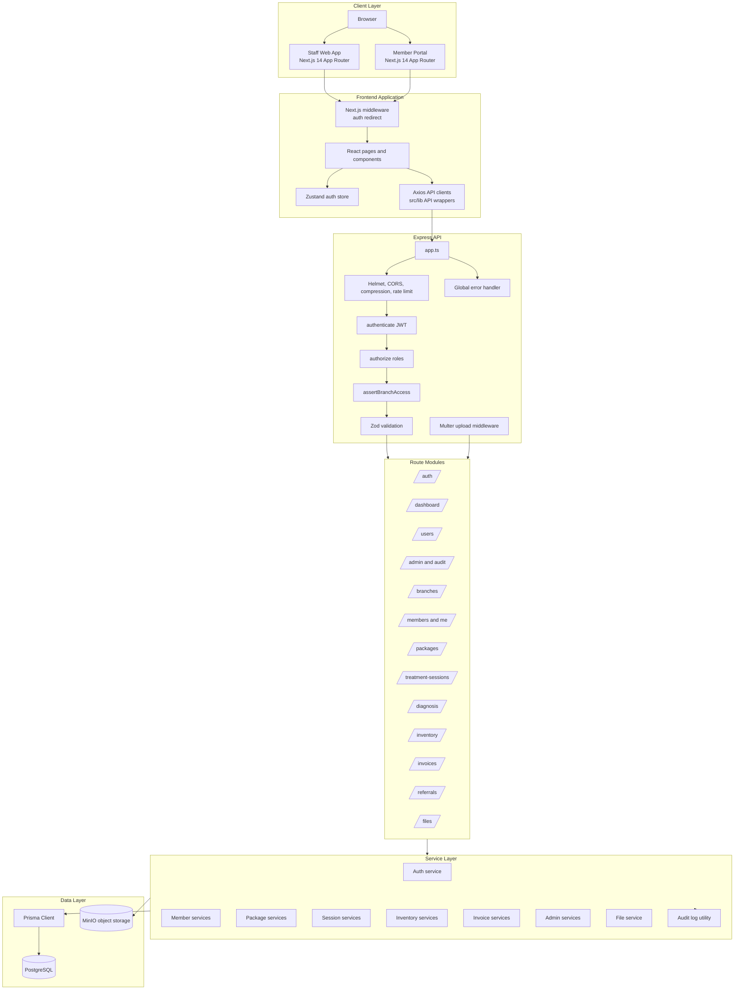

## 3. Class Diagram - Identity dan Cabang

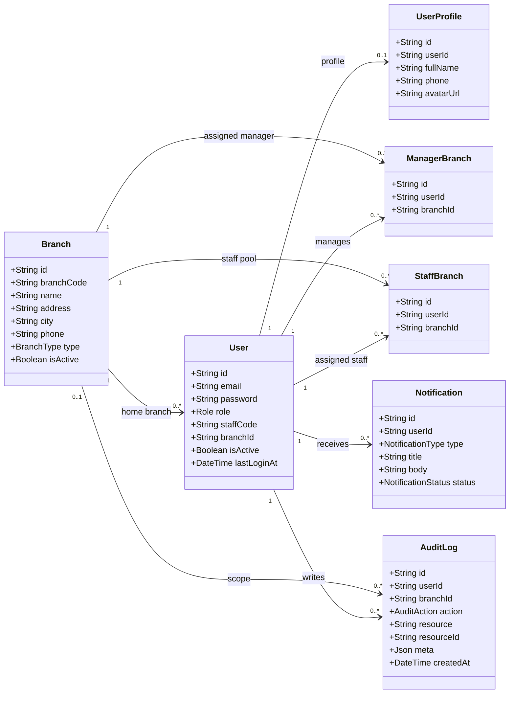

## 4. Class Diagram - Member, Paket, Invoice, Referral

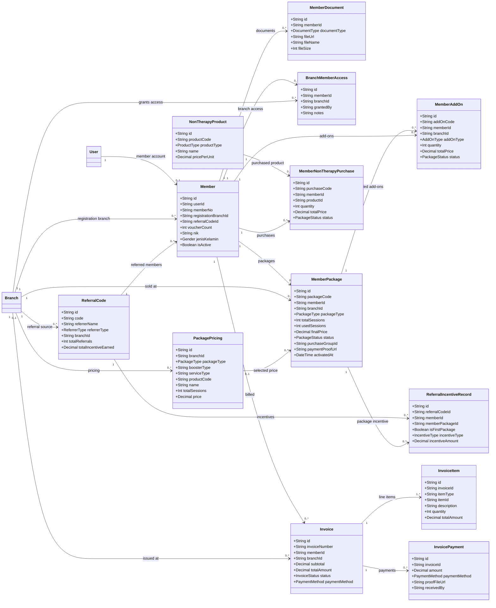

## 5. Class Diagram - Treatment dan EMR

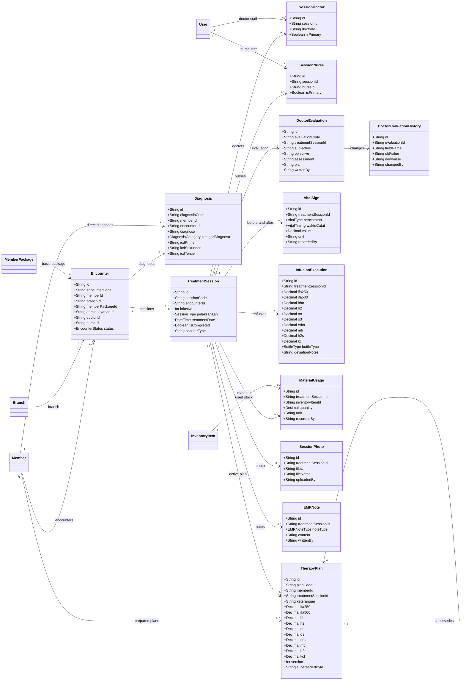

## 6. Class Diagram - Inventory dan Procurement

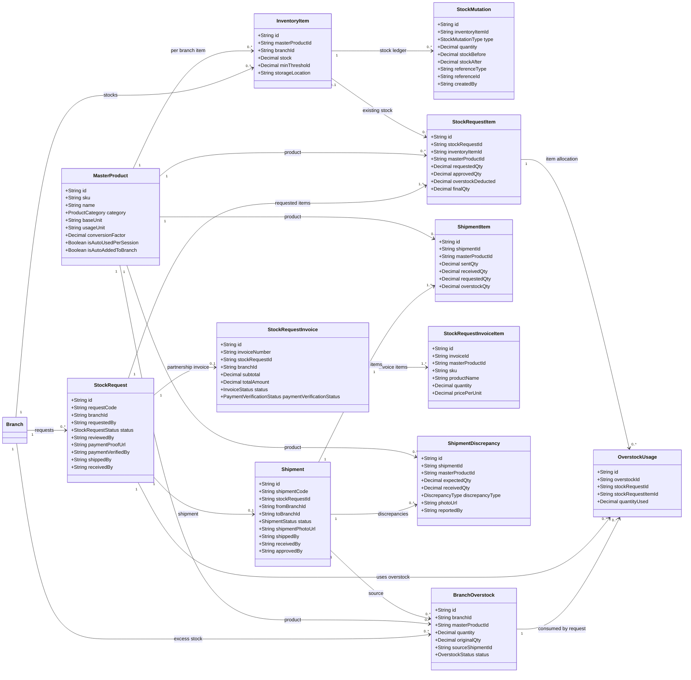

## 7. Sequence Diagram - Login dan Protected Request

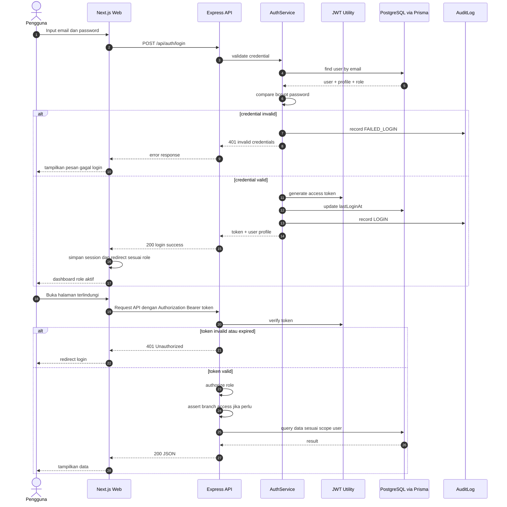

## 8. Sequence Diagram - Registrasi Member, Paket, dan Pembayaran

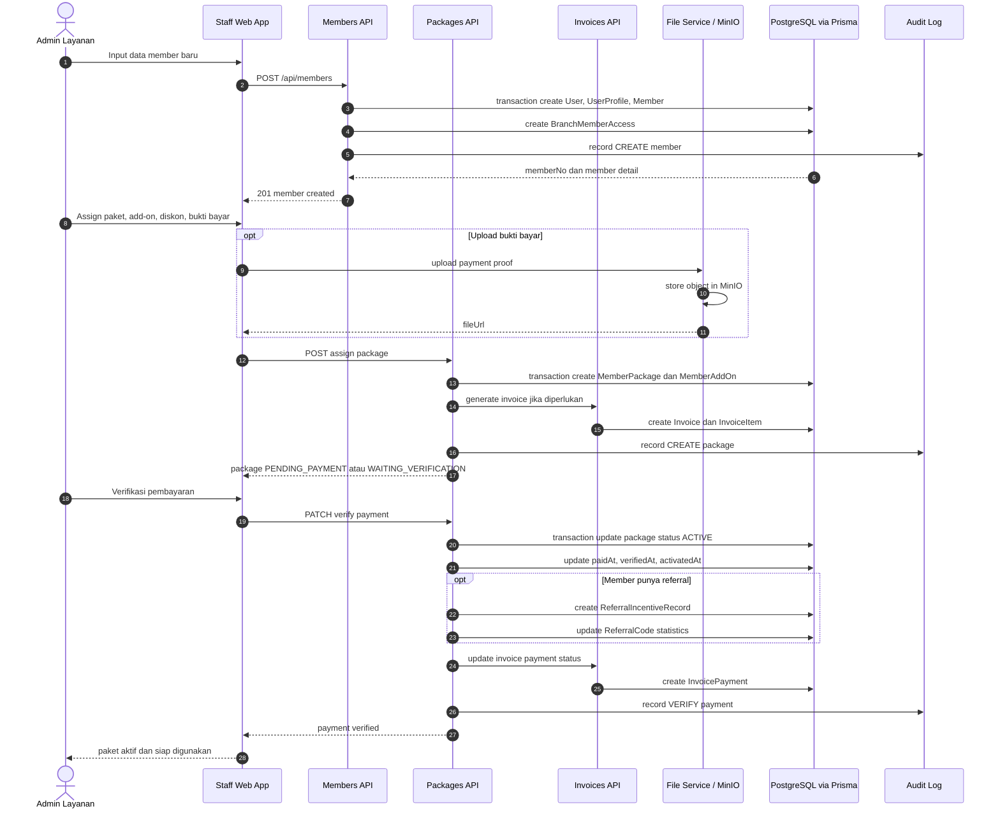

## 9. Activity Diagram - Workflow Treatment

Workflow treatment menggunakan `Encounter` sebagai payung kunjungan dan `TreatmentSession` sebagai sesi infus per pelaksanaan.

```mermaid
flowchart TD
    START([Mulai])
    PICK_MEMBER[Pilih member]
    PICK_PACKAGE[Pilih paket BASIC aktif]
    CREATE_ENC[Create Encounter status ONGOING]
    CREATE_SESSION[Create TreatmentSession]
    ASSIGN_STAFF[Assign admin layanan, dokter, perawat]
    DIAG[Step 1 - Diagnosis dokter]
    PLAN[Step 2 - Therapy plan]
    VITAL_BEFORE[Step 3 - Vital sign sebelum]
    INFUSION[Step 4 - Eksekusi infus]
    MATERIAL[Step 5 - Material usage dan pengurangan stok]
    PHOTO[Step 6 - Upload foto sesi]
    VITAL_AFTER[Step 7 - Vital sign sesudah]
    EVAL[Step 8 - Evaluasi dokter SOAP]
    COMPLETE_SESSION[Set TreatmentSession isCompleted true]
    UPDATE_PACKAGE[Increment usedSessions pada MemberPackage]
    CLOSE_CHECK{Semua sesi paket selesai?}
    CLOSE_ENC[Close Encounter]
    END([Selesai])

    START --> PICK_MEMBER
    PICK_MEMBER --> PICK_PACKAGE
    PICK_PACKAGE --> CREATE_ENC
    CREATE_ENC --> CREATE_SESSION
    CREATE_SESSION --> ASSIGN_STAFF
    ASSIGN_STAFF --> DIAG
    DIAG --> PLAN
    PLAN --> VITAL_BEFORE
    VITAL_BEFORE --> INFUSION
    INFUSION --> MATERIAL
    MATERIAL --> PHOTO
    PHOTO --> VITAL_AFTER
    VITAL_AFTER --> EVAL
    EVAL --> COMPLETE_SESSION
    COMPLETE_SESSION --> UPDATE_PACKAGE
    UPDATE_PACKAGE --> CLOSE_CHECK
    CLOSE_CHECK -- Tidak --> END
    CLOSE_CHECK -- Ya --> CLOSE_ENC
    CLOSE_ENC --> END
```

## 10. State Diagram - Status Paket

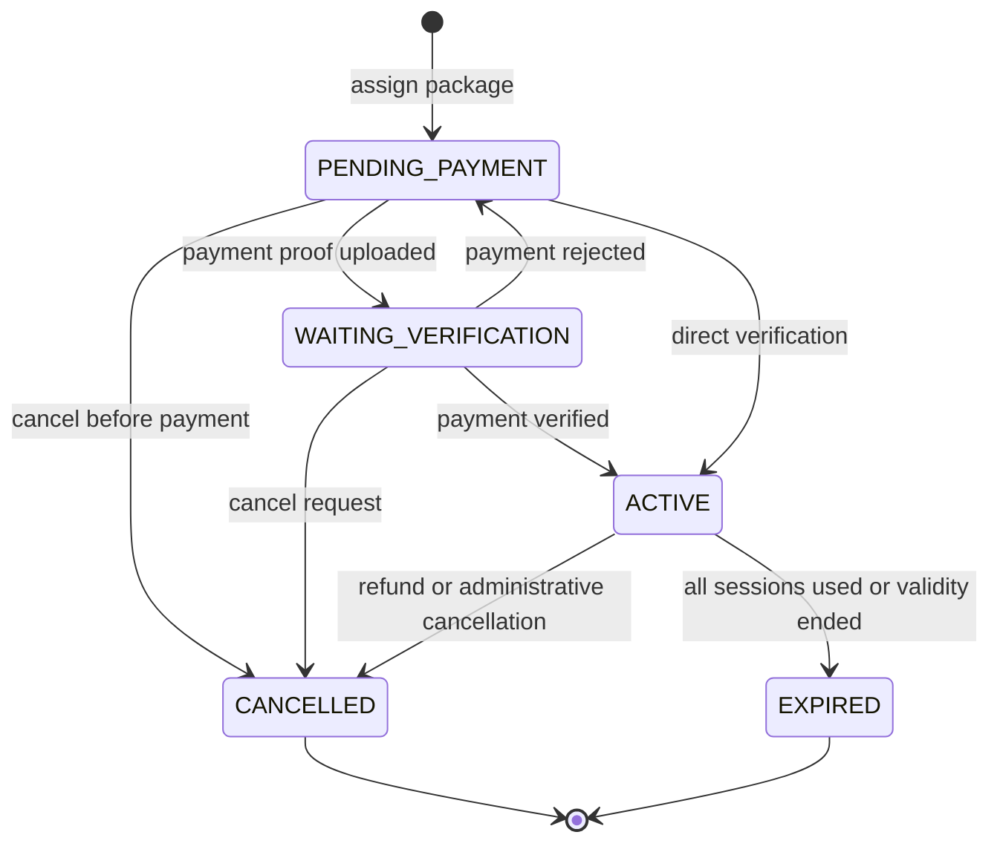

## 11. State Diagram - Stock Request dan Shipment

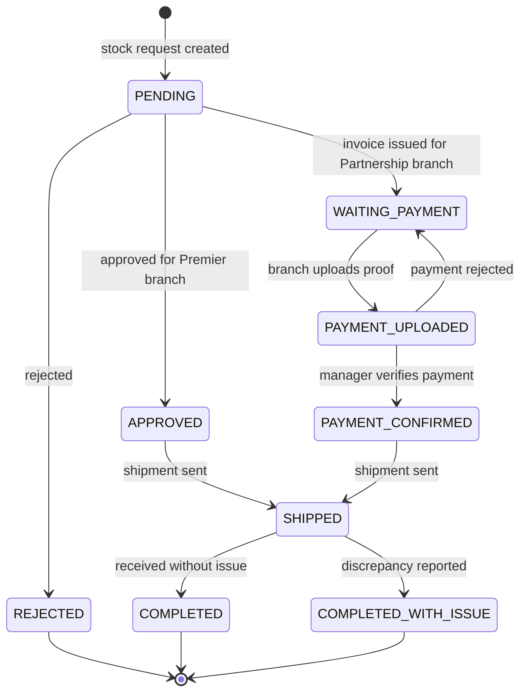

## 12. Sequence Diagram - Stock Request dan Pengiriman

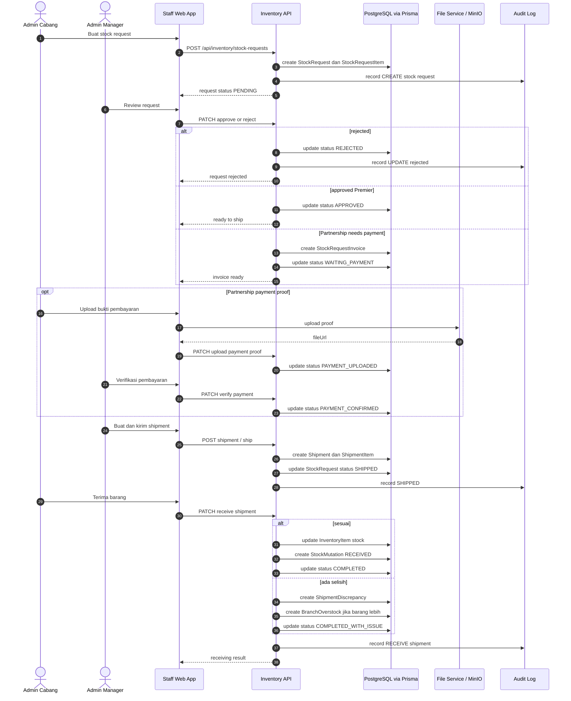

## 13. Deployment Diagram

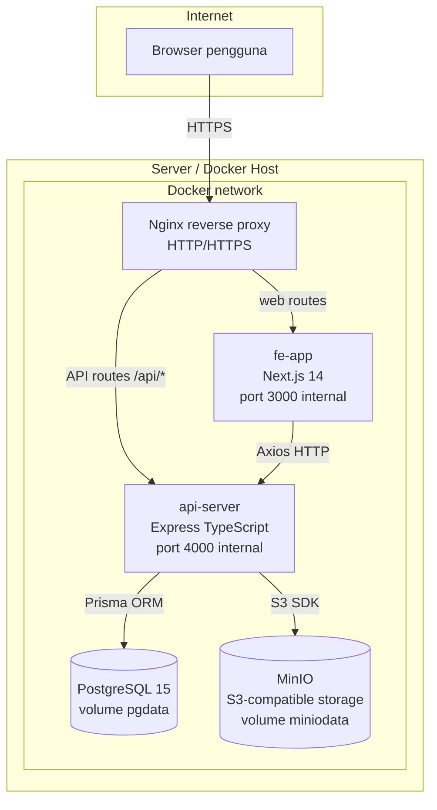

## Catatan Implementasi

- Use case dibuat berdasarkan role yang ada di enum `Role`: `SUPER_ADMIN`, `ADMIN_MANAGER`, `ADMIN_CABANG`, `ADMIN_LAYANAN`, `DOCTOR`, `NURSE`, dan `MEMBER`.
- Class diagram disusun dari model aktual pada `schema.prisma`, sehingga nama entity mengikuti database saat ini, misalnya `TreatmentSession`, `Encounter`, `TherapyPlan`, `StockRequest`, dan `BranchOverstock`.
- Mermaid belum menyediakan notasi use case UML native, jadi bagian use case memakai `flowchart` dengan node oval untuk menggambarkan use case.
- Diagram ini dapat dikembangkan menjadi PlantUML bila dibutuhkan untuk dokumentasi formal skripsi, SRS, atau laporan akademik.
