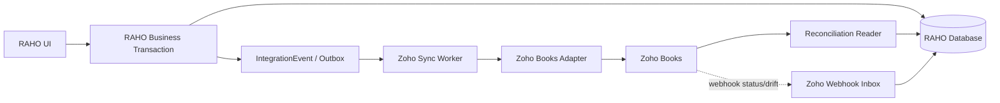
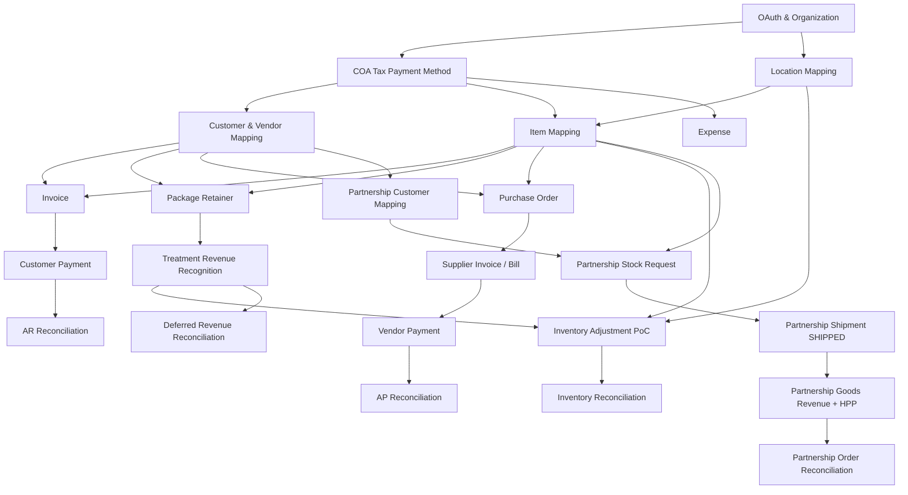
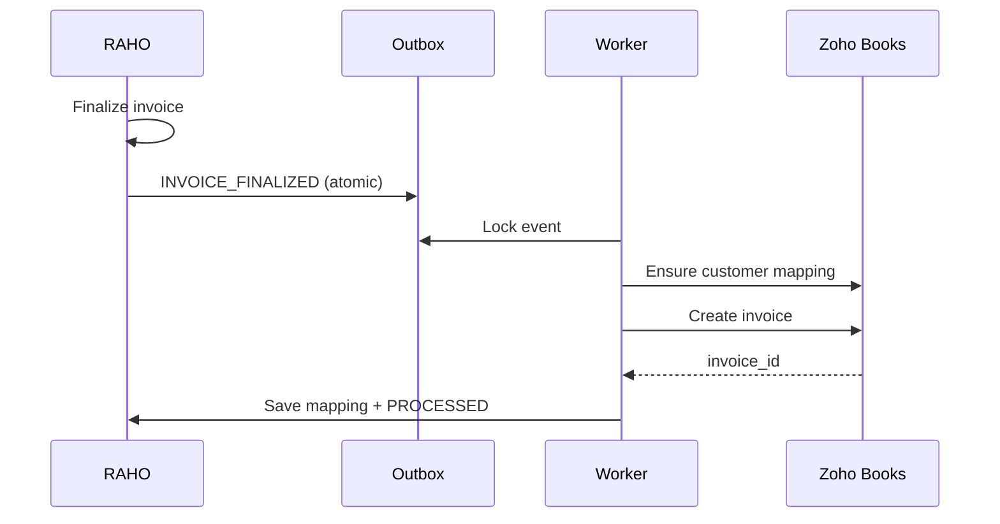
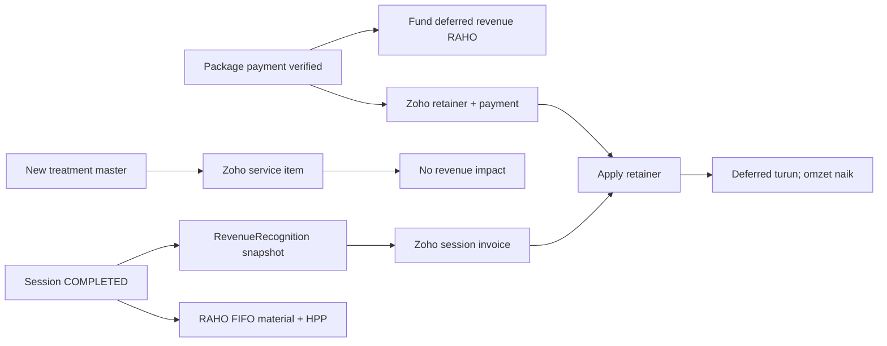
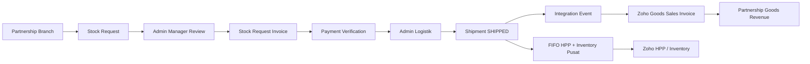
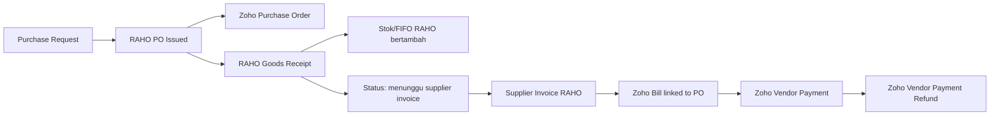
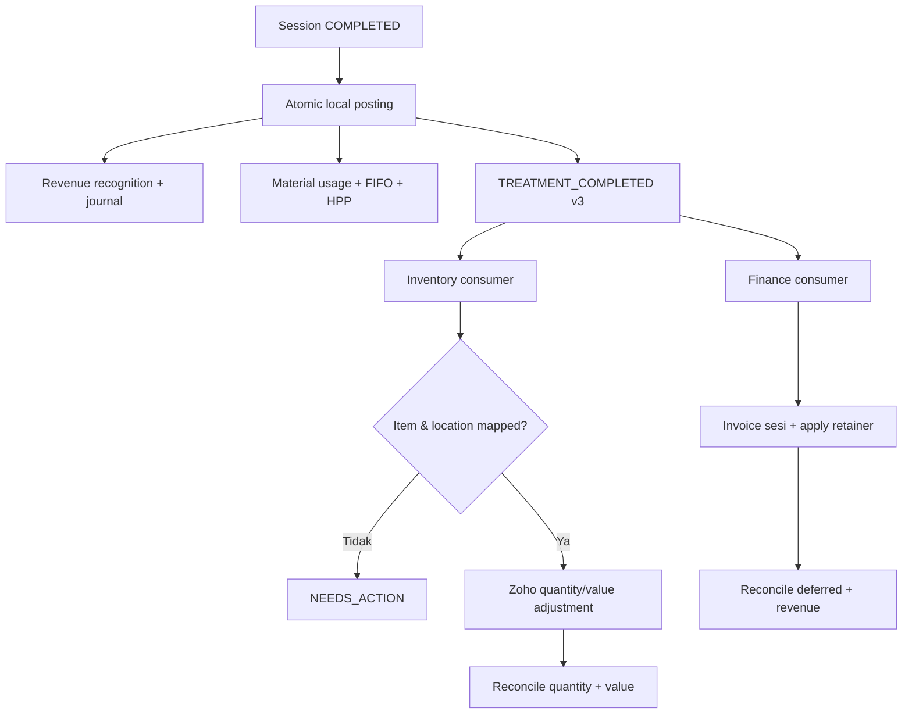

# Development Flow Terbaru Integrasi Finance dan Logistik RAHO dengan Zoho Books

Status: roadmap implementasi setelah OAuth berhasil  
Tanggal: 28 Juli 2026  
Target awal: Zoho Books saja, tanpa Zoho Inventory  
Pemilik transaksi operasional: RAHO  
Ledger dan laporan finansial eksternal: Zoho Books

Requirement utama tersedia di
[Requirements Finance dan Logistik](./REQUIREMENTS_FINANCE_LOGISTICS_ZOHO.md).
Rincian backlog, test case, release gate, dan evidence per sprint tersedia di
[Sprint dan Test Plan Integrasi Zoho Finance–Logistik](./SPRINT_DAN_TEST_PLAN_ZOHO_FINANCE_LOGISTIK.md).
Model data dan relasi lintas domain tersedia di
[ERD Finance dan Logistik](./ERD_FINANCE_LOGISTIK_MERMAID.md).

## 1. Kondisi saat ini

Fondasi yang sudah selesai:

- aplikasi Server-based OAuth dibuat di Zoho;
- halaman koneksi tersedia untuk Super Admin;
- access token dan refresh token disimpan terenkripsi;
- organisasi Zoho dapat dipilih;
- refresh access token dan health check tersedia;
- tabel `ZohoConnection` sudah tersedia;
- RAHO sudah mempunyai modul invoice, pembayaran, expense, accounting,
  purchasing, goods receipt, supplier invoice, supplier payment, inventory
  posting, FIFO, stock adjustment, dan domain/integration event.
- RAHO sudah mempunyai `PackageRevenuePolicy`, `PackageRevenueContract`,
  `DeferredRevenueMovement`, dan `RevenueRecognition`;
- RAHO sudah mempunyai `Branch.type=PARTNERSHIP`, `StockRequest`,
  `StockRequestInvoice`, `Shipment`, receipt, dan discrepancy;
- completion sesi terapi sudah atomik di RAHO: konsumsi material/FIFO,
  pengakuan omzet, jurnal HPP, dan `TREATMENT_COMPLETED` integration event
  dibuat dalam satu transaksi database.

Gap yang wajib diperbaiki sebelum finance consumer Zoho diaktifkan:

- selector revenue saat ini mengumpulkan paket Basic dari Encounter dan paket
  Booster dari Session sekaligus;
- `TREATMENT_COMPLETED` versi 2 hanya membawa total `recognizedRevenue`, belum
  membawa satu sumber omzet yang eksplisit;
- target bisnis baru mewajibkan pilihan eksklusif: sesi Basic hanya mengurangi
  deferred Basic, sedangkan sesi Booster hanya mengurangi deferred Booster;
- event target dinaikkan menjadi versi 3 dengan `finance.recognitions[]`.
- vertical slice awal sudah menambahkan role
  `FINANCE_LOGISTICS_CONTROLLER`, branch-scoped menu/API inventory, routing
  shipment Partnership, serta outbox event `PARTNERSHIP_GOODS_SHIPPED`;
- migration database untuk vertical slice tersebut tetap harus berstatus
  applied pada setiap environment sebelum role dapat dipakai;
- worker pengiriman event Partnership ke Zoho, mapping, retry, dan
  rekonsiliasi belum tersedia.

Koneksi OAuth yang berhasil belum berarti transaksi sudah tersinkron. Tahap
selanjutnya adalah membangun mapping, outbox worker, adapter API Zoho,
rekonsiliasi, dan UI exception. Pencatatan lokal terapi sudah tersedia, tetapi
pengiriman otomatisnya ke Zoho belum boleh dianggap selesai.

## 2. Keputusan arsitektur

### 2.1 Sumber data

| Data | Sumber utama | Tujuan |
|---|---|---|
| Member/customer | RAHO | Zoho Contact |
| Supplier/vendor | RAHO | Zoho Contact |
| Master produk, SKU, UOM | RAHO | Zoho Item |
| Master layanan/paket Basic | RAHO | Zoho Item service Basic |
| Master layanan/paket Booster | RAHO | Zoho Item service Booster yang berbeda |
| Treatment BOM | RAHO | Tidak dikirim; hanya hasil konsumsi agregat |
| Batch, expiry, bin, reservation, FIFO | RAHO | Tidak dikirim secara detail |
| Cabang dan gudang operasional | RAHO | Mapping ke Zoho Location |
| Penjualan biasa dan pembayaran terverifikasi | RAHO | Zoho Invoice dan Customer Payment |
| Pembayaran paket terapi di muka | RAHO | Zoho Retainer Invoice dan Retainer Payment |
| Sesi terapi selesai | RAHO | Invoice sesi + apply retainer, atau journal mode terkontrol |
| Pengakuan omzet dan HPP lokal | RAHO | Zoho Books tanpa double-posting |
| Expense yang sudah paid | RAHO | Zoho Expense |
| Purchase Order | RAHO | Zoho Purchase Order |
| Goods Receipt | RAHO | Menunggu Bill; tidak diposting dua kali |
| Supplier Invoice | RAHO | Zoho Bill |
| Supplier Payment | RAHO | Zoho Vendor Payment |
| Partnership branch | RAHO | Zoho Customer, bukan Location internal |
| Partnership stock request | RAHO | Draft sales document; belum omzet |
| Partnership shipment `SHIPPED` | RAHO | Zoho sales invoice + revenue + HPP |
| Partnership treatment completion | RAHO | Operasional lokal saja; tidak dikirim ke Zoho |
| Chart of Accounts dan pajak | Zoho | Cache/mapping di RAHO |
| Laporan finansial resmi | Zoho | Ringkasan dan rekonsiliasi di RAHO |

### 2.2 Arah sinkronisasi



Aturan:

1. Transaksi bisnis RAHO tidak menunggu respons Zoho.
2. Worker hanya membaca event yang sudah commit.
3. Retry memakai event/idempotency key yang sama.
4. Webhook tidak langsung mengubah transaksi RAHO; webhook dipakai untuk
   memperbarui status atau membuat exception.
5. Payload medis, diagnosis, catatan dokter, dan foto pasien tidak boleh dikirim
   ke Zoho.

### 2.3 Aturan terapi, uang muka, omzet, dan material

| Peristiwa di RAHO | Dampak lokal | Dampak Zoho |
|---|---|---|
| Master terapi/paket diaktifkan | Master dan harga tersedia | Create/update Item `service`; tidak ada jurnal |
| Treatment BOM diaktifkan | Resep material berlaku | Tidak dikirim |
| Booking atau sesi masih berjalan | Tidak ada omzet dan konsumsi final | Tidak dikirim |
| Pembayaran paket diverifikasi | Debit kas/bank, kredit deferred revenue | Retainer invoice + payment; belum menjadi omzet |
| Sesi berubah menjadi `COMPLETED` | Deferred revenue turun, omzet naik, material/FIFO turun, HPP naik | Pengakuan revenue dan inventory/HPP sesuai mode yang dipilih |
| Completion dibatalkan | Reversal revenue, HPP, dan material | Reversal menunjuk dokumen Zoho asli |

Mode pengakuan revenue Zoho:

1. **Document mode — direkomendasikan:** pembayaran paket dibuat sebagai
   retainer. Ketika sesi selesai, worker membuat invoice sesi sebesar
   `recognizedRevenue`, lalu menerapkan saldo retainer ke invoice tersebut.
2. **Journal mode — fallback terkontrol:** worker mengirim jurnal debit deferred
   revenue dan kredit revenue jika document mode tidak dapat dipakai.
3. Satu organisasi hanya boleh memakai satu mode untuk satu kontrak. Jika
   document mode aktif, baris deferred/revenue pada jurnal completion lokal
   tidak dikirim lagi ke Zoho.
4. Pembuatan master terapi tidak pernah mengurangi uang muka atau menambah
   omzet. Trigger finansial hanya `PAYMENT_VERIFIED`, `TREATMENT_COMPLETED`, dan
   reversal-nya.
5. Nilai pengakuan memakai snapshot `PackageBenefitValuation`, bukan harga
   master terbaru. Perubahan harga setelah pembelian tidak mengubah kontrak
   member yang sudah berjalan.
6. Setiap sesi wajib memiliki `revenueSourceType` dan `revenuePackageId`
   sebelum dapat di-complete.
7. Jika `revenueSourceType=BASIC`, `revenuePackageId` harus sama dengan
   `Encounter.memberPackageId`.
8. Jika `revenueSourceType=BOOSTER`, `revenuePackageId` harus sama dengan
   `TreatmentSession.boosterPackageId`.
9. Satu completion hanya boleh membuat satu `RevenueRecognition` dari satu
   `revenuePackageId`. Basic dan Booster tidak boleh digabung otomatis.
10. Zoho invoice sesi harus memakai service item yang dipetakan dari
    `PackagePricing` sumber tersebut, bukan service item umum “Pendapatan
    Terapi”.

Target event finance:

```text
TREATMENT_COMPLETED version 3
finance.recognitions[0].sourceType       BASIC | BOOSTER
finance.recognitions[0].memberPackageId
finance.recognitions[0].packagePricingId
finance.recognitions[0].productCode
finance.recognitions[0].serviceName
finance.recognitions[0].amount
```

Array tetap digunakan untuk versioning, tetapi aturan saat ini mewajibkan tepat
satu elemen. Payload keluar ke Zoho tidak boleh membawa member ID atau data
medis.

### 2.4 Batas ERP dan Zoho Books

RAHO adalah sumber utama operasi. Zoho Books bukan salinan seluruh database.

Tetap hanya di RAHO:

- booking, encounter, detail infus, diagnosis, EMR, foto, dan tenaga medis;
- Treatment BOM, batch, expiry, rak/bin, reservation, dan FIFO layer;
- pemilihan sumber omzet Basic/Booster;
- workflow approval, idempotency, retry, dan audit teknis.

Masuk ke Zoho Books:

- contact customer/vendor;
- item barang serta service item Basic/Booster;
- retainer, invoice sesi, payment, expense, PO, Bill, dan vendor payment;
- hasil jurnal atau dokumen revenue/HPP yang tidak double-post;
- adjustment quantity/value jika kapabilitas organisasi mendukung.

### 2.5 Mode revenue per tipe cabang

```text
PUSAT/PREMIER
Treatment COMPLETED
-> revenue Basic/Booster
-> material/HPP treatment
-> Zoho sesuai document/journal mode

PARTNERSHIP
StockRequest dibuat
-> Admin Manager review invoice/payment
-> Admin Logistik dispatch Shipment
-> Shipment SHIPPED
-> revenue penjualan barang + HPP di Zoho

PARTNERSHIP Treatment COMPLETED
-> session dan material lokal RAHO
-> tidak membuat revenue/HPP infus di Zoho pusat
```

Partnership branch dipetakan sebagai customer Zoho. Shipment ke Pusat/Premier
tetap transfer internal; shipment ke Partnership adalah penjualan.

Role baru:

```text
FINANCE_LOGISTICS_CONTROLLER
```

Role mengontrol dashboard, approval, reconciliation, dan exception Finance
serta Logistik pada cabang yang ditugaskan. Role tidak boleh self-approve,
melihat token plaintext, atau mengakses data klinis.

Contoh satu sesi Pusat/Premier:

```text
Uang muka sebelum sesi       Rp2.000.000
Revenue sesi                   Rp500.000
Uang muka setelah sesi       Rp1.500.000

Jurnal revenue lokal:
Debit  Deferred Revenue        Rp500.000
Kredit Pendapatan Terapi       Rp500.000

Jurnal material lokal:
Debit  HPP Terapi              sesuai FIFO aktual
Kredit Persediaan              sesuai FIFO aktual
```

## 3. Komponen teknis yang perlu ditambahkan

### 3.1 Tabel mapping

Tambahkan `ZohoEntityMapping`:

```text
id
zohoConnectionId
entityType        CUSTOMER | VENDOR | ITEM | LOCATION | ACCOUNT | TAX |
                  PAYMENT_METHOD | INVOICE | PAYMENT | RETAINER_INVOICE |
                  RETAINER_PAYMENT | RETAINER_APPLICATION | JOURNAL |
                  EXPENSE | PO | BILL | VENDOR_PAYMENT |
                  INVENTORY_ADJUSTMENT | PARTNERSHIP_BRANCH_CUSTOMER |
                  PARTNERSHIP_SALES_INVOICE | PARTNERSHIP_PAYMENT |
                  PARTNERSHIP_SHIPMENT
localEntityId
zohoEntityId
externalKey       contoh RAHO:INVOICE:<invoiceId>
syncDirection
status            ACTIVE | NEEDS_REVIEW | DISABLED
lastSyncedAt
localPayloadHash
zohoPayloadHash
metadata
createdAt
updatedAt
```

Constraint wajib:

```text
unique(zohoConnectionId, entityType, localEntityId)
unique(zohoConnectionId, entityType, zohoEntityId)
unique(zohoConnectionId, externalKey)
```

### 3.2 Outbox dan worker

Gunakan model `IntegrationEvent` yang sudah ada sebagai outbox. Tambahkan jika
belum tersedia:

```text
eventKey
lockedAt
lockedBy
nextAttemptAt
maxAttempts
deadLetteredAt
payloadHash
correlationId
```

Status:

```text
PENDING -> PROCESSING -> PROCESSED
                     \-> FAILED -> PENDING (retry)
                                \-> DEAD_LETTER
```

Backoff yang disarankan:

```text
1 menit -> 5 menit -> 15 menit -> 1 jam -> 6 jam
```

Gunakan `SELECT ... FOR UPDATE SKIP LOCKED` atau mekanisme lease setara agar dua
worker tidak memproses event yang sama.

### 3.3 Riwayat attempt

Tambahkan `ZohoSyncAttempt` untuk operasional dan audit:

```text
integrationEventId
attemptNo
requestMethod
requestPath
requestHash
responseStatus
zohoCode
errorCategory
errorMessageSanitized
durationMs
startedAt
finishedAt
```

Jangan simpan header Authorization, access token, refresh token, receipt sensitif,
atau payload medis.

### 3.4 Rekonsiliasi

Tambahkan:

- `ZohoReconciliationRun`;
- `ZohoReconciliationResult`;
- jenis rekonsiliasi `AR`, `AP`, `DEFERRED_REVENUE`, `RECOGNIZED_REVENUE`,
  `INVENTORY_QUANTITY`, `INVENTORY_VALUE`, `PARTNERSHIP_ORDER_REVENUE`,
  `PARTNERSHIP_ORDER_HPP`, `EXPENSE`, dan `CASH_BANK`;
- status `MATCHED`, `MISSING_IN_ZOHO`, `MISSING_IN_RAHO`,
  `AMOUNT_MISMATCH`, `STATUS_MISMATCH`, `MAPPING_MISSING`, dan
  `BRANCH_REVENUE_MODE_MISMATCH`.

### 3.5 Role gabungan Finance dan Logistik

Tambahkan `FINANCE_LOGISTICS_CONTROLLER` pada enum/role template dan seed
permission. Scope memakai branch assignment yang sudah tersedia.

Kelompok permission:

- Finance read/control: Account, Journal, Cash/Bank, Expense, AR, AP, period;
- Logistics read/control: Inventory, valuation, request, shipment, discrepancy,
  adjustment, opname;
- Zoho control: mapping, event read/retry, reconciliation, exception;
- Audit read/export untuk domain Finance dan Logistik.

Maker-checker wajib diterapkan. Controller tidak boleh menyetujui transaksi,
payment, adjustment, atau shipment yang dibuat/diprosesnya sendiri.

## 4. Dependency graph



Entity di bawah tidak boleh diproses sebelum semua dependency di atasnya sudah
mapped.

## 5. Fase pengembangan

## Fase 0 — Discovery dan keputusan bisnis

Durasi rekomendasi: 3–5 hari.

Pekerjaan:

1. Kunci organization ID, base currency, timezone, fiscal year, dan data center.
2. Tentukan Zoho sebagai ledger resmi atau mirror. Rekomendasi: ledger eksternal
   resmi, sedangkan RAHO tetap ledger operasional dan audit.
3. Tentukan tanggal cutover.
4. Tetapkan mapping cabang ke Zoho Location.
5. Tetapkan COA minimum:
   AR, AP, kas/bank, persediaan, GRNI, COGS, revenue, deferred revenue,
   inventory gain/loss, dan expense.
6. Tentukan aturan pajak dan pembulatan.
7. Tentukan invoice dibuat saat pembelian paket atau saat layanan diberikan.
8. Jalankan proof of concept inventory adjustment pada organisasi test.

Exit criteria:

- keputusan bisnis ditandatangani Finance, Logistik, dan Product Owner;
- tidak ada SKU ganda;
- semua cabang mempunyai kandidat Zoho Location;
- jalur perubahan quantity Zoho Books sudah terbukti lewat API pada paket yang
  digunakan.

## Fase 1 — Integration foundation

Durasi rekomendasi: 1 sprint.

Backend:

- tambah scope version dan daftar granted scope;
- perluas OAuth scope sesuai fase, lalu lakukan reconnect;
- buat `ZohoClient` dengan refresh otomatis, timeout, pagination, dan normalisasi
  error;
- buat `ZohoEntityMapping`;
- perluas `IntegrationEvent`;
- buat worker, retry, dead-letter, dan attempt log;
- tambahkan circuit breaker sederhana ketika Zoho berulang kali gagal;
- tambahkan permission:
  `ZOHO.CONNECTION.MANAGE`, `ZOHO.MAPPING.MANAGE`,
  `ZOHO.SYNC.READ`, `ZOHO.SYNC.RETRY`, `ZOHO.RECONCILE.RUN`.

Frontend:

- tab Koneksi;
- tab Mapping;
- tab Antrean Sinkronisasi;
- tab Rekonsiliasi;
- tampilkan scope, organisasi, health, last sync, dan error yang sudah
  disanitasi.

Acceptance criteria:

- dua worker tidak membuat duplicate;
- token refresh transparan;
- event gagal dapat diretry;
- token tidak muncul di log/UI;
- Zoho down tidak menggagalkan transaksi RAHO.

## Fase 2 — Read-only discovery dan master mapping

Durasi rekomendasi: 1 sprint.

Urutan:

1. tarik Organization;
2. tarik Chart of Accounts;
3. tarik Taxes;
4. tarik Locations;
5. tarik Payment Modes/Bank Accounts yang diperlukan;
6. tarik Contacts;
7. tarik Items.

Aturan auto-match:

| Entity | Auto-match |
|---|---|
| Item | SKU sama persis dan unik |
| Customer | custom field RAHO ID; fallback nama normal + tanggal lahir, tepat satu hasil |
| Vendor | NPWP/email/kode vendor unik |
| Location | branch code unik |
| Account | mapping manual berdasarkan fungsi, bukan hanya nama |

Tidak boleh auto-match bila ditemukan lebih dari satu kandidat.

Deliverable:

- preview mapping;
- bulk approve;
- unresolved queue;
- export CSV;
- snapshot saldo awal;
- tidak ada write ke Zoho pada fase ini.

## Fase 3 — Finance AR: customer, invoice, payment

Durasi rekomendasi: 1–2 sprint.

### Event

```text
CUSTOMER_READY
INVOICE_FINALIZED
INVOICE_VOIDED
PAYMENT_VERIFIED
PAYMENT_REFUNDED
```

### Flow invoice



Aturan:

- hanya invoice `FINALIZED` yang dikirim;
- `reference_number` atau custom field menyimpan nomor invoice RAHO;
- snapshot line, customer, tax, discount, dan rounding tidak dibaca ulang dari
  master saat retry;
- payment hanya dikirim setelah `verificationStatus=VERIFIED`;
- pembayaran parsial memakai `amount_applied`;
- payment rejected tidak menghasilkan event Zoho;
- pembatalan memakai void/reversal, bukan delete.

Acceptance criteria:

- satu invoice RAHO menghasilkan satu invoice Zoho;
- retry tidak menggandakan invoice/payment;
- outstanding sama;
- void mengacu pada dokumen asli;
- AR reconciliation harian menghasilkan selisih nol atau exception yang jelas.

## Fase 4 — Uang muka, treatment revenue, expense, dan month-end

Durasi rekomendasi: 2 sprint.

Event:

```text
EXPENSE_PAID
PAYMENT_VERIFIED
DEFERRED_REVENUE_POSTED
TREATMENT_COMPLETED
REVENUE_RECOGNIZED
TREATMENT_COMPLETION_CANCELLED
JOURNAL_REVERSED
```

Aturan:

- expense dikirim setelah approval dan payment final;
- mapping expense account dan bank account wajib;
- receipt dikirim sebagai attachment hanya bila kebijakan privasi mengizinkan;
- payment paket terapi yang sudah verified membentuk funding deferred revenue
  dan retainer Zoho, bukan omzet;
- master terapi baru hanya membuat/update Zoho service item;
- hanya completion `COMPLETED` yang dapat melepas deferred revenue menjadi
  omzet;
- document mode membuat invoice sesi dan apply retainer sebesar
  `RevenueRecognition.amount`;
- journal mode hanya boleh dipakai sebagai fallback dan harus feature-gated;
- jangan membuat journal Zoho untuk dampak yang sudah dibentuk oleh Invoice,
  Payment, Retainer, Bill, atau Expense;
- jurnal deferred revenue hanya dikirim bila Zoho menjadi ledger resmi dan tidak
  ada dokumen Zoho lain yang sudah membentuk jurnal yang sama;
- cancellation harus membalik pengakuan revenue dan mengembalikan saldo
  deferred revenue, tanpa delete dokumen audit.

Flow document mode:



Deliverable:

- expense sync;
- retainer mapping dan balance reconciliation;
- session invoice/apply-retainer yang idempotent;
- journal fallback yang terkontrol;
- checklist closing period;
- deteksi periode Zoho yang sudah dikunci;
- rekonsiliasi deferred revenue, recognized revenue, dan cash/bank.

## Fase 5 — Logistik master, vendor, item, dan location

Durasi rekomendasi: 1 sprint.

Event:

```text
VENDOR_ACTIVATED
ITEM_ACTIVATED
ITEM_UPDATED
LOCATION_MAPPING_CHANGED
```

Aturan item:

- `MasterProduct.id` disimpan sebagai external/custom reference;
- SKU tidak boleh berubah setelah transaksi kecuali melalui workflow khusus;
- batch, expiry, rak, reservation, dan FIFO layer tetap hanya di RAHO;
- account mapping wajib sebelum item dibuat;
- initial stock hanya untuk cutover atau item Zoho baru tanpa transaksi;
- update item tidak boleh digunakan untuk mengubah stock on hand setelah
  cutover.

Acceptance criteria:

- semua item aktif mapped;
- tidak ada duplicate SKU;
- unit dan conversion factor tervalidasi;
- item tanpa akun masuk exception, bukan dibuat setengah lengkap.

## Fase 6 — Partnership order, invoice, shipment, dan role controller

Durasi rekomendasi: 1 sprint.

Event:

```text
PARTNERSHIP_STOCK_REQUEST_APPROVED
PARTNERSHIP_PAYMENT_VERIFIED
PARTNERSHIP_GOODS_SHIPPED
PARTNERSHIP_SHIPMENT_REVERSED
PARTNERSHIP_DISCREPANCY_RESOLVED
```

Flow:



Aturan:

- destination branch wajib `PARTNERSHIP`;
- Partnership dipetakan sebagai customer Zoho;
- request/approval belum membentuk omzet;
- shipment `SHIPPED` adalah trigger revenue dan HPP;
- treatment completion Partnership tidak dikirim ke Zoho;
- payment sebelum shipment dicatat sebagai customer advance;
- shipment Pusat/Premier tetap internal transfer;
- discrepancy/return memakai reversal/credit note;
- role `FINANCE_LOGISTICS_CONTROLLER` mengawasi seluruh flow tetapi maker tidak
  boleh menjadi approver transaksi yang sama.

Acceptance criteria:

- satu shipment menghasilkan satu sales invoice dan satu HPP;
- gross profit dihitung per order/shipment, bukan per infus;
- treatment Partnership tidak muncul sebagai revenue/HPP Zoho;
- retry shipment tidak menggandakan invoice atau inventory deduction;
- role Controller hanya melihat cabang scope dan tidak dapat self-approve.

## Fase 7 — Purchasing dan AP

Durasi rekomendasi: 1–2 sprint.

Event:

```text
PO_ISSUED
SUPPLIER_INVOICE_POSTED
AP_PAYMENT_POSTED
AP_PAYMENT_REFUNDED
PO_CANCELLED
SUPPLIER_INVOICE_REVERSED
```

Flow Books-only yang direkomendasikan:



Aturan anti-double-posting:

- Purchase Request tidak dikirim;
- PO tidak menambah stok;
- Goods Receipt menambah stok/FIFO RAHO tetapi tidak membuat adjustment Zoho
  jika Bill inventory akan menyusul;
- Zoho Bill menjadi satu-satunya jalur normal yang menambah inventory Zoho;
- jangan mengirim Bill dan adjustment positif untuk penerimaan yang sama;
- refund pembayaran supplier adalah reversal immutable yang mengacu payment
  asli; transaksi payment tidak dihapus;
- partial receipt/partial bill harus memakai quantity yang benar-benar ditagih;
- penerimaan tanpa invoice dalam batas SLA tampil sebagai exception GRNI.

Konsekuensi yang diterima:

> Dalam mode Zoho Books saja, quantity Zoho dapat tertinggal sementara dari RAHO
> antara Goods Receipt dan Supplier Invoice. Dashboard harus menampilkan
> `received-not-billed`.

## Fase 8 — Pemakaian material, adjustment, dan stock opname

Durasi rekomendasi: 1–2 sprint setelah PoC.

Event:

```text
TREATMENT_COMPLETED
TREATMENT_COMPLETION_CANCELLED
INVENTORY_ADJUSTMENT_POSTED
STOCK_OPNAME_POSTED
```

Flow:



Gate penting:

- endpoint/fitur inventory adjustment harus dibuktikan tersedia untuk organisasi,
  edition, dan paket Zoho Books yang digunakan;
- jika tidak tersedia melalui API, jangan membuat jurnal seolah-olah jurnal
  mengubah quantity;
- fallback yang diperbolehkan adalah periodic controlled adjustment/manual
  import, atau keputusan bisnis untuk menggunakan Zoho Inventory.

Aturan:

- satu `TREATMENT_COMPLETED` menghasilkan tepat satu pengakuan dari sumber Basic
  atau Booster yang dipilih, satu invoice sesi, satu aplikasi retainer, dan
  maksimal satu adjustment per posting;
- event versi 3 harus membawa `finance.recognitions[]` yang berisi tepat satu
  sumber omzet, serta snapshot `recognizedRevenue`, `materialCost`,
  `grossProfit`, posting material, dan daftar material;
- finance consumer dan inventory consumer boleh retry terpisah tetapi memakai
  event/aggregate key yang sama;
- jika branch snapshot bertipe `PARTNERSHIP`, kedua treatment consumer Zoho
  harus `SKIPPED_BY_BRANCH_REVENUE_MODE`; konsumsi lokal RAHO tetap berjalan;
- cancellation membuat reversal revenue, retainer application, invoice sesi,
  HPP, dan adjustment yang menunjuk dokumen asli;
- data yang dikirim hanya SKU, location, quantity, value, tanggal, dan reference;
- tidak ada nama penyakit, terapi detail, catatan klinis, atau foto.

## Fase 9 — Rekonsiliasi, cutover, dan go-live

Durasi rekomendasi: 1 sprint + masa observasi.

Cutover:

1. freeze perubahan master;
2. tarik snapshot Zoho;
3. selesaikan mapping;
4. rekonsiliasi opening AR/AP/inventory;
5. approve exception;
6. kunci baseline;
7. aktifkan worker per feature flag;
8. jalankan canary satu cabang;
9. observasi minimal 5 hari kerja;
10. rollout bertahap ke cabang lain.

Feature flag:

```text
ZOHO_SYNC_CONTACTS
ZOHO_SYNC_AR
ZOHO_SYNC_EXPENSES
ZOHO_SYNC_ITEMS
ZOHO_SYNC_PURCHASING
ZOHO_SYNC_INVENTORY
ZOHO_WEBHOOKS_ENABLED
```

Urutan go-live:

```text
read-only mapping
-> customer/item master
-> invoice/payment
-> expense
-> partnership order sale
-> PO/bill/vendor payment
-> inventory adjustment
```

## 6. Prioritas sprint yang direkomendasikan

| Sprint | Fokus | Nilai bisnis |
|---|---|---|
| 1 | Mapping, worker, retry, audit, scope management | Fondasi semua integrasi |
| 2 | Read-only discovery COA/location/contact/item | Mengurangi risiko data ganda |
| 3 | Customer dan vendor contact | Fondasi counterparty |
| 4 | Goods item, service item, dan location | Fondasi Finance/Logistik |
| 5 | Sales invoice biasa | Mengurangi input ulang Finance |
| 6 | Customer payment dan AR reconciliation | Outstanding otomatis |
| 7 | Uang muka/retainer dan treatment revenue | Deferred revenue menjadi omzet pada waktu yang benar |
| 8 | Expense + attachment + closing exception | Efisiensi pengeluaran |
| 9 | Partnership order sale + Controller role | Omzet barang Partnership dan kontrol gabungan |
| 10 | Purchase Order supplier | Purchasing terhubung |
| 11 | Goods Receipt, Bill, dan GRNI | Stok finansial dan hutang |
| 12 | Vendor payment + AP reconciliation | Hutang dan pembayaran |
| 13 | Inventory adjustment PoC + treatment usage | Sinkron quantity/HPP |
| 14 | Cutover, canary, hardening, go-live | Operasional production |

Jika tim kecil, setiap sprint dapat berdurasi dua minggu. Jangan mengerjakan
inventory adjustment sebelum mapping dan anti-duplicate worker stabil.

## 7. Definition of Done

Satu integrasi entity dianggap selesai hanya jika:

- mapping dan dependency validation tersedia;
- create/update/reversal sudah diuji;
- idempotency dan concurrent retry diuji;
- error Zoho dinormalisasi dan disanitasi;
- audit attempt tersedia;
- permission backend dan menu frontend tersedia;
- metric dan alert tersedia;
- reconciliation tersedia;
- runbook recovery tersedia;
- unit, integration, contract, dan UAT test lulus.

## 8. UAT minimum

| ID | Skenario | Hasil |
|---|---|---|
| ZF-01 | Access token kedaluwarsa | Refresh otomatis, event tetap satu |
| ZF-02 | Zoho tidak tersedia | Transaksi RAHO sukses, event pending |
| ZF-03 | Dua worker mengambil event sama | Hanya satu dokumen Zoho |
| ZF-04 | Customer sudah ada | Mapping digunakan, tidak duplicate |
| ZF-05 | Final invoice | Total, tax, discount, rounding sama |
| ZF-06 | Partial payment | Outstanding sama |
| ZF-07 | Payment rejected | Tidak ada Zoho payment |
| ZF-08 | Expense tanpa account mapping | Needs action, tidak partial post |
| ZF-09 | Master terapi baru | Service item terbuat; omzet dan retainer tidak berubah |
| ZF-10 | Package payment verified | Retainer bertambah; omzet tetap |
| ZF-11 | Treatment completion retry | Deferred turun dan omzet naik tepat satu kali |
| ZF-12 | Treatment cancellation | Revenue dan retainer application direversal |
| ZP-01 | Partnership membuat request | Belum ada omzet |
| ZP-02 | Partnership payment sebelum ship | Customer advance; belum omzet |
| ZP-03 | Shipment Partnership retry | Satu sales invoice dan satu HPP |
| ZP-04 | Treatment Partnership selesai | Tidak ada revenue/HPP infus Zoho |
| ZP-05 | Shipment Premier/Pusat | Transfer internal tanpa omzet |
| ZP-06 | Controller membuat lalu approve sendiri | Ditolak maker-checker |
| ZP-07 | Controller mengakses cabang di luar scope | Ditolak |
| ZL-01 | Item tanpa SKU | Diblok sebelum sync |
| ZL-02 | PO retry | Satu Zoho PO |
| ZL-03 | GR lalu Bill | Stock Zoho naik satu kali |
| ZL-04 | Partial Bill | Quantity sesuai billed quantity |
| ZL-05 | Treatment completion retry | Satu adjustment |
| ZL-06 | Treatment cancellation | Reversal menunjuk original |
| ZL-07 | Stock opname | Quantity/value dapat direkonsiliasi |
| ZL-08 | Completion finance sukses, inventory gagal | Finance tidak diduplikasi; inventory dapat diretry |
| ZR-01 | Periode Zoho terkunci | Event failed-actionable, tanggal tidak digeser |
| ZR-02 | Manual edit di Zoho | Drift terdeteksi |

## 9. Monitoring dan alert

Metric minimum:

```text
zoho_sync_pending_total
zoho_sync_failed_total
zoho_sync_dead_letter_total
zoho_sync_latency_seconds
zoho_api_requests_total
zoho_api_rate_limit_total
zoho_token_refresh_failures_total
zoho_reconciliation_mismatch_total
```

Alert:

- OAuth/refresh gagal;
- event tertua pending lebih dari 15 menit;
- dead-letter bertambah;
- rate limit mendekati batas;
- mismatch AR/AP/deferred revenue/recognized revenue/inventory;
- received-not-billed melewati SLA;
- organisasi atau scope berubah.

## 10. Referensi resmi

- [Zoho Books OAuth](https://www.zoho.com/books/api/v3/oauth/)
- [Organizations API](https://www.zoho.com/books/api/v3/organizations/)
- [Contacts API](https://www.zoho.com/books/api/v3/contacts/)
- [Items API](https://www.zoho.com/books/api/v3/items/)
- [Invoices API](https://www.zoho.com/books/api/v3/invoices/)
- [Retainer Invoices API](https://www.zoho.com/books/api/v3/retainer-invoices/)
- [Customer Payments API](https://www.zoho.com/books/api/v3/customer-payments/)
- [Journals API](https://www.zoho.com/books/api/v3/journals/)
- [Expenses API](https://www.zoho.com/books/api/v3/expenses/)
- [Purchase Orders API](https://www.zoho.com/books/api/v3/purchase-order/)
- [Bills API](https://www.zoho.com/books/api/v3/bills/)
- [Vendor Payments API](https://www.zoho.com/books/api/v3/vendor-payments/)
- [Webhooks API](https://www.zoho.com/books/api/v3/webhooks/)
