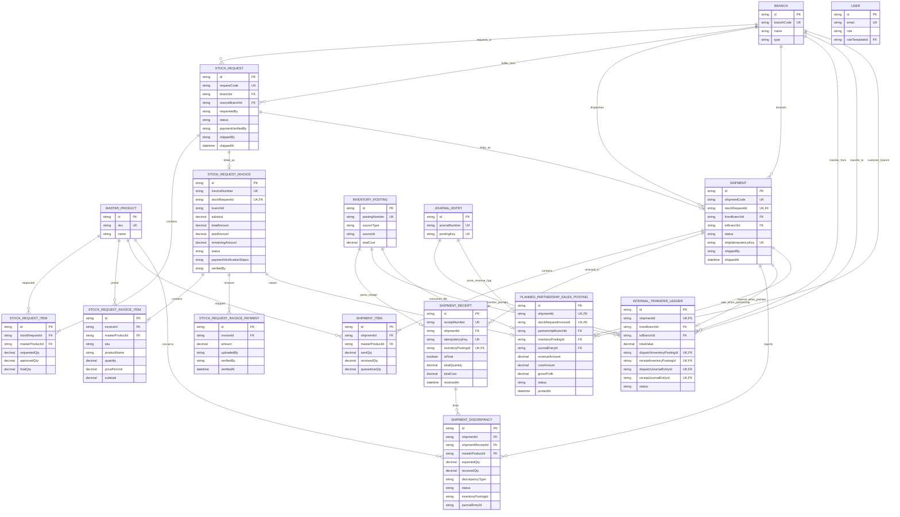
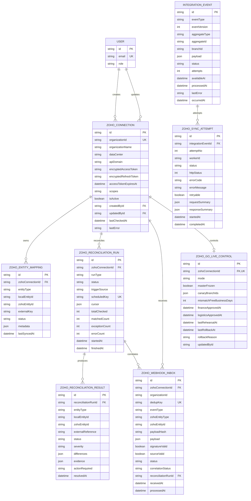
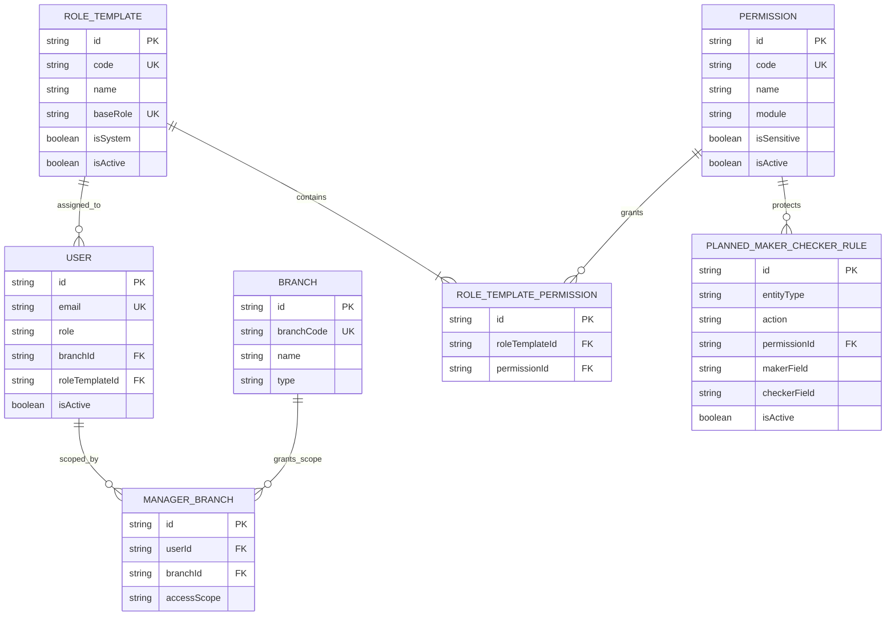
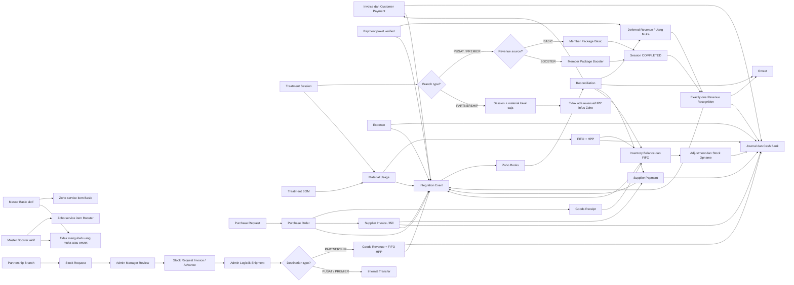

# ERD Terbaru Finance dan Logistik RAHO

Tanggal: 28 Juli 2026  
Sumber: `apps/api/prisma/schema.prisma`  
Format: Mermaid `erDiagram`

Requirement bisnis yang menjadi dasar ERD ini tersedia di
[Requirements Finance dan Logistik](./REQUIREMENTS_FINANCE_LOGISTICS_ZOHO.md).

Dokumen ini memecah ERD menjadi enam view agar tetap terbaca:

1. Finance Core dan AR;
2. Purchasing, AP, dan Goods Receipt;
3. Partnership Order, Invoice, dan Shipment;
4. Inventory dan Logistik;
5. Integrasi Zoho dan Access Control;
6. Alur lintas domain.

Kolom ditampilkan secara selektif: primary key, foreign key, nomor dokumen,
status, nilai utama, serta field idempotency/audit yang penting.

## 1. Finance Core dan Accounts Receivable

```mermaid
erDiagram
    BRANCH {
        string id PK
        string branchCode UK
        string name
        string type
    }

    USER {
        string id PK
        string email UK
        string role
        string branchId FK
    }

    MEMBER {
        string id PK
        string userId FK
        string memberNo UK
        string registrationBranchId FK
    }

    ACCOUNT {
        string id PK
        string code UK
        string name
        string type
        string normalBalance
        string parentId FK
        boolean allowPosting
        boolean isActive
    }

    ACCOUNTING_PERIOD {
        string id PK
        int fiscalYear
        int periodNo
        string branchId FK
        string scopeKey
        string status
        datetime startDate
        datetime endDate
    }

    JOURNAL_ENTRY {
        string id PK
        string journalNumber UK
        string postingKey UK
        string branchId FK
        string accountingPeriodId FK
        string status
        decimal totalDebit
        decimal totalCredit
        string reversedByEntryId FK
        datetime transactionDate
    }

    JOURNAL_LINE {
        string id PK
        string journalEntryId FK
        int lineNo
        string accountId FK
        string branchId FK
        decimal debit
        decimal credit
        string costCenterCode
    }

    JOURNAL_SOURCE_LINK {
        string id PK
        string journalEntryId FK
        string sourceType
        string sourceId
        string sourceNumber
        string relationType
    }

    INVOICE {
        string id PK
        string invoiceNumber UK
        string memberId FK
        string branchId FK
        string status
        decimal subtotal
        decimal discountAmount
        decimal taxAmount
        decimal totalAmount
        string currency
        datetime finalizedAt
        datetime dueDate
    }

    INVOICE_ITEM {
        string id PK
        string invoiceId FK
        string itemType
        string itemId
        string code
        decimal quantity
        decimal pricePerUnit
        decimal totalAmount
    }

    INVOICE_PAYMENT {
        string id PK
        string invoiceId FK
        string idempotencyKey UK
        string cashBankAccountId FK
        decimal amount
        string paymentMethod
        string verificationStatus
        datetime verifiedAt
    }

    CASH_BANK_ACCOUNT {
        string id PK
        string code UK
        string branchId FK
        string coaAccountId FK
        string type
        string currency
        boolean isActive
    }

    CASH_BANK_TRANSACTION {
        string id PK
        string transactionNumber UK
        string postingKey UK
        string cashBankAccountId FK
        string branchId FK
        string invoicePaymentId FK
        string journalEntryId FK
        string type
        decimal amount
        string sourceType
        string sourceId
    }

    EXPENSE {
        string id PK
        string expenseNumber UK
        string postingKey UK
        string branchId FK
        string expenseAccountId FK
        string cashBankAccountId FK
        string journalEntryId FK
        string cashBankTransactionId FK
        string status
        decimal amount
        datetime expenseDate
    }

    OPENING_BALANCE {
        string id PK
        string documentNumber UK
        string postingKey UK
        string branchId FK
        string journalEntryId FK
        string status
        datetime balanceDate
    }

    OPENING_BALANCE_LINE {
        string id PK
        string openingBalanceId FK
        int lineNo
        string accountId FK
        string cashBankAccountId FK
        string inventoryItemId FK
        string stockLocationId FK
        decimal debit
        decimal credit
    }

    PACKAGE_PRICING {
        string id PK
        string branchId FK
        string productCode
        string name
        int totalSessions
        decimal price
        boolean isActive
    }

    MEMBER_PACKAGE {
        string id PK
        string packageCode UK
        string memberId FK
        string branchId FK
        string packagePricingId FK
        string packageType
        int totalSessions
        int usedSessions
        decimal finalPrice
        decimal totalVerifiedPaid
        string status
    }

    PACKAGE_REVENUE_POLICY {
        string id PK
        string packagePricingId UK
        string recognitionMethod
        string deferredRevenueAccountId FK
        string revenueAccountId FK
        boolean isActive
    }

    PACKAGE_BENEFIT_VALUATION {
        string id PK
        string memberPackageId UK
        string policyId FK
        string recognitionMethod
        decimal allocatedConsideration
        int totalSessions
        decimal regularSessionRevenue
        decimal finalSessionRevenue
    }

    PACKAGE_REVENUE_CONTRACT {
        string id PK
        string memberPackageId UK
        string valuationId UK
        string branchId FK
        decimal totalConsideration
        decimal fundedDeferredAmount
        decimal recognizedAmount
        decimal remainingDeferredAmount
        int recognizedSessions
        string status
    }

    DEFERRED_REVENUE_MOVEMENT {
        string id PK
        string movementKey UK
        string contractId FK
        string memberPackageId FK
        string invoicePaymentId FK
        string treatmentSessionId FK
        string journalEntryId FK
        string type
        decimal amount
    }

    TREATMENT_SESSION {
        string id PK
        string sessionCode UK
        string branchId FK
        string boosterPackageId FK
        string materialPostingId FK
        string completionJournalEntryId FK
        string materialReversalPostingId FK
        string cancellationJournalEntryId FK
        boolean isCompleted
        string completionStatus
        decimal recognizedRevenue
        decimal materialCost
        decimal grossProfit
        datetime completedAt
    }

    PLANNED_TREATMENT_REVENUE_SOURCE {
        string id PK
        string treatmentSessionId UK, FK
        string memberPackageId FK
        string packagePricingId FK
        string revenueRecognitionId UK, FK
        string sourceType
        string productCodeSnapshot
        string serviceNameSnapshot
        datetime selectedAt
    }

    DOMAIN_EVENT {
        string id PK
        string eventKey UK
        string eventType
        string aggregateType
        string aggregateId
        string branchId FK
        string treatmentSessionId UK
        string payloadHash
        string status
    }

    REVENUE_RECOGNITION {
        string id PK
        string recognitionKey UK
        string domainEventId FK
        string treatmentSessionId FK
        string memberPackageId FK
        string contractId FK
        string branchId FK
        string journalEntryId FK
        int sessionOrdinal
        decimal amount
        string status
        datetime recognizedAt
    }

    ACCOUNT ||--o{ ACCOUNT : parent_of
    BRANCH ||--o{ USER : employs
    USER ||--o| MEMBER : owns_profile
    BRANCH ||--o{ MEMBER : registers

    BRANCH ||--o{ ACCOUNTING_PERIOD : scopes
    ACCOUNTING_PERIOD ||--o{ JOURNAL_ENTRY : contains
    BRANCH ||--o{ JOURNAL_ENTRY : posts
    JOURNAL_ENTRY ||--|{ JOURNAL_LINE : contains
    ACCOUNT ||--o{ JOURNAL_LINE : receives
    BRANCH ||--o{ JOURNAL_LINE : allocates
    JOURNAL_ENTRY ||--o{ JOURNAL_SOURCE_LINK : traces
    JOURNAL_ENTRY ||--o| JOURNAL_ENTRY : reverses

    MEMBER ||--o{ INVOICE : billed_to
    BRANCH ||--o{ INVOICE : issues
    INVOICE ||--|{ INVOICE_ITEM : contains
    INVOICE ||--o{ INVOICE_PAYMENT : receives

    ACCOUNT ||--o{ CASH_BANK_ACCOUNT : represented_by
    BRANCH ||--o{ CASH_BANK_ACCOUNT : owns
    CASH_BANK_ACCOUNT ||--o{ CASH_BANK_TRANSACTION : records
    INVOICE_PAYMENT ||--o| CASH_BANK_TRANSACTION : posts
    JOURNAL_ENTRY ||--o{ CASH_BANK_TRANSACTION : journals

    ACCOUNT ||--o{ EXPENSE : expense_account
    CASH_BANK_ACCOUNT ||--o{ EXPENSE : paid_through
    JOURNAL_ENTRY ||--o| EXPENSE : journals
    CASH_BANK_TRANSACTION ||--o| EXPENSE : settles

    OPENING_BALANCE ||--|{ OPENING_BALANCE_LINE : contains
    JOURNAL_ENTRY ||--o| OPENING_BALANCE : posts
    ACCOUNT ||--o{ OPENING_BALANCE_LINE : opens
    CASH_BANK_ACCOUNT ||--o{ OPENING_BALANCE_LINE : opens_cash

    BRANCH ||--o{ PACKAGE_PRICING : offers
    PACKAGE_PRICING ||--o{ MEMBER_PACKAGE : purchased_as
    PACKAGE_PRICING ||--o| PACKAGE_REVENUE_POLICY : governed_by
    MEMBER ||--o{ MEMBER_PACKAGE : owns
    BRANCH ||--o{ MEMBER_PACKAGE : sells
    ACCOUNT ||--o{ PACKAGE_REVENUE_POLICY : deferred_account
    ACCOUNT ||--o{ PACKAGE_REVENUE_POLICY : revenue_account
    MEMBER_PACKAGE ||--o| PACKAGE_BENEFIT_VALUATION : valued_once
    PACKAGE_REVENUE_POLICY ||--o{ PACKAGE_BENEFIT_VALUATION : snapshots
    PACKAGE_BENEFIT_VALUATION ||--o| PACKAGE_REVENUE_CONTRACT : creates
    MEMBER_PACKAGE ||--o| PACKAGE_REVENUE_CONTRACT : has_contract
    BRANCH ||--o{ PACKAGE_REVENUE_CONTRACT : owns
    PACKAGE_REVENUE_CONTRACT ||--o{ DEFERRED_REVENUE_MOVEMENT : moves
    MEMBER_PACKAGE ||--o{ DEFERRED_REVENUE_MOVEMENT : records
    INVOICE_PAYMENT ||--o{ DEFERRED_REVENUE_MOVEMENT : funds
    TREATMENT_SESSION ||--o{ DEFERRED_REVENUE_MOVEMENT : releases
    JOURNAL_ENTRY ||--o{ DEFERRED_REVENUE_MOVEMENT : journals

    BRANCH ||--o{ TREATMENT_SESSION : performs
    MEMBER_PACKAGE ||--o{ TREATMENT_SESSION : optional_booster
    TREATMENT_SESSION ||--o| PLANNED_TREATMENT_REVENUE_SOURCE : selects_one
    MEMBER_PACKAGE ||--o{ PLANNED_TREATMENT_REVENUE_SOURCE : charged_to
    PACKAGE_PRICING ||--o{ PLANNED_TREATMENT_REVENUE_SOURCE : identifies_service
    PLANNED_TREATMENT_REVENUE_SOURCE ||--o| REVENUE_RECOGNITION : produces
    JOURNAL_ENTRY ||--o| TREATMENT_SESSION : completion_journal
    JOURNAL_ENTRY ||--o| TREATMENT_SESSION : cancellation_journal
    BRANCH ||--o{ DOMAIN_EVENT : emits
    TREATMENT_SESSION ||--o| DOMAIN_EVENT : completes_once
    DOMAIN_EVENT ||--o{ REVENUE_RECOGNITION : reserves
    TREATMENT_SESSION ||--o{ REVENUE_RECOGNITION : recognizes
    MEMBER_PACKAGE ||--o{ REVENUE_RECOGNITION : earns
    PACKAGE_REVENUE_CONTRACT ||--o{ REVENUE_RECOGNITION : releases
    BRANCH ||--o{ REVENUE_RECOGNITION : posts
    JOURNAL_ENTRY ||--o{ REVENUE_RECOGNITION : journals
```



Catatan: `PLANNED_TREATMENT_REVENUE_SOURCE` adalah target perubahan schema.
Tabel ini memaksa satu sesi memilih tepat satu sumber omzet `BASIC` atau
`BOOSTER`. Model aktual masih menyimpan paket Basic pada Encounter dan paket
Booster opsional pada TreatmentSession.

## 2. Purchasing, Accounts Payable, dan Goods Receipt

```mermaid
erDiagram
    BRANCH {
        string id PK
        string branchCode UK
        string name
    }

    USER {
        string id PK
        string email UK
        string role
    }

    ACCOUNT {
        string id PK
        string code UK
        string name
        string type
    }

    JOURNAL_ENTRY {
        string id PK
        string journalNumber UK
        string postingKey UK
        decimal totalDebit
        decimal totalCredit
    }

    CASH_BANK_ACCOUNT {
        string id PK
        string code UK
        string branchId FK
        string coaAccountId FK
    }

    CASH_BANK_TRANSACTION {
        string id PK
        string transactionNumber UK
        string cashBankAccountId FK
        string journalEntryId FK
        decimal amount
    }

    SUPPLIER {
        string id PK
        string code UK
        string name
        string email
        string phone
        string taxId
        string status
    }

    PURCHASE_REQUEST {
        string id PK
        string requestNumber UK
        string postingKey UK
        string branchId FK
        string status
        datetime requestDate
        datetime requiredDate
    }

    PURCHASE_REQUEST_ITEM {
        string id PK
        string purchaseRequestId FK
        int lineNo
        string masterProductId FK
        decimal requestedQty
        decimal approvedQty
        decimal estimatedUnitCost
    }

    PURCHASE_ORDER {
        string id PK
        string poNumber UK
        string postingKey UK
        string purchaseRequestId FK
        string supplierId FK
        string branchId FK
        string status
        string currency
        decimal totalAmount
    }

    PURCHASE_ORDER_ITEM {
        string id PK
        string purchaseOrderId FK
        int lineNo
        string masterProductId FK
        string uomId FK
        string destinationStockLocationId FK
        decimal orderedQty
        decimal receivedQty
        decimal unitPrice
        decimal lineTotal
    }

    GOODS_RECEIPT {
        string id PK
        string receiptNumber UK
        string idempotencyKey UK
        string purchaseOrderId FK
        string branchId FK
        string journalEntryId FK
        string inventoryPostingId FK
        string status
        decimal totalQuantity
        decimal totalValue
        datetime receiptDate
    }

    GOODS_RECEIPT_LINE {
        string id PK
        string goodsReceiptId FK
        string purchaseOrderItemId FK
        int lineNo
        string inventoryItemId FK
        string stockLocationId FK
        string inventoryPostingId FK
        decimal quantity
        decimal unitCost
        decimal lineValue
        string batchNumber
    }

    GOODS_RECEIPT_ITEM {
        string id PK
        string goodsReceiptId FK
        string purchaseOrderItemId FK
        string inventoryItemId FK
        string inventoryBalanceId FK
        string stockLocationId FK
        string batchId FK
        string stockMutationId FK
        string costLayerId FK
        decimal quantity
        decimal unitCost
        string condition
    }

    SUPPLIER_INVOICE {
        string id PK
        string invoiceNumber UK
        string supplierInvoiceNumber
        string postingKey UK
        string purchaseOrderId FK
        string supplierId FK
        string branchId FK
        string grniAccountId FK
        string apAccountId FK
        string journalEntryId FK
        decimal amount
        decimal paidAmount
        decimal balanceAmount
        string status
    }

    SUPPLIER_INVOICE_LINE {
        string id PK
        string supplierInvoiceId FK
        string purchaseOrderItemId FK
        int lineNo
        string descriptionSnapshot
        decimal billedQty
        decimal unitPrice
        decimal lineTotal
    }

    SUPPLIER_PAYMENT {
        string id PK
        string paymentNumber UK
        string postingKey UK
        string supplierInvoiceId FK
        string cashBankAccountId FK
        string branchId FK
        string journalEntryId FK
        string cashBankTransactionId FK
        decimal amount
        datetime paymentDate
    }

    SUPPLIER_PAYMENT_REFUND {
        string id PK
        string refundNumber UK
        string postingKey UK
        string supplierPaymentId FK
        string supplierInvoiceId FK
        string cashBankAccountId FK
        string branchId FK
        string journalEntryId FK
        string cashBankTransactionId FK
        decimal amount
        string reason
        datetime refundDate
    }

    MASTER_PRODUCT {
        string id PK
        string sku UK
        string name
        string baseUomId FK
    }

    UNIT_OF_MEASURE {
        string id PK
        string code UK
        string name
    }

    STOCK_LOCATION {
        string id PK
        string code
        string warehouseId FK
        string name
    }

    INVENTORY_ITEM {
        string id PK
        string masterProductId FK
        string branchId FK
        string stockLocationId FK
    }

    INVENTORY_POSTING {
        string id PK
        string postingNumber UK
        string sourceType
        string sourceId
        decimal totalCost
    }

    INVENTORY_BALANCE {
        string id PK
        string inventoryItemId FK
        string stockLocationId FK
        string batchId FK
        decimal onHandQty
    }

    INVENTORY_BATCH {
        string id PK
        string masterProductId FK
        string batchNumber
        datetime expiryDate
    }

    STOCK_MUTATION {
        string id PK
        string inventoryItemId FK
        string inventoryPostingId FK
        decimal quantity
        decimal stockBefore
        decimal stockAfter
    }

    INVENTORY_COST_LAYER {
        string id PK
        string inventoryBalanceId FK
        string batchId FK
        string sourceType
        string sourceId
        decimal originalQty
        decimal remainingQty
        decimal unitCost
    }

    BRANCH ||--o{ PURCHASE_REQUEST : requests
    PURCHASE_REQUEST ||--|{ PURCHASE_REQUEST_ITEM : contains
    MASTER_PRODUCT ||--o{ PURCHASE_REQUEST_ITEM : requested

    PURCHASE_REQUEST ||--o| PURCHASE_ORDER : converts_to
    SUPPLIER ||--o{ PURCHASE_ORDER : supplies
    BRANCH ||--o{ PURCHASE_ORDER : orders
    PURCHASE_ORDER ||--|{ PURCHASE_ORDER_ITEM : contains
    MASTER_PRODUCT ||--o{ PURCHASE_ORDER_ITEM : ordered
    UNIT_OF_MEASURE ||--o{ PURCHASE_ORDER_ITEM : uses
    STOCK_LOCATION ||--o{ PURCHASE_ORDER_ITEM : destination

    PURCHASE_ORDER ||--o{ GOODS_RECEIPT : receives
    GOODS_RECEIPT ||--|{ GOODS_RECEIPT_LINE : contains
    PURCHASE_ORDER_ITEM ||--o{ GOODS_RECEIPT_LINE : fulfills
    INVENTORY_ITEM ||--o{ GOODS_RECEIPT_LINE : receives
    STOCK_LOCATION ||--o{ GOODS_RECEIPT_LINE : stored_at
    INVENTORY_POSTING ||--o| GOODS_RECEIPT_LINE : posts

    GOODS_RECEIPT ||--|{ GOODS_RECEIPT_ITEM : materializes
    PURCHASE_ORDER_ITEM ||--o{ GOODS_RECEIPT_ITEM : fulfills
    INVENTORY_ITEM ||--o{ GOODS_RECEIPT_ITEM : affects
    STOCK_LOCATION ||--o{ GOODS_RECEIPT_ITEM : stored_at
    INVENTORY_BALANCE ||--o{ GOODS_RECEIPT_ITEM : increments
    INVENTORY_BATCH ||--o{ GOODS_RECEIPT_ITEM : batches
    STOCK_MUTATION ||--o| GOODS_RECEIPT_ITEM : mutates
    INVENTORY_COST_LAYER ||--o| GOODS_RECEIPT_ITEM : values

    JOURNAL_ENTRY ||--o| GOODS_RECEIPT : journals
    INVENTORY_POSTING ||--o| GOODS_RECEIPT : posts

    PURCHASE_ORDER ||--o{ SUPPLIER_INVOICE : billed_by
    SUPPLIER ||--o{ SUPPLIER_INVOICE : invoices
    BRANCH ||--o{ SUPPLIER_INVOICE : incurs
    ACCOUNT ||--o{ SUPPLIER_INVOICE : grni_account
    ACCOUNT ||--o{ SUPPLIER_INVOICE : ap_account
    JOURNAL_ENTRY ||--o| SUPPLIER_INVOICE : journals
    SUPPLIER_INVOICE ||--o{ SUPPLIER_INVOICE_LINE : contains
    PURCHASE_ORDER_ITEM ||--o{ SUPPLIER_INVOICE_LINE : bills_received_quantity

    SUPPLIER_INVOICE ||--o{ SUPPLIER_PAYMENT : paid_by
    CASH_BANK_ACCOUNT ||--o{ SUPPLIER_PAYMENT : paid_through
    BRANCH ||--o{ SUPPLIER_PAYMENT : pays
    JOURNAL_ENTRY ||--o| SUPPLIER_PAYMENT : journals
    CASH_BANK_TRANSACTION ||--o| SUPPLIER_PAYMENT : settles
    SUPPLIER_PAYMENT ||--o{ SUPPLIER_PAYMENT_REFUND : refunded_by
    SUPPLIER_INVOICE ||--o{ SUPPLIER_PAYMENT_REFUND : restores_ap
    CASH_BANK_ACCOUNT ||--o{ SUPPLIER_PAYMENT_REFUND : received_to
    BRANCH ||--o{ SUPPLIER_PAYMENT_REFUND : receives
    JOURNAL_ENTRY ||--o| SUPPLIER_PAYMENT_REFUND : journals
    CASH_BANK_TRANSACTION ||--o| SUPPLIER_PAYMENT_REFUND : settles
```



## 3. Partnership Order, Invoice, dan Shipment



Catatan:

- `StockRequestInvoice.branchId`, actor ID, serta ID posting pada
  `ShipmentDiscrepancy` masih scalar tanpa Prisma relation dan tidak digambar
  sebagai foreign-key relation;
- shipment ke `PARTNERSHIP` memakai
  `PLANNED_PARTNERSHIP_SALES_POSTING`;
- shipment ke `PUSAT/PREMIER` memakai `INTERNAL_TRANSFER_LEDGER`;
- kedua jalur bersifat mutually exclusive agar shipment tidak menjadi sale dan
  transfer sekaligus.

## 4. Inventory dan Logistik

```mermaid
erDiagram
    BRANCH {
        string id PK
        string branchCode UK
        string name
    }

    MASTER_PRODUCT {
        string id PK
        string sku UK
        string name
        string category
        string baseUomId FK
        string usageUomId FK
        boolean tracksBatch
        boolean tracksExpiry
        boolean isActive
    }

    PACKAGE_PRICING {
        string id PK
        string branchId FK
        string productCode
        string name
        int totalSessions
        decimal price
        boolean isActive
    }

    TREATMENT_BOM {
        string id PK
        string bomCode UK
        string packagePricingId FK
        string branchId FK
        int version
        string status
        datetime effectiveFrom
        datetime effectiveTo
        string supersededById FK
    }

    TREATMENT_BOM_ITEM {
        string id PK
        string treatmentBomId FK
        string masterProductId FK
        decimal recommendedQuantity
        string unitSnapshot
        decimal tolerancePercent
        boolean isRequired
    }

    UNIT_OF_MEASURE {
        string id PK
        string code UK
        string name
        string category
        int precision
    }

    UNIT_CONVERSION {
        string id PK
        string masterProductId FK
        string fromUomId FK
        string toUomId FK
        decimal factor
        boolean isActive
    }

    WAREHOUSE {
        string id PK
        string code UK
        string branchId FK
        string name
        boolean isActive
    }

    STOCK_LOCATION {
        string id PK
        string code
        string warehouseId FK
        string name
        boolean isActive
    }

    INVENTORY_ITEM {
        string id PK
        string masterProductId FK
        string branchId FK
        string warehouseId FK
        string stockLocationId FK
        decimal stock
        decimal minThreshold
    }

    INVENTORY_BATCH {
        string id PK
        string masterProductId FK
        string batchNumber
        datetime manufactureDate
        datetime expiryDate
        boolean isBlocked
    }

    INVENTORY_BALANCE {
        string id PK
        string inventoryItemId FK
        string stockLocationId FK
        string masterProductId FK
        string branchId FK
        string batchId FK
        string batchKey
        decimal onHandQty
        decimal reservedQty
        decimal quarantineQty
        decimal inTransitQty
        int version
    }

    INVENTORY_POSTING {
        string id PK
        string postingNumber UK
        string idempotencyKey UK
        string type
        string status
        string sourceType
        string sourceId
        string branchId FK
        decimal totalCost
        string reversalOfId FK
        datetime occurredAt
    }

    STOCK_MUTATION {
        string id PK
        string inventoryItemId FK
        string inventoryPostingId FK
        string inventoryBalanceId FK
        string batchId FK
        string type
        decimal quantity
        decimal stockBefore
        decimal stockAfter
        decimal actualCost
    }

    INVENTORY_COST_LAYER {
        string id PK
        string inventoryBalanceId FK
        string batchId FK
        string sourceType
        string sourceId
        decimal originalQty
        decimal remainingQty
        decimal unitCost
        string valuationStatus
        datetime receivedAt
    }

    INVENTORY_COST_ALLOCATION {
        string id PK
        string postingId FK
        string stockMutationId FK
        string costLayerId FK
        string type
        decimal quantity
        decimal unitCost
        decimal totalCost
        string reversalOfId FK
    }

    INVENTORY_ADJUSTMENT {
        string id PK
        string adjustmentNumber UK
        string idempotencyKey UK
        string branchId FK
        string stockLocationId FK
        string reasonCode
        string status
        string sourceType
        string sourceId
        string approvalInstanceId FK
        string inboundPostingId FK
        string outboundPostingId FK
        string journalEntryId FK
        decimal totalPostedValue
    }

    INVENTORY_ADJUSTMENT_LINE {
        string id PK
        string inventoryAdjustmentId FK
        int lineNo
        string inventoryItemId
        string batchId
        string direction
        decimal quantity
        decimal unitCost
        decimal postedValue
        string inventoryPostingId
    }

    STOCK_OPNAME {
        string id PK
        string opnameNumber UK
        string idempotencyKey UK
        string branchId FK
        string warehouseId
        string stockLocationId
        string status
        string reasonCode
        string approvalInstanceId FK
        string adjustmentId
        string journalEntryId FK
        decimal totalAdjustmentValue
        datetime snapshotAt
    }

    STOCK_OPNAME_LINE {
        string id PK
        string stockOpnameId FK
        int lineNo
        string inventoryItemId FK
        string stockLocationId FK
        string inventoryBalanceId
        string batchId FK
        decimal systemQty
        decimal physicalQty
        decimal differenceQty
        string resolution
        string inventoryPostingId FK
        string stockMutationId FK
    }

    TREATMENT_SESSION {
        string id PK
        string sessionCode UK
        string branchId FK
        string materialPostingId FK
        string completionJournalEntryId FK
        string materialReversalPostingId FK
        string cancellationJournalEntryId FK
        boolean isCompleted
        string completionStatus
        decimal recognizedRevenue
        decimal materialCost
        decimal grossProfit
        datetime completedAt
    }

    MATERIAL_USAGE {
        string id PK
        string usageKey UK
        string treatmentSessionId FK
        string inventoryItemId FK
        string treatmentBomItemId FK
        string inventoryPostingId FK
        decimal quantity
        decimal baseQuantity
        decimal actualUnitCost
        decimal totalActualCost
        string status
        datetime consumedAt
    }

    JOURNAL_ENTRY {
        string id PK
        string journalNumber UK
        string postingKey UK
    }

    APPROVAL_INSTANCE {
        string id PK
        string entityKey UK
        string module
        string entityType
        string entityId
        string status
    }

    UNIT_OF_MEASURE ||--o{ MASTER_PRODUCT : base_uom
    UNIT_OF_MEASURE ||--o{ MASTER_PRODUCT : usage_uom
    MASTER_PRODUCT ||--o{ UNIT_CONVERSION : converts
    UNIT_OF_MEASURE ||--o{ UNIT_CONVERSION : from_uom
    UNIT_OF_MEASURE ||--o{ UNIT_CONVERSION : to_uom

    BRANCH ||--o{ PACKAGE_PRICING : offers
    PACKAGE_PRICING ||--o{ TREATMENT_BOM : defines
    BRANCH ||--o{ TREATMENT_BOM : scopes
    TREATMENT_BOM ||--|{ TREATMENT_BOM_ITEM : contains
    TREATMENT_BOM ||--o| TREATMENT_BOM : supersedes
    MASTER_PRODUCT ||--o{ TREATMENT_BOM_ITEM : consumes

    BRANCH ||--o{ WAREHOUSE : owns
    WAREHOUSE ||--o{ STOCK_LOCATION : contains

    MASTER_PRODUCT ||--o{ INVENTORY_ITEM : instantiated_as
    BRANCH ||--o{ INVENTORY_ITEM : stocks
    WAREHOUSE ||--o{ INVENTORY_ITEM : stored_in
    STOCK_LOCATION ||--o{ INVENTORY_ITEM : default_location

    MASTER_PRODUCT ||--o{ INVENTORY_BATCH : batches
    INVENTORY_ITEM ||--o{ INVENTORY_BALANCE : balances
    STOCK_LOCATION ||--o{ INVENTORY_BALANCE : holds
    MASTER_PRODUCT ||--o{ INVENTORY_BALANCE : aggregates
    INVENTORY_BATCH ||--o{ INVENTORY_BALANCE : identifies
    BRANCH ||--o{ INVENTORY_BALANCE : owns

    BRANCH ||--o{ INVENTORY_POSTING : posts
    INVENTORY_POSTING ||--o| INVENTORY_POSTING : reverses
    INVENTORY_POSTING ||--|{ STOCK_MUTATION : contains
    INVENTORY_ITEM ||--o{ STOCK_MUTATION : mutates
    INVENTORY_BALANCE ||--o{ STOCK_MUTATION : affects
    INVENTORY_BATCH ||--o{ STOCK_MUTATION : tracks

    INVENTORY_BALANCE ||--o{ INVENTORY_COST_LAYER : values
    INVENTORY_BATCH ||--o{ INVENTORY_COST_LAYER : batches
    INVENTORY_POSTING ||--o{ INVENTORY_COST_ALLOCATION : allocates
    STOCK_MUTATION ||--o{ INVENTORY_COST_ALLOCATION : consumes
    INVENTORY_COST_LAYER ||--o{ INVENTORY_COST_ALLOCATION : source_layer
    INVENTORY_COST_ALLOCATION ||--o| INVENTORY_COST_ALLOCATION : reverses

    INVENTORY_ADJUSTMENT ||--|{ INVENTORY_ADJUSTMENT_LINE : contains
    APPROVAL_INSTANCE ||--o| INVENTORY_ADJUSTMENT : approves
    INVENTORY_POSTING ||--o| INVENTORY_ADJUSTMENT : inbound_posting
    INVENTORY_POSTING ||--o| INVENTORY_ADJUSTMENT : outbound_posting
    JOURNAL_ENTRY ||--o| INVENTORY_ADJUSTMENT : journals

    BRANCH ||--o{ STOCK_OPNAME : performs
    APPROVAL_INSTANCE ||--o| STOCK_OPNAME : approves
    JOURNAL_ENTRY ||--o| STOCK_OPNAME : journals
    STOCK_OPNAME ||--|{ STOCK_OPNAME_LINE : contains
    INVENTORY_ITEM ||--o{ STOCK_OPNAME_LINE : counts
    STOCK_LOCATION ||--o{ STOCK_OPNAME_LINE : at_location
    INVENTORY_BATCH ||--o{ STOCK_OPNAME_LINE : by_batch
    INVENTORY_POSTING ||--o{ STOCK_OPNAME_LINE : posts
    STOCK_MUTATION ||--o{ STOCK_OPNAME_LINE : mutates

    BRANCH ||--o{ TREATMENT_SESSION : performs
    TREATMENT_SESSION ||--o{ MATERIAL_USAGE : consumes
    INVENTORY_ITEM ||--o{ MATERIAL_USAGE : supplies
    TREATMENT_BOM_ITEM ||--o{ MATERIAL_USAGE : recommends
    INVENTORY_POSTING ||--o{ MATERIAL_USAGE : posts
    INVENTORY_POSTING ||--o| TREATMENT_SESSION : material_posting
    INVENTORY_POSTING ||--o| TREATMENT_SESSION : material_reversal
    JOURNAL_ENTRY ||--o| TREATMENT_SESSION : completion_journal
    JOURNAL_ENTRY ||--o| TREATMENT_SESSION : cancellation_journal
```



Catatan: `InventoryAdjustmentLine.inventoryItemId`, `batchId`, dan
`inventoryPostingId` saat ini tersimpan sebagai ID tetapi belum dideklarasikan
sebagai Prisma relation. Diagram tidak menggambar relasi tersebut sebagai
foreign-key relation agar sesuai schema aktual.

## 5. Integrasi Zoho Finance–Logistik dan Access Control

Seluruh entitas pada bagian ini sudah tersedia pada Prisma schema setelah
Sprint 14.



Relasi `IntegrationEvent.aggregateId` dan
`ZohoEntityMapping.localEntityId` bersifat polymorphic. Nilainya dapat
menunjuk ke:

```text
Invoice
InvoicePayment
MemberPackage
PackageRevenueContract
RevenueRecognition
Expense
Supplier
PurchaseOrder
SupplierInvoice
SupplierPayment
SupplierPaymentRefund
MasterProduct
InventoryAdjustment
StockOpname
TreatmentSession
MaterialUsage
StockRequestInvoice
Shipment
PlannedPartnershipSalesPosting
```

Karena bukan foreign key langsung, relasi polymorphic tersebut tidak digambar
sebagai garis ERD.

### Access Control Finance Logistics Controller



Target seed:

```text
Role enum/template: FINANCE_LOGISTICS_CONTROLLER
Modules: FINANCE, INVENTORY, PURCHASING, AP, ZOHO, AUDIT
Scope: assigned branches
Restriction: maker != checker
Clinical access: none
```

## 6. Alur hubungan antardomain


