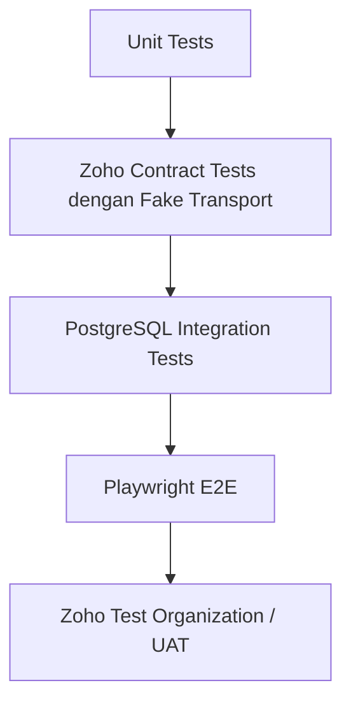

# Sprint dan Test Plan Terbaru Integrasi Zoho Finance–Logistik

Status: backlog siap grooming  
Tanggal: 28 Juli 2026  
Durasi sprint rekomendasi: 2 minggu  
Target: Zoho Books organisasi test terlebih dahulu  
Referensi arsitektur:
[Requirements Finance dan Logistik](./REQUIREMENTS_FINANCE_LOGISTICS_ZOHO.md),
[Development Flow Integrasi Finance dan Logistik](./DEVELOPMENT_FLOW_INTEGRASI_FINANCE_LOGISTIK_ZOHO.md)
dan [ERD Finance dan Logistik](./ERD_FINANCE_LOGISTIK_MERMAID.md).

## 1. Tujuan dokumen

Dokumen ini memecah pengembangan menjadi sprint per fitur dan menjelaskan cara
membuktikan bahwa setiap fitur:

- benar secara bisnis;
- tidak membuat dokumen atau stok ganda;
- aman saat Zoho lambat atau tidak tersedia;
- dapat diretry;
- dapat direkonsiliasi;
- mencatat omzet Partnership per order/shipment, bukan per infus;
- dapat dikontrol role gabungan tanpa melanggar maker-checker;
- tidak membocorkan token atau data klinis;
- dapat dimatikan tanpa menghentikan transaksi RAHO.

## 2. Strategi pengujian

### 2.1 Test pyramid



| Level | Tujuan | Boleh akses Zoho asli? |
|---|---|---|
| Unit | Mapper, validator, retry, hashing, state machine | Tidak |
| Contract | Request/response Zoho melalui fake HTTP transport | Tidak |
| DB integration | Atomic outbox, locking, mapping, idempotency | Tidak |
| E2E | UI mapping, queue, retry, permission | Tidak; gunakan fake adapter |
| Sandbox UAT | Membuktikan perilaku API/edition Zoho sebenarnya | Ya, organisasi test saja |
| Production smoke | Read-only health dan reconciliation | Ya, tanpa create data test |

### 2.2 Pemisahan transport

Semua service Zoho harus memakai interface:

```ts
interface ZohoTransport {
  get<T>(path: string, query?: Record<string, string>): Promise<T>;
  post<T>(path: string, body: unknown, query?: Record<string, string>): Promise<T>;
  put<T>(path: string, body: unknown, query?: Record<string, string>): Promise<T>;
}
```

Implementasi:

- `HttpZohoTransport`: production;
- `FakeZohoTransport`: unit, contract, dan E2E;
- jangan memanggil `axios` langsung dari service invoice/item/payment.

### 2.3 Flag test

```env
RUN_ZOHO_DB_TESTS=false
RUN_ZOHO_SANDBOX_TESTS=false
ZOHO_TEST_ORGANIZATION_ID=
ZOHO_SYNC_DRY_RUN=true
ZOHO_SYNC_WORKER_ENABLED=false
```

Test sandbox harus menggunakan guard:

```ts
const describeZohoSandbox =
  process.env.RUN_ZOHO_SANDBOX_TESTS === 'true' ? describe : describe.skip;
```

CI biasa tidak boleh memiliki Client Secret atau refresh token Zoho production.

### 2.4 Identitas data UAT

Semua data UAT diberi reference:

```text
RAHO-UAT-<YYYYMMDD>-<runId>
```

Contoh:

```text
customer : RAHO-UAT-CUSTOMER-a82f
invoice  : RAHO-UAT-INV-a82f
item SKU : UAT-ITEM-a82f
PO       : RAHO-UAT-PO-a82f
```

Jangan menghapus transaksi untuk membersihkan UAT. Gunakan void, reversal,
inactive, atau organisasi test yang dapat di-reset.

## 3. Perintah standar

```bash
# Static validation
npm run type-check:all
npm run build:api
npm run build:web

# Seluruh unit test backend
npm --prefix apps/api test -- --runInBand

# Test modul Zoho saja
npm --prefix apps/api test -- --runInBand src/modules/zoho/__tests__

# Test database Zoho
RUN_ZOHO_DB_TESTS=true npm --prefix apps/api test -- --runInBand \
  src/modules/zoho/__tests__/zoho.integration.test.ts

# E2E halaman integrasi
npm --prefix apps/web run e2e -- e2e/flows/zoho-integration.spec.ts

# Sandbox test, hanya organisasi test
RUN_ZOHO_SANDBOX_TESTS=true npm --prefix apps/api test -- --runInBand \
  src/modules/zoho/__tests__/zoho.sandbox.test.ts
```

Untuk PowerShell:

```powershell
$env:RUN_ZOHO_DB_TESTS='true'
npm.cmd --prefix apps/api test -- --runInBand src/modules/zoho/__tests__/zoho.integration.test.ts
Remove-Item Env:RUN_ZOHO_DB_TESTS
```

## 4. Sprint 1 — Integration Core

### Fitur

- `ZohoClient`;
- refresh token otomatis;
- error normalization;
- `ZohoEntityMapping`;
- outbox worker;
- event locking;
- retry/dead-letter;
- sync attempt audit;
- feature flag dan dry-run.

### Backlog

Backend:

1. Buat `ZohoTransport` dan `HttpZohoTransport`.
2. Pindahkan seluruh request OAuth/organization melalui client terpusat.
3. Tambahkan migration mapping dan attempt.
4. Perluas `IntegrationEvent` dengan lease dan retry.
5. Implementasikan worker batch.
6. Buat sanitizer untuk request/response log.
7. Buat endpoint:

   ```text
   GET  /integrations/zoho/events
   GET  /integrations/zoho/events/:id
   POST /integrations/zoho/events/:id/retry
   POST /integrations/zoho/events/:id/ignore
   ```

Frontend:

- tab Antrean;
- filter status/module/tanggal;
- detail attempt;
- tombol retry dengan permission;
- indikator dry-run.

### Unit test

| ID | Test | Hasil |
|---|---|---|
| CORE-U01 | access token masih valid | Tidak refresh |
| CORE-U02 | token hampir kedaluwarsa | Refresh satu kali |
| CORE-U03 | dua request bersamaan saat token expired | Hanya satu refresh |
| CORE-U04 | Zoho 429 | Menjadwalkan retry dengan backoff |
| CORE-U05 | Zoho 400 validation | Failed actionable, tidak retry otomatis |
| CORE-U06 | Zoho 401 setelah refresh | Connection unhealthy |
| CORE-U07 | sanitizer menerima token/payload | Token dan field sensitif hilang |
| CORE-U08 | payload sama | Hash stabil |

### DB integration test

| ID | Test | Hasil |
|---|---|---|
| CORE-I01 | transaksi dan event commit | Keduanya tersimpan |
| CORE-I02 | transaksi rollback | Event tidak tersimpan |
| CORE-I03 | dua worker lock event | Satu worker mendapat event |
| CORE-I04 | worker mati saat PROCESSING | Lease kedaluwarsa dan event dapat diambil ulang |
| CORE-I05 | retry event processed | Ditolak |
| CORE-I06 | max attempts tercapai | Dead-letter |
| CORE-I07 | mapping lokal ganda | Unique constraint menolak |
| CORE-I08 | mapping Zoho ganda | Unique constraint menolak |

### E2E

- Super Admin dapat melihat antrean dan retry.
- User tanpa permission tidak melihat tombol retry.
- Token tidak tampil pada network response, UI, atau error detail.
- Dark/light mode tetap terbaca.

### Exit criteria

- 100 event paralel diproses tanpa duplicate;
- tidak ada token di log;
- kill/restart worker tidak kehilangan event;
- dry-run menghasilkan preview tanpa request write ke Zoho.

## 5. Sprint 2 — OAuth Scope dan Master Finance Discovery

### Fitur

- versioning OAuth scope;
- reconnect saat scope bertambah;
- discovery Organization, COA, Taxes, Locations, dan bank/payment configuration;
- cache read-only.

### Scope awal

```text
ZohoBooks.settings.READ
ZohoBooks.banking.READ
ZohoBooks.accountants.READ
```

Scope ditambah bertahap pada sprint write; jangan meminta semua izin sebelum
fiturnya siap.

### Test

| ID | Test | Hasil |
|---|---|---|
| DISC-U01 | granted scopes kurang | UI menunjukkan reconnect required |
| DISC-U02 | organization berbeda | Sync diblok |
| DISC-C01 | list organizations response | Mapper membaca ID, currency, timezone |
| DISC-C02 | pagination COA | Semua halaman diambil tepat sekali |
| DISC-C03 | response field tambahan | Parser tetap kompatibel |
| DISC-I01 | discovery dijalankan ulang | Cache di-upsert, tidak duplicate |
| DISC-I02 | akun sudah inactive | Mapping ditandai needs review |
| DISC-E01 | user reconnect | Scope dan status diperbarui |

### UAT

1. Cocokkan organization name dan ID.
2. Cocokkan base currency IDR.
3. Cocokkan timezone Asia/Jakarta.
4. Bandingkan jumlah akun aktif RAHO UI dengan Zoho.
5. Pilih account mapping minimum dan simpan.

### Exit criteria

- seluruh prerequisite finance dapat dibaca;
- missing scope terdeteksi sebelum event diproses;
- tidak ada write ke Zoho.

## 6. Sprint 3 — Contact: Customer dan Vendor

### Fitur

- mapping Member → Customer;
- mapping Supplier → Vendor;
- create/update contact;
- manual review untuk ambiguous match.

### Scope

```text
ZohoBooks.contacts.READ
ZohoBooks.contacts.CREATE
ZohoBooks.contacts.UPDATE
```

### Mapping test

| ID | Test | Hasil |
|---|---|---|
| CT-U01 | custom field RAHO ID cocok | Auto-match |
| CT-U02 | nama + tanggal lahir tepat satu | Suggested match |
| CT-U03 | dua customer cocok | Needs review |
| CT-U04 | tanggal lahir berbeda | Tidak auto-match |
| CT-U05 | vendor NPWP/email cocok unik | Suggested match |
| CT-U06 | contact type salah | Tidak dipakai |
| CT-U07 | payload member mengandung diagnosis | Field medis tidak ikut |

### Contract test

- create customer menghasilkan `contact_id`;
- create vendor menggunakan tipe vendor;
- update memakai Zoho ID mapping;
- retry setelah timeout mencari reference unik sebelum create ulang;
- Zoho validation error dipetakan ke field UI.

### Sandbox UAT

1. Buat satu customer UAT.
2. Jalankan event yang sama dua kali.
3. Pastikan hanya satu contact.
4. Update nomor telepon.
5. Pastikan contact yang sama berubah.
6. Buat satu vendor UAT dan lakukan pengujian sama.
7. Tandai contact UAT inactive setelah selesai.

### Exit criteria

- duplicate contact = 0;
- payload tidak mengandung data klinis;
- ambiguous mapping selalu membutuhkan manusia.

## 7. Sprint 4 — Item dan Location

### Fitur

- Branch/StockLocation → Zoho Location;
- MasterProduct → Zoho Item;
- PackagePricing Basic → Zoho Item service Basic;
- PackagePricing Booster → Zoho Item service Booster yang berbeda;
- Treatment BOM tetap lokal dan tidak dikirim;
- account dan UOM validation;
- item mapping dashboard.

### Scope

```text
ZohoBooks.settings.READ
ZohoBooks.settings.CREATE
ZohoBooks.settings.UPDATE
```

### Unit/contract test

| ID | Test | Hasil |
|---|---|---|
| ITEM-U01 | SKU kosong | Diblok |
| ITEM-U02 | SKU duplicate | Diblok |
| ITEM-U03 | UOM belum mapped | Needs action |
| ITEM-U04 | inventory account kosong | Needs action |
| ITEM-U05 | service item | Tidak memakai inventory fields |
| ITEM-U06 | batch/expiry ada | Tidak dikirim ke Books |
| ITEM-U07 | terapi/paket baru aktif | Membuat event service item, bukan revenue |
| ITEM-U08 | Treatment BOM berubah | Tidak mengubah Zoho service item stock |
| ITEM-U09 | harga terapi berubah | Update rate; kontrak member lama tidak berubah |
| ITEM-U10 | product code Basic dan Booster berbeda | Membuat dua mapping service item |
| ITEM-U11 | product code Basic/Booster bentrok | Mapping diblok |
| ITEM-C01 | create inventory item | Zoho item ID disimpan |
| ITEM-C02 | update nama/rate | Item yang sama diperbarui |
| ITEM-C03 | retry timeout | Tidak membuat item kedua |
| LOC-C01 | location unsupported | Feature gate menjadi blocked |

### Sandbox UAT

- buat satu goods inventory item;
- buat satu service item terapi;
- buat service item Basic dan Booster dengan external key berbeda;
- verifikasi SKU, UOM, sales/purchase/inventory account;
- ubah nama dan rate;
- pastikan update tidak mengubah opening stock;
- pastikan pembuatan service item tidak mengubah omzet atau uang muka;
- nonaktifkan item UAT setelah test.

### Exit criteria

- 100% item yang akan disinkron mempunyai SKU/account/UOM;
- duplicate SKU nol;
- location capability sudah terbukti pada edition Zoho yang digunakan.

## 8. Sprint 5 — Sales Invoice

### Fitur

- event `INVOICE_FINALIZED`;
- create invoice;
- snapshot customer/line/tax/discount;
- void invoice;
- mapping invoice.

### Scope

```text
ZohoBooks.invoices.READ
ZohoBooks.invoices.CREATE
ZohoBooks.invoices.UPDATE
```

### Unit test

| ID | Test | Hasil |
|---|---|---|
| INV-U01 | invoice DRAFT | Tidak membuat event |
| INV-U02 | invoice FINALIZED | Event atomic dibuat |
| INV-U03 | customer belum mapped | Event needs action |
| INV-U04 | line total + tax + discount | Sama dengan invoice snapshot |
| INV-U05 | rounding IDR | Total tepat |
| INV-U06 | retry setelah master berubah | Tetap memakai snapshot |
| INV-U07 | invoice cancelled | Void, bukan delete |

### DB/concurrency test

- dua request finalize bersamaan menghasilkan satu event;
- dua worker memproses invoice sama menghasilkan satu mapping;
- timeout setelah Zoho create tetapi sebelum mapping disimpan: worker mencari
  unique reference dan menautkan dokumen existing.

### Sandbox UAT

Data:

```text
Customer UAT
Invoice 2 baris
Diskon baris dan invoice
Pajak sesuai konfigurasi Indonesia
allow_partial_payments=true
```

Verifikasi:

- customer;
- nomor/reference;
- tanggal dan due date;
- quantity/rate;
- subtotal, tax, discount, total;
- status;
- location.

### Exit criteria

- total RAHO = total Zoho;
- 20 kali replay menghasilkan satu invoice;
- void dapat direkonsiliasi.

## 9. Sprint 6 — Customer Payment dan AR Reconciliation

### Fitur

- event `PAYMENT_VERIFIED`;
- partial/full payment;
- klasifikasi pembayaran penjualan biasa dan uang muka paket;
- payment method/bank mapping;
- refund/reversal;
- AR reconciliation.

### Scope

```text
ZohoBooks.customerpayments.READ
ZohoBooks.customerpayments.CREATE
ZohoBooks.customerpayments.UPDATE
ZohoBooks.invoices.DELETE
```

Scope `ZohoBooks.invoices.DELETE` hanya dipakai untuk melepas aplikasi
pembayaran dari invoice sebelum refund parsial. Invoice dan Customer Payment
asal tidak dihapus; sisa pembayaran kemudian diaplikasikan kembali agar saldo
invoice tetap benar dan jejak audit tetap utuh.

### Test

| ID | Test | Hasil |
|---|---|---|
| PAY-U01 | payment PENDING | Tidak dikirim |
| PAY-U02 | payment REJECTED | Tidak dikirim |
| PAY-U03 | payment VERIFIED | Event dibuat |
| PAY-U04 | partial payment | `amount_applied` benar |
| PAY-U05 | payment melebihi outstanding | Diblok |
| PAY-U06 | bank account belum mapped | Needs action |
| PAY-U07 | verified payment paket terapi | Dirutekan ke deferred/retainer, bukan omzet |
| PAY-I01 | dua verify bersamaan | Satu payment |
| PAY-C01 | full payment | Invoice Zoho paid |
| PAY-C02 | partial payment | Balance kedua sistem sama |
| PAY-C03 | refund | Mengacu payment asli |

### Reconciliation test

Buat kombinasi:

- unpaid;
- partially paid;
- paid;
- void;
- payment missing;
- amount mismatch.

Pastikan classification dan total per status benar.

### Exit criteria

- outstanding mismatch = 0 untuk data UAT normal;
- rejected payment tidak pernah muncul di Zoho;
- retry tidak membuat duplicate.

### Status implementasi 28 Juli 2026

- backend, migration, event outbox, mapping, refund, UI, dan rekonsiliasi:
  selesai;
- unit test dan integration test database: lulus;
- live UAT Zoho: menunggu reconnect OAuth scope versi 6, mapping rekening dan
  metode pembayaran, worker live, serta dry-run dimatikan.

## 10. Sprint 7 — Uang Muka, Retainer, dan Treatment Revenue

### Tujuan

Memastikan uang paket terapi belum menjadi omzet saat diterima. Omzet baru
diakui ketika sesi benar-benar `COMPLETED`.

### Fitur

- klasifikasi invoice/payment `NORMAL_SALE` dan `THERAPY_ADVANCE`;
- payment verified paket membentuk funding `DeferredRevenueMovement`;
- simpan satu `revenueSourceType` dan `revenuePackageId` per session;
- ubah selector lama `[basicPackageId, boosterPackageId]` menjadi selector
  eksklusif;
- upgrade kontrak `TREATMENT_COMPLETED` dari v2 ke v3;
- tambahkan `finance.recognitions[]` dengan satu line Basic atau Booster;
- create dan mapping Zoho Retainer Invoice;
- record retainer payment;
- `TREATMENT_COMPLETED` v3 finance consumer;
- document mode: create invoice sesi dan apply retainer;
- journal mode sebagai fallback terkontrol;
- reconciliation deferred revenue dan recognized revenue;
- reversal `TREATMENT_COMPLETION_CANCELLED`.

### Scope

```text
Document mode:
ZohoBooks.invoices.READ
ZohoBooks.invoices.CREATE
ZohoBooks.invoices.UPDATE

Journal fallback:
ZohoBooks.accountants.READ
ZohoBooks.accountants.CREATE
ZohoBooks.accountants.UPDATE
```

### Aturan posting

```text
Master terapi baru:
Zoho service item berubah
Deferred revenue = tetap
Omzet = tetap

Payment paket verified:
Debit  Kas/Bank
Kredit Deferred Revenue

Treatment COMPLETED:
Debit  Deferred Revenue
Kredit Pendapatan Terapi

Material:
Debit  HPP Terapi
Kredit Persediaan
```

Document mode adalah default. Journal mode hanya boleh diaktifkan melalui
feature flag dan tidak boleh berjalan bersamaan untuk kontrak yang sama.

### Unit test

| ID | Test | Hasil |
|---|---|---|
| REV-U01 | master terapi baru | Item service event saja; tidak ada revenue event |
| REV-U02 | booking/session in progress | Deferred dan omzet tidak berubah |
| REV-U03 | payment paket PENDING/REJECTED | Tidak membuat funding/retainer |
| REV-U04 | payment paket VERIFIED | Funding dan retainer dibuat satu kali |
| REV-U05 | harga master berubah setelah pembelian | Recognition tetap memakai valuation snapshot |
| REV-U06 | session belum `COMPLETED` | Tidak ada recognition |
| REV-U07 | session `COMPLETED` | Recognition sesuai session ordinal |
| REV-U08 | deferred tidak cukup | Completion diblok dengan error actionable |
| REV-U09 | document mode aktif | Journal revenue tidak dikirim ke Zoho |
| REV-U10 | journal mode aktif | Session invoice/apply retainer tidak dibuat |
| REV-U11 | event mengandung payload klinis | Adapter hanya mengambil allowlist finansial |
| REV-U12 | sesi gratis | Tidak memaksa retainer/revenue bernilai nol |
| REV-U13 | sumber BASIC | Hanya contract Basic yang berkurang |
| REV-U14 | sumber BOOSTER | Hanya contract Booster yang berkurang |
| REV-U15 | Booster tanpa `boosterPackageId` | Completion diblok |
| REV-U16 | Basic menunjuk package Booster | Completion diblok |
| REV-U17 | Basic dan Booster sama-sama dipilih | Completion diblok |
| REV-U18 | event v3 | Tepat satu `finance.recognitions[]` |
| REV-U19 | line Basic | Product code dan Zoho service item Basic |
| REV-U20 | line Booster | Product code dan Zoho service item Booster |

### DB, concurrency, dan contract test

| ID | Test | Hasil |
|---|---|---|
| REV-I01 | verify payment dua kali | Satu funding movement dan satu retainer mapping |
| REV-I02 | completion bersamaan | Satu `RevenueRecognition` per sesi dan paket |
| REV-I03 | retry setelah invoice sesi dibuat | Mencari external reference; tidak membuat invoice kedua |
| REV-I04 | retry apply retainer | Saldo retainer berkurang satu kali |
| REV-I05 | finance consumer sukses, inventory gagal | Finance tetap satu; inventory dapat diretry |
| REV-I06 | inventory sukses, finance gagal | Inventory tetap satu; finance dapat diretry |
| REV-I07 | cancellation replay | Satu reversal dan menunjuk transaksi asli |
| REV-I08 | completion Booster | Saldo/recognized session Basic tetap |
| REV-I09 | completion Basic | Saldo/recognized session Booster tetap |
| REV-I10 | replay event v2 lama | Diproses compatibility reader tanpa menebak sumber baru |
| REV-C01 | create retainer | Customer, amount, date, dan reference benar |
| REV-C02 | create session invoice | Service item dan recognized amount benar |
| REV-C03 | apply retainer | Invoice lunas dan saldo retainer turun tepat |
| REV-C04 | journal fallback | Debit/credit seimbang dan account mapping benar |

### Sandbox UAT

1. Buat service item Basic dan Booster; pastikan omzet dan retainer tidak
   berubah.
2. Buat retainer Basic Rp2.000.000 dan Booster Rp1.000.000.
3. Selesaikan sesi Booster dengan revenue allocation Rp250.000.
4. Pastikan retainer Booster menjadi Rp750.000 dan omzet Booster Rp250.000.
5. Pastikan retainer Basic tetap Rp2.000.000 dan omzet Basic tetap nol.
6. Selesaikan sesi Basic dengan revenue allocation Rp500.000.
7. Pastikan retainer Basic menjadi Rp1.500.000 dan omzet Basic Rp500.000.
8. Pastikan retainer Booster tetap Rp750.000.
9. Replay kedua event 10 kali; seluruh saldo dan omzet tetap sama.
10. Batalkan completion Booster; pastikan omzet Booster direversal dan retainer
   tersedia kembali.
11. Pastikan Basic tidak ikut direversal.
12. Pastikan tidak ada nama pasien, diagnosis, catatan klinis, atau foto di
   payload Zoho.

### Exit criteria

- master terapi tidak pernah memposting omzet;
- verified advance menjadi liability/retainer;
- completion mengurangi deferred dan menambah omzet tepat satu kali;
- completion Basic tidak mengubah Booster dan completion Booster tidak mengubah
  Basic;
- Zoho invoice sesi memakai service item sesuai sumber omzet;
- document mode dan journal mode tidak pernah double-post;
- saldo deferred RAHO sama dengan saldo retainer/unearned revenue Zoho;
- cancellation dapat direkonsiliasi sampai dokumen asal.

## 11. Sprint 8 — Expense

### Fitur

- event `EXPENSE_PAID`;
- expense account dan paid-through account mapping;
- receipt/attachment;
- reversal/void policy.

### Scope

```text
ZohoBooks.expenses.READ
ZohoBooks.expenses.CREATE
ZohoBooks.expenses.UPDATE
```

### Test

| ID | Test | Hasil |
|---|---|---|
| EXP-U01 | DRAFT/SUBMITTED | Tidak dikirim |
| EXP-U02 | APPROVED belum paid | Tidak dikirim |
| EXP-U03 | PAID | Event dibuat |
| EXP-U04 | evidence PDF/JPG valid | Attachment berhasil |
| EXP-U05 | evidence terlalu besar/tipe salah | Error actionable |
| EXP-U06 | account tidak mapped | Needs action |
| EXP-U07 | bukti mengandung URL internal | URL tidak dikirim sebagai teks |
| EXP-C01 | create expense | Amount/account/date sama |
| EXP-C02 | receipt upload gagal | Expense mapped, attachment retry terpisah |

### UAT

- expense tunai;
- expense bank;
- expense dengan receipt PDF;
- expense tanpa receipt;
- edit/reversal sesuai kebijakan Finance.

### Exit criteria

- expense total dan cash/bank account cocok;
- attachment failure tidak menggandakan expense;
- tidak ada evidence/token di application log.

## 12. Sprint 9 — Partnership Order Sale dan Finance Logistics Controller

### Tujuan

Mencatat pendapatan pusat dari penjualan barang kepada cabang Partnership,
bukan dari keuntungan setiap infus.

### Fitur

- route berdasarkan `Branch.type`;
- Partnership branch → Zoho Customer;
- `StockRequest` dan `StockRequestInvoice`;
- payment Partnership sebagai customer advance bila dibayar sebelum shipment;
- `PARTNERSHIP_GOODS_SHIPPED` event version 1;
- invoice penjualan barang berdasarkan shipment snapshot;
- FIFO HPP dan inventory pusat;
- discrepancy, return, dan reversal;
- treatment completion Partnership di-skip oleh seluruh consumer Zoho;
- role `FINANCE_LOGISTICS_CONTROLLER`;
- branch scope dan maker-checker.

### Flow

```text
Admin Cabang Partnership membuat StockRequest
-> Admin Manager review quantity/harga/invoice
-> Payment diverifikasi sesuai kebijakan
-> Admin Logistik membuat dan mengirim Shipment
-> status SHIPPED
-> event dibuat
-> Zoho sales invoice barang
-> revenue + HPP per order/shipment
```

### Accounting

Payment sebelum shipment:

```text
Dr Kas/Bank
Cr Customer Advance Partnership
```

Shipment:

```text
Dr Customer Advance / Piutang Partnership
Cr Pendapatan Penjualan Barang Partnership

Dr HPP Penjualan Partnership
Cr Persediaan Pusat
```

Completion infus Partnership:

```text
Zoho revenue = tidak ada
Zoho HPP infus = tidak ada
RAHO session/material operational record = tetap ada
```

### Unit test

| ID | Test | Hasil |
|---|---|---|
| PART-U01 | destination `PARTNERSHIP` | Route partnership sale |
| PART-U02 | destination `PREMIER`/`PUSAT` | Route internal transfer |
| PART-U03 | StockRequest baru | Belum ada omzet/event sales |
| PART-U04 | invoice/payment approved | Masih belum omzet jika belum shipped |
| PART-U05 | shipment `PREPARING` | Tidak ada event |
| PART-U06 | shipment `SHIPPED` | Satu `PARTNERSHIP_GOODS_SHIPPED` |
| PART-U07 | harga invoice berubah setelah shipped | Event tetap memakai snapshot |
| PART-U08 | treatment Partnership completed | Consumer Zoho di-skip |
| PART-U09 | treatment Premier completed | Tetap mengikuti Basic/Booster |
| PART-U10 | payment sebelum ship | Customer advance, bukan revenue |
| PART-U11 | discrepancy/return | Reversal menunjuk shipment asli |
| PART-U12 | payload | Tidak ada data klinis |

### DB, concurrency, dan contract test

| ID | Test | Hasil |
|---|---|---|
| PART-I01 | dua dispatch bersamaan | Satu shipment event |
| PART-I02 | retry 10 kali | Satu sales invoice dan satu HPP |
| PART-I03 | timeout setelah invoice Zoho dibuat | External reference menemukan invoice existing |
| PART-I04 | FIFO dispatch gagal | Shipment/event/revenue rollback |
| PART-I05 | invoice Zoho sukses, HPP consumer retry | Revenue tidak digandakan |
| PART-I06 | treatment Partner replay | Tetap tidak ada transaksi Zoho |
| PART-C01 | invoice lines | SKU, quantity, unit price, total sesuai snapshot |
| PART-C02 | HPP | Sama dengan FIFO shipment pusat |
| PART-C03 | payment application | Customer advance diterapkan satu kali |

### Role test

| ID | Test | Hasil |
|---|---|---|
| ROLE-U01 | Controller melihat Finance + Logistik | Menu dan API sesuai permission |
| ROLE-U02 | akses cabang assigned | Diizinkan |
| ROLE-U03 | akses cabang di luar scope | `403` |
| ROLE-U04 | Controller membuat dan approve request sama | Ditolak |
| ROLE-U05 | Controller upload dan verify payment sama | Ditolak |
| ROLE-U06 | Controller membuat dan post adjustment sama | Ditolak |
| ROLE-U07 | akses EMR/diagnosis/foto | Ditolak |
| ROLE-U08 | membaca plaintext token Zoho | Tidak tersedia |
| ROLE-U09 | retry event/reconciliation | Diizinkan dan diaudit |

### Sandbox UAT

1. Mapping cabang Partnership UAT sebagai customer Zoho.
2. Buat StockRequest barang 10 unit.
3. Review invoice Rp5.000.000; pastikan Zoho belum mencatat omzet.
4. Verifikasi payment; pastikan menjadi customer advance.
5. Admin Logistik melakukan dispatch dengan cost FIFO Rp3.000.000.
6. Pastikan Zoho mencatat revenue Rp5.000.000, HPP Rp3.000.000, dan gross
   profit Rp2.000.000.
7. Replay event 10 kali; angka tidak berubah.
8. Selesaikan infus di cabang Partnership; pastikan tidak ada revenue/HPP baru
   di Zoho.
9. Buat shipment ke cabang Premier; pastikan tetap internal transfer.
10. Uji role Controller pada cabang assigned dan non-assigned.

### Exit criteria

- omzet Partnership hanya berasal dari shipment penjualan barang;
- tidak ada profit per infus Partnership di Zoho;
- satu shipment menghasilkan satu revenue dan satu HPP;
- Premier/Pusat tidak salah diklasifikasikan sebagai sale;
- role Controller lulus branch scope dan maker-checker;
- discrepancy/reversal dapat direkonsiliasi.

## 13. Sprint 10 — Purchase Order

### Fitur

- vendor/item/location dependency;
- event `PO_ISSUED`;
- partial line;
- cancel PO;
- PO mapping.

### Scope

```text
ZohoBooks.purchaseorders.READ
ZohoBooks.purchaseorders.CREATE
ZohoBooks.purchaseorders.UPDATE
```

### Test

| ID | Test | Hasil |
|---|---|---|
| PO-U01 | Purchase Request | Tidak dikirim |
| PO-U02 | PO belum issued | Tidak dikirim |
| PO-U03 | vendor/item belum mapped | Needs action |
| PO-U04 | ordered quantity conversion | Sesuai UOM Zoho |
| PO-U05 | total lines | Sama dengan total PO |
| PO-C01 | create PO | Zoho ID disimpan |
| PO-C02 | retry | Satu PO |
| PO-C03 | cancel | Status cancelled, bukan delete |
| PO-I01 | dua PO issue request | Satu event |

### Sandbox UAT

- PO satu item;
- PO multi-item;
- partial receiving dilakukan hanya di RAHO;
- cancel PO yang belum billed;
- pastikan PO tidak mengubah stock on hand Zoho.

### Exit criteria

- PO total dan status cocok;
- stok Zoho tidak berubah ketika PO dibuat.

## 14. Sprint 11 — Goods Receipt, Bill, dan GRNI

### Fitur

- received-not-billed dashboard;
- event `SUPPLIER_INVOICE_POSTED`;
- Bill linked ke PO;
- partial Bill;
- AP balance;
- anti-double-stock.

### Scope

```text
ZohoBooks.bills.READ
ZohoBooks.bills.CREATE
ZohoBooks.bills.UPDATE
```

### Invariant utama

```text
Goods Receipt RAHO  -> stock RAHO + FIFO
Supplier Invoice    -> Zoho Bill
Zoho quantity       -> naik satu kali
```

### Test

| ID | Test | Hasil |
|---|---|---|
| BILL-U01 | GR tanpa supplier invoice | Tidak membuat Bill/adjustment |
| BILL-U02 | supplier invoice posted | Event Bill dibuat |
| BILL-U03 | billed qty > received qty | Diblok |
| BILL-U04 | partial receipt/bill | Hanya quantity billed dikirim |
| BILL-U05 | supplier invoice duplicate | Unique constraint menolak |
| BILL-C01 | Bill linked PO | Relasi terlihat di Zoho |
| BILL-C02 | Bill retry | Satu Bill |
| BILL-C03 | Bill + inventory path | Stok bertambah tepat quantity billed |
| GRNI-I01 | GR lewat SLA belum billed | Exception muncul |

### Sandbox UAT

1. Catat stock awal item Zoho.
2. Buat PO quantity 10.
3. Goods Receipt RAHO quantity 10.
4. Pastikan Zoho belum naik karena mode Books-only.
5. Posting Supplier Invoice quantity 10.
6. Pastikan Zoho naik tepat 10, bukan 20.
7. Ulangi dengan partial Bill 4 + 6.

### Exit criteria

- tidak ada double-posting;
- received-not-billed dapat dijelaskan;
- AP dan inventory quantity sesuai transaksi billed.

## 15. Sprint 12 — Vendor Payment dan AP Reconciliation

### Fitur

- event `AP_PAYMENT_POSTED`;
- apply vendor payment ke Bill;
- bank mapping;
- partial/full vendor payment;
- AP reconciliation.

### Scope

```text
ZohoBooks.vendorpayments.READ
ZohoBooks.vendorpayments.CREATE
ZohoBooks.vendorpayments.UPDATE
```

### Test

| ID | Test | Hasil |
|---|---|---|
| VP-U01 | Bill belum mapped | Payment diblok |
| VP-U02 | paid-through account belum mapped | Needs action |
| VP-U03 | partial payment | Balance Bill sesuai |
| VP-U04 | overpayment | Diblok/ditangani sesuai kebijakan |
| VP-C01 | create vendor payment | Applied ke bill_id yang benar |
| VP-C02 | retry | Satu payment |
| VP-C03 | reversal/refund | Mengacu payment asli |
| AP-R01 | matched | MATCHED |
| AP-R02 | missing Zoho | MISSING_IN_ZOHO |
| AP-R03 | amount mismatch | AMOUNT_MISMATCH |

### Exit criteria

- AP balance sama;
- partial payment dan retry aman;
- bank/cash mapping tervalidasi.

## 16. Sprint 13 — Treatment Completion dan Inventory Usage

### Fitur

- capability PoC;
- konsumsi Treatment BOM dan FIFO lokal;
- `TREATMENT_COMPLETED` event version 3;
- `TREATMENT_COMPLETION_CANCELLED`;
- inventory consumer terpisah dari finance consumer Sprint 7;
- manual adjustment;
- stock opname;
- quantity/value reconciliation.

Sprint ini tidak boleh dimulai sebelum endpoint/fitur adjustment terbukti
tersedia pada organisasi Zoho yang dipakai.

### Privacy test

Payload keluar dari inventory adapter hanya boleh mengandung:

```text
event reference
date
item/SKU
location
quantity
unit rate/value
reason
material posting reference
```

Forbidden:

```text
nama pasien
diagnosis
keluhan
catatan dokter
hasil lab
foto
detail terapi klinis
```

### Test

| ID | Test | Hasil |
|---|---|---|
| ADJ-U01 | session belum completed | Tidak ada event |
| ADJ-U02 | completed | Satu event dengan material snapshot |
| ADJ-U03 | retry completion | Event tetap satu |
| ADJ-U04 | item/location missing | Needs action |
| ADJ-U05 | payload privacy scan | Tidak ada forbidden field |
| ADJ-U06 | event version 3 | Satu recognition line, revenue, HPP, gross profit, posting, dan material snapshot tersedia |
| ADJ-U07 | BOM berubah setelah completion | Event lama tetap memakai snapshot |
| ADJ-U08 | branch Partnership | Treatment consumer Zoho di-skip |
| ADJ-U09 | branch Premier/Pusat | Treatment consumer tetap aktif |
| ADJ-C01 | quantity out | Stok Zoho turun sesuai pemakaian |
| ADJ-C02 | cancellation | Reversal menambah kembali quantity |
| ADJ-C03 | damaged/expired | Reason dan loss value sesuai |
| ADJ-C04 | stock opname gain/loss | Quantity akhir cocok |
| ADJ-I01 | completion concurrent | Satu adjustment |
| ADJ-I02 | callback timeout | Reconciliation menemukan existing adjustment |
| ADJ-I03 | posting material gagal | Revenue, session, dan event ikut rollback |
| ADJ-I04 | posting revenue gagal | Material, session, dan event ikut rollback |
| ADJ-I05 | finance sudah sukses, inventory retry | Retainer/revenue tidak berubah lagi |
| ADJ-I06 | Booster completion | Material sesuai BOM Booster; Basic tidak berubah |
| ADJ-I07 | Basic completion | Material sesuai BOM Basic; Booster tidak berubah |
| ADJ-I08 | Partner treatment replay | Tidak ada revenue/HPP/inventory Zoho |

### Sandbox UAT

1. Pilih item UAT dengan stock 20.
2. Siapkan retainer Rp2.000.000 dan selesaikan session UAT dengan pemakaian 2
   serta recognized revenue Rp500.000.
3. Pastikan stock Zoho menjadi 18.
4. Pastikan retainer menjadi Rp1.500.000 dan revenue Rp500.000.
5. Retry event 5 kali; stock tetap 18 dan revenue tetap Rp500.000.
6. Cancel completion; stock kembali 20, revenue direversal, dan retainer kembali
   tersedia.
7. Pastikan tidak ada data klinis pada Zoho.

### Fallback test

Jika API adjustment tidak tersedia:

- worker menandai `CAPABILITY_UNSUPPORTED`;
- tidak membuat journal palsu untuk mengubah quantity;
- feature flag tetap off;
- export adjustment terkontrol tersedia;
- keputusan menggunakan Zoho Inventory dieskalasikan.

### Exit criteria

- quantity dan value dapat direkonsiliasi;
- inventory retry tidak menggandakan finance posting;
- completion lokal terbukti atomik untuk session, revenue, HPP, stok, dan event;
- treatment Partnership hanya mengubah operasional lokal RAHO;
- duplicate/retry nol;
- privacy test lulus.

## 17. Sprint 14 — Webhook, Reconciliation, Cutover, dan Go-live

### Fitur

- webhook inbox;
- signature/source validation sesuai kemampuan Zoho;
- dedup webhook;
- scheduled reconciliation;
- dashboard exception;
- cutover;
- canary dan rollout.

### Test webhook

| ID | Test | Hasil |
|---|---|---|
| WH-U01 | webhook sama dua kali | Satu inbox record |
| WH-U02 | payload invalid | 400 |
| WH-U03 | source invalid | Ditolak |
| WH-U04 | event unknown | Disimpan aman/ignored |
| WH-I01 | webhook manual edit | Drift exception dibuat |
| WH-I02 | webhook datang sebelum mapping | Pending correlation |

### Reconciliation scenarios

- exact match;
- missing in Zoho;
- missing in RAHO;
- amount mismatch;
- status mismatch;
- duplicate external reference;
- transaction date masuk closed period;
- manual edit Zoho;
- pagination lebih dari satu halaman;
- rate limit di tengah run;
- treatment revenue ditemukan pada Partnership;
- shipment Partnership salah diklasifikasikan sebagai transfer internal;
- run dilanjutkan setelah restart.

### Cutover rehearsal

Lakukan minimal dua kali di organisasi test:

1. freeze master;
2. export snapshot;
3. run discovery;
4. approve mapping;
5. import/adopt opening balance;
6. aktifkan worker dry-run;
7. review payload;
8. aktifkan write canary;
9. reconcile;
10. rollback feature flag;
11. ulangi hingga runbook dapat dijalankan orang lain.

### Canary

- satu cabang;
- satu customer;
- satu invoice/payment;
- satu vendor/PO/Bill/payment;
- satu item adjustment;
- observasi lima hari kerja;
- perluas cabang hanya jika mismatch material = 0.

### Exit criteria

- semua reconciliation normal `MATCHED`;
- dead-letter kosong atau memiliki owner/action;
- rollback feature flag teruji;
- Finance dan Logistik menandatangani UAT;
- runbook insiden tersedia.

## 18. Regression matrix

| Perubahan | Test wajib diulang |
|---|---|
| OAuth/scopes | Core, discovery, semua sandbox smoke |
| Contact mapper | Contact, invoice, PO |
| Item mapper | Item, invoice, PO, Bill, adjustment |
| Account mapping | Invoice, payment, expense, Bill, vendor payment |
| Location mapping | Invoice, payment, item, PO, adjustment |
| Worker/retry | Seluruh concurrency dan idempotency test |
| Invoice payload | Invoice, payment, AR reconciliation |
| Retainer/revenue payload | Payment classification, treatment completion, cancellation, deferred reconciliation |
| Bill payload | PO, Bill, vendor payment, AP/inventory reconciliation |
| Inventory payload | Treatment, cancellation, opname, privacy |
| Treatment completion event | Revenue consumer, inventory consumer, atomicity, privacy |
| Partnership routing | Stock request, payment, shipment sale, HPP, treatment skip |
| Controller role | Branch scope, maker-checker, Finance/Logistik permissions |

## 19. Release gate setiap sprint

Sprint tidak boleh ditandai Done sebelum:

```text
[ ] type-check API dan web lulus
[ ] build API dan web lulus
[ ] unit tests lulus
[ ] contract tests lulus
[ ] DB integration tests lulus
[ ] E2E role/permission lulus
[ ] tidak ada secret pada log/test artifact
[ ] migration deploy dan rollback strategy direview
[ ] dokumentasi endpoint/event diperbarui
[ ] reconciliation atau verification query tersedia
[ ] acceptance criteria ditandatangani product owner
```

Untuk sprint yang melakukan write ke Zoho:

```text
[ ] sandbox UAT lulus
[ ] ID/reference data UAT tercatat
[ ] dokumen Zoho hasil test diperiksa Finance/Logistik
[ ] feature flag default OFF
[ ] canary plan tersedia
```

## 20. Evidence yang harus disimpan

Setiap test run menghasilkan:

- commit SHA;
- migration version;
- organization test ID, bukan token;
- test run ID;
- daftar event key;
- daftar Zoho external ID;
- hasil Jest/Playwright;
- screenshot UAT tanpa secret;
- reconciliation report;
- approver Finance dan Logistik;
- tanggal dan environment.

Template:

```text
Sprint:
Commit:
Environment:
Zoho test organization:
Run ID:
Automated tests:
Sandbox scenarios:
Reconciliation result:
Known exceptions:
Approved by:
```

## 21. Definition of production-ready

Integrasi dinyatakan siap production bila:

1. OAuth refresh stabil.
2. Scope minimal sudah benar.
3. Mapping prerequisite 100% untuk entity yang diaktifkan.
4. Retry tidak menghasilkan duplicate.
5. RAHO tetap berfungsi saat Zoho down.
6. AR/AP/deferred revenue/recognized revenue/inventory dapat direkonsiliasi.
7. Tidak ada data medis atau token di Zoho/log.
8. Feature flag dan rollback telah diuji.
9. Canary lima hari kerja tidak menghasilkan mismatch material, retainer, atau
   recognized revenue.
10. Finance dan Logistik menyetujui hasil UAT.
11. Partnership treatment tidak menghasilkan revenue/HPP per infus di Zoho.
12. Partnership shipment sale dapat direkonsiliasi per invoice dan HPP.
13. Role Controller lulus branch scope dan maker-checker.
