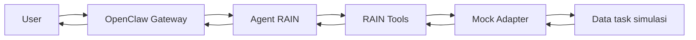
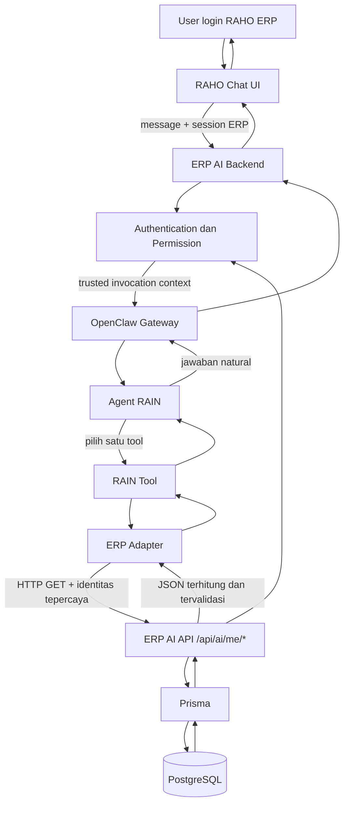

# Dokumentasi Arsitektur dan Integrasi RAIN

**RAIN — Raho Artificial Intelligence Network**  
Versi dokumen: 1.0  
Tanggal: 16 September 2026  
Status: RAIN Demo v1 selesai; integrasi ERP menunggu kontrak dan endpoint dari Jovan.

---

## 1. Tujuan

RAIN adalah lapisan percakapan untuk membantu user memahami data kerja mereka di RAHO ERP. Pada V1, RAIN hanya membaca, merangkum, membandingkan, dan menjelaskan data task. RAIN tidak membuat atau mengubah data ERP.

Target pengalaman pengguna:

> User login ke RAHO ERP, membuka chatbot, lalu bertanya “Gimana kinerja gue hari ini?” RAIN menjawab menggunakan data milik user yang sedang login.

Dokumen ini menjelaskan:

- arsitektur RAIN saat ini;
- arsitektur target setelah terhubung ke ERP;
- batas tanggung jawab RAIN dan ERP;
- kontrak lima tool RAIN;
- rancangan endpoint dan payload;
- autentikasi dan permission;
- langkah integrasi, pengujian, rollout, serta rollback.

---

## 2. Kondisi Saat Ini

RAIN Demo v1 berjalan secara lokal pada Mac dengan:

| Komponen | Kondisi |
|---|---|
| OpenClaw | 2026.6.11 |
| Node.js | v26.7.0 |
| Agent ID | `rain` |
| Nama | RAIN — Raho Artificial Intelligence Network |
| Mode | Data simulasi |
| Hak akses tool | Baca saja |
| Tool aktif | 5 tool RAIN |
| Timezone | Asia/Jakarta |
| Skenario aktif | `normal` |
| Automated test | 32 lulus, 0 gagal |
| ERP asli | Belum terhubung |

Arsitektur demo:



Semua angka demo dibuat dan dihitung secara deterministik oleh `service.js`. Model hanya memilih tool dan menjelaskan hasilnya.

### Komponen implementasi

| File | Tanggung jawab |
|---|---|
| `workspace/AGENTS.md` | Aturan kerja, pemilihan tool, interpretasi data, permission, dan batas tindakan |
| `workspace/SOUL.md` | Karakter, gaya bicara, dan cara membedakan fakta, interpretasi, serta saran |
| `plugin/index.js` | Definisi lima tool dan registrasi tool ke OpenClaw |
| `plugin/service.js` | Mock adapter, data simulasi, validasi parameter, periode, hitungan, dan error demo |
| `plugin/erp-adapter.js` | Kerangka koneksi ERP, timeout, pemetaan status HTTP, serta pemeriksaan identitas awal |
| `plugin/tests/service.test.js` | Tes unit dan kontrak untuk mock adapter serta batas awal ERP adapter |

`erp-adapter.js` belum aktif. Adapter tersebut sengaja berhenti dengan `INTEGRATION_PENDING` meskipun menerima respons HTTP 200, sampai binding identitas dan validasi payload produksi selesai.

---

## 3. Arsitektur Target Produksi



### Prinsip arsitektur

1. **ERP tetap menjadi source of truth.** Data, identitas, permission, dan matematika bisnis berada di backend ERP.
2. **RAIN tidak terhubung langsung ke PostgreSQL.** Semua data masuk melalui endpoint ERP yang sempit dan terkontrol.
3. **Identitas tidak berasal dari prompt.** Nama, role, `userId`, dan `branchId` dari chat tidak boleh dipercaya.
4. **Model tidak menghitung metrik bisnis.** Total, overdue, completion rate, dan delta dihitung backend.
5. **Tool bersifat sempit.** Tidak ada `execute_sql`, URL bebas, atau tool mutasi.
6. **Gagal secara tertutup.** Jika identitas, permission, versi kontrak, atau payload tidak valid, RAIN tidak menampilkan data dan tidak beralih diam-diam ke data demo.

---

## 4. Pembagian Tanggung Jawab

### ERP/Jovan

- Login dan sesi user.
- Penentuan `userId`, role, cabang, serta permission.
- Endpoint `/api/ai/me/*`.
- Query Prisma/PostgreSQL.
- Definisi final metrik bisnis.
- Perhitungan angka dan pagination.
- Validasi akses pada setiap request.
- Chat UI dan jalur request dari browser ke backend.
- Audit log akses data AI.

### RAIN/OpenClaw

- Memahami pertanyaan user.
- Menentukan periode dan intent.
- Memilih satu atau beberapa tool yang sesuai.
- Mengirim parameter yang diizinkan ke adapter.
- Memvalidasi bentuk respons sebelum diberikan ke model.
- Menjelaskan angka menggunakan bahasa natural.
- Menjaga percakapan lanjutan, misalnya “bandingin sama minggu lalu” atau “lanjut”.
- Menolak perubahan data dan klaim identitas dari chat.

### Batas bersama

ERP dan RAIN harus menyepakati kontrak versi, autentikasi transport, definisi metrik, format error, timezone, batas pagination, dan strategi timeout.

---

## 5. Alur Permintaan

Contoh pertanyaan:

> “Gimana performa gue minggu ini?”

Urutannya:

1. Browser mengirim pesan ke ERP AI Backend menggunakan sesi login ERP.
2. ERP memvalidasi sesi dan menentukan identitas user.
3. ERP memanggil OpenClaw menggunakan konteks server-side yang tepercaya.
4. RAIN mengenali intent `personal performance` dan periode `this_week`.
5. RAIN memanggil `get_my_performance({ period: "this_week" })`.
6. ERP adapter mengambil identitas dari konteks tepercaya, bukan dari parameter model.
7. Adapter memanggil endpoint ERP dengan timeout.
8. Endpoint memeriksa ulang session dan permission, mengambil data, lalu menghitung metrik.
9. Adapter memvalidasi versi kontrak, identitas, tipe data, enum, angka, dan konsistensi payload.
10. RAIN menjelaskan hasil, termasuk batas periode berjalan.

Jika salah satu pemeriksaan gagal, RAIN menampilkan error yang aman tanpa mengarang data.

---

## 6. Kontrak Tool RAIN

Nama kelima tool berikut dibekukan untuk integrasi V1.

### 6.1 `get_my_daily_performance`

Kegunaan: ringkasan task milik user yang jatuh tempo hari ini.

Parameter: tidak ada.

Contoh pertanyaan:

- “Gimana kinerja gue hari ini?”
- “Hari ini gue punya berapa task?”
- “Berapa yang selesai?”

### 6.2 `get_my_performance`

Kegunaan: ringkasan task untuk satu periode.

Parameter:

| Field | Tipe | Keterangan |
|---|---|---|
| `period` | enum | `today`, `yesterday`, `this_week`, `last_week`, `this_month`, `last_month`, atau `custom` |
| `startDate` | `YYYY-MM-DD` | Wajib hanya untuk `custom` |
| `endDate` | `YYYY-MM-DD` | Wajib hanya untuk `custom` |

### 6.3 `compare_my_performance`

Kegunaan: membandingkan dua periode. Arah delta selalu **A dikurangi B**.

Parameter:

```json
{
  "periodA": { "period": "this_week" },
  "periodB": { "period": "last_week" }
}
```

Backend harus mengembalikan delta yang sudah dihitung. Model tidak menghitung ulang.

### 6.4 `get_my_tasks`

Kegunaan: daftar task berdasarkan periode dan status.

Parameter tambahan:

| Field | Tipe | Batas |
|---|---|---|
| `status` | enum | `TODO`, `IN_PROGRESS`, `SUBMITTED`, `NEEDS_REVISION`, `COMPLETED`, `CANCELLED`, `OPEN` |
| `limit` | integer | 1–50, default 10 |
| `offset` | integer | Minimal 0, default 0 |

`OPEN` berarti semua status selain `COMPLETED` dan `CANCELLED`.

### 6.5 `get_my_overdue_tasks`

Kegunaan: daftar task yang melewati deadline dan belum `COMPLETED` atau `CANCELLED`.

Parameter sama dengan `get_my_tasks`. Jika periode tidak diberikan, endpoint harus memakai cakupan yang disepakati bersama. Demo memakai 90 hari terakhir; nilai produksi belum final.

### Parameter yang dilarang

Tool tidak menerima:

- `userId`;
- role;
- `branchId`;
- token atau cookie;
- URL;
- SQL;
- pilihan skenario demo.

Identitas dan permission harus berada di jalur tepercaya di luar parameter model.

---

## 7. Definisi Metrik Sementara

Definisi berikut dipakai demo dan harus dikonfirmasi Jovan sebelum produksi.

| Metrik | Definisi demo |
|---|---|
| Cohort periode | Task dengan `dueAt` berada dalam periode |
| Status | Status saat request, bukan snapshot historis |
| Eligible task | `totalTasks - cancelled` |
| Unfinished | Eligible task yang statusnya bukan `COMPLETED` |
| Completion rate | `completed / eligibleTasks × 100` |
| Completion rate kosong | `null` jika `eligibleTasks = 0` |
| Overdue | `dueAt < asOf` dan status bukan `COMPLETED`/`CANCELLED` |
| SUBMITTED | Masih dianggap terbuka sampai aturan bisnis menyatakan selesai |
| Minggu | Senin sampai Minggu, timezone Asia/Jakarta |
| Periode berjalan | Berakhir pada hari ini, bukan akhir minggu/bulan di masa depan |

Data ini bukan log aktivitas. Pertanyaan “gue mengerjakan apa saja?” tidak dapat dibuktikan hanya dari daftar task dan status saat ini.

---

## 8. Rancangan Endpoint ERP

Endpoint di bawah masih merupakan usulan sampai disepakati Jovan.

| Operasi adapter | Method | Endpoint |
|---|---|---|
| `daily` | GET | `/api/ai/me/performance/today` |
| `performance` | GET | `/api/ai/me/performance` |
| `compare` | GET | `/api/ai/me/performance/compare` |
| `tasks` | GET | `/api/ai/me/tasks` |
| `overdue` | GET | `/api/ai/me/tasks/overdue` |

Penggunaan `/me/` memastikan target data ditentukan dari sesi yang terautentikasi. Jangan membuat endpoint V1 yang menerima ID user dari model seperti `/api/ai/user/:userId/performance`.

### Contoh query

```text
GET /api/ai/me/performance?period=this_week
GET /api/ai/me/tasks?period=this_month&status=OPEN&limit=10&offset=0
GET /api/ai/me/tasks/overdue?limit=10&offset=0
```

Serializer untuk `periodA` dan `periodB` pada endpoint perbandingan harus disepakati. Pilihan yang aman adalah field datar yang eksplisit:

```text
GET /api/ai/me/performance/compare?periodA=this_week&periodB=last_week
```

Untuk tanggal khusus:

```text
GET /api/ai/me/performance/compare
  ?periodA=custom
  &startDateA=2026-09-01
  &endDateA=2026-09-15
  &periodB=custom
  &startDateB=2026-08-01
  &endDateB=2026-08-15
```

---

## 9. Envelope Respons

Semua respons sukses harus membawa versi kontrak dan identitas yang dapat dicocokkan dengan konteks tepercaya.

### Respons performance

```json
{
  "contractVersion": "rain.v1",
  "success": true,
  "source": "erp",
  "isDemo": false,
  "asOf": "2026-09-16T10:00:00+07:00",
  "user": {
    "id": "user_xxx",
    "name": "James",
    "role": "ADMIN_LAYANAN",
    "staffCode": "MSO001"
  },
  "period": {
    "type": "this_week",
    "startDate": "2026-09-14",
    "endDate": "2026-09-16",
    "timezone": "Asia/Jakarta",
    "days": 3,
    "toDate": true
  },
  "performance": {
    "totalTasks": 18,
    "eligibleTasks": 17,
    "unfinished": 3,
    "completed": 14,
    "inProgress": 1,
    "todo": 1,
    "submitted": 0,
    "needsRevision": 1,
    "cancelled": 1,
    "overdue": 1,
    "completionRate": 82.4
  },
  "definitions": {
    "cohort": "Task dengan dueAt dalam periode; status dilihat saat request.",
    "completionRate": "COMPLETED / (totalTasks - CANCELLED) * 100.",
    "overdue": "dueAt sebelum asOf dan status selain COMPLETED/CANCELLED."
  }
}
```

### Respons task list

```json
{
  "contractVersion": "rain.v1",
  "success": true,
  "source": "erp",
  "isDemo": false,
  "asOf": "2026-09-16T10:00:00+07:00",
  "user": {
    "id": "user_xxx"
  },
  "period": {
    "type": "today",
    "startDate": "2026-09-16",
    "endDate": "2026-09-16",
    "timezone": "Asia/Jakarta"
  },
  "tasks": [
    {
      "id": "task_xxx",
      "title": "Periksa antrean layanan",
      "status": "TODO",
      "priority": "NORMAL",
      "dueAt": "2026-09-16T17:00:00+07:00",
      "completedAt": null,
      "overdue": false
    }
  ],
  "pagination": {
    "total": 1,
    "offset": 0,
    "limit": 10,
    "nextOffset": null
  }
}
```

### Respons comparison

```json
{
  "contractVersion": "rain.v1",
  "success": true,
  "source": "erp",
  "isDemo": false,
  "user": { "id": "user_xxx" },
  "periodA": {
    "period": {},
    "performance": {}
  },
  "periodB": {
    "period": {},
    "performance": {}
  },
  "comparison": {
    "direction": "A minus B",
    "completedDelta": -9,
    "completionRateDeltaPoints": 14.6,
    "equalDuration": false,
    "warning": "Periode A masih berjalan dan durasinya berbeda dari periode B."
  }
}
```

RAIN menyebut `completionRateDeltaPoints` sebagai **poin persentase**, bukan persen pertumbuhan.

---

## 10. Kontrak Error

Contoh respons error:

```json
{
  "contractVersion": "rain.v1",
  "success": false,
  "source": "erp",
  "isDemo": false,
  "error": {
    "code": "FORBIDDEN",
    "message": "Akses data ditolak.",
    "retryable": false,
    "requestId": "req_xxx"
  }
}
```

| HTTP | Code | Makna | Retry otomatis |
|---:|---|---|---|
| 400 | `INVALID_ARGUMENT` | Parameter tidak valid | Tidak |
| 401 | `UNAUTHENTICATED` | Sesi tidak ada atau berakhir | Tidak |
| 403 | `FORBIDDEN` | User tidak berhak | Tidak |
| 404/422 | `DATA_UNAVAILABLE` | Data/periode tidak tersedia | Tidak |
| 408/504 | `TIMEOUT` | Backend melewati batas waktu | Maksimal sesuai kebijakan; RAIN V1 tidak retry loop |
| 502/503 | `SERVICE_UNAVAILABLE` | Layanan tidak tersedia | Dapat dicoba kemudian |
| 502 | `INVALID_RESPONSE` | Payload ERP tidak sesuai kontrak | Tidak |
| 501 | `INTEGRATION_PENDING` | Adapter produksi belum dibuka | Tidak |

Error tidak boleh diubah menjadi data kosong. `0 task` hanya sah pada respons sukses dengan daftar kosong.

---

## 11. Autentikasi dan Binding Identitas

Ini adalah bagian paling penting dari integrasi.

### Syarat

- Browser hanya berbicara dengan backend ERP, bukan langsung membawa identitas ke tool RAIN.
- Backend ERP memvalidasi session/cookie dan CSRF sesuai mekanisme ERP yang sudah ada.
- RAIN menerima konteks identitas melalui jalur server-side tepercaya.
- Adapter memperoleh `subject` yang terverifikasi dan mencocokkannya dengan `response.user.id`.
- Endpoint ERP tetap memeriksa permission pada setiap request; RAIN bukan enforcement boundary utama.
- Token, cookie, dan secret tidak pernah dimasukkan ke prompt atau hasil tool.

### Blocker implementasi saat ini

`createErpAdapter()` sudah mengharuskan `resolveIdentity(context)`, tetapi `plugin/index.js` saat ini masih memakai mock adapter dan belum meneruskan konteks request produksi. Mekanisme binding identitas OpenClaw-session-ke-ERP-session harus dipilih dan diuji sebelum adapter diaktifkan.

Pilihan desain yang dapat dibahas dengan Jovan:

1. **Delegasi session server-side:** ERP backend memanggil RAIN dengan referensi sesi singkat; adapter menukarkannya melalui channel internal tepercaya.
2. **Token delegasi berumur pendek:** ERP menerbitkan token bertanda tangan dengan `sub`, `aud=rain`, expiry pendek, dan scope read-only. Token disimpan di transport context, bukan parameter model.
3. **Session registry internal:** ERP mendaftarkan mapping session RAIN ke identitas ERP pada penyimpanan server-side, lalu adapter membaca mapping tersebut saat tool dipanggil.

Pilihan final harus disesuaikan dengan kemampuan runtime OpenClaw dan arsitektur deployment ERP. Jangan mengandalkan session key yang dapat dipilih user tanpa tanda tangan atau validasi server.

---

## 12. Validasi Respons ERP

Sebelum membuka `INTEGRATION_PENDING`, buat validator terpisah untuk setiap operasi.

Minimal pemeriksaan:

- `contractVersion` tepat `rain.v1`;
- `success`, `source`, dan `isDemo` sesuai mode produksi;
- `user.id` sama dengan subject dari identitas tepercaya;
- semua tanggal valid dan menggunakan timezone yang disepakati;
- status dan priority termasuk enum resmi ERP;
- semua hitungan integer nonnegatif;
- `eligibleTasks = totalTasks - cancelled`;
- `unfinished = eligibleTasks - completed`;
- jumlah per status konsisten dengan total;
- completion rate konsisten dengan angka backend dalam toleransi pembulatan yang disepakati;
- pagination tidak negatif dan `tasks.length <= limit`;
- panjang title dan field teks dibatasi;
- tidak ada field rahasia, token, atau data user lain;
- daftar task dianggap data tidak tepercaya, bukan instruksi untuk model.

Payload yang gagal validasi harus menghasilkan `INVALID_RESPONSE` dan dicatat menggunakan `requestId`, tanpa mengirim isi sensitif ke user.

---

## 13. Cara Integrasi

### Tahap 1 — Sepakati kontrak

Jovan dan pengembang RAIN menyetujui:

- endpoint final;
- metode autentikasi transport;
- binding identitas user;
- definisi task dalam periode;
- timezone dan batas hari;
- status yang dianggap selesai/terbuka;
- definisi overdue dan completion rate;
- dukungan data historis;
- format pagination, error, dan versi kontrak.

Jangan mulai dengan mengubah adapter sebelum keputusan ini tertulis.

### Tahap 2 — Implementasikan API ERP

1. Buat router `/api/ai/me/*`.
2. Pasang middleware autentikasi ERP.
3. Ambil identitas hanya dari session yang tervalidasi.
4. Terapkan permission dan filter cabang pada query Prisma.
5. Hitung metrik di backend menggunakan fungsi deterministik.
6. Kembalikan envelope `rain.v1`.
7. Tambahkan `requestId`, timeout, dan audit log tanpa data sensitif.

### Tahap 3 — Lengkapi ERP adapter

1. Implementasikan `resolveIdentity(context)`.
2. Implementasikan transport dengan base URL tetap; jangan menerima URL dari model.
3. Pasang credential server-side atau delegasi session sesuai desain final.
4. Serialize parameter setiap operasi secara eksplisit.
5. Tambahkan validator respons per operasi.
6. Pertahankan timeout dan abort.
7. Petakan HTTP status ke error RAIN.
8. Hapus `INTEGRATION_PENDING` hanya setelah validasi dan tes identitas selesai.

### Tahap 4 — Buat pemilihan adapter eksplisit

Tambahkan konfigurasi operator, misalnya:

```json
{
  "mode": "demo"
}
```

Mode produksi dapat memakai `"mode": "erp"`. Mode tidak boleh dipilih melalui chat. Saat `mode=erp`, kegagalan API harus tetap menjadi error; jangan fallback otomatis ke mock data.

### Tahap 5 — Hubungkan chatbot ERP

1. Chat UI mengirim pesan ke ERP AI Backend.
2. Backend memastikan user masih login.
3. Backend menetapkan session percakapan RAIN per user secara aman.
4. Backend mengirim pesan ke OpenClaw dan menerima jawaban.
5. UI menampilkan jawaban serta status error yang aman.
6. Logout atau session expiry memutus kemampuan mengambil data baru.

### Tahap 6 — Uji end-to-end

Gunakan minimal dua user dan dua cabang:

- user A hanya menerima data A;
- user B hanya menerima data B;
- user A tidak dapat meminta data B melalui prompt;
- role palsu dalam chat tidak mengubah permission;
- user cabang A tidak melihat cabang B;
- session kedaluwarsa menghasilkan `UNAUTHENTICATED`;
- permission kurang menghasilkan `FORBIDDEN`;
- API timeout tidak menghasilkan angka palsu;
- payload rusak menghasilkan `INVALID_RESPONSE`;
- title task berisi prompt injection tetap diperlakukan sebagai data;
- request konkuren tidak mencampur identitas atau session;
- pagination tidak mengulang atau melewatkan task;
- angka ringkasan sama dengan data task dan rumus backend.

### Tahap 7 — Rollout

1. Aktifkan pada environment staging.
2. Jalankan acceptance suite dengan data fixture ERP.
3. Aktifkan untuk kelompok user kecil.
4. Pantau error rate, latency, timeout, dan mismatch validator.
5. Perluas akses setelah hasil stabil.

Rollback dilakukan dengan mengembalikan mode ke `demo` hanya pada environment demo/staging, atau menonaktifkan fitur chat AI pada production. Jangan menampilkan data demo kepada user production tanpa label dan konfigurasi yang sengaja dipilih.

---

## 14. Keamanan

- Gunakan endpoint `/me`, bukan ID user dari model.
- Pertahankan tool policy minimal dan lima tool read-only.
- Gunakan allowlist route dan parameter.
- Gunakan base URL tetap untuk mencegah SSRF.
- Jangan berikan akses SQL kepada RAIN.
- Terapkan timeout, ukuran respons maksimum, pagination maksimum 50, dan rate limit.
- Redact token, cookie, email sensitif, dan payload pribadi dari log.
- Simpan secret di secret manager atau konfigurasi server-side, bukan workspace agent.
- Terapkan TLS jika komunikasi melewati host atau jaringan.
- Audit siapa mengakses data apa, kapan, endpoint mana, dan hasil permission; jangan log isi prompt atau data sensitif tanpa kebijakan yang jelas.
- Perlakukan semua teks dari database sebagai data tidak tepercaya.
- Jalankan API dengan hak baca minimum untuk V1.

System prompt membantu perilaku model, tetapi tidak menggantikan autentikasi, permission, dan pembatasan API.

---

## 15. Observability

Catat metrik berikut tanpa membocorkan data pribadi:

- `requestId` dan correlation ID;
- operasi tool;
- latency OpenClaw, adapter, dan ERP API;
- status sukses/error;
- kode error terstruktur;
- jumlah hasil dan status pagination;
- versi kontrak;
- mismatch identitas atau validator;
- timeout dan pembatalan request.

Jangan memasukkan token, cookie, raw session, atau isi task ke log umum.

---

## 16. Definition of Done Integrasi ERP

Integrasi dianggap selesai jika:

- lima tool memakai ERP adapter pada staging;
- binding identitas berasal dari sesi ERP tepercaya;
- setiap endpoint menerapkan permission dan filter cabang;
- validator per operasi aktif;
- tidak ada fallback diam-diam ke data demo;
- test user A/B dan lintas cabang lulus;
- error, timeout, data kosong, dan payload rusak ditangani dengan benar;
- angka backend cocok dengan query referensi;
- percakapan lanjutan dan pagination lulus;
- audit log dan monitoring aktif;
- rollback sudah diuji;
- Jovan dan pemilik RAIN menyetujui kontrak `rain.v1`.

---

## 17. Informasi yang Dibutuhkan dari Jovan

Sebelum integrasi dimulai, minta:

1. Base URL staging dan production.
2. Mekanisme autentikasi dan delegasi session.
3. Endpoint final serta contoh request/response.
4. Definisi final metrik dan periode.
5. Enum status dan priority yang sebenarnya.
6. Aturan permission user, role, tim, dan cabang.
7. Batas cakupan overdue dan data historis.
8. Timeout, rate limit, serta batas pagination.
9. Test account/fixture untuk isolasi user dan cabang.
10. Kontak atau prosedur penanganan perubahan kontrak API.

---

## 18. Lokasi Artefak

Versi aktif:

```text
/Users/mac/Documents/Codex/2026-09-12/files-mentioned-by-the-user-blueprint/outputs/raho-ai
```

Snapshot stabil read-only:

```text
/Users/mac/Documents/Codex/2026-09-12/files-mentioned-by-the-user-blueprint/outputs/releases/rain-demo-v1
```

Arsip cadangan:

```text
/Users/mac/Documents/Codex/2026-09-12/files-mentioned-by-the-user-blueprint/outputs/releases/rain-demo-v1.tar.gz
```

Pengembangan integrasi dilakukan pada versi aktif atau cabang versi baru. Jangan mengubah snapshot `rain-demo-v1` secara langsung.
