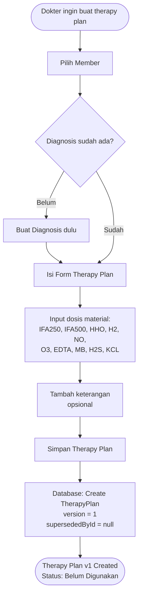
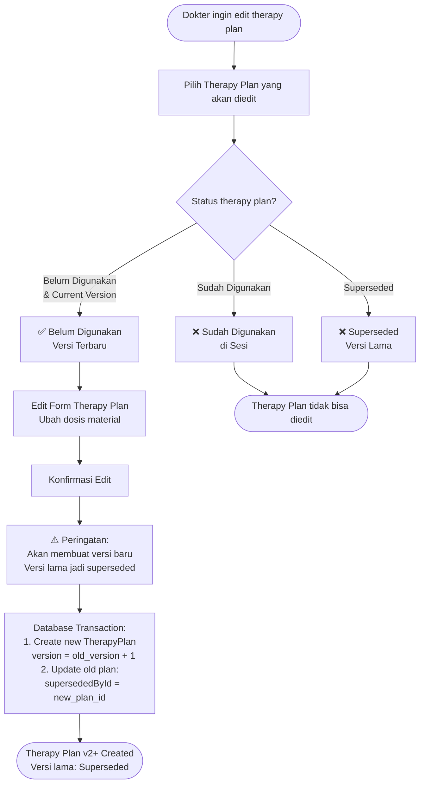
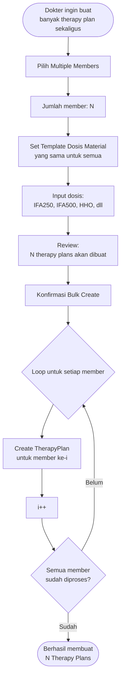
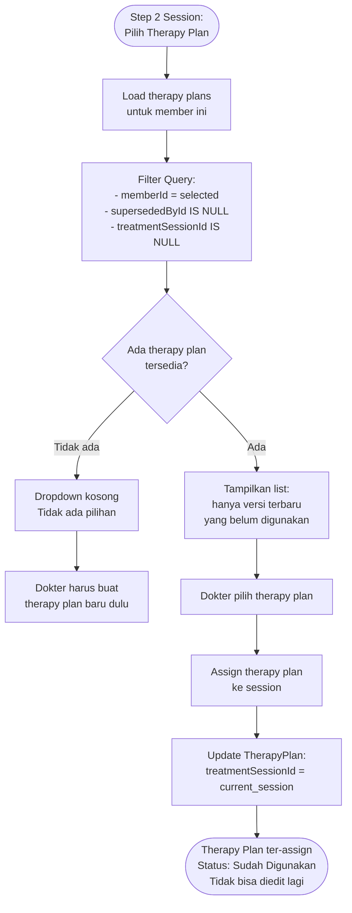

# Flow Therapy Plan & Sesi Terapi - RAHO ERP

**Tanggal**: 18 Juni 2026  
**Dokumentasi**: Flow diagram lengkap untuk Therapy Plan (dengan versioning) dan Sesi Terapi (8-step workflow)

---

## 📋 Daftar Isi

1. [Overview Therapy Plan & Session](#overview)
2. [Flow 1: Create Therapy Plan (Regular)](#flow-1-create-therapy-plan-regular)
3. [Flow 2: Edit Therapy Plan dengan Versioning](#flow-2-edit-therapy-plan-dengan-versioning)
4. [Flow 3: Bulk Therapy Plan Creation](#flow-3-bulk-therapy-plan-creation)
5. [Flow 4: Therapy Plan Selection untuk Session](#flow-4-therapy-plan-selection-untuk-session)
6. [Flow 5: Session Terapi 8-Step Workflow](#flow-5-session-terapi-8-step-workflow)
7. [Status & Rules](#status-dan-business-rules)

---

## Overview

### Therapy Plan
Therapy plan adalah rencana terapi yang dibuat oleh dokter, berisi dosis material infus (IFA250, IFA500, HHO, H2, NO, O3, EDTA, MB, H2S, KCL) yang akan digunakan dalam sesi treatment.

**Fitur Baru (13 Juni 2026):**
- ✅ **Versioning System**: Setiap edit membuat versi baru
- ✅ **Bulk Creation**: Buat banyak therapy plan sekaligus
- ✅ **Superseded Status**: Versi lama disimpan sebagai history

### Session Terapi
Session terapi adalah pelaksanaan treatment dengan workflow 8 langkah terstruktur yang melibatkan dokter dan perawat.

---

## Flow 1: Create Therapy Plan (Regular)

**Key Points:**
- Therapy plan bisa dibuat tanpa terkait session terlebih dahulu
- Versi pertama selalu v1
- Status awal: Belum Digunakan (available untuk dipilih di session)

---

## Flow 2: Edit Therapy Plan dengan Versioning

**Aturan Versioning:**
1. **Hanya versi terbaru yang belum digunakan** bisa diedit
2. Edit akan membuat **versi baru** (v2, v3, dst)
3. Versi lama otomatis jadi **Superseded**
4. Versi superseded **tidak bisa diedit** dan **tidak muncul** di dropdown session

---

## Flow 3: Bulk Therapy Plan Creation

**Keuntungan Bulk Creation:**
- Hemat waktu saat banyak member butuh therapy plan serupa
- Dosis material sama untuk semua
- Bisa pilih member dari berbagai diagnosis

---

## Flow 4: Therapy Plan Selection untuk Session

**Penting:**
- Dropdown **hanya menampilkan** versi terbaru (not superseded)
- Therapy plan yang sudah ter-assign **tidak muncul lagi** di session lain
- Versi lama (superseded) **tidak pernah muncul** di dropdown

---

## Flow 5: Session Terapi 8-Step Workflow

```mermaid
flowchart TD
    START([Admin Layanan<br/>Create Session])
    
    %% Preparation
    CREATE_ENC[Create Encounter<br/>Pilih Member & Package]
    CREATE_SESS[Create TreatmentSession<br/>Assign Dokter & Perawat]
    STATUS_SCHED[Status: SCHEDULED]
    
    %% Doctor Steps
    STEP1[STEP 1: Diagnosis<br/>👨‍⚕️ Dokter<br/>Input keluhan, diagnosis, ICD-10]
    
    STEP2[STEP 2: Therapy Plan<br/>👨‍⚕️ Dokter<br/>Pilih/buat therapy plan]
    
    %% Nurse Steps
    STEP3[STEP 3: Vital Signs Before<br/>👩‍⚕️ Perawat<br/>Tekanan darah, nadi, suhu, SpO2]
    
    STEP4[STEP 4: Infusion Execution<br/>👩‍⚕️ Perawat<br/>Waktu, kecepatan tetes]
    
    STEP5[STEP 5: Material Usage<br/>👩‍⚕️ Perawat<br/>Catat material terpakai<br/>→ Stok berkurang otomatis]
    
    STEP6[STEP 6: Session Photo<br/>👩‍⚕️ Perawat<br/>Upload foto dokumentasi]
    
    STEP7[STEP 7: Vital Signs After<br/>👩‍⚕️ Perawat<br/>Vital setelah treatment<br/>→ Perbandingan before/after]
    
    %% Doctor Final Step
    STEP8[STEP 8: Doctor Evaluation<br/>👨‍⚕️ Dokter<br/>SOAP: Subjective, Objective,<br/>Assessment, Plan]
    
    %% Completion
    STATUS_COMP[Status: COMPLETED<br/>isCompleted = true]
    UPDATE_PKG[Update MemberPackage:<br/>usedSessions++<br/>voucher--]
    
    SUCCESS([Session Selesai<br/>EMR Tersimpan])
    
    START --> CREATE_ENC
    CREATE_ENC --> CREATE_SESS
    CREATE_SESS --> STATUS_SCHED
    STATUS_SCHED --> STEP1
    
    STEP1 --> STEP2
    STEP2 --> STEP3
    STEP3 --> STEP4
    STEP4 --> STEP5
    STEP5 --> STEP6
    STEP6 --> STEP7
    STEP7 --> STEP8
    
    STEP8 --> STATUS_COMP
    STATUS_COMP --> UPDATE_PKG
    UPDATE_PKG --> SUCCESS
```

**Workflow Rules:**
- **Sequential**: Step harus berurutan, tidak bisa skip
- **Role-based**: Step 1,2,8 = Dokter | Step 3,4,5,6,7 = Perawat
- **Atomic**: Semua step harus selesai untuk complete session
- **Auto-update**: Stok dan voucher update otomatis saat complete

---

## Status dan Business Rules

### Status Therapy Plan

| Status | Indikator | Keterangan | Aksi Available |
|--------|-----------|------------|----------------|
| **Belum Digunakan** | 🟡 | Versi terbaru, belum di-assign ke session | ✏️ Edit, 🗑️ Delete |
| **Sudah Digunakan** | 🟢 | Sudah ter-assign ke session | 👁️ View only |
| **Superseded** | ⚪ ⚠️ | Versi lama yang sudah digantikan | 👁️ View only (history) |

### Business Rules

#### Therapy Plan:
1. ✅ Therapy plan bisa dibuat sebelum session (standalone)
2. ✅ 1 therapy plan hanya bisa digunakan untuk 1 session
3. ✅ Edit therapy plan = create new version + supersede old version
4. ✅ Versi superseded tidak muncul di dropdown session
5. ✅ Therapy plan yang sudah digunakan tidak bisa diedit/dihapus

#### Session:
1. ✅ Session harus sequential (step 1→2→3→...→8)
2. ✅ Session complete akan increment usedSessions di package
3. ✅ Material usage di Step 5 akan reduce inventory stock
4. ✅ Vital signs di Step 7 akan dibandingkan dengan Step 3
5. ✅ Doctor evaluation (Step 8) adalah langkah terakhir

#### Integration:
1. ✅ 1 Encounter bisa punya multiple sessions (jika paket > 1 sesi)
2. ✅ Therapy plan hanya required di Step 2
3. ✅ Setelah therapy plan assigned, tidak bisa diganti
4. ✅ Bulk therapy plan berguna untuk persiapan awal banyak member

---

## 📊 Statistik & Metrics

### Yang Bisa Ditrack:
- Total therapy plans created per doctor
- Total therapy plans edited (versioning count)
- Average dosis material per therapy type
- Completion rate per step dalam session workflow
- Time spent per step
- Material usage trends
- Vital signs trends (before vs after)

---

## 🔐 Permission & Role Access

| Role | Create TP | Edit TP | View TP | Bulk TP | Session Step 1-2,8 | Session Step 3-7 |
|------|-----------|---------|---------|---------|-------------------|-----------------|
| **DOCTOR** | ✅ | ✅ | ✅ | ✅ | ✅ | ❌ |
| **NURSE** | ❌ | ❌ | ✅ | ❌ | ❌ | ✅ |
| **ADMIN_LAYANAN** | ❌ | ❌ | ✅ | ❌ | ❌ (create session only) | ❌ |

---

## 💡 Best Practices

### Untuk Dokter:
1. **Buat therapy plan sebelum session** untuk efisiensi
2. **Gunakan bulk creation** jika banyak member dengan diagnosis serupa
3. **Review therapy plan lama** sebelum edit (cek history)
4. **Pastikan diagnosis lengkap** sebelum buat therapy plan

### Untuk Perawat:
1. **Catat vital signs akurat** di Step 3 dan 7
2. **Catat semua material** yang digunakan di Step 5
3. **Upload foto berkualitas** di Step 6 untuk dokumentasi
4. **Konfirmasi waktu infusi** tepat di Step 4

### Untuk Admin Layanan:
1. **Assign dokter dan perawat** yang tepat saat create session
2. **Pastikan paket aktif** sebelum create session
3. **Monitor progress** session melalui dashboard
4. **Follow up session** yang belum complete

---

**Dibuat oleh**: Kiro AI  
**Tanggal**: 18 Juni 2026  
**Versi**: 1.0
